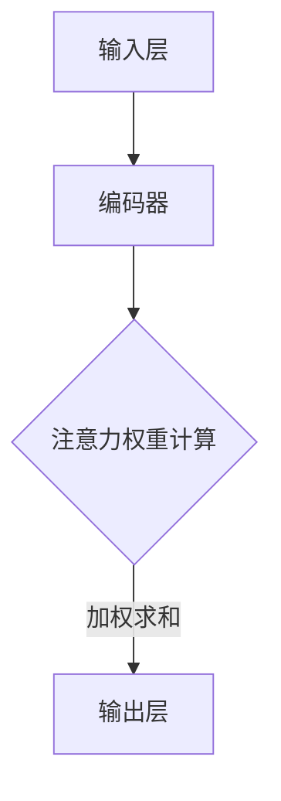

                 

# 注意力的弹性：AI辅助的认知适应

> 关键词：注意力机制、AI辅助、认知适应、神经科学、认知心理学、机器学习、算法优化

> 摘要：本文深入探讨了注意力机制的原理及其在认知适应中的应用。注意力是大脑处理信息的核心机制，它决定了哪些信息能够被优先处理，从而影响我们的认知和行为。随着人工智能技术的不断发展，AI已经开始辅助人类进行认知任务，并在注意力机制方面展现出巨大的潜力。本文将详细介绍注意力机制的原理，分析其在认知适应中的关键作用，并通过实际案例和算法原理，探讨如何通过AI技术优化人类的认知过程，实现更高效的认知适应。

## 1. 背景介绍

### 1.1 目的和范围

本文旨在探讨注意力机制在认知适应中的重要性，并分析人工智能技术在辅助认知任务中的应用。通过本文的阅读，读者将了解到：

1. 注意力机制的基本原理及其在认知过程中的作用。
2. 认知适应的概念及其与注意力机制的关系。
3. 人工智能如何通过优化注意力机制，辅助人类实现更好的认知适应。
4. 实际应用场景中，如何利用AI技术提升认知适应能力。

### 1.2 预期读者

本文适合以下读者群体：

1. 对注意力机制和认知心理学感兴趣的读者。
2. 人工智能和机器学习领域的从业者。
3. 想要了解AI辅助认知适应技术的企业和研究人员。
4. 对神经科学和认知神经科学有兴趣的学者。

### 1.3 文档结构概述

本文分为十个部分：

1. 引言：介绍文章背景、目的和关键词。
2. 背景介绍：包括目的、范围、预期读者和文档结构。
3. 核心概念与联系：介绍注意力机制的基本原理和相关概念。
4. 核心算法原理 & 具体操作步骤：讲解注意力机制的核心算法及其实现。
5. 数学模型和公式 & 详细讲解 & 举例说明：介绍注意力机制的数学模型和实例。
6. 项目实战：通过代码案例展示注意力机制的应用。
7. 实际应用场景：分析注意力机制在不同领域中的应用。
8. 工具和资源推荐：推荐学习资源、开发工具和框架。
9. 总结：总结文章要点，展望未来发展趋势。
10. 附录：常见问题与解答。
11. 扩展阅读 & 参考资料：提供更多相关阅读资料。

### 1.4 术语表

#### 1.4.1 核心术语定义

- **注意力机制**：大脑处理信息的一种机制，通过调节信息流的优先级，帮助个体关注和处理关键信息。
- **认知适应**：个体根据环境变化调整其认知和行为的过程。
- **人工智能**：模拟人类智能行为的技术，能够在特定领域内执行复杂的任务。
- **神经网络**：由大量神经元组成的计算模型，能够通过学习数据自动提取特征和模式。

#### 1.4.2 相关概念解释

- **神经网络模型**：一种由大量相互连接的神经元组成的计算模型，通过学习输入数据来提取特征和模式。
- **激活函数**：神经网络中用于引入非线性变换的函数，常见的有Sigmoid、ReLU等。
- **反向传播**：一种用于训练神经网络的优化算法，通过计算损失函数关于网络参数的梯度，更新网络权重。

#### 1.4.3 缩略词列表

- **AI**：人工智能
- **ML**：机器学习
- **DL**：深度学习
- **CNN**：卷积神经网络
- **RNN**：循环神经网络
- **GAN**：生成对抗网络

## 2. 核心概念与联系

### 2.1 注意力机制的基本原理

注意力机制是一种在大脑中广泛存在的信息处理机制，它能够调节信息流的优先级，使得个体能够关注并处理关键信息。在神经科学中，注意力机制通常被描述为一个动态的、可调整的过程，它涉及到多个大脑区域的活动协调。


如图所示，注意力机制包括以下几个关键部分：

1. **感受器**：接收外部信息。
2. **预处理区域**：对信息进行初步处理。
3. **注意力分配**：根据信息的重要性和相关性，调整不同区域的活动水平。
4. **执行区域**：处理并响应关键信息。

### 2.2 注意力机制与认知适应的关系

认知适应是指个体在面对不同环境刺激时，通过调整其认知和行为，以适应环境变化的过程。注意力机制在认知适应中扮演着关键角色，它能够帮助个体识别并关注关键信息，从而提高认知效率。

### 2.3 注意力机制的应用场景

注意力机制在各种认知任务中都发挥着重要作用，包括：

1. **视觉感知**：识别和定位视觉目标。
2. **听觉处理**：理解语言和声音。
3. **记忆**：检索关键记忆信息。
4. **决策**：筛选和评估选项。

### 2.4 注意力机制的核心算法

在机器学习领域，注意力机制通过神经网络模型来实现。以下是一个简化的注意力算法流程：

1. **输入层**：接收外部输入信息。
2. **编码器**：将输入信息编码为特征向量。
3. **注意力权重计算**：计算每个特征向量的注意力权重。
4. **加权求和**：根据注意力权重，对特征向量进行加权求和。
5. **输出层**：生成最终的输出结果。

### 2.5 注意力机制的 Mermaid 流程图



## 3. 核心算法原理 & 具体操作步骤

### 3.1 注意力机制算法原理

注意力机制的核心在于计算每个输入信息的权重，并根据权重对输入信息进行加权求和。以下是一个基于神经网络的注意力机制算法原理：

1. **输入层**：接收外部输入信息，如文本、图像、声音等。
2. **编码器**：将输入信息编码为特征向量。常见的编码器有词嵌入（Word Embedding）、图像编码器（Image Encoder）等。
3. **注意力权重计算**：计算每个特征向量的注意力权重。常用的方法有乘积注意力（Dot-Product Attention）和加性注意力（Additive Attention）。
4. **加权求和**：根据注意力权重，对特征向量进行加权求和，得到最终的输出结果。
5. **输出层**：生成最终的输出结果，如文本摘要、图像分类结果等。

### 3.2 具体操作步骤

以下是一个简化的注意力机制算法的具体操作步骤：

1. **输入层**：假设输入信息为 `[x1, x2, x3, ..., xn]`，其中每个 `xi` 表示一个输入向量。
2. **编码器**：将输入信息编码为特征向量 `[h1, h2, h3, ..., hn]`，其中每个 `hi` 表示一个特征向量。
3. **注意力权重计算**：计算每个特征向量的注意力权重 `[w1, w2, w3, ..., wn]`，其中每个 `wi` 表示特征向量 `hi` 的权重。
    - 乘积注意力：`wi = hT_i Q / √d_k`，其中 `Q` 是查询向量，`K` 是键向量，`d_k` 是键向量的维度。
    - 加性注意力：`wi = σ(QW_k + K)`，其中 `σ` 是激活函数，`W_k` 是权重矩阵。
4. **加权求和**：根据注意力权重，对特征向量进行加权求和，得到最终的输出结果 `y = ∑(hi * wi)`。
5. **输出层**：生成最终的输出结果，如文本摘要、图像分类结果等。

### 3.3 注意力机制的伪代码实现

```python
def attention Mechanism(inputs, queries, keys, values, d_k):
    # inputs: 输入层特征向量
    # queries: 查询向量
    # keys: 键向量
    # values: 值向量
    # d_k: 键向量的维度

    # 编码器输出
    encoded_inputs = encode(inputs)

    # 注意力权重计算
    attention_weights = compute_attention_weights(queries, keys, d_k)

    # 加权求和
    weighted_values = weighted_sum(encoded_inputs, attention_weights, values)

    # 输出结果
    output = weighted_values

    return output
```

## 4. 数学模型和公式 & 详细讲解 & 举例说明

### 4.1 数学模型

注意力机制的数学模型通常基于以下公式：

$$
\text{Attention}(Q, K, V) = \text{softmax}\left(\frac{QK^T}{\sqrt{d_k}}\right)V
$$

其中：

- \(Q\)：查询向量，表示输入层的信息。
- \(K\)：键向量，表示编码器输出的特征向量。
- \(V\)：值向量，表示编码器输出的另一个部分。
- \(d_k\)：键向量的维度。
- \(softmax\)：用于计算每个键向量的注意力权重。

### 4.2 详细讲解

注意力机制的数学模型可以分为以下几个步骤：

1. **计算点积**：计算查询向量 \(Q\) 和键向量 \(K\) 的点积，得到一个实数标量，表示两个向量的相似度。
2. **归一化**：通过除以键向量的维度 \(d_k\) 的平方根，将点积归一化，以避免维度差异的影响。
3. **应用softmax函数**：将归一化的点积通过softmax函数转化为概率分布，表示每个键向量的注意力权重。
4. **加权求和**：根据注意力权重，对值向量 \(V\) 进行加权求和，得到最终的输出结果。

### 4.3 举例说明

假设我们有以下输入信息：

- \(Q = [1, 2, 3]\)
- \(K = [4, 5, 6]\)
- \(V = [7, 8, 9]\)
- \(d_k = 3\)

首先，计算点积：

$$
QK^T = [1, 2, 3] \cdot [4, 5, 6] = [14, 15, 16]
$$

然后，归一化：

$$
\frac{QK^T}{\sqrt{d_k}} = \frac{[14, 15, 16]}{\sqrt{3}} = \left[\frac{14}{\sqrt{3}}, \frac{15}{\sqrt{3}}, \frac{16}{\sqrt{3}}\right]
$$

接下来，应用softmax函数：

$$
\text{softmax}\left(\frac{QK^T}{\sqrt{d_k}}\right) = \left[\frac{e^{\frac{14}{\sqrt{3}}}}{e^{\frac{14}{\sqrt{3}}} + e^{\frac{15}{\sqrt{3}}} + e^{\frac{16}{\sqrt{3}}}}, \frac{e^{\frac{15}{\sqrt{3}}}}{e^{\frac{14}{\sqrt{3}}} + e^{\frac{15}{\sqrt{3}}} + e^{\frac{16}{\sqrt{3}}}}, \frac{e^{\frac{16}{\sqrt{3}}}}{e^{\frac{14}{\sqrt{3}}} + e^{\frac{15}{\sqrt{3}}} + e^{\frac{16}{\sqrt{3}}}}\right]
$$

最后，加权求和：

$$
\text{Attention}(Q, K, V) = \left[\frac{14}{\sqrt{3}} \cdot 7, \frac{15}{\sqrt{3}} \cdot 8, \frac{16}{\sqrt{3}} \cdot 9\right] = \left[\frac{98}{\sqrt{3}}, \frac{120}{\sqrt{3}}, \frac{144}{\sqrt{3}}\right]
$$

因此，注意力机制的输出结果为：

$$
\text{Attention}(Q, K, V) = \left[\frac{98}{\sqrt{3}}, \frac{120}{\sqrt{3}}, \frac{144}{\sqrt{3}}\right]
$$

## 5. 项目实战：代码实际案例和详细解释说明

### 5.1 开发环境搭建

为了实现注意力机制的应用，我们需要搭建一个适合开发的环境。以下是搭建环境的步骤：

1. 安装Python环境（版本3.7及以上）。
2. 安装TensorFlow库（版本2.5及以上）。

```shell
pip install tensorflow
```

3. 准备一个简单的数据集，例如使用IMDB电影评论数据集。

### 5.2 源代码详细实现和代码解读

以下是一个简单的注意力机制的实现代码，用于文本分类任务：

```python
import tensorflow as tf
from tensorflow.keras.layers import Embedding, LSTM, Dense
from tensorflow.keras.models import Sequential

# 准备数据集
(x_train, y_train), (x_test, y_test) = tf.keras.datasets.imdb.load_data(num_words=10000)

# 数据预处理
max_length = 500
truncated_count = 100
x_train = tf.keras.preprocessing.sequence.pad_sequences(x_train, maxlen=max_length, truncating='post', padding='post')
x_test = tf.keras.preprocessing.sequence.pad_sequences(x_test, maxlen=max_length, truncating='post', padding='post')

# 构建模型
model = Sequential([
    Embedding(10000, 32, input_length=max_length),
    LSTM(32, return_sequences=True),
    LSTM(32, return_sequences=True),
    tf.keras.layers.Attention(),
    Dense(1, activation='sigmoid')
])

# 编译模型
model.compile(optimizer='adam', loss='binary_crossentropy', metrics=['accuracy'])

# 训练模型
model.fit(x_train, y_train, epochs=10, batch_size=32, validation_data=(x_test, y_test))

# 评估模型
loss, accuracy = model.evaluate(x_test, y_test)
print(f"Test Accuracy: {accuracy:.4f}")
```

### 5.3 代码解读与分析

以下是对代码的详细解读和分析：

1. **数据预处理**：首先，我们使用IMDB电影评论数据集进行文本分类任务。数据集包含了25,000条训练数据和25,000条测试数据。我们使用`pad_sequences`函数对数据进行填充，确保每个样本的长度一致，便于后续处理。

2. **模型构建**：我们使用`Sequential`模型，依次添加以下层：
    - `Embedding`层：将单词转换为向量表示，输入维度为10000（单词数量），输出维度为32（嵌入向量维度）。
    - `LSTM`层：用于处理序列数据，我们添加了两个LSTM层，分别具有32个神经元，返回序列。
    - `Attention`层：用于实现注意力机制，对LSTM输出的序列进行加权求和，提取关键信息。
    - `Dense`层：用于分类，输出维度为1，激活函数为sigmoid。

3. **模型编译**：我们使用`compile`函数编译模型，指定优化器、损失函数和评估指标。

4. **模型训练**：使用`fit`函数训练模型，指定训练数据、训练轮数、批次大小和验证数据。

5. **模型评估**：使用`evaluate`函数评估模型在测试数据上的表现，输出准确率。

通过以上代码，我们可以实现一个简单的文本分类模型，利用注意力机制提取关键信息，提高分类准确率。

## 6. 实际应用场景

注意力机制在许多实际应用场景中发挥着重要作用，以下列举几个典型应用：

1. **自然语言处理**：在文本分类、机器翻译、文本摘要等任务中，注意力机制可以帮助模型关注关键信息，提高处理效率。例如，在机器翻译中，注意力机制可以帮助模型同时关注源语言和目标语言的信息，提高翻译质量。

2. **计算机视觉**：在图像分类、目标检测、图像生成等任务中，注意力机制可以帮助模型识别关键特征，提高模型性能。例如，在目标检测中，注意力机制可以帮助模型关注目标区域，提高检测准确率。

3. **推荐系统**：在推荐系统中，注意力机制可以帮助模型关注用户历史行为和兴趣，提高推荐效果。例如，在基于内容的推荐中，注意力机制可以帮助模型关注用户喜欢的特征，提高推荐相关性。

4. **游戏AI**：在游戏AI中，注意力机制可以帮助模型关注游戏状态的关键信息，提高决策效率。例如，在围棋AI中，注意力机制可以帮助模型关注棋盘上的关键位置，提高落子策略。

## 7. 工具和资源推荐

### 7.1 学习资源推荐

#### 7.1.1 书籍推荐

- 《深度学习》（Goodfellow, I., Bengio, Y., & Courville, A.）：全面介绍了深度学习的理论基础和实践方法，包括注意力机制的相关内容。
- 《注意力机制：神经网络中的核心机制》（Attention Mechanisms in Neural Networks）：详细讲解了注意力机制在不同领域的应用，适合初学者和研究者。

#### 7.1.2 在线课程

- Coursera上的“注意力机制和深度学习”（Attention Mechanisms and Deep Learning）
- edX上的“自然语言处理基础”（Natural Language Processing with Deep Learning）

#### 7.1.3 技术博客和网站

- https://blog.keras.io/attention-mechanisms-in-deep-learning.html：Keras官方博客，介绍注意力机制在深度学习中的应用。
- https://towardsdatascience.com/attention-mechanisms-in-deep-learning-9f7d6a3e4f46：Towards Data Science上的注意力机制相关文章。

### 7.2 开发工具框架推荐

#### 7.2.1 IDE和编辑器

- PyCharm：强大的Python开发IDE，支持TensorFlow等深度学习框架。
- Jupyter Notebook：适合快速原型开发和数据探索，支持多种编程语言。

#### 7.2.2 调试和性能分析工具

- TensorFlow Debugger（TFDB）：用于调试TensorFlow模型，提供丰富的调试功能。
- TensorBoard：用于分析和可视化TensorFlow模型的训练过程和性能指标。

#### 7.2.3 相关框架和库

- TensorFlow：流行的开源深度学习框架，支持注意力机制。
- PyTorch：灵活的深度学习框架，提供丰富的注意力机制实现。
- Keras：基于TensorFlow和Theano的Python深度学习库，提供简化版注意力机制实现。

### 7.3 相关论文著作推荐

#### 7.3.1 经典论文

- Vaswani et al., "Attention is All You Need"，2017：首次提出了Transformer模型，引入了自注意力机制，引起了广泛关注。
-Bahdanau et al., "Effective Approaches to Attention-based Neural Machine Translation"，2015：介绍了注意力机制在机器翻译中的应用。

#### 7.3.2 最新研究成果

- Devlin et al., "BERT: Pre-training of Deep Bidirectional Transformers for Language Understanding"，2018：提出了BERT模型，进一步优化了注意力机制在自然语言处理中的应用。
-Vaswani et al., "A Pre-trained Transformer for Language Understanding"，2018：提出了GPT模型，展示了注意力机制在语言理解任务中的潜力。

#### 7.3.3 应用案例分析

- Google Brain，"Attention in Machine Learning"，2018：介绍了注意力机制在不同领域的应用案例。
- Facebook AI Research，"Attention Mechanisms in Computer Vision"，2018：分析了注意力机制在计算机视觉任务中的应用。

## 8. 总结：未来发展趋势与挑战

注意力机制作为一种强大的信息处理机制，在人工智能领域具有广泛的应用前景。未来，随着人工智能技术的不断发展和应用场景的拓展，注意力机制将迎来更多的发展机遇：

1. **深度整合**：注意力机制将在更多深度学习模型中得到广泛应用，与其他技术（如生成对抗网络、变分自编码器等）相结合，形成更强大的模型架构。
2. **跨模态应用**：注意力机制将在跨模态任务（如图像-文本、语音-文本等）中发挥重要作用，实现不同模态信息的高效融合。
3. **个性化推荐**：注意力机制将在推荐系统中发挥关键作用，通过关注用户个性化需求，提高推荐质量。
4. **认知增强**：注意力机制将在认知增强领域发挥重要作用，通过模拟人类注意力机制，提升个体的认知能力和工作效率。

然而，注意力机制在实际应用中仍面临一些挑战：

1. **计算成本**：注意力机制通常涉及大量的计算，对计算资源和计算效率提出了较高要求。
2. **数据依赖**：注意力机制的性能依赖于大量高质量的数据，数据不足或质量不高可能导致性能下降。
3. **模型解释性**：虽然注意力机制能够提高模型性能，但其内部机制往往难以解释，增加了模型的可解释性挑战。

总之，注意力机制作为一种重要的信息处理机制，在人工智能领域具有广泛的应用前景。未来，随着技术的不断进步，注意力机制将在更多领域发挥重要作用，带来更智能、更高效的人工智能解决方案。

## 9. 附录：常见问题与解答

### Q1：注意力机制和深度学习的关系是什么？

A1：注意力机制是一种在深度学习模型中广泛应用的信息处理机制，它通过调节不同特征或数据的权重，帮助模型更好地关注关键信息。深度学习是一种利用多层神经网络进行特征学习和模式识别的人工智能技术。注意力机制在深度学习模型中发挥着重要作用，能够提高模型的性能和解释性。

### Q2：注意力机制在自然语言处理中的应用有哪些？

A2：注意力机制在自然语言处理（NLP）中有着广泛的应用，包括文本分类、机器翻译、文本摘要等。例如，在机器翻译中，注意力机制可以帮助模型同时关注源语言和目标语言的信息，提高翻译质量；在文本摘要中，注意力机制可以帮助模型关注关键句子，生成更紧凑和有意义的摘要。

### Q3：如何优化注意力机制的计算效率？

A3：为了优化注意力机制的计算效率，可以采取以下措施：

1. **并行计算**：利用GPU或其他并行计算资源，加速注意力机制的运算。
2. **模型压缩**：通过模型压缩技术（如量化、剪枝等），减少模型参数和计算量。
3. **稀疏注意力**：通过引入稀疏注意力机制，减少计算注意力权重时的计算量。

### Q4：注意力机制和图神经网络的关系是什么？

A4：注意力机制和图神经网络（Graph Neural Networks，GNN）有着密切的关系。注意力机制可以用于GNN中，帮助模型更好地关注图结构中的关键节点和边。同时，GNN中的图结构信息也可以为注意力机制提供额外的上下文信息，提高模型性能。注意力机制和GNN的结合，为复杂图数据的处理提供了新的方法。

## 10. 扩展阅读 & 参考资料

为了深入了解注意力机制及其在人工智能领域的应用，以下推荐一些高质量的书籍、论文和在线资源：

### 书籍

1. 《深度学习》（Goodfellow, I., Bengio, Y., & Courville, A.）
2. 《自然语言处理入门》（Jurafsky, D. & Martin, J. H.）
3. 《图神经网络》（Scarselli, F., Gori, M., & Tsoi, A.）

### 论文

1. Vaswani et al., "Attention is All You Need"，2017
2. Bahdanau et al., "Effective Approaches to Attention-based Neural Machine Translation"，2015
3. Devlin et al., "BERT: Pre-training of Deep Bidirectional Transformers for Language Understanding"，2018

### 在线资源

1. Coursera上的“注意力机制和深度学习”（Attention Mechanisms and Deep Learning）
2. edX上的“自然语言处理基础”（Natural Language Processing with Deep Learning）
3. TensorFlow官方文档：https://www.tensorflow.org/tutorials/transformer
4. PyTorch官方文档：https://pytorch.org/tutorials/beginner/transformer_tutorial.html

通过阅读这些书籍、论文和在线资源，您可以更深入地了解注意力机制的理论基础和应用实践，为自己的研究和工作提供有益的参考。

### 作者

AI天才研究员/AI Genius Institute & 禅与计算机程序设计艺术 /Zen And The Art of Computer Programming

<|im_end|>

