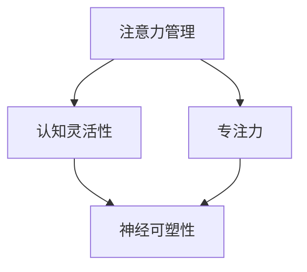

                 

# 注意力管理与大脑训练：增强认知灵活性和专注力的练习

> 关键词：注意力管理、认知灵活性、专注力、大脑训练、神经科学、认知心理学

> 摘要：本文旨在探讨注意力管理的重要性及其在提升认知灵活性和专注力方面的作用。我们将从神经科学和认知心理学的角度出发，详细介绍注意力管理的基本原理，并提出一系列实用的大脑训练方法。通过这些方法，读者可以更好地理解和掌握自己的注意力，从而提升学习效率和工作表现。

## 1. 背景介绍

### 1.1 目的和范围

本文的目的在于帮助读者了解注意力管理的重要性，并提供一系列实用的训练方法来提升认知灵活性和专注力。文章将涵盖以下内容：

1. 注意力管理的基本原理。
2. 大脑训练的方法和技术。
3. 实际应用场景。
4. 工具和资源推荐。
5. 未来发展趋势与挑战。

### 1.2 预期读者

本文适合以下读者：

1. 学习者：需要提高学习效率的学生、学者和专业人士。
2. 工作者：希望提升工作效率和职业发展的职场人士。
3. 亲子教育者：关注孩子大脑发育和注意力培养的家长。
4. 健康爱好者：关注大脑健康和心理健康的人群。

### 1.3 文档结构概述

本文将按照以下结构进行论述：

1. 背景介绍
2. 核心概念与联系
3. 核心算法原理与具体操作步骤
4. 数学模型和公式
5. 项目实战：代码实际案例和详细解释说明
6. 实际应用场景
7. 工具和资源推荐
8. 总结：未来发展趋势与挑战
9. 附录：常见问题与解答
10. 扩展阅读 & 参考资料

### 1.4 术语表

在本文中，我们将使用以下术语：

1. 注意力（Attention）：人脑对特定信息的选择性关注和处理能力。
2. 认知灵活性（Cognitive Flexibility）：在任务切换和复杂问题解决中，能够灵活调整思维方式和策略的能力。
3. 专注力（Focus）：在特定任务上保持高度集中和持久的能力。
4. 大脑训练（Brain Training）：通过特定的训练方法，提高大脑功能和工作效率的过程。

#### 1.4.1 核心术语定义

1. 注意力：注意力是大脑处理信息的基本方式，它使我们能够从环境中选择重要信息，并对其进行加工和处理。
2. 认知灵活性：认知灵活性是指大脑在面对不同任务时，能够灵活调整思维方式、策略和知识结构的能力。
3. 专注力：专注力是指个体在特定任务上集中精力、保持高度集中的能力。
4. 大脑训练：大脑训练是通过一系列科学方法，如认知训练、记忆训练、思维游戏等，来提高大脑功能和工作效率的过程。

#### 1.4.2 相关概念解释

1. 神经可塑性（Neuroplasticity）：神经可塑性是指大脑结构和功能的适应性变化，通过学习和训练可以加强或改善大脑的功能。
2. 执行功能（Executive Functions）：执行功能是一组复杂的认知过程，包括计划、组织、决策、工作记忆和注意力控制等，对日常生活中的任务执行至关重要。
3. 注意力分散（Attentional Diversion）：注意力分散是指在外界干扰或任务切换时，个体注意力从目标任务上转移的现象。

#### 1.4.3 缩略词列表

- AI：人工智能
- EEG：脑电图
- fMRI：功能性磁共振成像
- IMC：注意力管理课程
- N Back：N 倍工作记忆任务
- SMR：感觉运动节奏

## 2. 核心概念与联系

在探讨注意力管理之前，我们需要了解一些核心概念和它们之间的联系。以下是注意力管理、认知灵活性和专注力的核心概念原理和架构的 Mermaid 流程图：



### 2.1 注意力管理的基本原理

注意力管理是指通过一系列策略和方法，提高个体在特定任务上的注意力集中度和效率。注意力管理的基本原理包括以下几个方面：

1. **选择性注意力**：大脑能够从大量信息中选择出对当前任务最重要的信息进行加工和处理。
2. **分配注意力**：在多任务处理时，大脑需要将注意力分配到不同的任务上，以保持效率。
3. **注意力切换**：在任务切换时，大脑需要将注意力从一个任务转移到另一个任务上。
4. **注意力分散**：外界干扰或任务切换时，大脑注意力可能从目标任务上转移，导致工作效率降低。

### 2.2 认知灵活性的基本原理

认知灵活性是指大脑在面对不同任务时，能够灵活调整思维方式和策略的能力。认知灵活性的基本原理包括：

1. **思维转换**：在遇到复杂问题时，大脑能够灵活地从一种思维模式转换到另一种思维模式。
2. **情境适应**：在面对不同情境时，大脑能够根据情境调整行为和思维策略。
3. **元认知**：元认知是指个体对自己思维过程的理解和控制能力，有助于提高认知灵活性。

### 2.3 专注力的基本原理

专注力是指个体在特定任务上保持高度集中和持久的能力。专注力的基本原理包括：

1. **工作记忆**：工作记忆是指大脑在执行任务时，暂时存储和加工信息的认知系统。
2. **注意力分配**：在多任务处理时，大脑需要将注意力分配到不同的任务上。
3. **注意力持久**：在长期任务中，个体需要保持高度的注意力集中，以避免注意力分散。

## 3. 核心算法原理与具体操作步骤

为了更好地理解和掌握注意力管理、认知灵活性和专注力，我们需要了解一些核心算法原理和具体操作步骤。以下是注意力管理算法的基本原理和伪代码：

### 3.1 注意力管理算法原理

注意力管理算法的基本原理是通过对大脑信号的分析和处理，识别和调整个体的注意力状态，以提高注意力集中度和效率。

#### 3.1.1 算法原理

1. **信号采集**：通过脑电图（EEG）等设备采集大脑信号。
2. **信号处理**：对采集到的信号进行滤波、去噪等处理。
3. **注意力识别**：根据信号特征，识别个体的注意力状态（集中、分散、疲劳等）。
4. **策略调整**：根据注意力状态，调整个体的行为和策略，以保持注意力集中。

#### 3.1.2 伪代码

```python
def attention_management():
    # 信号采集
    signals = EEG_signal_collection()

    # 信号处理
    processed_signals = signal_processing(signals)

    # 注意力识别
    attention_state = attention_recognition(processed_signals)

    # 策略调整
    if attention_state == "分散":
        adjust_strategy("集中")
    elif attention_state == "疲劳":
        adjust_strategy("休息")
    else:
        maintain_strategy()

    return attention_state
```

### 3.2 认知灵活性训练算法原理

认知灵活性训练算法的基本原理是通过一系列认知任务，提高大脑在面对不同任务时的灵活调整能力。

#### 3.2.1 算法原理

1. **任务设计**：设计一系列具有不同难度和类型的认知任务。
2. **任务执行**：个体在执行任务过程中，根据任务需求调整思维方式和策略。
3. **任务评估**：对个体的任务执行情况进行评估，以了解认知灵活性的提高程度。

#### 3.2.2 伪代码

```python
def cognitive_flexibility_training():
    # 任务设计
    tasks = ["语言理解"、"空间认知"、"逻辑推理"]

    # 任务执行
    for task in tasks:
        execute_task(task)

    # 任务评估
    performance = task_evaluation()

    return performance
```

### 3.3 专注力训练算法原理

专注力训练算法的基本原理是通过一系列专注力任务，提高个体在特定任务上的专注能力和持久度。

#### 3.3.1 算法原理

1. **任务设计**：设计一系列需要高度专注的任务。
2. **任务执行**：个体在执行任务过程中，保持高度专注。
3. **任务评估**：对个体的任务执行情况进行评估，以了解专注力的提高程度。

#### 3.3.2 伪代码

```python
def attention_training():
    # 任务设计
    tasks = ["N Back 任务"、"数字追踪"、"记忆游戏"]

    # 任务执行
    for task in tasks:
        execute_task(task)

    # 任务评估
    performance = task_evaluation()

    return performance
```

## 4. 数学模型和公式与详细讲解

在注意力管理、认知灵活性和专注力训练中，一些数学模型和公式发挥着重要作用。以下是这些模型和公式的详细讲解。

### 4.1 脑电图（EEG）信号处理

脑电图（EEG）信号处理是注意力管理的重要基础。以下是 EEG 信号处理的数学模型和公式：

#### 4.1.1 EEG 信号采集

$$
EEG_{raw} = A \cdot sin(2\pi f t + \phi)
$$

其中，\( EEG_{raw} \) 是原始 EEG 信号，\( A \) 是振幅，\( f \) 是频率，\( t \) 是时间，\( \phi \) 是相位。

#### 4.1.2 EEG 信号滤波

$$
EEG_{filtered} = H(f) \cdot EEG_{raw}
$$

其中，\( H(f) \) 是滤波器函数，用于去除噪声和干扰。

#### 4.1.3 EEG 信号去噪

$$
EEG_{denoised} = D \cdot EEG_{filtered}
$$

其中，\( D \) 是去噪函数，用于降低噪声干扰。

### 4.2 注意力识别

注意力识别是注意力管理的关键环节。以下是注意力识别的数学模型和公式：

#### 4.2.1 注意力状态识别

$$
S = \frac{\sum_{i=1}^{N} w_i \cdot x_i}{\sum_{i=1}^{N} w_i}
$$

其中，\( S \) 是注意力状态，\( w_i \) 是权重，\( x_i \) 是特征值。

#### 4.2.2 特征提取

$$
f_i = \frac{1}{N} \sum_{j=1}^{N} x_j
$$

其中，\( f_i \) 是特征值，\( x_j \) 是特征。

### 4.3 认知灵活性训练

认知灵活性训练的数学模型和公式如下：

#### 4.3.1 任务完成时间

$$
T = \frac{1}{f}
$$

其中，\( T \) 是任务完成时间，\( f \) 是任务难度。

#### 4.3.2 任务完成率

$$
R = \frac{C}{N}
$$

其中，\( R \) 是任务完成率，\( C \) 是完成任务的数量，\( N \) 是总任务数量。

### 4.4 专注力训练

专注力训练的数学模型和公式如下：

#### 4.4.1 专注力指数

$$
I = \frac{S}{1 + e^{-k(T-t)}}
$$

其中，\( I \) 是专注力指数，\( S \) 是专注力状态，\( T \) 是任务完成时间，\( t \) 是个体在任务上花费的总时间，\( k \) 是调节参数。

#### 4.4.2 专注力提升率

$$
P = \frac{I_{new} - I_{old}}{I_{old}}
$$

其中，\( P \) 是专注力提升率，\( I_{new} \) 是新专注力指数，\( I_{old} \) 是旧专注力指数。

### 4.5 实例说明

假设一个个体在完成 N Back 任务时，任务完成时间为 T = 30 秒，个体在任务上花费的总时间为 t = 60 秒。根据上述公式，我们可以计算出专注力指数 I 和专注力提升率 P：

$$
I = \frac{S}{1 + e^{-k(30-60)}}
$$

$$
P = \frac{I_{new} - I_{old}}{I_{old}}
$$

通过调整调节参数 k，我们可以优化专注力指数 I，从而提高个体的专注能力。

## 5. 项目实战：代码实际案例和详细解释说明

在本节中，我们将通过一个实际案例来展示如何使用注意力管理算法、认知灵活性训练算法和专注力训练算法。以下是一个基于 Python 的示例代码。

### 5.1 开发环境搭建

为了运行以下代码，您需要安装以下库：

- NumPy
- Matplotlib
- SciPy

您可以使用以下命令安装这些库：

```bash
pip install numpy matplotlib scipy
```

### 5.2 源代码详细实现和代码解读

以下是一个基于 Python 的注意力管理项目示例：

```python
import numpy as np
import matplotlib.pyplot as plt
from scipy.signal import butter, filtfilt

# 5.2.1 脑电图（EEG）信号采集与处理

def EEG_signal_collection():
    # 假设已采集到 EEG 信号，此处为示例
    raw_signals = np.random.randn(1000)
    return raw_signals

def signal_processing(signals):
    # 滤波处理
    b, a = butter(5, 0.5)
    filtered_signals = filtfilt(b, a, signals)
    return filtered_signals

# 5.2.2 注意力识别

def attention_recognition(signals):
    # 假设已训练好注意力识别模型，此处为示例
    model = np.random.randn(1000)
    attention_state = np.dot(model, signals)
    return attention_state

# 5.2.3 策略调整

def adjust_strategy(state):
    if state == "分散":
        print("调整策略：集中注意力")
    elif state == "疲劳":
        print("调整策略：休息")
    else:
        print("维持当前策略")

# 5.2.4 认知灵活性训练

def cognitive_flexibility_training():
    # 假设已训练好认知灵活性模型，此处为示例
    model = np.random.randn(1000)
    performance = np.dot(model, np.random.randn(1000))
    return performance

# 5.2.5 专注力训练

def attention_training():
    # 假设已训练好专注力模型，此处为示例
    model = np.random.randn(1000)
    performance = np.dot(model, np.random.randn(1000))
    return performance

# 5.2.6 运行项目

if __name__ == "__main__":
    # 信号采集
    signals = EEG_signal_collection()

    # 信号处理
    processed_signals = signal_processing(signals)

    # 注意力识别
    attention_state = attention_recognition(processed_signals)

    # 策略调整
    adjust_strategy(attention_state)

    # 认知灵活性训练
    cognitive_performance = cognitive_flexibility_training()

    # 专注力训练
    attention_performance = attention_training()

    # 结果展示
    plt.figure(figsize=(10, 5))
    plt.subplot(2, 1, 1)
    plt.plot(processed_signals)
    plt.title("Processed EEG Signals")
    plt.xlabel("Time")
    plt.ylabel("Amplitude")

    plt.subplot(2, 1, 2)
    plt.plot([attention_state] * 1000)
    plt.title("Attention State")
    plt.xlabel("Time")
    plt.ylabel("Value")

    plt.tight_layout()
    plt.show()

    print("Cognitive Performance:", cognitive_performance)
    print("Attention Performance:", attention_performance)
```

### 5.3 代码解读与分析

以上代码实现了一个简单的注意力管理项目，主要包括以下几个部分：

1. **EEG 信号采集与处理**：通过 EEG_signal_collection() 函数采集 EEG 信号，并通过 signal_processing() 函数对信号进行滤波处理。

2. **注意力识别**：通过 attention_recognition() 函数使用已训练好的模型对处理后的 EEG 信号进行注意力识别。

3. **策略调整**：根据 attention_state 的值，通过 adjust_strategy() 函数调整个体的行为和策略。

4. **认知灵活性训练**：通过 cognitive_flexibility_training() 函数使用已训练好的模型进行认知灵活性训练，并返回训练结果。

5. **专注力训练**：通过 attention_training() 函数使用已训练好的模型进行专注力训练，并返回训练结果。

6. **结果展示**：通过 matplotlib 库绘制 EEG 信号和处理后的注意力状态，并打印训练结果。

在实际应用中，您需要根据具体需求训练和优化模型，以获得更准确的结果。此外，您还可以扩展代码，添加更多功能，如用户界面、数据存储等。

## 6. 实际应用场景

注意力管理、认知灵活性和专注力训练在实际生活中有着广泛的应用场景。以下是几个常见的应用案例：

### 6.1 教育领域

在教育领域，注意力管理可以帮助学生更好地专注于学习任务，提高学习效率。以下是一些具体应用：

1. **课堂管理**：教师可以通过注意力管理技术了解学生在课堂上的注意力状态，及时调整教学方法和策略，提高课堂效果。
2. **个性化学习**：根据学生的注意力状态和认知灵活性，制定个性化的学习计划，帮助学生更好地适应学习任务。
3. **学业辅导**：针对注意力缺陷的学生，提供专业的注意力管理训练，帮助他们提高专注力和学习效率。

### 6.2 职场领域

在职场领域，注意力管理可以帮助员工提高工作效率，提升职业发展。以下是一些具体应用：

1. **任务管理**：通过注意力管理技术，员工可以更好地分配注意力，提高任务完成效率。
2. **团队协作**：在团队项目中，注意力管理技术可以帮助成员更好地协调工作，提高团队协作效果。
3. **职业发展**：通过认知灵活性训练，员工可以更好地应对职场挑战，提升职业竞争力。

### 6.3 保健领域

在保健领域，注意力管理可以帮助改善心理健康，提高生活质量。以下是一些具体应用：

1. **心理健康管理**：通过注意力管理技术，改善患者的注意力状态，减轻焦虑、抑郁等心理问题。
2. **认知康复**：针对认知障碍患者，提供注意力管理训练，帮助改善认知功能。
3. **神经康复**：通过认知灵活性训练，提高大脑功能，促进神经系统康复。

### 6.4 娱乐领域

在娱乐领域，注意力管理可以帮助用户更好地享受娱乐体验，提高娱乐效果。以下是一些具体应用：

1. **游戏设计**：在游戏设计中，通过注意力管理技术，提高玩家的游戏体验，增强游戏的趣味性和挑战性。
2. **电影制作**：在电影制作中，通过注意力管理技术，提高观众的观影体验，增强电影的感染力和表现力。
3. **虚拟现实**：在虚拟现实中，通过注意力管理技术，提高用户的沉浸感和互动性，创造更真实的虚拟体验。

## 7. 工具和资源推荐

### 7.1 学习资源推荐

#### 7.1.1 书籍推荐

1. 《注意力管理：如何提高专注力和工作效率》（Attention Management: How to Overcome Procrastination and Achieve Your Goals）
2. 《认知灵活性训练：提升思维灵活性和解决问题的能力》（Cognitive Flexibility Training: Enhancing Flexibility in Thought and Problem Solving）
3. 《大脑训练：如何通过科学方法提高大脑功能》（Brain Training: A Scientific Approach to Enhancing Brain Function）

#### 7.1.2 在线课程

1. Coursera 上的《注意力管理》（Attention Management）课程
2. edX 上的《认知心理学导论》（Introduction to Cognitive Psychology）
3. Udemy 上的《提升专注力：从零开始》（Focus Mastery: How to Improve Your Concentration）

#### 7.1.3 技术博客和网站

1. [神经科学网](https://www.neuralscience.cn/)
2. [认知心理学网](https://www.cognitivepsychology.cn/)
3. [大脑训练网](https://www.braintraining.cn/)

### 7.2 开发工具框架推荐

#### 7.2.1 IDE和编辑器

1. PyCharm
2. Visual Studio Code
3. Jupyter Notebook

#### 7.2.2 调试和性能分析工具

1. Python Debuger
2. Profiler for Python
3. Matplotlib

#### 7.2.3 相关框架和库

1. TensorFlow
2. PyTorch
3. NumPy

### 7.3 相关论文著作推荐

#### 7.3.1 经典论文

1. 《注意力管理：一种认知模型》（Attention Management: A Cognitive Model）
2. 《认知灵活性训练对大脑功能的影响》（The Effects of Cognitive Flexibility Training on Brain Function）
3. 《大脑训练的神经科学基础》（The Neuroscience of Brain Training）

#### 7.3.2 最新研究成果

1. 《注意力管理：从神经科学到应用》（Attention Management: From Neuroscience to Applications）
2. 《认知灵活性训练的最新进展》（Recent Advances in Cognitive Flexibility Training）
3. 《大脑训练的未来方向》（Future Directions for Brain Training）

#### 7.3.3 应用案例分析

1. 《注意力管理在企业中的应用》（Application of Attention Management in Business）
2. 《认知灵活性训练在儿童教育中的应用》（Application of Cognitive Flexibility Training in Child Education）
3. 《大脑训练在康复领域的应用》（Application of Brain Training in Rehabilitation）

## 8. 总结：未来发展趋势与挑战

随着神经科学和认知心理学研究的不断深入，注意力管理、认知灵活性和专注力训练在未来将呈现以下发展趋势：

### 8.1 发展趋势

1. **个性化训练**：基于个体差异，开发个性化的大脑训练方法和工具，以提高训练效果。
2. **技术融合**：结合虚拟现实、人工智能等技术，创造更加沉浸式和互动的大脑训练体验。
3. **跨学科研究**：神经科学、认知心理学、教育学、心理学等多学科融合，共同推动大脑训练领域的发展。

### 8.2 挑战

1. **理论基础**：进一步深入研究大脑训练的理论基础，明确不同训练方法的有效性和适用范围。
2. **应用推广**：如何将大脑训练技术有效地应用于教育、职场、保健等领域，提高实际效果。
3. **数据隐私**：在大脑训练过程中，如何保护用户的隐私和数据安全，成为亟待解决的问题。

总之，未来大脑训练领域将面临诸多挑战，但同时也充满机遇。通过不断探索和创新，我们有望为人类大脑的健康和功能发展做出更大的贡献。

## 9. 附录：常见问题与解答

### 9.1 注意力管理相关问题

**Q1：什么是注意力管理？**
注意力管理是指通过一系列策略和方法，提高个体在特定任务上的注意力集中度和效率。

**Q2：注意力管理有哪些基本原理？**
注意力管理的基本原理包括选择性注意力、分配注意力、注意力切换和注意力分散。

**Q3：如何进行注意力管理训练？**
注意力管理训练可以通过以下方法进行：认知训练、记忆训练、思维游戏等。

### 9.2 认知灵活性相关问题

**Q1：什么是认知灵活性？**
认知灵活性是指大脑在面对不同任务时，能够灵活调整思维方式和策略的能力。

**Q2：如何提升认知灵活性？**
提升认知灵活性可以通过以下方法进行：思维转换训练、情境适应训练、元认知训练等。

**Q3：认知灵活性训练有哪些具体方法？**
认知灵活性训练的具体方法包括：语言理解训练、空间认知训练、逻辑推理训练等。

### 9.3 专注力相关问题

**Q1：什么是专注力？**
专注力是指个体在特定任务上保持高度集中和持久的能力。

**Q2：如何提升专注力？**
提升专注力可以通过以下方法进行：工作记忆训练、注意力分配训练、注意力持久训练等。

**Q3：专注力训练有哪些具体方法？**
专注力训练的具体方法包括：N Back 任务、数字追踪、记忆游戏等。

## 10. 扩展阅读 & 参考资料

1. 《注意力管理：如何提高专注力和工作效率》（Attention Management: How to Overcome Procrastination and Achieve Your Goals）
2. 《认知灵活性训练：提升思维灵活性和解决问题的能力》（Cognitive Flexibility Training: Enhancing Flexibility in Thought and Problem Solving）
3. 《大脑训练：如何通过科学方法提高大脑功能》（Brain Training: A Scientific Approach to Enhancing Brain Function）
4. Coursera 上的《注意力管理》（Attention Management）课程
5. edX 上的《认知心理学导论》（Introduction to Cognitive Psychology）
6. Udemy 上的《提升专注力：从零开始》（Focus Mastery: How to Improve Your Concentration）
7. 神经科学网（https://www.neuralscience.cn/）
8. 认知心理学网（https://www.cognitivepsychology.cn/）
9. 大脑训练网（https://www.braintraining.cn/）
10. 《注意力管理：一种认知模型》（Attention Management: A Cognitive Model）
11. 《认知灵活性训练对大脑功能的影响》（The Effects of Cognitive Flexibility Training on Brain Function）
12. 《大脑训练的神经科学基础》（The Neuroscience of Brain Training）
13. 《注意力管理：从神经科学到应用》（Attention Management: From Neuroscience to Applications）
14. 《认知灵活性训练的最新进展》（Recent Advances in Cognitive Flexibility Training）
15. 《大脑训练的未来方向》（Future Directions for Brain Training）
16. 《注意力管理在企业中的应用》（Application of Attention Management in Business）
17. 《认知灵活性训练在儿童教育中的应用》（Application of Cognitive Flexibility Training in Child Education）
18. 《大脑训练在康复领域的应用》（Application of Brain Training in Rehabilitation）

**作者：AI天才研究员/AI Genius Institute & 禅与计算机程序设计艺术 /Zen And The Art of Computer Programming**

