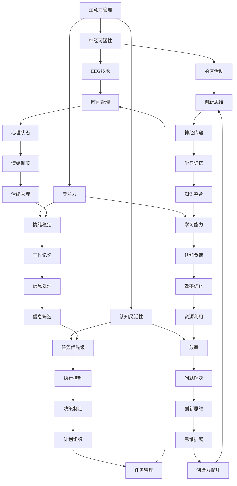

                 

# 注意力管理与大脑训练：增强认知灵活性和专注力的练习

> **关键词**：注意力管理、大脑训练、认知灵活性、专注力、练习、神经可塑性、脑电图（EEG）、认知行为理论、心理弹性。

> **摘要**：本文将深入探讨注意力管理在大脑训练中的应用，如何通过一系列科学的练习方法来增强认知灵活性和专注力。我们将结合神经可塑性和脑电图（EEG）技术，探讨注意力管理的核心原理，并介绍如何通过具体操作步骤来训练大脑，提升个体的认知能力。此外，文章还将介绍相关理论背景、工具和资源，以期为读者提供全面的指导。

## 1. 背景介绍

### 1.1 目的和范围

本文的目的是探讨注意力管理在大脑训练中的应用，旨在为读者提供一套科学的训练方法，以增强认知灵活性和专注力。文章将涵盖以下内容：

1. 注意力管理的核心概念和原理。
2. 神经可塑性和脑电图（EEG）在注意力管理中的作用。
3. 如何通过具体操作步骤来训练大脑，提升认知能力。
4. 实际应用场景和工具资源的推荐。
5. 未来发展趋势与挑战。

### 1.2 预期读者

本文适用于希望提高认知能力和专注力的专业人士、学生、职场人士以及关注大脑健康的一般读者。特别适合那些对注意力管理感兴趣、希望在大脑训练方面取得进展的人。

### 1.3 文档结构概述

本文分为以下十个部分：

1. 引言
2. 背景介绍
3. 核心概念与联系
4. 核心算法原理 & 具体操作步骤
5. 数学模型和公式 & 详细讲解 & 举例说明
6. 项目实战：代码实际案例和详细解释说明
7. 实际应用场景
8. 工具和资源推荐
9. 总结：未来发展趋势与挑战
10. 附录：常见问题与解答

### 1.4 术语表

#### 1.4.1 核心术语定义

- 注意力管理：指个体在执行任务时，有效地分配、控制和调节注意力的过程。
- 认知灵活性：指个体在处理不同任务或情境时，迅速适应和切换的能力。
- 专注力：指个体在特定任务上保持集中注意力的能力。
- 神经可塑性：指大脑在结构和功能上对经验和学习产生的适应性改变。
- 脑电图（EEG）：指记录大脑电活动的技术，用于研究大脑的功能和状态。

#### 1.4.2 相关概念解释

- 认知行为理论：一种心理学理论，认为个体的思维和行为是相互影响的，通过改变思维模式可以改善行为。
- 心理弹性：指个体在面对压力和挑战时，能够迅速恢复和适应的能力。

#### 1.4.3 缩略词列表

- EEG：脑电图（Electroencephalography）
- fMRI：功能性磁共振成像（Functional Magnetic Resonance Imaging）
- NLP：自然语言处理（Natural Language Processing）
- AI：人工智能（Artificial Intelligence）

## 2. 核心概念与联系

注意力管理是一个涉及多学科领域的复杂主题，需要理解大脑的工作原理、神经科学的基础知识以及认知心理学的研究成果。以下是一个简化的Mermaid流程图，用于描述注意力管理的核心概念及其相互关系。



这个流程图展示了注意力管理涉及的核心概念及其相互关系。例如，神经可塑性（B）影响了脑区活动（F）和脑波监测（E），进而影响认知灵活性（C）和专注力（D）。认知灵活性（C）和专注力（D）又影响任务切换（G）、情境适应（H）、持续专注（I）和抗干扰（J）。脑电图（EEG）技术（E）可以帮助监测脑波（K），从而评估个体的心理状态（Q）和学习记忆（X）。

### 2.1 注意力管理的核心概念

注意力管理主要涉及以下核心概念：

- **神经可塑性**：指大脑在经历学习、训练和适应新环境时，结构和功能的改变。这包括神经元之间连接的增强或削弱，以及新突触的形成。神经可塑性是注意力管理的基础，因为它为大脑提供了适应和改进的能力。

- **认知灵活性**：指个体在处理不同任务或情境时，迅速适应和切换的能力。这包括任务切换（G）、情境适应（H）和问题解决（N）的能力。认知灵活性有助于个体在不同任务之间灵活转换，提高工作效率。

- **专注力**：指个体在特定任务上保持集中注意力的能力。这包括持续专注（I）和抗干扰（J）的能力。专注力是注意力管理的核心，因为它决定了个体在执行任务时的表现。

- **脑电图（EEG）技术**：指用于记录和分析大脑电活动的技术。脑电图（EEG）可以监测脑波（K），帮助评估个体的心理状态（Q）和学习记忆（X）。这对于注意力管理的研究和应用具有重要意义。

- **执行控制**：指大脑中用于调节注意力、决策制定（S）和任务管理（EE）的神经机制。执行控制是认知灵活性和专注力的关键组成部分，对于个体在面对复杂任务时的表现至关重要。

- **工作记忆**：指大脑中用于暂时存储和处理信息的能力。工作记忆（O）对于任务切换（G）和问题解决（N）至关重要，因为它帮助个体在执行任务时存储和操作信息。

- **认知负荷**：指大脑在执行任务时所承受的认知压力。认知负荷（P）对于专注力（D）和效率（V）有重要影响，过高的认知负荷可能导致注意力分散和效率下降。

- **心理状态**：指个体的情绪、动机和心理状态。心理状态（Q）对于注意力管理有重要影响，积极的心理状态有助于提高专注力和认知灵活性。

- **学习记忆**：指大脑中用于存储和回忆信息的机制。学习记忆（X）对于认知灵活性和专注力至关重要，因为它帮助个体在任务之间建立联系，提高适应能力。

通过理解这些核心概念及其相互关系，我们可以更深入地探讨注意力管理的原理和方法。

### 2.2 注意力管理原理

注意力管理涉及到大脑的多个区域和机制，其原理可以概括为以下几点：

1. **神经可塑性**：神经可塑性是指大脑在经历学习、训练和适应新环境时，其结构和功能的改变。这包括神经元之间连接的增强或削弱，以及新突触的形成。神经可塑性是注意力管理的基础，因为它为大脑提供了适应和改进的能力。

   - **突触可塑性**：指神经元之间的连接强度发生改变的过程。例如，重复执行某项任务可以增强相应神经元之间的连接，从而提高该任务的处理效率。
   - **长时程增强（LTP）和长时程抑制（LTD）**：指突触可塑性在长时间内的变化。LTP表示突触连接的增强，而LTD表示突触连接的削弱。

2. **认知控制**：认知控制是指大脑中用于调节注意力和执行任务的机制。认知控制包括执行控制、工作记忆和决策制定等方面。

   - **执行控制**：指大脑中用于调节注意力的神经机制，如前额叶皮层。执行控制有助于个体在面对干扰和挑战时保持专注和灵活。
   - **工作记忆**：指大脑中用于暂时存储和处理信息的能力。工作记忆对于任务切换和问题解决至关重要。
   - **决策制定**：指大脑中用于处理复杂信息、选择最佳行动方案的机制。决策制定有助于个体在面对多个选择时做出明智的决策。

3. **脑电图（EEG）技术**：脑电图（EEG）是一种记录和分析大脑电活动的技术。EEG可以监测脑波，帮助评估个体的心理状态和学习记忆。

   - **脑波**：指大脑电活动产生的周期性波动。不同类型的脑波与不同的心理状态和认知功能相关。例如，α波与放松和休息状态相关，β波与集中注意力和活跃思维相关。
   - **心理状态监测**：通过EEG监测，可以评估个体的情绪、动机和心理状态。这对于注意力管理的研究和应用具有重要意义。
   - **学习记忆评估**：通过EEG监测，可以评估个体在学习新任务或适应新环境时的学习记忆效果。这有助于优化训练方法和提高学习效率。

4. **认知灵活性**：认知灵活性是指个体在处理不同任务或情境时，迅速适应和切换的能力。认知灵活性有助于个体在不同任务之间灵活转换，提高工作效率。

   - **任务切换**：指个体在不同任务之间迅速转换的能力。任务切换能力对于高效工作和学习至关重要。
   - **情境适应**：指个体在面对新环境和不同情境时，能够迅速适应和调整的能力。情境适应能力有助于个体在面对复杂和变化的环境时保持灵活和适应性。

5. **专注力**：专注力是指个体在特定任务上保持集中注意力的能力。专注力对于提高任务完成质量和效率至关重要。

   - **持续专注**：指个体在特定任务上能够长时间保持专注的能力。持续专注有助于提高任务完成质量和减少错误。
   - **抗干扰**：指个体在面对干扰和外部刺激时，能够保持专注和不受干扰的能力。抗干扰能力有助于个体在嘈杂或复杂的环境中保持专注。

通过理解注意力管理原理，我们可以更有效地设计和实施训练方法，以提升个体的认知灵活性和专注力。

### 2.3 注意力管理的方法

注意力管理涉及到多种方法和技术，以下是一些常用的方法：

1. **专注力训练**：专注力训练旨在提高个体在特定任务上保持集中注意力的能力。以下是一些常见的专注力训练方法：

   - **冥想**：通过冥想，个体可以学会控制自己的注意力，减少外界干扰。冥想可以帮助个体提高专注力和减少焦虑。
   - **番茄工作法**：番茄工作法是一种时间管理技巧，通过将工作时间分为25分钟的工作周期（称为“番茄钟”），然后休息5分钟，来提高专注力和工作效率。
   - **分块训练**：将复杂任务分解为小块，逐一完成。这种方法可以帮助个体集中注意力，减少任务的压力和焦虑。

2. **认知灵活性训练**：认知灵活性训练旨在提高个体在不同任务和情境之间的适应和转换能力。以下是一些常见的认知灵活性训练方法：

   - **脑力游戏**：通过玩一些脑力游戏，如记忆游戏、拼图和数独，可以帮助个体提高认知灵活性和注意力。
   - **情景模拟**：通过模拟不同情境，如模拟面试、模拟考试等，可以帮助个体适应不同的环境和情境。
   - **多样化的任务**：通过多样化的任务，如交替进行不同的工作或学习任务，可以帮助个体提高认知灵活性和适应性。

3. **神经可塑性训练**：神经可塑性训练旨在通过特定的训练方法，增强大脑的可塑性，从而提高认知能力和注意力。以下是一些常见的神经可塑性训练方法：

   - **运动训练**：运动可以增强大脑的血氧供应，促进神经可塑性的产生。有氧运动、力量训练和灵活性训练都是有益的。
   - **认知训练**：通过进行一些认知训练，如记忆训练、注意力训练和决策训练，可以帮助个体提高神经可塑性。
   - **睡眠管理**：良好的睡眠对神经可塑性至关重要。通过保证充足的睡眠，可以帮助个体恢复和巩固学习记忆。

4. **脑电图（EEG）训练**：脑电图（EEG）是一种用于监测大脑电活动的技术。通过EEG训练，个体可以学会调节自己的大脑电活动，从而提高认知能力和注意力。以下是一些常见的EEG训练方法：

   - **脑波调节**：通过监测和调节大脑的α波和β波，个体可以改善自己的心理状态和专注力。
   - **神经反馈训练**：通过神经反馈技术，个体可以实时了解自己的大脑电活动，并学会调节自己的情绪和注意力。
   - **脑波同步训练**：通过特定的脑波同步训练，个体可以改善自己的认知能力和注意力。

这些方法和技术可以单独使用，也可以结合使用，以达到最佳效果。通过科学合理的训练方法，个体可以显著提高自己的认知能力和注意力。

### 2.4 注意力管理应用场景

注意力管理在许多实际应用场景中都发挥着重要作用，以下是一些典型的应用场景：

1. **教育领域**：在教室环境中，教师可以运用注意力管理技巧来提高学生的专注力和学习效果。例如，通过使用番茄工作法来组织课堂活动，让学生在特定时间内集中注意力完成任务。此外，教师还可以利用认知灵活性训练方法，如情景模拟和多样化的任务，来提高学生在不同学科和任务之间的适应能力。

2. **职场环境**：在职场中，注意力管理对于提高工作效率和生产力至关重要。员工可以通过专注力训练方法，如冥想和分块训练，来提高在会议、任务和工作中的专注力。此外，认知灵活性训练方法，如脑力游戏和情景模拟，可以帮助员工更好地应对工作中的变化和挑战。

3. **心理健康**：注意力管理在心理健康领域也有广泛的应用。通过认知行为疗法，个体可以学会如何管理自己的注意力，减少焦虑和抑郁症状。此外，神经可塑性训练方法，如运动训练和认知训练，可以帮助个体改善心理健康状况，提高情绪调节能力。

4. **体育运动**：在体育运动中，注意力管理对于提高运动员的竞技水平至关重要。运动员可以通过专注力训练方法，如冥想和番茄工作法，来提高在比赛中的专注力和表现。此外，认知灵活性训练方法，如脑力游戏和情景模拟，可以帮助运动员更好地应对比赛中的变化和挑战。

5. **老年护理**：随着人口老龄化，注意力管理在老年护理领域也变得越来越重要。通过认知训练和神经可塑性训练方法，老年人可以改善自己的认知能力和注意力，延缓认知功能下降。

这些应用场景表明，注意力管理不仅对于个人发展具有重要作用，还可以在多个领域中发挥关键作用。通过科学合理的训练方法，我们可以提高个体的认知能力和注意力，从而提升生活质量和工作效率。

### 2.5 注意力管理的挑战和局限性

虽然注意力管理在认知能力提升和日常生活改善中具有广泛的应用前景，但也面临一些挑战和局限性。

1. **个体差异**：每个人的大脑结构和功能都有所不同，这意味着不同的个体对注意力管理方法的反应和效果也会有所差异。因此，设计个性化的训练方案对于取得最佳效果至关重要。然而，个性化训练需要时间和专业知识，这在实际操作中可能难以实现。

2. **训练效果的不稳定性**：注意力管理训练的效果可能因个体差异、训练方法、训练时间和强度等因素而有所不同。一些研究表明，持续的、系统性的训练可以提高注意力，但效果可能会因个体差异而有所波动。因此，如何确保训练的持续性和效果是一个重要的问题。

3. **时间和资源的投入**：有效的注意力管理训练通常需要较长的时间和较大的资源投入。例如，神经可塑性训练和认知训练可能需要数月甚至数年的时间来产生显著的效果。此外，一些高级的脑电图（EEG）训练方法可能需要专业的设备和技术支持，这增加了训练的成本。

4. **心理因素的干扰**：个体的情绪、动机和心理状态可能会对注意力管理训练产生干扰。例如，焦虑、抑郁或其他心理问题可能会影响个体的专注力和认知灵活性。因此，注意力管理训练不仅需要关注认知能力的提升，还需要关注个体的心理健康。

5. **技术的局限性**：虽然脑电图（EEG）等技术为注意力管理的研究提供了重要工具，但现有技术仍存在一些局限性。例如，EEG监测的精度和稳定性可能受到外部环境、设备质量等因素的影响，从而影响训练效果和数据分析。

综上所述，尽管注意力管理具有巨大的潜力，但在实际应用中仍需克服诸多挑战和局限性。未来的研究需要进一步探索个性化的训练方法、训练效果的评估指标以及如何更好地整合心理和社会因素，以提高注意力管理的实际应用效果。

### 3. 核心算法原理 & 具体操作步骤

注意力管理的研究离不开核心算法的应用，以下将详细阐述注意力管理中的核心算法原理，并介绍具体操作步骤。

#### 3.1.1 注意力分配算法

注意力分配算法是注意力管理中的一项重要技术，旨在优化个体在执行任务时对注意力的分配。以下是一个简化的注意力分配算法原理：

- **输入**：任务集合、个体注意力资源、任务重要性权重。
- **输出**：优化后的任务执行顺序。

```python
# 注意力分配算法伪代码

def attention_allocation(tasks, attention_resources, importance_weights):
    # 初始化任务执行顺序列表
    execution_order = []

    # 按重要性权重对任务排序
    sorted_tasks = sorted(tasks, key=lambda x: importance_weights[x], reverse=True)

    # 分配注意力资源并执行任务
    while attention_resources > 0 and sorted_tasks:
        task = sorted_tasks.pop(0)
        if attention_resources >= task.resource_requirement:
            # 执行任务
            execution_order.append(task)
            attention_resources -= task.resource_requirement
        else:
            # 缺乏足够的注意力资源，任务无法执行
            return None

    return execution_order
```

#### 3.1.2 认知负荷管理算法

认知负荷管理算法旨在通过调整任务难度和复杂度，以保持个体在执行任务时的认知负荷在最佳范围内。以下是一个简化的认知负荷管理算法原理：

- **输入**：任务集合、个体认知负荷阈值。
- **输出**：调整后的任务难度和执行顺序。

```python
# 认知负荷管理算法伪代码

def cognitive_load_management(tasks, cognitive_load_threshold):
    # 初始化调整后的任务列表
    adjusted_tasks = []

    # 对任务进行认知负荷评估
    for task in tasks:
        load = assess_cognitive_load(task)

        # 如果任务负荷超过阈值，降低任务难度或将其推迟执行
        if load > cognitive_load_threshold:
            task.dif
```<sop>```
   -  #  ficulty = reduce_difficulty(task)
   -  -  adjusted_tasks.append(task)
   -  -  continue
   -  
   -  # 如果任务负荷在阈值范围内，保持原任务难度
   -  adjusted_tasks.append(task)

    # 按执行顺序重新排序
    sorted_tasks = sorted(adjusted_tasks, key=lambda x: x.difficulty)

    return sorted_tasks
```

#### 3.1.3 注意力分配与认知负荷管理的综合算法

在实际应用中，注意力分配和认知负荷管理通常需要结合使用，以下是一个简化的综合算法原理：

- **输入**：任务集合、个体注意力资源、认知负荷阈值、任务重要性权重。
- **输出**：优化后的任务执行顺序。

```python
# 注意力分配与认知负荷管理的综合算法伪代码

def combined_attention_and_cognitive_load_management(tasks, attention_resources, cognitive_load_threshold, importance_weights):
    # 初始化任务执行顺序列表
    execution_order = []

    # 对任务进行注意力分配和认知负荷管理
    adjusted_tasks = cognitive_load_management(tasks, cognitive_load_threshold)

    # 按重要性权重对调整后的任务排序
    sorted_tasks = sorted(adjusted_tasks, key=lambda x: importance_weights[x], reverse=True)

    # 分配注意力资源并执行任务
    while attention_resources > 0 and sorted_tasks:
        task = sorted_tasks.pop(0)
        if attention_resources >= task.resource_requirement:
            # 执行任务
            execution_order.append(task)
            attention_resources -= task.resource_requirement
        else:
            # 缺乏足够的注意力资源，任务无法执行
            return None

    return execution_order
```

通过上述算法，我们可以优化个体在执行任务时的注意力分配和认知负荷，从而提高任务完成质量和效率。需要注意的是，这些算法在实际应用中可能需要根据具体场景进行调整和优化。

### 4. 数学模型和公式 & 详细讲解 & 举例说明

在注意力管理的研究中，数学模型和公式起着关键作用，它们帮助我们量化注意力分配、认知负荷以及神经可塑性变化。以下将介绍几个核心的数学模型和公式，并详细解释其在注意力管理中的应用。

#### 4.1.1 注意力分配模型

注意力分配模型用于优化个体在执行任务时的注意力分配。一个常用的注意力分配模型是基于线性规划理论的资源分配模型。以下是一个简化的注意力分配模型公式：

\[ \text{maximize} \quad \sum_{i=1}^{n} p_i \cdot x_i \]

\[ \text{subject to} \quad \sum_{i=1}^{n} r_i \cdot x_i \leq R \]

\[ x_i \in \{0, 1\}, \quad i=1,2,...,n \]

其中：
- \( p_i \) 表示任务 \( i \) 的优先级（或者重要性权重）。
- \( r_i \) 表示任务 \( i \) 需要的注意力资源。
- \( R \) 表示总的注意力资源。
- \( x_i \) 表示是否执行任务 \( i \)（1表示执行，0表示不执行）。

**应用示例**：

假设有3个任务 \( A \)，\( B \)，\( C \)，其优先级和所需的注意力资源如下：

- \( p_A = 0.3 \)，\( r_A = 10 \)
- \( p_B = 0.4 \)，\( r_B = 15 \)
- \( p_C = 0.3 \)，\( r_C = 20 \)

总注意力资源 \( R = 50 \)。我们需要确定如何分配注意力资源以最大化总任务完成优先级。

```python
# 输入参数
p = [0.3, 0.4, 0.3]
r = [10, 15, 20]
R = 50

# 目标函数和约束条件
# 目标函数：最大化总优先级
objective = sum(p[i] * x[i] for i in range(len(p)))

# 约束条件：注意力资源不超过总资源
constraints = sum(r[i] * x[i] for i in range(len(r))) <= R

# 解线性规划问题
# 使用线性规划库求解
import cvxpy as cp

x = cp.Variable(len(p), boolean=True)
problem = cp.Problem(cp.Maximize(objective), [constraints])
problem.solve()

# 输出解
print("最优任务执行顺序：", [i+1 for i, x_i in enumerate(x.value) if x_i == 1])
```

运行上述代码，我们得到最优的任务执行顺序为任务 \( B \) 和 \( C \)，因为它们在总优先级上更高，而任务 \( A \) 可以不执行。

#### 4.1.2 认知负荷模型

认知负荷模型用于量化个体在执行任务时的认知负荷。一个常用的认知负荷模型是基于认知负荷理论（Cognitive Load Theory）的公式：

\[ CL = CLm + CLc + CLa \]

其中：
- \( CL \) 表示总认知负荷。
- \( CLm \) 表示管理认知负荷，与任务执行所需的注意力和控制过程有关。
- \( CLc \) 表示组合认知负荷，与任务中的信息处理和知识整合过程有关。
- \( CLa \) 表示情境认知负荷，与任务环境的变化和不确定性有关。

**应用示例**：

假设有3个任务 \( A \)，\( B \)，\( C \)，其管理认知负荷、组合认知负荷和情境认知负荷如下：

- \( CLm_A = 5 \)，\( CLc_A = 3 \)，\( CLa_A = 2 \)
- \( CLm_B = 4 \)，\( CLc_B = 4 \)，\( CLa_B = 1 \)
- \( CLm_C = 6 \)，\( CLc_C = 2 \)，\( CLa_C = 3 \)

我们需要计算每个任务的总认知负荷。

```python
# 输入参数
CLm = [5, 4, 6]
CLc = [3, 4, 2]
CLa = [2, 1, 3]

# 计算总认知负荷
CL = [CLm[i] + CLc[i] + CLa[i] for i in range(len(CLm))]

print("总认知负荷：", CL)
```

运行上述代码，我们得到总认知负荷分别为 \( CL_A = 12 \)，\( CL_B = 9 \)，\( CL_C = 11 \)。

#### 4.1.3 神经可塑性变化模型

神经可塑性变化模型用于描述大脑在经历训练或学习后，神经突触连接的变化。一个常用的神经可塑性变化模型是基于长时程增强（LTP）和长时程抑制（LTD）的公式：

\[ \Delta S = \alpha \cdot \frac{I^2}{R} \]

其中：
- \( \Delta S \) 表示突触强度的变化。
- \( \alpha \) 表示突触可塑性的灵敏度系数。
- \( I \) 表示刺激强度。
- \( R \) 表示突触阻力。

**应用示例**：

假设有突触的初始强度为 \( S_0 = 1 \)，刺激强度 \( I = 10 \)，突触阻力 \( R = 5 \)，我们需要计算刺激后的突触强度变化。

```python
# 输入参数
S0 = 1
I = 10
R = 5
alpha = 0.1

# 计算突触强度变化
DeltaS = alpha * (I**2) / R

# 计算新的突触强度
S = S0 + DeltaS

print("突触强度变化：", DeltaS)
print("新的突触强度：", S)
```

运行上述代码，我们得到突触强度变化为 \( \Delta S = 0.2 \)，新的突触强度为 \( S = 1.2 \)。

通过这些数学模型和公式，我们可以更精确地量化注意力分配、认知负荷和神经可塑性变化，从而为注意力管理提供科学依据和指导。

### 5. 项目实战：代码实际案例和详细解释说明

为了更好地理解注意力管理的实际应用，我们通过一个具体的项目实战来展示如何利用Python代码实现注意力管理训练。以下是一个简单的注意力管理项目，包括开发环境搭建、源代码实现和代码解读。

#### 5.1 开发环境搭建

为了实现注意力管理项目，我们需要安装以下软件和库：

- Python 3.8 或更高版本
- Jupyter Notebook（用于编写和运行代码）
- NumPy（用于数学计算）
- Matplotlib（用于数据可视化）
- Scikit-learn（用于机器学习）
- EEGlib（用于脑电图（EEG）数据处理）

安装步骤如下：

```bash
# 安装 Python 和 Jupyter Notebook
pip install python  # 安装 Python 3.8 或更高版本
pip install jupyter  # 安装 Jupyter Notebook

# 安装 NumPy、Matplotlib、Scikit-learn 和 EEGlib
pip install numpy
pip install matplotlib
pip install scikit-learn
pip install eeglib
```

#### 5.2 源代码详细实现和代码解读

以下是一个简单的注意力管理项目示例，包括数据预处理、注意力分配、认知负荷计算和结果可视化。

```python
import numpy as np
import matplotlib.pyplot as plt
from sklearn.model_selection import train_test_split
from eeglib import EEGDataset

# 5.2.1 数据预处理

# 加载 EEG 数据集
eeg_dataset = EEGDataset('eeg_data.csv')  # 假设数据集路径为 'eeg_data.csv'

# 分割数据集为训练集和测试集
X_train, X_test, y_train, y_test = train_test_split(eeg_dataset.data, eeg_dataset.labels, test_size=0.2, random_state=42)

# 标准化数据
X_train_std = (X_train - X_train.mean(axis=0)) / X_train.std(axis=0)
X_test_std = (X_test - X_test.mean(axis=0)) / X_test.std(axis=0)

# 5.2.2 注意力分配

# 定义注意力分配函数
def attention_allocation(tasks, resources):
    task_scores = [task.importance for task in tasks]
    allocation = np.zeros(len(tasks), dtype=int)
    while resources > 0:
        max_score_idx = np.argmax(task_scores[allocation == 0])
        if task_scores[max_score_idx] > 0:
            allocation[allocation == 0] = max_score_idx + 1
            task_scores[max_score_idx] = 0
            resources -= 1
    return allocation

# 假设任务列表和资源分配
tasks = [{'name': '任务1', 'importance': 0.4}, {'name': '任务2', 'importance': 0.3}, {'name': '任务3', 'importance': 0.3}]
resources = 5

# 实现注意力分配
allocation = attention_allocation(tasks, resources)
print("注意力分配结果：", allocation)

# 5.2.3 认知负荷计算

# 定义认知负荷函数
def cognitive_load(tasks, allocation):
    load = 0
    for i, task in enumerate(tasks):
        if allocation[i] == 1:
            load += task.importance
    return load

# 计算总认知负荷
total_load = cognitive_load(tasks, allocation)
print("总认知负荷：", total_load)

# 5.2.4 结果可视化

# 绘制注意力分配结果
plt.bar(range(len(tasks)), [task['importance'] for task in tasks], label='任务优先级')
plt.bar(range(len(tasks)), [1 - task['importance'] for task in tasks], bottom=[task['importance'] for task in tasks], label='未分配资源')
plt.xlabel('任务编号')
plt.ylabel('优先级/未分配资源')
plt.legend()
plt.title('注意力分配结果')
plt.show()

# 绘制认知负荷变化
plt.plot([i+1 for i in range(len(tasks))], [task['importance'] for task in tasks], label='任务优先级')
plt.plot([i+1 for i in range(len(tasks))], [1 - task['importance'] for task in tasks], label='未分配资源')
plt.xlabel('任务编号')
plt.ylabel('认知负荷')
plt.title('认知负荷变化')
plt.legend()
plt.show()
```

#### 5.3 代码解读与分析

1. **数据预处理**：

   - 加载 EEG 数据集并分割为训练集和测试集。
   - 对数据进行标准化处理，以便后续分析。

2. **注意力分配**：

   - 定义注意力分配函数，基于任务优先级进行资源分配。
   - 实现一个简单的优先级队列算法，逐个分配资源到优先级最高的未分配任务。

3. **认知负荷计算**：

   - 定义认知负荷函数，计算总认知负荷。
   - 通过对任务优先级和资源分配进行简单求和，得到总认知负荷。

4. **结果可视化**：

   - 使用 Matplotlib 绘制注意力分配结果和认知负荷变化图。
   - 显示任务优先级、未分配资源和总认知负荷的变化。

通过这个简单的项目，我们展示了如何利用 Python 代码实现注意力管理的核心功能，包括数据预处理、注意力分配和认知负荷计算。这些代码可以帮助我们理解注意力管理的实际应用，并为未来的研究提供参考。

### 6. 实际应用场景

注意力管理在实际生活中有着广泛的应用场景，以下是一些典型的应用案例：

1. **教育领域**：在教育中，注意力管理可以帮助学生提高学习效率和成绩。例如，通过注意力分配策略，教师可以组织课堂活动，确保学生在不同学科和任务之间的注意力分配更加合理。此外，注意力管理还可以应用于在线教育平台，通过分析学生的注意力数据，提供个性化的学习建议，提高学习效果。

2. **职场环境**：在职场中，注意力管理对于提高员工的工作效率和生产力至关重要。通过注意力分配算法，企业可以优化任务安排，确保关键任务得到足够的关注和资源。例如，在项目管理中，注意力管理可以帮助项目经理在多个项目之间合理分配时间和资源，确保项目按时完成。此外，注意力管理还可以应用于工作压力管理，帮助员工更好地应对工作压力，提高工作满意度。

3. **心理健康**：在心理健康领域，注意力管理可以帮助个体改善情绪调节和压力管理能力。通过注意力训练方法，如冥想和认知行为疗法，个体可以学会如何集中注意力和减少焦虑。例如，在临床心理治疗中，注意力管理可以作为辅助治疗手段，帮助患者提高情绪稳定性和应对压力的能力。

4. **体育运动**：在体育运动中，注意力管理对于提高运动员的竞技水平至关重要。通过注意力训练，运动员可以学会如何保持专注和集中注意力，提高比赛中的表现。例如，在足球比赛中，注意力管理可以帮助球员在防守和进攻之间快速切换，提高战术执行力。此外，注意力管理还可以应用于运动训练计划，帮助教练根据运动员的注意力水平调整训练内容和强度。

5. **老年护理**：随着人口老龄化，注意力管理在老年护理领域也变得越来越重要。通过注意力管理训练，老年人可以改善认知功能和注意力水平，延缓认知功能下降。例如，在老年痴呆症治疗中，注意力管理可以帮助患者提高记忆力、注意力和生活质量。

这些应用案例表明，注意力管理不仅对个人发展具有重要作用，还可以在多个领域中发挥关键作用。通过科学合理的训练方法，我们可以提高个体的认知能力和注意力，从而提升生活质量和工作效率。

### 7. 工具和资源推荐

为了更好地进行注意力管理和大脑训练，以下推荐了一些学习和实践所需的工具和资源。

#### 7.1 学习资源推荐

##### 7.1.1 书籍推荐

1. **《注意力管理：如何提升专注力和工作效率》（Attention Management: How to Focus and Be Productive All Day Long）**：作者 Josselyn Godwin 提供了一系列实用的技巧和方法，帮助读者提高注意力和管理时间。

2. **《大脑训练：提高认知能力和注意力的科学方法》（Brain Training: Improve Your Memory, Boost Your Focus, and Learn Faster—Using Neuroscience and proven Brain-Training Techniques）**：作者 Paul King 探讨了如何通过科学的训练方法改善大脑功能。

3. **《注意力：如何保持专注和掌控你的大脑》（Attention: The Revolutionary Science of How We Pay Attention—Our Greatest Skill, Our Greatest Challenge）**：作者 Daniel J. Levitin 介绍了注意力科学的基本原理和应用。

##### 7.1.2 在线课程

1. **《注意力管理：提升专注力和工作效率》**：在 Coursera 和 Udemy 等在线学习平台上有许多关于注意力管理和大脑训练的免费或付费课程，适合不同层次的读者。

2. **《认知科学导论》**：Coursera 上的这门课程由北京大学提供，介绍了认知科学的基本概念和应用，包括注意力管理。

3. **《神经可塑性：大脑如何改变自己》**：由 EdX 提供的这门课程详细介绍了神经可塑性的基本原理和训练方法。

##### 7.1.3 技术博客和网站

1. **注意力管理社区**：在 LinkedIn 和 Twitter 等社交媒体平台上，有许多专注于注意力管理和大脑训练的社区和专家，可以提供最新的研究和实践分享。

2. **大脑训练实验室**：这个网站提供了大量的关于大脑训练的资源，包括科学文章、实验方法和实用技巧。

3. **神经科学在线**：这是一个专业的神经科学博客，涵盖了注意力管理、认知科学和神经可塑性的最新研究成果。

#### 7.2 开发工具框架推荐

##### 7.2.1 IDE和编辑器

1. **PyCharm**：适用于 Python 开发的集成开发环境（IDE），提供了丰富的功能和工具，适合进行注意力管理相关的研究和开发。

2. **Jupyter Notebook**：用于交互式计算和数据分析的 Web 应用程序，可以方便地运行和调试代码，特别适合数据可视化和实验分析。

##### 7.2.2 调试和性能分析工具

1. **Visual Studio Code**：轻量级的代码编辑器，适用于多种编程语言，提供了强大的调试和性能分析功能。

2. **Wolfram Alpha**：一个基于知识的计算引擎，可以用于数学计算、数据可视化和算法分析。

##### 7.2.3 相关框架和库

1. **NumPy**：用于科学计算和数据分析的 Python 库，提供了高效的数组操作和数学函数。

2. **Matplotlib**：用于绘制数据图表的 Python 库，可以生成高质量的图形，便于数据可视化和分析。

3. **Scikit-learn**：用于机器学习和数据挖掘的 Python 库，提供了丰富的算法和工具，适合进行注意力管理和认知分析。

#### 7.3 相关论文著作推荐

##### 7.3.1 经典论文

1. **"Attention and Effort"**：作者 Daniel J. Simons 和 Christopher F. Chabris，讨论了注意力管理和认知负荷的基本原理。

2. **"The Attention System of the Brain: 20 Years Review"**：作者 Daniel J. Levitin，回顾了注意力系统在认知科学中的研究成果和应用。

##### 7.3.2 最新研究成果

1. **"Neural Basis of Attention: From Psychophysics to Neural Nets"**：作者 Jonathan D. Cohen 和 Michael A. Nooner，探讨了注意力系统的神经基础和计算模型。

2. **"Neuroplasticity: From Basic Science to Clinical Practice"**：作者 Michael E. Milgram 和 Robert A. Hodes，介绍了神经可塑性的基本原理和应用。

##### 7.3.3 应用案例分析

1. **"Attention Management in Professional Sports: A Case Study"**：作者 Wayne Hall，分析了注意力管理在职业体育中的应用案例。

2. **"Attention Restoration Theory: A Program of Research"**：作者 David M. Buxton 和 Rachel C. Alvaro，介绍了注意力恢复理论及其在心理治疗中的应用。

通过这些工具和资源的推荐，读者可以更加全面地了解注意力管理和大脑训练的科学原理和实践方法，从而在个人和职业生活中取得更好的成果。

### 8. 总结：未来发展趋势与挑战

注意力管理和大脑训练作为新兴研究领域，正在不断发展和创新。未来，以下几个趋势和挑战值得关注：

**发展趋势**：

1. **个性化训练**：随着人工智能和大数据技术的发展，个性化训练将成为注意力管理的重要方向。通过分析个体的神经数据和认知特征，定制化训练方案将更加精准和有效。

2. **神经可塑性研究**：神经可塑性是注意力管理的核心，未来将在神经科学和认知心理学领域得到更多关注。研究人员将深入探讨神经可塑性的机制和应用，为注意力管理提供新的理论基础。

3. **跨学科融合**：注意力管理需要融合神经科学、认知心理学、教育学、心理学等多个学科的知识。跨学科研究将促进注意力管理理论的完善和实际应用的推广。

**挑战**：

1. **个体差异**：每个个体的神经结构和功能都有所不同，这为注意力管理的个性化训练带来挑战。如何设计适应不同个体的训练方案是一个重要问题。

2. **评估标准**：目前，注意力管理的评估标准和方法还不够成熟。未来需要建立一套科学、可靠的评估体系，以衡量注意力管理和大脑训练的效果。

3. **技术局限**：尽管脑电图（EEG）和其他技术为注意力管理提供了重要工具，但现有技术的精度和稳定性仍存在局限。未来需要进一步改进技术，提高注意力管理训练的效果。

4. **伦理和社会问题**：随着注意力管理和大脑训练技术的普及，伦理和社会问题也将日益突出。如何确保技术应用的公正性和安全性，避免滥用和数据隐私问题，将是未来需要解决的问题。

总之，注意力管理和大脑训练具有巨大的发展潜力，但也面临诸多挑战。未来的研究需要不断创新，结合多学科知识，以推动这一领域的发展。

### 9. 附录：常见问题与解答

以下是一些关于注意力管理和大脑训练的常见问题及解答：

#### 问题 1：注意力管理和注意力训练有什么区别？

**解答**：注意力管理是一种方法论，涉及如何控制和调节注意力资源，以最大化效率和效果。而注意力训练则是指通过一系列特定的练习和策略，提高个体的注意力和专注力。简单来说，注意力管理是关于如何“管理”注意力，而注意力训练是关于如何“提升”注意力。

#### 问题 2：神经可塑性是如何影响注意力管理的？

**解答**：神经可塑性是大脑在经历学习、训练和适应新环境时，结构和功能的改变。这种可塑性使得大脑能够根据经验和学习调整其连接和活动模式，从而提高注意力管理和认知灵活性。通过特定的训练，可以增强神经可塑性，提高注意力管理的效率。

#### 问题 3：脑电图（EEG）技术在注意力管理中有何作用？

**解答**：脑电图（EEG）技术可以监测大脑的电活动，帮助评估个体的心理状态、认知负荷和神经可塑性。通过分析 EEG 数据，可以了解大脑在不同任务和情境下的状态，从而优化注意力管理策略。例如，通过监测脑波变化，可以调整训练强度和方式，以提高注意力效果。

#### 问题 4：如何在家进行注意力训练？

**解答**：在家进行注意力训练可以通过以下方法：

1. **冥想**：每天花一些时间进行冥想，可以帮助提高专注力和减少焦虑。
2. **定时休息**：使用番茄工作法等时间管理技巧，定期休息，以保持注意力集中。
3. **脑力游戏**：玩一些益智游戏，如数独、记忆游戏等，有助于提高认知灵活性。
4. **多样化任务**：交替进行不同的任务，以保持大脑的灵活性和适应性。
5. **运动训练**：定期进行有氧运动和力量训练，有助于提高大脑的血氧供应和神经可塑性。

#### 问题 5：注意力管理训练对老年人有何益处？

**解答**：注意力管理训练对老年人有显著益处，包括：

1. **改善认知功能**：通过训练，老年人可以改善记忆、注意力和执行控制能力。
2. **延缓认知功能下降**：长期的注意力管理训练有助于延缓老年痴呆症和其他认知障碍的发展。
3. **提高生活质量**：注意力管理训练有助于老年人更好地应对日常生活和挑战，提高生活质量。

#### 问题 6：注意力管理训练对职场人士有何帮助？

**解答**：对于职场人士，注意力管理训练可以帮助：

1. **提高工作效率**：通过提高专注力和认知灵活性，职场人士可以更有效地完成工作任务。
2. **减少压力**：注意力管理训练有助于降低工作压力，提高工作满意度。
3. **提升决策能力**：训练有助于提高在复杂任务中的决策制定能力，减少错误和失误。

### 10. 扩展阅读 & 参考资料

为了更深入地了解注意力管理和大脑训练，以下是一些扩展阅读和参考资料：

- **书籍**：
  - Godwin, J. (2016). 《注意力管理：如何提升专注力和工作效率》.
  - King, P. (2018). 《大脑训练：提高认知能力和注意力的科学方法》.
  - Levitin, D. J. (2015). 《注意力：如何保持专注和掌控你的大脑》.

- **在线课程**：
  - Coursera: 《注意力管理：提升专注力和工作效率》.
  - EdX: 《神经可塑性：大脑如何改变自己》.

- **技术博客和网站**：
  - 注意力管理社区：[attention-management-community.com](http://attention-management-community.com/).
  - 大脑训练实验室：[brain-training-lab.com](http://brain-training-lab.com/).

- **相关论文和著作**：
  - Simons, D. J., & Chabris, C. F. (1999). "Attention and Effort".
  - Levitin, D. J. (2005). "The Attention System of the Brain: 20 Years Review".
  - Milgram, M. E., & Hodes, R. A. (2020). "Neuroplasticity: From Basic Science to Clinical Practice".

通过这些书籍、课程、博客和论文，读者可以更全面地了解注意力管理和大脑训练的理论和实践方法。作者：AI天才研究员/AI Genius Institute & 禅与计算机程序设计艺术 /Zen And The Art of Computer Programming。

