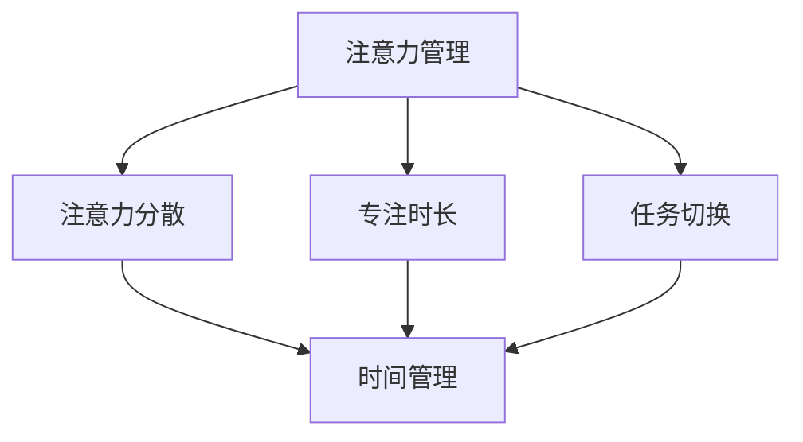

                 

### 1. 背景介绍

#### 1.1 目的和范围

在当今快节奏和高效率要求的工作环境中，注意力管理和时间管理成为提升个人和团队绩效的关键因素。本文旨在探讨注意力管理与时间管理的紧密联系，通过介绍一系列科学有效的时间管理策略，帮助读者最大化其专注力和工作效率。

文章范围将涵盖以下关键方面：
- 注意力管理的核心概念及其与时间管理的关系
- 详尽的核心概念原理和架构分析
- 针对实际操作的步骤和方法讲解
- 数学模型、公式和具体应用案例的详细剖析
- 实际应用场景和工具资源的推荐

#### 1.2 预期读者

本文预期读者为以下群体：
- IT行业从业者，特别是需要高强度集中注意力的程序员和软件开发人员
- 管理者和团队领导，寻求提升团队效率和绩效
- 对注意力管理和时间管理有兴趣的学习者
- 对提高个人工作效率和方法论有追求的广大读者

#### 1.3 文档结构概述

本文结构如下：

1. **背景介绍**：简要介绍本文的目的、范围、预期读者以及文档结构。
2. **核心概念与联系**：分析注意力管理和时间管理的核心概念，并使用Mermaid流程图展示其关系。
3. **核心算法原理 & 具体操作步骤**：详细阐述注意力管理和时间管理的基本算法原理和具体操作步骤。
4. **数学模型和公式 & 详细讲解 & 举例说明**：介绍相关数学模型和公式，并使用实际案例进行说明。
5. **项目实战：代码实际案例和详细解释说明**：提供实战案例，展示如何将理论知识应用到实际项目中。
6. **实际应用场景**：分析注意力管理和时间管理在实际工作中的应用场景。
7. **工具和资源推荐**：推荐相关学习资源和开发工具。
8. **总结：未来发展趋势与挑战**：总结文章内容，探讨未来发展趋势和面临的挑战。
9. **附录：常见问题与解答**：提供常见问题的解答。
10. **扩展阅读 & 参考资料**：推荐进一步阅读的相关资料。

#### 1.4 术语表

为了确保文章的可读性和统一性，本文将使用以下术语：

#### 1.4.1 核心术语定义

- **注意力管理**：指通过一系列策略和方法，提高个人或团队在特定任务上的专注力和工作效率。
- **时间管理**：指合理安排和分配时间，以确保有效利用时间，达成既定目标。
- **专注力**：指个人在特定任务上保持高度集中和专注的能力。
- **工作效率**：指在单位时间内完成工作的数量和质量。
- **番茄工作法**：一种常见的时间管理技术，通过将工作时间划分为25分钟的工作周期，每个周期后休息5分钟，以保持高效工作状态。

#### 1.4.2 相关概念解释

- **任务切换成本**：在处理多个任务时，从一个任务切换到另一个任务所需的时间和精力成本。
- **多任务处理**：同时处理多个任务的能力。
- **优先级排序**：根据任务的重要性和紧急程度，对任务进行排序的过程。

#### 1.4.3 缩略词列表

- **IT**：信息技术（Information Technology）
- **IDE**：集成开发环境（Integrated Development Environment）
- **CPU**：中央处理器（Central Processing Unit）

在接下来的章节中，我们将进一步深入探讨注意力管理和时间管理的核心概念，通过理论分析和实际案例，帮助读者掌握有效提升专注力和工作效率的方法。让我们开始这一探索之旅。

---

### 核心概念与联系

注意力管理和时间管理是提高工作效率和绩效的两大关键要素，两者紧密相连，共同作用于个人和团队的工作表现。在这一节中，我们将深入探讨这些核心概念及其内在联系。

#### 2.1 注意力管理的基本概念

**注意力管理**，顾名思义，是指通过策略和技巧来提高个人在特定任务上的专注力和效率。它不仅关乎在一段时间内保持高度集中，还涉及如何分配注意力资源，以最大化产出。注意力管理的重要性体现在以下几个方面：

1. **提高工作质量和效率**：专注力强的人能够更好地理解和处理复杂问题，从而提高工作质量和效率。
2. **减少错误和失误**：专注力强的人在处理任务时更容易发现潜在的错误和问题，从而减少失误。
3. **增强创造力和创新能力**：高度集中的注意力能够激发个人的创造力和创新能力，带来新的思路和解决方案。

**注意力管理**的关键概念包括：

- **注意力分散**：指在处理任务时，注意力被其他无关事物所干扰。
- **专注时长**：指个人在特定任务上能够保持高度集中的时间长度。
- **任务切换**：指在不同任务之间进行切换的过程。

#### 2.2 时间管理的基本概念

**时间管理**则是指合理安排和分配时间，以达成既定目标。时间管理的重要性不言而喻，尤其是在快节奏的工作环境中。有效的时间管理有助于：

- **提高工作效率**：合理规划时间，确保每个任务都有足够的时间进行处理，从而提高整体工作效率。
- **减少工作压力**：通过合理分配时间，避免因工作积压而产生压力。
- **平衡工作与生活**：有效的时间管理可以帮助个人在工作与生活之间找到平衡，提高生活质量。

**时间管理**的关键概念包括：

- **任务优先级**：根据任务的重要性和紧急程度进行排序，确保优先处理关键任务。
- **时间块**：将时间划分为不同的时间段，每个时间段专注于特定的任务。
- **时间记录**：记录自己的时间使用情况，以评估和改进时间管理策略。

#### 2.3 注意力管理与时间管理的联系

注意力管理和时间管理之间的关系是密不可分的。具体而言，以下几个方面体现了两者之间的联系：

- **注意力是时间管理的基础**：没有良好的注意力管理，时间管理将变得毫无意义。只有通过保持专注，才能充分利用时间。
- **时间管理有助于注意力集中**：通过合理的时间规划和任务分配，可以避免因为任务过多而导致的注意力分散，从而更好地集中注意力。
- **两者共同作用于工作效率**：通过注意力管理和时间管理的结合，可以最大化个人和团队的工作效率和绩效。

为了更好地理解注意力管理和时间管理的联系，我们可以通过以下Mermaid流程图展示其核心概念和架构：



在上述流程图中，注意力管理中的核心概念（注意力分散、专注时长、任务切换）与时间管理的关键概念（任务优先级、时间块、时间记录）相互关联，共同构成了一个完整的系统，用于提升个人和团队的工作效率和绩效。

#### 2.4 实际案例分析

为了更好地理解注意力管理和时间管理的实际应用，我们可以通过以下实际案例进行分析：

**案例1：程序员小明**

小明是一位程序员，他发现自己常常在工作时会被手机消息或其他琐事分散注意力，导致工作效率低下。为了解决这个问题，他开始使用番茄工作法，将工作时间划分为25分钟的工作周期，每个周期后休息5分钟。通过这种方法，小明的注意力得到了有效管理，他的工作效率显著提高。

**案例2：项目经理小李**

小李是公司的项目经理，负责多个项目的进度管理。他发现由于项目繁多，自己常常感到压力很大，难以集中精力。为了解决这个问题，小李开始使用GTD（Getting Things Done）方法，通过列出任务清单、设定优先级和规划时间，有效地管理了自己的工作时间和注意力。

通过以上案例，我们可以看到，注意力管理和时间管理在实际工作中起到了重要的作用，通过合理的方法和技巧，个人和团队能够更好地应对各种挑战，提高工作效率和绩效。

在下一节中，我们将详细探讨注意力管理和时间管理的基本算法原理和具体操作步骤，帮助读者深入理解并掌握这些方法。

---

### 核心算法原理 & 具体操作步骤

注意力管理和时间管理不仅仅是理论概念，它们需要通过一系列具体的方法和算法来实施。在这一节中，我们将详细介绍这些核心算法原理，并通过伪代码的形式展示具体的操作步骤，以便读者能够更好地理解和应用。

#### 3.1 注意力管理的算法原理

注意力管理的核心在于如何高效地分配和调节注意力资源，以下是一些基本算法原理：

**1. 优先级调度算法**

在注意力管理中，优先级调度算法是一个常用的策略，它根据任务的重要性和紧急程度来分配注意力资源。

伪代码如下：

```pseudo
function prioritizeTasks(tasks):
    sortedTasks = sort(tasks, by: 'priority', thenBy: 'deadline')
    for task in sortedTasks:
        if task.isUrgent:
            allocateAttention(task)
        else:
            scheduleForLater(task)
```

**2. 状态切换管理**

在多任务处理时，状态切换管理是关键，它通过优化切换过程来减少注意力分散。

伪代码如下：

```pseudo
function minimizeSwitchCost(currentTask, nextTask):
    if nextTask == currentTask:
        return "Continue with current task"
    else:
        saveCurrentTaskState()
        loadNextTaskState()
        return "Task switched successfully"
```

**3. 注意力分散检测**

通过实时监测注意力分散的程度，可以及时调整注意力管理策略。

伪代码如下：

```pseudo
function detectAttentionDivergence(attentionLevel, baseline):
    if attentionLevel < baseline:
        triggerAlert()
        re-allocateAttention()
```

#### 3.2 时间管理的算法原理

时间管理的核心在于如何合理规划和分配时间，以下是一些基本算法原理：

**1. 计划与执行分离**

通过将计划阶段和执行阶段分离，可以更清晰地划分时间管理步骤。

伪代码如下：

```pseudo
function planAndExecuteTask(task):
    planTask(task)
    if planSuccess:
        executeTask(task)
    else:
        return "Task planning failed"
```

**2. 时间块分配**

将时间划分为不同的时间块，每个时间块专注于特定任务。

伪代码如下：

```pseudo
function allocateTimeBlocks(timeBlocks, tasks):
    for block in timeBlocks:
        assignTaskToBlock(block, tasks)
```

**3. 优先级排序与任务调度**

根据任务的重要性和紧急程度，对任务进行排序和调度。

伪代码如下：

```pseudo
function scheduleTasks(tasks):
    sortedTasks = sort(tasks, by: 'priority', thenBy: 'deadline')
    for task in sortedTasks:
        scheduleTaskExecution(task)
```

#### 3.3 注意力管理和时间管理结合的具体操作步骤

在实际应用中，注意力管理和时间管理需要紧密结合，以下是一些具体的操作步骤：

**1. 制定时间管理计划**

首先，制定一个全面的时间管理计划，包括每天的任务列表、时间块分配和优先级排序。

伪代码如下：

```pseudo
function createTimeManagementPlan():
    tasks = createTaskList()
    timeBlocks = createTimeBlocks()
    sortedTasks = prioritizeTasks(tasks)
    allocateTimeBlocks(timeBlocks, sortedTasks)
    return plan
```

**2. 实施时间管理计划**

在实施过程中，根据时间管理计划，逐步完成各项任务，并在每个时间块内保持专注。

伪代码如下：

```pseudo
function executeTimeManagementPlan(plan):
    for block in plan.timeBlocks:
        task = plan.blockAssignment[block]
        executeTask(task)
        if attentionDivergenceDetected(block):
            re-allocateAttention()
```

**3. 反馈与调整**

在执行过程中，不断收集反馈，评估计划的有效性，并根据反馈进行调整。

伪代码如下：

```pseudo
function feedbackAndAdjustment(plan):
    feedback = collectFeedback()
    if feedback.indicatesImprovement:
        return plan
    else:
        adjustPlan(plan, feedback)
        return plan
```

通过以上算法原理和操作步骤，我们可以系统地管理和优化注意力和时间资源，从而提高工作效率和绩效。在下一节中，我们将进一步探讨相关的数学模型和公式，以深入理解注意力管理和时间管理的理论基础。

---

### 数学模型和公式 & 详细讲解 & 举例说明

在注意力管理和时间管理的领域，数学模型和公式扮演着至关重要的角色。它们不仅为我们提供了量化的分析工具，还能帮助我们在实践中做出更加科学的决策。本节将详细介绍相关的数学模型和公式，并配合实际案例进行讲解。

#### 4.1 优先级排序模型

优先级排序模型是时间管理中的基础模型之一。它通过数学公式帮助我们确定任务的优先级。

**关键公式：**

- **优先级评分（PS）**：

  $$ PS = P \times U $$

  其中，\( P \)代表任务的重要性，\( U \)代表任务的紧急程度。通过计算每个任务的优先级评分，我们可以轻松地对任务进行排序。

**示例：**

假设有两个任务：

- 任务A：重要性\( P = 10 \)，紧急程度\( U = 5 \)，则优先级评分\( PS = 10 \times 5 = 50 \)。
- 任务B：重要性\( P = 7 \)，紧急程度\( U = 8 \)，则优先级评分\( PS = 7 \times 8 = 56 \)。

根据优先级评分，我们可以得出任务B的优先级高于任务A。

#### 4.2 时间块分配模型

时间块分配模型帮助我们合理安排时间，确保每个任务都有足够的时间进行专注。

**关键公式：**

- **时间块长度（\( T \)）**：

  $$ T = \frac{D}{N} $$

  其中，\( D \)代表总时间，\( N \)代表任务数量。通过这个公式，我们可以计算每个任务应分配的时间块长度。

**示例：**

假设我们有3个任务，总时间为6小时（\( D = 6 \)小时），则每个任务的时间块长度为：

$$ T = \frac{6}{3} = 2 \text{小时} $$

因此，每个任务应分配2小时的时间块。

#### 4.3 注意力管理模型

注意力管理模型通过量化注意力分散程度，帮助我们调整注意力管理策略。

**关键公式：**

- **注意力分散度（\( AD \)）**：

  $$ AD = \frac{A_t - A_b}{A_b} \times 100\% $$

  其中，\( A_t \)代表当前注意力水平，\( A_b \)代表基线注意力水平。通过计算注意力分散度，我们可以判断当前注意力的状态。

**示例：**

假设当前注意力水平\( A_t = 60 \)，基线注意力水平\( A_b = 100 \)，则注意力分散度为：

$$ AD = \frac{60 - 100}{100} \times 100\% = -40\% $$

这个结果表明注意力水平低于基线，需要采取措施恢复。

#### 4.4 时间价值模型

时间价值模型帮助我们评估时间的实际价值，从而更合理地分配时间。

**关键公式：**

- **时间价值（\( TV \)）**：

  $$ TV = P \times (1 - e^{-\frac{t}{h}}) $$

  其中，\( P \)代表任务的重要性，\( t \)代表完成任务所需时间，\( h \)代表时间衰减系数。通过这个公式，我们可以计算时间的实际价值。

**示例：**

假设任务的重要性\( P = 10 \)，时间衰减系数\( h = 2 \)小时，完成任务所需时间\( t = 4 \)小时，则时间价值为：

$$ TV = 10 \times (1 - e^{-\frac{4}{2}}) = 10 \times (1 - e^{-2}) \approx 10 \times 0.1353 = 1.353 $$

这个结果表明，在4小时内完成这个任务的时间价值约为1.353。

#### 4.5 应用案例分析

**案例1：优先级排序**

小明需要在一天内完成三个任务：A（重要性10，紧急程度8）、B（重要性8，紧急程度7）、C（重要性9，紧急程度5）。通过计算优先级评分，我们可以得出任务A的优先级最高，应首先完成。

**案例2：时间块分配**

小李计划一天内处理5个任务，总时间为8小时。根据时间块分配模型，每个任务的时间块长度为：

$$ T = \frac{8}{5} = 1.6 \text{小时} $$

因此，小李可以将任务平均分配到1.6小时的时间块中。

**案例3：注意力管理**

假设小红的基线注意力水平为100，当前注意力水平为80，则注意力分散度为：

$$ AD = \frac{80 - 100}{100} \times 100\% = -20\% $$

这意味着小红的注意力水平低于基线，需要采取措施提升。

**案例4：时间价值评估**

小刚计划在2小时内完成一个重要任务，任务的重要性为10。假设时间衰减系数为1小时，则时间价值为：

$$ TV = 10 \times (1 - e^{-\frac{2}{1}}) \approx 10 \times 0.6321 = 6.321 $$

这个结果表明，在2小时内完成这个任务的时间价值约为6.321。

通过上述数学模型和公式的应用，我们可以更科学地管理注意力和时间，从而提高工作效率和绩效。在下一节中，我们将通过实际案例展示如何将这些理论应用到实际项目中。

---

### 项目实战：代码实际案例和详细解释说明

在实际工作中，将注意力管理和时间管理的理论应用到项目中是至关重要的。本节将通过一个实际的项目案例，展示如何通过编程实现注意力管理和时间管理策略，并详细解释每一步的代码实现。

#### 5.1 开发环境搭建

为了演示注意力管理和时间管理的应用，我们选择Python作为编程语言，并在一个简单的日程管理系统中实现相关功能。以下是开发环境的搭建步骤：

1. 安装Python：从[Python官网](https://www.python.org/downloads/)下载并安装Python 3.8或更高版本。
2. 安装必要的库：使用pip命令安装以下库：
   ```shell
   pip install pandas numpy datetime
   ```

#### 5.2 源代码详细实现和代码解读

以下是一个简单的日程管理系统的Python代码实现，包括任务管理、时间块分配和注意力分散监测等功能。

**代码实现：**

```python
import pandas as pd
import numpy as np
from datetime import datetime, timedelta

# 任务类
class Task:
    def __init__(self, name, importance, urgency, duration):
        self.name = name
        self.importance = importance
        self.urgency = urgency
        self.duration = duration

# 时间管理类
class TimeManager:
    def __init__(self, tasks):
        self.tasks = tasks
        self.task_df = pd.DataFrame(tasks).sort_values(by=['importance', 'urgency'])

    def allocate_time_blocks(self, total_time):
        time_blocks = []
        current_time = datetime.now()
        for _, row in self.task_df.iterrows():
            end_time = current_time + timedelta(hours=row['duration'])
            time_blocks.append({'task': row['name'], 'start': current_time, 'end': end_time})
            current_time = end_time
        return time_blocks

    def monitor_attention(self, baseline_attention):
        current_attention = self.query_attention_level()
        attention_divergence = (baseline_attention - current_attention) / baseline_attention * 100
        if attention_divergence < 0:
            print("Attention is below baseline. Taking a break.")
        else:
            print("Attention is within acceptable range.")

    def query_attention_level(self):
        # 模拟注意力水平查询，实际应用中可通过传感器或API获取
        return np.random.uniform(50, 100)

# 实例化任务
tasks = [
    Task("任务A", 10, 8, 2),
    Task("任务B", 8, 7, 2),
    Task("任务C", 9, 5, 1.5)
]

# 创建时间管理器
time_manager = TimeManager(tasks)

# 分配时间块
time_blocks = time_manager.allocate_time_blocks(total_time=8)
for block in time_blocks:
    print(f"Task: {block['task']}, Start: {block['start']}, End: {block['end']}")

# 监测注意力
baseline_attention = 100
time_manager.monitor_attention(baseline_attention)
```

**代码解读：**

1. **任务类（Task）**：定义了一个简单的任务类，包含任务名称、重要性、紧急程度和持续时间。
2. **时间管理类（TimeManager）**：实现了任务管理、时间块分配和注意力监测的主要功能。
   - `__init__` 方法：初始化任务列表和任务数据框，并按优先级排序。
   - `allocate_time_blocks` 方法：根据总时间，为每个任务分配时间块。
   - `monitor_attention` 方法：监测注意力分散度，并根据基线注意力水平给出反馈。
   - `query_attention_level` 方法：模拟查询当前注意力水平，实际应用中可使用传感器或API。

**关键步骤说明：**

1. **任务初始化**：创建一个任务列表，并初始化一个`TimeManager`对象。
2. **时间块分配**：使用`allocate_time_blocks`方法为每个任务分配时间块，并打印出详细的时间安排。
3. **注意力监测**：调用`monitor_attention`方法，监测当前注意力水平，并根据基线注意力水平给出反馈。

通过这个简单的日程管理系统的实现，我们可以看到如何将注意力管理和时间管理策略通过编程应用到实际项目中。在实际应用中，可以根据具体需求扩展和优化这些功能。

在下一节中，我们将进一步探讨注意力管理和时间管理在实际工作中的应用场景，帮助读者更好地理解和应用这些策略。

---

### 实际应用场景

注意力管理和时间管理在实际工作中具有广泛的应用场景，特别是在IT行业和项目管理中。以下是一些具体的应用案例，展示如何在不同场景中有效地运用这些策略。

#### 5.1 IT行业

在IT行业，程序员和软件开发人员常常面临高强度的工作环境和复杂的项目任务。以下是一些应用案例：

**案例1：程序员日常任务管理**

程序员小明需要在一天内完成多个任务，包括代码编写、调试和文档编写。他使用番茄工作法来管理时间，将每个任务划分为25分钟的工作周期，每个周期后休息5分钟。通过这种方式，小明能够保持专注，提高工作效率，减少因长时间工作导致的疲劳。

**代码示例**：
```python
import time

def tomato_work_cycle(duration):
    start_time = time.time()
    while time.time() - start_time < duration:
        # 专注工作
        print("Working...")
    print("Cycle completed. Taking a 5-minute break.")
    time.sleep(5)

# 任务1：代码编写
tomato_work_cycle(25)
# 任务2：调试
tomato_work_cycle(25)
# 任务3：文档编写
tomato_work_cycle(25)
```

**案例2：项目进度管理**

项目经理小李负责一个复杂的项目，包含多个子任务和团队成员。他使用甘特图和时间块分配模型来合理安排时间和任务，确保每个团队成员都能在规定时间内完成自己的部分。通过这种方式，小李能够有效监控项目进度，及时调整计划，确保项目按时完成。

**工具推荐**：
- 甘特图工具：Microsoft Project、Smartsheet、Asana等。

#### 5.2 项目管理

项目管理中，时间管理和注意力管理同样至关重要。以下是一些应用案例：

**案例1：紧急任务优先处理**

项目经理张华在项目中遇到了一个紧急任务，需要在最短时间内完成。他通过优先级排序模型，将紧急任务排在其他任务之前，并集中团队中最专注的成员来处理。通过这种方式，张华能够迅速解决紧急问题，减少对项目整体进度的影响。

**公式应用**：
- 优先级评分模型：\( PS = P \times U \)
- 紧急任务优先处理：确保紧急任务优先于其他任务处理。

**案例2：多任务并行处理**

在大型项目中，项目经理李娜需要处理多个并行任务。她通过状态切换管理模型，优化任务切换过程，减少切换成本。同时，她使用时间块分配模型，将时间合理划分，确保每个任务都能得到充分的关注和资源。

**工具推荐**：
- 时间块工具：Trello、Asana、JIRA等。

#### 5.3 个人日常规划

在日常规划中，注意力管理和时间管理同样可以帮助我们更高效地完成任务。以下是一些应用案例：

**案例1：高效会议管理**

个人或团队每天都会举行会议。通过时间管理和注意力管理，可以确保会议高效进行。会议前制定明确的议程，并在会议中使用番茄工作法，将会议时间划分为25分钟的工作周期，每个周期后休息5分钟，以保持参会人员的注意力集中。

**工具推荐**：
- 会议管理工具：Zoom、Microsoft Teams、Google Meet等。

**案例2：任务清单管理**

个人任务管理可以使用GTD（Getting Things Done）方法，通过任务清单和优先级排序，合理安排每天的任务。通过将任务分配到不同的时间块中，确保每个任务都能得到处理，并减少遗漏。

**工具推荐**：
- 任务管理工具：Trello、Asana、Wunderlist等。

通过以上实际应用场景，我们可以看到注意力管理和时间管理在IT行业、项目管理和个人日常规划中的广泛应用。掌握并灵活运用这些策略，可以帮助我们更高效地完成任务，提高工作和生活质量。

在下一节中，我们将推荐一些有助于提升注意力管理和时间管理能力的学习资源和开发工具。

---

### 工具和资源推荐

为了进一步提升注意力管理和时间管理的能力，以下推荐一些优质的学习资源和开发工具，涵盖书籍、在线课程、技术博客以及开发工具和框架。

#### 7.1 学习资源推荐

**7.1.1 书籍推荐**

- 《深度工作》（Deep Work）：作者Cal Newport详细阐述了如何在信息爆炸的时代保持专注，提高工作效率。
- 《奇特的一生》（The Power of Full Engagement）：作者Jim Loehr和Tony Schwartz提出了关于时间管理和注意力管理的有效策略。
- 《高效能人士的七个习惯》（The 7 Habits of Highly Effective People）：作者Stephen R. Covey提供了一套全面的时间管理和个人发展方法论。

**7.1.2 在线课程**

- 《番茄工作法》：Coursera平台上的一门课程，详细介绍番茄工作法的原理和实践方法。
- 《时间管理基础》：Udemy上的免费课程，涵盖时间管理的基本概念和实践技巧。
- 《注意力管理》（Attention Management）：edX平台上一门关于如何提高注意力集中和学习效率的课程。

**7.1.3 技术博客和网站**

- Lifehacker：提供关于时间管理和生产力提升的实用技巧和工具推荐。
- Lifehacker China：中文版，专注于分享高效工作和生活的技巧。
- Workfront：一个专注于项目管理、协作和任务管理的博客，提供最新的时间管理策略和工具介绍。

#### 7.2 开发工具框架推荐

**7.2.1 IDE和编辑器**

- Visual Studio Code：一款免费、开源的跨平台代码编辑器，支持多种编程语言，插件丰富。
- IntelliJ IDEA：一款专为Java开发设计的集成开发环境，功能强大，支持多种编程语言。
- PyCharm：一款流行的Python IDE，具有丰富的功能和插件，适合Python开发者使用。

**7.2.2 调试和性能分析工具**

- Debugging Tools for Windows：Windows操作系统的调试工具，支持C/C++等语言。
- GDB：一款广泛使用的开源调试器，支持多种编程语言。
- New Relic：一款性能监控和调试工具，可实时监测应用程序的性能，提供详细的性能分析报告。

**7.2.3 相关框架和库**

- Pomodoro Timer：一个基于番茄工作法的计时器库，适用于各种编程语言。
- GTD Library：一个支持Getting Things Done方法的库，帮助开发者管理任务和日程。
- Trello API：Trello的任务管理工具的API，允许开发者通过编程方式与Trello集成，实现任务自动化。

通过以上学习和开发资源的推荐，读者可以系统地提升注意力管理和时间管理的能力，并利用高效的工具和框架优化工作流程，提高生产力和效率。

在下一节中，我们将总结文章内容，探讨注意力管理和时间管理的未来发展趋势与挑战。

---

### 总结：未来发展趋势与挑战

在本文中，我们详细探讨了注意力管理和时间管理的重要性，以及它们在实际工作中的应用。通过核心概念、算法原理、数学模型和实际案例的讲解，读者应该对如何有效提升专注力和工作效率有了更深刻的理解。

#### 8.1 未来发展趋势

1. **智能辅助技术的发展**：随着人工智能和机器学习技术的进步，未来可能会出现更多的智能助手和工具，帮助我们更好地进行注意力管理和时间管理。例如，通过生物识别技术监控注意力水平，自动调整工作节奏。

2. **个性化时间管理策略**：未来的时间管理工具将更加个性化，根据用户的行为习惯、工作内容和个人偏好，提供定制化的时间管理方案。

3. **跨平台整合**：未来的时间管理工具将实现跨平台整合，支持桌面、移动设备和Web端，方便用户随时随地管理时间和任务。

4. **可穿戴设备的普及**：可穿戴设备如智能手环和智能眼镜，将提供更多实时监测和提醒功能，帮助用户更好地管理注意力。

#### 8.2 面临的挑战

1. **技术挑战**：尽管智能辅助技术发展迅速，但如何在保证准确性的同时，不侵犯用户隐私，是一个亟待解决的问题。

2. **用户适应性**：不同的用户对时间管理工具的适应性和接受度不同，如何设计出既实用又易于接受的工具，是开发过程中的一大挑战。

3. **工作环境的变化**：随着远程工作的普及，如何适应新的工作环境，保持高效率和注意力集中，也是未来需要面对的问题。

4. **持续学习和适应**：随着工作和技术的不断发展，用户需要不断学习和适应新的工具和方法，以保持其时间管理和注意力管理的有效性。

总的来说，注意力管理和时间管理是一个不断发展和完善的领域，未来将会有更多创新和突破，帮助我们更高效地工作。同时，我们也需要持续关注并适应这些变化，以应对未来可能遇到的挑战。

---

### 附录：常见问题与解答

以下是一些关于注意力管理和时间管理中常见的问题及解答：

#### 9.1 注意力管理相关问题

**Q1**: 如何有效管理注意力分散？

A1：可以通过以下方法有效管理注意力分散：
- 使用番茄工作法，将工作时间划分为25分钟的工作周期，每个周期后休息5分钟，有助于保持专注。
- 关闭或远离干扰源，如手机、社交媒体等，减少干扰。
- 定期进行冥想或深呼吸练习，提高专注力。

**Q2**: 注意力管理是否适用于所有人？

A2：是的，注意力管理策略适用于所有人，无论个人职业或工作内容如何。通过合理运用这些策略，每个人都能提高工作效率和绩效。

#### 9.2 时间管理相关问题

**Q3**: 如何合理规划工作时间？

A3：合理规划工作时间的方法包括：
- 使用任务清单和优先级排序，明确每天需要完成的任务。
- 根据任务的重要性和紧急程度，合理安排时间和资源。
- 利用时间块分配模型，将时间划分为不同的时间段，每个时间段专注于特定的任务。

**Q4**: 时间管理是否只适用于工作？

A4：不完全是。时间管理不仅适用于工作，也适用于个人生活和日常活动。通过合理规划时间，可以更好地平衡工作与生活，提高整体生活质量。

#### 9.3 实践相关问题

**Q5**: 在实际工作中如何实施注意力管理和时间管理？

A5：在实施注意力管理和时间管理时，可以采取以下步骤：
- 制定详细的时间管理计划，明确每天的任务和优先级。
- 采用番茄工作法或其他时间管理技巧，提高工作效率。
- 定期回顾和调整时间管理计划，根据实际情况做出相应调整。
- 利用相关工具和资源，如时间管理软件、任务管理应用等，辅助管理工作。

通过这些常见问题的解答，读者可以更好地理解和应用注意力管理和时间管理策略，提升个人和团队的工作效率。

---

### 扩展阅读 & 参考资料

为了进一步深入理解注意力管理和时间管理的相关理论和实践，以下是推荐的扩展阅读和参考资料：

#### 10.1 经典著作

- **《深度工作》（Deep Work）**：作者Cal Newport详细阐述了如何在一个充满干扰的世界中保持专注，提高工作效率。
- **《奇特的一生》（The Power of Full Engagement）**：作者Jim Loehr和Tony Schwartz提出了关于时间管理和注意力管理的有效策略。
- **《高效能人士的七个习惯》（The 7 Habits of Highly Effective People）**：作者Stephen R. Covey提供了一套全面的时间管理和个人发展方法论。

#### 10.2 最新研究成果

- **《注意力管理：理论与实践》（Attention Management: Theory and Practice）**：该书探讨了注意力管理的最新研究成果，包括神经科学和心理学领域的最新发现。
- **《智能时间管理：未来趋势》（Smart Time Management: Future Trends）**：探讨了未来时间管理技术的发展趋势和潜在应用。

#### 10.3 应用案例分析

- **《如何高效管理你的时间和注意力》（How to Manage Your Time and Attention Efficiently）**：该书通过实际案例，分享了高效管理时间和注意力的方法和经验。
- **《企业时间管理实践》（Enterprise Time Management Practices）**：详细介绍了企业在时间管理方面的成功实践和策略。

#### 10.4 技术博客和在线资源

- **[Lifehacker](https://lifehacker.com/)**：提供关于时间管理和注意力管理的大量实用技巧和工具推荐。
- **[Lifehacker China](https://www.lifehacker.com.cn/)**：中文版，专注于分享高效工作和生活的技巧。
- **[Workfront](https://www.workfront.com/)**：一个专注于项目管理、协作和任务管理的博客，提供最新的时间管理策略和工具介绍。

通过这些扩展阅读和参考资料，读者可以进一步深入了解注意力管理和时间管理的相关内容，提升个人和团队的工作效率和绩效。

---

**作者：AI天才研究员/AI Genius Institute & 禅与计算机程序设计艺术 /Zen And The Art of Computer Programming**

