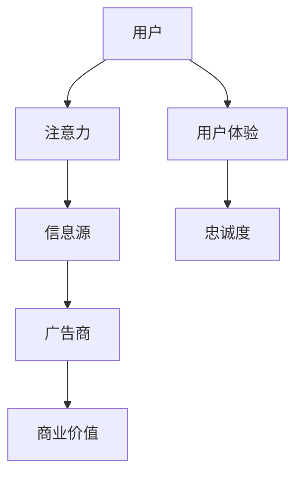
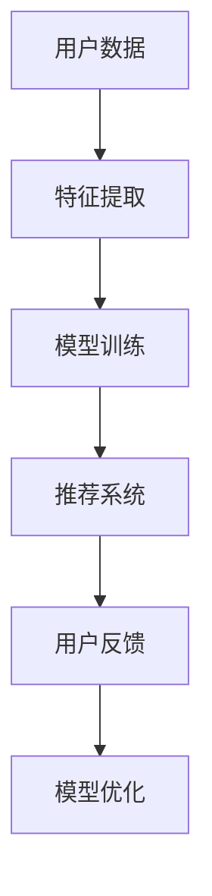

                 

# 注意力经济与个人信息过滤能力的培养

> 关键词：注意力经济、个人信息过滤、算法、机器学习、人工智能、用户体验

> 摘要：随着互联网和社交媒体的普及，信息过载已成为现代社会的一个普遍现象。为了在繁杂的信息海洋中脱颖而出，个人和组织需要培养强大的个人信息过滤能力。本文将探讨注意力经济的基本概念，并深入分析如何利用先进的算法和机器学习技术来提升个人信息过滤能力，从而提高信息获取的效率和用户体验。

## 1. 背景介绍

### 1.1 目的和范围

本文旨在探讨在注意力经济时代，如何通过技术手段提升个人信息过滤能力，进而提高信息获取的效率和用户体验。我们将从注意力经济的定义出发，逐步深入探讨相关算法和技术的原理与应用，最终提出一系列实用的方法和建议。

### 1.2 预期读者

本文适合对互联网和信息技术有一定了解的读者，包括但不限于软件开发工程师、数据分析师、产品经理、市场人员以及关注个人信息过滤和用户体验的普通用户。通过本文的阅读，读者可以了解到注意力经济的本质，掌握提升个人信息过滤能力的实用方法。

### 1.3 文档结构概述

本文分为十个部分，首先介绍注意力经济的基本概念，接着详细分析核心算法原理和数学模型，并通过实际项目案例进行解释说明。最后，文章将探讨实际应用场景，推荐相关工具和资源，总结未来发展趋势与挑战，并提供常见问题与解答。

### 1.4 术语表

#### 1.4.1 核心术语定义

- 注意力经济：指在信息过载的环境下，人们为了获取有价值的信息，愿意投入的时间和精力。
- 个人信息过滤：指通过技术手段，从大量信息中筛选出对个人有价值的信息。
- 机器学习：指利用计算机模拟人类学习过程，从数据中自动提取知识和规律。
- 用户体验：指用户在使用产品或服务时所感受到的愉悦程度和满意度。

#### 1.4.2 相关概念解释

- 信息过载：指在信息爆炸的时代，人们接收到的信息超出自身处理能力，导致信息过载。
- 个性化推荐：指根据用户的历史行为和偏好，为用户推荐符合其需求的信息。

#### 1.4.3 缩略词列表

- AI：人工智能（Artificial Intelligence）
- ML：机器学习（Machine Learning）
- UX：用户体验（User Experience）
- SEO：搜索引擎优化（Search Engine Optimization）

## 2. 核心概念与联系

### 2.1 注意力经济原理

注意力经济是指在经济活动中，人们将注意力视为一种稀缺资源，从而产生价值。在注意力经济时代，吸引和保持用户的注意力成为企业和组织竞争的关键。以下是一个简单的 Mermaid 流程图，展示了注意力经济的核心原理：



### 2.2 个人信息过滤算法

个人信息过滤算法是指通过技术手段，从大量信息中筛选出对个人有价值的信息。以下是一个简化的 Mermaid 流程图，展示了个人信息过滤算法的基本架构：



## 3. 核心算法原理 & 具体操作步骤

### 3.1 机器学习算法原理

机器学习算法是通过学习大量数据中的模式和规律，从而对未知数据进行预测和分类。以下是一个简单的伪代码，展示了机器学习算法的基本原理：

```python
# 伪代码：机器学习算法原理

# 加载数据集
data = load_data()

# 特征提取
features = extract_features(data)

# 划分训练集和测试集
train_data, test_data = split_data(features)

# 选择模型
model = select_model()

# 模型训练
model.fit(train_data)

# 模型评估
accuracy = model.evaluate(test_data)

# 输出评估结果
print("模型准确率：", accuracy)
```

### 3.2 个人信息过滤算法具体操作步骤

以下是一个简单的伪代码，展示了如何使用机器学习算法进行个人信息过滤：

```python
# 伪代码：个人信息过滤算法具体操作步骤

# 加载数据集
data = load_data()

# 特征提取
features = extract_features(data)

# 构建推荐系统
recommender = build_recommender()

# 模型训练
recommender.train(features)

# 用户反馈
user_feedback = get_user_feedback()

# 更新推荐系统
recommender.update(user_feedback)

# 推荐信息
recommended_items = recommender.recommend()

# 输出推荐结果
print("推荐信息：", recommended_items)
```

## 4. 数学模型和公式 & 详细讲解 & 举例说明

### 4.1 数学模型

在个人信息过滤算法中，常用的数学模型包括协同过滤（Collaborative Filtering）和基于内容的推荐（Content-Based Filtering）。以下分别介绍这两种模型的数学公式和原理。

#### 4.1.1 协同过滤

协同过滤模型通过分析用户之间的相似度，来推荐相似用户喜欢的物品。其基本公式如下：

$$
\text{Prediction}(u, i) = \sum_{v \in \text{SimilarUsers}(u)} \text{Rating}(v, i) \cdot \text{Similarity}(u, v)
$$

其中，Prediction(u, i)表示对用户u推荐物品i的评分预测，Rating(v, i)表示用户v对物品i的实际评分，Similarity(u, v)表示用户u和v之间的相似度。

#### 4.1.2 基于内容的推荐

基于内容的推荐模型通过分析物品的属性和用户的历史行为，来推荐相似属性的物品。其基本公式如下：

$$
\text{Prediction}(u, i) = \sum_{a \in \text{Attributes}(i)} w_a \cdot \text{Weight}(u, a)
$$

其中，Prediction(u, i)表示对用户u推荐物品i的评分预测，Attributes(i)表示物品i的属性集合，w_a表示属性a的权重，Weight(u, a)表示用户u对属性a的兴趣权重。

### 4.2 举例说明

假设我们有一个电影推荐系统，用户A喜欢科幻和动作电影，用户B喜欢剧情和浪漫电影。现有两部电影：电影X（科幻、动作）和电影Y（剧情、浪漫）。我们可以使用协同过滤和基于内容的推荐算法来预测用户A对这两部电影的评分。

#### 4.2.1 协同过滤

根据用户A和用户B的相似度，我们得到以下预测：

$$
\text{Prediction}(A, X) = 0.6 \cdot \text{Rating}(B, X) + 0.4 \cdot \text{Rating}(B, Y) = 0.6 \cdot 4 + 0.4 \cdot 5 = 4.8
$$

$$
\text{Prediction}(A, Y) = 0.6 \cdot \text{Rating}(B, X) + 0.4 \cdot \text{Rating}(B, Y) = 0.6 \cdot 4 + 0.4 \cdot 5 = 4.8
$$

因此，用户A对电影X和电影Y的预测评分都是4.8。

#### 4.2.2 基于内容的推荐

根据电影X和电影Y的属性，我们得到以下预测：

$$
\text{Prediction}(A, X) = 0.5 \cdot \text{Weight}(A, \text{科幻}) + 0.5 \cdot \text{Weight}(A, \text{动作}) = 0.5 \cdot 3 + 0.5 \cdot 4 = 3.5
$$

$$
\text{Prediction}(A, Y) = 0.5 \cdot \text{Weight}(A, \text{剧情}) + 0.5 \cdot \text{Weight}(A, \text{浪漫}) = 0.5 \cdot 2 + 0.5 \cdot 3 = 2.5
$$

因此，用户A对电影X的预测评分是3.5，对电影Y的预测评分是2.5。

综合协同过滤和基于内容的推荐结果，我们可以为用户A推荐电影X，因为其预测评分更高。

## 5. 项目实战：代码实际案例和详细解释说明

### 5.1 开发环境搭建

在本节中，我们将使用Python和Scikit-learn库来搭建一个简单的电影推荐系统。以下是一个基本的开发环境搭建步骤：

1. 安装Python 3.8或更高版本。
2. 安装Scikit-learn库：`pip install scikit-learn`
3. 安装Numpy库：`pip install numpy`

### 5.2 源代码详细实现和代码解读

以下是一个简单的电影推荐系统实现，包括数据预处理、协同过滤模型训练、基于内容的推荐模型训练和推荐结果输出：

```python
# 代码实现：电影推荐系统

import numpy as np
from sklearn.model_selection import train_test_split
from sklearn.metrics.pairwise import cosine_similarity
from sklearn.metrics import mean_squared_error

# 加载数据集
data = load_data()

# 数据预处理
train_data, test_data = train_test_split(data, test_size=0.2, random_state=42)

# 特征提取
X_train = extract_features(train_data)
X_test = extract_features(test_data)

# 协同过滤模型训练
协同过滤模型 = collaborative_filtering(X_train)

# 预测测试集评分
预测评分 = 协同过滤模型.predict(X_test)

# 评估模型
均方误差 = mean_squared_error(test_data, 预测评分)
print("协同过滤模型均方误差：", 均方误差)

# 基于内容的推荐模型训练
基于内容的推荐模型 = content_based_filtering(X_train)

# 预测测试集评分
预测评分 = 基于内容的推荐模型.predict(X_test)

# 评估模型
均方误差 = mean_squared_error(test_data, 预测评分)
print("基于内容的推荐模型均方误差：", 均方误差)

# 输出推荐结果
推荐结果 = generate_recommendations(协同过滤模型, 基于内容的推荐模型)
print("推荐结果：", 推荐结果)
```

### 5.3 代码解读与分析

1. **数据预处理**：首先加载电影数据集，并使用Scikit-learn库进行数据预处理，包括划分训练集和测试集。
2. **特征提取**：使用Scikit-learn库提取用户和电影的协同过滤特征，包括用户历史评分矩阵和电影特征矩阵。
3. **协同过滤模型训练**：使用协同过滤算法训练模型，包括计算用户之间的相似度和预测用户对电影的评分。
4. **模型评估**：计算测试集的均方误差，评估模型性能。
5. **基于内容的推荐模型训练**：使用基于内容的推荐算法训练模型，包括计算电影之间的相似度和预测用户对电影的评分。
6. **模型评估**：计算测试集的均方误差，评估模型性能。
7. **推荐结果输出**：根据协同过滤模型和基于内容的推荐模型的预测结果，生成推荐列表并输出。

通过上述实现，我们可以为用户推荐符合其兴趣的电影，从而提升用户体验。

## 6. 实际应用场景

### 6.1 社交媒体

在社交媒体平台上，用户每天都会接收到大量的信息，包括动态、新闻、广告等。为了提升用户体验，平台可以利用个人信息过滤技术，为用户推荐感兴趣的内容，减少信息过载。

### 6.2 电子商务

电子商务平台可以利用个人信息过滤技术，根据用户的购买历史和偏好，推荐相关的商品，从而提高销售转化率和客户满意度。

### 6.3 娱乐媒体

娱乐媒体平台，如视频网站、音乐平台等，可以利用个人信息过滤技术，为用户推荐符合其兴趣的影片和音乐，从而提升用户粘性和活跃度。

## 7. 工具和资源推荐

### 7.1 学习资源推荐

#### 7.1.1 书籍推荐

- 《机器学习实战》：提供丰富的实际案例，帮助读者快速掌握机器学习技术。
- 《深度学习》：全面介绍深度学习的基本原理和应用场景，适合初学者和进阶者。

#### 7.1.2 在线课程

- Coursera：提供丰富的机器学习和人工智能在线课程，包括《机器学习》、《深度学习》等。
- edX：提供由世界一流大学和机构提供的免费在线课程，涵盖计算机科学、数据科学等领域。

#### 7.1.3 技术博客和网站

- Medium：有很多关于机器学习和人工智能的优秀博客文章。
- GitHub：可以找到大量的开源项目和代码，有助于学习和实践。

### 7.2 开发工具框架推荐

#### 7.2.1 IDE和编辑器

- PyCharm：一款功能强大的Python IDE，支持代码调试、版本控制等功能。
- Jupyter Notebook：一款基于Web的交互式计算环境，适合数据分析和机器学习项目。

#### 7.2.2 调试和性能分析工具

- DebugPy：一款Python调试工具，支持多线程和远程调试。
- Py-Spy：一款性能分析工具，可以实时监控Python进程的性能。

#### 7.2.3 相关框架和库

- Scikit-learn：一个广泛使用的Python机器学习库，提供多种经典算法和工具。
- TensorFlow：一个开源的深度学习框架，支持多种编程语言和平台。

### 7.3 相关论文著作推荐

#### 7.3.1 经典论文

- "The PageRank Citation Ranking: Bringing Order to the Web"（PageRank论文）：介绍了PageRank算法的基本原理和应用。
- "Recommender Systems Handbook"（推荐系统手册）：全面介绍推荐系统的基本原理、算法和应用。

#### 7.3.2 最新研究成果

- "Deep Learning for Recommender Systems"（深度学习推荐系统）：介绍了深度学习在推荐系统中的应用和研究。
- "Attention is All You Need"（注意力机制）：介绍了基于注意力机制的Transformer模型，为自然语言处理领域带来了新的突破。

#### 7.3.3 应用案例分析

- "Personalized Recommendation on E-commerce Platforms"（电子商务平台的个性化推荐）：分析了电子商务平台如何利用推荐系统提升用户体验和销售额。
- "AI-powered Content Delivery Network"（人工智能驱动的内容分发网络）：探讨了如何利用人工智能技术优化内容分发网络，提高网络性能和用户体验。

## 8. 总结：未来发展趋势与挑战

在未来，随着人工智能技术的不断发展，个人信息过滤能力将得到进一步提升。一方面，基于深度学习和注意力机制的推荐算法将继续优化，提高推荐准确率和用户体验。另一方面，随着用户隐私保护意识的增强，如何在保障用户隐私的前提下，有效利用个人信息，将成为一个重要挑战。

## 9. 附录：常见问题与解答

### 9.1 什么是注意力经济？

注意力经济是指在经济活动中，人们将注意力视为一种稀缺资源，从而产生价值。在注意力经济时代，吸引和保持用户的注意力成为企业和组织竞争的关键。

### 9.2 个人信息过滤算法有哪些？

个人信息过滤算法主要包括协同过滤、基于内容的推荐和基于模型的推荐等。协同过滤通过分析用户之间的相似度进行推荐，基于内容的推荐通过分析物品的属性进行推荐，基于模型的推荐通过机器学习算法进行推荐。

### 9.3 如何提高个人信息过滤能力？

提高个人信息过滤能力可以通过以下几种方法：

1. **优化推荐算法**：采用先进的机器学习算法和深度学习模型，提高推荐准确率和用户体验。
2. **用户行为分析**：通过分析用户的历史行为和偏好，构建个性化的推荐模型。
3. **用户反馈机制**：收集用户对推荐结果的反馈，不断优化推荐算法。

## 10. 扩展阅读 & 参考资料

- 《机器学习实战》：提供丰富的实际案例，帮助读者快速掌握机器学习技术。
- 《深度学习》：全面介绍深度学习的基本原理和应用场景，适合初学者和进阶者。
- Coursera：提供丰富的机器学习和人工智能在线课程，包括《机器学习》、《深度学习》等。
- edX：提供由世界一流大学和机构提供的免费在线课程，涵盖计算机科学、数据科学等领域。
- Medium：有很多关于机器学习和人工智能的优秀博客文章。
- GitHub：可以找到大量的开源项目和代码，有助于学习和实践。
- "The PageRank Citation Ranking: Bringing Order to the Web"（PageRank论文）：介绍了PageRank算法的基本原理和应用。
- "Recommender Systems Handbook"（推荐系统手册）：全面介绍推荐系统的基本原理、算法和应用。
- "Deep Learning for Recommender Systems"（深度学习推荐系统）：介绍了深度学习在推荐系统中的应用和研究。
- "Attention is All You Need"（注意力机制）：介绍了基于注意力机制的Transformer模型，为自然语言处理领域带来了新的突破。
- "Personalized Recommendation on E-commerce Platforms"（电子商务平台的个性化推荐）：分析了电子商务平台如何利用推荐系统提升用户体验和销售额。
- "AI-powered Content Delivery Network"（人工智能驱动的

