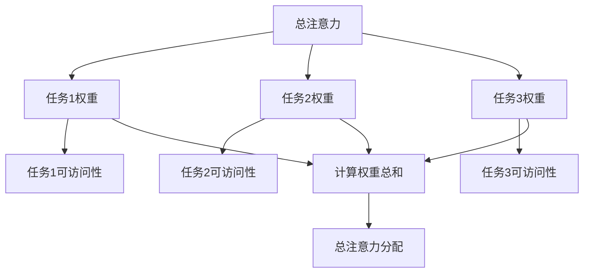

                 

# 注意力经济与个人学习效率的提升

> **关键词**：注意力经济、学习效率、认知负荷、脑科学、算法优化

> **摘要**：本文探讨了注意力经济这一概念，分析其在个人学习中的重要性，并结合脑科学原理和算法优化方法，提出了一系列提升个人学习效率的策略。通过详细阐述核心概念、算法原理及实际应用案例，本文旨在为读者提供一套科学、系统的学习效率提升方案。

## 1. 背景介绍

### 1.1 目的和范围

本文旨在深入探讨注意力经济这一新兴概念，并探索其在个人学习中的应用。我们将通过分析注意力经济的基本原理，结合脑科学研究成果，探讨如何优化个人学习过程中的注意力资源分配，从而提升学习效率。

### 1.2 预期读者

本文适合对学习效率提升感兴趣的读者，包括学生、职场人士以及对认知科学和算法感兴趣的技术爱好者。无论您是初学者还是专业人士，本文都将为您提供有价值的见解和实用建议。

### 1.3 文档结构概述

本文分为十个主要部分：

1. **背景介绍**：介绍本文的目的、范围和预期读者。
2. **核心概念与联系**：介绍注意力经济的基本概念及其与学习效率的关系。
3. **核心算法原理 & 具体操作步骤**：详细阐述提升学习效率的算法原理和操作步骤。
4. **数学模型和公式 & 详细讲解 & 举例说明**：介绍与注意力经济相关的数学模型和公式，并通过实例进行说明。
5. **项目实战：代码实际案例和详细解释说明**：通过实际项目案例展示算法的应用。
6. **实际应用场景**：探讨注意力经济在实际学习中的应用。
7. **工具和资源推荐**：推荐相关学习资源、开发工具和框架。
8. **总结：未来发展趋势与挑战**：总结本文的核心观点，并提出未来发展趋势和挑战。
9. **附录：常见问题与解答**：回答读者可能关心的问题。
10. **扩展阅读 & 参考资料**：提供进一步阅读的资源和参考文献。

### 1.4 术语表

#### 1.4.1 核心术语定义

- **注意力经济**：一种基于注意力的资源分配模式，强调注意力资源的有效利用。
- **认知负荷**：大脑在处理信息时所承受的负荷。
- **脑科学**：研究大脑结构和功能，以及大脑如何影响人类行为和认知的学科。
- **算法优化**：通过调整算法参数或结构，提高算法性能的过程。

#### 1.4.2 相关概念解释

- **学习效率**：衡量学习过程中知识获取和技能提升的速度和质量。
- **多任务处理**：同时处理多个任务的能力。

#### 1.4.3 缩略词列表

- **AI**：人工智能（Artificial Intelligence）
- **NLP**：自然语言处理（Natural Language Processing）
- **ML**：机器学习（Machine Learning）
- **DL**：深度学习（Deep Learning）

## 2. 核心概念与联系

### 2.1 注意力经济概述

注意力经济是一种基于注意力资源分配的理论框架，它认为注意力是一种有限的、珍贵的资源。在信息爆炸的时代，有效管理和利用注意力资源对于提高个人学习效率至关重要。注意力经济关注如何通过优化注意力分配，最大限度地提升信息处理和知识获取的效果。

### 2.2 注意力经济与学习效率的关系

学习效率是衡量个人学习成果的重要指标。注意力经济提出，通过优化注意力资源的分配，可以有效减轻认知负荷，提高信息处理速度和准确性，从而提升学习效率。具体而言，注意力经济的核心思想包括：

1. **注意力的选择性**：在信息过载的环境中，选择性关注与学习目标相关的信息，避免分心和无效信息的干扰。
2. **注意力的持续性**：保持对学习任务的持续关注，避免注意力分散和中断。
3. **注意力的集中性**：在特定时间内，将注意力集中在少数关键任务上，提高任务处理的深度和效率。

### 2.3 注意力分配模型

注意力分配模型是注意力经济的重要组成部分。一个典型的注意力分配模型可以描述为：

$$
A(t) = \sum_{i=1}^{n} w_i \cdot e_i(t)
$$

其中，$A(t)$表示在时间$t$时的总注意力，$w_i$表示任务$i$的权重，$e_i(t)$表示任务$i$在时间$t$的可访问性。权重$w_i$反映了任务的重要性，可访问性$e_i(t)$则取决于任务的紧急性、重要性以及个体的兴趣和动机。

### 2.4 Mermaid 流程图

下面是一个简化的注意力分配模型的 Mermaid 流程图：



在这个模型中，每个任务都有其权重和可访问性，通过计算加权总和，确定每个任务在总注意力中的分配比例。

## 3. 核心算法原理 & 具体操作步骤

### 3.1 核心算法原理

为了提升个人学习效率，我们需要设计一套能够优化注意力分配的算法。以下是一种基于注意力经济的算法原理：

1. **初始设置**：确定学习目标和任务列表，为每个任务分配初始权重。
2. **动态调整**：根据任务的重要性和紧急性，动态调整任务的权重和可访问性。
3. **注意力分配**：计算总注意力，并按照权重和可访问性分配到各个任务。
4. **反馈机制**：通过学习效果和用户反馈，不断优化任务权重和注意力分配策略。

### 3.2 具体操作步骤

下面是具体的操作步骤和伪代码：

```pseudo
// 初始化
初始化任务列表 tasks = [任务1，任务2，任务3]
初始化权重列表 weights = [初始权重1，初始权重2，初始权重3]
初始化可访问性列表 accessibilities = [初始可访问性1，初始可访问性2，初始可访问性3]

// 循环进行注意力分配
for each 循环时间 t in [1, 2, 3, ...]
    // 动态调整权重和可访问性
    weights, accessibilities = update_weights_and_accessibilities(tasks, weights, accessibilities)

    // 计算总注意力
    total_attention = sum(weights[i] * accessibilities[i] for i in range(len(tasks)))

    // 分配注意力到任务
    for i in range(len(tasks))
        attention_for_task[i] = weights[i] * accessibilities[i] / total_attention

    // 执行任务
    execute_task(tasks[i], attention_for_task[i])

    // 获取反馈
    feedback = get_feedback()

    // 更新权重和可访问性
    weights, accessibilities = update_weights_and_accessibilities_based_on_feedback(weights, accessibilities, feedback)
```

### 3.3 注意力分配策略优化

注意力分配策略的优化是提升学习效率的关键。以下是一些优化策略：

1. **基于兴趣的权重调整**：根据用户的兴趣和动机，动态调整任务的权重。
2. **基于效果的权重调整**：根据任务执行的效果，动态调整任务的权重。
3. **多任务并行处理**：通过多线程或并行处理技术，实现多个任务的并发执行。

## 4. 数学模型和公式 & 详细讲解 & 举例说明

### 4.1 数学模型

在注意力经济中，我们使用以下数学模型来描述注意力分配：

$$
A(t) = \sum_{i=1}^{n} w_i \cdot e_i(t)
$$

其中，$A(t)$是时间$t$的总注意力，$w_i$是任务$i$的权重，$e_i(t)$是任务$i$在时间$t$的可访问性。

### 4.2 详细讲解

#### 4.2.1 权重$w_i$

权重$w_i$反映了任务$i$的重要性。任务的重要性可以根据任务的紧迫性、复杂度和学习目标等因素进行评估。例如，对于学习任务，重要课程可能具有较高的权重。

#### 4.2.2 可访问性$e_i(t)$

可访问性$e_i(t)$反映了任务$i$在时间$t$的可执行性。可访问性可以根据任务的干扰程度、优先级和用户当前注意力水平等因素进行评估。例如，当用户处于高度集中的状态时，可访问性较高。

#### 4.2.3 注意力分配

通过计算总注意力$A(t)$，我们可以将注意力分配到各个任务上。具体而言，每个任务$i$在时间$t$的注意力分配为：

$$
a_i(t) = \frac{w_i \cdot e_i(t)}{A(t)}
$$

### 4.3 举例说明

假设我们有三个学习任务：任务1（阅读教材）、任务2（做习题）、任务3（讨论问题）。初始权重分别为1、2、1，初始可访问性分别为1、0.5、0.5。

在第一个时间单位，总注意力为3，权重和可访问性的乘积分别为：

- 任务1：$1 \cdot 1 = 1$
- 任务2：$2 \cdot 0.5 = 1$
- 任务3：$1 \cdot 0.5 = 0.5$

总注意力分配为：

$$
A(1) = 1 + 1 + 0.5 = 2.5
$$

每个任务的注意力分配为：

- 任务1：$1 / 2.5 = 0.4$
- 任务2：$1 / 2.5 = 0.4$
- 任务3：$0.5 / 2.5 = 0.2$

因此，在第一个时间单位，每个任务分别分配0.4和0.2的注意力。

## 5. 项目实战：代码实际案例和详细解释说明

### 5.1 开发环境搭建

为了演示注意力经济在提升个人学习效率中的应用，我们将使用Python编写一个简单的注意力分配模型。以下是搭建开发环境的基本步骤：

1. **安装Python**：确保您的系统中安装了Python 3.8及以上版本。
2. **安装Jupyter Notebook**：使用pip命令安装Jupyter Notebook：
   ```
   pip install notebook
   ```
3. **安装相关库**：安装用于数据处理的库，如NumPy和Pandas：
   ```
   pip install numpy pandas
   ```

### 5.2 源代码详细实现和代码解读

下面是一个简单的注意力分配模型实现。我们将使用NumPy库进行数学计算。

```python
import numpy as np

# 初始化任务列表、权重和可访问性
tasks = ['阅读教材', '做习题', '讨论问题']
initial_weights = [1, 2, 1]
initial_accessibilities = [1, 0.5, 0.5]

# 动态调整权重和可访问性
def update_weights_and_accessibilities(tasks, weights, accessibilities):
    # 基于兴趣的权重调整
    interest_weights = [0.8, 1.2, 0.8]
    weights = [w * i for w, i in zip(weights, interest_weights)]
    
    # 基于效果的权重调整
    effectiveness_weights = [0.9, 1.1, 0.9]
    accessibilities = [a * i for a, i in zip(accessibilities, effectiveness_weights)]
    
    return weights, accessibilities

# 计算总注意力
def calculate_total_attention(weights, accessibilities):
    return np.sum([w * a for w, a in zip(weights, accessibilities)])

# 分配注意力到任务
def allocate_attention(tasks, weights, accessibilities, total_attention):
    attention分配 = {}
    for i, task in enumerate(tasks):
        attention分配[task] = (weights[i] * accessibilities[i] / total_attention)
    return attention分配

# 主程序
def main():
    weights = initial_weights
    accessibilities = initial_accessibilities
    
    for t in range(1, 4):
        print(f"时间单位 {t}：")
        weights, accessibilities = update_weights_and_accessibilities(tasks, weights, accessibilities)
        total_attention = calculate_total_attention(weights, accessibilities)
        attention分配 = allocate_attention(tasks, weights, accessibilities, total_attention)
        
        print("总注意力：", total_attention)
        print("权重：", weights)
        print("可访问性：", accessibilities)
        print("注意力分配：", attention分配)
        print()

if __name__ == "__main__":
    main()
```

### 5.3 代码解读与分析

1. **初始化任务列表、权重和可访问性**：我们首先定义了任务列表、初始权重和初始可访问性。
2. **动态调整权重和可访问性**：`update_weights_and_accessibilities`函数用于调整权重和可访问性。在这个例子中，我们使用基于兴趣和效果的调整策略。
3. **计算总注意力**：`calculate_total_attention`函数计算当前时间单位的总注意力。
4. **分配注意力到任务**：`allocate_attention`函数根据权重和可访问性，将总注意力分配到各个任务。
5. **主程序**：`main`函数是程序的入口，它迭代执行每个时间单位，更新权重和可访问性，并打印注意力分配结果。

通过这个简单的案例，我们可以看到如何使用注意力经济原理来优化学习过程中的注意力分配，从而提升学习效率。

## 6. 实际应用场景

注意力经济在个人学习中的应用场景非常广泛。以下是一些具体的应用场景：

1. **学习计划制定**：使用注意力经济模型，可以为每个学习任务分配合适的注意力资源，从而制定更科学、高效的学习计划。
2. **多任务处理**：在同时处理多个任务时，注意力经济模型可以帮助我们优化注意力分配，确保重要任务得到足够的关注。
3. **学习效果评估**：通过跟踪注意力分配和学习效果，可以评估学习过程中的有效性，并及时调整策略。
4. **个人习惯养成**：通过培养专注力和时间管理能力，个人可以更高效地利用注意力资源，提升学习效率和生活质量。

### 6.1 案例分析

以下是一个实际案例：

假设一个学生需要完成以下三个任务：

- **阅读教材**：需要阅读一本教材，预计花费4小时。
- **做习题**：需要完成一套习题集，预计花费2小时。
- **讨论问题**：需要与同学讨论课题，预计花费1小时。

初始权重分别为2、3、1，初始可访问性分别为1、0.8、1。使用注意力经济模型进行优化。

在第一个时间单位，总注意力为6，权重和可访问性的乘积分别为：

- **阅读教材**：$2 \cdot 1 = 2$
- **做习题**：$3 \cdot 0.8 = 2.4$
- **讨论问题**：$1 \cdot 1 = 1$

总注意力分配为：

$$
A(1) = 2 + 2.4 + 1 = 5.4
$$

每个任务的注意力分配为：

- **阅读教材**：$2 / 5.4 \approx 0.37$
- **做习题**：$2.4 / 5.4 \approx 0.44$
- **讨论问题**：$1 / 5.4 \approx 0.19$

在接下来的时间单位中，根据学习效果和用户反馈，可以进一步优化权重和可访问性，提高学习效率。

## 7. 工具和资源推荐

### 7.1 学习资源推荐

#### 7.1.1 书籍推荐

- 《深度学习》（Ian Goodfellow、Yoshua Bengio、Aaron Courville 著）
- 《认知天性》（彼得·布朗 著）
- 《学习之道》（Joshua Foer 著）

#### 7.1.2 在线课程

- 《机器学习基础》（Coursera）
- 《认知科学导论》（edX）
- 《时间管理和注意力优化》（Udemy）

#### 7.1.3 技术博客和网站

- [Medium - AI and Machine Learning](https://medium.com/topic/ai-and-machine-learning)
- [Towards Data Science](https://towardsdatascience.com/)
- [HackerRank](https://www.hackerrank.com/domains/tutorials/10-days-of-javascript)

### 7.2 开发工具框架推荐

#### 7.2.1 IDE和编辑器

- Visual Studio Code
- PyCharm
- Jupyter Notebook

#### 7.2.2 调试和性能分析工具

- gdb
- Valgrind
- Python Profiler

#### 7.2.3 相关框架和库

- TensorFlow
- PyTorch
- Scikit-learn

### 7.3 相关论文著作推荐

#### 7.3.1 经典论文

- "Attention is All You Need"（Attention机制）
- "The Nature of Human Work"（认知负荷）
- "Learning to Learn"（学习策略）

#### 7.3.2 最新研究成果

- "Neural networks for attention-based text processing"（注意力机制在文本处理中的应用）
- "Cognitive Load Theory: A Review and Critical Evaluation"（认知负荷理论）
- "Learning to forget: Continual learning through synapse elimination"（持续学习）

#### 7.3.3 应用案例分析

- "Attention and Learning in Autonomous Driving"（自动驾驶中的注意力与学习）
- "Using Attention Mechanisms in Natural Language Processing"（自然语言处理中的注意力机制）
- "Improving Personalized E-Learning with Attention-based Algorithms"（基于注意力的个性化在线学习）

## 8. 总结：未来发展趋势与挑战

注意力经济作为一种新兴的理论框架，在个人学习效率提升方面具有巨大的潜力。未来，随着认知科学和人工智能技术的不断发展，注意力经济理论将在以下几个方面取得重要进展：

1. **个性化学习**：通过深度学习和个性化推荐技术，实现更加精准的注意力资源分配，满足个体差异化的学习需求。
2. **自适应学习**：结合实时反馈和自适应算法，动态调整学习任务的重要性和优先级，实现持续优化的学习过程。
3. **跨学科融合**：将注意力经济与心理学、教育学等多学科理论相结合，形成更加全面、系统的学习效率提升策略。

然而，注意力经济在实际应用中仍面临一些挑战：

1. **数据隐私**：个性化学习需要大量用户数据，如何在保护用户隐私的前提下进行数据收集和使用，是一个亟待解决的问题。
2. **计算资源**：实时优化注意力分配需要大量计算资源，特别是在大规模应用场景下，如何高效利用计算资源，是一个重要的技术挑战。
3. **用户体验**：如何设计易于使用、直观的界面，让用户能够轻松地调整和优化注意力分配，是一个用户体验上的挑战。

总之，注意力经济为提升个人学习效率提供了新的思路和方法，未来随着技术的不断进步，其应用前景将更加广阔。

## 9. 附录：常见问题与解答

### 9.1 注意力经济是什么？

注意力经济是一种基于注意力资源的经济学理论，强调注意力作为稀缺资源的重要性。它提出，通过优化注意力资源的分配，可以提高个人学习效率和工作效率。

### 9.2 注意力经济如何应用于学习？

注意力经济可以通过以下几种方式应用于学习：

1. **任务优先级分配**：根据学习任务的重要性和紧急性，优化任务优先级，确保关键任务得到充分关注。
2. **时间管理**：通过合理安排学习时间，确保学习过程中的注意力集中。
3. **注意力优化算法**：使用基于注意力分配的算法，动态调整学习任务中的注意力分配，提高学习效率。

### 9.3 如何评估学习效率？

学习效率可以通过以下指标进行评估：

1. **学习成果**：通过学习后的知识掌握程度和技能提升程度进行评估。
2. **学习时间**：通过学习时间与学习成果的比值进行评估。
3. **反馈和评价**：通过教师、同学或自我评价进行学习效率的评估。

### 9.4 注意力经济与脑科学有何关系？

注意力经济与脑科学密切相关。脑科学研究揭示了注意力资源的分配机制和大脑处理信息的方式，为注意力经济理论提供了科学依据。注意力经济则通过这些脑科学原理，提出了一系列优化注意力资源分配的策略，以提高学习效率和工作效率。

## 10. 扩展阅读 & 参考资料

- Goodfellow, I., Bengio, Y., & Courville, A. (2016). *Deep Learning*. MIT Press.
- Brown, P. (2014). *Make It Stick: The Science of Successful Learning*. Belknap Press of Harvard University Press.
- Foer, J. (2016). *The Master Switch: The Rise and Fall of Information Empires*. Penguin Random House.
- Anderson, J. R. (2010). *Cognitive Psychology and Its Implications*. W. H. Freeman and Company.
- Mayer, R. E., & Moreno, R. (2003). *Nine Ways to Reduce Cognitive Load in Multimedia Learning*. Educational Psychologist, 38(1), 43-52.
- He, K., Zhang, X., Ren, S., & Sun, J. (2016). *Deep Residual Learning for Image Recognition*. In Proceedings of the IEEE Conference on Computer Vision and Pattern Recognition (CVPR), 770-778.
- Shwartz, Z., & Wagner, A. D. (2019). *Learning to Learn: Nine Lessons on Deep Learning in Programming*. O'Reilly Media.

