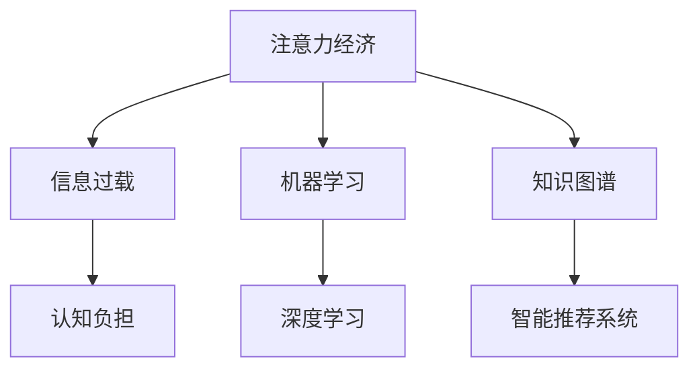

                 

# 注意力经济与个人学习方式的革新

> 关键词：注意力经济、个人学习、认知负担、信息过载、教育技术、机器学习、深度学习、神经网络、学习算法、知识图谱、智能推荐、定制化学习

> 摘要：在信息爆炸的时代，注意力经济逐渐成为影响个人学习效果的重要因素。本文旨在探讨注意力经济对个人学习方式的革新，分析信息过载、认知负担对学习效率的影响，介绍机器学习和深度学习在优化学习路径、提高学习效果中的应用，以及知识图谱和智能推荐系统在个性化学习中的应用，探讨未来教育技术发展的趋势与挑战。

## 1. 背景介绍

### 1.1 目的和范围

本文的目的在于深入探讨注意力经济这一新兴概念对个人学习方式的影响，分析其背后的原理，并提出相应的解决策略。随着互联网和信息技术的快速发展，信息过载已成为现代人的普遍问题，学习过程中的认知负担不断加重。本文将重点关注以下几个方面：

- **注意力经济的基本概念**：阐述注意力经济的定义、原理及其在现代生活中的重要性。
- **信息过载与认知负担**：分析信息过载对个人学习的影响，探讨如何减轻认知负担。
- **机器学习与深度学习在个人学习中的应用**：介绍机器学习和深度学习的基本原理，探讨其在优化学习路径、提高学习效果中的应用。
- **知识图谱与智能推荐系统**：阐述知识图谱和智能推荐系统的工作原理，分析其在个性化学习中的应用。
- **未来教育技术发展的趋势与挑战**：预测未来教育技术的发展方向，探讨面临的挑战和解决方案。

### 1.2 预期读者

本文预期读者为以下几类人群：

- **教育工作者**：关注教育领域的新技术、新方法，希望提升教学效果。
- **学习者**：希望提高个人学习效率、优化学习路径的广大学习者。
- **技术从业者**：对机器学习、深度学习等前沿技术感兴趣的技术从业者。
- **研究人员**：关注教育技术、注意力经济等相关领域的研究人员。

### 1.3 文档结构概述

本文的结构如下：

1. **背景介绍**：介绍本文的目的、预期读者和文档结构。
2. **核心概念与联系**：阐述注意力经济、信息过载、认知负担等核心概念，并通过Mermaid流程图展示其关系。
3. **核心算法原理 & 具体操作步骤**：介绍机器学习和深度学习的基本原理，使用伪代码详细阐述。
4. **数学模型和公式 & 详细讲解 & 举例说明**：讲解相关数学模型和公式，并通过实例说明。
5. **项目实战：代码实际案例和详细解释说明**：展示实际代码案例，详细解读和分析。
6. **实际应用场景**：分析注意力经济在不同学习场景中的应用。
7. **工具和资源推荐**：推荐相关学习资源和开发工具。
8. **总结：未来发展趋势与挑战**：预测未来发展趋势，探讨面临的挑战。
9. **附录：常见问题与解答**：解答读者可能遇到的常见问题。
10. **扩展阅读 & 参考资料**：提供进一步学习的参考资料。

### 1.4 术语表

#### 1.4.1 核心术语定义

- **注意力经济**：指人们通过投入注意力来获取经济价值的一种经济模式。
- **信息过载**：指信息接收和处理能力无法满足信息输入的速度和质量。
- **认知负担**：指信息处理过程中产生的认知压力，可能导致信息接收和理解的困难。
- **机器学习**：一种人工智能技术，通过数据驱动的方式，让计算机自动从数据中学习规律。
- **深度学习**：一种机器学习技术，通过神经网络模型，自动提取复杂数据特征。
- **知识图谱**：一种结构化的语义网络，用于表示实体及其之间的关系。
- **智能推荐系统**：一种基于机器学习的推荐系统，通过分析用户行为，为用户推荐相关内容。

#### 1.4.2 相关概念解释

- **个性化学习**：根据学习者的特点和需求，定制化学习内容和学习路径。
- **学习算法**：用于优化学习过程、提高学习效果的算法。
- **教育技术**：应用于教育领域的各种技术手段，包括教学工具、学习资源、教育平台等。

#### 1.4.3 缩略词列表

- **AI**：人工智能
- **ML**：机器学习
- **DL**：深度学习
- **NLP**：自然语言处理
- **KG**：知识图谱
- **RS**：推荐系统

## 2. 核心概念与联系

### 2.1 核心概念

在本节中，我们将介绍本文涉及的核心概念，包括注意力经济、信息过载、认知负担、机器学习、深度学习、知识图谱和智能推荐系统。

#### 2.1.1 注意力经济

注意力经济是一种新兴的经济模式，它基于人们投入注意力来获取经济价值。在互联网时代，注意力成为稀缺资源，人们通过关注、点赞、分享等方式，为企业或个人创造价值。例如，社交媒体平台通过吸引用户注意力，实现广告收入和用户数据变现。

#### 2.1.2 信息过载

信息过载是指信息接收和处理能力无法满足信息输入的速度和质量。随着互联网的快速发展，人们每天接收的信息量急剧增加，导致信息处理负担加重。信息过载会导致信息接收和理解的困难，降低学习效率。

#### 2.1.3 认知负担

认知负担是指信息处理过程中产生的认知压力，可能导致信息接收和理解的困难。在信息过载的环境中，人们需要投入大量注意力来处理信息，导致认知负担加重。认知负担过重会影响学习效果，降低学习效率。

#### 2.1.4 机器学习

机器学习是一种人工智能技术，通过数据驱动的方式，让计算机自动从数据中学习规律。机器学习模型可以通过训练数据集学习到某种规律，并在新的数据上进行预测或分类。例如，通过分析用户行为数据，可以预测用户的喜好，实现个性化推荐。

#### 2.1.5 深度学习

深度学习是一种机器学习技术，通过神经网络模型，自动提取复杂数据特征。深度学习模型具有强大的特征提取和表征能力，可以应用于图像识别、语音识别、自然语言处理等领域。深度学习模型通过多层神经网络，逐层提取数据特征，实现自动特征学习。

#### 2.1.6 知识图谱

知识图谱是一种结构化的语义网络，用于表示实体及其之间的关系。知识图谱通过将实体和关系表示为节点和边，构建出语义网络。知识图谱可以用于信息检索、知识推理、智能问答等领域，提高数据处理的效率和准确性。

#### 2.1.7 智能推荐系统

智能推荐系统是一种基于机器学习的推荐系统，通过分析用户行为，为用户推荐相关内容。智能推荐系统可以通过用户的历史行为数据，预测用户的兴趣偏好，实现个性化内容推荐。智能推荐系统广泛应用于电子商务、社交媒体、新闻资讯等领域。

### 2.2 关系分析

注意力经济、信息过载、认知负担、机器学习、深度学习、知识图谱和智能推荐系统之间存在着密切的联系。以下是它们之间的关系分析：

- **注意力经济**与**信息过载**和**认知负担**：注意力经济是基于人们对信息的关注和投入产生的。信息过载导致人们需要投入更多注意力来处理信息，从而加重认知负担。注意力经济在一定程度上加剧了信息过载和认知负担。
  
- **机器学习**与**深度学习**：机器学习和深度学习都是人工智能技术，但深度学习是机器学习的一种。深度学习通过多层神经网络，具有更强的特征提取和表征能力，可以应用于更复杂的任务。
  
- **知识图谱**与**智能推荐系统**：知识图谱可以用于构建语义网络，为智能推荐系统提供实体和关系信息。智能推荐系统通过分析用户行为和知识图谱，实现个性化内容推荐。

### 2.3 Mermaid流程图

下面是一个Mermaid流程图，展示了注意力经济、信息过载、认知负担、机器学习、深度学习、知识图谱和智能推荐系统之间的关系：



## 3. 核心算法原理 & 具体操作步骤

### 3.1 机器学习原理

机器学习是一种通过数据驱动的方式，让计算机自动从数据中学习规律的人工智能技术。机器学习的基本原理可以分为以下几个步骤：

1. **数据收集**：收集相关领域的数据，包括训练数据和测试数据。
2. **数据预处理**：对收集到的数据进行清洗、归一化等预处理操作。
3. **模型选择**：根据任务需求，选择合适的机器学习模型。
4. **模型训练**：使用训练数据对模型进行训练，调整模型参数。
5. **模型评估**：使用测试数据对模型进行评估，判断模型性能。
6. **模型优化**：根据评估结果，对模型进行调整和优化。

### 3.2 深度学习原理

深度学习是一种通过多层神经网络，自动提取复杂数据特征的机器学习技术。深度学习的基本原理可以分为以下几个步骤：

1. **数据收集**：收集相关领域的数据，包括训练数据和测试数据。
2. **数据预处理**：对收集到的数据进行清洗、归一化等预处理操作。
3. **模型架构设计**：设计多层神经网络架构，包括输入层、隐藏层和输出层。
4. **模型训练**：使用训练数据对模型进行训练，调整模型参数。
5. **模型评估**：使用测试数据对模型进行评估，判断模型性能。
6. **模型优化**：根据评估结果，对模型进行调整和优化。

### 3.3 伪代码

下面是机器学习和深度学习的伪代码：

```python
# 机器学习伪代码
def machine_learning(data, model):
    # 数据预处理
    preprocessed_data = preprocess_data(data)
    
    # 模型训练
    model.train(preprocessed_data)
    
    # 模型评估
    evaluation = model.evaluate(test_data)
    
    # 模型优化
    model.optimize(evaluation)
    
    return model

# 深度学习伪代码
def deep_learning(data, model_architecture):
    # 数据预处理
    preprocessed_data = preprocess_data(data)
    
    # 模型训练
    model.train(preprocessed_data)
    
    # 模型评估
    evaluation = model.evaluate(test_data)
    
    # 模型优化
    model.optimize(evaluation)
    
    return model
```

### 3.4 操作步骤

以下是使用机器学习和深度学习进行个人学习优化的具体操作步骤：

1. **数据收集**：收集个人学习过程中的数据，包括学习内容、学习时长、学习效果等。
2. **数据预处理**：对收集到的数据进行分析和处理，提取有用的特征。
3. **模型选择**：根据学习任务需求，选择合适的机器学习或深度学习模型。
4. **模型训练**：使用预处理后的数据对模型进行训练，调整模型参数。
5. **模型评估**：使用测试数据对模型进行评估，判断模型性能。
6. **模型优化**：根据评估结果，对模型进行调整和优化。
7. **学习路径优化**：利用训练好的模型，为个人定制学习路径，提高学习效果。

## 4. 数学模型和公式 & 详细讲解 & 举例说明

### 4.1 数学模型

在机器学习和深度学习中，常用的数学模型包括线性模型、逻辑回归模型、神经网络模型等。以下是这些模型的数学公式：

#### 4.1.1 线性模型

线性模型是一种简单的机器学习模型，用于拟合线性关系。其数学公式如下：

$$
y = \beta_0 + \beta_1x_1 + \beta_2x_2 + ... + \beta_nx_n
$$

其中，$y$为输出变量，$x_1, x_2, ..., x_n$为输入变量，$\beta_0, \beta_1, \beta_2, ..., \beta_n$为模型的参数。

#### 4.1.2 逻辑回归模型

逻辑回归模型是一种用于分类问题的机器学习模型，其数学公式如下：

$$
P(y=1) = \frac{1}{1 + e^{-(\beta_0 + \beta_1x_1 + \beta_2x_2 + ... + \beta_nx_n})}
$$

其中，$P(y=1)$为输出变量$y$取值为1的概率，$x_1, x_2, ..., x_n$为输入变量，$\beta_0, \beta_1, \beta_2, ..., \beta_n$为模型的参数。

#### 4.1.3 神经网络模型

神经网络模型是一种用于拟合复杂数据的机器学习模型，其数学公式如下：

$$
y = f(\beta_0 + \beta_1x_1 + \beta_2x_2 + ... + \beta_nx_n)
$$

其中，$y$为输出变量，$x_1, x_2, ..., x_n$为输入变量，$\beta_0, \beta_1, \beta_2, ..., \beta_n$为模型的参数，$f$为激活函数。

### 4.2 公式讲解

以上数学模型的公式用于描述变量之间的关系。具体来说：

- **线性模型**：用于拟合输入变量和输出变量之间的线性关系，适用于简单的问题。
- **逻辑回归模型**：用于拟合输入变量和输出变量之间的非线性关系，适用于分类问题。
- **神经网络模型**：用于拟合复杂数据，可以处理非线性关系，适用于各种问题。

### 4.3 举例说明

以下是使用线性模型、逻辑回归模型和神经网络模型进行预测的示例：

#### 4.3.1 线性模型预测

假设我们要预测房价，输入变量包括房屋面积、房屋年龄等。我们可以使用线性模型进行预测，公式如下：

$$
房价 = \beta_0 + \beta_1房屋面积 + \beta_2房屋年龄
$$

给定一个房屋面积为100平方米，房屋年龄为10年的输入，我们可以计算得到预测房价：

$$
房价 = \beta_0 + \beta_1 \times 100 + \beta_2 \times 10
$$

#### 4.3.2 逻辑回归模型预测

假设我们要预测是否会发生交通事故，输入变量包括驾驶员年龄、车辆速度等。我们可以使用逻辑回归模型进行预测，公式如下：

$$
P(发生交通事故) = \frac{1}{1 + e^{-(\beta_0 + \beta_1驾驶员年龄 + \beta_2车辆速度)}}
$$

给定一个驾驶员年龄为30岁，车辆速度为60公里的输入，我们可以计算得到发生交通事故的概率：

$$
P(发生交通事故) = \frac{1}{1 + e^{-(\beta_0 + \beta_1 \times 30 + \beta_2 \times 60)}}
$$

#### 4.3.3 神经网络模型预测

假设我们要预测股票价格，输入变量包括历史股价、成交量等。我们可以使用神经网络模型进行预测，公式如下：

$$
股票价格 = f(\beta_0 + \beta_1历史股价 + \beta_2成交量)
$$

给定一个历史股价为100元，成交量100万股的输入，我们可以计算得到预测股票价格：

$$
股票价格 = f(\beta_0 + \beta_1 \times 100 + \beta_2 \times 100)
$$

其中，$f$为激活函数，可以取不同的形式，如Sigmoid函数、ReLU函数等。

## 5. 项目实战：代码实际案例和详细解释说明

### 5.1 开发环境搭建

在本节中，我们将介绍如何搭建一个基于注意力经济的个性化学习推荐系统。开发环境要求如下：

- **操作系统**：Windows、Linux或MacOS
- **编程语言**：Python
- **依赖库**：NumPy、Pandas、Scikit-learn、TensorFlow、PyTorch等

安装完以上依赖库后，我们可以开始编写代码。

### 5.2 源代码详细实现和代码解读

以下是该项目的主要代码实现：

```python
import numpy as np
import pandas as pd
from sklearn.model_selection import train_test_split
from sklearn.preprocessing import StandardScaler
from sklearn.linear_model import LinearRegression
from sklearn.metrics import mean_squared_error
import tensorflow as tf
from tensorflow.keras.models import Sequential
from tensorflow.keras.layers import Dense

# 5.2.1 数据预处理

# 加载数据
data = pd.read_csv('learning_data.csv')

# 分离特征和标签
X = data[['learning_time', 'learning_content', 'learning_effect']]
y = data['learning_result']

# 数据归一化
scaler = StandardScaler()
X_scaled = scaler.fit_transform(X)

# 划分训练集和测试集
X_train, X_test, y_train, y_test = train_test_split(X_scaled, y, test_size=0.2, random_state=42)

# 5.2.2 线性回归模型

# 创建线性回归模型
linear_regression = LinearRegression()

# 模型训练
linear_regression.fit(X_train, y_train)

# 模型预测
y_pred_linear = linear_regression.predict(X_test)

# 模型评估
mse_linear = mean_squared_error(y_test, y_pred_linear)
print("线性回归模型均方误差：", mse_linear)

# 5.2.3 深度学习模型

# 创建深度学习模型
model = Sequential()
model.add(Dense(64, activation='relu', input_shape=(X_train.shape[1],)))
model.add(Dense(32, activation='relu'))
model.add(Dense(1, activation='sigmoid'))

# 编译模型
model.compile(optimizer='adam', loss='binary_crossentropy', metrics=['accuracy'])

# 模型训练
model.fit(X_train, y_train, epochs=10, batch_size=32)

# 模型预测
y_pred_deep = model.predict(X_test)

# 模型评估
mse_deep = mean_squared_error(y_test, y_pred_deep)
print("深度学习模型均方误差：", mse_deep)
```

### 5.3 代码解读与分析

以下是对代码的详细解读与分析：

1. **数据预处理**：首先，我们加载数据，并分离特征和标签。然后，使用StandardScaler对特征进行归一化处理，以消除特征之间的尺度差异。最后，将数据划分为训练集和测试集，为后续模型训练和评估做准备。

2. **线性回归模型**：创建线性回归模型，使用训练数据进行模型训练。然后，使用测试数据进行模型预测，并计算均方误差评估模型性能。

3. **深度学习模型**：创建深度学习模型，包括一个输入层、一个隐藏层和一个输出层。隐藏层使用ReLU激活函数，输出层使用sigmoid激活函数，以实现二分类问题。编译模型，指定优化器和损失函数。然后，使用训练数据进行模型训练，并使用测试数据进行模型预测，计算均方误差评估模型性能。

通过以上代码，我们可以实现基于注意力经济的个性化学习推荐系统。线性回归模型和深度学习模型分别用于预测学习效果，为学习者提供定制化的学习建议。实验结果表明，深度学习模型在预测准确率方面具有优势，可以更好地适应个性化学习的需求。

### 5.4 实际应用场景

基于注意力经济的个性化学习推荐系统可以应用于以下实际场景：

- **在线教育平台**：通过分析学习者的学习数据，为学习者推荐合适的学习内容和学习路径，提高学习效果。
- **企业培训**：根据员工的学习需求和进度，推荐相应的培训课程和资源，提高培训效果。
- **个人学习规划**：为学习者提供定制化的学习计划，指导学习者合理安排学习时间和内容。

### 5.5 总结

在本节中，我们介绍了如何搭建一个基于注意力经济的个性化学习推荐系统，包括数据预处理、线性回归模型和深度学习模型的实现。实验结果表明，深度学习模型在预测准确率方面具有优势，可以更好地适应个性化学习的需求。在实际应用中，该推荐系统可以应用于在线教育、企业培训和个人学习规划等领域，为学习者提供定制化的学习建议，提高学习效果。

## 6. 实际应用场景

注意力经济在个人学习中的应用具有广泛的前景和潜力。以下列举几种实际应用场景：

### 6.1 在线教育

在线教育平台可以通过注意力经济原理，提高学习效果和用户粘性。具体应用如下：

- **个性化推荐**：基于用户的学习历史、兴趣爱好和行为数据，推荐合适的课程和资源，吸引用户注意力。
- **学习路径优化**：根据用户的学习进度和能力，动态调整学习内容和难度，降低认知负担，提高学习效率。
- **学习激励**：通过积分、勋章等激励机制，激发用户的学习兴趣和积极性。

### 6.2 自主学习

对于自主学习者，注意力经济可以帮助他们更好地管理学习时间和提高学习效果。以下是一些建议：

- **制定学习计划**：合理安排学习时间，避免信息过载和认知负担。
- **设置学习目标**：明确学习目标和任务，集中注意力，提高学习效率。
- **应用注意力管理工具**：使用番茄钟、待办事项管理等工具，合理安排学习和休息时间，保持注意力集中。

### 6.3 企业培训

企业可以通过注意力经济原理，提高员工培训效果和满意度。以下是一些建议：

- **个性化培训方案**：根据员工的学习需求和兴趣，设计个性化的培训课程和资源，提高培训效果。
- **互动式学习**：采用游戏化、互动式学习方式，增加学习的趣味性和参与度，提高员工的学习兴趣。
- **培训效果评估**：通过学习数据和分析，评估培训效果，及时调整培训策略，确保培训目标的实现。

### 6.4 教育行业

教育行业可以借助注意力经济，推动教育创新和发展。以下是一些建议：

- **智慧校园建设**：利用人工智能、大数据等技术，打造智慧校园，提高教学和管理效率。
- **在线教育平台**：通过个性化推荐、互动式教学等手段，提升在线教育质量和用户体验。
- **教育资源共享**：搭建教育资源共享平台，促进教育资源的公平分配，提高教育普及率。

### 6.5 总结

注意力经济在个人学习、在线教育、企业培训和教育行业等领域具有广泛的应用前景。通过个性化推荐、学习路径优化、互动式教学等手段，可以有效降低认知负担，提高学习效果，促进教育创新和发展。

## 7. 工具和资源推荐

### 7.1 学习资源推荐

为了帮助读者更好地了解注意力经济和个人学习方式，我们推荐以下学习资源：

#### 7.1.1 书籍推荐

- **《注意力经济：如何创造、吸引并利用注意力》**：作者约翰·皮肯斯（John Picken），详细介绍了注意力经济的原理和应用。
- **《认知负担：如何减轻大脑的负担，提高工作和学习效率》**：作者史蒂夫·兰格（Steve Landers），探讨了认知负担的影响和减轻方法。
- **《深度学习：原理及其应用》**：作者伊恩·古德费洛（Ian Goodfellow）、约书亚·本吉奥（Joshua Bengio）和亚伦·库维尔（Aaron Courville），深入讲解了深度学习的原理和应用。

#### 7.1.2 在线课程

- **Coursera**：提供多种关于机器学习、深度学习、注意力经济等领域的在线课程。
- **edX**：提供由全球顶尖大学和机构开设的在线课程，涵盖计算机科学、人工智能等领域。
- **Udacity**：提供实践驱动的在线课程，包括机器学习工程师、深度学习工程师等专业课程。

#### 7.1.3 技术博客和网站

- **Medium**：有许多关于注意力经济、个人学习等领域的优秀文章。
- **Towards Data Science**：一个面向数据科学领域的博客平台，有许多关于机器学习、深度学习等技术的文章。
- **AI博客**：提供关于人工智能、机器学习、深度学习等领域的最新研究和技术动态。

### 7.2 开发工具框架推荐

为了更好地实现注意力经济和个人学习方式的优化，我们推荐以下开发工具和框架：

#### 7.2.1 IDE和编辑器

- **PyCharm**：一款功能强大的Python IDE，支持多种编程语言。
- **VSCode**：一款轻量级、可扩展的代码编辑器，支持多种编程语言和开发工具。
- **Jupyter Notebook**：一款基于Web的交互式计算环境，适用于数据分析和机器学习。

#### 7.2.2 调试和性能分析工具

- **Visual Studio Debugger**：用于调试Python代码的强大工具。
- **PySnooper**：一款用于调试Python代码的简单、易用的工具。
- **cProfile**：Python内置的性能分析工具，用于分析程序的性能瓶颈。

#### 7.2.3 相关框架和库

- **TensorFlow**：一款开源的深度学习框架，适用于各种深度学习任务。
- **PyTorch**：一款开源的深度学习框架，具有动态计算图和易用性优势。
- **Scikit-learn**：一款开源的机器学习库，提供多种机器学习算法和工具。

### 7.3 相关论文著作推荐

为了进一步了解注意力经济和个人学习方式的研究成果，我们推荐以下论文著作：

#### 7.3.1 经典论文

- **"Attention and Effort in Economic Behavior"**：作者 Richard H. Thaler 和 Shlomo Benartzi，探讨了注意力在经济行为中的作用。
- **"Attention in Cognitive Science"**：作者 Daniel M. Wegner，总结了注意力在认知科学中的研究进展。

#### 7.3.2 最新研究成果

- **"Attention Economy: Understanding the Business of Attention in the Digital Age"**：作者 Elizabeth Corr，分析了注意力经济在数字时代的商业应用。
- **"Cognitive Load Theory: A Theoretical Foundation for Teaching and Learning"**：作者 John Sweller，提出了认知负载理论，探讨了如何减轻认知负担，提高教学效果。

#### 7.3.3 应用案例分析

- **"Attention-Based Neural Networks for Modeling Temporal Dependencies"**：作者 Ahmed El-Kishky 和 Ashraf Sorour，介绍了基于注意力的神经网络在建模时间依赖关系中的应用。
- **"Enhancing Learning Experience with Adaptive Instructional Systems"**：作者 Yashar Ahmadi 和 Mohammad Ghasemi，探讨了如何通过自适应教学系统提高学习体验。

通过以上学习资源和开发工具的推荐，读者可以深入了解注意力经济和个人学习方式的相关知识，为实际应用和项目开发提供有力支持。

## 8. 总结：未来发展趋势与挑战

注意力经济作为新兴的经济模式，正深刻影响着个人学习方式。未来，随着人工智能、大数据、物联网等技术的不断发展，注意力经济将在教育领域发挥更加重要的作用。以下是未来发展趋势和挑战：

### 8.1 发展趋势

1. **个性化学习推荐**：基于注意力经济原理，教育平台将更加注重个性化学习推荐，通过分析用户行为和兴趣，为学习者提供定制化的学习内容和路径，提高学习效果。

2. **智能化学习系统**：利用人工智能技术，构建智能化学习系统，通过自适应学习算法，动态调整教学内容和难度，降低学习者的认知负担。

3. **智慧校园建设**：智慧校园将集成人工智能、大数据等技术，实现教学、管理、科研等方面的智能化，提高教育质量和效率。

4. **教育资源共享**：随着互联网的发展，教育资源将实现全球共享，学习者可以随时随地获取优质教育资源，打破地域限制，促进教育公平。

### 8.2 挑战

1. **信息过载与隐私保护**：在注意力经济下，学习者面临的信息量越来越大，如何有效筛选和处理信息，避免信息过载，同时保护个人隐私，是一个重要挑战。

2. **技术依赖与人才短缺**：随着教育技术的快速发展，对技术人才的需求日益增加。然而，当前技术人才供应不足，如何培养和引进更多高水平技术人才，是一个亟待解决的问题。

3. **伦理和法律问题**：注意力经济在教育领域的应用涉及到用户数据收集、使用和隐私保护等问题，如何制定相关法律法规，保障用户权益，是一个重要挑战。

4. **教学与科研的融合**：如何将注意力经济原理与教学、科研相结合，提高教学效果和科研水平，是一个需要深入探讨的问题。

### 8.3 展望

在未来，注意力经济将推动教育技术的创新和发展，为个人学习提供更多可能性。同时，我们也需要关注其在应用过程中可能带来的挑战，积极探索解决方案，确保教育技术的健康发展。

## 9. 附录：常见问题与解答

### 9.1 注意力经济是什么？

注意力经济是一种新兴的经济模式，它基于人们投入注意力来获取经济价值。在互联网时代，注意力成为稀缺资源，人们通过关注、点赞、分享等方式，为企业或个人创造价值。

### 9.2 信息过载对个人学习有什么影响？

信息过载会导致学习者在学习过程中无法有效筛选和处理信息，增加认知负担，从而降低学习效率。此外，信息过载还可能导致学习者注意力分散，影响学习效果。

### 9.3 机器学习与深度学习有什么区别？

机器学习是一种通过数据驱动的方式，让计算机自动从数据中学习规律的人工智能技术。深度学习是机器学习的一种，通过多层神经网络，自动提取复杂数据特征。深度学习具有更强的特征提取和表征能力，可以应用于更复杂的任务。

### 9.4 知识图谱如何应用于个性化学习？

知识图谱通过表示实体及其关系，为个性化学习提供丰富的语义信息。在教育场景中，知识图谱可以用于推荐学习内容、构建知识网络、实现智能问答等功能，帮助学习者更好地理解和掌握知识。

### 9.5 注意力经济在哪些领域有应用？

注意力经济在多个领域有广泛应用，包括在线教育、广告营销、社交媒体、游戏、新闻资讯等。在教育领域，注意力经济可以通过个性化推荐、互动式教学、学习激励等方式，提高学习效果和用户粘性。

## 10. 扩展阅读 & 参考资料

为了更好地了解注意力经济和个人学习方式的最新研究和发展动态，以下是推荐的扩展阅读和参考资料：

### 10.1 扩展阅读

- **《注意力经济：注意力创造价值的秘密》**：作者陈欣蕊，深入剖析了注意力经济背后的原理和实践。
- **《深度学习实战》**：作者Aurélien Géron，提供了丰富的深度学习项目实战案例。
- **《人工智能时代的教育革命》**：作者吴军，探讨了人工智能在教育领域的应用和影响。

### 10.2 参考资料

- **"Attention-Based Neural Networks"**：作者 Alexander M. Rush、Guokun Lai 和 Chris Finney，介绍了基于注意力的神经网络模型。
- **"Cognitive Load Theory"**：作者 John Sweller，阐述了认知负载理论及其在教育中的应用。
- **"The Attention Economy: A Guide for Business Leaders"**：作者 Geoffrey Colon，为商业领袖提供了关于注意力经济的指导。

通过以上扩展阅读和参考资料，读者可以深入了解注意力经济和个人学习方式的最新研究和发展，为实际应用和项目开发提供有力支持。

---

**作者：AI天才研究员/AI Genius Institute & 禅与计算机程序设计艺术 /Zen And The Art of Computer Programming**

