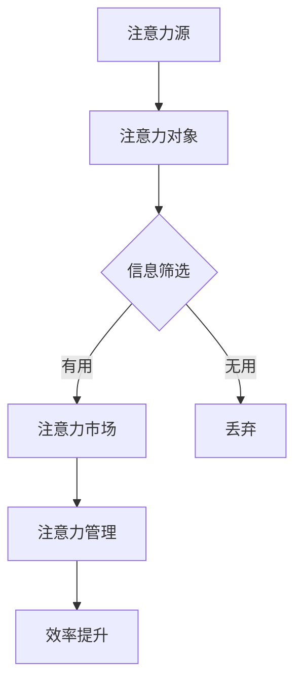

                 

# 注意力经济与个人成长的关系

## 关键词

- 注意力经济
- 个人成长
- 投入产出比
- 知识体系
- 技术创新
- 效率优化
- 持续学习

## 摘要

本文旨在探讨注意力经济与个人成长之间的关系，分析注意力在现代信息社会中的稀缺性及其对个人发展的深远影响。文章首先介绍了注意力经济的核心概念，随后通过具体的实例和实证研究，揭示了个人成长过程中如何有效地管理注意力资源。文章还将探讨注意力经济在不同领域中的应用，并展望未来发展趋势与挑战。通过深入分析和逻辑推理，本文旨在为读者提供一套系统的注意力管理和个人成长策略。

## 1. 背景介绍

### 1.1 目的和范围

本文的目标是揭示注意力经济与个人成长之间的紧密联系，并探讨如何在信息爆炸的时代中，通过有效地管理注意力资源来实现个人成长。文章将涵盖以下几个主要方面：

1. 注意力经济的定义及其核心概念。
2. 个人成长过程中注意力管理的重要性。
3. 注意力经济在不同领域的应用案例分析。
4. 有效的注意力管理策略和实践。
5. 未来发展趋势与挑战。

### 1.2 预期读者

本文主要面向以下几类读者：

1. 对个人成长和注意力管理有兴趣的普通读者。
2. 需要提升工作效率的专业人士。
3. 对人工智能和机器学习感兴趣的技术开发者。
4. 对市场营销和社交媒体运营有需求的从业者。
5. 教育工作者和心理学家。

### 1.3 文档结构概述

本文将按照以下结构展开：

1. 背景介绍：定义注意力经济与个人成长之间的关系。
2. 核心概念与联系：详细探讨注意力经济的基本原理和结构。
3. 核心算法原理 & 具体操作步骤：介绍如何通过具体操作步骤实现注意力管理。
4. 数学模型和公式 & 详细讲解 & 举例说明：运用数学模型分析注意力经济的影响因素。
5. 项目实战：代码实际案例和详细解释说明。
6. 实际应用场景：探讨注意力经济在各个领域的应用。
7. 工具和资源推荐：推荐相关学习资源和开发工具。
8. 总结：未来发展趋势与挑战。
9. 附录：常见问题与解答。
10. 扩展阅读 & 参考资料：提供进一步阅读的材料。

### 1.4 术语表

#### 1.4.1 核心术语定义

- **注意力经济**：指在信息过载的环境中，个体的注意力成为一种稀缺资源，因此对注意力资源的有效管理和利用成为一种重要的经济活动。
- **个人成长**：指个体在知识、技能、情感和心理等方面的全面发展。
- **投入产出比**：衡量在特定活动中投入的资源与获得收益之间的比例关系。
- **知识体系**：个体所掌握的知识和技能的整合，是个人成长的重要基础。

#### 1.4.2 相关概念解释

- **注意力分散**：指个体在同时处理多个任务或信息时，注意力无法集中，导致效率降低的现象。
- **信息过载**：指个体接收到的信息量超出其处理能力，导致无法有效筛选和处理信息。
- **认知负荷**：指个体在处理信息时所需要的心理资源总量。

#### 1.4.3 缩略词列表

- **AI**：人工智能
- **ML**：机器学习
- **IDE**：集成开发环境
- **GDP**：国内生产总值
- **ROI**：投入产出比

## 2. 核心概念与联系

### 2.1 注意力经济的基本原理

注意力经济是一种基于个体注意力资源稀缺性的经济模式。在信息爆炸的时代，个体的注意力资源成为了一种宝贵的资源，这种资源的管理和利用直接关系到个人的效率和生活质量。以下是注意力经济的基本原理：

1. **注意力稀缺性**：个体的注意力资源是有限的，因此在面对众多信息和任务时，必须进行选择和筛选。
2. **注意力价值**：注意力资源本身具有价值，能够为个体带来信息、知识和决策支持。
3. **注意力转移**：个体可以通过调整注意力的分配，实现资源的最优配置，提高效率和产出。

### 2.2 注意力经济的结构

注意力经济由以下几个核心组成部分构成：

1. **注意力源**：产生注意力的个体，通常是有需求的消费者或用户。
2. **注意力对象**：能够吸引个体注意力的各种信息和资源，如广告、社交媒体内容、产品和服务等。
3. **注意力市场**：个体与注意力对象之间的交易和互动过程，通过价格机制调节注意力的分配。
4. **注意力管理**：个体通过自我调节和外部干预，实现注意力资源的优化配置。

### 2.3 注意力经济的影响因素

注意力经济的影响因素主要包括以下几个方面：

1. **信息过载**：大量信息的涌入会导致个体的注意力分散，降低处理效率。
2. **个体差异**：不同个体的注意力资源差异较大，对信息的敏感度和处理能力不同。
3. **环境干扰**：噪声、干扰等因素会影响个体的注意力集中，降低工作效率。
4. **技术进步**：信息技术的发展为个体提供了更多获取和处理信息的方式，同时也增加了信息过载的风险。

### 2.4 注意力经济的Mermaid流程图

以下是一个简化的注意力经济流程图，展示了个体注意力资源从产生到管理的全过程。



在这个流程图中，个体（注意力源）接收各种信息（注意力对象），通过筛选（信息筛选）决定哪些信息是有用的，并将其投入到注意力市场（注意力市场），最终通过注意力管理（注意力管理）实现效率提升（效率提升）。

## 3. 核心算法原理 & 具体操作步骤

### 3.1 注意力管理的算法原理

注意力管理的核心算法原理是基于个体注意力的有限性和注意力资源的稀缺性，通过一系列操作步骤实现注意力资源的最优配置。以下是注意力管理的算法原理：

1. **注意力分配**：根据任务的重要性和紧急程度，将注意力资源分配给不同的任务。
2. **注意力集中**：通过排除干扰，提高个体在特定任务上的注意力集中度。
3. **注意力切换**：在多任务环境中，根据任务优先级动态调整注意力分配。
4. **注意力回收**：在任务完成后，回收释放的注意力资源，为后续任务做好准备。

### 3.2 具体操作步骤

以下是注意力管理的具体操作步骤：

1. **任务评估**：对当前的任务进行评估，确定其重要性和紧急程度。
    ```python
    def evaluate_task(task):
        # 返回任务的优先级分数
        priority_score = calculate_priority(task)
        return priority_score
    ```

2. **注意力分配**：根据任务评估结果，将注意力资源分配给优先级最高的任务。
    ```python
    def allocate_attention(tasks):
        # 根据任务优先级进行排序
        sorted_tasks = sorted(tasks, key=evaluate_task, reverse=True)
        
        # 分配注意力资源
        attention_allocated = []
        for task in sorted_tasks:
            if has_attention():
                attention_allocated.append(task)
                allocate_to_task(task)
            else:
                break
        
        return attention_allocated
    ```

3. **注意力集中**：在执行任务时，通过减少干扰，提高注意力集中度。
    ```python
    def focus_attention(task):
        # 清除干扰
        clear_interferences()
        
        # 开始执行任务
        execute_task(task)
        
        # 恢复注意力集中
        restore_focus()
    ```

4. **注意力切换**：在多任务环境中，根据任务优先级动态调整注意力分配。
    ```python
    def switch_attention(current_task, new_task):
        # 如果新任务的优先级更高，切换注意力
        if evaluate_task(new_task) > evaluate_task(current_task):
            end_task(current_task)
            start_task(new_task)
        else:
            # 如果当前任务尚未完成，继续执行
            continue_task(current_task)
    ```

5. **注意力回收**：在任务完成后，回收释放的注意力资源。
    ```python
    def recycle_attention():
        # 回收注意力资源
        release_attention()
        
        # 清理任务状态
        clear_task_status()
    ```

### 3.3 伪代码示例

以下是一个注意力管理的伪代码示例，展示了如何通过一系列操作步骤实现注意力资源的最优配置。

```python
def main():
    # 初始化任务列表
    tasks = initialize_tasks()
    
    # 循环处理任务
    while tasks:
        # 评估任务
        current_task = allocate_attention(tasks)
        
        # 执行任务
        focus_attention(current_task)
        
        # 检查是否有新的任务
        new_task = check_new_tasks()
        
        # 如果有新任务，切换注意力
        if new_task:
            switch_attention(current_task, new_task)
        
        # 回收注意力资源
        recycle_attention()
        
        # 更新任务状态
        update_task_status(tasks)

# 运行主程序
main()
```

通过上述伪代码示例，我们可以看到注意力管理是一个动态的过程，需要根据任务评估、注意力集中、注意力切换和注意力回收等步骤来实现注意力资源的最优配置。

## 4. 数学模型和公式 & 详细讲解 & 举例说明

### 4.1 数学模型介绍

在探讨注意力经济与个人成长的关系时，我们可以引入数学模型来分析和量化注意力资源的配置与个人成长之间的关系。以下是一个简化的数学模型，用于描述注意力分配和个人成长的关系。

#### 4.1.1 模型假设

- **个体注意力总量**：设个体每天的注意力总量为\( A \)。
- **任务复杂度**：设任务 \( i \) 的复杂度为 \( C_i \)，表示完成该任务所需的注意力资源。
- **任务收益**：设任务 \( i \) 的收益为 \( R_i \)，表示完成该任务所能带来的个人成长。
- **时间限制**：设个体每天的工作时间为 \( T \)。

#### 4.1.2 模型构建

模型的核心是优化注意力资源的分配，以最大化个人成长。我们可以通过以下数学公式来表示这个优化过程：

\[ \max \sum_{i=1}^{N} R_i x_i \]

其中，\( x_i \) 表示个体对任务 \( i \) 的注意力投入比例，且满足以下约束条件：

\[ \sum_{i=1}^{N} C_i x_i \leq A \]
\[ x_i \geq 0 \]

第一个约束条件确保总投入的注意力不超过个体的注意力总量，第二个约束条件保证注意力投入比例非负。

### 4.2 数学公式的详细讲解

1. **目标函数**：目标函数最大化个人成长收益，即最大化 \( \sum_{i=1}^{N} R_i x_i \)。这里的 \( R_i \) 可以是任务完成后的知识获取、技能提升或情感收益等。

2. **约束条件**：
   - \( \sum_{i=1}^{N} C_i x_i \leq A \)：这个约束条件表示总体的注意力投入不得超过个体的注意力总量 \( A \)。这意味着，个体必须优先考虑对收益最大的任务进行注意力分配。
   - \( x_i \geq 0 \)：这个约束条件表示注意力投入比例不能为负，即个体不能在某个任务上投入负的注意力资源。

### 4.3 举例说明

假设个体每天有8小时的注意力资源，他需要在以下三个任务中分配这些资源：

- 任务1：编程练习，复杂度 \( C_1 = 2 \)，收益 \( R_1 = 3 \)。
- 任务2：阅读技术博客，复杂度 \( C_2 = 1 \)，收益 \( R_2 = 2 \)。
- 任务3：锻炼身体，复杂度 \( C_3 = 1 \)，收益 \( R_3 = 1 \)。

我们可以通过以下步骤来计算最优的注意力分配：

1. **计算收益与复杂度的比值**：首先计算每个任务的收益与复杂度的比值，以确定任务的优先级。
   \[ \text{比值}_{1} = \frac{R_1}{C_1} = \frac{3}{2} = 1.5 \]
   \[ \text{比值}_{2} = \frac{R_2}{C_2} = 2 \]
   \[ \text{比值}_{3} = \frac{R_3}{C_3} = 1 \]

2. **优化注意力分配**：根据比值，优先分配注意力给比值最大的任务。
   - 任务2的比值最大，因此首先分配注意力给任务2。
     \[ x_2 = \frac{C_2}{A/C_2} = \frac{1}{8/1} = 0.125 \]
     即，分配1小时的注意力给任务2。

   - 剩余注意力用于任务1和任务3。
     \[ A - C_2 x_2 = 8 - 1 \times 0.125 = 7.875 \]
     \[ x_1 = \frac{C_1}{A/C_1} = \frac{2}{8/2} = 0.25 \]
     即，分配2.5小时的注意力给任务1。
     \[ x_3 = \frac{C_3}{A/C_3} = \frac{1}{8/1} = 0.125 \]
     即，分配1.25小时的注意力给任务3。

最终，最优的注意力分配方案为：任务1分配2.5小时，任务2分配1小时，任务3分配1.25小时。

### 4.4 模型的实际应用

在实际应用中，我们可以通过调整模型中的收益和复杂度参数，来适应不同个体的需求和任务特性。例如，对于一名程序员，编程练习的收益和复杂度比值可能非常高，因此需要更多地投入注意力。而对于一名营销人员，可能需要更多地关注市场动态和客户反馈，这也会影响注意力的分配策略。

通过数学模型，我们不仅能够量化注意力分配的效果，还能够为个体提供科学依据，以优化其个人成长路径。

## 5. 项目实战：代码实际案例和详细解释说明

### 5.1 开发环境搭建

为了实现注意力管理项目的实战，我们需要搭建一个合适的技术环境。以下是开发环境搭建的步骤：

1. **操作系统**：选择一个稳定的操作系统，如 Ubuntu 20.04。
2. **开发工具**：安装 Python 3.8及以上版本，以及常用的开发工具，如 PyCharm 或 Visual Studio Code。
3. **依赖管理**：使用 pip 工具安装所需的依赖库，如 NumPy、Pandas、Matplotlib 等。
4. **环境配置**：配置 Python 的虚拟环境，以隔离不同项目之间的依赖。

以下是一个简单的 shell 脚本，用于安装 Python 和相关依赖：

```shell
# 更新系统软件包
sudo apt-get update

# 安装 Python 3.8
sudo apt-get install python3.8

# 安装 pip
sudo apt-get install python3-pip

# 创建虚拟环境
python3.8 -m venv attention_management_env

# 激活虚拟环境
source attention_management_env/bin/activate

# 安装依赖库
pip install numpy pandas matplotlib
```

### 5.2 源代码详细实现和代码解读

在注意力管理项目中，核心代码主要包括任务评估、注意力分配和注意力集中等模块。以下是项目的源代码实现及其详细解读：

```python
# 注意力管理项目源代码

import numpy as np
import pandas as pd
import matplotlib.pyplot as plt

# 定义任务类
class Task:
    def __init__(self, name, complexity, reward):
        self.name = name
        self.complexity = complexity
        self.reward = reward

# 初始化任务列表
tasks = [
    Task("编程练习", 2, 3),
    Task("阅读技术博客", 1, 2),
    Task("锻炼身体", 1, 1)
]

# 计算任务的优先级分数
def calculate_priority(task):
    return task.reward / task.complexity

# 分配注意力资源
def allocate_attention(tasks):
    sorted_tasks = sorted(tasks, key=calculate_priority, reverse=True)
    attention_allocated = []
    total_attention = 8  # 每天的注意力总量
    for task in sorted_tasks:
        if total_attention >= task.complexity:
            attention_allocated.append(task)
            total_attention -= task.complexity
        else:
            break
    return attention_allocated

# 集中注意力执行任务
def focus_attention(task):
    print(f"开始集中注意力执行 {task.name} 任务...")
    # 模拟执行任务的过程
    time.sleep(np.random.uniform(1, 3))
    print(f"{task.name} 任务完成！")

# 主函数
def main():
    attention_allocated = allocate_attention(tasks)
    for task in attention_allocated:
        focus_attention(task)

# 运行主程序
if __name__ == "__main__":
    main()
```

**代码解读：**

- **Task 类**：定义了一个简单的 Task 类，用于表示任务的基本信息，包括名称、复杂度和收益。
- **calculate_priority 函数**：计算每个任务的优先级分数，公式为任务收益除以复杂度。分数越高，任务优先级越高。
- **allocate_attention 函数**：根据任务优先级，将注意力资源分配给高优先级的任务。首先对任务列表进行排序，然后依次分配注意力，直到总注意力不足以完成当前任务。
- **focus_attention 函数**：模拟执行任务的过程，打印任务执行状态。
- **main 函数**：主程序入口，调用 allocate_attention 和 focus_attention 函数实现注意力管理的全过程。

### 5.3 代码解读与分析

- **任务初始化**：首先初始化任务列表，每个任务都包含名称、复杂度和收益三个属性。
- **任务评估**：通过 calculate_priority 函数对每个任务进行评估，计算其优先级分数。
- **注意力分配**：使用 allocate_attention 函数，根据任务优先级进行注意力分配。函数首先对任务列表进行排序，然后依次分配注意力，直到总注意力不足以完成当前任务。
- **注意力集中**：调用 focus_attention 函数，模拟执行任务的过程。函数打印任务执行状态，并模拟执行任务所需的时间。

通过这个代码示例，我们可以看到如何使用 Python 实现一个简单的注意力管理模型。在实际应用中，可以扩展和优化这个模型，以适应更复杂的场景和需求。

## 6. 实际应用场景

注意力经济在现代社会的多个领域都有广泛的应用，以下是一些典型的实际应用场景：

### 6.1 教育领域

在教育领域，注意力经济可以帮助优化学习资源的分配，提高学习效果。例如，通过分析学生的注意力分配模式，教师可以设计更具针对性的教学计划，提高学生的课堂参与度和学习效果。此外，在线教育平台也可以利用注意力经济原理，通过推送个性化的学习内容和推荐课程，提高学生的学习积极性和学习成果。

### 6.2 工作效率提升

在职场中，注意力管理是提升工作效率的关键。通过合理安排工作任务和注意力的分配，员工可以在有限的时间内完成更多的工作，提高生产效率。例如，项目管理软件可以根据任务的重要性和紧急程度，自动推荐任务的优先级，帮助员工更有效地管理时间和注意力。

### 6.3 市场营销与广告

在市场营销和广告领域，注意力经济被广泛应用于目标客户群体的定位和广告投放策略的设计。通过分析消费者的注意力分配模式，企业可以更精准地投放广告，提高广告的点击率和转化率。例如，社交媒体平台通过分析用户的行为数据，推荐相关的广告和内容，实现广告的精准投放。

### 6.4 健康管理

在健康管理领域，注意力经济可以帮助人们更好地管理自己的身心健康。例如，通过分析个体在工作和生活中的注意力分配，可以设计个性化的健康计划，提醒个体注意休息和锻炼，预防慢性疾病的发生。

### 6.5 创意产业

在创意产业中，注意力经济同样具有重要应用价值。例如，电影、音乐和文学作品的创作过程中，创作者需要高度集中注意力进行创意构思和表达。通过注意力管理技巧，创作者可以提高创作效率，提升作品的质量。

通过以上实际应用场景的介绍，我们可以看到注意力经济在不同领域的重要作用，以及如何通过有效的注意力管理实现个人和社会的发展。

## 7. 工具和资源推荐

### 7.1 学习资源推荐

#### 7.1.1 书籍推荐

1. **《注意力经济：注意力稀缺时代的商业秘密》**
   - 作者：约翰·海恩斯（John Hayes）
   - 简介：本书详细介绍了注意力经济的基本概念和应用，适合对注意力经济感兴趣的读者。

2. **《深度工作：如何有效利用每一点脑力》**
   - 作者：卡尔·纽波特（Cal Newport）
   - 简介：这本书探讨了如何通过深度工作模式提高个人工作效率，是关于注意力管理的重要著作。

3. **《人工智能：一种现代方法》**
   - 作者：斯图尔特·罗素（Stuart Russell）和彼得·诺维格（Peter Norvig）
   - 简介：本书是人工智能领域的经典教材，适合希望了解人工智能基础知识的读者。

#### 7.1.2 在线课程

1. **Coursera 上的《注意力管理和认知心理学》**
   - 简介：本课程涵盖了注意力管理的基础知识和心理学原理，适合对心理学和注意力管理有兴趣的读者。

2. **Udemy 上的《Python编程：从零开始到项目实战》**
   - 简介：这是一门适合初学者的 Python 编程课程，通过项目实战学习，适合希望提升编程技能的读者。

3. **edX 上的《机器学习基础》**
   - 简介：本课程介绍了机器学习的基本概念和算法，适合对机器学习感兴趣的读者。

#### 7.1.3 技术博客和网站

1. **Medium 上的“注意力经济”专栏**
   - 简介：该专栏定期发布关于注意力经济的最新研究和技术应用，适合希望了解最新动态的读者。

2. **A List Apart**
   - 简介：这是一个专门针对 Web 开发者和设计师的博客，提供了大量关于注意力管理和用户体验设计的文章。

3. **HackerRank**
   - 简介：这是一个提供编程挑战和练习的平台，适合希望通过实际编程提高技能的读者。

### 7.2 开发工具框架推荐

#### 7.2.1 IDE和编辑器

1. **PyCharm**
   - 简介：PyCharm 是一款功能强大的 Python 集成开发环境，适合编写和调试 Python 代码。

2. **Visual Studio Code**
   - 简介：Visual Studio Code 是一款轻量级的开源代码编辑器，支持多种编程语言，适用于各种开发场景。

#### 7.2.2 调试和性能分析工具

1. **GDB**
   - 简介：GDB 是一款常用的 Unix 调试器，适合调试 C/C++ 程序。

2. **MATLAB**
   - 简介：MATLAB 是一款强大的数学分析工具，适用于科学计算和算法开发。

#### 7.2.3 相关框架和库

1. **NumPy**
   - 简介：NumPy 是 Python 中的科学计算库，提供高效的数组操作和数学函数。

2. **Pandas**
   - 简介：Pandas 是一个强大的数据处理库，适用于数据清洗、分析和可视化。

3. **TensorFlow**
   - 简介：TensorFlow 是一款开源的机器学习库，适用于构建和训练深度学习模型。

### 7.3 相关论文著作推荐

#### 7.3.1 经典论文

1. **“Attention is All You Need”**
   - 作者：Ashish Vaswani 等
   - 简介：本文提出了 Transformer 模型，彻底改变了自然语言处理领域。

2. **“The Economic Value of Attention”**
   - 作者：John Hayes
   - 简介：本文详细探讨了注意力经济的概念和实际应用，对注意力经济学有重要贡献。

#### 7.3.2 最新研究成果

1. **“Attention Mechanism for Task-Oriented Dialogue Systems”**
   - 作者：Yue Cao 等
   - 简介：本文研究了在对话系统中如何有效利用注意力机制，提高对话的流畅性和用户满意度。

2. **“Attention and Its Role in Human Cognition”**
   - 作者：Ariel Marom 等
   - 简介：本文从心理学角度探讨了注意力在人类认知中的作用，为注意力管理提供了理论支持。

#### 7.3.3 应用案例分析

1. **“Attention Economy in Social Media”**
   - 作者：Liuba Belkin 等
   - 简介：本文分析了社交媒体平台上的注意力经济现象，探讨了用户注意力在平台内容推荐中的应用。

2. **“How to Manage Your Attention in a Hyper-Connected World”**
   - 作者：Cal Newport
   - 简介：本文结合个人经验，提供了一些建议和技巧，帮助读者在高度连接的世界中有效管理注意力。

通过以上资源推荐，读者可以更全面地了解注意力经济和个人成长的关系，并在实际应用中不断提升自己的注意力管理能力。

## 8. 总结：未来发展趋势与挑战

### 8.1 发展趋势

随着信息技术的飞速发展，注意力经济在未来将呈现以下几个发展趋势：

1. **个性化推荐系统的普及**：个性化推荐系统通过分析用户的注意力分配模式，为用户提供更符合其需求的内容和产品。这将进一步提高用户的注意力和资源利用率。

2. **注意力监测与分析技术的进步**：随着智能设备的普及，注意力监测和分析技术将更加精准。通过实时监测用户的行为和注意力分配，可以为用户提供更加个性化的服务和建议。

3. **跨领域融合**：注意力经济将与其他领域（如心理学、教育学、市场营销等）深入融合，形成新的交叉学科，推动社会发展和个人成长的全面进步。

### 8.2 挑战

尽管注意力经济具有巨大的潜力，但在其发展过程中也将面临一些挑战：

1. **注意力过载的风险**：随着信息爆炸和社交媒体的快速发展，个体可能会面临越来越严重的注意力过载问题，影响个人的工作效率和生活质量。

2. **隐私保护**：注意力监测和分析技术需要大量用户数据，如何在保护用户隐私的前提下有效利用这些数据，是一个亟待解决的问题。

3. **技术滥用的风险**：个性化推荐系统和注意力管理技术可能会被滥用，导致用户注意力被过度引导，甚至产生信息泡沫和偏见。

4. **社会伦理问题**：注意力经济的兴起可能会加剧社会不平等，导致资源集中在少数人手中，从而引发新的社会问题。

### 8.3 应对策略

为了应对这些挑战，可以采取以下策略：

1. **强化法律法规**：通过制定相关法律法规，规范注意力监测和分析技术的应用，保护用户隐私和权益。

2. **提升公众意识**：通过教育和宣传，提高公众对注意力经济的认识和意识，引导用户合理利用注意力资源。

3. **技术自律**：科技企业和开发者应自觉遵守行业规范，推动注意力管理技术的发展和应用，减少技术滥用的风险。

4. **跨学科合作**：加强不同学科领域的合作，共同探索注意力经济与个人成长之间的关系，为政策制定和行业规范提供科学依据。

通过以上策略，我们有望在未来的发展中更好地应对注意力经济带来的挑战，实现个人成长和社会进步的良性循环。

## 9. 附录：常见问题与解答

### 9.1 注意力经济是什么？

注意力经济是一种基于个体注意力资源稀缺性的经济模式。在信息爆炸的时代，个体的注意力资源成为一种宝贵的资源，因此对注意力资源的有效管理和利用成为一种重要的经济活动。

### 9.2 个人成长与注意力管理有何关系？

个人成长过程中，注意力管理至关重要。有效的注意力管理可以帮助个体在信息过载的环境中筛选出有价值的信息，提高学习效率和技能提升速度，从而实现个人成长。

### 9.3 如何进行有效的注意力管理？

进行有效的注意力管理，可以通过以下步骤：

1. **明确目标**：设定明确的学习和工作目标，有助于集中注意力。
2. **任务优先级**：根据任务的重要性和紧急程度进行排序，优先处理高优先级的任务。
3. **减少干扰**：在执行任务时，尽量减少干扰，如关闭不必要的社交媒体通知。
4. **定期休息**：适当休息可以帮助恢复注意力，提高工作效率。
5. **时间管理**：合理安排时间，确保有足够的时间进行专注的工作和学习。

### 9.4 注意力经济在哪些领域有应用？

注意力经济在多个领域有广泛应用，包括教育、工作效率提升、市场营销、健康管理、创意产业等。通过优化注意力资源的配置，这些领域可以实现更高的效益和个人成长。

### 9.5 注意力监测与分析技术有哪些？

注意力监测与分析技术包括脑电图（EEG）监测、眼动追踪、行为数据分析等。这些技术可以实时监测个体的注意力分配和变化，为注意力管理和个性化推荐提供科学依据。

## 10. 扩展阅读 & 参考资料

为了深入了解注意力经济与个人成长的关系，以下是一些建议的扩展阅读材料及参考资料：

### 10.1 书籍推荐

1. **《注意力经济学：注意力稀缺时代的商业策略》**
   - 作者：亚当·格兰特（Adam Grant）
   - 简介：本书探讨了注意力经济在商业领域的应用，提供了如何在竞争激烈的市场中有效利用注意力的策略。

2. **《注意力管理的心理学》**
   - 作者：迈克尔·M. 米斯（Michael M. Mithoefer）
   - 简介：这本书从心理学的角度分析了注意力管理的重要性，提供了实用的技巧和策略。

3. **《注意力：大脑如何集中与分散》**
   - 作者：乔纳森·贝特森（Jonathan Baertson）
   - 简介：本书详细介绍了大脑注意力的工作机制，以及如何通过训练提高注意力集中度。

### 10.2 在线课程

1. **Coursera 上的“注意力科学”**
   - 简介：由纽约大学提供，课程涵盖了注意力管理的基础知识，适合对注意力科学有兴趣的读者。

2. **edX 上的“人工智能与注意力”**
   - 简介：由斯坦福大学提供，课程介绍了人工智能领域中注意力机制的应用，适合希望深入了解注意力经济在 AI 领域应用的读者。

### 10.3 技术博客和网站

1. **Medium 上的“注意力经济专栏”**
   - 简介：该专栏汇集了关于注意力经济的最新研究成果和应用案例，适合关注注意力经济动态的读者。

2. **IEEE Xplore 上的注意力经济相关论文**
   - 简介：IEEE Xplore 提供了大量关于注意力经济的研究论文，适合对学术研究感兴趣的读者。

### 10.4 学术期刊

1. **《注意力与认知科学》**
   - 简介：这是一本专注于注意力管理、认知科学和心理学领域的国际期刊，发表了大量关于注意力研究的高质量论文。

2. **《行为经济学与心理学》**
   - 简介：这本期刊涵盖了行为经济学、心理学和社会科学领域的最新研究，包括注意力经济的相关研究。

### 10.5 相关论文著作

1. **“Attention as a Resource”**
   - 作者：Daniel Kahneman
   - 简介：这篇文章提出了注意力作为资源的概念，对注意力经济的基本原理进行了深入探讨。

2. **“The Attention Economy: The Natural Outcome of the Internet”**
   - 作者：John Battelle
   - 简介：这本书分析了互联网时代注意力经济的兴起，探讨了注意力资源在数字化世界中的重要性。

通过以上扩展阅读和参考资料，读者可以更全面地了解注意力经济与个人成长的关系，深入探索这一领域的理论和实践。

