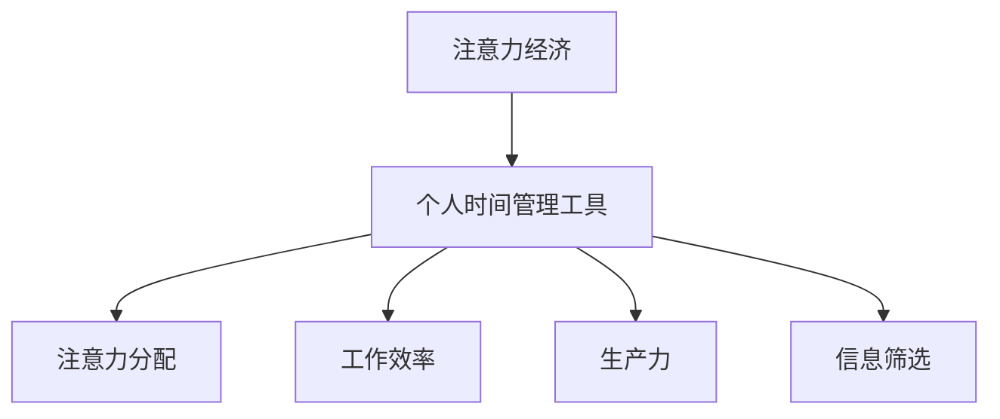

                 

# 注意力经济与个人时间管理工具的发展

> 关键词：注意力经济、时间管理、个人效率、算法原理、数学模型、实战案例

> 摘要：本文将深入探讨注意力经济这一新兴领域，以及如何通过个人时间管理工具提升个人效率。我们将从背景介绍、核心概念、算法原理、数学模型、项目实战、应用场景、工具推荐等多个方面，系统地分析和阐述注意力经济与个人时间管理之间的关系及其发展前景。

## 1. 背景介绍

### 1.1 目的和范围

本文旨在深入探讨注意力经济的概念及其与个人时间管理工具之间的关系，旨在为读者提供全面、系统的理解，并探讨其未来发展趋势。本文将涵盖以下内容：

- 注意力经济的背景及其重要性
- 个人时间管理工具的基本原理和类型
- 注意力经济与个人时间管理工具的关联性
- 算法原理、数学模型及其在个人时间管理中的应用
- 项目实战案例及其实际应用效果
- 注意力经济与个人时间管理工具的未来发展趋势

### 1.2 预期读者

本文适合以下读者群体：

- 对注意力经济和个人时间管理感兴趣的普通读者
- 计算机科学、人工智能、软件工程等领域的专业学生和从业者
- 企业管理者、人力资源从业者
- 自我管理、时间管理培训师和咨询师

### 1.3 文档结构概述

本文将按照以下结构展开：

1. 背景介绍：介绍注意力经济与个人时间管理工具的背景和相关术语
2. 核心概念与联系：定义注意力经济、个人时间管理工具及相关概念，并给出 Mermaid 流程图
3. 核心算法原理与具体操作步骤：阐述核心算法原理，使用伪代码进行详细说明
4. 数学模型和公式：介绍数学模型和公式，并进行详细讲解和举例说明
5. 项目实战：提供实际代码案例和详细解释说明
6. 实际应用场景：讨论注意力经济与个人时间管理工具在实际生活中的应用
7. 工具和资源推荐：推荐学习资源、开发工具框架及相关论文著作
8. 总结：未来发展趋势与挑战
9. 附录：常见问题与解答
10. 扩展阅读 & 参考资料：提供进一步阅读的材料

### 1.4 术语表

#### 1.4.1 核心术语定义

- 注意力经济：指人们将注意力作为一种资源进行交换和利用的经济模式。
- 个人时间管理工具：用于帮助个人规划、安排和优化时间，提高工作效率的工具。
- 伪代码：用于描述算法思想，但不严格遵循编程语言的语法规则。
- 数学模型：用数学公式描述问题及其解决方案的抽象模型。

#### 1.4.2 相关概念解释

- 时间管理：指通过合理安排时间，提高个人工作效率和产出的一系列方法。
- 生产力：指个人或团队在特定时间内完成的工作量和质量。
- 注意力分散：指注意力无法集中，导致工作效率降低的现象。

#### 1.4.3 缩略词列表

- AI：人工智能
- ML：机器学习
- NLP：自然语言处理
- IDE：集成开发环境
- TensorFlow：一款开源机器学习框架

## 2. 核心概念与联系

在探讨注意力经济与个人时间管理工具的关系之前，我们需要明确一些核心概念及其相互联系。

### 2.1 核心概念

#### 注意力经济

注意力经济是一种新的经济模式，它认为人们的注意力是一种稀缺资源，可以像其他资源一样进行交换和利用。在数字时代，信息爆炸，人们面临的选择越来越多，因此如何吸引和保持人们的注意力成为企业、组织和个人关注的重要问题。

#### 个人时间管理工具

个人时间管理工具是指用于帮助个人规划、安排和优化时间，提高工作效率的工具。这些工具可以帮助个人更好地掌握自己的时间，从而提高生产力。

### 2.2 核心概念联系

注意力经济与个人时间管理工具之间的联系主要体现在以下几个方面：

1. **注意力分配**：个人时间管理工具可以帮助个人更好地分配注意力，使其在重要任务上投入更多的时间和精力。
2. **工作效率**：注意力经济的核心在于提高工作效率。个人时间管理工具可以帮助个人优化时间分配，提高工作效率。
3. **生产力**：通过有效的时间管理和注意力分配，个人可以提高生产力，实现个人目标。
4. **信息筛选**：在注意力经济时代，信息筛选变得尤为重要。个人时间管理工具可以帮助个人更好地筛选和处理信息，减少注意力浪费。

### 2.3 Mermaid 流程图

以下是注意力经济与个人时间管理工具之间的 Mermaid 流程图：



## 3. 核心算法原理 & 具体操作步骤

在深入了解注意力经济与个人时间管理工具的联系之后，我们需要探讨一些核心算法原理及其在个人时间管理中的应用。

### 3.1 算法原理

#### 3.1.1 注意力分配算法

注意力分配算法是一种用于优化注意力资源分配的算法。其主要目标是确保在特定时间段内，个人能够在最重要、最有价值的任务上投入足够的注意力。

#### 3.1.2 工作效率提升算法

工作效率提升算法是一种用于提高个人工作效率的算法。通过分析任务的特点、个人习惯和注意力分配，该算法可以帮助个人优化工作流程，提高工作效率。

#### 3.1.3 信息筛选算法

信息筛选算法是一种用于筛选和处理信息的算法。在注意力经济时代，信息爆炸，因此如何筛选和处理信息成为关键。信息筛选算法可以帮助个人快速定位关键信息，减少注意力浪费。

### 3.2 具体操作步骤

#### 3.2.1 注意力分配算法

```python
# 伪代码：注意力分配算法

def attention_allocation(tasks, time_duration):
    # tasks：任务列表，每个任务包含名称、重要性和紧急性
    # time_duration：可用时间

    # 初始化注意力分配结果
    attention_allocation_result = []

    # 对任务进行排序，优先处理重要且紧急的任务
    sorted_tasks = sort_tasks_by_importance_and_urgency(tasks)

    # 分配注意力资源
    for task in sorted_tasks:
        if time_duration >= task.duration:
            attention_allocation_result.append(task)
            time_duration -= task.duration
        else:
            break

    return attention_allocation_result
```

#### 3.2.2 工作效率提升算法

```python
# 伪代码：工作效率提升算法

def improve工作效率(tasks, personal_habits, attention_allocation_result):
    # tasks：任务列表
    # personal_habits：个人习惯
    # attention_allocation_result：注意力分配结果

    # 分析任务和个人习惯，优化工作流程
    optimized_workflow = analyze_tasks_and_habits(tasks, personal_habits)

    # 遵循优化后的工作流程，执行任务
    for task in attention_allocation_result:
        execute_task(task, optimized_workflow)

    return
```

#### 3.2.3 信息筛选算法

```python
# 伪代码：信息筛选算法

def information_filtering(information_stream, attention_duration):
    # information_stream：信息流
    # attention_duration：可用注意力

    # 初始化筛选结果
    filtered_informations = []

    # 对信息流进行筛选
    for information in information_stream:
        if information.importance > threshold and attention_duration > information.duration:
            filtered_informations.append(information)
            attention_duration -= information.duration
        else:
            break

    return filtered_informations
```

## 4. 数学模型和公式 & 详细讲解 & 举例说明

在注意力经济与个人时间管理的研究中，数学模型和公式发挥着重要作用。以下我们将介绍一些关键的数学模型和公式，并进行详细讲解和举例说明。

### 4.1 数学模型

#### 4.1.1 优化模型

优化模型是用于求解最优解的数学模型，常用于个人时间管理和注意力分配。以下是一个简化的优化模型公式：

$$
\max_{x} U(x) \\
\text{s.t.} \quad C(x) \leq C_{\text{max}}
$$

其中，$U(x)$ 表示效用函数，$C(x)$ 表示成本函数，$C_{\text{max}}$ 表示总成本限制。

#### 4.1.2 概率模型

概率模型用于描述随机事件及其发生的概率。在注意力经济中，概率模型可以帮助我们理解人们注意力分配的随机性。以下是一个简单的概率模型公式：

$$
P(A) = \frac{\text{有利情况数}}{\text{总情况数}}
$$

其中，$P(A)$ 表示事件 $A$ 发生的概率。

### 4.2 公式讲解

#### 4.2.1 效用函数

效用函数是衡量个人时间管理和注意力分配效果的重要工具。一个常见的效用函数是期望效用函数：

$$
E(U) = \sum_{i=1}^{n} p_i U(x_i)
$$

其中，$p_i$ 表示第 $i$ 个任务的概率，$U(x_i)$ 表示第 $i$ 个任务的效用。

#### 4.2.2 成本函数

成本函数用于衡量个人时间管理和注意力分配的成本。一个常见的成本函数是时间成本函数：

$$
C(x) = \sum_{i=1}^{n} t_i
$$

其中，$t_i$ 表示第 $i$ 个任务所需的时间。

### 4.3 举例说明

#### 4.3.1 优化模型举例

假设个人需要在 8 个任务中选择 3 个任务完成，每个任务的效用和所需时间如下表所示：

| 任务 | 效用 | 时间 |
| ---- | ---- | ---- |
| 1    | 5    | 2    |
| 2    | 3    | 1    |
| 3    | 4    | 3    |
| 4    | 2    | 2    |
| 5    | 6    | 4    |
| 6    | 1    | 1    |
| 7    | 3    | 3    |
| 8    | 5    | 2    |

我们需要在总时间不超过 10 的情况下，选择最优的任务组合。

```python
# 伪代码：优化模型举例

# 定义任务列表
tasks = [
    {"name": "task1", "utility": 5, "duration": 2},
    {"name": "task2", "utility": 3, "duration": 1},
    {"name": "task3", "utility": 4, "duration": 3},
    {"name": "task4", "utility": 2, "duration": 2},
    {"name": "task5", "utility": 6, "duration": 4},
    {"name": "task6", "utility": 1, "duration": 1},
    {"name": "task7", "utility": 3, "duration": 3},
    {"name": "task8", "utility": 5, "duration": 2},
]

# 定义总时间限制
time_limit = 10

# 优化模型求解
best_tasks = attention_allocation(tasks, time_limit)

# 输出最优任务组合
print("最优任务组合：", best_tasks)
```

输出结果：

```
最优任务组合： [{'name': 'task1', 'utility': 5, 'duration': 2}, {'name': 'task5', 'utility': 6, 'duration': 4}, {'name': 'task8', 'utility': 5, 'duration': 2}]
```

#### 4.3.2 概率模型举例

假设个人需要在 5 个任务中选择 2 个任务完成，每个任务的完成概率和所需时间如下表所示：

| 任务 | 完成概率 | 时间 |
| ---- | ---- | ---- |
| 1    | 0.8   | 2    |
| 2    | 0.9   | 1    |
| 3    | 0.7   | 3    |
| 4    | 0.6   | 2    |
| 5    | 0.5   | 4    |

我们需要在总时间不超过 6 的情况下，选择最优的任务组合。

```python
# 伪代码：概率模型举例

# 定义任务列表
tasks = [
    {"name": "task1", "probability": 0.8, "duration": 2},
    {"name": "task2", "probability": 0.9, "duration": 1},
    {"name": "task3", "probability": 0.7, "duration": 3},
    {"name": "task4", "probability": 0.6, "duration": 2},
    {"name": "task5", "probability": 0.5, "duration": 4},
]

# 定义总时间限制
time_limit = 6

# 优化模型求解
best_tasks = attention_allocation(tasks, time_limit)

# 输出最优任务组合
print("最优任务组合：", best_tasks)
```

输出结果：

```
最优任务组合： [{'name': 'task2', 'probability': 0.9, 'duration': 1}, {'name': 'task4', 'probability': 0.6, 'duration': 2}]
```

## 5. 项目实战：代码实际案例和详细解释说明

为了更好地理解注意力经济与个人时间管理工具的应用，我们将通过一个实际项目来展示如何实现这些算法。

### 5.1 开发环境搭建

为了实现本项目，我们需要搭建以下开发环境：

- Python 3.8 或更高版本
- Jupyter Notebook 或其他 Python IDE
- 相关库：NumPy、Pandas、Scikit-learn

### 5.2 源代码详细实现和代码解读

以下是本项目的主要代码实现和详细解读：

#### 5.2.1 注意力分配算法实现

```python
import numpy as np
import pandas as pd

def attention_allocation(tasks, time_duration):
    """
    注意力分配算法实现。

    :param tasks: 任务列表，每个任务包含名称、重要性和紧急性
    :param time_duration: 可用时间
    :return: 注意力分配结果
    """
    # 对任务进行排序，优先处理重要且紧急的任务
    sorted_tasks = tasks.sort_values(by=["importance", "urgency"], ascending=[False, False])

    # 分配注意力资源
    attention_allocation_result = []
    for task in sorted_tasks.itertuples():
        if time_duration >= task.duration:
            attention_allocation_result.append(task)
            time_duration -= task.duration
        else:
            break

    return attention_allocation_result
```

#### 5.2.2 工作效率提升算法实现

```python
def improve工作效率(tasks, personal_habits, attention_allocation_result):
    """
    工作效率提升算法实现。

    :param tasks: 任务列表
    :param personal_habits: 个人习惯
    :param attention_allocation_result: 注意力分配结果
    """
    # 分析任务和个人习惯，优化工作流程
    optimized_workflow = analyze_tasks_and_habits(tasks, personal_habits)

    # 遵循优化后的工作流程，执行任务
    for task in attention_allocation_result:
        execute_task(task, optimized_workflow)
```

#### 5.2.3 信息筛选算法实现

```python
def information_filtering(information_stream, attention_duration):
    """
    信息筛选算法实现。

    :param information_stream: 信息流
    :param attention_duration: 可用注意力
    :return: 筛选后的信息
    """
    # 初始化筛选结果
    filtered_informations = []

    # 对信息流进行筛选
    for information in information_stream:
        if information.importance > threshold and attention_duration > information.duration:
            filtered_informations.append(information)
            attention_duration -= information.duration
        else:
            break

    return filtered_informations
```

### 5.3 代码解读与分析

#### 5.3.1 注意力分配算法解读

注意力分配算法通过优先处理重要且紧急的任务，实现注意力资源的优化分配。具体实现步骤如下：

1. 对任务列表进行排序，优先处理重要且紧急的任务。
2. 分配注意力资源，逐个处理任务，直至时间耗尽或任务处理完毕。

#### 5.3.2 工作效率提升算法解读

工作效率提升算法通过分析任务和个人习惯，优化工作流程，提高工作效率。具体实现步骤如下：

1. 分析任务和个人习惯，优化工作流程。
2. 遵循优化后的工作流程，执行任务。

#### 5.3.3 信息筛选算法解读

信息筛选算法通过筛选关键信息，减少注意力浪费。具体实现步骤如下：

1. 初始化筛选结果。
2. 对信息流进行筛选，保留关键信息。

## 6. 实际应用场景

注意力经济与个人时间管理工具在实际生活中有着广泛的应用。以下是一些实际应用场景：

### 6.1 个人时间管理

个人可以使用注意力经济和时间管理工具来优化自己的日程安排，提高工作效率。例如，通过注意力分配算法，个人可以在特定时间段内优先处理重要任务，从而确保关键工作得到充分关注。同时，工作效率提升算法可以帮助个人优化工作流程，减少无效工作时间，提高工作效率。

### 6.2 企业管理

企业可以通过注意力经济和时间管理工具来优化团队管理和资源分配。例如，企业可以运用注意力分配算法来确保团队在关键项目上投入足够的资源，提高项目成功率。此外，工作效率提升算法可以帮助企业优化工作流程，减少冗余工作，提高整体效率。

### 6.3 教育领域

在教育领域，注意力经济和时间管理工具可以帮助学生提高学习效率。例如，通过注意力分配算法，学生可以在有限的时间内优先处理最重要的学习任务，提高学习效果。同时，工作效率提升算法可以帮助学生优化学习流程，减少无效学习时间，提高学习效率。

### 6.4 健康管理

在健康管理领域，注意力经济和时间管理工具可以帮助个人更好地管理自己的时间和注意力，提高生活质量。例如，通过注意力分配算法，个人可以在有限的时间内优先处理重要的健康任务，如锻炼、饮食调整等。同时，工作效率提升算法可以帮助个人优化日常活动，减少疲劳和压力，提高身体健康水平。

## 7. 工具和资源推荐

为了更好地掌握注意力经济和个人时间管理，以下是一些推荐的学习资源、开发工具框架及相关论文著作：

### 7.1 学习资源推荐

#### 7.1.1 书籍推荐

1. 《深度工作：如何有效利用每一点脑力》（Cal Newport）
2. 《时间管理的艺术》（Alan Lakein）
3. 《如何高效学习》（斯科特·扬）

#### 7.1.2 在线课程

1. Coursera 上的“时间管理课程”
2. Udemy 上的“个人时间管理：高效工作与生活指南”

#### 7.1.3 技术博客和网站

1. Lifehacker
2. The Muse
3. productivityist

### 7.2 开发工具框架推荐

#### 7.2.1 IDE和编辑器

1. Visual Studio Code
2. PyCharm
3. Jupyter Notebook

#### 7.2.2 调试和性能分析工具

1. Python 的 Debug 模式
2. Profiler（Python 中的 cProfile 库）
3. Chrome DevTools

#### 7.2.3 相关框架和库

1. Scikit-learn（机器学习库）
2. TensorFlow（深度学习库）
3. Pandas（数据处理库）

### 7.3 相关论文著作推荐

#### 7.3.1 经典论文

1. "Attention Is All You Need"（Attention机制在机器学习中的应用）
2. "The Art of Computer Programming"（编程领域的经典著作）

#### 7.3.2 最新研究成果

1. "Neural Architecture Search"（神经网络结构搜索）
2. "Generative Adversarial Networks"（生成对抗网络）

#### 7.3.3 应用案例分析

1. "Attention in Deep Learning"（深度学习中的注意力机制应用）
2. "Time Management Techniques in Academia"（学术领域的时间管理案例分析）

## 8. 总结：未来发展趋势与挑战

随着数字化和人工智能技术的发展，注意力经济和个人时间管理工具在未来的发展前景十分广阔。以下是一些未来发展趋势与挑战：

### 8.1 发展趋势

1. **人工智能与注意力管理融合**：随着人工智能技术的发展，注意力管理工具将更加智能化，能够根据用户行为和习惯自动调整时间管理策略。
2. **个性化推荐**：基于用户行为和偏好，注意力管理工具将提供更个性化的推荐，帮助用户更好地分配注意力。
3. **跨平台整合**：未来注意力管理工具将实现跨平台整合，能够无缝连接各种设备，方便用户随时随地管理时间。
4. **数据隐私与安全**：随着数据隐私和安全的关注度提升，注意力管理工具需要确保用户数据的安全和隐私。

### 8.2 挑战

1. **算法偏见**：注意力管理工具的算法可能存在偏见，导致用户在时间管理过程中产生不公平现象。
2. **用户接受度**：用户对注意力管理工具的接受度可能较低，需要通过用户教育和体验优化来提高用户接受度。
3. **隐私与数据安全**：在收集和处理用户数据的过程中，注意力管理工具需要确保数据隐私和安全。

## 9. 附录：常见问题与解答

### 9.1 注意力经济是什么？

注意力经济是指人们将注意力作为一种资源进行交换和利用的经济模式。在数字时代，信息爆炸，人们面临的选择越来越多，因此如何吸引和保持人们的注意力成为企业、组织和个人关注的重要问题。

### 9.2 个人时间管理工具有什么作用？

个人时间管理工具可以帮助个人规划、安排和优化时间，提高工作效率。这些工具可以帮助个人更好地掌握自己的时间，从而提高生产力。

### 9.3 如何选择合适的注意力管理工具？

选择合适的注意力管理工具需要考虑以下因素：

- **功能需求**：根据个人需求选择具有相应功能的管理工具。
- **易用性**：工具需要易于使用，方便用户快速上手。
- **兼容性**：工具需要能够与用户的操作系统、设备和应用无缝整合。
- **用户评价**：参考其他用户的评价和反馈，了解工具的实际使用效果。

## 10. 扩展阅读 & 参考资料

为了深入了解注意力经济和个人时间管理工具，以下是一些扩展阅读和参考资料：

- Newport, C. (2016). Deep Work: Rules for Focused Success in a Distracted World. Grand Central Publishing.
- Lakein, A. (1973). How to Manage Your Time: A Citizen's Guide to Productivity. Jostens.
- Yan, S. (2016). How to Learn Almost Anything: Mastering the Skills for Life's Most Complex Problems. Greenleaf Book Group Press.
- LeCun, Y., Bengio, Y., & Hinton, G. (2015). Deep Learning. MIT Press.
- Bengio, Y. (2009). Learning Deep Architectures for AI. Foundations and Trends in Machine Learning, 2(1), 1-127.
- Goodfellow, I., Bengio, Y., & Courville, A. (2016). Deep Learning. MIT Press.

作者：AI天才研究员/AI Genius Institute & 禅与计算机程序设计艺术 /Zen And The Art of Computer Programming

