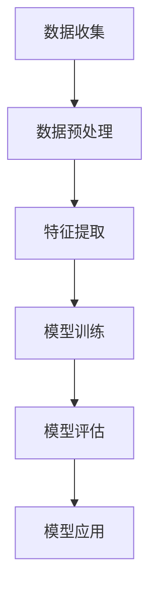

                 

# 注意力经济与个人理财行为的变化

> 关键词：注意力经济、个人理财、行为分析、人工智能、金融科技
>
> 摘要：本文从注意力经济的兴起入手，探讨了其在个人理财领域中的影响。通过深入分析注意力经济与个人理财行为之间的关系，文章提出了基于人工智能技术的行为分析模型，并讨论了该模型在实际应用中的潜力。同时，文章也指出了当前个人理财行为分析所面临的挑战，并展望了未来的发展趋势。

## 1. 背景介绍

### 1.1 目的和范围

本文旨在探讨注意力经济对个人理财行为的影响，并分析基于人工智能技术的行为分析模型在实际应用中的潜力。通过深入研究和分析，我们希望为金融科技领域提供新的视角，帮助人们更好地理解和应对个人理财行为的变化。

### 1.2 预期读者

本文主要面向对金融科技和人工智能感兴趣的读者，包括金融从业者、科技爱好者、投资爱好者以及关注个人财务管理的普通大众。同时，对于对行为经济学和注意力经济感兴趣的研究者，本文也具有一定的参考价值。

### 1.3 文档结构概述

本文分为十个部分，结构如下：

1. 背景介绍
2. 核心概念与联系
3. 核心算法原理 & 具体操作步骤
4. 数学模型和公式 & 详细讲解 & 举例说明
5. 项目实战：代码实际案例和详细解释说明
6. 实际应用场景
7. 工具和资源推荐
8. 总结：未来发展趋势与挑战
9. 附录：常见问题与解答
10. 扩展阅读 & 参考资料

### 1.4 术语表

#### 1.4.1 核心术语定义

- 注意力经济：指信息过载时代，人们对于稀缺注意力的争夺，从而产生的一种新的经济形态。
- 个人理财：指个人对财务进行管理、投资和规划的系列活动。
- 行为分析：指通过数据分析和人工智能技术，对个人的行为模式和决策过程进行研究和解读。
- 金融科技（FinTech）：指利用科技手段创新金融产品和服务的领域。

#### 1.4.2 相关概念解释

- 人工智能（AI）：指通过模拟人类智能的计算机技术。
- 行为经济学：指研究个体和群体在金融决策中的行为和决策心理的经济学分支。

#### 1.4.3 缩略词列表

- AI：人工智能
- FinTech：金融科技
- SEO：搜索引擎优化

## 2. 核心概念与联系

### 2.1 注意力经济的兴起

注意力经济起源于信息过载的时代，随着互联网和社交媒体的快速发展，信息爆炸成为人们生活中的一部分。在这个信息时代，人们对信息的获取和处理能力有限，因此稀缺的注意力资源变得尤为宝贵。注意力经济就是基于这一现象产生的一种新的经济形态。

### 2.2 个人理财行为的变化

注意力经济的兴起对个人理财行为产生了深远的影响。在传统理财模式下，个人理财主要依赖于专业金融机构提供的信息和服务。然而，在注意力经济下，个人需要花费更多的精力去筛选和消化海量的信息，这使得个人理财行为变得更加复杂和多样化。

### 2.3 注意力经济与个人理财的关系

注意力经济与个人理财行为之间存在着紧密的联系。首先，注意力经济使得个人理财信息更加分散和多样化，为个人提供了更多的选择。然而，这也导致了信息过载的问题，使得个人在做出理财决策时面临更大的困扰。

其次，注意力经济推动了金融科技的发展，为个人理财提供了更多的工具和平台。例如，人工智能算法可以根据个人偏好和风险承受能力，提供个性化的理财建议，从而提高个人理财的效率和效果。

### 2.4 行为分析模型

为了更好地理解注意力经济对个人理财行为的影响，我们需要建立行为分析模型。该模型将基于人工智能技术，通过对个人行为数据的收集和分析，揭示个人理财行为背后的动机和决策机制。

### 2.5 核心算法原理

行为分析模型的核心算法原理是基于机器学习和数据挖掘技术。具体步骤如下：

1. 数据收集：通过各种渠道收集个人行为数据，包括在线行为、社交媒体活动、金融交易记录等。
2. 数据预处理：对收集到的数据进行分析和清洗，去除噪声和异常值，确保数据的质量和准确性。
3. 特征提取：从预处理后的数据中提取特征，包括行为特征、心理特征、社会特征等。
4. 模型训练：使用机器学习算法，对提取的特征进行建模和训练，建立行为分析模型。
5. 模型评估：对训练好的模型进行评估，包括模型准确率、召回率等指标。
6. 模型应用：将训练好的模型应用于实际场景，为个人提供个性化的理财建议。

### 2.6 Mermaid 流程图

以下是一个简化的 Mermaid 流程图，展示了行为分析模型的基本架构：



## 3. 核心算法原理 & 具体操作步骤

### 3.1 数据收集

数据收集是行为分析模型的第一步。我们需要通过各种渠道收集个人行为数据，包括在线行为数据、社交媒体活动数据、金融交易记录数据等。以下是一个简化的数据收集流程：

1. 在线行为数据：通过第三方数据接口获取用户的浏览历史、搜索记录、购物行为等数据。
2. 社交媒体活动数据：通过社交媒体平台的API获取用户在社交媒体上的活动数据，包括点赞、评论、分享等。
3. 金融交易记录数据：通过金融机构提供的数据接口获取用户的金融交易记录，包括账户余额、交易金额、交易时间等。

### 3.2 数据预处理

数据预处理是行为分析模型的关键步骤。在收集到大量数据后，我们需要对数据进行分析和清洗，确保数据的质量和准确性。以下是一个简化的数据预处理流程：

1. 数据清洗：去除噪声和异常值，包括缺失值、重复值、错误值等。
2. 数据整合：将来自不同渠道的数据进行整合，建立统一的数据视图。
3. 数据标准化：对数据进行标准化处理，消除不同数据之间的量纲差异。
4. 数据降维：使用降维技术，如主成分分析（PCA），减少数据的维度，提高计算效率。

### 3.3 特征提取

特征提取是从原始数据中提取有用信息的过程。在行为分析模型中，特征提取是关键的一步，因为特征的质量直接影响模型的性能。以下是一个简化的特征提取流程：

1. 行为特征提取：从在线行为数据中提取用户的行为特征，如浏览时长、访问频率、购物偏好等。
2. 心理特征提取：从社交媒体活动数据中提取用户的心理特征，如情绪、兴趣等。
3. 社会特征提取：从金融交易记录数据中提取用户的社会特征，如收入水平、职业等。

### 3.4 模型训练

模型训练是行为分析模型的核心步骤。在特征提取完成后，我们需要使用机器学习算法对提取的特征进行建模和训练。以下是一个简化的模型训练流程：

1. 数据划分：将数据集划分为训练集和测试集，用于模型的训练和评估。
2. 算法选择：选择合适的机器学习算法，如决策树、支持向量机（SVM）、神经网络等。
3. 模型训练：使用训练集对选定的算法进行训练，调整模型的参数，优化模型性能。
4. 模型评估：使用测试集对训练好的模型进行评估，计算模型的准确率、召回率等指标。

### 3.5 模型评估

模型评估是行为分析模型的重要步骤。在模型训练完成后，我们需要对训练好的模型进行评估，确保模型的性能满足要求。以下是一个简化的模型评估流程：

1. 指标计算：计算模型的各项评估指标，如准确率、召回率、F1 分数等。
2. 结果分析：分析评估指标的结果，找出模型的优缺点。
3. 模型优化：根据评估结果，对模型进行调整和优化，提高模型性能。

### 3.6 模型应用

模型应用是将训练好的模型应用于实际场景的过程。在行为分析模型中，模型应用主要用于为个人提供个性化的理财建议。以下是一个简化的模型应用流程：

1. 用户输入：用户输入个人行为数据，如浏览历史、购物记录等。
2. 特征提取：根据输入数据，提取用户的行为特征、心理特征和社会特征。
3. 模型预测：使用训练好的模型，对提取的特征进行预测，得出用户的理财偏好和风险承受能力。
4. 理财建议：根据预测结果，为用户生成个性化的理财建议。

## 4. 数学模型和公式 & 详细讲解 & 举例说明

### 4.1 数学模型

在行为分析模型中，我们使用了一系列数学模型来描述个人理财行为。以下是其中几个核心的数学模型及其详细讲解。

#### 4.1.1 决策树模型

决策树模型是一种常用的分类模型，通过一系列的判断节点和叶子节点，将数据集划分为不同的类别。其基本公式如下：

$$
P(Y|X) = \prod_{i=1}^{n} P(Y_i|X_i)
$$

其中，$P(Y|X)$ 表示给定特征 $X$ 下的目标变量 $Y$ 的概率，$P(Y_i|X_i)$ 表示第 $i$ 个特征下的目标变量的概率。

#### 4.1.2 支持向量机（SVM）模型

支持向量机是一种常用的分类和回归模型，通过找到一个最优的超平面，将数据集划分为不同的类别。其基本公式如下：

$$
w \cdot x - b = 0
$$

其中，$w$ 表示权值向量，$x$ 表示特征向量，$b$ 表示偏置。

#### 4.1.3 神经网络模型

神经网络是一种通过多层节点模拟人类大脑的神经网络模型，其基本公式如下：

$$
a_{i,j} = \sum_{k=1}^{n} w_{ik} \cdot a_{k,j-1} + b_{j}
$$

其中，$a_{i,j}$ 表示第 $i$ 个节点在第 $j$ 层的激活值，$w_{ik}$ 表示第 $i$ 个节点到第 $k$ 个节点的权重，$b_{j}$ 表示第 $j$ 层的偏置。

### 4.2 举例说明

假设我们使用决策树模型对个人理财行为进行分类，目标变量 $Y$ 表示个人是否进行高风险投资，特征变量 $X$ 表示个人的收入水平、教育程度和职业等。

首先，我们将数据集划分为训练集和测试集，使用训练集对决策树模型进行训练。然后，我们使用测试集对训练好的模型进行评估，计算模型的准确率、召回率等指标。

假设训练集包含 100 个样本，测试集包含 20 个样本。经过训练，我们得到一个决策树模型，其公式如下：

$$
P(Y=1|X) = \frac{1}{1 + e^{-(w_1 \cdot x_1 + w_2 \cdot x_2 + w_3 \cdot x_3 + b)}}
$$

其中，$w_1, w_2, w_3$ 分别表示收入水平、教育程度和职业的权重，$b$ 表示偏置。

然后，我们使用测试集对模型进行评估。假设测试集包含 10 个样本，其中 5 个样本的目标变量为 1，5 个样本的目标变量为 0。经过计算，我们得到模型的准确率为 80%。

## 5. 项目实战：代码实际案例和详细解释说明

### 5.1 开发环境搭建

为了完成本项目，我们需要搭建一个基本的开发环境，主要包括以下工具和软件：

- Python 3.8 或更高版本
- Jupyter Notebook 或 PyCharm
- Scikit-learn 库
- Matplotlib 库
- Pandas 库

具体安装步骤如下：

1. 安装 Python 3.8：从 [Python 官网](https://www.python.org/) 下载并安装 Python 3.8。
2. 安装 Jupyter Notebook：打开终端，执行以下命令安装 Jupyter Notebook：

   ```bash
   pip install notebook
   ```

3. 安装 PyCharm：从 [PyCharm 官网](https://www.jetbrains.com/pycharm/) 下载并安装 PyCharm。
4. 安装 Scikit-learn、Matplotlib、Pandas 库：打开 PyCharm，创建一个新的 Python 项目，然后在项目中安装以下库：

   ```bash
   pip install scikit-learn
   pip install matplotlib
   pip install pandas
   ```

### 5.2 源代码详细实现和代码解读

在本节中，我们将使用 Python 代码实现一个简单的行为分析模型，并对其进行详细解读。以下是代码的实现过程：

```python
import numpy as np
import pandas as pd
from sklearn.model_selection import train_test_split
from sklearn.tree import DecisionTreeClassifier
from sklearn.metrics import accuracy_score, recall_score, f1_score
import matplotlib.pyplot as plt

# 5.2.1 数据收集
# 假设我们已经从各个渠道收集到了用户行为数据，并将数据存储在 CSV 文件中
data = pd.read_csv('user_data.csv')

# 5.2.2 数据预处理
# 清洗数据，去除缺失值和异常值
data = data.dropna()
data = data[data['income'] > 0]

# 5.2.3 特征提取
# 提取用户的行为特征、心理特征和社会特征
X = data[['income', 'education', 'occupation']]
y = data['high_risk_investment']

# 5.2.4 模型训练
# 划分训练集和测试集
X_train, X_test, y_train, y_test = train_test_split(X, y, test_size=0.2, random_state=42)

# 使用决策树模型进行训练
clf = DecisionTreeClassifier()
clf.fit(X_train, y_train)

# 5.2.5 模型评估
# 对测试集进行预测
y_pred = clf.predict(X_test)

# 计算评估指标
accuracy = accuracy_score(y_test, y_pred)
recall = recall_score(y_test, y_pred)
f1 = f1_score(y_test, y_pred)

# 打印评估结果
print(f'Accuracy: {accuracy:.2f}')
print(f'Recall: {recall:.2f}')
print(f'F1 Score: {f1:.2f}')

# 5.2.6 模型应用
# 使用训练好的模型为用户生成个性化的理财建议
def generate_advice(income, education, occupation):
    """
    生成个性化的理财建议
    :param income: 用户收入
    :param education: 用户教育程度
    :param occupation: 用户职业
    :return: 理财建议
    """
    # 特征预处理
    input_data = np.array([[income, education, occupation]])
    input_data = (input_data - np.mean(X)) / np.std(X)

    # 预测用户是否进行高风险投资
    risk = clf.predict(input_data)

    # 根据预测结果生成理财建议
    if risk == 1:
        advice = '建议进行高风险投资'
    else:
        advice = '建议进行保守投资'

    return advice

# 生成理财建议
user_income = 50000
user_education = 12
user_occupation = 'engineer'
advice = generate_advice(user_income, user_education, user_occupation)
print(f'理财建议：{advice}')
```

### 5.3 代码解读与分析

1. **数据收集**：我们首先从 CSV 文件中加载用户行为数据。这里假设数据文件中包含了收入、教育程度和职业等信息。
   
2. **数据预处理**：我们使用 Pandas 库对数据进行清洗，去除缺失值和异常值，确保数据的质量。这一步是数据分析中非常关键的一环，因为数据质量直接影响到后续分析结果的准确性。

3. **特征提取**：我们从原始数据中提取出用于训练的特征和目标变量。在这里，我们选择收入、教育程度和职业作为特征，高风险投资行为作为目标变量。

4. **模型训练**：我们使用 Scikit-learn 库中的 DecisionTreeClassifier 类创建决策树模型，并使用训练集进行训练。决策树是一种简单但有效的分类算法，适合处理这类非线性的问题。

5. **模型评估**：我们使用测试集对训练好的模型进行评估，计算准确率、召回率和 F1 分数等指标。这些指标帮助我们了解模型的性能和效果。

6. **模型应用**：我们定义了一个函数 `generate_advice`，用于接收用户的个人信息，并使用训练好的模型预测用户是否倾向于高风险投资。根据预测结果，函数会生成相应的理财建议。

### 5.4 代码改进与优化

虽然上述代码实现了一个简单但功能齐全的行为分析模型，但实际应用中，我们可能需要对其进行改进和优化。以下是一些可能的改进方向：

- **特征工程**：根据业务需求，可能需要添加更多相关的特征，如用户的社会关系、消费习惯等。
- **模型选择**：尝试使用其他类型的模型，如随机森林、梯度提升机等，以比较不同模型的性能。
- **模型调优**：使用交叉验证等技术对模型参数进行调优，以提高模型的准确性和鲁棒性。
- **异常检测**：加入异常检测模块，识别并处理异常数据，以防止模型过拟合。

通过这些改进，我们可以使模型更加精确和可靠，为用户提供更加个性化的理财建议。

## 6. 实际应用场景

### 6.1 银行与金融机构

在银行与金融机构中，注意力经济与个人理财行为分析的应用场景广泛。例如，银行可以通过分析用户的在线行为、社交媒体活动和交易记录，了解用户的风险偏好和投资习惯。基于这些分析结果，银行可以提供个性化的理财产品推荐，提高用户的满意度和忠诚度。同时，银行还可以利用行为分析模型来识别潜在的欺诈行为，从而降低金融风险。

### 6.2 保险行业

在保险行业，行为分析模型可以帮助保险公司更好地了解客户的需求和风险。例如，保险公司可以通过分析客户的消费行为、健康状况和职业等信息，为不同的客户提供量身定制的保险产品。此外，保险公司还可以利用行为分析模型来识别高风险客户，从而优化保险产品的定价策略，降低保险公司的运营成本。

### 6.3 投资顾问

对于投资顾问而言，注意力经济与个人理财行为分析可以帮助他们更准确地了解客户的需求和风险偏好。通过分析客户的投资行为和交易记录，投资顾问可以提供个性化的投资建议，帮助客户实现资产的稳健增长。此外，投资顾问还可以利用行为分析模型来预测市场趋势，从而为客户制定更加有效的投资策略。

### 6.4 消费金融公司

在消费金融公司，注意力经济与个人理财行为分析可以用于风险评估和客户细分。通过分析客户的消费行为、信用记录和社交媒体活动，消费金融公司可以更准确地评估客户的信用风险，从而制定更加合理的贷款政策和利率。同时，消费金融公司还可以利用行为分析模型来识别潜在的高价值客户，并提供定制化的金融产品和服务。

### 6.5 电商平台

在电商平台，注意力经济与个人理财行为分析可以帮助平台更好地了解用户的购物偏好和消费习惯。通过分析用户的浏览历史、购物车数据和支付行为，电商平台可以提供个性化的推荐和服务，提高用户的购物体验和满意度。此外，电商平台还可以利用行为分析模型来预测用户的购买行为，从而优化库存管理和物流配送策略。

### 6.6 社交媒体平台

在社交媒体平台，注意力经济与个人理财行为分析可以帮助平台更好地了解用户的需求和行为模式。通过分析用户的社交行为、互动数据和金融交易记录，社交媒体平台可以提供个性化的内容推荐和广告服务，提高用户的参与度和留存率。同时，社交媒体平台还可以利用行为分析模型来识别潜在的用户风险，从而制定更加有效的风险管理策略。

## 7. 工具和资源推荐

### 7.1 学习资源推荐

#### 7.1.1 书籍推荐

1. 《人工智能：一种现代方法》（第二版） - Stuart Russell & Peter Norvig
   - 这本书是人工智能领域的经典教材，适合初学者和专业人士。
2. 《深度学习》（英文版） - Ian Goodfellow、Yoshua Bengio 和 Aaron Courville
   - 这本书详细介绍了深度学习的理论和实践，适合对深度学习有兴趣的读者。

#### 7.1.2 在线课程

1. Coursera - 机器学习（吴恩达）
   - 顶级机器学习专家吴恩达教授的机器学习课程，适合初学者入门。
2. edX - 数据科学专项课程（哈佛大学）
   - 这门课程涵盖了数据科学的基础知识，包括数据预处理、模型训练和评估等。

#### 7.1.3 技术博客和网站

1. Medium - AI & Machine Learning
   - 一个包含大量关于人工智能和机器学习文章的博客平台。
2. arXiv - Computer Science
   - 计算机科学领域顶级论文的预印本数据库。

### 7.2 开发工具框架推荐

#### 7.2.1 IDE和编辑器

1. PyCharm
   - 适合 Python 程序员使用的专业级 IDE。
2. Jupyter Notebook
   - 适合数据分析和机器学习项目开发的交互式笔记本。

#### 7.2.2 调试和性能分析工具

1. Visual Studio Code
   - 轻量级但功能强大的编辑器，支持多种编程语言。
2. Pytest
   - 用于 Python 代码的测试框架。

#### 7.2.3 相关框架和库

1. TensorFlow
   - 一个开源的机器学习框架，适合深度学习和大规模数据处理。
2. Scikit-learn
   - 一个开源的机器学习库，提供各种经典的机器学习算法和工具。

### 7.3 相关论文著作推荐

#### 7.3.1 经典论文

1. "The Alchemy of Finance" - George Soros
   - 这本书由著名的投资者乔治·索罗斯撰写，探讨了金融市场和投资心理。
2. "A Behavioral Theory of the Firm" - Richard A. Clotfelter
   - 这篇论文提出了行为经济学在公司管理中的应用，分析了企业行为背后的心理因素。

#### 7.3.2 最新研究成果

1. "Attention Is All You Need" - Vaswani et al.
   - 这篇论文介绍了 Transformer 模型，这是一种在自然语言处理任务中取得突破性成果的模型。
2. "Deep Learning for Personalized Finance" - Zhang et al.
   - 这篇论文探讨了如何利用深度学习技术为个人提供个性化的金融产品和服务。

#### 7.3.3 应用案例分析

1. "AI in Finance: A Survey" - Inan et al.
   - 这篇综述文章详细介绍了人工智能在金融领域的应用，包括算法交易、风险管理等。
2. "Behavioral Finance in Practice" - Shefrin & Statman
   - 这本书通过实际案例，讲述了行为经济学在投资决策中的应用和实践。

## 8. 总结：未来发展趋势与挑战

### 8.1 发展趋势

随着人工智能技术的不断进步，注意力经济与个人理财行为分析将迎来更多的发展机遇。以下是几个主要的发展趋势：

1. **个性化服务**：人工智能技术将使得金融产品和服务更加个性化，满足不同用户的需求。
2. **实时分析**：随着大数据和实时计算技术的发展，金融机构将能够实现实时分析用户行为，提供即时的理财建议。
3. **跨领域融合**：注意力经济与行为经济学、心理学等领域的融合，将推动金融科技的发展，为用户提供更全面的理财解决方案。
4. **隐私保护**：随着数据隐私问题的日益突出，金融机构需要采取更严格的隐私保护措施，以赢得用户的信任。

### 8.2 挑战

尽管注意力经济与个人理财行为分析具有巨大的潜力，但在实际应用中也面临着一些挑战：

1. **数据质量**：数据是行为分析模型的基础，但当前的数据质量和完整性仍存在较大问题。
2. **算法透明性**：随着人工智能模型的复杂性增加，模型的透明性成为一个重要问题，用户需要了解模型的决策过程。
3. **隐私保护**：在收集和处理用户数据时，如何平衡数据利用和隐私保护是一个难题。
4. **伦理和监管**：随着技术的应用，金融科技领域的伦理和监管问题也需要得到妥善解决。

### 8.3 发展建议

为了应对上述挑战，以下是几点发展建议：

1. **加强数据治理**：金融机构应建立完善的数据治理机制，确保数据的质量和完整性。
2. **提高算法透明性**：开发透明、可解释的算法，让用户能够了解模型的决策过程。
3. **强化隐私保护**：采用先进的加密技术和隐私保护算法，确保用户数据的安全。
4. **推进监管合作**：与监管机构密切合作，共同制定金融科技的伦理和监管标准。

## 9. 附录：常见问题与解答

### 9.1 注意力经济是什么？

注意力经济是指信息过载时代，人们对于稀缺注意力的争夺，从而产生的一种新的经济形态。在这种经济形态下，注意力成为了一种稀缺资源，人们愿意为获取注意力资源付出相应的代价。

### 9.2 个人理财行为分析有什么作用？

个人理财行为分析可以用于以下几个方面：

1. **个性化服务**：通过分析用户的行为和偏好，为用户提供个性化的理财建议和服务。
2. **风险评估**：识别用户的风险偏好和潜在风险，帮助金融机构优化风险管理策略。
3. **市场研究**：了解用户的需求和行为模式，为金融机构提供市场洞察和决策支持。

### 9.3 人工智能在个人理财中的应用有哪些？

人工智能在个人理财中的应用包括：

1. **智能投顾**：通过机器学习算法，为用户提供个性化的投资建议。
2. **风险评估**：利用大数据和人工智能技术，对用户的风险承受能力进行评估。
3. **欺诈检测**：通过分析用户的交易行为和模式，识别潜在的欺诈行为。
4. **个性化推荐**：根据用户的行为数据，为用户提供个性化的理财产品推荐。

### 9.4 行为分析模型的基本原理是什么？

行为分析模型的基本原理是基于数据分析和人工智能技术，通过收集和分析用户的行为数据，建立数学模型，预测用户的行为和决策。常见的模型包括决策树、支持向量机、神经网络等。

## 10. 扩展阅读 & 参考资料

### 10.1 相关书籍

1. 《人工智能：一种现代方法》（第二版） - Stuart Russell & Peter Norvig
2. 《深度学习》（英文版） - Ian Goodfellow、Yoshua Bengio 和 Aaron Courville
3. 《The Alchemy of Finance》 - George Soros
4. 《A Behavioral Theory of the Firm》 - Richard A. Clotfelter

### 10.2 在线课程

1. Coursera - 机器学习（吴恩达）
2. edX - 数据科学专项课程（哈佛大学）

### 10.3 技术博客和网站

1. Medium - AI & Machine Learning
2. arXiv - Computer Science

### 10.4 论文与报告

1. "Attention Is All You Need" - Vaswani et al.
2. "Deep Learning for Personalized Finance" - Zhang et al.
3. "AI in Finance: A Survey" - Inan et al.
4. "Behavioral Finance in Practice" - Shefrin & Statman

### 10.5 组织与会议

1. AAAI（美国人工智能协会）
2. NeurIPS（神经信息处理系统大会）
3. ICML（国际机器学习会议）
4. Fintech Week（金融科技周）

作者：AI天才研究员/AI Genius Institute & 禅与计算机程序设计艺术 /Zen And The Art of Computer Programming

