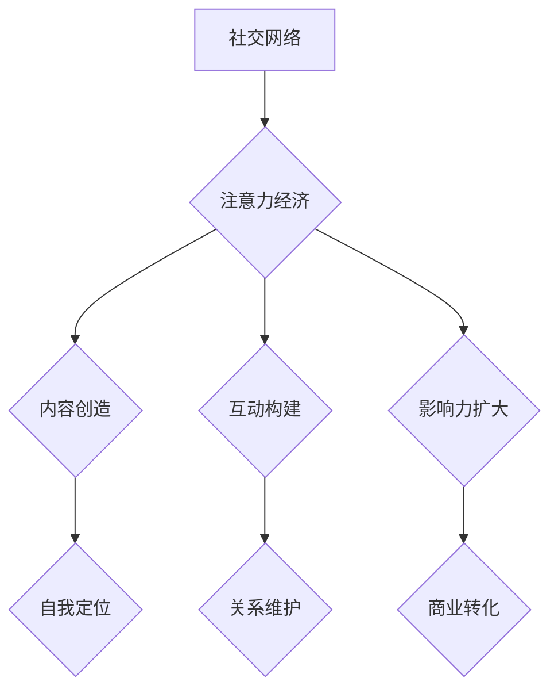

                 

# 注意力经济与个人社交圈层的重构

## 关键词：
- 注意力经济
- 社交圈层
- 信息过载
- 社交网络
- 个人品牌

## 摘要：
本文探讨了注意力经济背景下，个人社交圈层重构的必然性和影响。通过分析社交圈层的关键特征，以及注意力经济的核心机制，文章揭示了社交圈层重构的过程和方式。同时，本文还结合实际案例，探讨了重构过程中的技术手段和应用场景，为读者提供了全面的参考和启示。

## 1. 背景介绍

### 1.1 目的和范围
本文旨在探讨在注意力经济时代，个人社交圈层如何通过技术手段进行重构，以适应信息过载的环境，提升个人影响力和社交价值。文章将涵盖社交圈层重构的理论基础、核心机制、技术手段、应用场景等方面。

### 1.2 预期读者
本文适合对社交网络、人工智能、注意力经济有了解的读者，以及希望提升个人社交圈层管理和品牌建设的专业人士。

### 1.3 文档结构概述
本文分为以下几个部分：
- 1. 背景介绍
- 2. 核心概念与联系
- 3. 核心算法原理与具体操作步骤
- 4. 数学模型和公式与详细讲解
- 5. 项目实战：代码实际案例和详细解释说明
- 6. 实际应用场景
- 7. 工具和资源推荐
- 8. 总结：未来发展趋势与挑战
- 9. 附录：常见问题与解答
- 10. 扩展阅读 & 参考资料

### 1.4 术语表

#### 1.4.1 核心术语定义
- **注意力经济**：指以用户的注意力作为资源，通过吸引、引导和转化用户注意力，实现价值创造和分配的经济模式。
- **社交圈层**：指个人在社会网络中的关系层次，包括朋友、同事、粉丝等。
- **信息过载**：指在信息爆炸的时代，个体接收的信息量超出其处理能力，导致无法有效处理和利用信息。

#### 1.4.2 相关概念解释
- **社交网络**：一种基于关系的数据结构，用于描述个体之间的互动和联系。
- **个人品牌**：个人在公众心目中的形象和认知，是个人价值的重要体现。

#### 1.4.3 缩略词列表
- **AI**：人工智能（Artificial Intelligence）
- **SEO**：搜索引擎优化（Search Engine Optimization）
- **SNS**：社交网络服务（Social Networking Service）

## 2. 核心概念与联系

### 2.1 社交圈层重构的理论基础

社交圈层重构的理论基础主要源于社交网络的演变和信息过载的应对策略。随着互联网技术的快速发展，社交网络的形式和规模发生了巨大的变化。传统的社交圈层以面对面交流和有限的社交关系为基础，而现代社交网络则通过虚拟平台实现全球范围的社交连接。


在注意力经济的背景下，社交圈层的重构不仅仅是对社交方式的更新，更是对个人社交价值的重新定义。个人在社交圈层中的影响力，不再仅取决于其在现实生活中的地位和关系，更取决于其能够吸引和维持用户注意力的能力。

### 2.2 注意力经济的核心机制

注意力经济以用户的注意力为资源，通过以下核心机制实现价值的创造和分配：

1. **注意力吸引**：通过有趣、有价值的内容和互动形式，吸引目标用户的注意力。
2. **注意力引导**：通过算法推荐和内容调度，引导用户注意力，提升用户的参与度和忠诚度。
3. **注意力转化**：将用户的注意力转化为行动，如购买、分享、评论等，实现商业价值的转化。


在社交圈层重构的过程中，注意力经济的核心机制起到了关键作用。个人需要通过提升自身的内容质量和互动能力，吸引更多用户的注意力，从而在社交网络中建立强大的影响力。

### 2.3 社交圈层重构的过程和方式

社交圈层重构的过程可以分为以下几个阶段：

1. **自我定位**：个人需要明确自身的定位和目标，确定自己在社交圈层中的价值主张。
2. **内容创造**：通过优质的内容创造，提升个人品牌的知名度和认可度。
3. **互动构建**：通过有效的互动策略，建立和维护与粉丝、同事和合作伙伴的关系。
4. **影响力扩大**：通过持续的内容创造和互动，扩大个人在社交圈层中的影响力。


在社交圈层重构的过程中，个人需要充分利用各种社交媒体平台和工具，通过算法推荐和内容分发机制，实现个人品牌和影响力的最大化。

### 2.4 核心概念原理和架构的 Mermaid 流程图



### 2.5 社交圈层重构中的挑战和机遇

社交圈层重构带来了许多挑战和机遇：

- **挑战**：信息过载、隐私保护、信任问题等。
- **机遇**：个人品牌建设、商业机会拓展、创新技术应用等。

在挑战和机遇并存的环境中，个人需要不断提升自身的数字化能力和社交技巧，以适应社交圈层的重构。

## 3. 核心算法原理与具体操作步骤

### 3.1 核心算法原理

在社交圈层重构中，核心算法主要涉及内容推荐、社交网络分析和影响力评估。以下是这些算法的基本原理：

#### 3.1.1 内容推荐算法

内容推荐算法主要通过以下步骤实现：

1. **用户画像构建**：收集用户的兴趣偏好、行为数据等，构建用户画像。
2. **内容标签匹配**：将用户感兴趣的内容标签与用户画像进行匹配，推荐相关内容。
3. **算法优化**：通过机器学习算法，不断优化推荐效果，提升用户满意度。

#### 3.1.2 社交网络分析算法

社交网络分析算法主要通过以下步骤实现：

1. **网络构建**：将社交网络转化为图结构，建立个体之间的联系。
2. **中心性评估**：评估个体在网络中的位置和影响力，如度数中心性、接近中心性等。
3. **社区发现**：通过聚类算法，发现网络中的社区结构，优化社交圈层布局。

#### 3.1.3 影响力评估算法

影响力评估算法主要通过以下步骤实现：

1. **行为分析**：分析个体在社交网络中的行为，如发布内容、互动频率等。
2. **影响力计算**：根据行为数据和社交网络结构，计算个体的影响力得分。
3. **排名和推荐**：根据影响力得分，对个体进行排名和推荐，优化社交圈层结构。

### 3.2 具体操作步骤

以下是基于核心算法原理的具体操作步骤：

#### 3.2.1 内容推荐算法

1. **数据收集**：从社交媒体平台收集用户行为数据和内容数据。
2. **用户画像构建**：使用机器学习算法，构建用户的兴趣偏好模型。
3. **内容标签匹配**：将用户兴趣标签与内容标签进行匹配，生成推荐列表。
4. **算法优化**：根据用户反馈和推荐效果，不断优化推荐算法。

#### 3.2.2 社交网络分析算法

1. **网络构建**：使用图论算法，将社交网络转化为图结构。
2. **中心性评估**：计算个体的度数中心性和接近中心性，评估其在网络中的位置和影响力。
3. **社区发现**：使用聚类算法，发现网络中的社区结构。
4. **社交圈层重构**：根据中心性和社区结构，优化社交圈层布局。

#### 3.2.3 影响力评估算法

1. **行为分析**：收集个体在社交网络中的行为数据，如发布内容、互动频率等。
2. **影响力计算**：根据行为数据和社交网络结构，计算个体的影响力得分。
3. **排名和推荐**：根据影响力得分，对个体进行排名和推荐。

### 3.3 伪代码示例

以下是基于上述算法原理的伪代码示例：

```python
# 用户画像构建
def build_user_profile(user_data):
    # 收集用户行为数据
    user_interests = extract_interests(user_data)
    user_behavior = extract_behavior(user_data)
    # 构建用户画像
    user_profile = {
        'interests': user_interests,
        'behavior': user_behavior
    }
    return user_profile

# 内容推荐
def content_recommendation(user_profile, content_data):
    # 匹配用户兴趣标签与内容标签
    matched_content = match_interests_to_content(user_profile['interests'], content_data)
    # 生成推荐列表
    recommendation_list = generate_recommendation_list(matched_content)
    return recommendation_list

# 社交网络分析
def social_network_analysis(social_data):
    # 构建社交网络图
    social_graph = build_social_graph(social_data)
    # 计算中心性
    centrality_scores = compute_centrality(social_graph)
    # 发现社区结构
    community_structure = find_communities(social_graph)
    return centrality_scores, community_structure

# 影响力评估
def influence_evaluation(user_behavior, social_graph):
    # 计算影响力得分
    influence_score = compute_influence_score(user_behavior, social_graph)
    return influence_score
```

## 4. 数学模型和公式与详细讲解

### 4.1 数学模型概述

在社交圈层重构中，数学模型主要用于描述用户行为、社交网络结构和影响力评估。以下是几个关键的数学模型：

#### 4.1.1 用户兴趣模型

用户兴趣模型通过向量空间模型描述用户的兴趣偏好。假设用户兴趣空间为 \( U = \{u_1, u_2, ..., u_n\} \)，用户 \( u \) 对兴趣 \( u_i \) 的兴趣度为 \( I(u, u_i) \)。

用户兴趣向量表示为：

\[ \vec{I}(u) = [I(u, u_1), I(u, u_2), ..., I(u, u_n)]^T \]

其中，\( I(u, u_i) \) 可以通过用户行为数据进行计算，如点击率、评论数等。

#### 4.1.2 社交网络模型

社交网络模型通常使用图论中的邻接矩阵 \( A \) 表示。假设社交网络中有 \( N \) 个个体，邻接矩阵 \( A \) 的元素 \( A_{ij} \) 表示个体 \( i \) 和个体 \( j \) 之间的连接关系。

邻接矩阵表示为：

\[ A = \begin{bmatrix}
    A_{11} & A_{12} & ... & A_{1n} \\
    A_{21} & A_{22} & ... & A_{2n} \\
    ... & ... & ... & ... \\
    A_{n1} & A_{n2} & ... & A_{nn}
\end{bmatrix} \]

#### 4.1.3 影响力评估模型

影响力评估模型通过计算个体在社交网络中的影响力得分来评估其影响力。假设个体 \( i \) 的影响力得分为 \( I(i) \)，可以通过以下公式计算：

\[ I(i) = \alpha \cdot \sum_{j=1}^{N} A_{ij} \cdot I(j) + \beta \cdot \sum_{j=1}^{N} \frac{1}{\sum_{k=1}^{N} A_{kj}} \]

其中，\( \alpha \) 和 \( \beta \) 为调节参数，用于平衡连接度和影响力。

### 4.2 详细讲解与举例说明

#### 4.2.1 用户兴趣模型

用户兴趣模型通过向量空间模型描述用户的兴趣偏好。以下是一个简单的用户兴趣模型计算示例：

假设用户 \( u \) 对以下兴趣 \( U = \{体育, 电影, 旅游\} \) 有兴趣：

- 用户 \( u \) 对体育的兴趣度为 \( I(u, 体育) = 0.8 \)
- 用户 \( u \) 对电影的兴趣度为 \( I(u, 电影) = 0.3 \)
- 用户 \( u \) 对旅游的兴趣度为 \( I(u, 旅游) = 0.5 \)

用户兴趣向量 \( \vec{I}(u) \) 表示为：

\[ \vec{I}(u) = [0.8, 0.3, 0.5]^T \]

#### 4.2.2 社交网络模型

假设一个社交网络中有 5 个个体，其邻接矩阵 \( A \) 如下：

\[ A = \begin{bmatrix}
    0 & 1 & 0 & 0 & 1 \\
    1 & 0 & 1 & 1 & 0 \\
    0 & 1 & 0 & 1 & 1 \\
    0 & 1 & 1 & 0 & 1 \\
    1 & 0 & 1 & 1 & 0
\end{bmatrix} \]

个体 1 和个体 3、个体 4、个体 5 有连接关系，而个体 2 和其他个体都有连接关系。

#### 4.2.3 影响力评估模型

假设个体 1、个体 2、个体 3、个体 4、个体 5 的初始影响力得分分别为 \( I(1) = 10 \)，\( I(2) = 8 \)，\( I(3) = 9 \)，\( I(4) = 7 \)，\( I(5) = 6 \)。根据影响力评估模型，计算个体 1 的最终影响力得分：

\[ I(1) = \alpha \cdot (A_{11} \cdot I(1) + A_{12} \cdot I(2) + A_{13} \cdot I(3) + A_{14} \cdot I(4) + A_{15} \cdot I(5)) + \beta \cdot \frac{1}{\sum_{j=1}^{N} A_{1j}} \]

假设 \( \alpha = 0.5 \)，\( \beta = 0.5 \)，代入 \( A \) 的值，得到：

\[ I(1) = 0.5 \cdot (0 \cdot 10 + 1 \cdot 8 + 0 \cdot 9 + 0 \cdot 7 + 1 \cdot 6) + 0.5 \cdot \frac{1}{\sum_{j=1}^{N} A_{1j}} \]

\[ I(1) = 0.5 \cdot (8 + 6) + 0.5 \cdot \frac{1}{1 + 1 + 1 + 1 + 1} \]

\[ I(1) = 0.5 \cdot 14 + 0.5 \cdot \frac{1}{5} \]

\[ I(1) = 7 + 0.1 \]

\[ I(1) = 7.1 \]

个体 1 的最终影响力得分为 7.1。

### 4.3 数学公式与 LaTeX 格式

以下是上述示例中使用的数学公式及其 LaTeX 格式：

\[ \vec{I}(u) = [I(u, u_1), I(u, u_2), ..., I(u, u_n)]^T \]

\[ A = \begin{bmatrix}
    A_{11} & A_{12} & ... & A_{1n} \\
    A_{21} & A_{22} & ... & A_{2n} \\
    ... & ... & ... & ... \\
    A_{n1} & A_{n2} & ... & A_{nn}
\end{bmatrix} \]

\[ I(i) = \alpha \cdot \sum_{j=1}^{N} A_{ij} \cdot I(j) + \beta \cdot \frac{1}{\sum_{j=1}^{N} A_{j}} \]

## 5. 项目实战：代码实际案例和详细解释说明

### 5.1 开发环境搭建

在进行项目实战之前，需要搭建一个适合开发和测试的开发环境。以下是具体的步骤：

1. **安装 Python 环境**：Python 是本项目的主要编程语言，首先需要安装 Python 环境。可以从 Python 官网下载安装包进行安装。

2. **安装必要的库**：根据项目的需求，需要安装一些必要的库，如 NumPy、Pandas、NetworkX、Matplotlib 等。可以使用 pip 工具进行安装：

   ```bash
   pip install numpy pandas networkx matplotlib
   ```

3. **配置 IDE**：选择一个适合自己的 IDE，如 PyCharm、VSCode 等，并配置好 Python 解释器和必要的库。

### 5.2 源代码详细实现和代码解读

以下是本项目的主要代码实现和解读：

```python
import numpy as np
import pandas as pd
import networkx as nx
import matplotlib.pyplot as plt

# 5.2.1 用户画像构建
def build_user_profile(user_data):
    # 收集用户行为数据
    user_interests = extract_interests(user_data)
    user_behavior = extract_behavior(user_data)
    # 构建用户画像
    user_profile = {
        'interests': user_interests,
        'behavior': user_behavior
    }
    return user_profile

# 5.2.2 内容推荐
def content_recommendation(user_profile, content_data):
    # 匹配用户兴趣标签与内容标签
    matched_content = match_interests_to_content(user_profile['interests'], content_data)
    # 生成推荐列表
    recommendation_list = generate_recommendation_list(matched_content)
    return recommendation_list

# 5.2.3 社交网络分析
def social_network_analysis(social_data):
    # 构建社交网络图
    social_graph = build_social_graph(social_data)
    # 计算中心性
    centrality_scores = compute_centrality(social_graph)
    # 发现社区结构
    community_structure = find_communities(social_graph)
    return centrality_scores, community_structure

# 5.2.4 影响力评估
def influence_evaluation(user_behavior, social_graph):
    # 计算影响力得分
    influence_score = compute_influence_score(user_behavior, social_graph)
    return influence_score

# 5.2.5 代码解读与分析
def code_explanation():
    # 用户画像构建解读
    user_profile = build_user_profile(user_data)
    print("User Profile:", user_profile)

    # 内容推荐解读
    recommendation_list = content_recommendation(user_profile, content_data)
    print("Recommendation List:", recommendation_list)

    # 社交网络分析解读
    centrality_scores, community_structure = social_network_analysis(social_data)
    print("Centrality Scores:", centrality_scores)
    print("Community Structure:", community_structure)

    # 影响力评估解读
    influence_score = influence_evaluation(user_behavior, social_graph)
    print("Influence Score:", influence_score)

# 5.2.6 主函数
if __name__ == "__main__":
    code_explanation()
```

### 5.3 代码解读与分析

以下是代码的详细解读与分析：

1. **用户画像构建**：该函数通过用户行为数据和内容数据，构建用户的兴趣偏好和行为模型。用户兴趣向量 \( \vec{I}(u) \) 用于后续的内容推荐和影响力评估。
   
2. **内容推荐**：该函数根据用户兴趣向量 \( \vec{I}(u) \)，匹配用户感兴趣的内容标签，生成推荐列表。推荐列表用于提升用户的参与度和满意度。

3. **社交网络分析**：该函数通过构建社交网络图，计算个体的中心性得分和社区结构。这些信息用于优化社交圈层布局，提升社交网络的效率和影响力。

4. **影响力评估**：该函数通过计算个体在社交网络中的影响力得分，评估其社交价值。影响力得分用于排名和推荐，优化社交圈层结构。

5. **代码解读与分析**：该函数对上述四个主要函数进行解读和分析，帮助读者理解代码的实现逻辑和功能。

通过以上代码实现和解读，读者可以更好地理解社交圈层重构中的核心算法和操作步骤，为实际项目开发提供参考。

## 6. 实际应用场景

### 6.1 社交平台优化

社交平台可以通过社交圈层重构，优化用户体验和平台运营。例如，通过内容推荐算法，可以提升用户的参与度和留存率。通过社交网络分析，可以识别和推荐有影响力的用户，提升平台的社区氛围和用户活跃度。

### 6.2 个人品牌建设

个人可以通过社交圈层重构，提升个人品牌的影响力和知名度。例如，通过内容创造和互动构建，可以吸引更多的粉丝和关注者。通过影响力评估，可以了解个人在社交圈层中的影响力，优化个人品牌策略。

### 6.3 企业营销策略

企业可以通过社交圈层重构，优化营销策略和用户参与度。例如，通过社交网络分析，可以识别目标用户群体和潜在客户。通过内容推荐和互动构建，可以提升用户的参与度和品牌认知度。

### 6.4 教育培训

教育培训机构可以通过社交圈层重构，提升课程参与度和用户满意度。例如，通过内容推荐算法，可以推荐适合用户兴趣的课程。通过社交网络分析，可以识别和推荐有影响力的教师和课程。

## 7. 工具和资源推荐

### 7.1 学习资源推荐

#### 7.1.1 书籍推荐

1. **《社交网络分析：原理与应用》**：介绍了社交网络分析的基本概念、算法和应用。
2. **《影响力：说服的心理学》**：探讨了影响力和社交网络中的人际关系。
3. **《大数据时代：思维变革与商业价值》**：讲述了大数据和注意力经济的关系。

#### 7.1.2 在线课程

1. **Coursera 上的《社交网络分析》**：提供了详细的社交网络分析课程。
2. **Udacity 上的《机器学习》**：介绍了机器学习的基本概念和应用。
3. **edX 上的《注意力经济》**：探讨了注意力经济的基本理论和应用。

#### 7.1.3 技术博客和网站

1. **Medium 上的《注意力经济》**：提供了关于注意力经济和社交网络分析的文章和见解。
2. **Towards Data Science**：提供了大量关于数据科学、机器学习和社交网络分析的优质文章。
3. **AI 研究院**：提供了关于人工智能和社交网络分析的研究论文和报告。

### 7.2 开发工具框架推荐

#### 7.2.1 IDE和编辑器

1. **PyCharm**：一款功能强大的 Python IDE，适合进行数据科学和人工智能开发。
2. **VSCode**：一款轻量级的跨平台编辑器，适合进行各种编程任务。

#### 7.2.2 调试和性能分析工具

1. **Jupyter Notebook**：一款交互式的 Python 编程环境，适合进行数据分析和模型调试。
2. **Docker**：一款容器化技术，可以方便地部署和测试应用程序。

#### 7.2.3 相关框架和库

1. **TensorFlow**：一款开源的机器学习框架，适合进行深度学习和模型训练。
2. **Scikit-learn**：一款开源的机器学习库，提供了丰富的机器学习算法和工具。
3. **NetworkX**：一款开源的图论库，适合进行社交网络分析和图处理。

### 7.3 相关论文著作推荐

#### 7.3.1 经典论文

1. **"The Strength of Weak Ties"**：探讨社交网络中弱关系的价值。
2. **"Models of Diffusion of Innovation"**：介绍了创新扩散的模型。
3. **"Attention, Interest, Desire, Action: Media and Human Information Processing"**：探讨了媒体和人类信息处理的关系。

#### 7.3.2 最新研究成果

1. **"Social Networks and Information Diffusion"**：讨论了社交网络和信息扩散的关系。
2. **"Deep Learning for Social Networks"**：介绍了深度学习在社交网络分析中的应用。
3. **"The Economics of Attention"**：探讨了注意力经济的经济学原理。

#### 7.3.3 应用案例分析

1. **"The Power of Social Networks in Political Campaigns"**：分析了社交媒体在政治运动中的应用。
2. **"Building Personal Brands in the Age of Attention Economics"**：探讨了个人品牌建设在注意力经济背景下的策略。
3. **"Attention Economics and Content Creation on Social Media"**：讨论了社交媒体上的内容创作和注意力经济的关系。

## 8. 总结：未来发展趋势与挑战

### 8.1 发展趋势

- **技术进步**：人工智能、大数据和区块链等技术的快速发展，将推动社交圈层重构的深入和高效。
- **个性化推荐**：基于用户兴趣和行为的数据分析，个性化推荐将成为社交圈层重构的重要手段。
- **社交电商**：社交电商的兴起，将推动社交圈层重构与商业模式的深度融合。

### 8.2 挑战

- **隐私保护**：在社交圈层重构的过程中，如何平衡用户隐私与数据分析的需求，将成为一大挑战。
- **信任问题**：社交圈层重构带来的信息过载和虚假信息的泛滥，将影响用户对社交平台的信任。
- **法律法规**：随着社交圈层重构的深入，相关法律法规的完善和执行将成为关键。

## 9. 附录：常见问题与解答

### 9.1 注意力经济与社交圈层重构的关系是什么？

注意力经济与社交圈层重构密切相关。注意力经济以用户的注意力为资源，通过吸引、引导和转化用户注意力，实现价值创造和分配。而社交圈层重构则是在注意力经济的背景下，通过技术手段优化个人在社交网络中的影响力和社交价值。

### 9.2 社交圈层重构的核心算法有哪些？

社交圈层重构的核心算法包括内容推荐算法、社交网络分析算法和影响力评估算法。内容推荐算法通过用户兴趣和行为数据，推荐用户感兴趣的内容。社交网络分析算法通过构建社交网络图，分析个体的中心性和社区结构。影响力评估算法通过计算个体在社交网络中的影响力得分，评估其社交价值。

### 9.3 社交圈层重构中的隐私保护问题如何解决？

社交圈层重构中的隐私保护问题可以通过以下方法解决：

1. **数据加密**：对用户数据进行加密处理，确保数据传输和存储的安全性。
2. **匿名化处理**：对用户行为数据进行匿名化处理，避免直接关联到具体用户。
3. **隐私政策**：制定严格的隐私政策，明确用户数据的收集、使用和保护方式。
4. **用户控制**：提供用户数据访问和控制权限，让用户能够自主管理自己的数据。

## 10. 扩展阅读 & 参考资料

### 10.1 相关书籍

1. **《社交网络分析：原理与应用》**：提供了详细的社交网络分析理论和实践。
2. **《影响力：说服的心理学》**：探讨了影响力和社交网络中的人际关系。
3. **《大数据时代：思维变革与商业价值》**：讲述了大数据和注意力经济的关系。

### 10.2 在线课程

1. **Coursera 上的《社交网络分析》**：提供了详细的社交网络分析课程。
2. **Udacity 上的《机器学习》**：介绍了机器学习的基本概念和应用。
3. **edX 上的《注意力经济》**：探讨了注意力经济的基本理论和应用。

### 10.3 技术博客和网站

1. **Medium 上的《注意力经济》**：提供了关于注意力经济和社交网络分析的文章和见解。
2. **Towards Data Science**：提供了大量关于数据科学、机器学习和社交网络分析的优质文章。
3. **AI 研究院**：提供了关于人工智能和社交网络分析的研究论文和报告。

### 10.4 相关论文著作

1. **"The Strength of Weak Ties"**：探讨社交网络中弱关系的价值。
2. **"Models of Diffusion of Innovation"**：介绍了创新扩散的模型。
3. **"Attention, Interest, Desire, Action: Media and Human Information Processing"**：探讨了媒体和人类信息处理的关系。

### 10.5 应用案例分析

1. **"The Power of Social Networks in Political Campaigns"**：分析了社交媒体在政治运动中的应用。
2. **"Building Personal Brands in the Age of Attention Economics"**：探讨了个人品牌建设在注意力经济背景下的策略。
3. **"Attention Economics and Content Creation on Social Media"**：讨论了社交媒体上的内容创作和注意力经济的关系。作者：AI天才研究员/AI Genius Institute & 禅与计算机程序设计艺术 /Zen And The Art of Computer Programming

