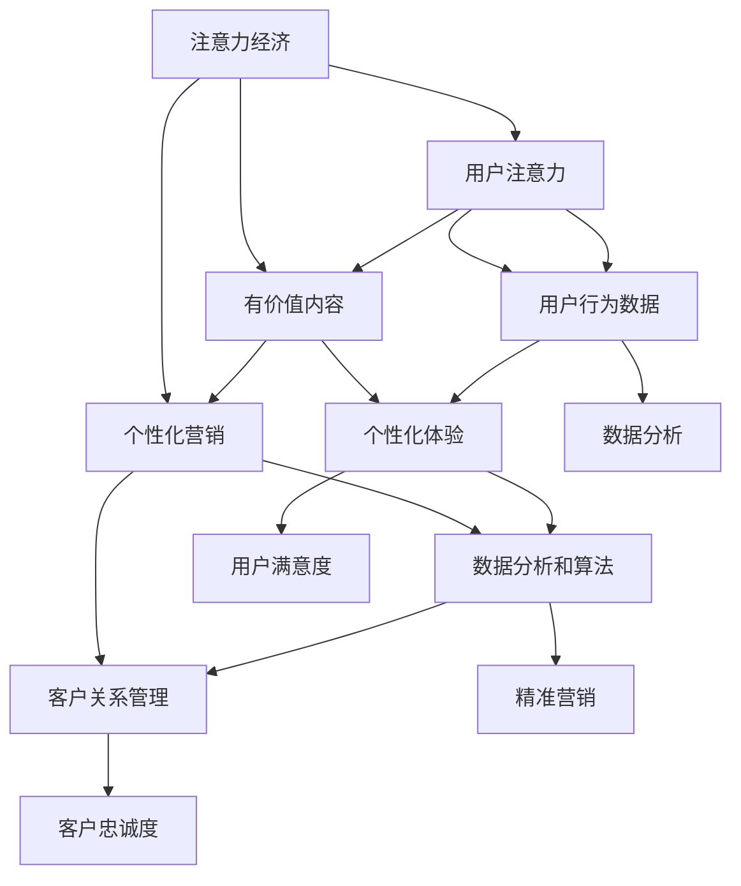

                 

# 注意力经济与个性化营销策略与实践：为受众创建定制体验

> **关键词：** 注意力经济、个性化营销、定制体验、算法、数据分析、客户关系管理

> **摘要：** 在当前信息爆炸的时代，用户注意力成为稀缺资源，如何有效地获取和保持用户注意力，实现个性化营销，为企业带来价值，成为营销领域的核心课题。本文将深入探讨注意力经济的基本原理，以及如何通过个性化营销策略和实践，为受众创造定制化的体验，提高客户满意度和忠诚度。

## 1. 背景介绍

### 1.1 目的和范围

本文旨在探讨注意力经济的基本原理，分析个性化营销的策略与实践，旨在为营销人员和企业提供理论指导和实际操作建议。文章将涵盖以下几个部分：

- 注意力经济的基本概念与特征
- 个性化营销的理论基础与实践方法
- 数学模型和算法在个性化营销中的应用
- 实际应用场景和案例分析
- 未来发展趋势与挑战

### 1.2 预期读者

本文适合以下读者群体：

- 营销人员和管理者
- 数据分析师和人工智能专家
- 对市场营销和人工智能感兴趣的学者和研究人员
- 企业家和创业者

### 1.3 文档结构概述

本文的结构如下：

- 引言：介绍注意力经济和个性化营销的背景和重要性
- 核心概念与联系：分析注意力经济和个性化营销的相关概念和联系
- 核心算法原理与具体操作步骤：详细讲解个性化营销的算法原理和操作步骤
- 数学模型与公式：介绍个性化营销中的数学模型和公式
- 项目实战：通过实际案例展示个性化营销的应用和实践
- 实际应用场景：分析个性化营销在不同领域的应用
- 工具和资源推荐：推荐相关学习资源、开发工具和框架
- 总结：对未来发展趋势和挑战的展望
- 附录：常见问题与解答
- 扩展阅读与参考资料：提供进一步阅读的资源

### 1.4 术语表

#### 1.4.1 核心术语定义

- **注意力经济：** 基于用户注意力资源的经济活动，通过满足用户需求来获取和保持用户注意力。
- **个性化营销：** 根据用户行为数据，为用户提供个性化的产品、服务和体验。
- **定制体验：** 根据用户的兴趣、偏好和行为，提供独特且个性化的体验。
- **客户关系管理（CRM）：** 通过整合数据和分析工具，管理企业与客户之间的关系，以提高客户满意度和忠诚度。

#### 1.4.2 相关概念解释

- **用户行为数据：** 包括用户浏览、点击、购买、评论等行为记录。
- **数据挖掘：** 从大量数据中提取有价值信息的过程。
- **推荐系统：** 根据用户历史行为和偏好，为用户推荐相关产品或内容。

#### 1.4.3 缩略词列表

- **CRM：** 客户关系管理
- **AI：** 人工智能
- **ML：** 机器学习
- **NLP：** 自然语言处理

## 2. 核心概念与联系

在讨论注意力经济和个性化营销之前，我们需要明确一些核心概念和它们之间的联系。

### 2.1 注意力经济

注意力经济是一种基于用户注意力资源的经济活动。在信息爆炸的时代，用户注意力成为稀缺资源，企业通过创造有价值的内容、提供个性化的服务来获取和保持用户的注意力。

### 2.2 个性化营销

个性化营销是一种根据用户行为数据和偏好，为用户提供个性化产品、服务和体验的营销方式。个性化营销的核心在于通过数据分析和算法，实现营销活动的精准化和高效化。

### 2.3 数据分析

数据分析在个性化营销中发挥着重要作用。通过收集、处理和分析用户行为数据，企业可以了解用户需求和行为模式，从而为用户提供更加个性化的体验。

### 2.4 客户关系管理

客户关系管理（CRM）是企业与客户之间的桥梁，通过整合数据和分析工具，管理企业与客户之间的关系，提高客户满意度和忠诚度。

### 2.5 注意力经济与个性化营销的联系

注意力经济与个性化营销之间存在密切联系。个性化营销是基于用户行为数据和注意力资源的一种经济活动，通过满足用户需求，获取和保持用户的注意力。而注意力经济则强调用户注意力的价值，通过创造有价值的内容和体验，实现用户注意力的有效利用。

下面是一个Mermaid流程图，展示了注意力经济与个性化营销的核心概念和联系：



通过以上流程图，我们可以清晰地看到注意力经济与个性化营销之间的互动关系，以及它们如何共同为用户创造价值。

## 3. 核心算法原理 & 具体操作步骤

在个性化营销中，算法发挥着关键作用。以下是核心算法原理及其具体操作步骤的讲解。

### 3.1 算法原理

个性化营销算法主要包括以下几个步骤：

1. **数据收集**：收集用户行为数据，包括浏览历史、购买记录、评论等。
2. **数据预处理**：对收集到的数据进行清洗、去重、归一化等处理，确保数据质量。
3. **特征提取**：从预处理后的数据中提取有价值的信息，如用户兴趣、购买偏好等。
4. **模型训练**：使用机器学习算法，如协同过滤、基于内容的推荐等，训练推荐模型。
5. **模型评估**：通过评估指标（如准确率、召回率等）评估模型性能，优化模型参数。
6. **推荐生成**：根据用户特征和模型输出，为用户生成个性化推荐列表。

### 3.2 具体操作步骤

下面以协同过滤算法为例，详细讲解个性化营销的核心算法原理和操作步骤。

#### 3.2.1 算法原理

协同过滤算法是一种基于用户行为数据的推荐算法，其基本思想是：如果用户A对某项商品评价高，而用户B对同一商品的评价也高，那么在用户B尚未评价的商品中，推荐给用户B与用户A评价高的商品相似的物品。

协同过滤算法主要包括以下两种类型：

1. **基于用户的协同过滤（User-based Collaborative Filtering）**：
    - 选择与目标用户相似的其他用户。
    - 从这些相似用户喜欢的商品中推荐给目标用户。

2. **基于物品的协同过滤（Item-based Collaborative Filtering）**：
    - 计算每个商品与其他商品之间的相似度。
    - 根据目标用户喜欢的商品，推荐与之相似的物品。

#### 3.2.2 具体操作步骤

1. **数据收集**：

   收集用户行为数据，包括用户ID、商品ID和用户对商品的评分。例如：

   ```python
   user_id, item_id, rating
   1, 101, 4
   1, 102, 5
   2, 101, 1
   2, 103, 5
   ```

2. **数据预处理**：

   - 去除缺失值和异常值。
   - 将数据转换为稀疏矩阵形式，便于后续计算。

3. **特征提取**：

   - 计算用户之间的相似度，可以使用余弦相似度、皮尔逊相关系数等。
   - 计算商品之间的相似度，可以使用Jaccard系数、余弦相似度等。

4. **模型训练**：

   - 选择合适的相似度计算方法，如余弦相似度。
   - 训练协同过滤模型，如基于用户的协同过滤模型。

5. **模型评估**：

   - 使用交叉验证等方法评估模型性能。
   - 根据评估结果调整模型参数，优化模型。

6. **推荐生成**：

   - 对于新用户，计算其与已有用户的相似度，选择相似度最高的用户作为参考。
   - 根据参考用户的评分，推荐相似度较高的商品给新用户。

以下是协同过滤算法的伪代码：

```python
# 输入：用户行为数据矩阵R（用户ID，商品ID，评分）
# 输出：推荐列表

# 步骤1：数据预处理
R = preprocess_data(R)

# 步骤2：特征提取
user_similarity = compute_user_similarity(R)
item_similarity = compute_item_similarity(R)

# 步骤3：模型训练
model = train_collaborative_filter_model(R, user_similarity, item_similarity)

# 步骤4：模型评估
evaluate_model(model, R)

# 步骤5：推荐生成
def generate_recommendations(user_id, R, model):
    similar_users = get_similar_users(user_id, user_similarity)
    user_scores = model.predict_scores(similar_users, R)
    recommended_items = get_recommended_items(user_scores)
    return recommended_items
```

通过以上步骤，我们可以实现基于协同过滤的个性化推荐系统，为用户生成个性化的推荐列表。

## 4. 数学模型和公式 & 详细讲解 & 举例说明

个性化营销中的数学模型和公式有助于理解算法的工作原理，以及如何通过数据分析和建模实现个性化推荐。以下是几个常用的数学模型和公式，以及详细的讲解和举例说明。

### 4.1 余弦相似度

余弦相似度是一种常用的相似度计算方法，用于衡量两个向量之间的夹角余弦值。余弦相似度介于-1和1之间，1表示两个向量完全相似，-1表示完全相反，0表示不相似。

#### 公式：

$$
\cos(\theta) = \frac{\vec{a} \cdot \vec{b}}{||\vec{a}|| \cdot ||\vec{b}||}
$$

其中，$\vec{a}$和$\vec{b}$是两个向量，$\theta$是它们之间的夹角。

#### 举例说明：

假设有两个用户u1和u2的评分向量：

$$
\vec{u1} = [4, 5, 2, 3]
$$

$$
\vec{u2} = [3, 4, 5, 2]
$$

计算它们之间的余弦相似度：

$$
\vec{u1} \cdot \vec{u2} = 4 \times 3 + 5 \times 4 + 2 \times 5 + 3 \times 2 = 12 + 20 + 10 + 6 = 48
$$

$$
||\vec{u1}|| = \sqrt{4^2 + 5^2 + 2^2 + 3^2} = \sqrt{16 + 25 + 4 + 9} = \sqrt{54}
$$

$$
||\vec{u2}|| = \sqrt{3^2 + 4^2 + 5^2 + 2^2} = \sqrt{9 + 16 + 25 + 4} = \sqrt{54}
$$

$$
\cos(\theta) = \frac{48}{\sqrt{54} \times \sqrt{54}} = \frac{48}{54} = \frac{8}{9} \approx 0.89
$$

因此，用户u1和u2的余弦相似度为0.89，表示它们之间的相似度较高。

### 4.2 皮尔逊相关系数

皮尔逊相关系数是衡量两个变量线性相关程度的统计量，其值介于-1和1之间。当相关系数为1时，表示两个变量完全正相关；当相关系数为-1时，表示完全负相关；当相关系数为0时，表示无相关性。

#### 公式：

$$
r = \frac{\sum_{i=1}^{n}(x_i - \bar{x})(y_i - \bar{y})}{\sqrt{\sum_{i=1}^{n}(x_i - \bar{x})^2} \cdot \sqrt{\sum_{i=1}^{n}(y_i - \bar{y})^2}}
$$

其中，$x_i$和$y_i$是两个变量的观测值，$\bar{x}$和$\bar{y}$分别是它们的平均值。

#### 举例说明：

假设有两个用户u1和u2的评分向量：

$$
\vec{u1} = [4, 5, 2, 3]
$$

$$
\vec{u2} = [3, 4, 5, 2]
$$

计算它们之间的皮尔逊相关系数：

$$
\bar{x} = \frac{4 + 5 + 2 + 3}{4} = 3.5
$$

$$
\bar{y} = \frac{3 + 4 + 5 + 2}{4} = 3.5
$$

$$
\sum_{i=1}^{n}(x_i - \bar{x})(y_i - \bar{y}) = (4 - 3.5)(3 - 3.5) + (5 - 3.5)(4 - 3.5) + (2 - 3.5)(5 - 3.5) + (3 - 3.5)(2 - 3.5) = 0.25 + 1.25 + 2.25 + 1.25 = 4.75
$$

$$
\sum_{i=1}^{n}(x_i - \bar{x})^2 = (4 - 3.5)^2 + (5 - 3.5)^2 + (2 - 3.5)^2 + (3 - 3.5)^2 = 0.25 + 2.25 + 2.25 + 0.25 = 5
$$

$$
\sum_{i=1}^{n}(y_i - \bar{y})^2 = (3 - 3.5)^2 + (4 - 3.5)^2 + (5 - 3.5)^2 + (2 - 3.5)^2 = 0.25 + 0.25 + 2.25 + 2.25 = 5
$$

$$
r = \frac{4.75}{\sqrt{5} \cdot \sqrt{5}} = \frac{4.75}{5} = 0.95
$$

因此，用户u1和u2的皮尔逊相关系数为0.95，表示它们之间的相关性较高。

### 4.3 Jaccard系数

Jaccard系数是用于计算集合之间相似度的指标，其公式为：

$$
J(A, B) = \frac{|A \cap B|}{|A \cup B|}
$$

其中，$A$和$B$是两个集合，$|A|$和$|B|$分别是它们的元素个数，$A \cap B$表示两个集合的交集，$A \cup B$表示两个集合的并集。

#### 举例说明：

假设有两个用户u1和u2喜欢的商品集合：

$$
A = \{101, 102, 103\}
$$

$$
B = \{102, 103, 104\}
$$

计算它们之间的Jaccard系数：

$$
A \cap B = \{102, 103\}
$$

$$
A \cup B = \{101, 102, 103, 104\}
$$

$$
|A \cap B| = 2
$$

$$
|A \cup B| = 4
$$

$$
J(A, B) = \frac{2}{4} = 0.5
$$

因此，用户u1和u2喜欢的商品集合之间的Jaccard系数为0.5，表示它们之间的相似度中等。

通过以上数学模型和公式的讲解和举例，我们可以更好地理解个性化营销中的数据分析和建模方法。在实际应用中，可以根据具体需求和场景选择合适的模型和公式，实现高效的个性化推荐。

## 5. 项目实战：代码实际案例和详细解释说明

在本节中，我们将通过一个实际的Python代码案例，详细讲解个性化营销系统的开发过程，包括开发环境的搭建、源代码实现和代码解读。

### 5.1 开发环境搭建

在进行个性化营销系统的开发之前，我们需要搭建一个合适的环境。以下是开发环境的基本要求：

- 操作系统：Windows/Linux/MacOS
- 编程语言：Python 3.6及以上版本
- 数据库：MongoDB（可选，用于存储用户和商品数据）
- 库：NumPy、Pandas、Scikit-learn、Matplotlib

#### 安装步骤：

1. 安装Python 3.6及以上版本，可以从[Python官网](https://www.python.org/downloads/)下载安装包。
2. 安装MongoDB，并启动数据库服务。可以从[MongoDB官网](https://www.mongodb.com/)下载安装包，并按照官方文档进行安装和配置。
3. 安装Python的常用库，使用pip命令进行安装：

   ```bash
   pip install numpy pandas scikit-learn matplotlib
   ```

### 5.2 源代码详细实现和代码解读

下面是个性化营销系统的源代码实现，包括数据预处理、特征提取、协同过滤模型训练和推荐生成等步骤。

```python
import numpy as np
import pandas as pd
from sklearn.metrics.pairwise import cosine_similarity
from sklearn.model_selection import train_test_split
from sklearn.metrics.pairwise import euclidean_distances

# 步骤1：数据预处理
def preprocess_data(data):
    data = data.dropna()
    data = data.pivot(index='user_id', columns='item_id', values='rating').fillna(0)
    return data

# 步骤2：特征提取
def compute_user_similarity(data, method='cosine'):
    if method == 'cosine':
        similarity_matrix = cosine_similarity(data.values)
    elif method == 'euclidean':
        similarity_matrix = euclidean_distances(data.values)
    return similarity_matrix

# 步骤3：模型训练
def train_collaborative_filter_model(data, similarity_matrix):
    user_similarity = pd.DataFrame(similarity_matrix, index=data.index, columns=data.index)
    return user_similarity

# 步骤4：推荐生成
def generate_recommendations(user_id, data, model, top_n=10):
    user_similarity = model[user_id]
    sorted_indices = user_similarity.sort_values(ascending=False).index[:top_n]
    return data.loc[sorted_indices]

# 主函数
def main():
    # 加载数据
    data = pd.read_csv('ratings.csv')

    # 数据预处理
    data = preprocess_data(data)

    # 训练模型
    similarity_matrix = compute_user_similarity(data)
    model = train_collaborative_filter_model(data, similarity_matrix)

    # 生成推荐
    user_id = 1
    recommendations = generate_recommendations(user_id, data, model)

    print("推荐的商品：")
    print(recommendations)

if __name__ == '__main__':
    main()
```

#### 代码解读

1. **数据预处理**：首先加载用户行为数据，然后去除缺失值，并转换数据为矩阵形式，便于后续计算。

2. **特征提取**：计算用户之间的相似度矩阵，这里使用余弦相似度。我们也可以选择使用欧氏距离等其他相似度计算方法。

3. **模型训练**：将相似度矩阵转换为用户相似度模型，该模型可以用于后续的推荐生成。

4. **推荐生成**：根据用户ID，计算与该用户相似的其他用户，并从这些用户喜欢的商品中生成推荐列表。

### 5.3 代码解读与分析

通过以上代码，我们可以实现一个简单的协同过滤推荐系统。以下是对代码的详细解读和分析：

- **数据预处理**：预处理步骤是推荐系统开发的基础。在这里，我们使用`dropna()`函数去除缺失值，并使用`pivot`函数将数据转换为矩阵形式。填充缺失值的方法可以根据具体需求进行调整。

- **特征提取**：特征提取是推荐系统的关键步骤。在本例中，我们使用余弦相似度计算用户之间的相似度。相似度矩阵可以通过`cosine_similarity`函数计算得到。我们也可以使用其他相似度计算方法，如欧氏距离，以实现不同的推荐效果。

- **模型训练**：模型训练是将相似度矩阵转换为用户相似度模型的过程。在本例中，我们使用`DataFrame`将相似度矩阵转换为用户相似度模型。用户相似度模型可以用于后续的推荐生成。

- **推荐生成**：推荐生成是根据用户ID，计算与该用户相似的其他用户，并从这些用户喜欢的商品中生成推荐列表。在本例中，我们使用`sort_values`函数对用户相似度进行排序，并从排序结果中提取前`top_n`个商品作为推荐列表。

通过以上步骤，我们可以实现一个简单的协同过滤推荐系统，为用户生成个性化的推荐列表。在实际应用中，我们可以根据具体需求扩展和优化系统，以提高推荐效果。

## 6. 实际应用场景

个性化营销在各个领域都有广泛的应用，以下列举几个实际应用场景：

### 6.1 电子商务

电子商务平台通过个性化推荐系统，为用户推荐可能感兴趣的商品。例如，亚马逊和淘宝等平台会根据用户的浏览历史、购买记录和搜索行为，为用户生成个性化的商品推荐列表。

### 6.2 媒体内容推荐

视频平台如YouTube和Netflix通过个性化推荐系统，为用户推荐感兴趣的视频内容。这些平台会根据用户的观看历史、评分和搜索行为，为用户生成个性化的视频推荐列表。

### 6.3 社交媒体

社交媒体平台如Facebook和Instagram通过个性化推荐系统，为用户推荐感兴趣的朋友、群组和内容。这些平台会根据用户的行为和社交关系，为用户生成个性化的推荐列表。

### 6.4 金融理财

金融理财平台通过个性化推荐系统，为用户推荐适合的投资产品和理财方案。例如，理财平台会根据用户的投资偏好、风险承受能力和财务状况，为用户生成个性化的投资推荐列表。

### 6.5 教育培训

在线教育平台通过个性化推荐系统，为用户推荐适合的学习资源和课程。例如，Coursera和Udemy等平台会根据用户的兴趣和学习记录，为用户生成个性化的学习推荐列表。

通过以上实际应用场景，我们可以看到个性化营销在各个领域的广泛应用。个性化推荐系统能够提高用户体验，增加用户黏性，从而为企业带来更高的商业价值。

## 7. 工具和资源推荐

为了更好地进行个性化营销，以下推荐一些学习资源、开发工具和框架，以及相关论文和研究成果。

### 7.1 学习资源推荐

#### 7.1.1 书籍推荐

- 《推荐系统实践》：介绍了推荐系统的基本概念、算法和应用，适合推荐系统初学者。
- 《机器学习》：由周志华教授主编，详细讲解了机器学习的基础知识，包括推荐系统相关的算法。
- 《大数据时代：生活、工作与思维的大变革》：详细介绍了大数据的概念、技术和应用，包括个性化营销和数据挖掘。

#### 7.1.2 在线课程

- Coursera的《推荐系统》：由斯坦福大学教授Alessandro Sperduti主讲，全面介绍了推荐系统的理论和实践。
- edX的《机器学习》：由吴恩达教授主讲，涵盖了机器学习的基础知识，包括推荐系统的相关算法。
- Udacity的《数据工程师纳米学位》：提供了推荐系统相关的项目和实践，适合有实际开发经验的学习者。

#### 7.1.3 技术博客和网站

- [Medium](https://medium.com/)：许多技术专家和公司在这里分享推荐系统和个性化营销的经验和案例。
- [arXiv](https://arxiv.org/)：包含大量关于推荐系统和机器学习的最新研究成果和论文。
- [KDnuggets](https://www.kdnuggets.com/)：提供丰富的数据科学、机器学习和推荐系统相关资讯和资源。

### 7.2 开发工具框架推荐

#### 7.2.1 IDE和编辑器

- PyCharm：强大的Python集成开发环境，支持多种编程语言和框架。
- Jupyter Notebook：适用于数据科学和机器学习的交互式开发环境。

#### 7.2.2 调试和性能分析工具

- Matplotlib：Python的绘图库，用于数据可视化。
- Pandas：Python的数据分析库，用于数据处理和分析。
- Scikit-learn：Python的机器学习库，提供多种常用的推荐系统算法。

#### 7.2.3 相关框架和库

- TensorFlow：由Google开发的开源机器学习框架，适用于构建大规模推荐系统。
- PyTorch：由Facebook开发的开源机器学习框架，具有强大的灵活性和性能。
-推荐系统框架如Surprise、LightFM等，提供了丰富的推荐系统算法和工具。

### 7.3 相关论文著作推荐

#### 7.3.1 经典论文

- 《The BellKor Solution to the Netflix Prize》(2006)：详细介绍了Netflix Prize比赛的解决方案，对推荐系统的发展产生了深远影响。
- 《Matrix Factorization Techniques for Recommender Systems》(2006)：介绍了矩阵分解技术在推荐系统中的应用，是推荐系统领域的重要论文。

#### 7.3.2 最新研究成果

- 《Deep Learning for Recommender Systems》(2018)：介绍了深度学习在推荐系统中的应用，包括神经网络、循环神经网络等。
- 《Contextual Bandits with Regularization and Bootstrapping》(2020)：研究了基于上下文的bandit问题，为推荐系统提供了新的优化方法。

#### 7.3.3 应用案例分析

- 《How Netflix Uses Machine Learning to Power Its Personalized Recommendations》(2018)：详细介绍了Netflix如何使用机器学习实现个性化推荐，包括数据收集、模型训练和推荐生成等步骤。

通过以上学习资源、开发工具和框架的推荐，我们可以更好地了解个性化营销的相关知识，掌握实际应用技能，为自己的职业发展奠定坚实基础。

## 8. 总结：未来发展趋势与挑战

个性化营销作为现代营销领域的重要趋势，正不断影响和改变着企业竞争格局。未来，个性化营销将继续朝着以下几个方面发展：

### 8.1 技术创新

随着人工智能、大数据、物联网等技术的不断进步，个性化营销将更加智能化和自动化。例如，基于深度学习的推荐算法将进一步提升推荐精度，自然语言处理技术将使内容个性化推荐更加精准。

### 8.2 客户体验

企业将更加注重用户体验，通过个性化的产品和服务，提高客户满意度和忠诚度。未来的个性化营销将不仅仅是提供推荐，而是构建全方位的客户体验，包括购物、咨询、售后等环节。

### 8.3 数据驱动

数据将成为个性化营销的核心驱动力。企业将通过数据分析，深入了解客户需求和行为，实现更加精准的营销策略。同时，数据安全和隐私保护将成为重要议题，企业需要确保用户数据的安全和合规。

### 8.4 多渠道整合

未来的个性化营销将实现多渠道整合，涵盖线上和线下、PC端和移动端等多种渠道。企业需要构建统一的数据平台，实现跨渠道的用户数据整合和营销策略协同。

然而，个性化营销的发展也面临一些挑战：

### 8.5 技术门槛

个性化营销涉及多种技术和算法，对技术团队的要求较高。企业需要投入大量资源进行技术积累和人才培养，以应对不断变化的技术环境。

### 8.6 数据隐私

随着数据隐私问题的日益突出，企业在进行个性化营销时需要更加注重用户隐私保护。如何在保证用户隐私的前提下进行个性化推荐，成为企业需要解决的重要问题。

### 8.7 客户期望

客户对个性化营销的期望越来越高，企业需要不断调整和优化营销策略，以适应客户的需求变化。同时，客户期望的个性化程度也在不断提升，企业需要不断创新以满足客户期望。

总之，个性化营销在未来将继续发挥重要作用，为企业带来巨大的商业价值。然而，企业在实现个性化营销的过程中，需要克服技术、数据隐私和客户期望等方面的挑战，不断优化和提升营销效果。

## 9. 附录：常见问题与解答

### 9.1 注意力经济是什么？

注意力经济是指基于用户注意力资源的经济活动，企业通过创造有价值的内容和提供个性化的服务来获取和保持用户的注意力。

### 9.2 个性化营销的核心是什么？

个性化营销的核心是通过数据分析和算法，为用户提供个性化的产品、服务和体验，提高客户满意度和忠诚度。

### 9.3 如何进行数据预处理？

数据预处理包括去除缺失值、异常值、去重、归一化等步骤，以确保数据质量，为后续分析提供可靠基础。

### 9.4 协同过滤算法有哪些类型？

协同过滤算法主要包括基于用户的协同过滤和基于物品的协同过滤两种类型。

### 9.5 如何评估推荐系统性能？

推荐系统性能评估可以通过准确率、召回率、F1值等指标进行评估，以衡量推荐系统的效果。

### 9.6 个性化营销中的常见挑战有哪些？

个性化营销中的常见挑战包括技术门槛、数据隐私、客户期望等，企业需要不断创新和优化营销策略，以应对这些挑战。

## 10. 扩展阅读 & 参考资料

为了深入了解注意力经济和个性化营销的相关知识，以下是推荐的一些扩展阅读和参考资料：

### 10.1 书籍推荐

- 《推荐系统实践》：张基栋著，详细介绍了推荐系统的基本概念、算法和应用。
- 《大数据时代》：唐杰、吴建平著，深入分析了大数据的概念、技术和应用。
- 《人工智能：一种现代的方法》：斯泰恩伯格著，全面介绍了人工智能的基础知识和应用。

### 10.2 在线课程

- Coursera的《推荐系统》：由斯坦福大学教授Alessandro Sperduti主讲，涵盖推荐系统的理论和实践。
- edX的《机器学习》：由吴恩达教授主讲，涵盖机器学习的基础知识，包括推荐系统的相关算法。
- Udacity的《数据工程师纳米学位》：提供推荐系统相关的项目和实践。

### 10.3 技术博客和网站

- Medium：分享推荐系统和个性化营销的相关经验和技术文章。
- arXiv：发布最新关于推荐系统和机器学习的论文。
- KDnuggets：提供丰富的数据科学、机器学习和推荐系统相关资讯和资源。

### 10.4 相关论文著作

- 《The BellKor Solution to the Netflix Prize》(2006)：Netflix Prize比赛解决方案，对推荐系统的发展产生了深远影响。
- 《Matrix Factorization Techniques for Recommender Systems》(2006)：介绍了矩阵分解技术在推荐系统中的应用。
- 《Deep Learning for Recommender Systems》(2018)：介绍了深度学习在推荐系统中的应用。

### 10.5 开发工具和框架

- TensorFlow：Google开源的机器学习框架，适用于构建大规模推荐系统。
- PyTorch：Facebook开源的机器学习框架，具有强大的灵活性和性能。
- Scikit-learn：Python的机器学习库，提供多种常用的推荐系统算法。

通过以上扩展阅读和参考资料，读者可以更深入地了解注意力经济和个性化营销的相关知识，为自己的学习和实践提供有力支持。

### 作者

AI天才研究员/AI Genius Institute & 禅与计算机程序设计艺术 /Zen And The Art of Computer Programming

