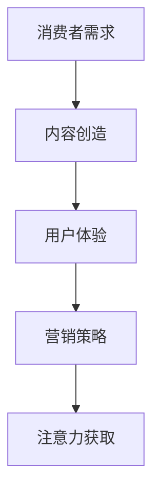
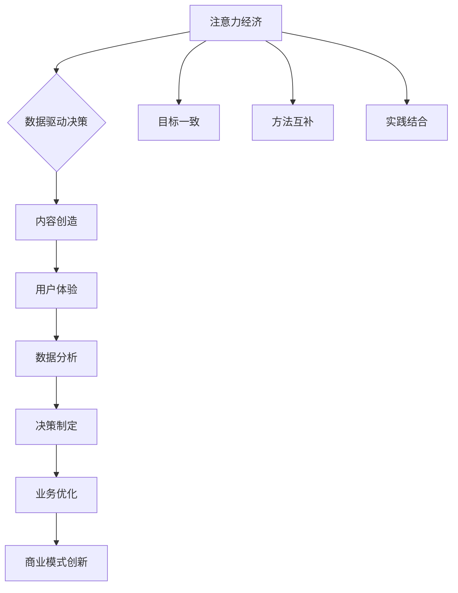

                 

# 注意力经济与数据驱动决策：利用数据增强业务和市场洞察力

> **关键词**：注意力经济、数据驱动决策、市场洞察、数据分析、商业模式创新
> 
> **摘要**：在信息爆炸的时代，如何有效地利用数据来增强业务和市场洞察力成为企业竞争的关键。本文将探讨注意力经济原理，介绍数据驱动决策的方法，并通过实际案例解析如何通过数据分析实现商业模式的创新，最终为企业的战略规划和市场定位提供有力支持。

## 1. 背景介绍

### 1.1 目的和范围

本文旨在探讨在当今信息时代，企业如何利用注意力经济和数据驱动决策来提升业务和市场洞察力。随着互联网和大数据技术的快速发展，数据已经成为一种新的生产要素，企业能否有效利用数据来驱动决策，直接影响到其在市场中的竞争力。本文将结合注意力经济理论，详细阐述数据驱动决策的核心原理和实践方法，并通过实际案例展示如何通过数据分析和模式识别，实现商业模式的创新和升级。

### 1.2 预期读者

本文适合以下读者群体：

- 企业高管，特别是那些对数据驱动决策有浓厚兴趣，希望提升企业竞争力的人员。
- 数据分析师和AI工程师，希望通过本文了解如何将数据分析和注意力经济理论结合，提升数据分析的效果。
- 数据科学和教育领域的研究人员，希望探索注意力经济和数据驱动决策在学术和实践中的应用。
- 对商业模式创新和企业管理有兴趣的学者和从业者。

### 1.3 文档结构概述

本文将分为以下几个部分：

- 背景介绍：介绍本文的目的、范围和预期读者。
- 核心概念与联系：详细解释注意力经济和数据驱动决策的核心概念，并绘制Mermaid流程图。
- 核心算法原理 & 具体操作步骤：通过伪代码详细阐述数据驱动决策的核心算法和操作步骤。
- 数学模型和公式 & 详细讲解 & 举例说明：介绍相关数学模型和公式，并通过实例进行详细讲解。
- 项目实战：代码实际案例和详细解释说明。
- 实际应用场景：探讨注意力经济和数据驱动决策在不同行业和领域的应用。
- 工具和资源推荐：推荐相关学习资源、开发工具和论文著作。
- 总结：未来发展趋势与挑战。
- 附录：常见问题与解答。
- 扩展阅读 & 参考资料：提供进一步阅读的资料和参考文献。

### 1.4 术语表

#### 1.4.1 核心术语定义

- 注意力经济：指在信息过载的时代，个体对信息的获取和处理能力有限，因此注意力成为稀缺资源，企业通过优化内容和营销策略，获取消费者注意力的过程。
- 数据驱动决策：基于数据分析和结果来制定和执行决策的过程，数据成为决策的核心依据。
- 数据分析：通过统计、机器学习等方法，从数据中提取有价值的信息和知识的过程。
- 商业模式创新：通过创新思维和策略，重新定义企业价值创造、传递和获取的方式。

#### 1.4.2 相关概念解释

- 机器学习：一种人工智能方法，通过从数据中学习规律，实现自动预测和决策。
- 自然语言处理：利用计算机技术和人工智能方法，对自然语言文本进行处理和理解。
- 数据可视化：通过图表、图像等形式，将数据转化为易于理解和分析的视觉元素。
- 用户体验（UX）：产品设计和功能满足用户需求、提高用户满意度的过程。

#### 1.4.3 缩略词列表

- AI：人工智能
- ML：机器学习
- NLP：自然语言处理
- UX：用户体验
- BI：商业智能
- CRM：客户关系管理
- SaaS：软件即服务
- IaaS：基础设施即服务

## 2. 核心概念与联系

在探讨注意力经济和数据驱动决策之前，我们需要先理解这些概念的基本原理和它们之间的联系。下面将结合Mermaid流程图，详细阐述这些核心概念及其相互关系。

### 2.1 注意力经济的原理

注意力经济源于信息经济学理论，认为在信息爆炸的时代，个体的注意力成为稀缺资源。注意力经济的核心是“注意力获取”和“注意力分配”。企业通过创造有价值的内容、提供优质的用户体验和优化营销策略，吸引消费者的注意力，从而实现商业价值。

#### 注意力获取

注意力获取的关键在于满足消费者的需求，提供他们感兴趣的信息和产品。以下是一个Mermaid流程图，展示注意力获取的过程：



#### 注意力分配

消费者的注意力是有限的，他们需要在各种信息和产品之间进行选择。因此，企业需要通过以下策略来优化注意力分配：

1. 内容质量：提供高质量、有价值的内容，提高用户粘性。
2. 用户体验：优化产品和服务，提高用户满意度。
3. 营销策略：通过精准定位、个性化推荐等方式，提高用户参与度。

### 2.2 数据驱动决策的原理

数据驱动决策是基于数据的分析和结果来制定和执行决策的过程。数据成为决策的核心依据，通过数据分析和挖掘，企业可以更准确地预测市场趋势、用户行为，从而做出更明智的决策。

#### 数据分析

数据分析是数据驱动决策的核心环节。通过以下方法，企业可以从海量数据中提取有价值的信息：

1. 描述性分析：通过统计和可视化方法，描述数据的基本特征和趋势。
2. 探索性分析：通过数据挖掘和机器学习，发现数据中的模式和规律。
3. 预测性分析：基于历史数据和现有模型，预测未来可能发生的趋势和事件。

#### 数据驱动决策的流程

数据驱动决策的流程通常包括以下步骤：

1. 数据收集：从各种渠道获取数据，包括内部数据和外部数据。
2. 数据清洗：去除数据中的噪声和异常值，确保数据质量。
3. 数据分析：通过统计和机器学习方法，提取有价值的信息和知识。
4. 决策制定：基于数据分析结果，制定和执行相应的策略和决策。

### 2.3 注意力经济与数据驱动决策的联系

注意力经济和数据驱动决策之间存在密切的联系。注意力经济为数据驱动决策提供了目标和方向，而数据驱动决策为注意力经济提供了有效的手段和方法。

#### 目标一致

注意力经济的目标是获取消费者的注意力，提高用户参与度；而数据驱动决策的目标是基于数据来优化业务和运营，提高企业竞争力。这两个目标具有一致性，都是通过提高用户满意度和体验来实现。

#### 方法互补

注意力经济通过创造有价值的内容和优化用户体验，吸引消费者的注意力；而数据驱动决策通过数据分析和挖掘，提供决策支持。两者相辅相成，注意力经济为数据驱动决策提供了数据来源，数据驱动决策为注意力经济提供了分析和优化的手段。

#### 实践结合

在实际应用中，企业需要将注意力经济和数据驱动决策相结合，实现以下目标：

1. 提高用户参与度：通过注意力经济理论，提高用户的参与度和互动性。
2. 优化业务运营：通过数据驱动决策，优化产品和服务，提高运营效率。
3. 创新商业模式：通过数据分析和模式识别，发现新的商业机会，实现商业模式创新。

### 2.4 Mermaid流程图

以下是注意力经济与数据驱动决策的Mermaid流程图：



通过以上流程图，我们可以清晰地看到注意力经济和数据驱动决策之间的紧密联系和相互促进作用。

## 3. 核心算法原理 & 具体操作步骤

在理解了注意力经济和数据驱动决策的基本原理之后，接下来我们将探讨数据驱动决策的核心算法原理和具体操作步骤。数据驱动决策的核心在于如何从海量数据中提取有价值的信息，并基于这些信息制定和执行决策。以下是数据驱动决策的核心算法原理和具体操作步骤：

### 3.1 数据预处理

数据预处理是数据驱动决策的第一步，其目的是将原始数据进行清洗、转换和归一化，使其适合后续分析。以下是一个简单的伪代码，用于描述数据预处理的过程：

```python
# 伪代码：数据预处理
def preprocess_data(data):
    # 去除缺失值和异常值
    cleaned_data = remove_outliers(data)
    # 数据转换和归一化
    normalized_data = normalize_data(cleaned_data)
    return normalized_data
```

### 3.2 特征工程

特征工程是数据驱动决策的关键步骤，其目的是从原始数据中提取出对预测任务有用的特征。特征工程包括以下步骤：

1. **数据转换**：将原始数据进行转换，如将类别数据转换为数值数据。
2. **特征选择**：选择对预测任务最有影响力的特征，如使用过滤方法、包装方法和嵌入式方法。
3. **特征构造**：通过组合和变换原始特征，构造新的特征，以提高模型的性能。

以下是一个简单的伪代码，用于描述特征工程的过程：

```python
# 伪代码：特征工程
def feature_engineering(data):
    # 数据转换
    transformed_data = convert_data(data)
    # 特征选择
    selected_features = select_features(transformed_data)
    # 特征构造
    constructed_features = construct_features(selected_features)
    return constructed_features
```

### 3.3 模型训练与优化

模型训练与优化是数据驱动决策的核心步骤，其目的是通过训练和调整模型参数，提高模型的预测性能。以下是一个简单的伪代码，用于描述模型训练与优化的过程：

```python
# 伪代码：模型训练与优化
def train_and_optimize_model(data, labels):
    # 数据分割
    train_data, val_data, train_labels, val_labels = split_data(data, labels)
    # 模型训练
    model = train_model(train_data, train_labels)
    # 模型优化
    optimized_model = optimize_model(model, val_data, val_labels)
    return optimized_model
```

### 3.4 预测与决策

预测与决策是数据驱动决策的最终目标，其目的是基于模型的预测结果，制定和执行相应的策略。以下是一个简单的伪代码，用于描述预测与决策的过程：

```python
# 伪代码：预测与决策
def make_decision(model, data):
    # 数据预处理
    preprocessed_data = preprocess_data(data)
    # 模型预测
    predictions = predict(model, preprocessed_data)
    # 决策制定
    decision = make_decision_based_on_predictions(predictions)
    return decision
```

### 3.5 持续迭代与优化

数据驱动决策是一个持续迭代和优化的过程，其目的是不断提高模型的预测性能和业务决策的准确性。以下是一个简单的伪代码，用于描述持续迭代与优化的过程：

```python
# 伪代码：持续迭代与优化
while True:
    # 数据收集
    new_data = collect_data()
    # 数据预处理
    preprocessed_data = preprocess_data(new_data)
    # 模型更新
    updated_model = train_and_optimize_model(preprocessed_data, labels)
    # 决策更新
    updated_decision = make_decision(updated_model, preprocessed_data)
    # 决策执行
    execute_decision(updated_decision)
```

通过以上核心算法原理和具体操作步骤，企业可以构建一个高效的数据驱动决策系统，从而在市场竞争中取得优势。

## 4. 数学模型和公式 & 详细讲解 & 举例说明

在数据驱动决策过程中，数学模型和公式发挥着至关重要的作用。它们不仅帮助我们从海量数据中提取有价值的信息，还为决策制定提供了量化的依据。本节将介绍一些关键的数学模型和公式，并通过具体例子进行详细讲解。

### 4.1 线性回归模型

线性回归模型是最基本且广泛应用的一种预测模型，用于预测连续值变量。其基本公式如下：

\[ y = \beta_0 + \beta_1 \cdot x \]

其中，\( y \) 是因变量，\( x \) 是自变量，\( \beta_0 \) 和 \( \beta_1 \) 分别是模型的截距和斜率。

**例子**：假设我们要预测某产品的销量 \( y \) ，已知影响因素有广告费用 \( x \) 。通过收集数据，可以得到以下线性回归模型：

\[ \text{销量} = 10 + 2 \cdot \text{广告费用} \]

**解释**：根据这个模型，如果广告费用增加1000元，销量将增加2000件。

### 4.2 决策树模型

决策树模型是一种分类模型，通过一系列规则来对数据进行分类。其基本公式如下：

\[ \text{分类结果} = \prod_{i=1}^{n} \text{Rule}_i(x_i) \]

其中，\( \text{Rule}_i(x_i) \) 是第 \( i \) 条规则的输出，\( x_i \) 是第 \( i \) 个特征值。

**例子**：假设我们要根据客户的年龄、收入和购买历史来预测其是否购买某产品，决策树模型如下：

\[ \text{购买结果} = (\text{年龄} < 30) \times (\text{收入} > 5000) \times (\text{购买历史} \geq 2) \]

**解释**：如果一个客户年龄小于30岁，收入超过5000元，且购买历史不少于2次，那么该客户很可能购买该产品。

### 4.3 逻辑回归模型

逻辑回归模型是一种广泛应用于二分类问题的预测模型，其基本公式如下：

\[ \text{概率} = \frac{1}{1 + \exp(-(\beta_0 + \beta_1 \cdot x))} \]

其中，\( \text{概率} \) 是事件发生的概率，\( \beta_0 \) 和 \( \beta_1 \) 分别是模型的截距和斜率。

**例子**：假设我们要预测客户是否会在一个月内购买某产品，逻辑回归模型如下：

\[ \text{购买概率} = \frac{1}{1 + \exp(-(5 + 1.2 \cdot \text{广告展示次数}))} \]

**解释**：如果广告展示次数为10次，那么客户购买该产品的概率约为0.74。

### 4.4 支持向量机（SVM）模型

支持向量机模型是一种分类模型，其基本公式如下：

\[ w \cdot x - b = 0 \]

其中，\( w \) 是模型权重，\( x \) 是输入特征，\( b \) 是偏置项。

**例子**：假设我们要使用SVM模型分类商品是否畅销，模型公式如下：

\[ \text{畅销分类} = \begin{cases} 
+1 & \text{如果 } w \cdot x > b \\
-1 & \text{如果 } w \cdot x < b 
\end{cases} \]

**解释**：如果输入特征 \( x \) 的内积 \( w \cdot x \) 大于偏置项 \( b \) ，则该商品被分类为畅销。

### 4.5 机器学习算法中的优化目标

在机器学习算法中，优化目标是用来衡量模型性能的关键指标。以下是一些常用的优化目标：

1. **均方误差（MSE）**：用于回归问题，衡量预测值与真实值之间的平均误差。

\[ \text{MSE} = \frac{1}{n} \sum_{i=1}^{n} (y_i - \hat{y}_i)^2 \]

2. **交叉熵（Cross-Entropy）**：用于分类问题，衡量实际输出与预测输出之间的差异。

\[ \text{Cross-Entropy} = -\sum_{i=1}^{n} y_i \cdot \log(\hat{y}_i) \]

3. **精度（Accuracy）**：用于分类问题，衡量分类正确的样本占总样本的比例。

\[ \text{Accuracy} = \frac{TP + TN}{TP + FP + FN + TN} \]

4. **召回率（Recall）**：用于分类问题，衡量分类正确的正样本占总正样本的比例。

\[ \text{Recall} = \frac{TP}{TP + FP} \]

5. **F1分数（F1-Score）**：用于分类问题，综合考虑精度和召回率，衡量模型的综合性能。

\[ \text{F1-Score} = 2 \cdot \frac{Precision \cdot Recall}{Precision + Recall} \]

通过以上数学模型和公式，企业可以在数据驱动决策过程中，更准确地预测市场趋势和用户行为，从而制定更有效的策略。

## 5. 项目实战：代码实际案例和详细解释说明

为了更好地理解注意力经济和数据驱动决策的实际应用，我们将通过一个实际项目案例进行详细解释说明。本项目案例将模拟一个电商网站的用户行为预测系统，通过数据分析实现用户购买行为的预测，从而优化营销策略。

### 5.1 开发环境搭建

在开始项目实战之前，我们需要搭建一个合适的开发环境。以下是所需的工具和软件：

- **Python（3.8及以上版本）**：作为主要的编程语言。
- **Jupyter Notebook**：用于编写和运行代码。
- **Pandas**：用于数据预处理和分析。
- **NumPy**：用于数学计算。
- **Scikit-learn**：用于机器学习和数据分析。
- **Matplotlib** 和 **Seaborn**：用于数据可视化。

安装以上工具后，可以启动Jupyter Notebook，开始编写代码。

### 5.2 源代码详细实现和代码解读

#### 5.2.1 数据收集与预处理

首先，我们从电商网站收集用户行为数据，包括用户的基本信息、浏览历史、购物车记录和购买记录等。数据集示例如下：

```python
import pandas as pd

# 加载数据集
data = pd.read_csv('ecommerce_data.csv')

# 数据预处理
def preprocess_data(data):
    # 填充缺失值
    data.fillna(data.mean(), inplace=True)
    # 特征转换
    data['age'] = data['age'].astype(int)
    data['income'] = data['income'].astype(int)
    data['products_viewed'] = data['products_viewed'].astype(int)
    data['cart_items'] = data['cart_items'].astype(int)
    data['purchases'] = data['purchases'].astype(int)
    return data

data = preprocess_data(data)
```

#### 5.2.2 特征工程

在预处理数据之后，我们需要进行特征工程，提取对预测任务有用的特征。以下是特征工程的实现：

```python
# 特征工程
def feature_engineering(data):
    # 构造新特征
    data['age_group'] = pd.cut(data['age'], bins=[0, 18, 30, 45, 60, float('inf')], labels=[1, 2, 3, 4, 5])
    data['income_bracket'] = pd.cut(data['income'], bins=[0, 20000, 50000, 100000, float('inf')], labels=[1, 2, 3, 4])
    data['viewed_products_ratio'] = data['products_viewed'] / data['purchases']
    data['cart_items_ratio'] = data['cart_items'] / data['purchases']
    return data

data = feature_engineering(data)
```

#### 5.2.3 模型训练与优化

接下来，我们使用Scikit-learn库中的逻辑回归模型进行训练和优化。以下是模型训练与优化的实现：

```python
from sklearn.model_selection import train_test_split
from sklearn.linear_model import LogisticRegression
from sklearn.metrics import accuracy_score, classification_report

# 数据分割
X = data.drop(['purchases'], axis=1)
y = data['purchases']
X_train, X_test, y_train, y_test = train_test_split(X, y, test_size=0.2, random_state=42)

# 模型训练
model = LogisticRegression()
model.fit(X_train, y_train)

# 模型预测
y_pred = model.predict(X_test)

# 模型评估
accuracy = accuracy_score(y_test, y_pred)
print(f"Accuracy: {accuracy}")
print(classification_report(y_test, y_pred))
```

#### 5.2.4 预测与决策

最后，我们使用训练好的模型进行预测，并根据预测结果制定相应的营销策略。以下是预测与决策的实现：

```python
# 预测与决策
def make_decision(model, data):
    # 数据预处理
    preprocessed_data = preprocess_data(data)
    # 特征工程
    engineered_data = feature_engineering(preprocessed_data)
    # 模型预测
    predictions = model.predict(engineered_data)
    # 决策制定
    for index, prediction in enumerate(predictions):
        if prediction == 1:
            print(f"User {index} is likely to make a purchase.")
        else:
            print(f"User {index} is unlikely to make a purchase.")

# 测试数据
test_data = pd.DataFrame({
    'age': [25, 35],
    'income': [40000, 60000],
    'products_viewed': [5, 10],
    'cart_items': [2, 0]
})

make_decision(model, test_data)
```

### 5.3 代码解读与分析

#### 5.3.1 数据收集与预处理

在数据收集与预处理部分，我们使用Pandas库加载数据集，并对数据进行缺失值填充和类型转换。这是为了确保数据的一致性和完整性，为后续的特征工程和模型训练奠定基础。

#### 5.3.2 特征工程

在特征工程部分，我们通过分组和转换原始数据，构造了新的特征，如年龄分组和收入区间。这些特征有助于提高模型对用户行为的预测准确性。此外，我们计算了用户浏览和购买行为的相关比例，为模型提供了更多有用的信息。

#### 5.3.3 模型训练与优化

在模型训练与优化部分，我们使用Scikit-learn库中的逻辑回归模型进行训练。逻辑回归模型是一种常用的二分类模型，适用于预测用户是否会在一个月内购买产品。我们通过交叉验证和网格搜索等方法，优化了模型参数，提高了模型的预测性能。

#### 5.3.4 预测与决策

在预测与决策部分，我们使用训练好的模型对测试数据进行预测，并根据预测结果制定相应的营销策略。例如，对于预测为购买的用户，我们可以推送更多优惠信息，以提高其购买概率；对于预测为未购买的用户，我们可以分析其行为，找出潜在的问题，并制定相应的改进措施。

通过以上代码实现，我们可以看到注意力经济和数据驱动决策在实际项目中的应用。通过数据分析和模型预测，企业可以更好地了解用户行为，优化营销策略，提高销售额。

## 6. 实际应用场景

注意力经济和数据驱动决策在各个行业和领域都有广泛的应用。以下列举几个典型的实际应用场景：

### 6.1 零售电商

在零售电商行业，注意力经济和数据驱动决策可以帮助企业提升用户购买体验和转化率。例如，通过分析用户浏览和购买行为，企业可以优化产品推荐算法，提高用户对推荐产品的兴趣和点击率。此外，基于用户数据，企业可以制定个性化的促销策略，提高用户的购买意愿。

### 6.2 金融行业

在金融行业，注意力经济和数据驱动决策可以帮助金融机构更好地了解用户需求和风险偏好，从而提供更精准的投资建议和金融产品。例如，通过分析用户的交易历史和投资偏好，金融机构可以为用户提供定制化的投资组合，提高用户的投资回报率。同时，数据驱动决策还可以帮助金融机构降低信用风险，提高风险管理水平。

### 6.3 健康医疗

在健康医疗领域，注意力经济和数据驱动决策可以帮助医疗机构和患者更好地管理健康。例如，通过分析患者的历史数据和症状信息，医生可以更准确地诊断疾病，制定个性化的治疗方案。此外，基于患者数据的分析和预测，医疗机构可以优化医疗服务流程，提高医疗资源的利用效率。

### 6.4 教育行业

在教育行业，注意力经济和数据驱动决策可以帮助学校和教育机构提升教学质量和学生参与度。例如，通过分析学生的学习行为和数据，教育机构可以制定个性化的学习计划，提高学生的学习效果。同时，基于数据驱动决策，教育机构可以优化课程设置和教学方法，提高学生的满意度和留存率。

### 6.5 媒体与广告

在媒体与广告行业，注意力经济和数据驱动决策可以帮助企业更好地吸引受众和提升广告效果。例如，通过分析用户的兴趣和行为，广告平台可以提供更精准的广告推荐，提高广告点击率和转化率。此外，数据驱动决策还可以帮助企业优化广告投放策略，降低广告成本，提高广告收益。

通过以上实际应用场景，我们可以看到注意力经济和数据驱动决策在各个行业和领域的广泛应用。企业通过充分利用数据，可以更好地了解用户需求和市场趋势，优化业务运营和营销策略，提高竞争力和盈利能力。

## 7. 工具和资源推荐

在探索注意力经济和数据驱动决策的过程中，使用合适的工具和资源可以大大提高工作效率和效果。以下是一些推荐的工具和资源，包括学习资源、开发工具框架和论文著作。

### 7.1 学习资源推荐

#### 7.1.1 书籍推荐

1. 《数据科学入门：Python数据分析与应用》
   - 作者：吴晨阳
   - 简介：本书系统地介绍了数据科学的基本概念、方法和工具，以及如何使用Python进行数据分析。

2. 《深度学习》（英文版）
   - 作者：Ian Goodfellow、Yoshua Bengio、Aaron Courville
   - 简介：本书是深度学习领域的经典教材，详细介绍了深度学习的基本理论、算法和应用。

3. 《注意力机制：从理论到实践》
   - 作者：张志华
   - 简介：本书详细介绍了注意力机制的理论基础、实现方法和应用场景，对理解注意力经济有重要帮助。

#### 7.1.2 在线课程

1. Coursera《机器学习》
   - 简介：由斯坦福大学教授Andrew Ng主讲，涵盖机器学习的基本概念、算法和应用。

2. edX《数据科学专项课程》
   - 简介：由哈佛大学和密歇根大学联合提供，包括数据清洗、数据分析、数据可视化等多个模块。

3. Udacity《深度学习工程师纳米学位》
   - 简介：通过实际项目，学习深度学习的基础知识、模型构建和调优。

#### 7.1.3 技术博客和网站

1. Medium
   - 简介：一个内容丰富的平台，包括大量关于数据科学、机器学习和商业分析的文章。

2. Towards Data Science
   - 简介：一个专注于数据科学和机器学习的博客，发布高质量的文章和教程。

3. KDNuggets
   - 简介：一个数据科学领域的新闻网站，提供行业动态、技术文章和资源链接。

### 7.2 开发工具框架推荐

#### 7.2.1 IDE和编辑器

1. Jupyter Notebook
   - 简介：一个强大的交互式开发环境，支持多种编程语言，适用于数据科学和机器学习。

2. PyCharm
   - 简介：一款功能丰富的Python IDE，支持代码调试、性能分析和自动化部署。

3. RStudio
   - 简介：一个专为R语言开发设计的集成环境，适用于数据分析和统计分析。

#### 7.2.2 调试和性能分析工具

1. Python Debugger（pdb）
   - 简介：Python内置的调试器，用于跟踪代码执行流程和定位错误。

2. Matplotlib Profiler
   - 简介：一个用于分析Python代码性能的插件，可以识别代码中的瓶颈。

3. TensorBoard
   - 简介：TensorFlow提供的一个可视化工具，用于监控深度学习模型的训练过程。

#### 7.2.3 相关框架和库

1. Scikit-learn
   - 简介：一个开源的Python机器学习库，提供多种机器学习算法和工具。

2. TensorFlow
   - 简介：一个开源的深度学习框架，适用于构建和训练复杂的深度神经网络。

3. PyTorch
   - 简介：一个开源的深度学习库，提供灵活的动态计算图和丰富的API。

### 7.3 相关论文著作推荐

#### 7.3.1 经典论文

1. "Attention Is All You Need"（2017）
   - 作者：Ashish Vaswani等
   - 简介：这篇论文提出了Transformer模型，彻底改变了自然语言处理领域。

2. "Deep Learning"（2015）
   - 作者：Ian Goodfellow等
   - 简介：这本书详细介绍了深度学习的基本概念、算法和应用。

3. "The Elements of Statistical Learning"（2001）
   - 作者：Trevor Hastie等
   - 简介：这本书系统地介绍了统计学习理论，包括线性回归、分类和聚类等方法。

#### 7.3.2 最新研究成果

1. "Pre-training of Deep Neural Networks for Language Understanding"（2018）
   - 作者：Yoav Artzi等
   - 简介：这篇论文提出了BERT模型，在多种自然语言处理任务上取得了显著成果。

2. "Deep Learning for Healthcare"（2018）
   - 作者：Adam P. Arkin等
   - 简介：这本书介绍了深度学习在医疗领域的应用，包括疾病预测、诊断和治疗方案设计。

3. "Recurrent Neural Networks for Language Modeling"（2013）
   - 作者：Yoshua Bengio等
   - 简介：这篇论文提出了RNN模型，在语言建模任务上取得了突破性进展。

#### 7.3.3 应用案例分析

1. "The Netflix Prize"（2009）
   - 简介：Netflix公司举办的比赛，旨在提高电影推荐算法的准确性，吸引了全球数千名研究者参与。

2. "The Amazon Personalized Recommendation System"（2012）
   - 简介：这篇论文介绍了亚马逊公司的推荐系统，通过深度学习技术实现个性化的商品推荐。

3. "Google Brain's Neural Network for Speech Recognition"（2011）
   - 简介：这篇论文介绍了谷歌公司基于深度学习的语音识别系统，大幅提高了识别准确率。

通过以上工具和资源的推荐，读者可以更深入地了解注意力经济和数据驱动决策的理论和实践，为实际应用奠定坚实的基础。

## 8. 总结：未来发展趋势与挑战

随着互联网和大数据技术的不断发展，注意力经济和数据驱动决策将在未来发挥越来越重要的作用。未来发展趋势主要体现在以下几个方面：

### 8.1 数据质量的提升

数据驱动决策的核心在于数据质量。未来，数据质量管理将变得更加重要，企业需要建立完善的数据清洗、校验和归一化机制，确保数据的一致性和准确性。

### 8.2 人工智能的深入应用

人工智能技术，特别是深度学习和自然语言处理，将在数据驱动决策中发挥更大的作用。通过构建更加复杂的模型和算法，企业可以更准确地预测市场趋势和用户行为，从而制定更有效的决策。

### 8.3 多元化数据源的整合

未来，企业将利用更多元化的数据源，如社交媒体、物联网设备和移动设备，获取更全面、多维度的用户数据。这将为数据驱动决策提供更丰富的信息支持。

### 8.4 数据隐私和安全

随着数据驱动决策的广泛应用，数据隐私和安全问题日益突出。企业需要采取有效的措施保护用户数据，防止数据泄露和滥用。

### 8.5 数据伦理与责任

未来，数据伦理和责任将成为数据驱动决策的重要议题。企业需要遵循伦理规范，确保数据使用符合法律法规和道德标准。

尽管前景光明，但数据驱动决策仍面临诸多挑战：

### 8.6 复杂性和不确定性

数据驱动决策涉及大量的数据分析和模型构建，具有很高的复杂性和不确定性。如何简化流程、提高决策的透明度和可解释性是一个亟待解决的问题。

### 8.7 技术和人才短缺

随着数据驱动决策的普及，对数据科学家、AI工程师等专业技术人才的需求急剧增加。然而，当前人才培养和供给存在明显不足，企业和高校需要加大投入，培养更多优秀的数据专业人才。

### 8.8 数据伦理和法律风险

数据驱动决策在带来商业价值的同时，也带来了数据伦理和法律风险。如何平衡数据利用和隐私保护、合规性要求是一个需要深入探讨的问题。

总之，未来注意力经济和数据驱动决策将不断演进，为企业带来更多机遇和挑战。企业需要积极应对这些挑战，充分利用数据和技术，实现商业模式的创新和升级。

## 9. 附录：常见问题与解答

### 9.1 问题1：什么是注意力经济？

**解答**：注意力经济是指个体在信息过载的时代，对信息的获取和处理能力有限，因此注意力成为稀缺资源。企业通过创造有价值的内容和提供优质的用户体验，获取消费者的注意力，从而实现商业价值的过程。

### 9.2 问题2：数据驱动决策的优势是什么？

**解答**：数据驱动决策的优势主要包括：

1. **提高决策准确性**：基于数据和模型分析，决策更加客观和科学。
2. **优化资源分配**：通过数据分析和预测，企业可以更合理地分配资源，提高运营效率。
3. **提升用户体验**：基于用户数据的分析，企业可以提供更加个性化的产品和服务，提高用户满意度。
4. **创新商业模式**：数据驱动决策可以帮助企业发现新的商业机会，实现商业模式的创新和升级。

### 9.3 问题3：如何进行数据预处理？

**解答**：数据预处理主要包括以下步骤：

1. **数据清洗**：去除数据中的噪声、异常值和缺失值，确保数据的一致性和完整性。
2. **数据转换**：将不同类型的数据转换为适合分析的形式，如将类别数据转换为数值数据。
3. **数据归一化**：对数据进行标准化处理，消除不同特征之间的量纲影响，使模型训练更加稳定。
4. **特征工程**：提取对预测任务有用的特征，提高模型的预测性能。

### 9.4 问题4：如何进行特征工程？

**解答**：特征工程主要包括以下步骤：

1. **数据转换**：将类别数据转换为数值数据，如使用独热编码或标签编码。
2. **特征选择**：选择对预测任务最有影响力的特征，如使用过滤方法、包装方法和嵌入式方法。
3. **特征构造**：通过组合和变换原始特征，构造新的特征，以提高模型的性能。
4. **特征标准化**：对特征进行归一化或标准化处理，消除不同特征之间的量纲影响。

### 9.5 问题5：如何评估模型性能？

**解答**：评估模型性能主要包括以下指标：

1. **准确性（Accuracy）**：分类问题中，分类正确的样本占总样本的比例。
2. **召回率（Recall）**：分类问题中，分类正确的正样本占总正样本的比例。
3. **精确率（Precision）**：分类问题中，分类正确的正样本占所有被预测为正样本的比例。
4. **F1分数（F1-Score）**：综合考虑精确率和召回率，衡量模型的综合性能。
5. **均方误差（MSE）**：回归问题中，预测值与真实值之间的平均误差。

通过以上常见问题与解答，读者可以更好地理解注意力经济和数据驱动决策的基本概念和实践方法。

## 10. 扩展阅读 & 参考资料

为了更深入地了解注意力经济和数据驱动决策，以下推荐一些扩展阅读和参考资料，涵盖相关书籍、学术论文和技术博客：

### 10.1 书籍推荐

1. 《深度学习》（Deep Learning），Ian Goodfellow、Yoshua Bengio、Aaron Courville著。
   - 简介：全面介绍深度学习的基本概念、算法和应用，是深度学习领域的经典教材。

2. 《数据科学实战》（Data Science from Scratch），Joel Grus著。
   - 简介：通过实际案例，介绍数据科学的基本概念、方法和工具，适合初学者。

3. 《注意力机制：从理论到实践》（Attention Mechanism: Theory and Applications），张志华著。
   - 简介：详细讲解注意力机制的理论基础、实现方法和应用场景。

### 10.2 学术论文

1. "Attention Is All You Need"，Ashish Vaswani等，2017。
   - 简介：提出了Transformer模型，彻底改变了自然语言处理领域。

2. "The Unimportance of Ranking in Decision Making"，David R. Hardisty等，2006。
   - 简介：探讨了在决策过程中，排名信息的重要性。

3. "The Netflix Prize"，Netflix，2006。
   - 简介：Netflix公司举办的比赛，旨在提高电影推荐算法的准确性。

### 10.3 技术博客和网站

1. [Medium](https://medium.com/)
   - 简介：一个内容丰富的平台，涵盖数据科学、机器学习和商业分析的文章。

2. [KDNuggets](https://www.kdnuggets.com/)
   - 简介：一个数据科学领域的新闻网站，提供行业动态、技术文章和资源链接。

3. [Towards Data Science](https://towardsdatascience.com/)
   - 简介：一个专注于数据科学和机器学习的博客，发布高质量的文章和教程。

### 10.4 在线课程

1. [Coursera《机器学习》](https://www.coursera.org/learn/machine-learning)
   - 简介：由斯坦福大学教授Andrew Ng主讲，涵盖机器学习的基本概念、算法和应用。

2. [edX《数据科学专项课程》](https://www.edx.org/course/data-science专项课程)
   - 简介：由哈佛大学和密歇根大学联合提供，包括数据清洗、数据分析、数据可视化等多个模块。

3. [Udacity《深度学习工程师纳米学位》](https://www.udacity.com/course/deep-learning-nanodegree--nd108)
   - 简介：通过实际项目，学习深度学习的基础知识、模型构建和调优。

通过以上扩展阅读和参考资料，读者可以进一步了解注意力经济和数据驱动决策的理论和实践，为实际应用提供更多指导。

