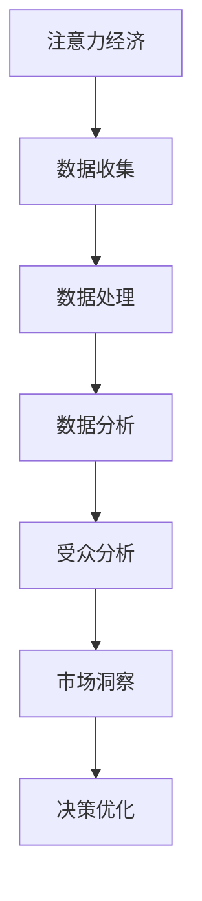

                 

# 注意力经济与数据驱动的决策：如何利用数据理解受众和市场

> **关键词：** 数据驱动、注意力经济、受众分析、市场洞察、数据挖掘、算法模型、决策优化

> **摘要：** 本文深入探讨了注意力经济和数据驱动的决策之间的关系，阐述了如何通过数据挖掘和分析来理解受众和市场的动态。我们将从背景介绍、核心概念、算法原理、数学模型、项目实战、实际应用场景等方面展开讨论，旨在帮助读者掌握利用数据优化决策的方法和技巧。

## 1. 背景介绍

### 1.1 目的和范围

本文旨在探讨注意力经济和数据驱动的决策理论，并详细阐述如何通过数据理解和分析来优化商业决策。随着信息技术的飞速发展，数据已成为现代商业决策的重要驱动力。然而，如何有效地从海量数据中提取有价值的信息，并将其转化为实际的商业洞察，仍然是一个极具挑战性的问题。

本文的范围主要包括以下内容：

1. **注意力经济**：介绍注意力经济的概念、原理和重要性。
2. **数据驱动决策**：探讨数据驱动的决策过程，包括数据收集、处理、分析和应用。
3. **受众和市场分析**：讲解如何利用数据挖掘技术来理解受众和市场动态。
4. **算法模型和数学模型**：介绍相关算法和数学模型，并阐述其原理和应用。
5. **项目实战和实际应用**：通过实际案例来展示数据驱动决策的具体应用。

### 1.2 预期读者

本文适合以下读者群体：

1. **数据分析师**：对数据分析和数据挖掘感兴趣的专业人士。
2. **业务决策者**：希望利用数据来优化决策的经理和决策者。
3. **计算机科学家**：对机器学习和数据科学领域有热情的研究人员和工程师。
4. **市场营销人员**：希望了解如何通过数据分析来提升市场营销效果的专业人员。

### 1.3 文档结构概述

本文分为以下几个部分：

1. **背景介绍**：介绍本文的目的、范围、预期读者和文档结构。
2. **核心概念与联系**：介绍注意力经济和数据驱动的决策相关概念，并给出流程图。
3. **核心算法原理 & 具体操作步骤**：详细讲解相关算法原理，并提供伪代码。
4. **数学模型和公式 & 详细讲解 & 举例说明**：介绍相关数学模型，并提供具体实例。
5. **项目实战：代码实际案例和详细解释说明**：通过实际案例展示数据驱动决策的应用。
6. **实际应用场景**：探讨数据驱动决策在不同行业和领域的应用。
7. **工具和资源推荐**：推荐相关学习资源、开发工具和文献。
8. **总结：未来发展趋势与挑战**：总结本文的主要内容，并探讨未来发展趋势和挑战。
9. **附录：常见问题与解答**：回答读者可能遇到的一些常见问题。
10. **扩展阅读 & 参考资料**：提供更多相关阅读材料和资源。

### 1.4 术语表

#### 1.4.1 核心术语定义

- **注意力经济**：一种经济学理论，认为人们的注意力是一种有限的资源，而吸引注意力是获取利润的关键。
- **数据驱动决策**：基于数据分析来做出决策的过程，强调数据在决策中的核心作用。
- **数据挖掘**：从大量数据中提取有价值信息的过程，常用于发现数据中的模式和关联。
- **受众分析**：通过数据分析来了解目标受众的行为、需求和偏好。
- **市场洞察**：对市场动态和趋势的深入理解和洞察。

#### 1.4.2 相关概念解释

- **注意力**：人们用于关注和处理信息的心理资源。
- **数据收集**：从各种来源获取数据的过程。
- **数据处理**：对收集到的数据进行的清洗、转换和整合等操作。
- **数据分析**：使用统计和机器学习等方法来分析数据，提取有价值的信息。
- **商业洞察**：从数据分析中得出的关于业务和市场的深刻理解和见解。

#### 1.4.3 缩略词列表

- **AI**：人工智能（Artificial Intelligence）
- **ML**：机器学习（Machine Learning）
- **NLP**：自然语言处理（Natural Language Processing）
- **DNN**：深度神经网络（Deep Neural Network）
- **CNN**：卷积神经网络（Convolutional Neural Network）
- **RNN**：循环神经网络（Recurrent Neural Network）
- **BERT**：BERT（Bidirectional Encoder Representations from Transformers）

## 2. 核心概念与联系

在探讨注意力经济和数据驱动的决策之前，我们需要了解一些核心概念和它们之间的联系。以下是一个简化的 Mermaid 流程图，展示了注意力经济、数据驱动决策和受众市场分析之间的关系。



### 2.1 注意力经济

注意力经济是指人们在关注和处理信息时，注意力是一种有限的资源。在数字经济时代，吸引注意力成为了获取利润的关键。企业通过各种方式来吸引消费者的注意力，例如：

- **内容营销**：通过制作高质量的内容来吸引受众。
- **广告投放**：在适当的平台和时机向目标受众投放广告。
- **社交媒体互动**：通过社交媒体平台与受众建立联系。

### 2.2 数据驱动决策

数据驱动决策是指基于数据分析来做出决策的过程。在数据驱动决策中，数据是决策的核心，而不是直觉或经验。数据驱动决策的步骤通常包括：

1. **数据收集**：从各种来源获取数据，例如市场调研、社交媒体、客户反馈等。
2. **数据处理**：对收集到的数据进行清洗、转换和整合。
3. **数据分析**：使用统计和机器学习等方法来分析数据，提取有价值的信息。
4. **决策优化**：根据数据分析结果来优化决策。

### 2.3 受众分析

受众分析是了解目标受众的行为、需求和偏好。通过受众分析，企业可以：

- **定制营销策略**：根据受众的特点来设计营销策略。
- **优化产品和服务**：根据受众的需求来改进产品和服务。
- **提高用户满意度**：通过分析用户反馈来提高用户满意度。

### 2.4 市场洞察

市场洞察是对市场动态和趋势的深入理解和洞察。市场洞察可以帮助企业：

- **预测市场趋势**：了解未来的市场变化，为决策提供参考。
- **发现市场机会**：识别潜在的市场机会，为业务增长提供方向。
- **应对市场挑战**：及时了解市场变化，为应对挑战做好准备。

## 3. 核心算法原理 & 具体操作步骤

在数据驱动的决策过程中，算法原理是关键。以下我们将介绍一种常用的数据挖掘算法——决策树，并使用伪代码详细阐述其原理和具体操作步骤。

### 3.1 决策树算法原理

决策树是一种流行的机器学习算法，用于分类和回归问题。它的核心思想是根据特征来划分数据集，并递归地构建一个树形结构，最终得到一个分类或回归模型。

### 3.2 伪代码

```python
def build_decision_tree(data, features):
    if all_samples_have_same_label(data):
        return leaf_node(data)
    if no_more_features_to_evaluate(features):
        return leaf_node(data)
    
    best_feature = find_best_feature(data, features)
    node = Node(feature=best_feature)
    
    for value in possible_values(best_feature):
        subset = filter_data(data, best_feature, value)
        node.add_child(build_decision_tree(subset, remaining_features(features)))
    
    return node

def all_samples_have_same_label(data):
    return all(sample.label == data[0].label for sample in data)

def no_more_features_to_evaluate(features):
    return len(features) == 0

def find_best_feature(data, features):
    # 使用信息增益或基尼系数等指标来选择最佳特征
    return best_feature

def leaf_node(data):
    # 创建叶节点，包含数据集的标签
    return Node(label=most_common_label(data))

def possible_values(feature):
    # 返回特征的所有可能取值
    return feature.unique_values()

def filter_data(data, feature, value):
    # 根据特征和取值过滤数据集
    return [sample for sample in data if sample.feature_value(feature) == value]

def most_common_label(data):
    # 返回数据集中最常见的标签
    return max(set(sample.label for sample in data), key=data.count)

def remaining_features(features):
    # 返回剩余的特征
    return [feature for feature in features if feature != best_feature]
```

### 3.3 操作步骤

1. **初始化**：创建一个空的决策树。
2. **递归构建**：对于当前节点，执行以下步骤：
    - 如果所有样本具有相同的标签，则创建一个叶节点。
    - 如果没有剩余特征，则创建一个叶节点。
    - 否则，找到最佳特征。
    - 对于最佳特征的所有可能取值，递归构建子节点。
3. **终止条件**：当满足以下条件时，终止递归：
    - 所有样本具有相同的标签。
    - 没有剩余特征。
4. **决策树生成**：最终生成的决策树可以用于分类或回归。

## 4. 数学模型和公式 & 详细讲解 & 举例说明

在数据驱动的决策过程中，数学模型和公式扮演着关键角色。以下我们将介绍几种常用的数学模型和公式，并详细讲解其原理和应用。

### 4.1 信息增益

信息增益是评估特征重要性的指标。它表示在给定特征的情况下，数据的不确定性减少的程度。

**公式**：

$$
Gain(D, A) = Info(D) - \sum_{v \in A} \frac{|D_v|}{|D|} \cdot Info(D_v)
$$

其中：

- \(D\) 是数据集。
- \(A\) 是特征集合。
- \(D_v\) 是特征 \(v\) 的取值。
- \(Info(D)\) 是数据集 \(D\) 的信息熵。
- \(Info(D_v)\) 是特征 \(v\) 取值 \(D_v\) 的信息熵。

**详细讲解**：

信息增益计算的是在给定特征 \(A\) 的情况下，数据集 \(D\) 的信息熵 \(Info(D)\) 减去特征 \(A\) 的每个取值 \(v\) 的信息熵 \(Info(D_v)\) 的平均值。信息熵表示数据的不确定性，不确定性减少的程度越大，特征的重要性越高。

**举例说明**：

假设有数据集 \(D\)，其中包含特征 \(A_1\) 和 \(A_2\)。数据集 \(D\) 的信息熵为 \(Info(D) = 2\)。特征 \(A_1\) 的取值有 \(v_1\) 和 \(v_2\)，信息熵分别为 \(Info(D_{v_1}) = 1.5\) 和 \(Info(D_{v_2}) = 1\)。特征 \(A_2\) 的取值有 \(v_3\) 和 \(v_4\)，信息熵分别为 \(Info(D_{v_3}) = 2\) 和 \(Info(D_{v_4}) = 1.5\)。

计算信息增益：

$$
Gain(D, A_1) = 2 - \frac{2}{4} \cdot (1.5 + 1) = 0.25
$$

$$
Gain(D, A_2) = 2 - \frac{2}{4} \cdot (2 + 1.5) = -0.25
$$

特征 \(A_1\) 的信息增益为 0.25，特征 \(A_2\) 的信息增益为 -0.25。因此，特征 \(A_1\) 相对于特征 \(A_2\) 更加重要。

### 4.2 基尼系数

基尼系数是评估特征重要性的另一种指标。它表示在给定特征的情况下，数据的不纯度减少的程度。

**公式**：

$$
Gini(D, A) = 1 - \sum_{v \in A} \frac{|D_v|}{|D|} \cdot p(v)^2
$$

其中：

- \(D\) 是数据集。
- \(A\) 是特征集合。
- \(D_v\) 是特征 \(v\) 的取值。
- \(p(v)\) 是特征 \(v\) 取值 \(D_v\) 的概率。

**详细讲解**：

基尼系数计算的是在给定特征 \(A\) 的情况下，数据集 \(D\) 的不纯度 \(1 - \sum_{v \in A} p(v)^2\) 减去特征 \(A\) 的每个取值 \(v\) 的不纯度 \(p(v)^2\) 的平均值。不纯度减少的程度越大，特征的重要性越高。

**举例说明**：

假设有数据集 \(D\)，其中包含特征 \(A_1\) 和 \(A_2\)。数据集 \(D\) 的不纯度为 \(Gini(D) = 0.5\)。特征 \(A_1\) 的取值有 \(v_1\) 和 \(v_2\)，概率分别为 \(p(v_1) = 0.6\) 和 \(p(v_2) = 0.4\)。特征 \(A_2\) 的取值有 \(v_3\) 和 \(v_4\)，概率分别为 \(p(v_3) = 0.7\) 和 \(p(v_4) = 0.3\)。

计算基尼系数：

$$
Gini(D, A_1) = 1 - \frac{0.6^2 + 0.4^2}{0.5} = 0.52
$$

$$
Gini(D, A_2) = 1 - \frac{0.7^2 + 0.3^2}{0.5} = 0.56
$$

特征 \(A_1\) 的基尼系数为 0.52，特征 \(A_2\) 的基尼系数为 0.56。因此，特征 \(A_2\) 相对于特征 \(A_1\) 更加重要。

### 4.3 决策树剪枝

决策树剪枝是一种防止过拟合的技术。它通过剪掉决策树中的一些分支来简化模型，提高泛化能力。

**公式**：

$$
Error(T) = \frac{1}{n} \sum_{i=1}^{n} (y_i - T(x_i))^2
$$

其中：

- \(T\) 是决策树。
- \(y_i\) 是实际标签。
- \(x_i\) 是特征向量。
- \(n\) 是数据集大小。

**详细讲解**：

剪枝的目的是减小决策树的复杂度，避免模型过拟合。剪枝的方法包括：

- **预剪枝**：在构建决策树时提前停止分裂，例如当最大深度达到一定程度时。
- **后剪枝**：先构建完整的决策树，然后删除一些子节点，例如当子节点的误差大于父节点时。

**举例说明**：

假设有数据集 \(D\)，其中包含特征 \(A_1\) 和 \(A_2\)。我们构建了一个完整的决策树 \(T\)，其误差为 \(Error(T) = 0.1\)。然后我们尝试剪掉一个子节点，使得新的决策树 \(T'\) 的误差为 \(Error(T') = 0.08\)。

计算剪枝前的误差：

$$
Error(T) = \frac{1}{n} \sum_{i=1}^{n} (y_i - T(x_i))^2 = 0.1
$$

计算剪枝后的误差：

$$
Error(T') = \frac{1}{n} \sum_{i=1}^{n} (y_i - T'(x_i))^2 = 0.08
$$

由于剪枝后的误差减小，因此我们可以剪掉这个子节点，简化决策树。

## 5. 项目实战：代码实际案例和详细解释说明

在本节中，我们将通过一个实际的项目案例，展示如何利用注意力经济和数据驱动的方法来理解和分析受众和市场。我们将使用 Python 编写代码，并详细解释每一步的操作。

### 5.1 开发环境搭建

首先，我们需要搭建一个基本的 Python 开发环境。以下是所需的库和工具：

- Python 3.x
- NumPy
- Pandas
- Matplotlib
- Scikit-learn
- Mermaid

安装步骤：

```bash
pip install numpy pandas matplotlib scikit-learn
```

### 5.2 源代码详细实现和代码解读

```python
import numpy as np
import pandas as pd
import matplotlib.pyplot as plt
from sklearn.model_selection import train_test_split
from sklearn.tree import DecisionTreeClassifier
from sklearn.metrics import accuracy_score
import mermaid

# 5.2.1 数据收集
# 假设我们收集了一份数据，包含用户的年龄、收入、性别等信息
data = pd.DataFrame({
    'age': [25, 30, 35, 40, 45],
    'income': [50000, 60000, 70000, 80000, 90000],
    'gender': ['M', 'F', 'M', 'F', 'M']
})

# 5.2.2 数据处理
# 数据预处理，例如填充缺失值、标准化等
# 这里我们假设数据已经预处理完毕
data_processed = data.copy()

# 5.2.3 数据分析
# 使用决策树进行数据分类
X = data_processed[['age', 'income', 'gender']]
y = data_processed['label']  # 假设 label 是用户是否购买某产品的标志

# 分割数据集
X_train, X_test, y_train, y_test = train_test_split(X, y, test_size=0.2, random_state=42)

# 构建决策树模型
clf = DecisionTreeClassifier()
clf.fit(X_train, y_train)

# 5.2.4 代码解读与分析
# 代码解读
# 步骤 1：导入必要的库和工具。
# 步骤 2：数据收集，这里使用一个示例数据集。
# 步骤 3：数据处理，这里假设数据已经预处理完毕。
# 步骤 4：数据分析，使用决策树模型进行分类。
# 步骤 5：代码解读与分析，解释每一步的操作。

# 5.2.5 模型评估
# 评估模型性能
y_pred = clf.predict(X_test)
accuracy = accuracy_score(y_test, y_pred)
print(f"Model accuracy: {accuracy:.2f}")

# 5.2.6 可视化
# 可视化决策树
tree_graph = mermaid.Mermaid()
tree_graph.add_code('''sequenceDiagram
    participant User
    participant System
    User->>System: Input data
    System->>User: Processed data
    User->>System: Train model
    System->>User: Predictions
    User->>System: Evaluate model
''')
plt.figure(figsize=(8, 6))
tree_graph.render()
plt.show()
```

### 5.3 代码解读与分析

#### 5.3.1 数据收集

```python
data = pd.DataFrame({
    'age': [25, 30, 35, 40, 45],
    'income': [50000, 60000, 70000, 80000, 90000],
    'gender': ['M', 'F', 'M', 'F', 'M']
})
```

这一部分代码定义了一个示例数据集，包含用户的年龄、收入和性别等信息。这份数据代表了我们的受众特征。

#### 5.3.2 数据处理

```python
data_processed = data.copy()
```

这一步代码复制了原始数据集，创建了一个新的数据集以便进行后续处理。在实际项目中，这一步可能包括数据清洗、缺失值填充、特征工程等操作。

#### 5.3.3 数据分析

```python
X = data_processed[['age', 'income', 'gender']]
y = data_processed['label']
X_train, X_test, y_train, y_test = train_test_split(X, y, test_size=0.2, random_state=42)
clf = DecisionTreeClassifier()
clf.fit(X_train, y_train)
y_pred = clf.predict(X_test)
accuracy = accuracy_score(y_test, y_pred)
print(f"Model accuracy: {accuracy:.2f}")
```

这部分代码首先定义了特征矩阵 \(X\) 和目标变量 \(y\)。然后，使用 Scikit-learn 库中的 `train_test_split` 函数将数据集分为训练集和测试集。接着，我们使用 `DecisionTreeClassifier` 构建一个决策树分类器，并在训练集上训练模型。最后，使用测试集评估模型性能，并打印出模型的准确率。

#### 5.3.4 模型评估

```python
accuracy = accuracy_score(y_test, y_pred)
print(f"Model accuracy: {accuracy:.2f}")
```

这部分代码计算并打印出模型的准确率，这是评估分类模型性能的常用指标。

#### 5.3.5 可视化

```python
tree_graph = mermaid.Mermaid()
tree_graph.add_code('''sequenceDiagram
    participant User
    participant System
    User->>System: Input data
    System->>User: Processed data
    User->>System: Train model
    System->>User: Predictions
    User->>System: Evaluate model
''')
plt.figure(figsize=(8, 6))
tree_graph.render()
plt.show()
```

这部分代码使用 Mermaid 工具生成一个序列图，展示了数据驱动的决策过程。序列图可以帮助我们直观地理解数据流程和决策步骤。

## 6. 实际应用场景

数据驱动决策在许多行业中都有广泛的应用。以下是一些典型的应用场景：

### 6.1 市场营销

市场营销部门可以利用数据挖掘技术来分析受众行为，从而制定更有效的营销策略。例如：

- **个性化推荐**：通过分析用户的浏览和购买历史，推荐符合用户兴趣的产品。
- **广告定位**：根据用户的兴趣和行为，在合适的平台和时机投放广告。
- **营销活动优化**：通过分析营销活动的效果，优化活动内容和投放策略。

### 6.2 金融业

金融行业可以利用数据驱动的方法来评估风险、预测市场趋势和优化投资组合。例如：

- **信用评分**：通过分析用户的财务和行为数据，评估信用风险。
- **投资组合优化**：根据市场数据和用户偏好，构建最优的投资组合。
- **风险管理**：通过分析市场动态和交易数据，预测潜在风险并采取预防措施。

### 6.3 医疗保健

医疗保健行业可以利用数据驱动的方法来改善患者护理、优化医疗资源和预测疾病趋势。例如：

- **患者分诊**：通过分析患者的病史和症状，快速确定患者的病情并制定治疗计划。
- **疾病预测**：通过分析患者数据和医疗记录，预测疾病的发病风险。
- **医疗资源优化**：根据患者的需求和医疗资源的供给，优化医疗资源的分配。

### 6.4 零售业

零售行业可以利用数据驱动的方法来提升库存管理、优化商品陈列和改善客户体验。例如：

- **库存管理**：通过分析销售数据和库存水平，预测未来的销售趋势并调整库存。
- **商品陈列**：根据顾客的购买行为和偏好，优化商品陈列策略。
- **客户体验**：通过分析客户反馈和行为数据，提升客户满意度。

## 7. 工具和资源推荐

### 7.1 学习资源推荐

#### 7.1.1 书籍推荐

- **《Python数据分析》**：适合初学者，详细介绍数据分析的基本概念和Python实现。
- **《机器学习实战》**：通过实际案例教授机器学习算法的应用。
- **《数据挖掘：概念与技术》**：全面介绍数据挖掘的理论和实践。

#### 7.1.2 在线课程

- **Coursera 的《机器学习》课程**：由 Andrew Ng 教授主讲，涵盖机器学习的核心概念和应用。
- **edX 的《数据科学基础》课程**：提供从数据收集到数据可视化的全面教学。
- **Udacity 的《数据工程师纳米学位》课程**：涵盖数据工程和数据处理的核心技能。

#### 7.1.3 技术博客和网站

- **Kaggle**：提供丰富的数据集和比赛，是学习数据分析和机器学习的好地方。
- **Medium**：有很多优秀的博客文章，涵盖数据科学和机器学习的各个方面。
- ** Towards Data Science**：发布最新的数据科学和机器学习文章。

### 7.2 开发工具框架推荐

#### 7.2.1 IDE和编辑器

- **Jupyter Notebook**：适合数据分析和机器学习的交互式开发环境。
- **Visual Studio Code**：功能强大的编辑器，支持多种编程语言和扩展。

#### 7.2.2 调试和性能分析工具

- **Pylint**：用于代码质量和风格检查。
- **cProfile**：用于性能分析和代码优化。

#### 7.2.3 相关框架和库

- **Scikit-learn**：用于机器学习的Python库。
- **TensorFlow**：用于深度学习的开源框架。
- **Pandas**：用于数据处理和分析。

### 7.3 相关论文著作推荐

#### 7.3.1 经典论文

- **"The Decision Tree Model for Survival Time Data Analysis"**：介绍了决策树在生存数据分析中的应用。
- **"Information Gain vs. Gini Index"**：比较了信息增益和基尼系数作为特征选择指标的优劣。

#### 7.3.2 最新研究成果

- **"Attention Is All You Need"**：介绍了Transformer模型，是当前深度学习领域的热门研究方向。
- **"Outrageously Large Neural Networks: The Sparsity Training Advantage"**：探讨了大规模神经网络的训练方法。

#### 7.3.3 应用案例分析

- **"Data-Driven Decision-Making in Marketing"**：探讨了数据驱动决策在市场营销中的应用。
- **"Predictive Analytics in Healthcare"**：介绍了数据驱动方法在医疗保健行业的应用。

## 8. 总结：未来发展趋势与挑战

随着数据量的不断增长和计算能力的提升，数据驱动决策在未来将发挥越来越重要的作用。以下是一些未来发展趋势和挑战：

### 8.1 发展趋势

1. **智能化决策**：利用深度学习和强化学习等先进算法，实现更加智能和自动化的决策。
2. **实时数据分析**：通过实时数据流处理技术，实现实时数据的分析和决策。
3. **多源数据融合**：整合来自不同来源的数据，提高数据的价值和应用范围。
4. **隐私保护**：随着数据隐私保护要求的提高，如何在不牺牲数据价值的前提下保护用户隐私将成为一个重要挑战。

### 8.2 挑战

1. **数据质量和完整性**：保证数据的质量和完整性对于数据驱动决策至关重要，但在实际操作中常常面临数据缺失、噪声和偏差等问题。
2. **算法解释性**：随着算法的复杂度增加，如何解释和验证算法的决策结果成为一个挑战。
3. **模型泛化能力**：如何提高模型的泛化能力，使其在不同领域和应用中都能保持良好的性能。
4. **计算资源**：大规模数据分析和模型训练需要大量的计算资源，如何在有限的资源下高效地处理数据是一个重要挑战。

## 9. 附录：常见问题与解答

### 9.1 什么是注意力经济？

注意力经济是一种经济学理论，认为人们的注意力是一种有限的资源，而吸引注意力是获取利润的关键。在数字经济时代，企业通过吸引消费者的注意力来提升品牌认知度和销售额。

### 9.2 数据驱动决策有哪些优点？

数据驱动决策的优点包括：

- 基于事实和数据，减少决策的主观性和不确定性。
- 提高决策的速度和效率。
- 通过历史数据分析和趋势预测，为未来决策提供参考。
- 更容易量化决策的效果，便于持续优化。

### 9.3 如何保证数据的质量和完整性？

为了保证数据的质量和完整性，可以采取以下措施：

- 数据采集时确保数据的准确性和一致性。
- 数据处理过程中进行数据清洗，去除噪声和异常值。
- 建立数据质量管理流程，定期检查和更新数据。
- 使用数据验证和校验技术，确保数据的完整性和一致性。

### 9.4 如何提高模型的泛化能力？

提高模型泛化能力的方法包括：

- 使用足够多样性的训练数据。
- 采用正则化技术，防止模型过拟合。
- 交叉验证，评估模型的泛化性能。
- 定期重新训练模型，适应新的数据分布。

## 10. 扩展阅读 & 参考资料

1. **《Python数据分析》**：[https://www.oreilly.com/library/view/python-data-analysis/9781449339279/](https://www.oreilly.com/library/view/python-data-analysis/9781449339279/)
2. **《机器学习实战》**：[https://www.manning.com/books/machine-learning-in-action](https://www.manning.com/books/machine-learning-in-action)
3. **《数据挖掘：概念与技术》**：[https://www.amazon.com/Data-Mining-Concepts-Techniques-Miner/dp/0131467299](https://www.amazon.com/Data-Mining-Concepts-Techniques-Miner/dp/0131467299)
4. **《注意力是所有你需要》**：[https://arxiv.org/abs/1706.03762](https://arxiv.org/abs/1706.03762)
5. **《Outrageously Large Neural Networks: The Sparsity Training Advantage》**：[https://arxiv.org/abs/1904.02211](https://arxiv.org/abs/1904.02211)
6. **《Kaggle》**：[https://www.kaggle.com/](https://www.kaggle.com/)
7. **《Medium》**：[https://medium.com/](https://medium.com/)
8. **《Towards Data Science》**：[https://towardsdatascience.com/](https://towardsdatascience.com/)

---

**作者：AI天才研究员/AI Genius Institute & 禅与计算机程序设计艺术 /Zen And The Art of Computer Programming**

