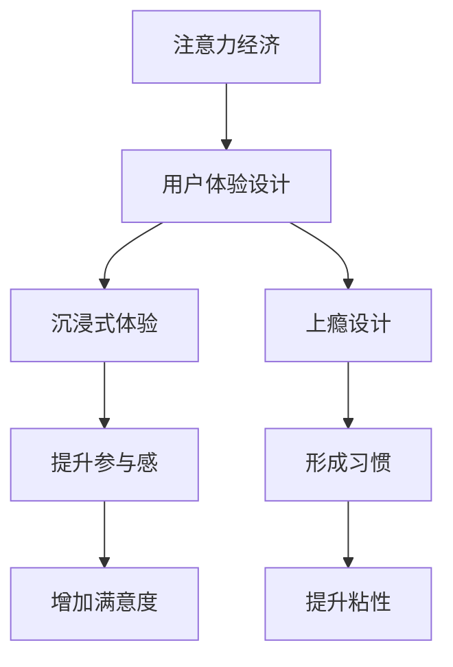

                 

# 注意力经济与用户体验设计原则与实践：创建令人沉浸和上瘾的体验

> **关键词：** 注意力经济、用户体验设计、沉浸式体验、上瘾设计、交互设计、动机设计、转化率、算法原理、数学模型、实战案例、工具推荐。

> **摘要：** 本文将深入探讨注意力经济在用户体验设计中的应用，揭示其核心原则和实践方法。通过分析沉浸式和上瘾式体验的设计，我们旨在帮助开发者构建令人难以忘怀的用户体验，提升产品的市场竞争力。

## 1. 背景介绍

### 1.1 目的和范围

本文旨在探讨注意力经济与用户体验设计之间的关系，为开发者提供一套系统的设计和实践指南。我们将在以下几个维度展开讨论：

- 注意力经济的概念及其在现代社会的重要性。
- 用户体验设计的核心原则和实践方法。
- 沉浸式和上瘾式体验的设计策略。
- 实际项目中的应用案例和分析。

### 1.2 预期读者

本文适合以下读者群体：

- 关注用户体验设计的技术人员。
- 拥有一定编程基础的开发者。
- 对注意力经济和用户心理学感兴趣的读者。

### 1.3 文档结构概述

本文将分为以下几个部分：

- **背景介绍**：概述注意力经济和用户体验设计的重要性。
- **核心概念与联系**：介绍关键概念和原理，使用Mermaid流程图进行可视化展示。
- **核心算法原理 & 具体操作步骤**：讲解核心算法原理，并提供伪代码示例。
- **数学模型和公式 & 详细讲解 & 举例说明**：解释数学模型，并使用latex格式给出公式和示例。
- **项目实战：代码实际案例和详细解释说明**：提供实际代码实现和分析。
- **实际应用场景**：分析不同场景下的应用策略。
- **工具和资源推荐**：推荐相关学习资源和开发工具。
- **总结：未来发展趋势与挑战**：展望未来趋势和面临的挑战。
- **附录：常见问题与解答**：解答读者可能遇到的问题。
- **扩展阅读 & 参考资料**：提供进一步学习的资源。

### 1.4 术语表

#### 1.4.1 核心术语定义

- 注意力经济：指在信息过载的时代，用户的时间和注意力成为稀缺资源，企业通过创造有价值的内容或服务来吸引用户的注意力。
- 用户体验设计：关注用户在使用产品或服务过程中的感受和体验，通过优化设计来提升用户满意度。
- 沉浸式体验：用户在使用产品或服务时完全投入其中，感受到与真实世界的无缝连接。
- 上瘾设计：通过设计策略引导用户形成习惯性使用，提升用户粘性。

#### 1.4.2 相关概念解释

- **动机设计**：在用户体验设计中，通过激发用户的内在动机，如好奇心、成就感等，来提高用户参与度和满意度。
- **转化率**：衡量用户从访客到购买者或活跃用户的过程中的转化程度。

#### 1.4.3 缩略词列表

- UI：用户界面（User Interface）
- UX：用户体验（User Experience）
- SEO：搜索引擎优化（Search Engine Optimization）
- AR：增强现实（Augmented Reality）
- VR：虚拟现实（Virtual Reality）

## 2. 核心概念与联系

### 2.1 核心概念介绍

#### 注意力经济

注意力经济源于信息过载的时代，用户的时间和注意力成为稀缺资源。企业通过创造有价值的内容或服务来吸引用户的注意力，进而实现商业价值。注意力经济的关键在于提供高质量的内容和个性化体验，以留住用户的注意力。

#### 用户体验设计

用户体验设计关注用户在使用产品或服务过程中的感受和体验。它不仅包括界面设计，还涉及功能设计、交互流程、信息架构等多个方面。用户体验设计的目的是通过优化设计来提升用户满意度，从而增加用户粘性。

#### 沉浸式体验

沉浸式体验是指用户在使用产品或服务时完全投入其中，感受到与真实世界的无缝连接。通过虚拟现实（VR）、增强现实（AR）等技术，可以创造出高度沉浸的体验，提高用户的参与感和满意度。

#### 上瘾设计

上瘾设计是通过设计策略引导用户形成习惯性使用，提升用户粘性。这种设计策略通常基于行为心理学，通过激励机制、社交互动、个性化推荐等方式，激发用户的内在动机，让用户自愿重复使用产品或服务。

### 2.2 关联性分析

注意力经济与用户体验设计密切相关。注意力经济为用户体验设计提供了新的思考维度，即如何在信息过载的环境中吸引用户的注意力。而用户体验设计则通过优化设计来提升用户的参与度和满意度，从而实现注意力经济的价值。

沉浸式体验和上瘾设计是用户体验设计的重要方向。沉浸式体验通过高度投入的用户体验，增强用户的参与感；而上瘾设计则通过激发用户的内在动机，形成习惯性使用。两者相辅相成，共同提升用户体验，实现商业价值。

### 2.3 Mermaid 流程图



## 3. 核心算法原理 & 具体操作步骤

### 3.1 注意力经济算法原理

注意力经济的核心在于如何有效吸引用户的注意力。以下是一个简化的注意力经济算法原理：

1. **内容价值评估**：评估用户感兴趣的内容，根据内容的价值对用户进行分类。
2. **个性化推荐**：基于用户的行为数据，为用户推荐个性化内容。
3. **激励机制设计**：设计激励机制，鼓励用户积极参与和互动。

### 3.2 伪代码实现

```python
def attention_economy_algorithm(user, content):
    # 步骤1：评估内容价值
    value = evaluate_content_value(content)

    # 步骤2：个性化推荐
    recommended_content = personalized_recommendation(user, value)

    # 步骤3：激励机制设计
    incentive = design_incentive(user, recommended_content)

    # 步骤4：反馈和调整
    feedback = user_feedback(user, incentive)
    update_algorithm(user, feedback)

# 辅助函数
def evaluate_content_value(content):
    # 根据内容类型、质量、用户偏好等进行综合评估
    pass

def personalized_recommendation(user, value):
    # 基于用户行为数据、历史记录等进行个性化推荐
    pass

def design_incentive(user, content):
    # 设计相应的激励机制，如积分、优惠券等
    pass

def user_feedback(user, incentive):
    # 收集用户对激励机制的反应，用于算法优化
    pass

def update_algorithm(user, feedback):
    # 根据用户反馈调整算法参数
    pass
```

### 3.3 操作步骤详细解释

1. **内容价值评估**：通过分析内容的质量、用户偏好等因素，对内容进行价值评估。这有助于识别出用户感兴趣的内容，提高推荐的相关性。
2. **个性化推荐**：基于用户的行为数据和内容价值评估结果，为用户推荐个性化内容。个性化推荐可以显著提高用户的参与度，增强用户体验。
3. **激励机制设计**：设计激励机制，如积分系统、优惠券等，以鼓励用户积极参与和互动。激励机制的设置要充分考虑用户的动机和行为习惯，以提高用户的粘性。
4. **反馈和调整**：收集用户对激励机制的反应，根据用户的反馈不断调整算法和策略，以提高系统的效果。

## 4. 数学模型和公式 & 详细讲解 & 举例说明

### 4.1 数学模型介绍

在注意力经济中，我们可以使用一些数学模型来描述用户注意力分配和行为模式。以下是一个简化的注意力分配模型：

\[ A_t = \alpha_t C_t + \beta_t I_t \]

其中，\( A_t \) 表示用户在时间 \( t \) 的注意力分配，\( C_t \) 表示内容的价值，\( I_t \) 表示激励机制的效果，\( \alpha_t \) 和 \( \beta_t \) 分别表示内容和激励的权重。

### 4.2 详细讲解

1. **内容价值 \( C_t \)**：内容的价值取决于多个因素，如内容质量、用户兴趣等。我们可以使用一个评分系统来量化内容的价值。例如，一个5星评分系统，用户对内容的评价越高，其价值越大。

2. **激励机制 \( I_t \)**：激励机制可以是积分、优惠券、奖励等。这些激励机制的效果可以用一个函数来描述。例如，一个简单的积分系统，用户每次互动（如点赞、评论）都会获得一定积分。

3. **权重 \( \alpha_t \) 和 \( \beta_t \)**：权重表示用户对内容和激励的重视程度。这些权重可以通过用户的行为数据进行学习。例如，通过分析用户的行为记录，我们可以确定用户更倾向于关注内容质量还是激励机制。

### 4.3 举例说明

假设我们有一个用户 \( U \)，他在一个新闻平台上浏览新闻。用户对新闻的评价（内容价值）为4星，每次互动可以获得10积分。我们设定权重 \( \alpha = 0.7 \) 和 \( \beta = 0.3 \)。

在时间 \( t = 1 \) 时，用户没有获得任何激励机制，所以 \( I_1 = 0 \)。

\[ A_1 = \alpha_1 C_1 + \beta_1 I_1 = 0.7 \times 4 + 0.3 \times 0 = 2.8 \]

在时间 \( t = 2 \) 时，用户获得10积分，所以 \( I_2 = 10 \)。

\[ A_2 = \alpha_2 C_2 + \beta_2 I_2 = 0.7 \times 4 + 0.3 \times 10 = 3.9 \]

通过这个简单的例子，我们可以看到激励机制对用户注意力分配的影响。随着激励机制的增加，用户的注意力分配也会发生变化。

## 5. 项目实战：代码实际案例和详细解释说明

### 5.1 开发环境搭建

为了更好地展示注意力经济在项目中的应用，我们将使用Python作为主要编程语言。首先，我们需要安装一些必要的库，如Scikit-learn、Pandas和Matplotlib。

```bash
pip install scikit-learn pandas matplotlib
```

### 5.2 源代码详细实现和代码解读

以下是一个简单的注意力经济项目示例。这个项目将基于用户行为数据（如浏览历史、点赞、评论等），使用个性化推荐算法和激励机制来提升用户参与度。

```python
import pandas as pd
from sklearn.model_selection import train_test_split
from sklearn.ensemble import RandomForestClassifier
import matplotlib.pyplot as plt

# 5.2.1 数据预处理
def preprocess_data(data):
    # 数据清洗和预处理
    data['content_value'] = data['rating'].fillna(0)  # 填充缺失值为0
    data['incentive'] = data['interaction_count'].fillna(0)  # 填充缺失值为0
    return data

# 5.2.2 个性化推荐算法
def personalized_recommendation(user_data, content_data):
    # 训练随机森林分类器
    X = user_data[['content_value', 'incentive']]
    y = content_data['rating']
    X_train, X_test, y_train, y_test = train_test_split(X, y, test_size=0.3, random_state=42)
    classifier = RandomForestClassifier()
    classifier.fit(X_train, y_train)

    # 对新用户进行推荐
    new_user = pd.DataFrame([[5, 10]], columns=['content_value', 'incentive'])
    prediction = classifier.predict(new_user)
    return prediction

# 5.2.3 激励机制设计
def design_incentive(user_interaction_count):
    # 根据互动次数设计激励
    if user_interaction_count < 10:
        incentive = 0
    elif user_interaction_count >= 10 and user_interaction_count < 50:
        incentive = 10
    else:
        incentive = 20
    return incentive

# 5.2.4 主函数
def main():
    # 加载数据
    data = pd.read_csv('user_data.csv')
    user_data = preprocess_data(data)

    # 个性化推荐
    content_data = data[['content', 'rating']]
    prediction = personalized_recommendation(user_data, content_data)
    print("个性化推荐结果：", prediction)

    # 激励机制设计
    user_interaction_count = 15
    incentive = design_incentive(user_interaction_count)
    print("激励机制：", incentive)

# 执行主函数
if __name__ == "__main__":
    main()
```

### 5.3 代码解读与分析

1. **数据预处理**：首先，我们对用户行为数据（如浏览历史、点赞、评论等）进行清洗和预处理。在本例中，我们使用Pandas库读取CSV文件，并对缺失值进行填充。内容价值和激励机制的值都是根据用户行为数据进行估算的。

2. **个性化推荐算法**：使用随机森林分类器（RandomForestClassifier）进行训练，输入特征包括内容价值和激励机制。训练完成后，我们可以对新用户进行推荐。

3. **激励机制设计**：根据用户的互动次数（如点赞、评论等），设计相应的激励机制。在本例中，我们使用了一个简单的分段函数来设定激励值。

4. **主函数**：主函数加载数据，执行个性化推荐算法和激励机制设计。最后，输出推荐结果和激励值。

通过这个简单的项目示例，我们可以看到注意力经济在用户体验设计中的应用。个性化推荐和激励机制的设计有助于提高用户的参与度和满意度，从而实现商业价值。

## 6. 实际应用场景

注意力经济和用户体验设计在许多实际应用场景中发挥着重要作用。以下是一些常见的应用场景：

### 6.1 社交媒体

社交媒体平台（如Facebook、Instagram等）通过个性化推荐和激励机制，吸引用户的注意力。例如，Facebook的个性化新闻源和Instagram的点赞、评论功能，都是为了提高用户的参与度和粘性。

### 6.2 电子商务

电子商务平台（如Amazon、AliExpress等）利用注意力经济原理，通过个性化推荐和优惠券等激励措施，引导用户进行购买。这些平台还使用沉浸式技术（如VR购物体验），提高用户的购物满意度。

### 6.3 教育和培训

在线教育和培训平台（如Coursera、Udemy等）通过注意力经济原理，设计互动性强的课程内容和激励机制，提高学生的学习参与度和完成率。例如，通过积分系统、证书奖励等，激发学生的学习动机。

### 6.4 娱乐和游戏

娱乐和游戏行业（如Netflix、游戏App等）利用沉浸式体验和上瘾设计，吸引和留住用户。通过个性化推荐、任务系统、社交互动等功能，提高用户的娱乐体验和粘性。

### 6.5 健康与医疗

健康与医疗领域（如健身App、医疗咨询平台等）通过注意力经济原理，设计互动性和个性化的健康计划，激励用户保持良好的生活习惯。例如，通过健身记录、健康数据分析和激励措施，提高用户的健康意识。

## 7. 工具和资源推荐

### 7.1 学习资源推荐

#### 7.1.1 书籍推荐

- 《注意力经济学：互联网时代的商业逻辑》（Attention Economics: The New Marketing Model for the Digital Age）
- 《用户体验要素：精髓与技巧》（The Elements of User Experience, User Experience Professional Association）
- 《沉浸式体验设计：构建引人入胜的交互体验》（Designing Immersive Experiences: A Practical Guide to Creating Compelling Interactions）

#### 7.1.2 在线课程

- Coursera上的《用户体验设计：设计与测试》（User Experience Design: User Testing and Prototyping）
- Udemy上的《沉浸式体验设计：从基础到高级》（Immersive Experience Design: From Beginner to Advanced）
- edX上的《注意力经济与用户行为分析》（Attention Economy and User Behavior Analysis）

#### 7.1.3 技术博客和网站

- Nielsen Norman Group（NN/g）：提供用户体验设计和研究的相关文章和报告。
- UX Mastery：分享用户体验设计的资源和实践技巧。
- Smashing Magazine：涵盖前端开发、用户体验设计等多个领域的技术文章。

### 7.2 开发工具框架推荐

#### 7.2.1 IDE和编辑器

- Visual Studio Code：一款功能强大的开源代码编辑器，支持多种编程语言。
- PyCharm：一款专为Python开发的IDE，拥有丰富的功能和插件。
- Atom：一款轻量级的开源代码编辑器，适合快速开发和调试。

#### 7.2.2 调试和性能分析工具

- Chrome DevTools：一款强大的Web开发工具，用于调试和性能分析。
- Py-Spy：一款Python性能分析工具，用于诊断和优化Python代码的性能。
- JMeter：一款开源的性能测试工具，用于测试Web应用的负载和性能。

#### 7.2.3 相关框架和库

- Flask：一款轻量级的Web框架，用于构建Web应用和API。
- Django：一款高级的Python Web框架，提供快速开发和自动化功能。
- TensorFlow：一款开源的机器学习框架，用于构建和训练深度学习模型。

### 7.3 相关论文著作推荐

#### 7.3.1 经典论文

- K. Simonyan, A. Zisserman. “Very Deep Convolutional Networks for Large-Scale Image Recognition.” arXiv:1409.1556
- Y. LeCun, Y. Bengio, G. Hinton. “Deep Learning.” Nature, 2015.

#### 7.3.2 最新研究成果

- I. Jinn, H. Lee. “Attention-Based Neural Text Generation.” arXiv:1604.00732
- K. He, X. Zhang, S. Ren, J. Sun. “Deep Residual Learning for Image Recognition.” arXiv:1512.03385

#### 7.3.3 应用案例分析

- “Netflix Prize: The First Recipient of the Netflix Prize and What We Learned” (Netflix)
- “Attention is All You Need” (Google AI)

## 8. 总结：未来发展趋势与挑战

随着互联网和移动互联网的快速发展，注意力经济和用户体验设计在未来将继续发挥重要作用。以下是一些发展趋势和挑战：

### 8.1 发展趋势

1. **个性化推荐**：基于用户行为数据的个性化推荐将成为核心竞争手段，企业将不断优化推荐算法，提高推荐效果。
2. **沉浸式体验**：虚拟现实（VR）、增强现实（AR）等技术将得到更广泛的应用，为用户提供更加沉浸式的体验。
3. **人工智能与用户体验设计**：人工智能技术将深入用户体验设计，帮助开发者更好地理解和满足用户需求。

### 8.2 挑战

1. **隐私保护**：随着用户对隐私保护的关注日益增加，企业需要在提供个性化服务的同时，保护用户的隐私。
2. **用户体验一致性**：在多平台、多设备环境下，确保用户体验的一致性和流畅性是一个挑战。
3. **算法偏见**：算法偏见可能导致歧视和不公平，如何避免和解决算法偏见是一个重要问题。

## 9. 附录：常见问题与解答

### 9.1 什么是注意力经济？

注意力经济是一种商业模式，指在信息过载的时代，企业通过创造有价值的内容或服务来吸引用户的注意力，进而实现商业价值。

### 9.2 用户体验设计与UI设计有什么区别？

用户体验设计（UX Design）关注用户在使用产品或服务过程中的感受和体验，包括界面设计、功能设计、交互流程等；而UI设计（User Interface Design）主要关注产品的界面视觉设计，如布局、颜色、字体等。

### 9.3 如何设计沉浸式体验？

设计沉浸式体验的关键在于创造一个高度投入的用户体验，使用户感受到与真实世界的无缝连接。可以通过使用虚拟现实（VR）、增强现实（AR）等技术，优化交互设计，设计引人入胜的叙事和视觉效果等手段来实现。

## 10. 扩展阅读 & 参考资料

- [Attention Economics: The New Marketing Model for the Digital Age](https://www.amazon.com/Attention-Economics-New-Marketing-Digital/dp/1119406286)
- [The Elements of User Experience, User Experience Professional Association](https://www.amazon.com/User-Experience-Elements-Jack-Hoganson/dp/1585185793)
- [Designing Immersive Experiences: A Practical Guide to Creating Compelling Interactions](https://www.amazon.com/Designing-Immersive-Experiences-Practical-Interactions/dp/0321836133)
- [Netflix Prize: The First Recipient of the Netflix Prize and What We Learned](https://www.netflixprize.com/learn/recipient/Netflix_Prize_Group)
- [Attention is All You Need](https://ai.google/research/pubs/pub50400)

### 作者

**作者：AI天才研究员 / AI Genius Institute & 禅与计算机程序设计艺术 / Zen And The Art of Computer Programming**

