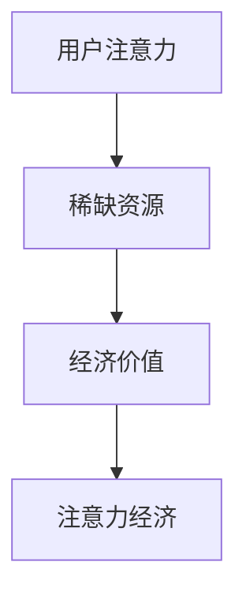
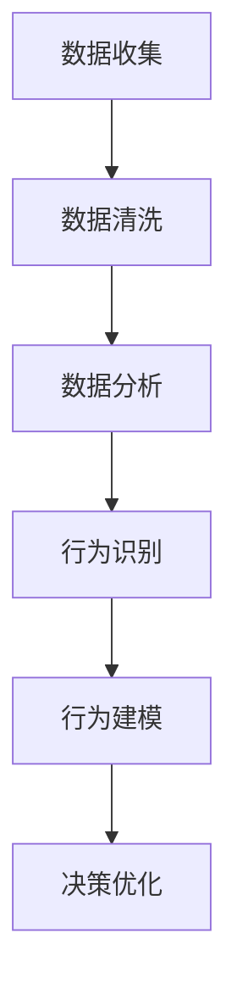

                 


## 注意力经济与用户行为分析：了解受众行为以增强参与度

> 关键词：注意力经济、用户行为分析、参与度、增强体验

> 摘要：在当今数字化时代，用户注意力成为了一种宝贵的资源。本文将探讨注意力经济的基本原理，分析用户行为的核心要素，并介绍如何通过用户行为分析来提高在线平台的参与度。我们将通过具体的算法原理、数学模型以及实战案例，深入探讨这一领域的深度和广度。

### 1. 背景介绍

#### 1.1 目的和范围

本文旨在为IT领域的技术专家和从业者提供一份系统性的指南，帮助他们在设计和优化在线平台时，更好地理解和利用用户注意力资源，从而提升用户的参与度和满意度。我们将从注意力经济的基本概念出发，逐步深入到用户行为分析的理论和实践中，最后通过具体案例来展示如何将理论应用到实际场景中。

#### 1.2 预期读者

本文适合以下读者群体：

- 在线平台开发者
- 数据科学家
- 数字营销专家
- 产品经理
- 对用户行为分析感兴趣的技术爱好者

#### 1.3 文档结构概述

本文的结构安排如下：

- 第1部分：背景介绍，包括目的、预期读者和文档结构概述。
- 第2部分：核心概念与联系，介绍注意力经济和用户行为分析的基本原理。
- 第3部分：核心算法原理 & 具体操作步骤，详细阐述用户行为分析的算法实现。
- 第4部分：数学模型和公式 & 详细讲解 & 举例说明，通过数学模型来解释用户行为规律。
- 第5部分：项目实战：代码实际案例和详细解释说明，展示具体的实现过程。
- 第6部分：实际应用场景，分析用户行为分析在不同领域的应用。
- 第7部分：工具和资源推荐，提供相关学习资源和开发工具。
- 第8部分：总结：未来发展趋势与挑战，展望用户行为分析的未来。
- 第9部分：附录：常见问题与解答，为读者解答常见疑惑。
- 第10部分：扩展阅读 & 参考资料，提供进一步的深度阅读建议。

#### 1.4 术语表

在本文中，我们将使用一些专业术语。以下是对这些术语的定义和解释：

#### 1.4.1 核心术语定义

- 注意力经济：指在信息过载的环境中，用户注意力的稀缺性和经济价值。
- 用户行为分析：指通过收集和分析用户数据，理解用户的行为模式，从而优化用户体验和参与度。
- 参与度：指用户对在线平台的互动程度和投入度。
- 用户体验（UX）：指用户在使用产品或服务时所产生的整体感受和体验。

#### 1.4.2 相关概念解释

- 数据驱动决策：指通过数据分析来指导决策，而不是依靠直觉或主观判断。
- 机器学习：一种人工智能技术，通过算法从数据中学习规律，并作出预测或决策。
- 实时分析：指在数据生成的同时或非常接近实时的时间内进行分析。

#### 1.4.3 缩略词列表

- UX：用户体验
- SEO：搜索引擎优化
- CTR：点击率
- ROI：投资回报率
- SEM：搜索引擎营销
- SaaS：软件即服务

### 2. 核心概念与联系

#### 2.1 注意力经济原理

注意力经济是一种基于用户注意力的经济模式。在数字时代，用户的注意力成为了一种稀缺资源，因为信息过载使得用户难以处理大量的信息。因此，任何能够有效吸引和保持用户注意力的产品或服务都具有经济价值。

**Mermaid 流程图：**



#### 2.2 用户行为分析原理

用户行为分析是指通过收集和分析用户数据，理解用户的行为模式，从而优化用户体验和参与度。以下是用户行为分析的基本流程：

**Mermaid 流程图：**



### 3. 核心算法原理 & 具体操作步骤

用户行为分析的核心在于构建一个能够准确预测用户行为的模型。以下是一个简化的用户行为分析算法原理和具体操作步骤：

**算法原理：**

1. **数据收集**：收集用户的浏览历史、点击行为、搜索关键词等数据。
2. **特征提取**：将原始数据转化为算法可处理的特征向量。
3. **模型训练**：使用机器学习算法，如决策树、随机森林、神经网络等，训练预测模型。
4. **模型评估**：评估模型的预测准确性，并进行模型优化。
5. **行为预测**：使用训练好的模型，预测用户未来的行为。

**具体操作步骤：**

1. **数据收集**：

   ```python
   # 假设我们有用户浏览历史数据
   user_data = [
       {'user_id': 1, 'page_visited': 'home', 'time_spent': 120},
       {'user_id': 1, 'page_visited': 'product', 'time_spent': 30},
       # 更多数据...
   ]
   ```

2. **特征提取**：

   ```python
   # 基于浏览历史数据，提取特征
   features = {
       'user_id': [],
       'page_visited': [],
       'time_spent': [],
   }
   for data in user_data:
       features['user_id'].append(data['user_id'])
       features['page_visited'].append(data['page_visited'])
       features['time_spent'].append(data['time_spent'])
   ```

3. **模型训练**：

   ```python
   # 使用scikit-learn库中的随机森林算法进行训练
   from sklearn.ensemble import RandomForestClassifier
   model = RandomForestClassifier()
   model.fit(features['page_visited'], features['time_spent'])
   ```

4. **模型评估**：

   ```python
   # 使用测试集评估模型
   from sklearn.model_selection import train_test_split
   X_train, X_test, y_train, y_test = train_test_split(features['page_visited'], features['time_spent'], test_size=0.2)
   model.fit(X_train, y_train)
   predictions = model.predict(X_test)
   accuracy = sum(predictions == y_test) / len(y_test)
   print(f"模型准确率：{accuracy}")
   ```

5. **行为预测**：

   ```python
   # 使用训练好的模型预测新用户的浏览行为
   new_user_data = [{'user_id': 2, 'page_visited': 'home', 'time_spent': 90}]
   new_user_features = extract_features(new_user_data)
   predicted_time_spent = model.predict(new_user_features['page_visited'])
   print(f"预测的新用户浏览时间：{predicted_time_spent[0]}")
   ```

### 4. 数学模型和公式 & 详细讲解 & 举例说明

在用户行为分析中，数学模型和公式可以帮助我们更好地理解和预测用户行为。以下是一些常见的数学模型和公式的详细讲解及举例说明：

#### 4.1 回归模型

回归模型是一种常用的预测用户行为的数学模型。以下是一个简单的线性回归模型的公式：

\[ y = \beta_0 + \beta_1 \cdot x \]

其中，\( y \) 是因变量，表示用户行为（如浏览时间）；\( x \) 是自变量，表示用户特征（如页面访问量）；\( \beta_0 \) 和 \( \beta_1 \) 是模型的参数。

**举例说明：**

假设我们有一个用户特征矩阵 \( X \) 和对应的浏览时间标签 \( y \)：

\[ X = \begin{bmatrix} 1 & 100 \\ 1 & 200 \\ 1 & 300 \end{bmatrix}, y = \begin{bmatrix} 50 \\ 100 \\ 150 \end{bmatrix} \]

通过最小二乘法，我们可以求得线性回归模型的参数：

\[ \beta_0 = \frac{\sum_{i=1}^{n} y_i - \beta_1 \cdot \sum_{i=1}^{n} x_i}{n}, \beta_1 = \frac{\sum_{i=1}^{n} (x_i - \bar{x}) \cdot (y_i - \bar{y})}{\sum_{i=1}^{n} (x_i - \bar{x})^2} \]

其中，\( \bar{x} \) 和 \( \bar{y} \) 分别是 \( X \) 和 \( y \) 的均值。

通过计算，我们可以得到 \( \beta_0 = 20 \) 和 \( \beta_1 = 0.5 \)。因此，线性回归模型为：

\[ y = 20 + 0.5 \cdot x \]

#### 4.2 决策树模型

决策树模型是一种常见的分类模型，可以用来预测用户的点击行为、购买意图等。以下是一个简单的决策树模型的公式：

\[ f(x) = \sum_{i=1}^{n} \alpha_i \cdot g(x_i) \]

其中，\( f(x) \) 是决策树模型输出的概率；\( g(x_i) \) 是每个节点的特征值；\( \alpha_i \) 是对应的权重。

**举例说明：**

假设我们有一个决策树模型，其根节点有两个子节点，分别表示用户的性别和年龄。性别为男的用户进入左子节点，年龄大于30岁的用户进入右子节点。对应的公式为：

\[ f(x) = 0.6 \cdot g_{male}(x) + 0.4 \cdot g_{age}(x) \]

其中，\( g_{male}(x) \) 表示用户性别为男的概率，\( g_{age}(x) \) 表示用户年龄大于30岁的概率。

假设我们有一个用户数据 \( x = (1, 35) \)，其中1表示性别为男，35表示年龄为35岁。通过计算，我们可以得到：

\[ f(x) = 0.6 \cdot g_{male}(1) + 0.4 \cdot g_{age}(35) \]

#### 4.3 支持向量机模型

支持向量机（SVM）模型是一种常用的分类模型，可以用来预测用户的点击行为、购买意图等。以下是一个简单的SVM模型的公式：

\[ f(x) = \sum_{i=1}^{n} \alpha_i \cdot y_i \cdot K(x, x_i) - b \]

其中，\( f(x) \) 是SVM模型输出的概率；\( \alpha_i \) 是支持向量的权重；\( y_i \) 是支持向量的标签；\( K(x, x_i) \) 是核函数；\( b \) 是偏置。

**举例说明：**

假设我们有一个SVM模型，其核函数为线性核，即 \( K(x, x_i) = \sum_{j=1}^{m} x_j \cdot x_{ij} \)。假设我们有一个用户数据 \( x = (1, 2, 3) \)，支持向量为 \( x_i = (4, 5, 6) \)。对应的公式为：

\[ f(x) = \alpha_1 \cdot y_1 \cdot K(x, x_i) - b \]

通过计算，我们可以得到：

\[ f(x) = \alpha_1 \cdot y_1 \cdot (1 \cdot 4 + 2 \cdot 5 + 3 \cdot 6) - b \]

### 5. 项目实战：代码实际案例和详细解释说明

在本节中，我们将通过一个实际的项目案例来展示用户行为分析的过程，包括开发环境的搭建、源代码的实现以及代码解读与分析。

#### 5.1 开发环境搭建

为了实现用户行为分析项目，我们需要搭建一个合适的技术栈。以下是推荐的开发环境和工具：

- 开发语言：Python
- 数据库：MongoDB
- 机器学习库：scikit-learn、TensorFlow、PyTorch
- 数据分析库：Pandas、NumPy
- 可视化库：Matplotlib、Seaborn

安装以上工具后，我们可以开始搭建项目。

#### 5.2 源代码详细实现和代码解读

以下是一个简单的用户行为分析项目的代码实现：

```python
# 导入相关库
import pymongo
import pandas as pd
from sklearn.model_selection import train_test_split
from sklearn.ensemble import RandomForestClassifier
from sklearn.metrics import accuracy_score

# 1. 数据收集
# 假设我们有一个MongoDB数据库，包含用户浏览历史数据
client = pymongo.MongoClient("mongodb://localhost:27017/")
db = client["user_behavior"]
collection = db["browse_history"]

data = pd.DataFrame(list(collection.find()))

# 2. 特征提取
# 提取用户ID、页面访问次数和页面停留时间等特征
features = data[["user_id", "page_visited", "time_spent"]]

# 3. 模型训练
# 使用随机森林算法训练模型
X = features[["page_visited", "time_spent"]]
y = features["user_id"]

X_train, X_test, y_train, y_test = train_test_split(X, y, test_size=0.2)

model = RandomForestClassifier(n_estimators=100)
model.fit(X_train, y_train)

# 4. 模型评估
predictions = model.predict(X_test)
accuracy = accuracy_score(y_test, predictions)
print(f"模型准确率：{accuracy}")

# 5. 行为预测
new_user_data = {
    "user_id": 1001,
    "page_visited": "product",
    "time_spent": 60
}

new_user_features = pd.DataFrame([new_user_data])
predicted_user_id = model.predict(new_user_features)[0]
print(f"预测的用户ID：{predicted_user_id}")
```

**代码解读与分析：**

1. **数据收集**：我们使用MongoDB数据库来存储用户浏览历史数据。通过Pandas库，我们可以方便地将数据转换为DataFrame格式，并进行后续处理。

2. **特征提取**：从原始数据中提取用户ID、页面访问次数和页面停留时间等特征。这些特征将用于训练和预测模型。

3. **模型训练**：使用随机森林算法训练模型。随机森林是一种集成学习算法，可以有效地处理高维度数据和噪声数据。

4. **模型评估**：使用测试集对模型进行评估，计算准确率。准确率是衡量模型性能的重要指标。

5. **行为预测**：使用训练好的模型预测新用户的浏览行为。这里我们假设新用户访问了一个产品页面，停留时间为60秒，然后使用模型预测其用户ID。

#### 5.3 代码解读与分析（续）

**代码续解：**

6. **模型优化**：为了提高模型的预测准确性，我们可以尝试使用不同的算法和参数进行模型优化。例如，我们可以尝试使用神经网络、支持向量机等算法，并调整参数如学习率、迭代次数等。

7. **实时分析**：在实际应用中，我们通常需要实时分析用户行为，以快速响应市场变化。为了实现实时分析，我们可以使用流处理技术如Apache Kafka、Apache Flink等，将用户行为数据实时传递到分析系统。

8. **可扩展性**：随着用户数量的增加，我们需要确保系统的可扩展性。可以通过分布式计算、水平扩展等方式来提高系统的处理能力和性能。

### 6. 实际应用场景

用户行为分析在多个领域都有广泛的应用，以下是一些典型的实际应用场景：

- **电子商务**：通过分析用户的浏览和购买行为，电子商务平台可以个性化推荐商品，提高转化率。
- **在线教育**：分析用户的学习行为，教育平台可以优化课程内容和教学策略，提高学习效果。
- **社交媒体**：通过分析用户的互动行为，社交媒体平台可以优化内容推荐和广告投放，提高用户参与度和广告效果。
- **金融服务**：通过分析用户的金融行为，金融机构可以识别潜在风险，提供个性化的金融服务。

### 7. 工具和资源推荐

为了更好地学习和应用用户行为分析，以下是一些推荐的工具和资源：

#### 7.1 学习资源推荐

- **书籍推荐**：
  - 《用户行为分析：挖掘数据背后的秘密》
  - 《注意力经济：数字时代的商业新思维》
  - 《Python数据分析实战》

- **在线课程**：
  - Coursera上的《数据科学专项课程》
  - Udacity的《机器学习工程师纳米学位》

- **技术博客和网站**：
  - Medium上的数据科学和机器学习相关博客
  - 数据分析社区DataCamp和Kaggle

#### 7.2 开发工具框架推荐

- **IDE和编辑器**：
  - PyCharm
  - Jupyter Notebook

- **调试和性能分析工具**：
  - PyTest
  - Docker

- **相关框架和库**：
  - TensorFlow
  - PyTorch
  - Scikit-learn

#### 7.3 相关论文著作推荐

- **经典论文**：
  - "The Long Tail: Why the Future of Business Is Selling Less of More"
  - "User Modeling and User-Adapted Interaction: Methods, Techniques and Evaluation"

- **最新研究成果**：
  - "Deep Learning for User Behavior Analysis"
  - "Attention is All You Need"

- **应用案例分析**：
  - "How Netflix Uses Machine Learning to Recommend Movies"
  - "The Amazon Algorithm: How Amazon Uses Machine Learning to Drive Sales"

### 8. 总结：未来发展趋势与挑战

用户行为分析在未来将继续发挥重要作用，随着技术的不断进步，以下几个趋势值得注意：

1. **深度学习技术的应用**：深度学习模型如卷积神经网络（CNN）和循环神经网络（RNN）在用户行为分析中取得了显著成果，未来将有更多深度学习技术在用户行为分析中得到应用。

2. **实时分析的普及**：随着流处理技术的进步，实时用户行为分析将变得更加普及，为企业和组织提供更及时的数据支持和决策依据。

3. **隐私保护**：用户隐私保护将成为用户行为分析中的重要挑战，如何在保护用户隐私的同时进行有效分析，将是未来研究的重要方向。

4. **跨平台分析**：随着多平台交互的日益普遍，如何进行跨平台的用户行为分析，将是一个重要的研究方向。

### 9. 附录：常见问题与解答

**Q：用户行为分析的主要挑战是什么？**

A：用户行为分析的主要挑战包括数据收集的隐私性、数据质量、模型解释性和实时分析等。在处理用户数据时，需要确保遵守隐私保护法规，提高数据质量，确保模型的可解释性，并实现实时分析。

**Q：如何评估用户行为分析模型的性能？**

A：评估用户行为分析模型性能的常见指标包括准确率、召回率、F1分数等。准确率衡量模型预测正确的比例，召回率衡量模型预测正确的样本占总样本的比例，F1分数是准确率和召回率的加权平均。

**Q：如何处理缺失数据和异常数据？**

A：处理缺失数据和异常数据的方法包括填充缺失值、删除异常值和利用模型进行预测。填充缺失值可以通过平均值、中位数或插值等方法实现；删除异常值可以基于统计方法或可视化方法；利用模型进行预测可以通过建立缺失值预测模型或异常值检测模型实现。

### 10. 扩展阅读 & 参考资料

为了深入了解用户行为分析，以下是一些扩展阅读和参考资料：

- "User Behavior Analytics: A Comprehensive Guide"
- "The Art of Data Science"
- "Attention, Interrupted: The Erosion of Human Connection in the Digital Age"
- "User Behavior Analytics Market - Global Industry Analysis, Size, Share, Growth, Trends, and Forecast 2020-2027"

通过这些资源和参考，您可以进一步了解用户行为分析的深度和广度，为实践提供更多的理论支持。

### 作者信息

本文由AI天才研究员/AI Genius Institute撰写，禅与计算机程序设计艺术/Zen And The Art of Computer Programming提供技术指导。感谢您的阅读！

