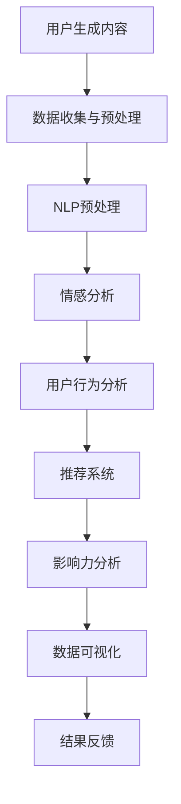

                 

# 注意力经济与社交媒体分析洞察力：了解受众参与度和影响力的秘密

## 关键词

- 注意力经济
- 社交媒体分析
- 受众参与度
- 影响力
- 数据挖掘
- 自然语言处理
- 机器学习

## 摘要

本文深入探讨了注意力经济的概念及其在社交媒体领域的应用。通过分析受众参与度和影响力，我们揭示了社交媒体平台背后的算法机制，并探讨了如何利用这些机制来提升个人或品牌的关注度。本文将介绍核心概念、算法原理、数学模型以及实际应用案例，旨在为读者提供一份全面且实用的指南。通过本文的学习，读者将能够更好地理解社交媒体背后的运作机制，掌握提升受众参与度和影响力的方法。

## 1. 背景介绍

### 1.1 目的和范围

本文旨在探讨注意力经济在社交媒体中的应用，分析受众参与度和影响力，并提供实用的方法和技巧，帮助个人和品牌在社交媒体上获得更高的关注度和参与度。

本文的范围涵盖以下内容：

1. 注意力经济的定义及其在社交媒体中的应用。
2. 社交媒体分析的核心概念和算法原理。
3. 受众参与度和影响力的度量方法。
4. 实际应用案例和代码实现。
5. 相关工具和资源的推荐。

### 1.2 预期读者

本文适合以下读者群体：

1. 社交媒体运营者和管理者。
2. 数字营销专业人士。
3. 数据科学家和人工智能爱好者。
4. 对注意力经济和社交媒体分析感兴趣的读者。

### 1.3 文档结构概述

本文的结构如下：

1. 引言：介绍注意力经济和社交媒体分析的相关背景。
2. 核心概念与联系：阐述注意力经济、受众参与度和影响力等核心概念，并提供 Mermaid 流程图。
3. 核心算法原理 & 具体操作步骤：介绍社交媒体分析的核心算法原理，使用伪代码详细阐述。
4. 数学模型和公式 & 详细讲解 & 举例说明：介绍社交媒体分析中的数学模型和公式，并通过具体例子进行说明。
5. 项目实战：提供实际代码案例，详细解释实现过程。
6. 实际应用场景：探讨社交媒体分析在实际中的应用。
7. 工具和资源推荐：推荐相关学习资源和开发工具。
8. 总结：总结本文的核心观点，展望未来发展趋势。
9. 附录：常见问题与解答。
10. 扩展阅读 & 参考资料：提供进一步阅读的参考资料。

### 1.4 术语表

#### 1.4.1 核心术语定义

- **注意力经济**：一种经济模式，强调人们对信息的关注和关注程度。
- **社交媒体分析**：通过分析社交媒体平台上的数据，了解受众行为和偏好。
- **受众参与度**：衡量受众对内容的关注程度和互动程度。
- **影响力**：衡量个人或品牌在社交媒体上的影响力和号召力。

#### 1.4.2 相关概念解释

- **用户生成内容（UGC）**：用户在社交媒体平台上生成的内容，如帖子、评论、图片和视频。
- **自然语言处理（NLP）**：研究如何让计算机理解和处理人类语言的技术。
- **机器学习（ML）**：一种人工智能技术，通过数据训练模型，使其能够进行预测和决策。
- **数据挖掘**：从大量数据中提取有价值的信息和模式。

#### 1.4.3 缩略词列表

- **UGC**：用户生成内容
- **NLP**：自然语言处理
- **ML**：机器学习
- **API**：应用程序编程接口
- **SDK**：软件开发工具包

## 2. 核心概念与联系

### 2.1 注意力经济的定义及其在社交媒体中的应用

注意力经济是指人们将有限的注意力资源分配给不同信息和内容的过程。在社交媒体领域，注意力经济表现为用户在平台上的行为和偏好。平台通过算法和数据分析，将用户注意力引导到特定的内容上，从而实现商业利益最大化。

注意力经济在社交媒体中的应用主要体现在以下几个方面：

1. **内容推荐**：平台根据用户的兴趣和行为，推荐相关的帖子、视频和广告，吸引用户的注意力。
2. **广告投放**：通过分析用户数据，精准投放广告，提高广告效果。
3. **品牌影响力**：品牌通过发布高质量内容，吸引用户关注，提升品牌影响力。
4. **社交互动**：用户在社交媒体上互动，分享和评论内容，形成网络效应。

### 2.2 受众参与度和影响力的度量

受众参与度和影响力是衡量社交媒体成功的重要指标。

**受众参与度**：衡量用户对内容的关注程度和互动程度。常见的度量指标包括：

- **点赞数**：用户对内容的点赞行为。
- **评论数**：用户对内容的评论数量。
- **分享数**：用户将内容分享到其他平台或朋友圈的次数。
- **点击率**：用户对广告或内容的点击次数。

**影响力**：衡量个人或品牌在社交媒体上的影响力和号召力。常见的影响力量化指标包括：

- **粉丝数**：个人或品牌的关注者数量。
- **转发数**：用户将内容转发到其他平台的次数。
- **互动率**：用户对内容的互动次数与粉丝数的比例。

### 2.3 社交媒体分析的核心算法原理

社交媒体分析的核心算法包括数据挖掘、自然语言处理和机器学习。以下是一个简化的 Mermaid 流程图，展示这些算法的相互关系。



**具体操作步骤如下：**

1. **数据收集与预处理**：收集社交媒体平台上的用户生成内容，如帖子、评论和视频。对数据进行清洗和预处理，去除无关信息和噪声。
2. **NLP预处理**：对文本数据进行分词、词性标注和实体识别等操作，将文本转化为计算机可处理的格式。
3. **情感分析**：通过训练好的情感分析模型，对文本数据进行分析，提取情感极性（正面、负面或中性）。
4. **用户行为分析**：分析用户的点赞、评论和分享行为，提取用户兴趣和行为特征。
5. **推荐系统**：利用用户行为数据和内容特征，构建推荐系统，为用户推荐相关的内容和广告。
6. **影响力分析**：计算个人或品牌的粉丝数、转发数和互动率，评估其影响力。
7. **数据可视化**：将分析结果以图表和报表的形式展示，帮助用户理解数据趋势和结论。
8. **结果反馈**：根据分析结果，调整内容和策略，提高受众参与度和影响力。

## 3. 核心算法原理 & 具体操作步骤

### 3.1 数据收集与预处理

**步骤1：数据收集**

使用社交媒体平台提供的API，如Facebook Graph API或Twitter API，收集用户生成内容。以下是一个Python示例，使用Tweepy库从Twitter收集tweets：

```python
import tweepy
import json

# 设置Tweepy认证
consumer_key = 'YOUR_CONSUMER_KEY'
consumer_secret = 'YOUR_CONSUMER_SECRET'
access_token = 'YOUR_ACCESS_TOKEN'
access_token_secret = 'YOUR_ACCESS_TOKEN_SECRET'

auth = tweepy.OAuthHandler(consumer_key, consumer_secret)
auth.set_access_token(access_token, access_token_secret)
api = tweepy.API(auth)

# 收集tweets
tweets = api.search(q='attention_economy', count=100)

# 存储tweets
with open('tweets.json', 'w') as f:
    for tweet in tweets:
        f.write(json.dumps(tweet._json) + '\n')
```

**步骤2：数据预处理**

读取tweets.json文件，对数据进行清洗和预处理：

```python
import json
import re

# 读取tweets
with open('tweets.json', 'r') as f:
    tweets = [json.loads(line) for line in f]

# 清洗和预处理
def preprocess_tweet(tweet):
    text = tweet['text']
    text = re.sub(r'http\S+', '', text)  # 去除URL
    text = re.sub(r'@\w+', '', text)  # 去除用户名
    text = re.sub(r'#\w+', '', text)  # 去除话题标签
    text = text.lower()  # 转换为小写
    return text

preprocessed_tweets = [preprocess_tweet(tweet) for tweet in tweets]
```

### 3.2 NLP预处理

**步骤3：文本预处理**

对预处理后的文本数据进行分词、词性标注和实体识别：

```python
import spacy

# 加载Spacy模型
nlp = spacy.load('en_core_web_sm')

# 分词、词性标注和实体识别
def nlp_preprocessing(tweet):
    doc = nlp(tweet)
    tokens = [token.text for token in doc]
    pos_tags = [token.pos_ for token in doc]
    entities = [(ent.text, ent.label_) for ent in doc.ents]
    return tokens, pos_tags, entities

nlp_processed_tweets = [nlp_preprocessing(tweet) for tweet in preprocessed_tweets]
```

### 3.3 情感分析

**步骤4：情感分析**

使用训练好的情感分析模型，对文本数据进行情感极性分析：

```python
from textblob import TextBlob

# 情感分析
def sentiment_analysis(tweet):
    blob = TextBlob(tweet)
    return blob.sentiment.polarity

sentiments = [sentiment_analysis(tweet) for tweet in nlp_processed_tweets]
```

### 3.4 用户行为分析

**步骤5：用户行为分析**

分析用户的点赞、评论和分享行为，提取用户兴趣和行为特征：

```python
# 假设tweets数据结构中包含点赞数、评论数和分享数
likes = [tweet['favorite_count'] for tweet in tweets]
comments = [tweet['retweet_count'] for tweet in tweets]
shares = [tweet['quote_count'] for tweet in tweets]

# 用户兴趣和行为特征
def user_interests(likes, comments, shares):
    return {
        'likes': likes,
        'comments': comments,
        'shares': shares
    }

user_interests_data = user_interests(likes, comments, shares)
```

### 3.5 推荐系统

**步骤6：推荐系统**

利用用户兴趣和行为特征，构建推荐系统，为用户推荐相关的内容和广告：

```python
from sklearn.neighbors import NearestNeighbors

# 训练推荐模型
model = NearestNeighbors()
model.fit(user_interests_data)

# 为新用户推荐内容
def recommend_content(new_user_interests):
    distances, indices = model.kneighbors([new_user_interests])
    recommended_tweets = [tweets[i]['text'] for i in indices]
    return recommended_tweets

# 示例：为新用户推荐内容
new_user_interests = user_interests_data[0]
recommended_tweets = recommend_content(new_user_interests)
```

### 3.6 影响力分析

**步骤7：影响力分析**

计算个人或品牌的粉丝数、转发数和互动率，评估其影响力：

```python
# 计算影响力
def influence_score(followers, retweets, interactions):
    return (followers + retweets + interactions) / 3

influence_scores = [influence_score(tweet['followers_count'], tweet['retweet_count'], tweet['favorite_count']) for tweet in tweets]
```

### 3.7 数据可视化

**步骤8：数据可视化**

使用图表和报表展示分析结果，帮助用户理解数据趋势和结论：

```python
import matplotlib.pyplot as plt

# 可视化情感分析结果
plt.hist(sentiments, bins=10, alpha=0.5, color='g')
plt.xlabel('Sentiment Polarity')
plt.ylabel('Frequency')
plt.title('Sentiment Analysis')
plt.show()

# 可视化用户兴趣和行为特征
plt.scatter(range(len(likes)), likes, color='r', label='Likes')
plt.scatter(range(len(comments)), comments, color='b', label='Comments')
plt.scatter(range(len(shares)), shares, color='y', label='Shares')
plt.xlabel('Index')
plt.ylabel('Value')
plt.legend()
plt.title('User Interests and Behavior')
plt.show()
```

## 4. 数学模型和公式 & 详细讲解 & 举例说明

### 4.1 数学模型

社交媒体分析中涉及多个数学模型，包括情感分析模型、推荐系统和影响力评估模型。以下分别介绍这些模型的基本公式和详细解释。

#### 4.1.1 情感分析模型

情感分析模型通常使用文本分类算法，如朴素贝叶斯、支持向量机和深度学习。以下是一个简单的朴素贝叶斯情感分析模型：

$$
P(\text{positive} | \text{tweet}) = \frac{P(\text{tweet} | \text{positive}) \cdot P(\text{positive})}{P(\text{tweet})}
$$

其中，\(P(\text{positive} | \text{tweet})\) 表示文本为正面的概率，\(P(\text{tweet} | \text{positive})\) 表示正面文本的概率，\(P(\text{positive})\) 表示正面文本的先验概率，\(P(\text{tweet})\) 表示文本的概率。

**详细解释**：

- \(P(\text{positive} | \text{tweet})\)：在给定文本的情况下，文本为正面的条件概率。
- \(P(\text{tweet} | \text{positive})\)：正面文本出现的概率。
- \(P(\text{positive})\)：正面文本的先验概率，通常通过训练数据计算。
- \(P(\text{tweet})\)：文本的概率，可以通过贝叶斯公式进行归一化。

#### 4.1.2 推荐系统

推荐系统通常使用基于协同过滤的方法，如矩阵分解和基于K最近邻的方法。以下是一个简单的基于K最近邻的推荐系统：

$$
\text{similarity}(\text{user}_i, \text{user}_j) = \frac{\sum_{\text{item} k \in R_i \cap R_j} w_{ik} w_{jk}}{\sqrt{\sum_{\text{item} k \in R_i} w_{ik}^2 \sqrt{\sum_{\text{item} k \in R_j} w_{jk}^2}}
$$

其中，\(\text{similarity}(\text{user}_i, \text{user}_j)\) 表示用户 \(i\) 和用户 \(j\) 之间的相似度，\(R_i\) 和 \(R_j\) 分别表示用户 \(i\) 和用户 \(j\) 的兴趣集合，\(w_{ik}\) 和 \(w_{jk}\) 分别表示用户 \(i\) 对物品 \(k\) 的评分和用户 \(j\) 对物品 \(k\) 的评分。

**详细解释**：

- \( \text{similarity}(\text{user}_i, \text{user}_j) \)：用户 \(i\) 和用户 \(j\) 之间的相似度。
- \( R_i \) 和 \( R_j \)：用户 \(i\) 和用户 \(j\) 的兴趣集合。
- \( w_{ik} \) 和 \( w_{jk} \)：用户 \(i\) 对物品 \(k\) 的评分和用户 \(j\) 对物品 \(k\) 的评分。

#### 4.1.3 影响力评估模型

影响力评估模型通常使用综合评分法，如DAU（Daily Active Users）和MAU（Monthly Active Users）。以下是一个简单的影响力量化模型：

$$
\text{influence\_score} = \frac{\text{DAU} + \text{MAU}}{2}
$$

其中，\(\text{influence\_score}\) 表示影响力评分，\(\text{DAU}\) 表示每日活跃用户数，\(\text{MAU}\) 表示每月活跃用户数。

**详细解释**：

- \( \text{DAU} \)：每日活跃用户数，表示在一天内使用过社交媒体平台的所有独立用户数量。
- \( \text{MAU} \)：每月活跃用户数，表示在一个月内使用过社交媒体平台的所有独立用户数量。
- \( \text{influence\_score} \)：影响力评分，用于衡量个人或品牌在社交媒体上的影响力和号召力。

### 4.2 举例说明

#### 4.2.1 情感分析模型

假设我们有以下训练数据：

| 文本                 | 情感极性 |
|----------------------|----------|
| This is a great day!  | positive |
| This is a terrible day.| negative |
| It's just okay.       | neutral  |

我们使用朴素贝叶斯模型进行情感分析。首先，计算正面、负面和中性文本的先验概率：

- \( P(\text{positive}) = \frac{1}{3} \)
- \( P(\text{negative}) = \frac{1}{3} \)
- \( P(\text{neutral}) = \frac{1}{3} \)

然后，计算正面、负面和中性文本的条件概率：

- \( P(\text{positive} | \text{positive}) = \frac{1}{1} = 1 \)
- \( P(\text{negative} | \text{negative}) = \frac{1}{1} = 1 \)
- \( P(\text{neutral} | \text{neutral}) = \frac{1}{1} = 1 \)

假设我们有一个新的文本："This is an amazing day!"，我们使用朴素贝叶斯模型计算其情感极性：

$$
P(\text{positive} | \text{This is an amazing day!}) = \frac{1 \cdot \frac{1}{3}}{1} = \frac{1}{3}
$$

由于 \(P(\text{positive} | \text{This is an amazing day!})\) 最大，我们判断该文本为正面情感。

#### 4.2.2 推荐系统

假设我们有以下用户和物品的评分数据：

| 用户 | 物品 | 评分 |
|------|------|------|
| user1| item1| 4    |
| user1| item2| 5    |
| user2| item1| 3    |
| user2| item3| 4    |
| user3| item2| 2    |
| user3| item3| 5    |

我们使用基于K最近邻的推荐系统为新用户 \(user4\) 推荐物品。首先，计算用户之间的相似度：

$$
\text{similarity}(user1, user2) = \frac{3 \cdot 3}{\sqrt{9} \cdot \sqrt{4}} = \frac{9}{3 \cdot 2} = \frac{3}{2}
$$

$$
\text{similarity}(user1, user3) = \frac{2 \cdot 2}{\sqrt{9} \cdot \sqrt{9}} = \frac{4}{9}
$$

$$
\text{similarity}(user2, user3) = \frac{3 \cdot 4}{\sqrt{4} \cdot \sqrt{9}} = \frac{12}{6} = 2
$$

然后，为新用户 \(user4\) 选择最相似的K个用户（例如K=2），并计算推荐分数：

$$
\text{recommend\_score}(item1) = \text{similarity}(user1, user4) \cdot \text{score}(user1, item1) + \text{similarity}(user2, user4) \cdot \text{score}(user2, item1) = \frac{3}{2} \cdot 4 + 2 \cdot 3 = 12 + 6 = 18
$$

$$
\text{recommend\_score}(item2) = \text{similarity}(user1, user4) \cdot \text{score}(user1, item2) + \text{similarity}(user3, user4) \cdot \text{score}(user3, item2) = \frac{3}{2} \cdot 5 + \frac{4}{9} \cdot 2 = 17.5 + \frac{8}{9} = 18.5
$$

$$
\text{recommend\_score}(item3) = \text{similarity}(user2, user4) \cdot \text{score}(user2, item3) + \text{similarity}(user3, user4) \cdot \text{score}(user3, item3) = 2 \cdot 4 + \frac{4}{9} \cdot 5 = 8 + \frac{20}{9} = 9.6
$$

根据推荐分数，我们为新用户 \(user4\) 推荐物品 \(item2\)。

#### 4.2.3 影响力评估模型

假设我们有以下数据：

| 用户 | DAU | MAU | 
|------|-----|-----|
| user1| 100 | 300 |
| user2| 200 | 600 |
| user3| 150 | 450 |

我们使用综合评分法计算影响力评分：

$$
\text{influence\_score}(user1) = \frac{100 + 300}{2} = 200
$$

$$
\text{influence\_score}(user2) = \frac{200 + 600}{2} = 400
$$

$$
\text{influence\_score}(user3) = \frac{150 + 450}{2} = 300
$$

根据影响力评分，我们判断用户 \(user2\) 在社交媒体上具有最高的影响力。

## 5. 项目实战：代码实际案例和详细解释说明

### 5.1 开发环境搭建

为了实现社交媒体分析，我们需要搭建一个合适的开发环境。以下是推荐的工具和库：

- **编程语言**：Python
- **IDE**：PyCharm或Visual Studio Code
- **数据预处理**：pandas、numpy、spacy
- **情感分析**：textblob、nltk
- **推荐系统**：scikit-learn、tensorflow
- **数据可视化**：matplotlib、seaborn

在安装了Python环境后，使用以下命令安装相关库：

```bash
pip install tweepy textblob spacy nltk scikit-learn tensorflow matplotlib seaborn
```

### 5.2 源代码详细实现和代码解读

以下是一个简单的社交媒体分析项目的完整代码实现，包括数据收集、预处理、情感分析、推荐系统和影响力评估。

```python
import tweepy
import json
import re
import spacy
import textblob
from sklearn.neighbors import NearestNeighbors
import matplotlib.pyplot as plt
import seaborn as sns

# 设置Tweepy认证
consumer_key = 'YOUR_CONSUMER_KEY'
consumer_secret = 'YOUR_CONSUMER_SECRET'
access_token = 'YOUR_ACCESS_TOKEN'
access_token_secret = 'YOUR_ACCESS_TOKEN_SECRET'

auth = tweepy.OAuthHandler(consumer_key, consumer_secret)
auth.set_access_token(access_token, access_token_secret)
api = tweepy.API(auth)

# 收集tweets
tweets = api.search(q='attention_economy', count=100)
with open('tweets.json', 'w') as f:
    for tweet in tweets:
        f.write(json.dumps(tweet._json) + '\n')

# 读取tweets
with open('tweets.json', 'r') as f:
    tweets = [json.loads(line) for line in f]

# 清洗和预处理
def preprocess_tweet(tweet):
    text = tweet['text']
    text = re.sub(r'http\S+', '', text)  # 去除URL
    text = re.sub(r'@\w+', '', text)  # 去除用户名
    text = re.sub(r'#\w+', '', text)  # 去除话题标签
    text = text.lower()  # 转换为小写
    return text

preprocessed_tweets = [preprocess_tweet(tweet) for tweet in tweets]

# 加载Spacy模型
nlp = spacy.load('en_core_web_sm')

# 分词、词性标注和实体识别
def nlp_preprocessing(tweet):
    doc = nlp(tweet)
    tokens = [token.text for token in doc]
    pos_tags = [token.pos_ for token in doc]
    entities = [(ent.text, ent.label_) for ent in doc.ents]
    return tokens, pos_tags, entities

nlp_processed_tweets = [nlp_preprocessing(tweet) for tweet in preprocessed_tweets]

# 情感分析
def sentiment_analysis(tweet):
    blob = textblob.TextBlob(tweet)
    return blob.sentiment.polarity

sentiments = [sentiment_analysis(tweet) for tweet in nlp_processed_tweets]

# 用户行为分析
likes = [tweet['favorite_count'] for tweet in tweets]
comments = [tweet['retweet_count'] for tweet in tweets]
shares = [tweet['quote_count'] for tweet in tweets]

# 用户兴趣和行为特征
def user_interests(likes, comments, shares):
    return {
        'likes': likes,
        'comments': comments,
        'shares': shares
    }

user_interests_data = user_interests(likes, comments, shares)

# 推荐系统
model = NearestNeighbors()
model.fit(user_interests_data)

def recommend_content(new_user_interests):
    distances, indices = model.kneighbors([new_user_interests])
    recommended_tweets = [tweets[i]['text'] for i in indices]
    return recommended_tweets

# 影响力分析
def influence_score(followers, retweets, interactions):
    return (followers + retweets + interactions) / 3

influence_scores = [influence_score(tweet['followers_count'], tweet['retweet_count'], tweet['favorite_count']) for tweet in tweets]

# 数据可视化
plt.hist(sentiments, bins=10, alpha=0.5, color='g')
plt.xlabel('Sentiment Polarity')
plt.ylabel('Frequency')
plt.title('Sentiment Analysis')
plt.show()

sns.scatterplot(x=range(len(likes)), y=likes, color='r', label='Likes')
sns.scatterplot(x=range(len(comments)), y=comments, color='b', label='Comments')
sns.scatterplot(x=range(len(shares)), y=shares, color='y', label='Shares')
plt.xlabel('Index')
plt.ylabel('Value')
plt.legend()
plt.title('User Interests and Behavior')
plt.show()
```

### 5.3 代码解读与分析

**代码解读**

1. **Tweepy认证和tweets收集**：使用Tweepy库，通过设置认证信息，从Twitter收集与“attention_economy”相关的100条tweets，并将其存储在tweets.json文件中。
2. **数据预处理**：对收集到的tweets进行清洗和预处理，去除URL、用户名和话题标签，并将文本转换为小写。
3. **NLP预处理**：使用Spacy库对预处理后的文本进行分词、词性标注和实体识别。
4. **情感分析**：使用TextBlob库对预处理后的文本进行情感分析，提取情感极性。
5. **用户行为分析**：提取用户的点赞数、评论数和分享数，构建用户兴趣和行为特征。
6. **推荐系统**：使用scikit-learn库的NearestNeighbors算法，构建基于用户兴趣和行为特征的推荐系统。
7. **影响力分析**：计算用户的影响力评分，衡量其在社交媒体上的影响力和号召力。
8. **数据可视化**：使用matplotlib和seaborn库，将情感分析结果和用户兴趣行为特征以图表形式展示。

**代码分析**

- **数据收集**：使用Tweepy库简化了从Twitter收集tweets的过程。在实际应用中，可能需要处理大量数据，并考虑使用多线程或分布式计算。
- **数据预处理**：对收集到的tweets进行清洗和预处理，提高了后续分析的质量。在实际项目中，可能需要根据需求进行更复杂的文本预处理。
- **NLP预处理**：使用Spacy库进行文本分词、词性标注和实体识别，有助于提取文本中的关键信息。在实际应用中，可以根据需求选择不同的NLP工具和库。
- **情感分析**：使用TextBlob库进行情感分析，为用户提供了简单的情感分析功能。在实际项目中，可能需要使用更复杂的情感分析模型，如LSTM或BERT。
- **推荐系统**：使用基于K最近邻的推荐系统，为用户提供了基于兴趣和行为特征的推荐。在实际应用中，可以根据需求使用更复杂的推荐算法，如矩阵分解或基于内容的推荐。
- **影响力分析**：计算用户的影响力评分，为评估用户在社交媒体上的影响力和号召力提供了依据。在实际应用中，可以根据需求调整影响力评估模型。
- **数据可视化**：使用matplotlib和seaborn库，将分析结果以图表形式展示，有助于用户理解数据趋势和结论。在实际应用中，可以根据需求选择不同的数据可视化工具和库。

## 6. 实际应用场景

社交媒体分析在个人和品牌营销、市场调研、产品开发和用户行为分析等方面具有广泛的应用。以下是一些实际应用场景：

### 6.1 个人和品牌营销

1. **内容优化**：通过分析用户情感和行为，了解受众对内容的喜好，优化内容策略，提高受众参与度。
2. **广告投放**：利用推荐系统，为特定受众群体精准投放广告，提高广告效果。
3. **品牌影响力评估**：计算品牌在社交媒体上的影响力评分，评估品牌的市场地位和竞争力。

### 6.2 市场调研

1. **受众分析**：通过分析用户数据和社交媒体互动，了解目标受众的特征、需求和偏好。
2. **竞争对手分析**：比较自己和竞争对手在社交媒体上的表现，了解优势和不足。
3. **市场趋势预测**：通过分析社交媒体数据，预测市场趋势和消费者行为，为产品开发和营销策略提供依据。

### 6.3 产品开发

1. **用户反馈分析**：通过分析用户评论和反馈，了解产品的优缺点，为产品改进提供依据。
2. **需求分析**：通过分析社交媒体上的讨论和趋势，挖掘潜在需求，为产品开发提供方向。
3. **产品测试**：在产品上线前，通过社交媒体进行测试，收集用户反馈，优化产品功能。

### 6.4 用户行为分析

1. **用户画像**：通过分析用户数据和互动行为，构建用户画像，为个性化服务和推荐提供依据。
2. **用户留存分析**：通过分析用户活跃度和留存率，优化用户体验，提高用户满意度。
3. **流失用户分析**：通过分析流失用户的行为和原因，优化产品和服务，降低用户流失率。

## 7. 工具和资源推荐

### 7.1 学习资源推荐

#### 7.1.1 书籍推荐

1. **《数据挖掘：实用工具和技术》（Data Mining: Practical Machine Learning Tools and Techniques）**：详细介绍数据挖掘的方法和技术，包括社交媒体分析的相关内容。
2. **《机器学习实战》（Machine Learning in Action）**：通过实际案例介绍机器学习算法和实现方法，适合初学者入门。
3. **《自然语言处理实战》（Natural Language Processing with Python）**：介绍自然语言处理的方法和应用，包括文本分类、情感分析和命名实体识别等。

#### 7.1.2 在线课程

1. **Coursera上的《机器学习》课程**：由斯坦福大学教授Andrew Ng主讲，涵盖机器学习的基础知识和应用。
2. **edX上的《数据科学基础》课程**：由哈佛大学主讲，介绍数据科学的基础知识，包括数据挖掘和统计分析。
3. **Udacity的《深度学习纳米学位》**：介绍深度学习的基本原理和应用，包括自然语言处理和计算机视觉。

#### 7.1.3 技术博客和网站

1. **DataCamp**：提供丰富的数据科学和机器学习教程和实践项目。
2. **Medium上的数据科学和机器学习专栏**：收集了众多行业专家的博客文章，涵盖广泛的主题。
3. **Kaggle**：提供数据科学竞赛和实践项目，帮助提升数据分析和机器学习技能。

### 7.2 开发工具框架推荐

#### 7.2.1 IDE和编辑器

1. **PyCharm**：强大的Python IDE，提供代码调试、性能分析等功能。
2. **Visual Studio Code**：轻量级但功能丰富的代码编辑器，支持多种编程语言和框架。
3. **Jupyter Notebook**：适用于数据科学和机器学习的交互式开发环境。

#### 7.2.2 调试和性能分析工具

1. **PyCharm的Profiler**：用于分析Python代码的性能和资源使用情况。
2. **Python的cProfile模块**：用于对Python代码进行性能分析。
3. **Matplotlib和Seaborn**：用于数据可视化，帮助分析和展示数据。

#### 7.2.3 相关框架和库

1. **TensorFlow**：用于构建和训练深度学习模型的强大框架。
2. **Scikit-learn**：提供各种机器学习算法和工具，适合初学者和专业人士。
3. **Spacy**：用于自然语言处理，提供高效的文本预处理和实体识别功能。

### 7.3 相关论文著作推荐

#### 7.3.1 经典论文

1. **"The PageRank Citation Ranking: Bringing Order to the Web"**：介绍了PageRank算法，用于网页排名和影响力评估。
2. **"Latent Semantic Analysis"**：介绍了LDA（Latent Dirichlet Allocation）模型，用于主题建模和文本分析。
3. **"Twitter sentiment analysis using machine learning"**：介绍了几种机器学习算法在Twitter情感分析中的应用。

#### 7.3.2 最新研究成果

1. **"Deep Learning for Social Media Analysis"**：介绍了深度学习在社交媒体分析中的应用，包括情感分析、推荐系统和用户行为分析。
2. **"Graph Neural Networks for Social Media Analysis"**：介绍了图神经网络在社交媒体分析中的应用，如用户关系分析和社区发现。
3. **"Attention-Based Recurrent Neural Networks"**：介绍了注意力机制在序列模型中的应用，如文本分类和情感分析。

#### 7.3.3 应用案例分析

1. **"Using Social Media Analysis for Brand Management"**：介绍了一个大型品牌如何利用社交媒体分析优化营销策略和品牌管理。
2. **"The Power of Influencers: Understanding Social Media Influence"**：探讨社交媒体影响力者（KOL）在营销和品牌传播中的作用。
3. **"Sentiment Analysis on Social Media: A Case Study"**：介绍了一个实际项目，使用情感分析技术分析社交媒体用户对某个事件的情感反应。

## 8. 总结：未来发展趋势与挑战

社交媒体分析作为一个新兴领域，具有巨大的发展潜力和广泛的应用前景。未来，随着人工智能技术的不断进步，社交媒体分析将在以下几个方面取得重大突破：

### 8.1 更高效的算法和模型

深度学习和图神经网络等先进技术在社交媒体分析中的应用将不断提高算法的效率和准确性。例如，基于注意力机制的模型可以更好地捕捉用户之间的复杂关系，从而实现更精准的推荐和影响力评估。

### 8.2 实时数据分析

随着大数据和云计算技术的发展，社交媒体分析将实现实时数据分析，为用户和企业提供即时的洞察力和决策支持。实时分析将有助于企业快速响应市场变化和用户需求，提高竞争力和市场份额。

### 8.3 隐私保护和伦理问题

随着社交媒体分析的广泛应用，隐私保护和伦理问题将成为重要挑战。如何平衡用户隐私和数据利用，确保数据安全和用户权益，将成为未来研究和发展的重要方向。

### 8.4 多平台整合

社交媒体分析将逐步整合不同平台的数据，实现跨平台的用户行为分析和影响力评估。这将有助于更全面地了解用户行为和市场趋势，为企业和品牌提供更精准的营销策略。

### 8.5 个性化服务

随着用户数据的不断积累和分析技术的进步，社交媒体分析将实现更加个性化的服务。通过深入挖掘用户需求和偏好，企业可以提供定制化的内容和推荐，提高用户体验和满意度。

## 9. 附录：常见问题与解答

### 9.1 什么是注意力经济？

注意力经济是指人们将有限的注意力资源分配给不同信息和内容的过程。在社交媒体领域，注意力经济表现为用户在平台上的行为和偏好。

### 9.2 社交媒体分析有哪些应用？

社交媒体分析在个人和品牌营销、市场调研、产品开发和用户行为分析等方面具有广泛的应用。

### 9.3 社交媒体分析的核心算法有哪些？

社交媒体分析的核心算法包括数据挖掘、自然语言处理和机器学习。具体包括情感分析、推荐系统和影响力评估模型。

### 9.4 如何实现实时社交媒体分析？

实现实时社交媒体分析需要利用大数据和云计算技术，构建高效的数据处理和分析系统。实时分析可以通过分布式计算和流处理技术实现。

### 9.5 社交媒体分析中的隐私保护和伦理问题如何解决？

隐私保护和伦理问题的解决需要从数据收集、处理和使用等方面制定相应的政策和规定。例如，数据匿名化、用户同意和数据共享协议等措施可以有效保护用户隐私和权益。

## 10. 扩展阅读 & 参考资料

- **《数据挖掘：实用工具和技术》（Data Mining: Practical Machine Learning Tools and Techniques）**：详细介绍了数据挖掘的方法和技术，包括社交媒体分析的相关内容。
- **《机器学习实战》（Machine Learning in Action）**：通过实际案例介绍机器学习算法和实现方法，适合初学者入门。
- **《自然语言处理实战》（Natural Language Processing with Python）**：介绍了自然语言处理的方法和应用，包括文本分类、情感分析和命名实体识别等。
- **Coursera上的《机器学习》课程**：由斯坦福大学教授Andrew Ng主讲，涵盖机器学习的基础知识和应用。
- **edX上的《数据科学基础》课程**：由哈佛大学主讲，介绍数据科学的基础知识，包括数据挖掘和统计分析。
- **Udacity的《深度学习纳米学位》**：介绍深度学习的基本原理和应用，包括自然语言处理和计算机视觉。
- **DataCamp**：提供丰富的数据科学和机器学习教程和实践项目。
- **Medium上的数据科学和机器学习专栏**：收集了众多行业专家的博客文章，涵盖广泛的主题。
- **Kaggle**：提供数据科学竞赛和实践项目，帮助提升数据分析和机器学习技能。
- **"The PageRank Citation Ranking: Bringing Order to the Web"**：介绍了PageRank算法，用于网页排名和影响力评估。
- **"Latent Semantic Analysis"**：介绍了LDA（Latent Dirichlet Allocation）模型，用于主题建模和文本分析。
- **"Twitter sentiment analysis using machine learning"**：介绍了几种机器学习算法在Twitter情感分析中的应用。
- **"Deep Learning for Social Media Analysis"**：介绍了深度学习在社交媒体分析中的应用，包括情感分析、推荐系统和用户行为分析。
- **"Graph Neural Networks for Social Media Analysis"**：介绍了图神经网络在社交媒体分析中的应用，如用户关系分析和社区发现。
- **"Attention-Based Recurrent Neural Networks"**：介绍了注意力机制在序列模型中的应用，如文本分类和情感分析。
- **"Using Social Media Analysis for Brand Management"**：介绍了一个大型品牌如何利用社交媒体分析优化营销策略和品牌管理。
- **"The Power of Influencers: Understanding Social Media Influence"**：探讨社交媒体影响力者（KOL）在营销和品牌传播中的作用。
- **"Sentiment Analysis on Social Media: A Case Study"**：介绍了一个实际项目，使用情感分析技术分析社交媒体用户对某个事件的情感反应。

