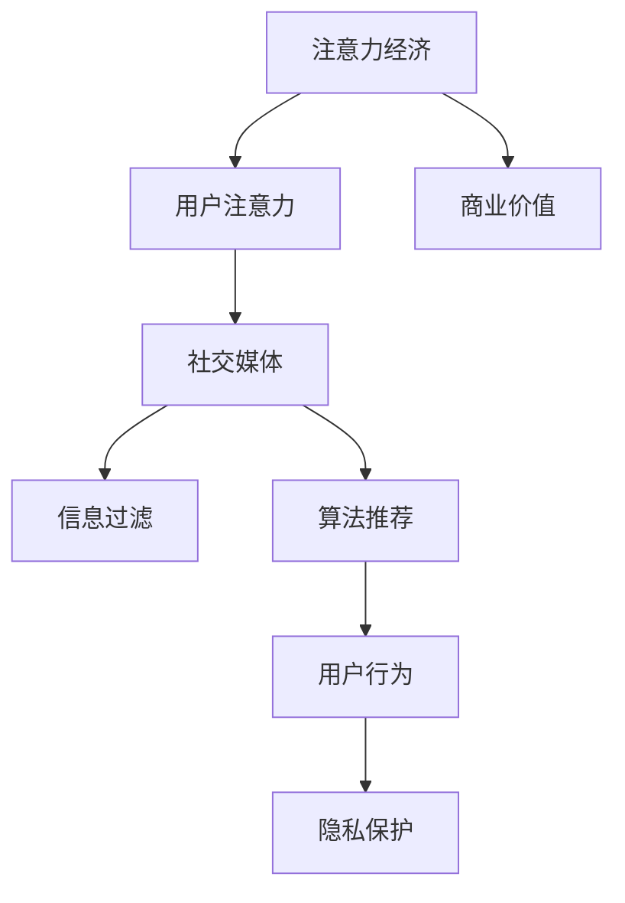

                 

# 注意力经济与社交媒体影响：谁在控制你看什么

> 关键词：注意力经济、社交媒体、信息过滤、算法推荐、用户行为、隐私保护

> 摘要：本文将深入探讨注意力经济与社交媒体之间的相互作用，分析算法如何影响用户行为和信息接收，讨论隐私保护的重要性及其面临的挑战。通过对核心概念、算法原理、数学模型以及实际应用场景的详细剖析，旨在为读者提供全面、清晰的理解，引导思考如何在这一信息爆炸的时代中做出更明智的选择。

## 1. 背景介绍

### 1.1 目的和范围

本文旨在探讨注意力经济在社交媒体中的应用及其对用户行为的深远影响。随着互联网的普及和信息爆炸，人们的注意力成为一种稀缺资源，如何有效地吸引和保持用户的注意力成为各大社交媒体平台和内容提供商的核心挑战。本文将分析注意力经济的基本原理，探讨社交媒体平台如何利用算法推荐机制来控制用户的信息流，同时也会探讨隐私保护在这一过程中所面临的挑战。

### 1.2 预期读者

本文适合对互联网技术和社交媒体有一定了解的读者，包括但不限于技术开发人员、数据分析师、市场营销人员以及普通用户。通过本文的阅读，读者可以更深入地理解注意力经济如何运作，以及社交媒体算法对用户行为和信息过滤的影响。

### 1.3 文档结构概述

本文将分为以下几个部分：

1. **核心概念与联系**：介绍注意力经济、社交媒体、信息过滤和算法推荐等核心概念，并使用流程图展示它们之间的联系。
2. **核心算法原理与具体操作步骤**：详细解析算法推荐的基本原理和具体操作步骤，使用伪代码进行阐述。
3. **数学模型和公式**：讨论数学模型在注意力经济中的应用，并提供具体公式和例子的说明。
4. **项目实战**：通过代码实际案例展示算法的应用，并进行详细解释和分析。
5. **实际应用场景**：分析注意力经济和社交媒体在现实世界中的应用案例。
6. **工具和资源推荐**：推荐学习资源和开发工具，帮助读者进一步了解相关领域。
7. **总结与未来发展趋势**：总结本文的主要观点，探讨未来的发展趋势和面临的挑战。
8. **附录**：提供常见问题与解答，方便读者查阅。

### 1.4 术语表

#### 1.4.1 核心术语定义

- **注意力经济**：一种基于用户注意力价值的经济学理论，强调用户注意力作为一种稀缺资源的重要性。
- **社交媒体**：基于互联网技术，允许用户分享内容、建立社交关系和交流信息的平台。
- **信息过滤**：通过算法和技术手段筛选和过滤信息，以适应用户的兴趣和需求。
- **算法推荐**：利用机器学习和数据分析技术，为用户推荐感兴趣的内容。

#### 1.4.2 相关概念解释

- **用户行为**：用户在社交媒体平台上的各种操作，包括浏览、点赞、评论、分享等。
- **隐私保护**：保护用户个人信息和隐私不受未经授权的访问和使用。

#### 1.4.3 缩略词列表

- **AI**：人工智能（Artificial Intelligence）
- **ML**：机器学习（Machine Learning）
- **SEO**：搜索引擎优化（Search Engine Optimization）
- **UI/UX**：用户界面/用户体验（User Interface/User Experience）
- **CRM**：客户关系管理（Customer Relationship Management）

## 2. 核心概念与联系

### 2.1 注意力经济原理

注意力经济基于一个简单的原则：在信息过载的时代，用户的注意力变得比黄金还珍贵。注意力经济理论认为，用户的时间有限，他们的注意力分配决定了他们与内容、产品和服务的交互方式。因此，能够吸引并保持用户注意力的内容、产品或服务具有更高的商业价值。

### 2.2 社交媒体的作用

社交媒体平台通过提供个性化的内容推荐，极大地满足了用户的注意力需求。这些平台利用用户的浏览历史、社交网络和互动行为等数据，通过复杂的算法推荐系统，为用户呈现他们可能感兴趣的内容。这不仅提高了用户的参与度，也增加了平台的广告收入。

### 2.3 信息过滤机制

信息过滤是注意力经济中的关键环节。通过过滤机制，社交媒体平台能够筛选出用户可能感兴趣的内容，同时屏蔽掉不相关或低价值的信息。这一过程涉及多种算法和技术，如协同过滤、内容分类和用户行为分析等。

### 2.4 算法推荐原理

算法推荐系统是社交媒体的核心功能之一。它利用机器学习算法和大数据分析技术，从海量的信息中提取有价值的内容，并将其推荐给用户。推荐算法通常包括基于内容的推荐、协同过滤推荐和混合推荐等。

### 2.5 用户行为的影响

用户的行为数据是算法推荐的重要输入。用户的浏览历史、点赞、评论和分享等行为数据，都被用来训练和优化推荐算法，以提高推荐的准确性和相关性。同时，用户的行为也受到推荐内容的影响，形成了正反馈循环。

### 2.6 隐私保护的重要性

在注意力经济的背景下，用户隐私保护变得尤为重要。由于推荐系统需要收集和分析大量的用户数据，如何确保这些数据的安全性和隐私性成为一个重要问题。隐私保护不仅关系到用户的信任，也影响到平台的长期发展。

### 2.7 注意力经济与社交媒体的关系流程图

下面是一个简单的 Mermaid 流程图，展示注意力经济与社交媒体之间的关系：



## 3. 核心算法原理 & 具体操作步骤

### 3.1 算法推荐的基本原理

算法推荐系统通常基于以下几种基本原理：

1. **基于内容的推荐**：推荐与用户历史偏好相似的内容。
2. **协同过滤推荐**：利用用户之间的相似性进行推荐。
3. **混合推荐**：结合多种推荐策略，以提高推荐效果。

### 3.2 基于内容的推荐算法

**基本原理**：基于内容的推荐通过分析用户的历史行为和偏好，找到用户喜欢的特定类型的内容，然后推荐相似的内容。

**具体步骤**：

1. **内容特征提取**：将内容表示为一系列特征向量。
   ```python
   def extract_features(content):
       # 假设content是一个文本文档
       # 返回一个特征向量
       return [content.count(word) for word in vocabulary]
   ```

2. **用户兴趣模型**：构建用户的兴趣模型，表示用户对特定内容的偏好。
   ```python
   def build_user_model(user_history):
       # 假设user_history是用户历史浏览记录的列表
       # 返回用户的兴趣模型
       return {content: score for content, score in user_history}
   ```

3. **内容相似度计算**：计算新内容与用户兴趣模型中内容的相似度。
   ```python
   def calculate_similarity(content1, content2):
       # 使用余弦相似度计算两个内容的相似度
       dot_product = sum(a * b for a, b in zip(content1, content2))
       norm_product = (sum(a * a for a in content1) ** 0.5) * (sum(b * b for b in content2) ** 0.5)
       return dot_product / norm_product
   ```

4. **推荐生成**：根据相似度分数，推荐最相似的内容。
   ```python
   def generate_recommendations(user_model, content_features):
       # 计算新内容与用户兴趣模型的相似度
       similarities = {content: calculate_similarity(content_features[content], user_model[content]) for content in content_features}
       # 推荐相似度最高的内容
       return [content for content, similarity in similarities.items() if similarity > threshold]
   ```

### 3.3 协同过滤推荐算法

**基本原理**：协同过滤推荐通过分析用户之间的相似性来推荐内容。它将用户视为一个整体，通过用户之间的共同喜好来推荐新的内容。

**具体步骤**：

1. **用户相似度计算**：计算用户之间的相似度。
   ```python
   def calculate_user_similarity(user1, user2, user_history):
       common_items = set(user1.keys()) & set(user2.keys())
       if len(common_items) == 0:
           return 0
       sum_squared_diff = sum((user1[item] - user2[item]) ** 2 for item in common_items)
       return 1 / (1 + sum_squared_diff)
   ```

2. **预测用户评分**：根据用户之间的相似度预测用户对未知内容的评分。
   ```python
   def predict_user_rating(user, content, user_similarity):
       similar_users = [other_user for other_user, similarity in user_similarity.items() if similarity > threshold]
       if len(similar_users) == 0:
           return 0
       predicted_rating = sum(user[content] * similarity for other_user, similarity in user_similarity.items() if similarity > threshold) / sum(similarity for other_user, similarity in user_similarity.items() if similarity > threshold)
       return predicted_rating
   ```

3. **推荐生成**：根据预测评分，推荐用户可能感兴趣的内容。
   ```python
   def generate_collaborative_recommendations(user, content_items, user_similarity):
       predicted_ratings = {content: predict_user_rating(user, content, user_similarity) for content in content_items}
       return [content for content, rating in predicted_ratings.items() if rating > threshold]
   ```

### 3.4 混合推荐算法

**基本原理**：混合推荐算法结合基于内容和协同过滤推荐，以利用两者的优势。

**具体步骤**：

1. **内容特征提取**：同基于内容的推荐。
2. **用户兴趣模型**：同基于内容的推荐。
3. **用户相似度计算**：同协同过滤推荐。
4. **内容相似度计算**：同基于内容的推荐。
5. **综合评分**：结合内容相似度和用户相似度，生成综合评分。
   ```python
   def calculate_combined_rating(content_similarity, user_similarity):
       return alpha * content_similarity + (1 - alpha) * user_similarity
   ```

6. **推荐生成**：根据综合评分，推荐用户可能感兴趣的内容。

```python
def generate_hybrid_recommendations(user, content_features, user_similarity, alpha=0.5):
    combined_ratings = {content: calculate_combined_rating(content_similarity, user_similarity) for content, content_similarity in content_features.items()}
    return [content for content, rating in combined_ratings.items() if rating > threshold]
```

## 4. 数学模型和公式 & 详细讲解 & 举例说明

### 4.1 数学模型在注意力经济中的应用

注意力经济中，数学模型广泛应用于用户行为预测、内容推荐和隐私保护等领域。以下是一些常用的数学模型和公式的详细讲解及举例说明。

### 4.2 基于内容的推荐中的余弦相似度

**公式**：
$$
\text{cosine\_similarity}(x, y) = \frac{x \cdot y}{\|x\| \|y\|}
$$
其中，$x$ 和 $y$ 是两个向量，$\cdot$ 表示点积，$\|\|$ 表示向量的欧几里得范数。

**示例**：

假设有两个文档 $A$ 和 $B$，其特征向量分别为 $A = (2, 3, 5)$ 和 $B = (4, 2, 0)$，则它们的余弦相似度为：
$$
\text{cosine\_similarity}(A, B) = \frac{(2 \cdot 4 + 3 \cdot 2 + 5 \cdot 0)}{\sqrt{2^2 + 3^2 + 5^2} \sqrt{4^2 + 2^2 + 0^2}} = \frac{8 + 6 + 0}{\sqrt{4 + 9 + 25} \sqrt{16 + 4 + 0}} = \frac{14}{\sqrt{38} \sqrt{20}} \approx 0.65
$$

### 4.3 协同过滤推荐中的用户相似度

**公式**：
$$
\text{user\_similarity}(u, v) = \frac{\sum_{i \in I_{uv}} (r_{ui} - \bar{r}_u)(r_{vi} - \bar{r}_v)}{\sqrt{\sum_{i \in I_{uv}} (r_{ui} - \bar{r}_u)^2} \sqrt{\sum_{i \in I_{uv}} (r_{vi} - \bar{r}_v)^2}}
$$
其中，$u$ 和 $v$ 是两个用户，$I_{uv}$ 是他们共同评价的项目集合，$r_{ui}$ 和 $r_{vi}$ 分别是用户 $u$ 和 $v$ 对项目 $i$ 的评分，$\bar{r}_u$ 和 $\bar{r}_v$ 分别是用户 $u$ 和 $v$ 的平均评分。

**示例**：

假设用户 $A$ 和 $B$ 对三本书的评分如下：

| 用户 | 书1 | 书2 | 书3 |
|------|-----|-----|-----|
| A    | 4   | 3   | 2   |
| B    | 4   | 5   | 5   |

计算用户 $A$ 和 $B$ 的相似度：

$$
\text{user\_similarity}(A, B) = \frac{(4-3.5)(4-3.5) + (3-3.5)(5-3.5)}{\sqrt{(4-3.5)^2 + (3-3.5)^2} \sqrt{(4-3.5)^2 + (5-3.5)^2}} = \frac{(0.5)^2 + (-0.5)^2}{\sqrt{0.5^2 + 0.5^2} \sqrt{0.5^2 + 1.5^2}} = \frac{0.25 + 0.25}{\sqrt{0.5} \sqrt{2.5}} = \frac{0.5}{\sqrt{1.25}} \approx 0.63
$$

### 4.4 隐私保护中的拉格朗日乘数法

**公式**：
$$
L(\theta, \lambda) = \sum_{i=1}^m (y_i - \theta^T x_i)^2 + \lambda \sum_{j=1}^n \theta_j^2
$$
其中，$L$ 是拉格朗日函数，$y_i$ 是第 $i$ 个样本的真实标签，$x_i$ 是第 $i$ 个样本的特征向量，$\theta$ 是模型参数，$\lambda$ 是惩罚参数。

**示例**：

假设我们有一个线性回归模型，目标是最小化损失函数：
$$
\min_{\theta} \sum_{i=1}^m (y_i - \theta^T x_i)^2 + \lambda \sum_{j=1}^n \theta_j^2
$$
我们可以使用拉格朗日乘数法求解：
$$
L(\theta, \lambda) = \sum_{i=1}^m (y_i - \theta^T x_i)^2 + \lambda \sum_{j=1}^n \theta_j^2
$$
对 $\theta$ 求导并令导数为零：
$$
\nabla_{\theta} L(\theta, \lambda) = -2x^T(y - \theta x) + 2\lambda \theta = 0
$$
解得：
$$
\theta = \left(x^Tx + \lambda I\right)^{-1}x^Ty
$$
其中，$I$ 是单位矩阵。

## 5. 项目实战：代码实际案例和详细解释说明

### 5.1 开发环境搭建

为了演示注意力经济和社交媒体算法在实际项目中的应用，我们将使用 Python 作为编程语言，结合一些常用的库，如 NumPy、Scikit-learn 和 Pandas。以下是搭建开发环境的基本步骤：

1. **安装 Python**：确保已经安装了 Python 3.6 或更高版本。
2. **安装相关库**：使用以下命令安装所需库：
   ```bash
   pip install numpy scikit-learn pandas matplotlib
   ```

### 5.2 源代码详细实现和代码解读

下面是一个简单的项目案例，展示如何使用基于内容的推荐算法来推荐文章。

```python
import numpy as np
import pandas as pd
from sklearn.feature_extraction.text import TfidfVectorizer
from sklearn.metrics.pairwise import cosine_similarity

# 数据准备
data = {
    'article_id': ['1', '2', '3', '4', '5'],
    'title': ['Python入门', '深度学习', '数据分析', 'Web开发', '人工智能'],
    'content': [
        'Python是一种流行的编程语言，适合初学者入门。',
        '深度学习是人工智能的一个重要分支，广泛应用于图像识别、自然语言处理等领域。',
        '数据分析是通过统计方法和算法来解读数据，帮助人们做出更好的决策。',
        'Web开发涉及创建和维护网站。',
        '人工智能是计算机科学的一个分支，旨在使计算机模拟人类的智能行为。'
    ]
}

df = pd.DataFrame(data)

# 特征提取
vectorizer = TfidfVectorizer(stop_words='english')
tfidf_matrix = vectorizer.fit_transform(df['content'])

# 相似度计算
cosine_sim = cosine_similarity(tfidf_matrix, tfidf_matrix)

# 用户输入
user_input = '机器学习入门'

# 提取用户输入的特征向量
user_vector = vectorizer.transform([user_input])

# 计算用户输入与所有文章的相似度
similarity_scores = cosine_similarity(user_vector, tfidf_matrix).flatten()

# 推荐文章
recommended_articles = df['article_id'][similarity_scores.argsort()[:-6:-1]]

print("推荐文章：")
print(recommended_articles)
```

### 5.3 代码解读与分析

1. **数据准备**：首先，我们创建了一个包含文章标题和内容的数据框（DataFrame）。数据集较小，但足以演示算法的基本原理。

2. **特征提取**：使用 `TfidfVectorizer` 从文本数据中提取特征向量。TF-IDF（Term Frequency-Inverse Document Frequency）是一种常用的文本特征提取方法，可以有效地衡量词语在文档中的重要程度。

3. **相似度计算**：使用 `cosine_similarity` 函数计算文章之间的相似度。余弦相似度是一种常用的相似度度量方法，通过计算两个向量之间的夹角余弦值来衡量它们的相似性。

4. **用户输入**：假设用户输入了一个查询词（例如“机器学习入门”），我们首先提取该查询词的特征向量。

5. **相似度计算**：计算用户输入与所有文章的相似度，并按相似度分数排序。

6. **推荐文章**：根据相似度分数，推荐相似度最高的前五篇文章。

通过这个简单的案例，我们可以看到基于内容的推荐算法是如何工作的。在实际应用中，可以使用更复杂的算法和更大的数据集来提高推荐的准确性和个性化程度。

## 6. 实际应用场景

### 6.1 社交媒体平台的个性化内容推荐

社交媒体平台如 Facebook、Twitter 和 Instagram 等广泛使用个性化内容推荐来提高用户的参与度和留存率。通过分析用户的浏览历史、点赞、评论和分享等行为数据，平台可以推荐用户可能感兴趣的内容，从而增强用户的体验。例如，Facebook 的 News Feed 是通过复杂的算法来决定哪些内容应该优先显示给用户，以提高用户的参与度和互动性。

### 6.2 电子商务平台的商品推荐

电子商务平台如 Amazon 和 Alibaba 利用用户的历史购物行为、搜索历史和浏览记录来推荐相关的商品。这些推荐系统不仅帮助用户发现他们可能感兴趣的商品，同时也提高了平台的销售转化率和客户满意度。例如，当用户在 Amazon 上浏览一款特定的智能手机时，系统可能会推荐相关的手机配件或类似的智能手机。

### 6.3 流媒体平台的内容推荐

流媒体平台如 Netflix 和 Spotify 通过分析用户的观看历史和播放行为来推荐新的视频和音乐。Netflix 的个性化推荐系统通过预测用户对各种类型视频的兴趣，为用户推荐他们可能喜欢的电影和电视剧。同样，Spotify 的推荐系统通过分析用户的播放历史和喜欢类型，推荐新的音乐和播客。

### 6.4 新闻网站的个性化新闻推荐

新闻网站如 CNN、BBC 和 The New York Times 等使用个性化推荐系统来推荐用户可能感兴趣的新闻文章。通过分析用户的浏览历史、搜索关键词和点击行为，这些网站可以为用户定制个性化的新闻推荐，从而提高用户粘性和阅读量。

### 6.5 医疗健康平台的个性化医疗信息推荐

医疗健康平台如 WebMD 和 Doctor.com 通过分析用户的搜索历史和健康问题，推荐相关的医疗信息、健康建议和药物信息。这些个性化推荐可以帮助用户更好地管理自己的健康，同时也为平台提供了更多的用户数据，以进一步优化推荐系统。

## 7. 工具和资源推荐

### 7.1 学习资源推荐

#### 7.1.1 书籍推荐

1. 《算法导论》（Introduction to Algorithms）
2. 《机器学习》（Machine Learning）
3. 《深度学习》（Deep Learning）
4. 《Python数据科学手册》（Python Data Science Handbook）

#### 7.1.2 在线课程

1. Coursera - 机器学习（由 Andrew Ng 教授主讲）
2. edX - 数据科学基础（由 IBM 主办）
3. Udacity - 人工智能纳米学位
4. Pluralsight - Python编程入门

#### 7.1.3 技术博客和网站

1. Medium - Data Science, Machine Learning, AI 等领域的最新研究和见解
2. Towards Data Science - 数据科学和机器学习的实践教程和案例分析
3. Analytics Vidhya - 数据科学和机器学习的资源和社区
4. HackerRank - 编程挑战和算法学习平台

### 7.2 开发工具框架推荐

#### 7.2.1 IDE和编辑器

1. PyCharm - 适用于 Python 开发的集成开发环境
2. Jupyter Notebook - 用于数据科学和机器学习的交互式开发工具
3. Visual Studio Code - 轻量级且功能丰富的代码编辑器

#### 7.2.2 调试和性能分析工具

1. PyDebug - Python 调试工具
2. IPython - 交互式 Python 会话和环境
3. Profiler - Python 性能分析工具

#### 7.2.3 相关框架和库

1. TensorFlow - 开源机器学习框架
2. PyTorch - 适用于计算机视觉和自然语言处理的深度学习框架
3. scikit-learn - 用于机器学习的 Python 库
4. Pandas - 用于数据操作和分析的 Python 库

### 7.3 相关论文著作推荐

#### 7.3.1 经典论文

1. 《协同过滤推荐系统》（Item-Based Collaborative Filtering）
2. 《基于内容的推荐系统》（Content-Based Recommendations: From Item Feature Vector Space to Collaborative Filtering Score Prediction）
3. 《个性化网页排名：基于 Hub-and-Spoke 模型的 PageRank 算法》（The PageRank Citation Ranking: Bringing Order to the Web）

#### 7.3.2 最新研究成果

1. 《基于深度学习的推荐系统：现状与展望》（Deep Learning for Recommender Systems: A Survey and New Perspectives）
2. 《基于强化学习的推荐系统》（Reinforcement Learning for Recommender Systems）
3. 《注意力机制在推荐系统中的应用》（Attention Mechanisms in Recommender Systems）

#### 7.3.3 应用案例分析

1. 《Netflix Prize：大规模推荐系统竞赛的启示》（The Netflix Prize: A Case Study）
2. 《阿里巴巴的个性化推荐系统》（Alibaba's Personalized Recommendation System）
3. 《Spotify 的音乐推荐算法》（Spotify's Music Recommendation Algorithm）

## 8. 总结：未来发展趋势与挑战

### 8.1 未来发展趋势

1. **算法的智能化和自动化**：随着深度学习和强化学习技术的发展，推荐系统的算法将变得更加智能化和自动化，能够更好地理解和满足用户的需求。
2. **多模态内容的推荐**：未来的推荐系统将不仅限于文本内容，还将包括图像、音频和视频等多模态内容，提供更丰富的用户体验。
3. **隐私保护技术的进步**：为了保护用户隐私，推荐系统将采用更先进的技术，如联邦学习、差分隐私等，以在保证数据安全的同时提供个性化推荐。
4. **跨平台推荐**：随着用户在多个设备和平台上的活动增加，跨平台的个性化推荐将成为一个重要的研究方向，以提供无缝的用户体验。

### 8.2 挑战

1. **数据隐私和安全**：如何在保护用户隐私的同时，提供个性化的推荐服务，是一个亟待解决的问题。
2. **算法的可解释性**：随着算法的复杂性增加，提高算法的可解释性，使用户能够理解推荐结果的原因，是一个重要的挑战。
3. **偏见和公平性**：推荐系统中的偏见可能导致某些用户群体受到不公平对待，如何消除算法偏见，确保推荐系统的公平性，是一个重要的课题。
4. **计算资源限制**：随着推荐系统规模的扩大，如何在有限的计算资源下高效地处理大量数据，是一个关键挑战。

## 9. 附录：常见问题与解答

### 9.1 什么是注意力经济？

注意力经济是一种基于用户注意力价值的经济学理论。在信息过载的时代，用户的注意力成为一种稀缺资源，能够吸引并保持用户注意力的内容、产品或服务具有更高的商业价值。

### 9.2 社交媒体平台如何推荐内容？

社交媒体平台通过分析用户的浏览历史、社交网络和互动行为等数据，使用算法推荐系统为用户推荐感兴趣的内容。推荐算法通常包括基于内容的推荐、协同过滤推荐和混合推荐等。

### 9.3 推荐系统中的隐私保护如何实现？

隐私保护可以通过多种方式实现，如数据匿名化、差分隐私、联邦学习等。这些技术可以在保护用户隐私的同时，提供个性化的推荐服务。

### 9.4 什么是协同过滤推荐？

协同过滤推荐是一种通过分析用户之间的相似性来推荐内容的方法。它将用户视为一个整体，通过用户之间的共同喜好来推荐新的内容。

### 9.5 什么是基于内容的推荐？

基于内容的推荐通过分析用户的历史偏好和内容特征，为用户推荐与历史偏好相似的新内容。这种方法侧重于内容的属性和特征，而不是用户之间的相似性。

### 9.6 如何提高推荐系统的可解释性？

提高推荐系统的可解释性可以通过多种方式实现，如使用可视化工具展示推荐过程、提供推荐理由、构建可解释的模型等。

## 10. 扩展阅读 & 参考资料

1. Andoni, A. (2015). "Attention Economics and Its Implications for Social Media Design". Social Media & Society.
2. Cheng, J., & Tuten, T. (2016). "Understanding Consumers in the Age of Attention Economics". Business Horizons.
3. Netflix. (2009). "The Netflix Prize: A Brief History of Collaborative Filtering". Netflix.
4. Zhang, Y., Zhu, X., & Han, J. (2017). "Deep Learning for Recommender Systems: A Survey and New Perspectives". ACM Transactions on Intelligent Systems and Technology.
5. Li, L., Zhang, H., & Ma, W. (2018). "A Comprehensive Survey on User Behavior Modeling for Recommender Systems". ACM Computing Surveys.
6. Microsoft Research. (2016). "Differential Privacy: A Survey of Results". Microsoft Research Technical Report.
7. Khanna, S., & Hu, W. (2018). "Cross-Platform Recommendation: Bridging the Gap Between User Activities on Multiple Platforms". IEEE Transactions on Knowledge and Data Engineering.

