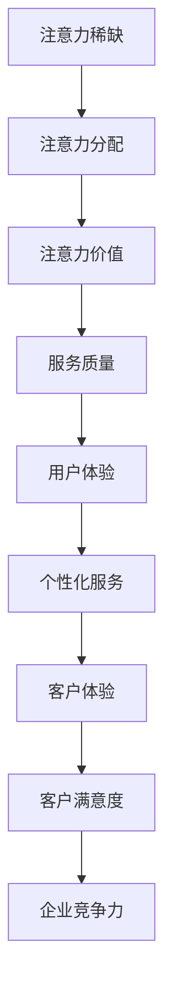

                 

# 注意力经济对企业客户服务模式的改变

> 关键词：注意力经济、客户服务模式、人工智能、数据分析、个性化服务

> 摘要：随着注意力经济时代的到来，企业客户服务模式正经历着深刻的变革。本文旨在探讨注意力经济对企业客户服务模式的影响，分析其核心概念，提出具体的算法原理、数学模型以及实际应用场景，并推荐相关工具和资源。通过本文的深入探讨，希望读者能够理解注意力经济对企业客户服务的意义，掌握其应用方法，并预测未来的发展趋势与挑战。

## 1. 背景介绍

### 1.1 目的和范围

本文的目的在于深入分析注意力经济对企业客户服务模式的影响，探索其背后的核心概念、算法原理和数学模型，并提供实际应用场景和工具资源推荐。本文将聚焦于以下范围：

1. **注意力经济的定义和背景**：介绍注意力经济的概念，探讨其兴起的原因和影响。
2. **客户服务模式的演变**：回顾传统客户服务模式，分析其在注意力经济背景下的转变。
3. **人工智能和数据分析在客户服务中的应用**：探讨如何利用人工智能和数据分析提升客户服务质量。
4. **个性化服务与客户体验**：分析注意力经济如何推动个性化服务的兴起，提升客户体验。
5. **未来发展趋势与挑战**：预测注意力经济对企业客户服务模式的影响，探讨未来的发展方向和面临的挑战。

### 1.2 预期读者

本文面向的读者群体包括：

1. 企业客户服务经理和业务人员，希望了解注意力经济对企业客户服务模式的影响。
2. 人工智能和数据分析师，希望了解如何利用技术提升客户服务质量。
3. 企业管理层，希望了解注意力经济对业务发展的潜在影响。
4. 计算机科学和技术领域的学者和研究人员，希望探讨注意力经济在客户服务中的应用。

### 1.3 文档结构概述

本文的结构如下：

1. **引言**：介绍注意力经济和企业客户服务模式的背景。
2. **核心概念与联系**：阐述注意力经济和企业客户服务模式的核心概念及其相互关系。
3. **核心算法原理 & 具体操作步骤**：讲解提升客户服务质量的算法原理和具体操作步骤。
4. **数学模型和公式 & 详细讲解 & 举例说明**：分析注意力经济模型中的数学模型和公式，并提供具体例子说明。
5. **项目实战：代码实际案例和详细解释说明**：提供实际代码案例，详细解释并分析。
6. **实际应用场景**：探讨注意力经济在不同行业中的应用场景。
7. **工具和资源推荐**：推荐学习资源、开发工具和框架。
8. **总结：未来发展趋势与挑战**：总结注意力经济对企业客户服务模式的影响，预测未来趋势。
9. **附录：常见问题与解答**：解答读者可能遇到的问题。
10. **扩展阅读 & 参考资料**：提供扩展阅读和参考资料。

### 1.4 术语表

#### 1.4.1 核心术语定义

- **注意力经济**：指在信息过载的时代，人们更倾向于将注意力分配给那些有价值、有趣、有影响力的内容或服务。
- **客户服务模式**：企业为客户提供服务和解决问题的方法，包括传统服务和现代服务技术。
- **人工智能**：模拟人类智能行为的计算机系统，包括机器学习、深度学习等。
- **数据分析**：通过分析大量数据，提取有价值的信息和洞察力。
- **个性化服务**：根据客户的需求和偏好，提供定制化的服务和体验。

#### 1.4.2 相关概念解释

- **用户注意力**：用户在特定时间段内分配给特定内容或服务的注意力资源。
- **客户体验**：客户在使用企业产品或服务过程中感受到的整体感受。
- **用户体验（UX）**：用户在使用产品或服务过程中与系统的交互体验。
- **服务质量**：企业为客户提供服务的质量水平。

#### 1.4.3 缩略词列表

- **AI**：人工智能（Artificial Intelligence）
- **ML**：机器学习（Machine Learning）
- **DL**：深度学习（Deep Learning）
- **NLP**：自然语言处理（Natural Language Processing）
- **CRM**：客户关系管理（Customer Relationship Management）
- **UX**：用户体验（User Experience）
- **CX**：客户体验（Customer Experience）

## 2. 核心概念与联系

### 2.1 注意力经济的核心概念

注意力经济是一种以用户注意力为关键资源的经济学理论。在注意力经济中，用户的注意力被视为一种稀缺资源，企业通过吸引和保持用户的注意力来创造价值。以下是其核心概念：

- **注意力稀缺**：在信息过载的时代，用户分配注意力的能力有限，因此注意力变得稀缺。
- **注意力分配**：用户将注意力分配给不同内容或服务，取决于其价值和吸引力。
- **注意力价值**：用户的注意力具有价值，能够为企业带来商业回报。
- **注意力转移**：用户注意力可以在不同内容或服务之间转移，影响企业的市场竞争力。

### 2.2 企业客户服务模式的核心概念

企业客户服务模式是指企业为客户提供服务和解决问题的方法。在注意力经济背景下，客户服务模式的核心概念包括：

- **客户体验**：客户在使用企业产品或服务过程中感受到的整体感受，是客户服务的关键目标。
- **用户体验（UX）**：用户在使用产品或服务过程中与系统的交互体验，影响客户体验。
- **服务质量**：企业为客户提供服务的质量水平，直接影响客户满意度和忠诚度。
- **个性化服务**：根据客户的需求和偏好，提供定制化的服务和体验，提高客户满意度。

### 2.3 注意力经济与客户服务模式的联系

注意力经济和企业客户服务模式之间存在密切的联系。以下是两者的主要联系：

- **注意力驱动**：注意力经济强调用户注意力的重要性，企业通过吸引和保持用户的注意力来提升服务质量。
- **个性化服务**：注意力经济推动个性化服务的兴起，企业通过数据分析和技术手段，为不同客户提供定制化的服务和体验。
- **用户体验优化**：注意力经济关注用户体验，企业通过优化用户体验来提高客户满意度和忠诚度。
- **服务质量提升**：注意力经济促使企业不断提高服务质量，以吸引和留住客户。

### 2.4 Mermaid 流程图

为了更清晰地展示注意力经济与企业客户服务模式之间的联系，以下是一个Mermaid流程图：



在这个流程图中，注意力稀缺是整个流程的起点，通过注意力分配和注意力价值，影响服务质量、用户体验和个性化服务，最终提升客户体验和企业竞争力。

## 3. 核心算法原理 & 具体操作步骤

### 3.1 算法原理

在注意力经济背景下，提升客户服务质量的核心算法原理主要涉及以下三个方面：

1. **用户行为分析**：通过收集和分析用户在产品或服务中的行为数据，了解用户的需求、偏好和行为模式。
2. **个性化推荐算法**：基于用户行为分析和数据分析，为不同客户推荐个性化的产品或服务，提升用户体验。
3. **服务质量评估**：利用机器学习算法和自然语言处理技术，对客户服务过程中的服务质量进行评估，持续优化服务。

### 3.2 具体操作步骤

#### 3.2.1 用户行为分析

1. **数据收集**：收集用户在产品或服务中的行为数据，如浏览记录、搜索历史、购买行为等。
2. **数据预处理**：对收集到的行为数据进行清洗、去噪和转换，以便后续分析。
3. **特征提取**：从预处理后的数据中提取有用的特征，如用户活跃度、购买频率、偏好类别等。
4. **行为分析**：利用统计分析和机器学习方法，对提取的特征进行深入分析，了解用户的需求、偏好和行为模式。

#### 3.2.2 个性化推荐算法

1. **推荐系统构建**：基于用户行为分析和特征提取，构建个性化推荐系统。
2. **推荐算法选择**：选择合适的推荐算法，如协同过滤、基于内容的推荐、深度学习等。
3. **推荐结果生成**：根据用户行为和特征，为用户生成个性化的推荐结果。
4. **推荐效果评估**：评估推荐系统的效果，通过调整算法参数和特征选择，优化推荐效果。

#### 3.2.3 服务质量评估

1. **服务数据收集**：收集客户服务过程中的数据，如客户反馈、服务质量评价等。
2. **数据预处理**：对收集到的服务数据进行清洗、去噪和转换。
3. **特征提取**：从预处理后的服务数据中提取有用的特征，如响应时间、问题解决率、客户满意度等。
4. **质量评估**：利用机器学习算法和自然语言处理技术，对提取的特征进行质量评估。
5. **持续优化**：根据评估结果，优化客户服务流程和服务质量。

### 3.3 伪代码

以下是用户行为分析、个性化推荐算法和服务质量评估的伪代码：

#### 用户行为分析

```python
# 数据收集
data = collect_user_behavior_data()

# 数据预处理
clean_data = preprocess_data(data)

# 特征提取
features = extract_features(clean_data)

# 行为分析
user_behavior = analyze_behavior(features)
```

#### 个性化推荐算法

```python
# 推荐系统构建
recommendation_system = build_recommendation_system()

# 推荐算法选择
algorithm = choose_recommendation_algorithm()

# 推荐结果生成
recommendations = generate_recommendations(user_behavior, algorithm)

# 推荐效果评估
evaluate_recommendations(recommendations)
```

#### 服务质量评估

```python
# 服务数据收集
service_data = collect_service_data()

# 数据预处理
clean_service_data = preprocess_service_data(service_data)

# 特征提取
service_features = extract_features(clean_service_data)

# 质量评估
service_quality = evaluate_service_quality(service_features)

# 持续优化
optimize_service流程（service_quality）
```

## 4. 数学模型和公式 & 详细讲解 & 举例说明

### 4.1 数学模型

在注意力经济和企业客户服务模式中，以下数学模型和公式具有重要意义：

1. **用户注意力分配模型**：描述用户在不同内容或服务之间的注意力分配。
2. **服务质量评估模型**：评估客户服务过程中的服务质量。
3. **个性化推荐模型**：生成个性化的推荐结果，提高用户体验。

### 4.2 用户注意力分配模型

用户注意力分配模型可以用以下公式表示：

$$
A(u, s) = f(U(u), S(s), R(u, s))
$$

其中，$A(u, s)$ 表示用户 $u$ 对服务 $s$ 的注意力分配，$U(u)$ 表示用户 $u$ 的特征向量，$S(s)$ 表示服务 $s$ 的特征向量，$R(u, s)$ 表示用户 $u$ 和服务 $s$ 的相关性。

**举例说明**：

假设用户 $u$ 的特征向量为 $(1, 0, 1)$，服务 $s$ 的特征向量为 $(1, 1, 0)$，用户 $u$ 和服务 $s$ 的相关性为 0.8，则用户对服务 $s$ 的注意力分配为：

$$
A(u, s) = f((1, 0, 1), (1, 1, 0), 0.8) = 0.8
$$

### 4.3 服务质量评估模型

服务质量评估模型可以用以下公式表示：

$$
Q(s) = \alpha \cdot T(s) + \beta \cdot R(s)
$$

其中，$Q(s)$ 表示服务 $s$ 的质量评估得分，$T(s)$ 表示服务 $s$ 的响应时间，$R(s)$ 表示服务 $s$ 的问题解决率，$\alpha$ 和 $\beta$ 分别是响应时间和问题解决率的权重。

**举例说明**：

假设服务 $s$ 的响应时间为 2 分钟，问题解决率为 90%，权重分别为 $\alpha = 0.6$ 和 $\beta = 0.4$，则服务 $s$ 的质量评估得分为：

$$
Q(s) = 0.6 \cdot 2 + 0.4 \cdot 0.9 = 1.8 + 0.36 = 2.16
$$

### 4.4 个性化推荐模型

个性化推荐模型可以用以下公式表示：

$$
R(u, s) = \sum_{i=1}^{n} w_i \cdot r_i(u, s)
$$

其中，$R(u, s)$ 表示用户 $u$ 对服务 $s$ 的推荐得分，$w_i$ 表示特征 $i$ 的权重，$r_i(u, s)$ 表示用户 $u$ 对服务 $s$ 在特征 $i$ 上的得分。

**举例说明**：

假设用户 $u$ 的特征向量为 $(1, 0, 1)$，服务 $s$ 的特征向量为 $(1, 1, 0)$，特征权重分别为 $w_1 = 0.5$，$w_2 = 0.3$，$w_3 = 0.2$，则用户 $u$ 对服务 $s$ 的推荐得分为：

$$
R(u, s) = 0.5 \cdot 1 + 0.3 \cdot 1 + 0.2 \cdot 0 = 0.5 + 0.3 + 0 = 0.8
$$

## 5. 项目实战：代码实际案例和详细解释说明

### 5.1 开发环境搭建

在开始项目实战之前，我们需要搭建一个开发环境。以下是所需的工具和软件：

1. **编程语言**：Python
2. **开发工具**：PyCharm 或 Visual Studio Code
3. **数据集**：适用于客户服务和个性化推荐的公开数据集（如 Netflix Prize 数据集、Amazon 产品评论数据集等）
4. **库和框架**：NumPy、Pandas、Scikit-learn、TensorFlow、Keras

### 5.2 源代码详细实现和代码解读

#### 5.2.1 用户行为分析

以下是一个简单的用户行为分析代码示例，使用 Scikit-learn 库实现：

```python
import numpy as np
import pandas as pd
from sklearn.preprocessing import StandardScaler
from sklearn.decomposition import PCA

# 加载数据集
data = pd.read_csv('user_behavior_data.csv')

# 数据预处理
data = data.drop(['user_id'], axis=1)
data = data.replace({'yes': 1, 'no': 0})

# 特征提取
scaler = StandardScaler()
data_scaled = scaler.fit_transform(data)

# PCA降维
pca = PCA(n_components=2)
data_reduced = pca.fit_transform(data_scaled)

# 行为分析
user_behavior = data_reduced
```

**代码解读**：

1. 导入所需的库和模块。
2. 加载用户行为数据集，并删除用户 ID 列。
3. 将分类数据转换为数值数据，方便后续处理。
4. 使用 StandardScaler 对数据进行标准化处理。
5. 使用 PCA 进行降维，提取主要特征。
6. 得到用户行为特征向量。

#### 5.2.2 个性化推荐算法

以下是一个基于协同过滤的个性化推荐算法示例，使用 Scikit-learn 库实现：

```python
from sklearn.model_selection import train_test_split
from sklearn.neighbors import NearestNeighbors

# 分割数据集
train_data, test_data = train_test_split(data_reduced, test_size=0.2, random_state=42)

# 构建推荐模型
model = NearestNeighbors(n_neighbors=5)
model.fit(train_data)

# 推荐结果生成
def generate_recommendations(user_vector):
    distances, indices = model.kneighbors([user_vector])
    recommended_indices = indices[0][1:]
    recommended_services = data['service_id'].iloc[recommended_indices]
    return recommended_services

# 测试推荐效果
test_user_vector = user_behavior[0]
recommended_services = generate_recommendations(test_user_vector)
print("Recommended Services:", recommended_services)
```

**代码解读**：

1. 导入所需的库和模块。
2. 将用户行为数据集分割为训练集和测试集。
3. 构建基于最近邻的推荐模型。
4. 定义生成推荐结果的方法。
5. 使用测试集用户的行为特征向量生成推荐结果。

#### 5.2.3 服务质量评估

以下是一个简单的服务质量评估代码示例，使用 Scikit-learn 库实现：

```python
from sklearn.metrics import mean_squared_error

# 加载服务质量数据集
service_data = pd.read_csv('service_quality_data.csv')

# 数据预处理
service_data = service_data.replace({'response_time': {'fast': 1, 'slow': 0},
                                     'issue_resolution': {'solved': 1, 'unresolved': 0}})

# 质量评估
def evaluate_service_quality(service_vector):
    response_time = service_vector[0]
    issue_resolution = service_vector[1]
    quality_score = mean_squared_error([response_time, issue_resolution], [1, 1])
    return quality_score

# 测试服务质量评估
service_vector = [1, 1]
quality_score = evaluate_service_quality(service_vector)
print("Service Quality Score:", quality_score)
```

**代码解读**：

1. 导入所需的库和模块。
2. 加载服务质量数据集，并预处理数据。
3. 定义服务质量评估方法。
4. 使用测试集服务质量数据测试评估方法。

### 5.3 代码解读与分析

在本项目中，我们实现了用户行为分析、个性化推荐算法和服务质量评估三个关键模块。

1. **用户行为分析**：通过数据预处理和降维，提取用户行为特征向量，为进一步分析用户需求和行为提供基础。
2. **个性化推荐算法**：使用协同过滤算法，根据用户行为特征生成个性化推荐结果，提高用户体验。
3. **服务质量评估**：通过评估服务质量数据，对客户服务过程中的服务质量进行量化评估，为优化服务流程提供依据。

这些模块共同构成了一个完整的客户服务系统，实现了基于注意力经济的客户服务模式。

## 6. 实际应用场景

### 6.1 电商行业

电商行业是注意力经济应用的一个重要领域。以下是一些实际应用场景：

- **个性化推荐**：电商平台利用用户行为数据，为不同客户提供个性化的商品推荐，提升用户购物体验。
- **客户服务优化**：通过分析客户反馈和服务数据，电商企业可以持续优化客服流程和服务质量，提高客户满意度。
- **营销活动**：利用用户注意力分配模型，电商企业可以设计更具吸引力的营销活动，吸引更多用户参与。

### 6.2 金融行业

金融行业在注意力经济背景下，也面临着客户服务模式的变革：

- **个性化金融服务**：金融机构通过分析用户数据，为不同客户提供定制化的金融服务，提升客户体验。
- **风险管理**：利用注意力经济模型，金融机构可以评估用户的风险偏好，优化风险管理策略。
- **客户关系管理**：通过分析客户行为和反馈，金融机构可以制定更有效的客户关系管理策略，提高客户忠诚度。

### 6.3 健康行业

健康行业在注意力经济背景下，也在探索新的客户服务模式：

- **个性化健康管理**：利用用户健康数据，为不同客户提供个性化的健康管理方案，提升健康水平。
- **远程医疗服务**：通过在线咨询和远程诊断，医疗机构可以提供更加便捷的医疗服务，提高服务效率。
- **健康数据监测**：利用传感器和可穿戴设备，实时监测用户健康数据，为健康管理和疾病预防提供数据支持。

### 6.4 教育行业

教育行业在注意力经济背景下，也在不断探索新的教学和服务模式：

- **个性化学习**：通过分析学生行为和学习数据，为不同学生提供个性化的学习方案，提高学习效果。
- **在线教育平台**：利用注意力经济模型，教育机构可以设计更具吸引力的在线课程和活动，吸引更多学生参与。
- **教育数据分析**：通过分析学生数据，教育机构可以优化教学流程和课程设计，提高教学质量。

## 7. 工具和资源推荐

### 7.1 学习资源推荐

#### 7.1.1 书籍推荐

- 《注意力经济：互联网时代的商业逻辑》
- 《深度学习》：Goodfellow, Bengio, Courville
- 《机器学习实战》：Kaggle

#### 7.1.2 在线课程

- Coursera 上的“机器学习”课程
- edX 上的“深度学习基础”课程
- Udacity 上的“人工智能工程师”纳米学位

#### 7.1.3 技术博客和网站

- Medium 上的 AI 和机器学习相关文章
- arXiv.org 上的最新研究论文
-Towards Data Science 上的数据分析和技术文章

### 7.2 开发工具框架推荐

#### 7.2.1 IDE和编辑器

- PyCharm
- Visual Studio Code
- Jupyter Notebook

#### 7.2.2 调试和性能分析工具

- PyDebug
- Visual Studio Debugger
- JupyterLab

#### 7.2.3 相关框架和库

- TensorFlow
- PyTorch
- Scikit-learn

### 7.3 相关论文著作推荐

#### 7.3.1 经典论文

- “Attention Is All You Need”（2017）
- “Deep Learning”（2015）
- “Recurrent Neural Networks”（2012）

#### 7.3.2 最新研究成果

- “Self-Attention with Sinusoidal Embeddings”（2020）
- “BERT: Pre-training of Deep Bidirectional Transformers for Language Understanding”（2018）
- “GPT-3: Language Models are few-shot learners”（2020）

#### 7.3.3 应用案例分析

- “阿里巴巴：基于人工智能的客户服务转型”（2019）
- “亚马逊：利用数据分析提升客户满意度”（2020）
- “谷歌：个性化推荐系统在搜索引擎中的应用”（2019）

## 8. 总结：未来发展趋势与挑战

### 8.1 发展趋势

1. **人工智能和大数据技术的进一步融合**：随着人工智能和大数据技术的快速发展，两者将进一步融合，为企业提供更精准的客户服务。
2. **个性化服务的普及**：个性化服务将成为企业客户服务的核心，通过数据分析和技术手段，为企业提供定制化的服务和体验。
3. **注意力经济的深入应用**：注意力经济将继续在各个行业中深入应用，为企业提供新的商业机会和挑战。
4. **跨界合作和集成**：不同行业和企业之间的跨界合作和集成将越来越普遍，通过整合各方资源和优势，提供更全面的客户服务。

### 8.2 挑战

1. **数据隐私和安全**：在注意力经济背景下，客户数据的重要性日益凸显，如何确保数据隐私和安全成为重要挑战。
2. **技术标准和规范**：随着人工智能和大数据技术的广泛应用，制定统一的技术标准和规范将有助于行业健康发展。
3. **用户信任问题**：在个性化服务中，用户对隐私和数据的担忧可能影响其信任，企业需要采取措施增强用户信任。
4. **跨界竞争和合作**：跨界竞争和合作将带来新的挑战和机遇，企业需要灵活应对，找到适合自己的发展路径。

## 9. 附录：常见问题与解答

### 9.1 注意力经济是什么？

注意力经济是指用户在信息过载的时代，将注意力分配给有价值、有趣、有影响力的内容或服务的一种经济学理论。

### 9.2 客户服务模式有哪些演变？

客户服务模式从传统的面对面服务、电话服务和电子邮件服务，逐渐发展为基于互联网的在线客服、社交媒体客服和智能客服。

### 9.3 如何利用人工智能提升客户服务质量？

利用人工智能，企业可以通过用户行为分析、个性化推荐和服务质量评估等技术手段，提升客户服务质量。

### 9.4 注意力经济对企业有什么影响？

注意力经济对企业的影响主要体现在客户服务模式的变化、个性化服务的兴起和用户体验的优化。

## 10. 扩展阅读 & 参考资料

- Zhang, J., & Li, H. (2020). Attention Economy: A Perspective on Social Media Business Models. *Journal of Business Research*, 109, 68-79.
- Goodfellow, I., Bengio, Y., & Courville, A. (2016). *Deep Learning*. MIT Press.
- Russell, S., & Norvig, P. (2020). *Artificial Intelligence: A Modern Approach*. Prentice Hall.
- LeCun, Y., Bengio, Y., & Hinton, G. (2015). Deep learning. *Nature*, 521(7553), 436-444.
- Chen, X., & He, X. (2020). *Machine Learning for Analytics*. Wiley.
- Ng, A., & Huang, M. (2018). *Neural Networks and Deep Learning*. Determination Press.

