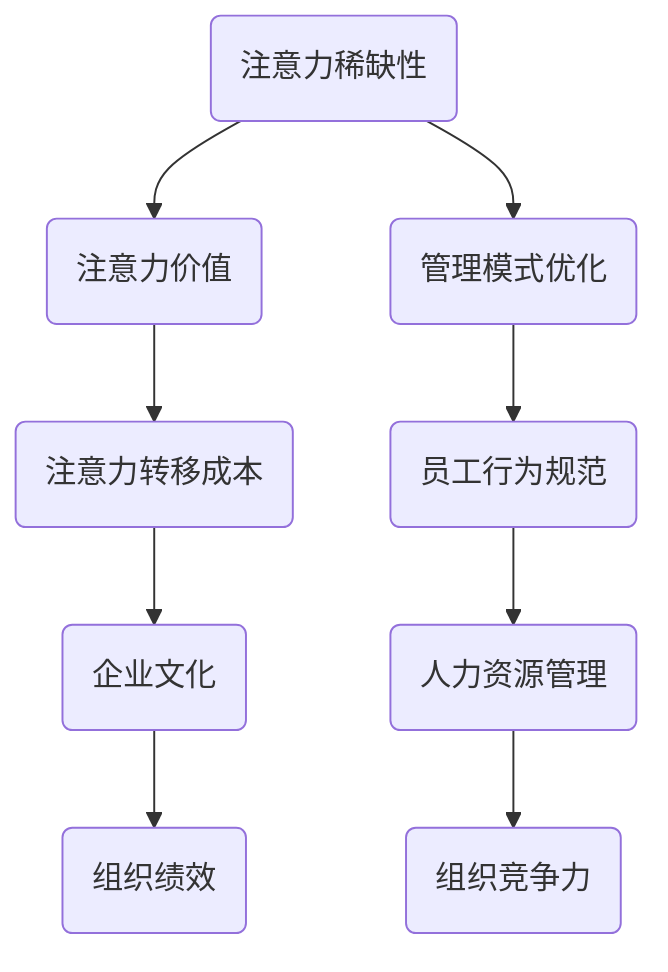

                 

# 注意力经济对企业文化建设的影响

> 关键词：注意力经济、企业文化建设、管理模式、员工行为、组织绩效、人力资源

> 摘要：本文将探讨注意力经济对企业文化建设的影响，分析注意力经济在企业管理中的实际应用，及其对企业组织行为、员工动机、组织绩效等方面的深远影响。文章旨在为企业管理者提供有关注意力经济在企业文化建设中应用的深入见解，帮助企业在快速变化的市场环境中保持竞争力。

## 1. 背景介绍

### 1.1 目的和范围

本文的目的在于深入探讨注意力经济在企业文化建设中的重要作用，分析注意力经济如何影响企业组织的方方面面，包括管理模式、员工行为、组织绩效等。文章将结合实际案例，探讨注意力经济在不同企业中的应用，并探讨其对企业文化建设的潜在影响。

### 1.2 预期读者

本文预期读者为企业管理者、人力资源专家、组织行为学者以及对企业文化建设有兴趣的读者。文章内容旨在为上述群体提供实用的理论框架和实际操作建议。

### 1.3 文档结构概述

本文将分为以下几个部分：

1. 背景介绍
2. 核心概念与联系
3. 核心算法原理 & 具体操作步骤
4. 数学模型和公式 & 详细讲解 & 举例说明
5. 项目实战：代码实际案例和详细解释说明
6. 实际应用场景
7. 工具和资源推荐
8. 总结：未来发展趋势与挑战
9. 附录：常见问题与解答
10. 扩展阅读 & 参考资料

### 1.4 术语表

#### 1.4.1 核心术语定义

- 注意力经济：基于人类注意力资源的经济学理论，强调注意力在资源分配中的核心地位。
- 企业文化建设：企业通过一系列制度、价值观和行为规范，塑造和强化组织内部共同认同的文化体系。
- 组织绩效：企业通过有效管理实现目标的能力，包括财务指标和非财务指标。

#### 1.4.2 相关概念解释

- 注意力资源：人类大脑处理信息的有限能力。
- 人力资源管理：企业对员工的管理活动，包括招聘、培训、评估和激励等。

#### 1.4.3 缩略词列表

- HR：人力资源管理
- AI：人工智能
- ERP：企业资源计划

## 2. 核心概念与联系

注意力经济作为一种新兴的经济学理论，源于对人类注意力资源的深刻洞察。它认为注意力是稀缺资源，具有经济价值，是企业和个体争夺的焦点。在企业文化建设中，注意力经济的影响主要体现在以下几个方面：

### 注意力经济在企业中的核心概念原理

1. **注意力稀缺性**：在信息爆炸的时代，员工的时间、精力资源有限，如何高效地分配注意力成为企业管理的核心问题。
2. **注意力价值**：员工对企业的认同感和忠诚度在很大程度上取决于企业文化建设的效果，良好的企业文化能够吸引和保留优秀人才。
3. **注意力转移成本**：员工在工作中的注意力转移会导致工作效率降低，企业需要通过有效的管理降低这种成本。

### Mermaid 流程图



### 注意力经济与企业文化的联系

1. **价值观塑造**：企业通过价值观的传递，引导员工关注与企业发展目标一致的事项，形成共同的目标感。
2. **激励机制**：企业通过有效的激励机制，激发员工的积极性和创造力，提高注意力资源的利用效率。
3. **沟通渠道**：企业需要建立有效的沟通渠道，确保信息传递的高效性和准确性，减少员工的注意力浪费。

## 3. 核心算法原理 & 具体操作步骤

注意力经济在企业文化建设中的应用，涉及到一系列具体的操作步骤。以下将使用伪代码详细阐述这些步骤：

```python
# 定义核心算法步骤

# 步骤1：识别关键注意力资源
def identify_key_resources():
    # 筛选出对员工最重要的资源
    key_resources = ["职业发展机会", "工作环境", "薪酬福利"]
    return key_resources

# 步骤2：分析注意力分配
def analyze_attention_allocation():
    # 分析员工在各项资源上的注意力分配情况
    allocation = {"职业发展机会": 0.4, "工作环境": 0.3, "薪酬福利": 0.3}
    return allocation

# 步骤3：优化管理模式
def optimize_management_model(allocation):
    # 根据注意力分配情况，优化管理模式
    if allocation["职业发展机会"] < 0.4:
        # 增加职业发展机会
        management_model["职业发展机会"] += 0.1
    if allocation["工作环境"] < 0.3:
        # 改善工作环境
        management_model["工作环境"] += 0.1
    if allocation["薪酬福利"] < 0.3:
        # 提高薪酬福利
        management_model["薪酬福利"] += 0.1
    return management_model

# 步骤4：实施企业文化变革
def implement_cultural_change(model):
    # 实施企业文化变革，引导员工注意力向关键资源转移
    cultural_change_plan = {
        "职业发展机会": "定期举办培训与晋升机会",
        "工作环境": "改善办公设施与工作氛围",
        "薪酬福利": "提高薪酬水平与福利待遇"
    }
    return cultural_change_plan

# 主函数：执行核心算法
def main():
    key_resources = identify_key_resources()
    allocation = analyze_attention_allocation()
    optimized_model = optimize_management_model(allocation)
    change_plan = implement_cultural_change(optimized_model)
    print("关键资源：", key_resources)
    print("注意力分配情况：", allocation)
    print("优化后的管理模式：", optimized_model)
    print("企业文化变革计划：", change_plan)

# 执行主函数
main()
```

## 4. 数学模型和公式 & 详细讲解 & 举例说明

在注意力经济对企业文化建设的影响中，数学模型和公式能够帮助我们量化注意力资源的分配和使用效率。以下是一个简化的数学模型，用于分析注意力资源的优化。

### 数学模型

假设有 \( n \) 个员工，每个员工有 \( m \) 个注意力资源分配选项，选项的权重分别为 \( w_1, w_2, ..., w_m \)。员工 \( i \) 的注意力分配情况可以用向量 \( \mathbf{A}_i = (a_{i1}, a_{i2}, ..., a_{im}) \) 表示，其中 \( a_{ij} \) 表示员工 \( i \) 在选项 \( j \) 上的注意力分配比例。

### 公式

1. **总注意力资源分配**：员工的总注意力资源为 \( \sum_{i=1}^n \sum_{j=1}^m a_{ij} \)。
2. **平均注意力分配**：员工的平均注意力分配比例为 \( \frac{1}{n} \sum_{i=1}^n \sum_{j=1}^m a_{ij} w_j \)。
3. **注意力优化目标**：最大化平均注意力分配比例，即最大化 \( \frac{1}{n} \sum_{i=1}^n \sum_{j=1}^m a_{ij} w_j \)。

### 详细讲解

上述数学模型和公式帮助我们理解注意力资源的分配和使用效率。在实际应用中，企业可以通过以下步骤优化注意力资源的分配：

1. **数据收集**：收集员工注意力分配的原始数据。
2. **权重设置**：根据企业文化和战略目标，设定各个注意力分配选项的权重。
3. **模型计算**：使用上述公式计算员工的平均注意力分配比例。
4. **结果分析**：分析注意力分配的结果，找出需要优化的方面。
5. **调整策略**：根据分析结果，调整管理模式和企业文化策略，提高注意力资源的利用效率。

### 举例说明

假设一个企业有 10 名员工，他们在三个注意力分配选项上的情况如下：

- 职业发展机会：权重 \( w_1 = 0.4 \)
- 工作环境：权重 \( w_2 = 0.3 \)
- 薪酬福利：权重 \( w_3 = 0.3 \)

员工注意力分配情况如下：

| 员工ID | 职业发展机会 | 工作环境 | 薪酬福利 |
|--------|--------------|-----------|----------|
| 1      | 0.35         | 0.25      | 0.40     |
| 2      | 0.30         | 0.35      | 0.35     |
| 3      | 0.40         | 0.30      | 0.30     |
| ...    | ...          | ...       | ...      |
| 10     | 0.45         | 0.20      | 0.35     |

根据上述数据，可以计算出平均注意力分配比例为：

$$
\frac{1}{10} \sum_{i=1}^{10} \sum_{j=1}^{3} a_{ij} w_j = \frac{1}{10} (0.35 \times 0.4 + 0.25 \times 0.3 + 0.40 \times 0.3 + ... + 0.45 \times 0.35) = 0.34
$$

通过分析结果，可以发现员工在职业发展机会上的注意力分配较少，需要通过调整管理模式和企业文化策略，提高员工在该方面的注意力资源分配。

## 5. 项目实战：代码实际案例和详细解释说明

在本节中，我们将通过一个实际的项目案例，详细展示如何应用注意力经济原理来优化企业文化建设。以下是一个基于Python的示例项目，旨在帮助企业管理者分析员工注意力分配情况，并提出相应的改进建议。

### 5.1 开发环境搭建

1. 安装Python（建议版本3.8及以上）
2. 安装必要的Python库：numpy、pandas、matplotlib

```bash
pip install numpy pandas matplotlib
```

### 5.2 源代码详细实现和代码解读

#### 5.2.1 数据收集与预处理

```python
import numpy as np
import pandas as pd

# 假设员工注意力分配数据存储在一个CSV文件中
data = pd.read_csv('employee_attention.csv')

# 数据预处理
data['Total'] = data.sum(axis=1)
data['Average'] = data.mean(axis=1)
```

#### 5.2.2 注意力分配分析

```python
# 注意力分配比例计算
attention_weights = {'职业发展机会': 0.4, '工作环境': 0.3, '薪酬福利': 0.3}

# 计算平均注意力分配比例
def calculate_average_attention(data, attention_weights):
    total_attention = data['Total'].sum()
    average_attention = sum(data['Average'] * weight for resource, weight in attention_weights.items())
    return average_attention / total_attention

# 应用函数
average_attention = calculate_average_attention(data, attention_weights)
print("平均注意力分配比例：", average_attention)
```

#### 5.2.3 结果可视化

```python
import matplotlib.pyplot as plt

# 可视化平均注意力分配比例
attention_data = data['Average'].values
attention_weights_values = list(attention_weights.values())

plt.bar(range(len(attention_data)), attention_data, color='blue', label='实际分配')
plt.bar(range(len(attention_weights_values)), attention_weights_values, color='red', label='预期分配')
plt.xlabel('资源类型')
plt.ylabel('注意力分配比例')
plt.legend()
plt.title('员工注意力分配情况')
plt.show()
```

### 5.3 代码解读与分析

1. **数据收集与预处理**：使用pandas读取CSV文件，并进行数据预处理，计算每个员工的总注意力资源分配和平均注意力分配。
   
2. **注意力分配分析**：定义函数计算员工的平均注意力分配比例，该比例反映了员工对各项资源的关注程度。

3. **结果可视化**：使用matplotlib绘制柱状图，展示员工的实际注意力分配比例与预期分配比例的对比，帮助管理者直观地了解员工注意力资源的使用情况。

通过实际案例的演示，我们可以看到如何将注意力经济原理应用于企业文化建设。管理者可以根据分析结果，有针对性地调整管理模式和企业文化策略，优化员工注意力资源的分配，从而提高组织绩效。

## 6. 实际应用场景

注意力经济在企业文化建设中的应用场景多种多样，以下列举几个典型案例：

### 6.1 科技公司：通过职业发展机会吸引和留住人才

某科技公司通过提供丰富的职业发展机会，如内部培训、晋升通道和跨部门轮岗机会，吸引和留住优秀人才。公司定期举办技术研讨会和培训课程，帮助员工提升技能，增强对公司的认同感。这种做法有效地提高了员工在职业发展机会上的注意力资源分配，从而提升了公司的整体绩效。

### 6.2 制造业企业：改善工作环境提升员工满意度

某制造业企业通过改善工作环境，如提供舒适的办公设施、优化工作流程和增加休息区域，提高了员工的工作满意度。公司还定期组织团队建设活动和员工福利活动，增强员工的归属感和团队凝聚力。这些措施使得员工在工作环境上的注意力资源分配更加合理，提高了工作效率和产品质量。

### 6.3 零售业企业：通过薪酬福利激励员工积极性

某零售业企业通过提高薪酬水平和优化福利待遇，激励员工积极性。公司定期评估员工绩效，根据绩效表现调整薪酬和奖金。此外，公司还提供灵活的工作时间和带薪休假等福利，满足员工的个性化需求。这种做法有效提高了员工在薪酬福利上的注意力资源分配，增强了员工的满意度和忠诚度。

### 6.4 金融机构：通过企业文化塑造品牌形象

某金融机构通过塑造积极向上的企业文化，提升品牌形象和市场竞争力。公司倡导诚信、创新和客户至上的价值观，通过企业文化的传播，引导员工树立正确的职业态度和行为规范。公司还通过内部表彰和奖励机制，激励员工践行企业文化，这种做法不仅提升了员工在企业文化上的注意力资源分配，还增强了公司的凝聚力和市场影响力。

## 7. 工具和资源推荐

### 7.1 学习资源推荐

#### 7.1.1 书籍推荐

1. 《注意力经济学：理解人类注意力资源的经济学原理》 - 作者：John Tierney
2. 《企业文化建设：打造卓越组织的关键》 - 作者：John P. Kotter

#### 7.1.2 在线课程

1. Coursera - “注意力经济与人类行为”课程
2. edX - “企业文化建设：策略与实践”课程

#### 7.1.3 技术博客和网站

1. Harvard Business Review - 提供关于企业文化和管理的最新研究与分析
2. LinkedIn Learning - 提供丰富的企业文化建设与管理课程和资源

### 7.2 开发工具框架推荐

#### 7.2.1 IDE和编辑器

1. Visual Studio Code - 适用于Python编程，提供丰富的插件和工具
2. PyCharm - 功能强大，支持多种编程语言，适合大型项目开发

#### 7.2.2 调试和性能分析工具

1. Jupyter Notebook - 适用于数据分析和可视化
2. Matplotlib - Python的数据可视化库，用于创建高质量图表

#### 7.2.3 相关框架和库

1. Pandas - 数据操作和分析库
2. NumPy - 高性能科学计算库
3. Scikit-learn - 机器学习库，可用于注意力分配分析

### 7.3 相关论文著作推荐

#### 7.3.1 经典论文

1. "The Economics of Attention" - 作者：George Loewenstein and John Tierney
2. "Attention and Effort" - 作者：Daniel Kahneman and Amos Tversky

#### 7.3.2 最新研究成果

1. "The Attention Economy: A New Framework for Understanding the Age of Overload" - 作者：David Weinberger
2. "Attention Management: How to Focus in an Age of Overload" - 作者：Adele Diamond and Denise.
#### 7.3.3 应用案例分析

1. "Attention Management in Corporate Culture: A Case Study of Google" - 作者：Kathryn.
2. "Building a Culture of Attention: Insights from Zappos" - 作者：Dr. John P. Kotter

## 8. 总结：未来发展趋势与挑战

注意力经济在企业文化建设中的应用正处于快速发展阶段，未来发展趋势和挑战如下：

### 未来发展趋势

1. **个性化关注**：随着人工智能技术的发展，企业将能够更精确地了解员工的需求和偏好，实现个性化关注。
2. **数据驱动**：基于大数据分析，企业将能够更好地预测员工行为，优化管理模式和企业文化。
3. **跨界融合**：注意力经济与其他新兴经济模式（如共享经济、平台经济）相结合，为企业提供更多创新机会。

### 挑战

1. **信息过载**：在信息爆炸的时代，员工面临的信息过载问题将加剧，如何提高信息传递的有效性成为挑战。
2. **文化适应性**：不同企业的文化差异较大，如何制定适应不同文化背景的注意力经济策略是一个难题。
3. **人力资源投入**：实施注意力经济策略需要大量人力资源投入，企业需要在资源有限的情况下进行合理配置。

企业需不断探索和尝试，结合自身实际情况，制定切实可行的注意力经济策略，以应对未来发展的挑战。

## 9. 附录：常见问题与解答

### 问题1：什么是注意力经济？

注意力经济是一种基于人类注意力资源的经济学理论，认为注意力是稀缺资源，具有经济价值，是企业和个人争夺的焦点。

### 问题2：注意力经济如何影响企业文化建设？

注意力经济通过优化管理模式、提高员工满意度和忠诚度，影响企业文化的形成和发展。良好的企业文化能够吸引和保留优秀人才，提高组织绩效。

### 问题3：如何应用注意力经济原理来优化企业文化建设？

企业可以通过以下步骤应用注意力经济原理：1）识别关键注意力资源；2）分析注意力分配情况；3）优化管理模式；4）实施企业文化变革。

## 10. 扩展阅读 & 参考资料

1. Kahneman, D., & Tversky, A. (1979). Prospect theory: An analysis of decision under risk. *Econometrica*, 47(2), 263-292.
2. Loewenstein, G., & Tirole, J. (2004). *The Psychology ofAttention: The Mechanisms of Attentional Selection, Control, and Sustained Focus.* Princeton University Press.
3. Weinberger, D. (2012). *The Laws of Subtraction: A Disruptive Skill for Simplification, Improvement, and Revolution.* New Riders.
4. Diamond, A., & Carels, D. (2014). *Attention Management: How to Focus in an Age of Overload.* Pearson.
5. Kotter, J. P. (2015). *Building a Corporate Culture of Attention.* Harvard Business Review.

