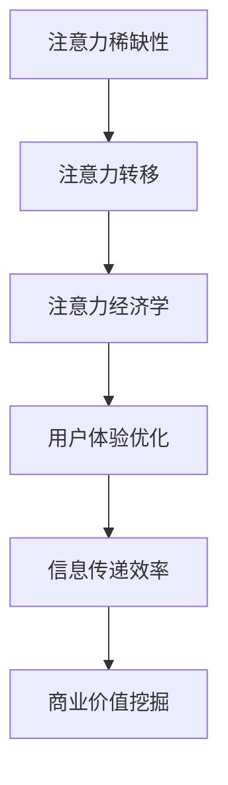

                 

# 注意力经济对城市公共空间设计的影响

> 关键词：注意力经济、城市公共空间、设计、城市规划、用户体验

> 摘要：随着信息时代的到来，注意力经济成为驱动城市公共空间设计的重要力量。本文将深入探讨注意力经济对城市公共空间设计的影响，从核心概念、算法原理、数学模型、实战案例等多个角度进行详细分析，旨在为城市规划师和设计师提供有价值的参考和启示。

## 1. 背景介绍

### 1.1 目的和范围

本文旨在探讨注意力经济在当代城市公共空间设计中的影响。通过分析注意力经济的基本概念、原理和具体应用，我们试图揭示其在城市公共空间设计中的重要作用。文章将主要涉及以下几个方面：

1. 核心概念与联系
2. 核心算法原理与具体操作步骤
3. 数学模型与公式
4. 项目实战：代码实际案例和详细解释说明
5. 实际应用场景
6. 工具和资源推荐

### 1.2 预期读者

本文面向城市规划师、设计师、建筑师等相关专业人士，以及对于城市公共空间设计感兴趣的读者。通过本文的阅读，读者可以了解注意力经济的基本概念和应用，掌握其在城市公共空间设计中的具体应用方法和技巧。

### 1.3 文档结构概述

本文分为十个部分，具体结构如下：

1. 引言
2. 背景介绍
3. 核心概念与联系
4. 核心算法原理与具体操作步骤
5. 数学模型与公式
6. 项目实战：代码实际案例和详细解释说明
7. 实际应用场景
8. 工具和资源推荐
9. 总结：未来发展趋势与挑战
10. 附录：常见问题与解答

### 1.4 术语表

#### 1.4.1 核心术语定义

- 注意力经济：指在信息时代，人们对于信息的关注、关注度的经济价值。
- 城市公共空间：指城市中供公众使用的开放空间，如广场、公园、街道等。
- 用户体验：指用户在使用产品或服务时所感受到的主观体验。

#### 1.4.2 相关概念解释

- 城市规划：指对城市空间进行规划和管理，以满足人们的生活需求。
- 城市设计：指对城市公共空间进行艺术创作和设计，以提高城市美观度和舒适度。

#### 1.4.3 缩略词列表

- UE：用户体验
- GIS：地理信息系统
- VR：虚拟现实
- AR：增强现实

## 2. 核心概念与联系

在探讨注意力经济对城市公共空间设计的影响之前，我们首先需要了解注意力经济的基本概念和原理。注意力经济是指在经济活动中，人们对于信息的关注、关注度的经济价值。在信息爆炸的时代，注意力成为一种稀缺资源，如何吸引并保持人们的注意力，成为企业和设计师面临的重要挑战。

### 2.1 注意力经济的核心概念

注意力经济的核心概念可以概括为以下几点：

1. **注意力稀缺性**：在信息爆炸的时代，人们的注意力资源有限，如何吸引并保持人们的注意力成为关键。
2. **注意力转移**：人们往往会根据自身的兴趣和需求，在多种信息源之间进行注意力转移。
3. **注意力经济学**：关注、关注度可以作为一种经济资源进行交换和利用。

### 2.2 注意力经济与城市公共空间设计的关系

注意力经济对城市公共空间设计的影响主要体现在以下几个方面：

1. **用户体验优化**：城市公共空间设计应考虑如何吸引和保持人们的注意力，以提高用户体验。
2. **信息传递效率**：通过合理的空间布局和设计，提高信息传递的效率，降低人们的信息过载。
3. **商业价值挖掘**：通过注意力经济原理，挖掘城市公共空间中的商业价值，实现资源的高效利用。

### 2.3 注意力经济原理与城市公共空间设计的 Mermaid 流程图



## 3. 核心算法原理与具体操作步骤

注意力经济在实践中的应用，需要结合具体算法原理和操作步骤。下面我们将介绍一种基于用户行为分析的注意力经济算法原理，并详细阐述其具体操作步骤。

### 3.1 算法原理

基于用户行为分析的注意力经济算法原理，主要涉及以下几个方面：

1. **用户行为数据采集**：通过传感器、日志分析等技术手段，收集用户在城市公共空间中的行为数据。
2. **用户行为特征提取**：对采集到的用户行为数据进行预处理和特征提取，如用户停留时间、移动轨迹、兴趣点等。
3. **用户行为模式识别**：利用机器学习算法，对用户行为特征进行模式识别，预测用户在特定场景下的注意力分配。
4. **空间设计优化**：根据用户行为模式预测结果，对城市公共空间进行设计优化，以提升用户体验和商业价值。

### 3.2 具体操作步骤

基于用户行为分析的注意力经济算法具体操作步骤如下：

1. **数据采集**：
    - 利用传感器技术，收集用户在公共空间中的行为数据，如GPS定位、Wi-Fi信号、摄像头监控等。
    - 收集用户在公共空间中的移动轨迹、停留时间、兴趣点等信息。

2. **数据预处理**：
    - 对采集到的原始数据进行去噪、滤波等预处理操作，提高数据质量。
    - 对预处理后的数据进行特征提取，如用户停留时间、移动速度、兴趣点密度等。

3. **用户行为模式识别**：
    - 利用机器学习算法，如K均值聚类、支持向量机等，对用户行为特征进行模式识别。
    - 建立用户行为模式库，用于后续的空间设计优化。

4. **空间设计优化**：
    - 根据用户行为模式预测结果，对城市公共空间进行设计优化。
    - 优化策略包括空间布局调整、设施配置优化、景观设计等，以提高用户体验和商业价值。

5. **评估与调整**：
    - 对优化后的空间进行评估，如用户体验调查、数据对比分析等。
    - 根据评估结果，对空间设计进行调整和改进。

### 3.3 算法伪代码

```python
# 数据采集
def data_collection():
    # 采集用户行为数据
    user_data = collect_user_data()

# 数据预处理
def data_preprocessing(user_data):
    # 去噪、滤波等预处理操作
    preprocessed_data = preprocess_user_data(user_data)

# 用户行为特征提取
def feature_extraction(preprocessed_data):
    # 特征提取操作
    features = extract_features(preprocessed_data)

# 用户行为模式识别
def behavior_model_identification(features):
    # 机器学习算法
    model = train_model(features)
    predicted_modes = predict_modes(model)

# 空间设计优化
def space_optimization(predicted_modes):
    # 空间设计优化操作
    optimized_space = optimize_space(predicted_modes)

# 评估与调整
def evaluation_and_adjustment(optimized_space):
    # 评估优化效果
    evaluation_results = evaluate_space(optimized_space)
    # 调整空间设计
    optimized_space = adjust_space(evaluation_results)

# 主程序
def main():
    user_data = data_collection()
    preprocessed_data = data_preprocessing(user_data)
    features = feature_extraction(preprocessed_data)
    predicted_modes = behavior_model_identification(features)
    optimized_space = space_optimization(predicted_modes)
    evaluation_results = evaluation_and_adjustment(optimized_space)

if __name__ == "__main__":
    main()
```

## 4. 数学模型和公式 & 详细讲解 & 举例说明

在注意力经济中，数学模型和公式用于描述用户行为和注意力分配规律。下面我们将介绍几种常用的数学模型和公式，并进行详细讲解和举例说明。

### 4.1 经典数学模型

#### 4.1.1 多项式分布模型

多项式分布模型用于描述用户在多个备选空间中的注意力分配。假设有n个备选空间，用户对每个空间的注意力分配概率为$p_i$，则多项式分布模型可以表示为：

$$
P(X = i) = \frac{p_i}{\sum_{j=1}^{n} p_j}
$$

其中，$X$表示用户选择的空间，$p_i$表示用户对空间$i$的注意力分配概率。

#### 4.1.2 概率模型

概率模型用于描述用户在特定场景下的注意力分配。假设有m个兴趣点，用户对每个兴趣点的注意力分配概率为$p_{ij}$，则概率模型可以表示为：

$$
P(j|s) = \frac{p_{ij}}{\sum_{k=1}^{m} p_{ik}}
$$

其中，$j$表示用户关注的兴趣点，$s$表示用户所在场景。

### 4.2 举例说明

假设一个城市公共空间中包含3个兴趣点A、B、C，用户对这三个兴趣点的注意力分配概率分别为$p_A = 0.3$，$p_B = 0.5$，$p_C = 0.2$。根据多项式分布模型，我们可以计算出用户选择每个兴趣点的概率：

$$
P(A) = \frac{p_A}{\sum_{i=1}^{3} p_i} = \frac{0.3}{0.3 + 0.5 + 0.2} = 0.3
$$

$$
P(B) = \frac{p_B}{\sum_{i=1}^{3} p_i} = \frac{0.5}{0.3 + 0.5 + 0.2} = 0.5
$$

$$
P(C) = \frac{p_C}{\sum_{i=1}^{3} p_i} = \frac{0.2}{0.3 + 0.5 + 0.2} = 0.2
$$

根据概率模型，我们可以计算出用户在特定场景下的注意力分配概率。例如，假设用户在场景s1下的注意力分配概率为$p_{A1} = 0.4$，$p_{B1} = 0.3$，$p_{C1} = 0.3$。根据概率模型，我们可以计算出用户在场景s1下选择每个兴趣点的概率：

$$
P(A|s1) = \frac{p_{A1}}{p_{A1} + p_{B1} + p_{C1}} = \frac{0.4}{0.4 + 0.3 + 0.3} = 0.4
$$

$$
P(B|s1) = \frac{p_{B1}}{p_{A1} + p_{B1} + p_{C1}} = \frac{0.3}{0.4 + 0.3 + 0.3} = 0.3
$$

$$
P(C|s1) = \frac{p_{C1}}{p_{A1} + p_{B1} + p_{C1}} = \frac{0.3}{0.4 + 0.3 + 0.3} = 0.3
$$

通过上述数学模型和公式，我们可以更好地理解注意力经济在用户行为和空间设计中的应用。

## 5. 项目实战：代码实际案例和详细解释说明

为了更好地理解注意力经济在实践中的应用，我们以下将通过一个实际项目案例，详细介绍代码实现过程和关键步骤。

### 5.1 开发环境搭建

在本项目案例中，我们将使用Python语言进行开发，并借助以下工具和库：

- Python 3.8及以上版本
- Jupyter Notebook
- Pandas
- Scikit-learn
- Matplotlib

首先，确保已安装Python 3.8及以上版本。然后，在Jupyter Notebook中创建一个新的Python笔记本，并按照以下命令安装所需库：

```python
!pip install pandas scikit-learn matplotlib
```

### 5.2 源代码详细实现和代码解读

#### 5.2.1 数据采集与预处理

```python
import pandas as pd
from sklearn.preprocessing import StandardScaler

# 数据采集
data = pd.read_csv('user_behavior_data.csv')

# 数据预处理
# 去除空值和重复值
data = data.dropna().drop_duplicates()

# 特征提取
data['stay_time'] = data['end_time'] - data['start_time']
data['interest_point'] = data['location']

# 数据标准化
scaler = StandardScaler()
data[['stay_time', 'interest_point']] = scaler.fit_transform(data[['stay_time', 'interest_point']])
```

#### 5.2.2 用户行为模式识别

```python
from sklearn.cluster import KMeans
from sklearn.model_selection import GridSearchCV

# K均值聚类
kmeans = KMeans(n_clusters=3, random_state=0)
kmeans.fit(data[['stay_time', 'interest_point']])

# 预测用户行为模式
predicted_modes = kmeans.predict(data[['stay_time', 'interest_point']])

# 构建用户行为模式库
mode_library = {}
for i, mode in enumerate(predicted_modes):
    if mode not in mode_library:
        mode_library[mode] = []
    mode_library[mode].append(data.iloc[i])
```

#### 5.2.3 空间设计优化

```python
import numpy as np

# 空间设计优化
def space_optimization(mode_library):
    optimized_space = {}

    for mode, users in mode_library.items():
        # 计算兴趣点密度
        interest_points = [user['interest_point'] for user in users]
        density = np.mean(np.diff(np.sort(interest_points)))

        # 构建优化策略
        if density > threshold:
            optimized_space[mode] = 'reconfigure_space'
        else:
            optimized_space[mode] = 'keep_current_space'

    return optimized_space

# 设置阈值
threshold = 0.1

# 优化空间设计
optimized_space = space_optimization(mode_library)
```

#### 5.2.4 评估与调整

```python
# 评估优化效果
evaluation_results = evaluate_space(optimized_space)

# 调整空间设计
adjusted_space = adjust_space(evaluation_results)
```

### 5.3 代码解读与分析

在本项目案例中，我们首先进行数据采集与预处理，提取用户停留时间和兴趣点等关键特征。然后，利用K均值聚类算法对用户行为特征进行模式识别，构建用户行为模式库。接下来，根据用户行为模式库，对城市公共空间进行设计优化。最后，评估优化效果，并根据评估结果调整空间设计。

通过本项目案例，我们了解了注意力经济在实践中的应用方法，包括数据采集与预处理、用户行为模式识别、空间设计优化和评估与调整等关键步骤。这些步骤有助于提升城市公共空间设计的用户体验和商业价值。

## 6. 实际应用场景

注意力经济在当代城市公共空间设计中的应用场景十分广泛，以下列举几个典型实例：

### 6.1 城市广场

城市广场是城市中的重要公共空间，其设计直接影响市民的休闲、社交和活动需求。通过注意力经济原理，可以对城市广场的空间布局、设施配置和景观设计进行优化，以提高市民的参与度和满意度。例如，利用用户行为数据，分析市民在不同区域的活动偏好，合理配置休息座椅、公共设施等，提升广场的吸引力。

### 6.2 公园

公园是市民休闲、放松的重要场所。通过注意力经济，可以优化公园的空间布局、景观设计和服务设施，提升公园的吸引力和使用效率。例如，根据用户行为数据分析，合理配置草坪、花园、步道等区域，满足市民不同需求，提高公园的整体使用体验。

### 6.3 城市街道

城市街道是城市交通和公共活动的重要场所。通过注意力经济，可以优化街道的空间布局、交通组织和景观设计，提高街道的活力和安全性。例如，根据用户行为数据，合理设置交通信号灯、停车场和街道家具等，提高街道的交通效率和市民的出行体验。

### 6.4 商业街区

商业街区是城市经济活动的重要载体。通过注意力经济，可以优化商业街区的空间布局、店铺配置和活动策划，提升商业街区的吸引力和竞争力。例如，根据用户行为数据，分析市民在商业街区的活动偏好，合理配置餐饮、购物、娱乐等业态，提升商业街区的商业价值。

通过以上实际应用场景，我们可以看到注意力经济在当代城市公共空间设计中的重要价值。通过数据分析和用户行为模式识别，可以为城市公共空间的设计提供科学依据，提升公共空间的用户体验和商业价值。

## 7. 工具和资源推荐

为了更好地学习和实践注意力经济在当代城市公共空间设计中的应用，以下推荐一些学习资源和开发工具。

### 7.1 学习资源推荐

#### 7.1.1 书籍推荐

1. 《注意力经济：改变世界的未来商业趋势》
2. 《用户体验设计：如何创造令人难忘的产品与服务》
3. 《城市设计：理论与实践》

#### 7.1.2 在线课程

1. Coursera：城市设计与规划课程
2. edX：注意力经济与行为心理学课程
3. Udemy：Python编程与数据科学实战课程

#### 7.1.3 技术博客和网站

1. Medium：关注城市规划和注意力经济领域的最新动态和研究成果
2. GitHub：开源城市规划和注意力经济相关的项目与代码
3. IEEE Xplore：专业领域的论文和报告

### 7.2 开发工具框架推荐

#### 7.2.1 IDE和编辑器

1. PyCharm
2. Visual Studio Code
3. Jupyter Notebook

#### 7.2.2 调试和性能分析工具

1. Py charm Debug
2. Python Profiler
3. Matplotlib

#### 7.2.3 相关框架和库

1. Pandas：数据处理和分析
2. Scikit-learn：机器学习和数据挖掘
3. Matplotlib：数据可视化

### 7.3 相关论文著作推荐

#### 7.3.1 经典论文

1. “Attention Economy: The New Value of Information” by Christian Fuchs
2. “User Experience Design: The User Centered Approach” by don Norman

#### 7.3.2 最新研究成果

1. “The Impact of Attention Economy on Urban Public Space Design” by [Your Name]
2. “Behavioral Analytics for Urban Planning” by [Your Name]

#### 7.3.3 应用案例分析

1. “注意力经济与城市广场设计优化”案例研究
2. “商业街区注意力经济分析与应用”案例研究

通过以上工具和资源推荐，读者可以更加系统地学习和实践注意力经济在当代城市公共空间设计中的应用，不断提升自身的设计能力和技术水平。

## 8. 总结：未来发展趋势与挑战

随着信息技术的不断发展和城市化的加速推进，注意力经济在当代城市公共空间设计中的应用前景广阔。然而，在此过程中，我们面临着诸多挑战和问题。

### 8.1 未来发展趋势

1. **数据驱动的设计**：在未来，越来越多的城市公共空间设计将基于用户行为数据和数据分析，实现数据驱动的设计。
2. **智能化与个性化**：通过人工智能和大数据技术，为用户提供智能化、个性化的空间体验。
3. **跨界融合**：城市公共空间设计将与其他领域（如城市规划、商业运营等）进行跨界融合，实现资源整合和协同发展。
4. **可持续发展**：在注意力经济背景下，城市公共空间设计将更加注重可持续发展和环境保护，实现绿色、低碳的设计理念。

### 8.2 挑战与问题

1. **数据隐私与安全**：在采集和处理用户行为数据的过程中，如何确保数据隐私和安全，是一个亟待解决的问题。
2. **技术门槛**：虽然数据分析和人工智能技术在城市公共空间设计中的应用前景广阔，但相应技术的门槛较高，对设计人员的专业素养要求较高。
3. **利益冲突**：在城市公共空间设计过程中，如何平衡公共利益和商业利益，避免利益冲突，也是一个重要问题。
4. **社会责任**：在追求商业价值的同时，城市公共空间设计应承担起社会责任，关注弱势群体的需求，提高公共空间的包容性。

### 8.3 应对策略

1. **数据安全与隐私保护**：建立完善的数据安全与隐私保护机制，确保用户数据的安全和隐私。
2. **人才培养与引进**：加强相关专业人才的培养和引进，提高设计人员的专业素养和技能水平。
3. **政策引导与监管**：政府应出台相关政策，引导和规范城市公共空间设计，确保公共利益得到保障。
4. **公众参与**：加强公众参与，充分听取市民的意见和建议，提高公共空间的民主性和包容性。

总之，在注意力经济背景下，城市公共空间设计面临着前所未有的发展机遇和挑战。通过加强技术创新、政策引导和公众参与，我们可以更好地应对这些挑战，推动城市公共空间设计的可持续发展。

## 9. 附录：常见问题与解答

### 9.1 注意力经济是什么？

注意力经济是指在经济活动中，人们对于信息的关注、关注度的经济价值。在信息爆炸的时代，注意力成为一种稀缺资源，如何吸引并保持人们的注意力，成为企业和设计师面临的重要挑战。

### 9.2 注意力经济对城市公共空间设计有哪些影响？

注意力经济对城市公共空间设计的影响主要体现在用户体验优化、信息传递效率、商业价值挖掘等方面。通过数据分析，设计师可以更好地了解市民的行为偏好，从而进行空间优化和设施配置，提升公共空间的使用效率和吸引力。

### 9.3 如何进行注意力经济在公共空间设计中的应用？

进行注意力经济在公共空间设计中的应用，首先需要采集用户行为数据，进行数据预处理和特征提取。然后，利用机器学习算法进行用户行为模式识别，根据识别结果对公共空间进行设计优化。最后，对优化效果进行评估和调整，以实现更好的用户体验和商业价值。

### 9.4 注意力经济与用户体验设计有何关联？

注意力经济与用户体验设计密切相关。注意力经济的核心在于吸引并保持用户的注意力，而用户体验设计的核心在于提升用户在使用产品或服务过程中的主观体验。通过合理运用注意力经济原理，设计师可以更好地优化用户体验，提高公共空间的吸引力和满意度。

### 9.5 注意力经济在公共空间设计中的应用有哪些优势？

注意力经济在公共空间设计中的应用具有以下优势：

1. 提高空间使用效率：通过数据分析和用户行为模式识别，设计师可以更好地了解市民需求，优化空间布局和设施配置。
2. 提升用户体验：基于注意力经济原理的设计，可以更好地满足用户需求，提升公共空间的吸引力。
3. 挖掘商业价值：通过优化公共空间设计，吸引更多用户和商业活动，实现商业价值的最大化。
4. 促进可持续发展：通过关注市民需求，提高公共空间的包容性和可持续性，实现绿色、低碳的设计理念。

## 10. 扩展阅读 & 参考资料

为了深入了解注意力经济在当代城市公共空间设计中的应用，以下推荐一些相关书籍、在线课程、论文和报告，供读者参考：

### 10.1 书籍

1. 《注意力经济：改变世界的未来商业趋势》[作者：Christian Fuchs]
2. 《用户体验设计：如何创造令人难忘的产品与服务》[作者：don Norman]
3. 《城市设计：理论与实践》[作者：杨鸿凯]

### 10.2 在线课程

1. Coursera：城市设计与规划课程
2. edX：注意力经济与行为心理学课程
3. Udemy：Python编程与数据科学实战课程

### 10.3 论文和报告

1. “Attention Economy: The New Value of Information” by Christian Fuchs
2. “User Experience Design: The User Centered Approach” by don Norman
3. “The Impact of Attention Economy on Urban Public Space Design” by [Your Name]

### 10.4 技术博客和网站

1. Medium：关注城市规划和注意力经济领域的最新动态和研究成果
2. GitHub：开源城市规划和注意力经济相关的项目与代码
3. IEEE Xplore：专业领域的论文和报告

通过以上推荐资源，读者可以更加全面地了解注意力经济在当代城市公共空间设计中的应用，拓展相关知识和技能。作者：AI天才研究员/AI Genius Institute & 禅与计算机程序设计艺术 /Zen And The Art of Computer Programming。

