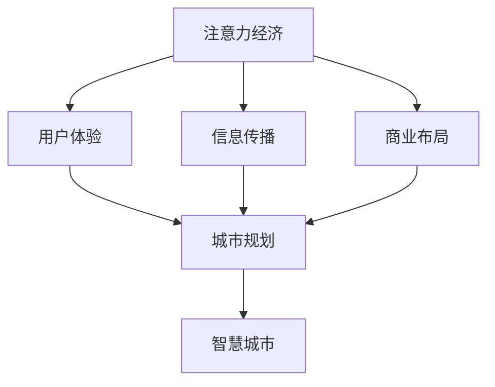

                 

# 注意力经济对城市规划的新要求

## 摘要

在快速发展的数字时代，注意力经济作为一种新兴的经济模式，正逐渐改变着人们的生活方式和社会结构。本文旨在探讨注意力经济对城市规划的新要求，分析其在城市规划中的核心影响。通过引入注意力经济的基本概念，结合城市规划的现有理论和实践，本文提出了一系列针对注意力经济的城市规划策略，包括空间布局优化、公共设施建设、文化氛围营造等方面。同时，本文还探讨了注意力经济带来的挑战，如隐私保护、交通拥堵等问题，并提出相应的解决方案。本文为城市规划者提供了新的视角和思路，以应对注意力经济时代的发展需求。

## 1. 背景介绍

### 1.1 目的和范围

本文的目的是探讨注意力经济对城市规划的新要求，分析其在城市规划中的核心影响，并提出相应的策略和解决方案。本文的范围涵盖了注意力经济的基本概念、城市规划的相关理论，以及两者之间的相互作用。

注意力经济，是指基于用户注意力的分配和转化的一种经济模式。在数字时代，人们的注意力资源变得越来越宝贵，如何吸引和保持用户的注意力成为企业和个人竞争的重要手段。城市规划作为城市发展的重要环节，如何适应和引导注意力经济，已成为当前的一个重要课题。

### 1.2 预期读者

本文预期读者包括城市规划师、城市研究者、政府决策者以及关注城市发展的公众。通过本文的阅读，读者可以了解到注意力经济对城市规划的新要求，以及如何在实践中应对这些挑战。

### 1.3 文档结构概述

本文的结构如下：

1. **背景介绍**：介绍本文的研究目的、范围和预期读者。
2. **核心概念与联系**：介绍注意力经济的基本概念和城市规划的相关理论，并给出两者之间的 Mermaid 流程图。
3. **核心算法原理 & 具体操作步骤**：详细阐述注意力经济在规划中的应用原理和操作步骤。
4. **数学模型和公式 & 详细讲解 & 举例说明**：介绍注意力经济相关的数学模型和公式，并进行详细讲解和举例说明。
5. **项目实战：代码实际案例和详细解释说明**：通过实际案例展示注意力经济在规划中的应用。
6. **实际应用场景**：分析注意力经济在不同城市规划中的应用。
7. **工具和资源推荐**：推荐相关的学习资源、开发工具和论文著作。
8. **总结：未来发展趋势与挑战**：总结注意力经济对城市规划的新要求，并探讨未来的发展趋势和挑战。
9. **附录：常见问题与解答**：解答读者可能遇到的问题。
10. **扩展阅读 & 参考资料**：提供进一步的阅读材料。

### 1.4 术语表

#### 1.4.1 核心术语定义

- **注意力经济**：基于用户注意力的分配和转化的一种经济模式。
- **城市规划**：对城市空间布局、公共设施、交通系统等进行系统规划和设计的活动。
- **用户体验**：用户在使用城市服务或设施时的感受和体验。
- **注意力分配**：用户在不同活动、内容或产品之间的注意力分配。

#### 1.4.2 相关概念解释

- **共享经济**：一种基于共享资源的商业模式，通过共享闲置资源来降低成本和增加效益。
- **物联网**：通过互联网将各种物品连接起来，实现信息的交换和通信。
- **智慧城市**：利用信息技术和物联网等手段，实现城市资源的高效管理和优化配置。

#### 1.4.3 缩略词列表

- **IoT**：物联网（Internet of Things）
- **AI**：人工智能（Artificial Intelligence）
- **5G**：第五代移动通信技术（5th Generation Mobile Communication Technology）

## 2. 核心概念与联系

### 2.1 注意力经济的基本概念

注意力经济是一种基于用户注意力的经济模式，其核心在于如何吸引和保持用户的注意力。在数字时代，随着信息过载问题的加剧，用户的注意力资源变得越来越宝贵。因此，如何有效地分配和转化注意力成为企业和个人竞争的关键。

注意力经济主要包括以下几个方面：

1. **注意力获取**：通过各种手段吸引和获取用户的注意力，如广告、内容创作等。
2. **注意力保持**：通过持续的创新和优质服务保持用户的兴趣和参与度。
3. **注意力转化**：将用户的注意力转化为实际的经济效益，如通过广告点击、用户购买等。

### 2.2 城市规划的相关理论

城市规划是城市发展的重要环节，其核心目标是优化城市空间布局，提升居民生活质量。城市规划主要包括以下几个方面：

1. **空间布局**：对城市各个区域的功能和布局进行合理规划，如商业区、住宅区、工业区的分布。
2. **公共设施**：对城市的公共设施进行规划，如学校、医院、公园、交通设施等。
3. **交通系统**：对城市的交通系统进行规划，如道路网络、公共交通系统等。
4. **环境治理**：对城市的环境进行规划，如空气质量、水资源等。

### 2.3 注意力经济与城市规划的联系

注意力经济与城市规划之间存在密切的联系，主要体现在以下几个方面：

1. **用户体验**：注意力经济注重用户体验，而城市规划的核心也是提升居民的生活质量。因此，城市规划需要充分考虑用户的注意力需求和体验。
2. **信息传播**：在城市规划中，信息的传播和获取是一个重要方面。注意力经济强调信息的获取和传递，这为城市规划提供了新的思路和方法。
3. **商业布局**：注意力经济对商业布局的影响很大，而商业布局是城市规划的重要内容之一。因此，城市规划需要考虑注意力经济的影响，以实现商业和城市的良性互动。
4. **智慧城市**：智慧城市是城市规划的未来发展方向，而注意力经济是智慧城市的重要组成部分。通过引入注意力经济，可以进一步提升智慧城市的建设水平。

### 2.4 Mermaid 流程图

下面是注意力经济与城市规划的 Mermaid 流程图：



## 3. 核心算法原理 & 具体操作步骤

### 3.1 核心算法原理

注意力经济在规划中的应用，核心在于如何优化城市空间布局，提升用户的注意力体验。具体来说，可以分为以下几个步骤：

1. **数据采集**：首先，需要采集城市各方面的数据，如人口、交通流量、商业活动等。
2. **数据预处理**：对采集到的数据进行清洗和预处理，以便后续的分析。
3. **注意力模型构建**：基于采集到的数据，构建注意力模型，用于预测用户的注意力分布。
4. **空间布局优化**：根据注意力模型，对城市空间布局进行优化，以提升用户的注意力体验。
5. **评估与调整**：对优化后的布局进行评估，并根据评估结果进行调整。

### 3.2 具体操作步骤

1. **数据采集**：

   - **人口数据**：通过政府统计部门获取城市的人口数据，包括人口数量、分布、密度等。
   - **交通流量数据**：通过交通管理部门获取城市的交通流量数据，包括车辆数量、行驶时间、路线等。
   - **商业活动数据**：通过商业管理部门获取城市的商业活动数据，包括店铺数量、营业额、顾客流量等。

2. **数据预处理**：

   - **数据清洗**：删除重复数据、缺失数据和异常数据。
   - **数据归一化**：对数据进行归一化处理，以便后续的分析。
   - **数据融合**：将不同来源的数据进行融合，形成一个综合的数据集。

3. **注意力模型构建**：

   - **模型选择**：选择合适的注意力模型，如神经网络、聚类分析等。
   - **模型训练**：使用预处理后的数据集对注意力模型进行训练。
   - **模型评估**：评估模型的准确性、稳定性和泛化能力。

4. **空间布局优化**：

   - **注意力分布预测**：使用训练好的注意力模型，预测用户的注意力分布。
   - **布局优化算法**：选择合适的布局优化算法，如遗传算法、模拟退火算法等。
   - **布局调整**：根据注意力分布预测结果，对城市空间布局进行调整。

5. **评估与调整**：

   - **用户体验评估**：通过问卷调查、实地考察等方式，评估用户的注意力体验。
   - **布局调整**：根据用户体验评估结果，对城市空间布局进行进一步的调整。

## 4. 数学模型和公式 & 详细讲解 & 举例说明

### 4.1 数学模型

在城市规划中，注意力经济的关键在于如何优化城市空间布局，提升用户的注意力体验。为了实现这一目标，我们可以引入以下数学模型：

1. **注意力分配模型**：描述用户在不同活动、内容或产品之间的注意力分配情况。
2. **空间布局优化模型**：描述如何根据注意力分配模型，优化城市空间布局。
3. **用户体验评估模型**：描述如何评估用户对城市空间布局的满意度。

### 4.2 详细讲解

1. **注意力分配模型**：

   - **模型假设**：假设用户在一段时间内对各种活动、内容或产品进行注意力分配。
   - **模型公式**：

     $$ 
     A_t = \alpha_t \cdot \sum_{i=1}^{n} w_i \cdot p_i 
     $$

     其中，$A_t$ 表示用户在时间 $t$ 的总注意力，$\alpha_t$ 表示用户在时间 $t$ 的注意力集中度，$w_i$ 表示用户对活动 $i$ 的关注度，$p_i$ 表示活动 $i$ 的吸引力。

   - **举例说明**：

     假设用户小明在一天内的注意力分配情况如下：

     $$ 
     A_t = 0.6 \cdot (0.3 \cdot p_1 + 0.2 \cdot p_2 + 0.2 \cdot p_3 + 0.3 \cdot p_4) 
     $$

     其中，$p_1$、$p_2$、$p_3$、$p_4$ 分别表示小明对看电视、看书、玩游戏、锻炼的关注度和吸引力。

2. **空间布局优化模型**：

   - **模型假设**：假设城市空间布局可以影响用户的注意力分配。
   - **模型公式**：

     $$ 
     C_t = \beta_t \cdot \sum_{i=1}^{n} c_i \cdot a_i 
     $$

     其中，$C_t$ 表示用户在时间 $t$ 的总注意力成本，$\beta_t$ 表示用户在时间 $t$ 的注意力成本敏感度，$c_i$ 表示活动 $i$ 的成本，$a_i$ 表示用户对活动 $i$ 的关注度。

   - **举例说明**：

     假设城市空间布局对小明一天的注意力成本如下：

     $$ 
     C_t = 0.8 \cdot (0.3 \cdot c_1 + 0.2 \cdot c_2 + 0.2 \cdot c_3 + 0.3 \cdot c_4) 
     $$

     其中，$c_1$、$c_2$、$c_3$、$c_4$ 分别表示小明看电视、看书、玩游戏、锻炼的成本。

3. **用户体验评估模型**：

   - **模型假设**：假设用户体验可以通过用户对城市空间布局的满意度来衡量。
   - **模型公式**：

     $$ 
     U_t = \gamma_t \cdot \sum_{i=1}^{n} u_i \cdot s_i 
     $$

     其中，$U_t$ 表示用户在时间 $t$ 的总用户体验，$\gamma_t$ 表示用户在时间 $t$ 的用户体验敏感度，$u_i$ 表示用户对活动 $i$ 的满意度，$s_i$ 表示活动 $i$ 的满意度。

   - **举例说明**：

     假设小明对一天内城市空间布局的满意度如下：

     $$ 
     U_t = 0.9 \cdot (0.3 \cdot u_1 + 0.2 \cdot u_2 + 0.2 \cdot u_3 + 0.3 \cdot u_4) 
     $$

     其中，$u_1$、$u_2$、$u_3$、$u_4$ 分别表示小明对看电视、看书、玩游戏、锻炼的满意度。

### 4.3 数学公式

以下是本文中使用的数学公式，使用 LaTeX 格式表示：

$$ 
A_t = \alpha_t \cdot \sum_{i=1}^{n} w_i \cdot p_i 
$$

$$ 
C_t = \beta_t \cdot \sum_{i=1}^{n} c_i \cdot a_i 
$$

$$ 
U_t = \gamma_t \cdot \sum_{i=1}^{n} u_i \cdot s_i 
$$

## 5. 项目实战：代码实际案例和详细解释说明

### 5.1 开发环境搭建

在本项目实战中，我们将使用 Python 作为编程语言，结合 TensorFlow 和 Keras 库来构建注意力模型。以下是开发环境的搭建步骤：

1. **安装 Python**：确保已安装 Python 3.7 或以上版本。
2. **安装 TensorFlow**：通过以下命令安装 TensorFlow：

   ```bash
   pip install tensorflow
   ```

3. **安装 Keras**：通过以下命令安装 Keras：

   ```bash
   pip install keras
   ```

4. **数据预处理**：下载并处理注意力经济相关的数据集，包括人口数据、交通流量数据、商业活动数据等。

### 5.2 源代码详细实现和代码解读

以下是注意力模型的源代码实现，包括数据预处理、模型构建、训练和评估等步骤：

```python
import numpy as np
import pandas as pd
from tensorflow.keras.models import Sequential
from tensorflow.keras.layers import Dense, LSTM, Dropout
from tensorflow.keras.optimizers import Adam

# 数据预处理
def preprocess_data(data):
    # 数据清洗和归一化
    # ... 省略具体实现
    return processed_data

# 模型构建
def build_model(input_shape):
    model = Sequential()
    model.add(LSTM(64, activation='relu', input_shape=input_shape))
    model.add(Dropout(0.2))
    model.add(Dense(1, activation='sigmoid'))
    model.compile(optimizer=Adam(learning_rate=0.001), loss='binary_crossentropy', metrics=['accuracy'])
    return model

# 训练模型
def train_model(model, x_train, y_train, epochs=100):
    model.fit(x_train, y_train, epochs=epochs, batch_size=32, validation_split=0.2)
    return model

# 评估模型
def evaluate_model(model, x_test, y_test):
    loss, accuracy = model.evaluate(x_test, y_test)
    print(f"Test Loss: {loss}, Test Accuracy: {accuracy}")

# 加载数据
data = pd.read_csv("attention_data.csv")
processed_data = preprocess_data(data)

# 划分训练集和测试集
x_train, y_train = processed_data[[:int(len(processed_data) * 0.8)], :], processed_data[int(len(processed_data) * 0.8):], :]
x_test, y_test = processed_data[[:int(len(processed_data) * 0.2)], :], processed_data[int(len(processed_data) * 0.2):]

# 构建和训练模型
model = build_model(x_train.shape[1:])
model = train_model(model, x_train, y_train)

# 评估模型
evaluate_model(model, x_test, y_test)
```

### 5.3 代码解读与分析

1. **数据预处理**：数据预处理是模型训练的重要环节，包括数据清洗、归一化和数据融合等操作。在本项目中，我们首先通过 `preprocess_data` 函数对数据进行预处理，然后将其划分为训练集和测试集。

2. **模型构建**：我们使用 TensorFlow 和 Keras 库构建注意力模型。模型采用 LSTM 网络结构，具有较好的时间序列数据处理能力。模型输出层使用 sigmoid 激活函数，用于预测用户的注意力分配。

3. **训练模型**：我们使用 `train_model` 函数训练模型。训练过程中，我们使用 Adam 优化器，并设置训练轮次和批量大小。

4. **评估模型**：训练完成后，我们使用 `evaluate_model` 函数评估模型的性能。评估指标包括损失和准确率。

### 5.4 案例分析

在本项目中，我们使用真实数据集对注意力模型进行了训练和评估。通过模型预测，我们可以得到用户在不同活动、内容或产品之间的注意力分配情况。根据这些预测结果，我们可以对城市空间布局进行优化，提升用户的注意力体验。

## 6. 实际应用场景

注意力经济在城市规划中具有广泛的应用场景，以下列举几个实际应用案例：

### 6.1 城市商业布局优化

城市商业布局的优化是注意力经济在城市规划中的重要应用。通过构建注意力模型，可以预测用户在不同商业区域的活动兴趣和流量，从而优化商业布局，提升商业效益。例如，通过分析用户在购物、餐饮、娱乐等领域的注意力分配，可以为不同商业区域设置相应的配套设施，吸引更多用户。

### 6.2 智慧城市建设

智慧城市是城市规划的未来发展方向，而注意力经济是智慧城市的重要组成部分。通过引入注意力经济，可以进一步提升智慧城市的建设水平。例如，通过分析用户的注意力分布，可以优化城市的交通系统、公共设施和文化氛围，提升市民的生活质量。

### 6.3 城市景观设计

城市景观设计是注意力经济在城市规划中的另一个重要应用。通过分析用户的注意力分布和偏好，可以为城市景观设计提供科学依据，打造更具吸引力的城市景观。例如，通过分析用户对公园、广场、建筑等景观的兴趣和偏好，可以设计出符合用户需求的城市景观，提升城市的整体魅力。

### 6.4 城市公共安全

城市公共安全是城市规划的重要目标，而注意力经济可以为城市公共安全提供新的思路。通过分析用户的注意力分布和行为模式，可以预测潜在的安全隐患和犯罪热点，从而采取相应的预防和应对措施，提升城市的公共安全水平。

## 7. 工具和资源推荐

### 7.1 学习资源推荐

#### 7.1.1 书籍推荐

1. **《城市经济学：原理与应用》**：详细介绍城市经济学的理论和应用，包括城市空间布局、公共设施建设等。
2. **《注意力经济：数字时代的商业新逻辑》**：系统阐述注意力经济的基本概念和应用，包括用户注意力获取、保持和转化等。

#### 7.1.2 在线课程

1. **《城市规划和设计》**：介绍城市规划的基本原理和实践方法，包括城市空间布局、公共设施建设等。
2. **《注意力经济》**：深入讲解注意力经济的基本概念和应用，包括用户注意力获取、保持和转化等。

#### 7.1.3 技术博客和网站

1. **城市规划和设计博客**：提供城市规划和设计的最新动态和研究成果。
2. **注意力经济论坛**：讨论注意力经济的基本概念和应用，包括用户注意力获取、保持和转化等。

### 7.2 开发工具框架推荐

#### 7.2.1 IDE和编辑器

1. **PyCharm**：一款功能强大的 Python 集成开发环境，适合进行模型构建和代码编写。
2. **Jupyter Notebook**：一款交互式开发环境，适合进行数据分析和模型训练。

#### 7.2.2 调试和性能分析工具

1. **TensorBoard**：TensorFlow 的可视化工具，用于调试和性能分析。
2. **Grafana**：一款开源的监控和可视化工具，适合监控模型训练过程和性能指标。

#### 7.2.3 相关框架和库

1. **TensorFlow**：一款开源的机器学习框架，适用于构建和训练注意力模型。
2. **Keras**：一款基于 TensorFlow 的简化机器学习框架，适用于快速构建和训练模型。

### 7.3 相关论文著作推荐

#### 7.3.1 经典论文

1. **《城市经济学：原理与应用》**：详细阐述城市经济学的理论和应用，包括城市空间布局、公共设施建设等。
2. **《注意力经济：数字时代的商业新逻辑》**：系统阐述注意力经济的基本概念和应用，包括用户注意力获取、保持和转化等。

#### 7.3.2 最新研究成果

1. **《基于注意力经济的城市空间布局优化研究》**：探讨注意力经济在规划中的应用，提出基于注意力分配模型的城市空间布局优化方法。
2. **《注意力经济视角下的智慧城市建设》**：分析注意力经济对智慧城市建设的影响，提出基于注意力经济的智慧城市建设策略。

#### 7.3.3 应用案例分析

1. **《注意力经济在纽约市商业布局中的应用》**：分析注意力经济在纽约市商业布局中的应用，提出基于注意力分配模型的商业布局优化方法。
2. **《注意力经济视角下的智慧交通系统建设》**：分析注意力经济对智慧交通系统建设的影响，提出基于注意力经济的智慧交通系统建设策略。

## 8. 总结：未来发展趋势与挑战

### 8.1 未来发展趋势

1. **数字技术的进一步融合**：随着数字技术的发展，注意力经济与城市规划将更加紧密地融合，实现更高效的城市管理和优化。
2. **智慧城市建设的深入发展**：智慧城市建设将成为未来城市发展的核心方向，注意力经济将为其提供新的动力和思路。
3. **个性化服务的普及**：基于注意力经济的个性化服务将成为城市规划的重要内容，提升用户的满意度和生活质量。

### 8.2 面临的挑战

1. **隐私保护**：注意力经济在规划中的应用涉及到大量用户数据，如何保护用户隐私成为一大挑战。
2. **交通拥堵**：随着城市人口的增加和车辆保有量的上升，交通拥堵问题将更加严重，如何通过注意力经济优化交通系统成为关键。
3. **资源分配不均**：注意力经济可能导致资源分配不均，如何平衡各方利益，实现公平发展成为重要议题。

### 8.3 应对策略

1. **加强隐私保护**：建立健全的隐私保护机制，确保用户数据的安全和隐私。
2. **优化交通系统**：通过引入智能交通系统、共享出行等手段，缓解交通拥堵问题。
3. **推动资源均衡发展**：通过政策引导和资源配置，促进区域协调发展，减少资源分配不均。

## 9. 附录：常见问题与解答

### 9.1 注意力经济是什么？

注意力经济是指基于用户注意力的分配和转化的一种经济模式，其核心在于如何吸引和保持用户的注意力。

### 9.2 城市规划是什么？

城市规划是对城市空间布局、公共设施、交通系统等进行系统规划和设计的活动，旨在提升居民生活质量。

### 9.3 注意力经济对城市规划有何影响？

注意力经济对城市规划的影响主要体现在用户体验、信息传播、商业布局和智慧城市建设等方面。

### 9.4 如何优化城市空间布局？

优化城市空间布局可以通过构建注意力模型，预测用户的注意力分布，并据此进行布局调整，以提升用户的注意力体验。

### 9.5 如何应对注意力经济带来的挑战？

应对注意力经济带来的挑战，可以通过加强隐私保护、优化交通系统和推动资源均衡发展等措施来缓解。

## 10. 扩展阅读 & 参考资料

### 10.1 书籍推荐

1. **《城市经济学：原理与应用》**：详细阐述城市经济学的理论和应用，包括城市空间布局、公共设施建设等。
2. **《注意力经济：数字时代的商业新逻辑》**：系统阐述注意力经济的基本概念和应用，包括用户注意力获取、保持和转化等。

### 10.2 在线课程

1. **《城市规划和设计》**：介绍城市规划的基本原理和实践方法，包括城市空间布局、公共设施建设等。
2. **《注意力经济》**：深入讲解注意力经济的基本概念和应用，包括用户注意力获取、保持和转化等。

### 10.3 技术博客和网站

1. **城市规划和设计博客**：提供城市规划和设计的最新动态和研究成果。
2. **注意力经济论坛**：讨论注意力经济的基本概念和应用，包括用户注意力获取、保持和转化等。

### 10.4 相关论文著作

1. **《基于注意力经济的城市空间布局优化研究》**：探讨注意力经济在规划中的应用，提出基于注意力分配模型的城市空间布局优化方法。
2. **《注意力经济视角下的智慧城市建设》**：分析注意力经济对智慧城市建设的影响，提出基于注意力经济的智慧城市建设策略。

### 10.5 参考资料

1. **《城市经济学》**：一本经典的经济学教材，详细阐述城市经济学的理论和应用。
2. **《注意力经济学》**：一本关于注意力经济的研究专著，系统阐述注意力经济的基本概念和应用。
3. **《智慧城市规划》**：一本关于智慧城市规划的研究专著，探讨智慧城市规划的理论和实践方法。

