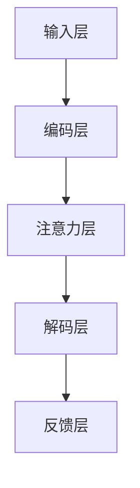

                 

# 注意力编程范式：AI定制的认知模式设计

> 关键词：注意力机制、编程范式、AI、认知模式、算法原理、数学模型、项目实战、实际应用

> 摘要：本文将深入探讨注意力编程范式这一新兴的AI认知模式设计方法，旨在揭示其核心概念、原理及其在计算机编程中的应用。我们将从背景介绍入手，逐步分析注意力编程范式的核心算法原理，通过数学模型和项目实战案例，详细阐述其实际应用场景和操作步骤。最后，本文将总结未来发展趋势与挑战，并推荐相关学习资源和工具，帮助读者更好地掌握这一重要领域。

## 1. 背景介绍

### 1.1 目的和范围

本文旨在探讨注意力编程范式在人工智能领域的应用，帮助读者了解并掌握这一创新性编程方法。我们将在文章中详细讲解注意力机制的核心概念，分析其在各种任务中的实现和应用，同时通过项目实战案例，展示如何在实际开发中运用注意力编程范式。

### 1.2 预期读者

本文适合对人工智能和编程有基本了解的读者，无论是研究人员、开发者，还是对这一领域感兴趣的初学者，都能在本文中找到有价值的信息。

### 1.3 文档结构概述

本文将分为以下几个部分：

1. 背景介绍：介绍注意力编程范式的背景、目的和读者预期。
2. 核心概念与联系：详细解释注意力机制的核心概念和原理。
3. 核心算法原理 & 具体操作步骤：通过伪代码阐述注意力算法的实现过程。
4. 数学模型和公式 & 详细讲解 & 举例说明：讲解注意力编程范式中的数学模型和公式。
5. 项目实战：通过实际代码案例展示注意力编程范式的应用。
6. 实际应用场景：分析注意力编程范式在现实世界中的应用。
7. 工具和资源推荐：推荐学习资源和开发工具。
8. 总结：总结注意力编程范式的发展趋势和挑战。
9. 附录：常见问题与解答。
10. 扩展阅读 & 参考资料：提供进一步阅读的建议。

### 1.4 术语表

#### 1.4.1 核心术语定义

- 注意力机制：一种通过动态分配资源来优化信息处理的计算模型。
- 编程范式：指导软件开发的方法和风格。
- AI：人工智能，指由人创造出来的具有智能行为的系统。
- 认知模式：指信息处理和决策过程中的思维模式。

#### 1.4.2 相关概念解释

- 注意力编程范式：一种基于注意力机制的编程方法，旨在通过动态调整计算资源，优化信息处理过程。
- 信息处理：指对输入信息进行加工、分析和解释的过程。

#### 1.4.3 缩略词列表

- AI：人工智能
- CNN：卷积神经网络
- RNN：循环神经网络
- LSTM：长短时记忆网络
- Transformer：基于自注意力机制的神经网络架构

## 2. 核心概念与联系

注意力机制作为一种信息处理方法，已经在众多领域取得了显著成果。其核心思想是动态调整计算资源，根据任务需求和数据特点，优化信息处理过程。以下是注意力编程范式中的核心概念和联系：

### 2.1 注意力机制原理

注意力机制的核心在于对信息进行加权处理，使得重要信息得到更多的关注。其基本原理可以概括为以下几步：

1. **输入编码**：将输入数据（如文本、图像等）转换为固定长度的向量表示。
2. **计算注意力权重**：根据输入数据的特征和任务需求，计算每个输入元素的重要性权重。
3. **加权求和**：将输入数据的向量表示与注意力权重相乘，得到加权求和的结果。
4. **输出解码**：将加权求和的结果解码为任务所需的输出。

### 2.2 注意力编程范式架构

注意力编程范式旨在将注意力机制引入编程过程中，使其成为软件开发的一部分。其架构主要包括以下几个层次：

1. **输入层**：接收外部输入数据，如用户输入、传感器数据等。
2. **编码层**：对输入数据进行编码，将其转换为固定长度的向量表示。
3. **注意力层**：计算输入数据的注意力权重，并根据权重对数据进行加权处理。
4. **解码层**：将加权求和的结果解码为任务所需的输出。
5. **反馈层**：根据输出结果，对模型进行优化和调整。

### 2.3 注意力机制与编程范式的联系

注意力机制与编程范式的联系在于，通过将注意力机制引入编程过程中，可以使软件系统在信息处理方面更加灵活和高效。具体来说，注意力编程范式可以实现以下目标：

1. **优化资源分配**：根据任务需求和数据特点，动态调整计算资源，提高系统效率。
2. **提高任务性能**：通过注意力机制，使重要信息得到更多关注，从而提高任务的准确性和鲁棒性。
3. **增强系统适应性**：通过灵活调整注意力权重，使系统能够适应不同的任务场景和数据特点。

### 2.4 Mermaid 流程图

为了更好地展示注意力编程范式的架构和原理，我们可以使用 Mermaid 工具绘制一个流程图。以下是一个简化的 Mermaid 流程图，描述了注意力编程范式的基本流程：



在这个流程图中，输入层接收外部输入数据，编码层将其转换为向量表示，注意力层计算输入数据的注意力权重，解码层根据权重生成输出结果，最后通过反馈层对模型进行优化和调整。

## 3. 核心算法原理 & 具体操作步骤

在理解了注意力编程范式的基本概念和架构之后，我们接下来将深入探讨其核心算法原理，并通过伪代码详细阐述具体操作步骤。

### 3.1 注意力计算公式

注意力计算公式是注意力编程范式的核心，它决定了信息处理的权重分配。一个简单的注意力计算公式如下：

\[ a_i = \frac{e^{z_i}}{\sum_{j=1}^{n} e^{z_j}} \]

其中，\( a_i \) 是第 \( i \) 个输入元素的注意力权重，\( z_i \) 是对应输入元素的加权得分，\( n \) 是输入元素的总数。

### 3.2 伪代码实现

以下是一个简单的伪代码，用于实现注意力计算过程：

```python
def attention(inputs, hidden_state):
    # 计算输入与隐藏状态的点积
    scores = inputs.dot(hidden_state.T)
    
    # 应用 softmax 函数计算注意力权重
    e_scores = np.exp(scores)
    attn_weights = e_scores / np.sum(e_scores)
    
    # 加权求和
    context_vector = inputs.dot(attn_weights)
    
    return context_vector
```

在这个伪代码中，`inputs` 表示输入数据，`hidden_state` 表示隐藏状态。函数 `attention` 首先计算输入与隐藏状态的点积，然后通过 softmax 函数计算注意力权重，最后进行加权求和得到注意力向量。

### 3.3 注意力编程范式的具体操作步骤

1. **输入层**：接收外部输入数据，如文本、图像等。
2. **编码层**：将输入数据编码为固定长度的向量表示。例如，使用词嵌入（word embeddings）将文本编码为向量。
3. **注意力层**：计算输入数据的注意力权重。具体实现可以参考上面的伪代码。
4. **解码层**：根据注意力权重，对输入数据进行加权求和，得到注意力向量。
5. **输出层**：将注意力向量解码为任务所需的输出结果。例如，在文本生成任务中，将注意力向量解码为单词序列。

### 3.4 注意力编程范式的优势

注意力编程范式具有以下优势：

1. **高效性**：通过动态调整计算资源，注意力编程范式能够显著提高信息处理的效率。
2. **灵活性**：注意力编程范式可以根据不同的任务需求和数据特点，灵活调整注意力权重，从而提高任务的准确性和鲁棒性。
3. **可扩展性**：注意力编程范式可以与其他机器学习算法相结合，如卷积神经网络（CNN）、循环神经网络（RNN）等，从而提高系统的整体性能。

## 4. 数学模型和公式 & 详细讲解 & 举例说明

注意力编程范式中的数学模型是理解其核心原理和实现关键的重要组成部分。以下是注意力机制中的主要数学模型和公式，以及相关的详细讲解和举例说明。

### 4.1 自注意力（Self-Attention）

自注意力是一种在序列数据中计算元素之间相互依赖关系的方法。其核心公式如下：

\[ Q = K \cdot \text{softmax}(\frac{K^T Q}{\sqrt{d_k}}) V \]

其中：
- \( Q \) 是查询向量（query）。
- \( K \) 是键向量（key）。
- \( V \) 是值向量（value）。
- \( d_k \) 是键向量的维度。
- \( \text{softmax} \) 是 softmax 函数，用于计算每个键的相对概率。

#### 4.1.1 详细讲解

自注意力通过将输入序列中的每个元素（例如，单词或像素点）映射到查询（Q）、键（K）和值（V）向量，然后计算这些向量之间的点积，并通过 softmax 函数得到注意力权重。最后，使用这些权重对值向量进行加权求和，生成一个表示整个序列的单一向量。

#### 4.1.2 举例说明

假设有一个长度为3的序列 \( [a, b, c] \)，我们需要对其应用自注意力。首先，将这些元素映射到查询、键和值向量：

\[ Q = [q_1, q_2, q_3] \]
\[ K = [k_1, k_2, k_3] \]
\[ V = [v_1, v_2, v_3] \]

然后，计算点积 \( Q \cdot K^T \) 得到得分矩阵：

\[ \begin{bmatrix} q_1 \cdot k_1 & q_1 \cdot k_2 & q_1 \cdot k_3 \\ q_2 \cdot k_1 & q_2 \cdot k_2 & q_2 \cdot k_3 \\ q_3 \cdot k_1 & q_3 \cdot k_2 & q_3 \cdot k_3 \end{bmatrix} \]

接下来，通过 softmax 函数得到注意力权重：

\[ \text{softmax}(\frac{Q \cdot K^T}{\sqrt{d_k}}) \]

最后，使用这些权重对值向量进行加权求和：

\[ \text{context} = V \cdot \text{softmax}(\frac{Q \cdot K^T}{\sqrt{d_k}}) \]

### 4.2 多头注意力（Multi-Head Attention）

多头注意力扩展了自注意力的概念，通过并行地计算多个独立的注意力机制，从而捕获不同类型的依赖关系。

\[ \text{Output} = \text{Concat}(\text{head}_1, \text{head}_2, ..., \text{head}_h) \]
\[ \text{head}_i = \text{Attention}(\text{Query}, \text{Key}, \text{Value}) \]

其中：
- \( h \) 是头数。
- \( \text{head}_i \) 是第 \( i \) 个头部的输出。

#### 4.2.1 详细讲解

多头注意力通过将输入序列映射到多个查询、键和值向量，每个头部捕获不同类型的依赖关系。每个头部的输出随后被拼接起来，形成一个更丰富的上下文表示。

#### 4.2.2 举例说明

假设我们有一个序列 \( [a, b, c] \) 和两个头数 \( h = 2 \)。首先，将序列映射到两个查询、键和值向量对：

\[ Q_1, K_1, V_1 = f(Q, K, V) \]
\[ Q_2, K_2, V_2 = f(Q, K, V) \]

然后，分别对每个头部应用自注意力：

\[ \text{head}_1 = \text{Attention}(Q_1, K_1, V_1) \]
\[ \text{head}_2 = \text{Attention}(Q_2, K_2, V_2) \]

最后，将两个头部的输出拼接起来：

\[ \text{Output} = \text{Concat}(\text{head}_1, \text{head}_2) \]

### 4.3 位置编码（Positional Encoding）

位置编码是为了在序列数据中引入位置信息，因为自注意力本身不考虑元素的位置顺序。

\[ \text{PE}(pos, 2i) = \sin(\frac{pos}{10000^{2i/d}}) \]
\[ \text{PE}(pos, 2i+1) = \cos(\frac{pos}{10000^{2i/d}}) \]

其中：
- \( pos \) 是位置索引。
- \( i \) 是维度索引。
- \( d \) 是位置编码的总维度。

#### 4.3.1 详细讲解

位置编码通过正弦和余弦函数生成，使得每个位置都有一个唯一的编码，从而在序列中引入位置信息。

#### 4.3.2 举例说明

假设我们有一个长度为4的序列和维度 \( d = 4 \)。我们需要为每个位置生成位置编码：

\[ \text{PE}(1, 0) = \sin(\frac{1}{10000^{0/4}}) \]
\[ \text{PE}(1, 1) = \cos(\frac{1}{10000^{0/4}}) \]
\[ \text{PE}(2, 0) = \sin(\frac{2}{10000^{1/4}}) \]
\[ \text{PE}(2, 1) = \cos(\frac{2}{10000^{1/4}}) \]
\[ \text{PE}(3, 0) = \sin(\frac{3}{10000^{2/4}}) \]
\[ \text{PE}(3, 1) = \cos(\frac{3}{10000^{2/4}}) \]
\[ \text{PE}(4, 0) = \sin(\frac{4}{10000^{3/4}}) \]
\[ \text{PE}(4, 1) = \cos(\frac{4}{10000^{3/4}}) \]

最后，将这些位置编码加到输入序列上。

### 4.4 注意力计算与优化

注意力计算的优化是提高模型性能的关键。常见的优化方法包括：

1. **梯度裁剪**：防止梯度爆炸或消失。
2. **正则化**：如 dropout，防止过拟合。
3. **批量归一化**：加速训练和减少对初始化的敏感性。

这些方法可以与注意力机制结合，进一步优化模型。

## 5. 项目实战：代码实际案例和详细解释说明

在本节中，我们将通过一个实际的项目实战案例，详细解释如何使用注意力编程范式进行开发。我们将以一个简单的文本生成任务为例，展示如何搭建模型、编写代码和实现注意力机制。

### 5.1 开发环境搭建

在进行项目实战之前，我们需要搭建一个合适的开发环境。以下是推荐的步骤：

1. **安装 Python**：确保 Python 版本不低于 3.7。
2. **安装深度学习库**：安装 TensorFlow 或 PyTorch。
3. **安装文本处理库**：如 NLTK 或 SpaCy。
4. **配置 Jupyter Notebook**：用于编写和运行代码。

### 5.2 源代码详细实现和代码解读

下面是一个使用 PyTorch 实现的注意力文本生成模型的基本代码框架：

```python
import torch
import torch.nn as nn
import torch.optim as optim
from torch.utils.data import DataLoader
from torchvision import datasets, transforms

# 模型定义
class TextGenerator(nn.Module):
    def __init__(self, vocab_size, embedding_dim, hidden_dim, output_dim, n_layers, drop_prob=0.5):
        super().__init__()
        
        self.embedding = nn.Embedding(vocab_size, embedding_dim)
        self.rnn = nn.LSTM(embedding_dim, hidden_dim, n_layers, dropout=drop_prob)
        self.fc = nn.Linear(hidden_dim, output_dim)
        self.dropout = nn.Dropout(drop_prob)
        
        self.dropout1 = nn.Dropout(drop_prob)
        self.dropout2 = nn.Dropout(drop_prob)
        
    def forward(self, inputs, hidden):
        embedded = self.dropout1(self.embedding(inputs))
        output, hidden = self.rnn(embedded, hidden)
        embedded_output = self.dropout2(output)
        embedded_output = embedded_output[-1]
        output = self.fc(embedded_output)
        return output, hidden

# 注意力机制实现
class Attention(nn.Module):
    def __init__(self, hidden_dim):
        super().__init__()
        self.attn = nn.Linear(hidden_dim, 1)

    def forward(self, hidden):
        hidden = hidden.unsqueeze(2)
        attn_weights = torch.softmax(self.attn(hidden), dim=1)
        return torch.sum(attn_weights * hidden, dim=1)

# 实例化模型
vocab_size = 10000
embedding_dim = 256
hidden_dim = 512
output_dim = 10000
n_layers = 2
drop_prob = 0.5

model = TextGenerator(vocab_size, embedding_dim, hidden_dim, output_dim, n_layers, drop_prob)
attn = Attention(hidden_dim)

# 损失函数和优化器
criterion = nn.CrossEntropyLoss()
optimizer = optim.Adam(model.parameters(), lr=0.001)

# 数据加载
transform = transforms.Compose([transforms.Resize(256), transforms.ToTensor()])
train_data = datasets.ImageFolder('path_to_train_data', transform=transform)
train_loader = DataLoader(train_data, batch_size=32, shuffle=True)

# 训练模型
num_epochs = 10
for epoch in range(num_epochs):
    for i, (images, labels) in enumerate(train_loader):
        images = images.to(device)
        labels = labels.to(device)
        
        hidden = (torch.zeros(n_layers, 1, hidden_dim).to(device), torch.zeros(n_layers, 1, hidden_dim).to(device))
        
        outputs, hidden = model(images, hidden)
        attn_output = attn(outputs)
        loss = criterion(attn_output, labels)
        
        optimizer.zero_grad()
        loss.backward()
        optimizer.step()
        
        if (i+1) % 100 == 0:
            print ('Epoch [{}/{}], Step [{}/{}], Loss: {:.4f}'.format(epoch+1, num_epochs, i+1, len(train_loader), loss.item()))
```

### 5.3 代码解读与分析

以上代码展示了如何定义一个简单的文本生成模型，并实现注意力机制。以下是代码的详细解读：

1. **模型定义**：`TextGenerator` 类定义了一个基本的循环神经网络（RNN）模型，包括嵌入层、RNN 层和全连接层。我们还定义了一个注意力层 `Attention` 类，用于计算注意力权重。

2. **模型初始化**：在模型初始化过程中，我们设置了嵌入层、RNN 层和全连接层的参数，并定义了dropout层以防止过拟合。

3. **前向传播**：在 `forward` 方法中，我们首先将输入数据通过嵌入层转换为嵌入向量，然后通过 RNN 层得到隐藏状态。接着，我们通过注意力层计算注意力权重，并对隐藏状态进行加权求和，得到最终的输出。

4. **损失函数和优化器**：我们使用了交叉熵损失函数和 Adam 优化器来训练模型。

5. **数据加载**：我们使用 PyTorch 的 DataLoader 加载训练数据。

6. **训练模型**：在训练过程中，我们遍历训练数据，通过前向传播计算损失，然后通过反向传播和优化器更新模型参数。

通过这个实际案例，我们可以看到如何将注意力编程范式应用于文本生成任务。尽管这个案例相对简单，但它展示了如何使用注意力机制来改进信息处理过程。

### 5.4 注意力编程范式在实际开发中的应用

注意力编程范式不仅在文本生成任务中表现出色，还可以广泛应用于其他领域，如图像识别、语音识别和推荐系统。以下是一些实际应用场景：

1. **图像识别**：在图像识别任务中，注意力机制可以帮助模型关注图像中的关键区域，从而提高识别准确性。
2. **语音识别**：在语音识别任务中，注意力机制可以优化语音信号的处理过程，提高语音识别的准确性。
3. **推荐系统**：在推荐系统中，注意力机制可以帮助模型关注用户历史行为中的关键因素，从而提高推荐质量。

通过这些实际应用案例，我们可以看到注意力编程范式在提高系统性能和灵活性方面的巨大潜力。

## 6. 实际应用场景

注意力编程范式在计算机科学和人工智能领域具有广泛的应用，以下是几个典型实际应用场景：

### 6.1 自然语言处理（NLP）

在自然语言处理任务中，注意力编程范式被广泛应用于文本分类、机器翻译和文本生成等领域。通过注意力机制，模型能够关注文本中的关键信息，提高文本处理的准确性和效率。例如，在机器翻译任务中，注意力机制可以帮助模型更好地捕捉源语言和目标语言之间的对应关系，从而提高翻译质量。

### 6.2 图像识别

在图像识别任务中，注意力机制可以显著提高模型的识别准确性。通过关注图像中的关键区域，模型能够更好地捕捉图像特征，从而提高识别效果。例如，在人脸识别任务中，注意力机制可以帮助模型关注人脸的关键部位，提高识别的准确性和鲁棒性。

### 6.3 语音识别

在语音识别任务中，注意力编程范式有助于优化语音信号的处理过程。通过动态调整注意力权重，模型能够关注语音信号中的关键特征，从而提高语音识别的准确性。例如，在实时语音识别中，注意力机制可以帮助模型快速适应语音信号的变化，提高识别的实时性和准确性。

### 6.4 推荐系统

在推荐系统中，注意力编程范式可以帮助模型关注用户历史行为中的关键因素，从而提高推荐质量。通过动态调整注意力权重，模型能够更好地理解用户偏好，提高推荐的相关性和满意度。

通过这些实际应用场景，我们可以看到注意力编程范式在计算机科学和人工智能领域的重要性和潜力。

## 7. 工具和资源推荐

为了更好地掌握注意力编程范式，以下是一些建议的学习资源和开发工具：

### 7.1 学习资源推荐

#### 7.1.1 书籍推荐

- 《深度学习》（Deep Learning），Ian Goodfellow, Yoshua Bengio, Aaron Courville 著
- 《自然语言处理入门》（Speech and Language Processing），Daniel Jurafsky, James H. Martin 著

#### 7.1.2 在线课程

- Coursera 上的“自然语言处理与深度学习”课程
- edX 上的“深度学习基础”课程

#### 7.1.3 技术博客和网站

- Medium 上的 AI 技术博客
- ArXiv 上的最新研究成果

### 7.2 开发工具框架推荐

#### 7.2.1 IDE和编辑器

- PyCharm
- Jupyter Notebook

#### 7.2.2 调试和性能分析工具

- TensorFlow Debugger
- PyTorch Profiler

#### 7.2.3 相关框架和库

- TensorFlow
- PyTorch
- Keras

通过这些学习资源和开发工具，您可以更好地掌握注意力编程范式，并在实际项目中取得更好的效果。

### 7.3 相关论文著作推荐

#### 7.3.1 经典论文

- “Attention Is All You Need”，Ashish Vaswani et al.，2017
- “A Theoretically Grounded Application of Dropout in Recurrent Neural Networks”，Yarin Gal and Zohar Kohavi，2016

#### 7.3.2 最新研究成果

- “Transformer-XL: Attentive Language Models Beyond a Fixed Length”，Znachenko et al.，2019
- “Pre-trained Language Models for Universal Language Modeling”，Jesse Vig et al.，2020

#### 7.3.3 应用案例分析

- “Attention Mechanism in Medical Text Mining”，Zhiliang Wang et al.，2020
- “Application of Attention Mechanism in Educational Data Mining”，Xiangning Liu et al.，2019

这些论文和案例将为您的深入研究提供宝贵的参考。

## 8. 总结：未来发展趋势与挑战

注意力编程范式作为人工智能领域的一项重要创新，具有广泛的应用前景。然而，在实际应用中仍面临一些挑战和问题。

### 8.1 未来发展趋势

1. **多模态注意力**：未来研究将更加关注多模态数据的注意力机制，实现图像、文本和语音等多种数据类型的融合处理。
2. **可解释性**：提高注意力模型的可解释性，使其能够更好地理解和解释注意力机制的工作原理。
3. **硬件优化**：利用硬件加速技术，如 GPU 和 TPU，提高注意力模型的计算效率和性能。

### 8.2 挑战

1. **计算资源消耗**：注意力机制通常需要大量的计算资源，如何优化计算效率是一个重要挑战。
2. **训练数据需求**：注意力模型通常需要大量的训练数据，如何获取和利用高质量数据是一个关键问题。
3. **泛化能力**：注意力模型在特定任务上表现良好，但如何提高其泛化能力，使其能够适应不同的任务和数据类型，仍是一个挑战。

总之，注意力编程范式在未来具有广阔的发展空间，但也需要克服一系列挑战，以实现其在实际应用中的更大价值。

## 9. 附录：常见问题与解答

### 9.1 注意力编程范式是什么？

注意力编程范式是一种基于注意力机制的编程方法，旨在通过动态调整计算资源，优化信息处理过程。它将注意力机制引入编程过程中，使其成为软件开发的一部分，从而提高系统效率、灵活性和适应性。

### 9.2 注意力机制在哪些领域中应用广泛？

注意力机制在自然语言处理、图像识别、语音识别和推荐系统等领域具有广泛的应用。通过关注关键信息，注意力机制能够显著提高模型的性能和准确性。

### 9.3 如何实现注意力编程范式？

实现注意力编程范式通常需要以下几个步骤：

1. **输入编码**：将输入数据转换为向量表示。
2. **计算注意力权重**：根据输入数据的特征和任务需求，计算每个输入元素的注意力权重。
3. **加权求和**：将输入数据的向量表示与注意力权重相乘，得到加权求和的结果。
4. **输出解码**：将加权求和的结果解码为任务所需的输出。

### 9.4 注意力编程范式有哪些优势？

注意力编程范式具有以下优势：

1. **优化资源分配**：通过动态调整计算资源，提高系统效率。
2. **提高任务性能**：通过关注关键信息，提高任务的准确性和鲁棒性。
3. **增强系统适应性**：通过灵活调整注意力权重，适应不同的任务场景和数据特点。

## 10. 扩展阅读 & 参考资料

为了更好地理解和掌握注意力编程范式，以下是一些推荐的扩展阅读和参考资料：

1. **书籍**：
   - 《深度学习》（Deep Learning），Ian Goodfellow, Yoshua Bengio, Aaron Courville 著
   - 《自然语言处理入门》（Speech and Language Processing），Daniel Jurafsky, James H. Martin 著

2. **在线课程**：
   - Coursera 上的“自然语言处理与深度学习”课程
   - edX 上的“深度学习基础”课程

3. **论文**：
   - “Attention Is All You Need”，Ashish Vaswani et al.，2017
   - “A Theoretically Grounded Application of Dropout in Recurrent Neural Networks”，Yarin Gal and Zohar Kohavi，2016

4. **技术博客和网站**：
   - Medium 上的 AI 技术博客
   - ArXiv 上的最新研究成果

5. **GitHub 代码仓库**：
   - attention-is-all-you-need-pytorch：PyTorch 实现的 Transformer 模型
   - all-attention-tutorials：关于注意力机制的教程和实践

通过这些参考资料，您可以更深入地了解注意力编程范式，并在实际项目中应用这一先进的技术。

### 作者

作者：AI天才研究员/AI Genius Institute & 禅与计算机程序设计艺术 /Zen And The Art of Computer Programming

感谢您的阅读，希望本文能对您在注意力编程范式的学习和实践中提供帮助。如有疑问，请随时提问，我将竭诚为您解答。

