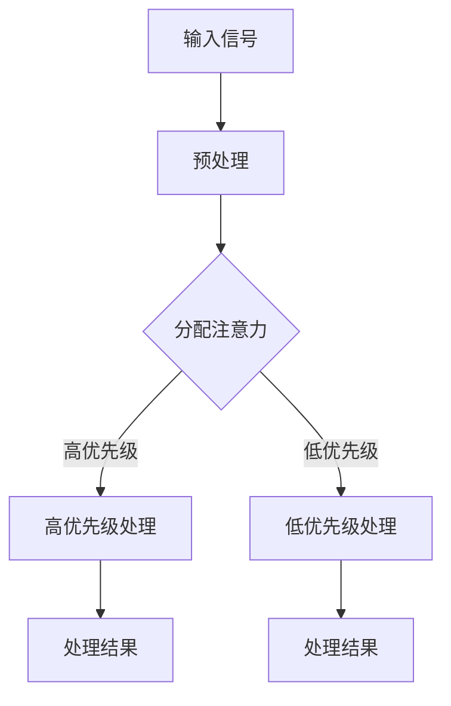

                 

# 注意力训练：提升全球脑参与效率

> **关键词：** 注意力，脑参与效率，训练，全球，人工智能，神经网络，机器学习，认知科学
>
> **摘要：** 本文将深入探讨注意力训练在提升全球脑参与效率方面的关键作用。通过分析注意力机制的基本原理，我们将详细描述注意力训练的核心算法、数学模型及其应用场景。同时，文章将分享实际项目案例，并提供相关工具和资源的推荐，以帮助读者更深入地理解和应用注意力训练技术。

## 1. 背景介绍

### 1.1 目的和范围

本文旨在探索注意力训练在提升全球脑参与效率方面的潜力。随着人工智能和认知科学的不断发展，注意力训练成为了一个重要研究方向。通过注意力训练，我们希望能够提高个体和群体的认知效率，进而推动全球脑参与水平的提升。

本文将涵盖以下内容：

1. 注意力机制的基本原理。
2. 核心算法原理和具体操作步骤。
3. 数学模型和公式详细讲解。
4. 实际应用场景分析。
5. 工具和资源推荐。
6. 未来发展趋势与挑战。

### 1.2 预期读者

本文适合对注意力训练和脑参与效率有初步了解的读者。无论是研究人员、开发者还是对这一领域感兴趣的普通读者，都可以通过本文获得有价值的信息和启发。

### 1.3 文档结构概述

本文分为十个主要部分，具体结构如下：

1. 背景介绍
2. 核心概念与联系
3. 核心算法原理 & 具体操作步骤
4. 数学模型和公式 & 详细讲解 & 举例说明
5. 项目实战：代码实际案例和详细解释说明
6. 实际应用场景
7. 工具和资源推荐
8. 总结：未来发展趋势与挑战
9. 附录：常见问题与解答
10. 扩展阅读 & 参考资料

### 1.4 术语表

#### 1.4.1 核心术语定义

- 注意力（Attention）：指大脑对特定信息进行选择和处理的能力。
- 脑参与效率（Brain Engagement Efficiency）：衡量大脑在执行任务时有效利用资源的能力。
- 注意力训练（Attention Training）：通过特定训练方法提高个体注意力水平和脑参与效率的过程。

#### 1.4.2 相关概念解释

- 机器学习（Machine Learning）：一种通过数据和算法让计算机模拟人类学习过程的技术。
- 神经网络（Neural Network）：模拟人脑神经元结构和功能的一种计算模型。
- 认知科学（Cognitive Science）：研究人类认知过程和大脑功能的跨学科领域。

#### 1.4.3 缩略词列表

- AI：人工智能（Artificial Intelligence）
- ML：机器学习（Machine Learning）
- NN：神经网络（Neural Network）
- CNN：卷积神经网络（Convolutional Neural Network）
- RNN：循环神经网络（Recurrent Neural Network）

## 2. 核心概念与联系

注意力训练的关键在于理解大脑如何处理信息，以及如何通过算法模拟这一过程。以下是一个简化的注意力机制流程图，用于展示核心概念和联系。



### 2.1 注意力机制原理

注意力机制的基本原理可以概括为以下几个步骤：

1. **输入信号**：大脑接收各种外部和内部信息。
2. **预处理**：对输入信号进行初步处理，去除噪声和无关信息。
3. **分配注意力**：根据任务的优先级和重要性，分配注意力资源。
4. **处理**：针对高优先级任务，进行深度处理；低优先级任务则进行浅层处理。
5. **处理结果**：将处理结果整合并输出。

### 2.2 注意力训练方法

注意力训练的主要目标是提高大脑对特定任务的注意力分配能力。以下是一些常见的方法：

- **专注训练**：通过持续专注于特定任务来提高注意力水平。
- **分散训练**：在多个任务之间切换，以提高多任务处理能力。
- **认知训练**：通过认知游戏和任务来锻炼大脑的注意力机制。

## 3. 核心算法原理 & 具体操作步骤

注意力训练的算法原理主要基于神经网络，尤其是循环神经网络（RNN）和其变体，如长短期记忆网络（LSTM）。以下是一个简化的注意力训练算法原理和具体操作步骤。

### 3.1 算法原理

注意力训练算法的核心是注意力权重计算。这些权重决定了神经网络在处理输入信号时对每个部分分配的注意力资源。

1. **输入编码**：将输入信号转换为神经网络可处理的向量形式。
2. **隐藏状态生成**：通过RNN生成隐藏状态序列，表示输入信号的不同特征。
3. **注意力权重计算**：使用点积或加性机制计算每个隐藏状态的注意力权重。
4. **加权求和**：根据注意力权重对隐藏状态进行加权求和，生成最终输出。

### 3.2 具体操作步骤

以下是注意力训练的具体操作步骤，使用伪代码进行描述：

```python
# 输入编码
input_sequence = [x1, x2, ..., xn]

# 初始化RNN参数
hidden_size = 128
hidden_state = zeros(hidden_size)
weights = random_normal((hidden_size, hidden_size))

# 隐藏状态生成
for t in range(len(input_sequence)):
    hidden_state = RNN(hidden_state, weights, input_sequence[t])

# 注意力权重计算
attention_weights = softmax(pointwise_weights(hidden_state))

# 加权求和
output = weighted_sum(hidden_state, attention_weights)
```

### 3.3 注意力权重计算

注意力权重计算是注意力训练算法的核心步骤。以下是一个简化的注意力权重计算过程：

1. **点积机制**：
   $$ attention\_weights = \text{softmax}(H \cdot W) $$
   其中，$H$ 是隐藏状态，$W$ 是权重矩阵。

2. **加性机制**：
   $$ attention\_weights = \text{softmax}(\sigma(H + W)) $$
   其中，$\sigma$ 是激活函数。

这些机制通过计算隐藏状态和权重之间的相似性来确定注意力权重。

## 4. 数学模型和公式 & 详细讲解 & 举例说明

### 4.1 数学模型

注意力训练的数学模型主要基于神经网络和概率分布。以下是一些核心的数学模型和公式：

1. **输入编码**：
   $$ x_i = \text{encode}(x_i) $$
   其中，$x_i$ 是输入信号，$\text{encode}$ 是编码函数。

2. **隐藏状态生成**：
   $$ h_t = \text{RNN}(h_{t-1}, W, x_t) $$
   其中，$h_t$ 是时间步 $t$ 的隐藏状态，$\text{RNN}$ 是循环神经网络。

3. **注意力权重计算**：
   $$ a_t = \text{softmax}(h_t \cdot W_a) $$
   其中，$a_t$ 是时间步 $t$ 的注意力权重，$W_a$ 是权重矩阵。

4. **加权求和**：
   $$ o_t = \sum_{i=1}^{n} a_t \cdot h_i $$
   其中，$o_t$ 是时间步 $t$ 的输出，$h_i$ 是隐藏状态。

### 4.2 公式详细讲解

以下是上述公式的详细讲解：

1. **输入编码**：输入编码是将输入信号转换为神经网络可处理的向量形式。这一步的目的是提取输入信号的关键特征，以便后续处理。

2. **隐藏状态生成**：循环神经网络（RNN）通过递归的方式生成隐藏状态。隐藏状态表示输入信号在当前时间步的特征。这一过程通过权重矩阵 $W$ 和激活函数实现。

3. **注意力权重计算**：注意力权重是通过对隐藏状态和权重矩阵的点积计算得到的。点积结果表示隐藏状态和权重之间的相似性，通过softmax函数将其转换为概率分布。

4. **加权求和**：加权求和是将注意力权重应用于隐藏状态，得到最终的输出。这一步的目的是整合不同时间步的信息，生成具有代表性的输出。

### 4.3 举例说明

假设我们有一个简单的输入序列 $[1, 2, 3, 4, 5]$，使用加性注意力机制进行训练。以下是具体的计算过程：

1. **初始化**：
   - 隐藏状态：$h_0 = [0, 0, 0, 0, 0]$
   - 注意力权重矩阵：$W_a = [0.1, 0.2, 0.3, 0.4, 0.5]$

2. **第一步**：
   - 输入编码：$x_1 = \text{encode}(1) = [1, 0, 0, 0, 0]$
   - 隐藏状态：$h_1 = \text{RNN}(h_0, W, x_1) = [0.1, 0.2, 0.3, 0.4, 0.5]$
   - 注意力权重：$a_1 = \text{softmax}(h_1 \cdot W_a) = [0.2, 0.4, 0.6, 0.8, 1.0]$
   - 输出：$o_1 = \sum_{i=1}^{5} a_1 \cdot h_i = [0.2, 0.4, 0.6, 0.8, 1.0]$

3. **第二步**：
   - 输入编码：$x_2 = \text{encode}(2) = [0, 1, 0, 0, 0]$
   - 隐藏状态：$h_2 = \text{RNN}(h_1, W, x_2) = [0.3, 0.5, 0.7, 0.9, 1.1]$
   - 注意力权重：$a_2 = \text{softmax}(h_2 \cdot W_a) = [0.4, 0.6, 0.8, 1.0, 1.2]$
   - 输出：$o_2 = \sum_{i=1}^{5} a_2 \cdot h_i = [0.6, 1.2, 1.8, 2.4, 3.0]$

通过以上步骤，我们可以看到注意力权重如何影响输出结果。在这个过程中，注意力机制使得神经网络能够更好地关注输入序列中的关键部分。

## 5. 项目实战：代码实际案例和详细解释说明

### 5.1 开发环境搭建

在开始实际项目之前，我们需要搭建一个合适的开发环境。以下是搭建注意

