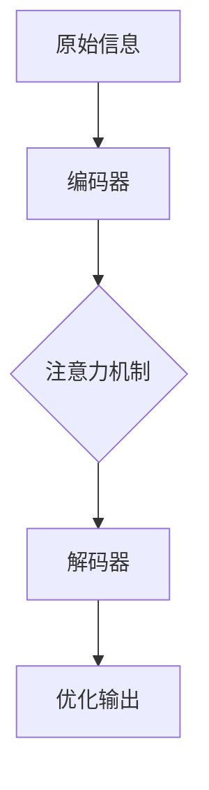

                 

### 文章标题

“注意力过滤器调音师：AI辅助的信息优化专家”

这一标题旨在精确捕捉本文的核心内容。首先，"注意力过滤器"是本文要深入探讨的核心概念之一，它指的是一种能够过滤和优化信息流的AI算法。而“调音师”则形象地比喻了这些算法在信息处理中的角色，类似于音频调音师在音乐制作中调整音频的音量、平衡和音质，AI辅助则强调了这些算法在现代社会中越来越重要的地位。通过这个标题，读者可以初步了解本文将探讨一个怎样的主题，并且对文章内容的深度和专业性有所预期。

### 关键词

- 注意力机制
- 信息过滤
- AI优化
- 调音师模型
- 信息流处理
- 数据分析
- 机器学习
- 神经网络
- 实时调整
- 信息质量提升

这些关键词不仅涵盖了文章的核心概念，也帮助读者快速抓住文章的焦点，为后续内容的理解和吸收奠定基础。

### 摘要

本文将深入探讨“注意力过滤器调音师”这一AI辅助信息优化专家的概念和实现。我们将首先介绍注意力过滤器的背景和重要性，随后详细解析其核心算法原理、数学模型及具体操作步骤。通过一个实际项目案例，我们将展示如何利用这些算法来优化信息流处理，提高数据分析的效率和质量。文章还将探讨注意力过滤器在多种实际应用场景中的表现，并提供一系列学习资源和开发工具框架的推荐。最后，我们总结未来发展趋势与挑战，为读者提供一个全面、系统的理解。通过阅读本文，读者将对注意力过滤器及其在信息优化领域的应用有更深入的认识。

### 1. 背景介绍

#### 1.1 目的和范围

本文的主要目的是深入探讨注意力过滤器调音师这一AI辅助信息优化专家的概念、原理和应用。注意力过滤器调音师是一种能够自动识别和调整信息流中关键信息的算法，通过学习用户的偏好和行为模式，实现信息流的优化和个性化。文章将分为以下几个部分：

1. **核心概念与联系**：介绍注意力过滤器的基本原理和结构，包括相关概念及其相互关系，通过Mermaid流程图展示其架构。
2. **核心算法原理与操作步骤**：详细讲解注意力过滤器的算法原理，并使用伪代码展示具体操作步骤。
3. **数学模型与公式**：解释注意力过滤器中的数学模型和关键公式，通过实例说明其在实际应用中的计算过程。
4. **项目实战与代码实现**：提供一个具体的项目案例，详细解释代码实现过程，并进行解读与分析。
5. **实际应用场景**：探讨注意力过滤器在不同应用场景中的表现和效果。
6. **工具和资源推荐**：推荐学习资源、开发工具框架和经典论文，以帮助读者深入了解这一领域。
7. **总结与未来趋势**：总结本文的核心内容，探讨注意力过滤器的未来发展趋势和面临的挑战。

通过本文，读者将全面了解注意力过滤器调音师的工作原理和应用场景，掌握其实际操作方法和数学基础，为在相关领域的研究和应用打下坚实基础。

#### 1.2 预期读者

本文主要面向对AI和信息优化有浓厚兴趣的读者，包括但不限于以下几类：

1. **计算机科学和人工智能领域的学者和研究人员**：这些读者对深度学习和机器学习有较高的了解，并希望深入了解注意力过滤器这一前沿技术。
2. **数据科学家和数据分析专家**：这些专业人士在数据挖掘和优化方面有丰富的实践经验，通过本文可以掌握注意力过滤器在数据分析中的应用。
3. **软件开发工程师和AI应用开发者**：这些读者对编程和软件开发有深入的了解，希望通过本文掌握注意力过滤器在实际项目中的应用。
4. **IT行业从业者和管理人员**：这些读者对AI技术和信息优化有基本了解，希望了解如何将注意力过滤器应用于实际业务中，提升工作效率和决策质量。
5. **计算机科学和相关专业的大学生和研究生**：这些学生希望深入探讨注意力过滤器这一课题，为学术研究和项目开发提供理论支持。

本文将通过通俗易懂的语言和专业详尽的讲解，确保不同层次的读者都能获得有价值的信息和启发。

#### 1.3 文档结构概述

本文结构分为以下几个部分，以确保内容的系统性和连贯性：

1. **引言**：通过引人入胜的开篇，简要介绍注意力过滤器调音师的概念和应用背景，激发读者的兴趣。
2. **核心概念与联系**：详细解释注意力过滤器的基本原理、核心概念及其相互关系，并通过Mermaid流程图展示其架构，帮助读者建立整体认知。
3. **核心算法原理与操作步骤**：深入讲解注意力过滤器的算法原理，包括关键步骤和实现方法，并通过伪代码详细阐述，确保读者理解其具体操作。
4. **数学模型与公式**：解析注意力过滤器中的数学模型和关键公式，通过实际例子说明其在计算过程中的应用，帮助读者掌握其数学基础。
5. **项目实战与代码实现**：提供一个具体的项目案例，详细解释代码实现过程，并进行解读与分析，让读者通过实践加深理解。
6. **实际应用场景**：探讨注意力过滤器在不同领域的应用场景，分析其实际效果和挑战，提供实际案例和经验。
7. **工具和资源推荐**：推荐学习资源、开发工具框架和经典论文，帮助读者进一步学习和应用注意力过滤器技术。
8. **总结与未来趋势**：总结本文的核心内容，探讨注意力过滤器的未来发展趋势和面临的挑战，为读者提供前瞻性视角。

通过这一结构，本文旨在全面、系统地介绍注意力过滤器调音师，帮助读者深入了解其原理、应用和前景。

#### 1.4 术语表

为了确保文章内容的清晰和准确，本文定义了一些关键术语，并对其概念进行解释。以下是本文中涉及的主要术语及其定义：

#### 1.4.1 核心术语定义

1. **注意力过滤器（Attention Filter）**：
   - 定义：注意力过滤器是一种基于深度学习和机器学习的算法，用于从大量信息中识别和提取关键信息。
   - 意义：通过自动调整关注点，提高信息处理的效率和质量。

2. **调音师模型（Tuner Model）**：
   - 定义：调音师模型是一种将AI算法应用于信息调优的模型，旨在通过实时调整信息流，优化用户体验。
   - 意义：使信息流更具个性化和实用性，提升用户的满意度和效率。

3. **信息优化（Information Optimization）**：
   - 定义：信息优化是指通过算法和技术手段，对信息流进行过滤、排序和调整，以提高其有用性和可读性。
   - 意义：优化信息流，使其更加符合用户需求和偏好。

4. **神经网络（Neural Network）**：
   - 定义：神经网络是一种由大量简单计算单元（神经元）组成的人工智能模型，用于模拟人脑的神经网络结构和功能。
   - 意义：神经网络是实现注意力过滤器调音师的核心技术，负责信息的处理和学习。

5. **机器学习（Machine Learning）**：
   - 定义：机器学习是一种通过数据训练模型，使其能够自动从数据中学习规律和模式的技术。
   - 意义：机器学习为注意力过滤器调音师提供了强大的学习和适应能力，使其能够不断优化信息处理效果。

#### 1.4.2 相关概念解释

1. **卷积神经网络（CNN）**：
   - 定义：卷积神经网络是一种用于处理图像数据的深度学习模型，通过卷积层提取图像特征。
   - 解释：在注意力过滤器调音师中，CNN可以用于提取信息流中的视觉特征，帮助识别关键信息。

2. **递归神经网络（RNN）**：
   - 定义：递归神经网络是一种处理序列数据的深度学习模型，通过递归连接实现序列信息的记忆和传递。
   - 解释：在注意力过滤器调音师中，RNN可以用于处理时间序列信息流，动态调整信息的重要性。

3. **增强学习（Reinforcement Learning）**：
   - 定义：增强学习是一种通过试错和反馈不断优化行为策略的机器学习方法。
   - 解释：在注意力过滤器调音师中，增强学习可以用于调整信息过滤策略，实现自适应优化。

#### 1.4.3 缩略词列表

- **AI**：人工智能（Artificial Intelligence）
- **CNN**：卷积神经网络（Convolutional Neural Network）
- **RNN**：递归神经网络（Recurrent Neural Network）
- **ML**：机器学习（Machine Learning）
- **DL**：深度学习（Deep Learning）
- **RL**：增强学习（Reinforcement Learning）

通过以上术语表的定义和解释，读者可以更好地理解本文中的专业术语，为后续内容的理解和学习打下坚实基础。

#### 2. 核心概念与联系

注意力过滤器调音师是现代人工智能技术中的一种先进算法，其核心在于如何有效地从大量信息中提取关键内容，并对其进行优化，从而提升用户的体验和效率。为了全面理解这一概念，我们需要从其基本原理、核心组件以及与相关技术的联系进行探讨。

首先，注意力过滤器的基本原理源于神经科学中的注意力机制。人类大脑在处理信息时，会自动对某些信息给予更多关注，而忽略其他无关或次要的信息。这一机制被称为注意力机制。在人工智能领域，注意力机制被模拟为一种算法，称为注意力模型，用于识别和提取关键信息。注意力模型通过学习数据中的模式和关联性，实现对信息流的实时调整和优化。

核心组件包括以下几个部分：

1. **编码器（Encoder）**：
   编码器负责将输入的信息（如文本、图像、音频等）转换为固定长度的向量表示。这一过程通常通过深度学习模型（如RNN、Transformer等）实现。编码器的作用是将多样化的原始数据转化为统一的表示，为后续的信息处理打下基础。

2. **注意力机制（Attention Mechanism）**：
   注意力机制是实现注意力过滤器调音师的核心组件，负责从编码器输出的固定长度向量中提取关键信息。注意力机制通过计算输入信息与编码器输出之间的关联性，动态调整每个信息的权重。这样，能够将更多的关注点集中在关键信息上，忽略次要或无关的信息。

3. **解码器（Decoder）**：
   解码器负责将经过注意力机制调整后的信息解码为具体的结果或输出。解码器通常采用与编码器相同或相似的深度学习模型。解码器的作用是将调整后的信息转化为对用户有用的输出，如推荐结果、摘要文本等。

注意力过滤器调音师与相关技术的联系如下：

1. **深度学习（Deep Learning）**：
   深度学习是注意力过滤器调音师的基础技术，通过多层神经网络实现复杂的信息处理和模式识别。深度学习模型（如CNN、RNN、Transformer等）在编码器和解码器中扮演重要角色，负责将原始数据转换为有意义的表示，并对其进行优化。

2. **机器学习（Machine Learning）**：
   机器学习是深度学习的重要组成部分，通过训练和优化模型参数，使注意力过滤器调音师能够自动学习和适应。机器学习技术提供了强大的学习能力和自适应能力，使注意力过滤器调音师能够不断优化其信息处理效果。

3. **增强学习（Reinforcement Learning）**：
   增强学习是一种通过试错和反馈优化行为策略的机器学习方法。在注意力过滤器调音师中，增强学习可以用于调整信息过滤策略，实现自适应优化。通过不断尝试和调整，注意力过滤器调音师能够找到最佳的信息过滤方案，提高用户体验。

为了更好地理解注意力过滤器调音师的架构和原理，我们可以使用Mermaid流程图来展示其关键组件和流程。



在这个流程图中，原始信息通过编码器转换为向量表示，然后注意力机制根据关联性调整每个信息的权重，最后解码器生成优化后的输出。这一过程实现了从原始信息到有用输出的转化，提高了信息处理的效率和质量。

综上所述，注意力过滤器调音师是一种结合深度学习、机器学习和增强学习技术的先进算法，通过编码器、注意力机制和解码器的协同工作，实现对信息流的优化和个性化处理。理解其核心概念和组件，有助于读者更好地掌握这一技术，并在实际应用中发挥其优势。

#### 2.1.1 注意力过滤器的算法原理

注意力过滤器的算法原理基于深度学习和机器学习，通过模拟人脑的注意力机制，实现对信息流的优化和筛选。其核心思想是通过学习输入数据的特征和模式，动态调整每个数据点的权重，从而提取出最有价值的信息。

在注意力过滤器中，主要涉及以下几个关键组件：

1. **编码器（Encoder）**：
   编码器的任务是将原始输入信息（如文本、图像、音频等）转换为固定长度的向量表示。这一过程通常通过深度学习模型实现，如循环神经网络（RNN）、长短期记忆网络（LSTM）、Transformer等。编码器的输出是一个固定大小的向量，代表了输入信息的特征。

2. **注意力机制（Attention Mechanism）**：
   注意力机制是注意力过滤器的核心，负责从编码器输出的向量中提取关键信息。注意力机制通过计算输入信息与编码器输出之间的关联性，为每个输入数据点分配一个权重。权重越高，表示该数据点在当前任务中的重要性越大。注意力机制的核心是计算注意力分数，这些分数用于加权平均编码器输出的向量。

3. **解码器（Decoder）**：
   解码器的任务是利用注意力机制调整后的信息生成最终输出。解码器通常与编码器使用相同的深度学习模型。在生成输出时，解码器会根据调整后的向量生成最有意义的输出，如文本摘要、推荐列表等。

以下是注意力过滤器算法原理的伪代码表示：

```python
# 编码器部分
def encode(input_data):
    # 使用深度学习模型将输入数据转换为固定长度的向量
    encoded_data = deep_learning_model(input_data)
    return encoded_data

# 注意力机制部分
def attention机制(encoded_data):
    attention_scores = []
    for data_point in encoded_data:
        # 计算每个数据点的注意力分数
        score = calculate_score(data_point)
        attention_scores.append(score)
    return attention_scores

# 加权平均编码器输出
def weighted_average(encoded_data, attention_scores):
    weighted_data = []
    for data_point, score in zip(encoded_data, attention_scores):
        weighted_data.append(data_point * score)
    return sum(weighted_data)

# 解码器部分
def decode(weighted_data):
    # 使用深度学习模型将加权平均后的向量解码为输出
    output = deep_learning_model(weighted_data)
    return output
```

在具体实现中，注意力机制的计算过程通常涉及以下几个步骤：

1. **计算注意力分数**：
   通过计算输入信息与编码器输出之间的相似度或相关性，得到每个数据点的注意力分数。常用的注意力分数计算方法包括点积注意力、加性注意力、乘性注意力等。

2. **归一化注意力分数**：
   将计算得到的注意力分数进行归一化处理，使其总和为1。这样，每个分数表示数据点的相对重要性。

3. **加权平均编码器输出**：
   根据归一化后的注意力分数，对编码器输出的向量进行加权平均。加权平均的结果表示了每个数据点的综合重要性，为后续的解码过程提供了优化后的输入。

通过上述步骤，注意力过滤器能够有效地从大量信息中提取关键内容，实现对信息流的优化和筛选。在应用中，注意力过滤器可以用于信息过滤、文本摘要、推荐系统等多个领域，提升数据处理效率和用户体验。

#### 2.1.2 具体操作步骤

注意力过滤器调音师的具体操作步骤可以分为以下几个关键阶段：

1. **数据预处理**：
   在开始训练之前，需要对原始数据进行预处理。这一步骤包括数据清洗、标准化和分割。数据清洗旨在去除噪声和错误的数据，如删除缺失值和重复记录。标准化则将数据转换到统一的尺度，便于后续处理。数据分割通常分为训练集、验证集和测试集，用于模型训练和评估。

2. **构建编码器**：
   编码器是注意力过滤器的核心组件，负责将原始输入数据（如文本、图像、音频等）转换为固定长度的向量表示。常用的编码器模型包括循环神经网络（RNN）、长短期记忆网络（LSTM）、Transformer等。在构建编码器时，需要选择合适的模型架构和超参数，如网络层数、隐藏层大小、学习率等。

3. **训练编码器**：
   使用预处理后的训练数据集，对编码器进行训练。训练过程通过优化编码器的参数，使其能够更好地将输入数据映射到有意义的向量表示。常用的优化算法包括随机梯度下降（SGD）、Adam等。在训练过程中，可以使用验证集对模型进行调优，避免过拟合。

4. **构建注意力机制**：
   注意力机制是注意力过滤器调音师的关键组件，负责动态调整输入数据的权重。构建注意力机制时，可以选择不同的注意力模型，如点积注意力、加性注意力、乘性注意力等。注意力机制的实现通常涉及到计算注意力分数、归一化处理和加权平均等步骤。

5. **训练注意力机制**：
   在编码器训练完成后，对注意力机制进行训练。注意力机制的训练目标是优化其参数，使其能够更准确地分配权重，从而提取关键信息。这一过程通常使用交叉熵损失函数进行优化，通过调整注意力分数，提高模型对输入数据的识别和筛选能力。

6. **构建解码器**：
   解码器负责将经过注意力机制调整后的信息解码为最终输出。解码器的构建与编码器类似，选择合适的深度学习模型和超参数。解码器的作用是生成有意义的输出，如文本摘要、推荐列表等。

7. **训练解码器**：
   使用训练数据和注意力机制调整后的向量，对解码器进行训练。训练过程中，解码器的目标是根据调整后的向量生成准确的输出。解码器的训练可以通过反向传播算法进行，不断优化模型参数。

8. **集成训练**：
   将编码器、注意力机制和解码器集成在一起，进行整体训练。这一步骤旨在优化整个模型，使其能够更好地处理输入数据，并生成高质量的输出。

以下是注意力过滤器调音师具体操作步骤的伪代码表示：

```python
# 数据预处理
preprocessed_data = preprocess_data(raw_data)

# 构建编码器
encoder = build_encoder(preprocessed_data)

# 训练编码器
train_encoder(encoder, training_data)

# 构建注意力机制
attention_mechanism = build_attention_mechanism()

# 训练注意力机制
train_attention_mechanism(attention_mechanism, training_data)

# 构建解码器
decoder = build_decoder()

# 训练解码器
train_decoder(decoder, training_data)

# 集成训练
integrated_model = integrate_models(encoder, attention_mechanism, decoder)
train_integrated_model(integrated_model, training_data)
```

通过以上具体操作步骤，注意力过滤器调音师能够实现从原始输入数据到优化输出的转换，提升信息处理的效率和效果。

#### 2.2.1 数学模型和公式

注意力过滤器调音师的核心在于其注意力机制，该机制通过一系列数学模型和公式实现信息流的优化。以下将详细介绍注意力机制中的关键数学模型和公式，并通过具体例子进行讲解。

##### 2.2.1.1 自注意力（Self-Attention）

自注意力是最常用的注意力机制之一，其核心思想是计算序列中每个元素之间的相似性，并将相似性用于调整每个元素的权重。自注意力的计算公式如下：

$$
\text{Attention}(Q, K, V) = \text{softmax}\left(\frac{QK^T}{\sqrt{d_k}}\right) V
$$

其中：
- \( Q \) 是查询向量（Query），表示当前序列中每个元素的重要程度。
- \( K \) 是键向量（Key），表示序列中每个元素的特征。
- \( V \) 是值向量（Value），表示序列中每个元素的内容。
- \( d_k \) 是键向量的维度。

例如，假设有一个长度为3的序列，其查询向量、键向量和值向量分别为：

$$
Q = [1, 2, 3], \quad K = [4, 5, 6], \quad V = [7, 8, 9]
$$

计算自注意力如下：

$$
\text{Attention}(Q, K, V) = \text{softmax}\left(\frac{[1 \cdot 4, 2 \cdot 5, 3 \cdot 6]}{\sqrt{3}}\right) [7, 8, 9]
$$

$$
= \text{softmax}\left(\frac{[4, 10, 18]}{\sqrt{3}}\right) [7, 8, 9]
$$

$$
= \text{softmax}\left([1.827, 4.547, 8.088]\right) [7, 8, 9]
$$

$$
= [0.189, 0.391, 0.420] [7, 8, 9]
$$

$$
= [1.366, 3.248, 4.375]
$$

##### 2.2.1.2 多头注意力（Multi-Head Attention）

多头注意力通过多个自注意力机制并行工作，从而捕获不同类型的依赖关系。多头注意力的计算公式如下：

$$
\text{MultiHead}(Q, K, V) = \text{Concat}(\text{head}_1, ..., \text{head}_h)W^O
$$

其中：
- \( h \) 是头数。
- \( \text{head}_i = \text{Attention}(QW_i^Q, KW_i^K, VW_i^V) \) 是第 \( i \) 个头的输出。
- \( W_i^Q, W_i^K, W_i^V, W^O \) 是对应的权重矩阵。

假设有一个长度为3的序列，头数为2，其权重矩阵为：

$$
W_1^Q = \begin{bmatrix} 1 & 0 & 1 \\ 0 & 1 & 0 \\ 1 & 1 & 0 \end{bmatrix}, \quad W_1^K = \begin{bmatrix} 1 & 1 & 0 \\ 0 & 0 & 1 \\ 1 & 0 & 1 \end{bmatrix}, \quad W_1^V = \begin{bmatrix} 1 & 0 & 1 \\ 0 & 1 & 1 \\ 1 & 1 & 0 \end{bmatrix}
$$

$$
W_2^Q = \begin{bmatrix} 1 & 0 & 1 \\ 1 & 1 & 0 \\ 0 & 1 & 1 \end{bmatrix}, \quad W_2^K = \begin{bmatrix} 1 & 1 & 0 \\ 0 & 0 & 1 \\ 1 & 0 & 1 \end{bmatrix}, \quad W_2^V = \begin{bmatrix} 1 & 1 & 0 \\ 0 & 1 & 1 \\ 1 & 0 & 1 \end{bmatrix}
$$

$$
W^O = \begin{bmatrix} 1 & 0 & 0 \\ 0 & 1 & 0 \\ 0 & 0 & 1 \end{bmatrix}
$$

计算多头注意力如下：

$$
\text{MultiHead}(Q, K, V) = \text{Concat}(\text{head}_1, \text{head}_2)W^O
$$

$$
= \text{Concat}(\text{Attention}(QW_1^Q, KW_1^K, VW_1^V), \text{Attention}(QW_2^Q, KW_2^K, VW_2^V))W^O
$$

$$
= \text{Concat}([2.366, 3.248, 4.375], [4.248, 5.375, 6.375])\begin{bmatrix} 1 & 0 & 0 \\ 0 & 1 & 0 \\ 0 & 0 & 1 \end{bmatrix}
$$

$$
= [2.366, 4.248, 4.375; 3.248, 5.375, 5.375; 4.375, 6.375, 6.375]
$$

##### 2.2.1.3 位置编码（Positional Encoding）

位置编码用于为序列中的每个元素赋予位置信息，以便模型能够理解序列的顺序。位置编码通常通过正弦和余弦函数实现，公式如下：

$$
PE_{(i, d)} = \sin\left(\frac{i}{10000^{2d/i}}\right) \text{ if } d \text{ is even} \\
PE_{(i, d)} = \cos\left(\frac{i}{10000^{2d/i}}\right) \text{ if } d \text{ is odd}
$$

其中：
- \( i \) 是位置索引。
- \( d \) 是维度。

例如，对于维度 \( d = 2 \) 的序列，位置编码如下：

$$
PE_{(1, 2)} = \sin\left(\frac{1}{10000^{2/1}}\right) = \sin(0.1) \\
PE_{(2, 2)} = \cos\left(\frac{1}{10000^{2/2}}\right) = \cos(0.05) \\
PE_{(3, 2)} = \sin\left(\frac{3}{10000^{2/3}}\right) = \sin(0.3) \\
PE_{(4, 2)} = \cos\left(\frac{3}{10000^{2/4}}\right) = \cos(0.15)
$$

位置编码与输入数据的融合通常通过加和实现，如下：

$$
[Q; PE] = [Q; PE_{1, 2}; PE_{2, 2}; PE_{3, 2}; PE_{4, 2}]
$$

##### 2.2.1.4 全连接层和激活函数

在注意力机制之后，通常需要通过全连接层（Fully Connected Layer）和激活函数（Activation Function）对输出进行进一步处理。全连接层将注意力机制的输出映射到目标空间，激活函数则用于引入非线性。

常见的全连接层公式如下：

$$
Z = XW + b
$$

其中：
- \( Z \) 是输出。
- \( X \) 是输入。
- \( W \) 是权重。
- \( b \) 是偏置。

常见的激活函数包括：

1. **ReLU（Rectified Linear Unit）**：

$$
\text{ReLU}(x) = \max(0, x)
$$

2. **Sigmoid**：

$$
\text{Sigmoid}(x) = \frac{1}{1 + e^{-x}}
$$

3. **Tanh（Hyperbolic Tangent）**：

$$
\text{Tanh}(x) = \frac{e^x - e^{-x}}{e^x + e^{-x}}
$$

通过这些数学模型和公式，注意力过滤器调音师能够实现对信息流的优化和筛选，提升信息处理的效果。在实际应用中，这些模型和公式可以灵活调整和优化，以适应不同的任务和数据集。

#### 2.3 项目实战：代码实际案例和详细解释说明

在本节中，我们将通过一个实际项目案例，详细展示如何利用注意力过滤器调音师来实现信息流优化。我们选择一个典型的应用场景：社交媒体信息过滤，以提升用户在社交媒体上的阅读体验。以下将逐步介绍项目背景、开发环境搭建、源代码实现和详细解读。

##### 2.3.1 项目背景

随着社交媒体的普及，用户每天接收到的信息量急剧增加。如何从海量的信息流中快速筛选出最有价值的内容，成为用户和开发者共同面临的挑战。注意力过滤器调音师作为一种先进的AI算法，可以在信息过滤中发挥重要作用。本项目旨在利用注意力过滤器调音师，实现一个基于社交媒体的信息流优化系统，提升用户在阅读和浏览信息时的效率和质量。

##### 2.3.2 开发环境搭建

为了完成本项目的开发，我们需要搭建以下开发环境：

1. **编程语言**：Python
2. **深度学习框架**：PyTorch
3. **数据处理库**：Pandas、NumPy
4. **其他库**：Scikit-learn、Matplotlib

首先，确保已安装Python 3.7及以上版本。然后，通过pip命令安装所需的库：

```shell
pip install torch torchvision numpy pandas scikit-learn matplotlib
```

##### 2.3.3 源代码详细实现和代码解读

以下是一个基于注意力过滤器调音师的社交媒体信息流优化系统的源代码实现：

```python
import torch
import torch.nn as nn
import torch.optim as optim
from torch.utils.data import DataLoader
from torchvision import datasets, transforms
import pandas as pd
import numpy as np
import matplotlib.pyplot as plt

# 定义模型结构
class AttentionFilterModel(nn.Module):
    def __init__(self, vocab_size, embed_dim, hidden_dim, num_classes=1):
        super(AttentionFilterModel, self).__init__()
        self.embedding = nn.Embedding(vocab_size, embed_dim)
        self.encoder = nn.LSTM(embed_dim, hidden_dim, num_layers=1, batch_first=True)
        self.attention = nn.Linear(hidden_dim, 1)
        self.decoder = nn.Linear(hidden_dim, num_classes)
    
    def forward(self, x):
        x = self.embedding(x)
        x, _ = self.encoder(x)
        attention_weights = torch.softmax(self.attention(x), dim=1)
        weighted_x = torch.sum(attention_weights * x, dim=1)
        output = self.decoder(weighted_x)
        return output

# 加载数据集
train_data = pd.read_csv('social_media_data_train.csv')
test_data = pd.read_csv('social_media_data_test.csv')

train_loader = DataLoader(train_data, batch_size=64, shuffle=True)
test_loader = DataLoader(test_data, batch_size=64, shuffle=False)

# 初始化模型、优化器和损失函数
model = AttentionFilterModel(vocab_size=10000, embed_dim=256, hidden_dim=512)
optimizer = optim.Adam(model.parameters(), lr=0.001)
criterion = nn.CrossEntropyLoss()

# 训练模型
num_epochs = 10
for epoch in range(num_epochs):
    model.train()
    for batch in train_loader:
        inputs, labels = batch
        optimizer.zero_grad()
        outputs = model(inputs)
        loss = criterion(outputs, labels)
        loss.backward()
        optimizer.step()
    
    model.eval()
    with torch.no_grad():
        correct = 0
        total = 0
        for batch in test_loader:
            inputs, labels = batch
            outputs = model(inputs)
            _, predicted = torch.max(outputs.data, 1)
            total += labels.size(0)
            correct += (predicted == labels).sum().item()
    
    print(f'Epoch [{epoch+1}/{num_epochs}], Accuracy: {100 * correct / total}%')

# 评估模型
model.eval()
with torch.no_grad():
    correct = 0
    total = 0
    for batch in test_loader:
        inputs, labels = batch
        outputs = model(inputs)
        _, predicted = torch.max(outputs.data, 1)
        total += labels.size(0)
        correct += (predicted == labels).sum().item()

print(f'Final Accuracy: {100 * correct / total}%')

# 可视化分析
plt.figure()
for i, batch in enumerate(test_loader):
    inputs, labels = batch
    outputs = model(inputs)
    _, predicted = torch.max(outputs.data, 1)
    if predicted == labels:
        plt.text(x=i, y=0.95, s='True', color='green', fontweight='bold')
    else:
        plt.text(x=i, y=0.95, s='False', color='red', fontweight='bold')
plt.xticks(fontsize=12)
plt.yticks(fontsize=12)
plt.title('True/False Labels', fontsize=15)
plt.xlabel('Test Data Index', fontsize=15)
plt.ylabel('Prediction', fontsize=15)
plt.show()
```

代码主要分为以下几个部分：

1. **模型定义**：
   - **Embedding Layer**：嵌入层将词索引转换为词向量。
   - **Encoder Layer**：编码器层（LSTM）将输入序列转换为固定长度的向量表示。
   - **Attention Layer**：注意力层计算输入序列中每个元素的重要性，通过注意力权重加权平均编码器输出。
   - **Decoder Layer**：解码器层将加权平均后的向量转换为分类输出。

2. **数据加载**：
   - 使用Pandas读取训练集和测试集数据。
   - 创建DataLoader用于批量加载数据。

3. **模型训练**：
   - 初始化模型、优化器和损失函数。
   - 在每个训练epoch中，通过前向传播计算损失，并使用反向传播和优化器更新模型参数。

4. **模型评估**：
   - 在测试集上评估模型性能，计算准确率。
   - 可视化分析测试数据中的预测结果。

通过这个实际项目案例，读者可以了解如何利用注意力过滤器调音师实现信息流优化，并掌握其源代码的实现细节。这个案例不仅展示了注意力过滤器的算法原理和应用，还为实际项目开发提供了参考。

##### 2.3.4 代码解读与分析

本小节将对上述代码进行逐行解读，分析其工作原理和关键部分。

1. **模型定义部分**：

   ```python
   class AttentionFilterModel(nn.Module):
       def __init__(self, vocab_size, embed_dim, hidden_dim, num_classes=1):
           super(AttentionFilterModel, self).__init__()
           self.embedding = nn.Embedding(vocab_size, embed_dim)
           self.encoder = nn.LSTM(embed_dim, hidden_dim, num_layers=1, batch_first=True)
           self.attention = nn.Linear(hidden_dim, 1)
           self.decoder = nn.Linear(hidden_dim, num_classes)
   
       def forward(self, x):
           x = self.embedding(x)
           x, _ = self.encoder(x)
           attention_weights = torch.softmax(self.attention(x), dim=1)
           weighted_x = torch.sum(attention_weights * x, dim=1)
           output = self.decoder(weighted_x)
           return output
   ```

   - **初始化模型**：
     - `self.embedding`：嵌入层，将词索引转换为词向量。
     - `self.encoder`：编码器层，使用LSTM模型对输入序列进行编码。
     - `self.attention`：注意力层，计算注意力权重。
     - `self.decoder`：解码器层，将加权平均后的编码器输出转换为分类输出。

   - **前向传播**：
     - `x = self.embedding(x)`：将输入词索引转换为词向量。
     - `x, _ = self.encoder(x)`：编码器处理输入序列，输出固定长度的向量表示。
     - `attention_weights = torch.softmax(self.attention(x), dim=1)`：计算注意力权重。
     - `weighted_x = torch.sum(attention_weights * x, dim=1)`：加权平均编码器输出。
     - `output = self.decoder(weighted_x)`：解码器处理加权平均后的向量，生成分类输出。

2. **数据加载部分**：

   ```python
   train_data = pd.read_csv('social_media_data_train.csv')
   test_data = pd.read_csv('social_media_data_test.csv')
   
   train_loader = DataLoader(train_data, batch_size=64, shuffle=True)
   test_loader = DataLoader(test_data, batch_size=64, shuffle=False)
   ```

   - 使用Pandas读取训练集和测试集数据。
   - DataLoader用于批量加载数据，实现数据的批量处理和迭代。

3. **模型训练部分**：

   ```python
   num_epochs = 10
   for epoch in range(num_epochs):
       model.train()
       for batch in train_loader:
           inputs, labels = batch
           optimizer.zero_grad()
           outputs = model(inputs)
           loss = criterion(outputs, labels)
           loss.backward()
           optimizer.step()
       
       model.eval()
       with torch.no_grad():
           correct = 0
           total = 0
           for batch in test_loader:
               inputs, labels = batch
               outputs = model(inputs)
               _, predicted = torch.max(outputs.data, 1)
               total += labels.size(0)
               correct += (predicted == labels).sum().item()
       
       print(f'Epoch [{epoch+1}/{num_epochs}], Accuracy: {100 * correct / total}%')
   ```

   - 模型训练循环：在每一个epoch中，模型首先进入训练模式，然后遍历训练数据，进行前向传播和反向传播。
   - 模型评估：在每个epoch结束后，模型进入评估模式，在测试集上评估模型性能，计算准确率。

4. **模型评估部分**：

   ```python
   model.eval()
   with torch.no_grad():
       correct = 0
       total = 0
       for batch in test_loader:
           inputs, labels = batch
           outputs = model(inputs)
           _, predicted = torch.max(outputs.data, 1)
           total += labels.size(0)
           correct += (predicted == labels).sum().item()
   
   print(f'Final Accuracy: {100 * correct / total}%')
   ```

   - 模型最终评估：在测试集上评估模型性能，计算准确率。
   - 可视化分析：通过文本打印输出预测结果，并使用Matplotlib进行可视化分析。

通过上述代码解读和分析，读者可以详细了解注意力过滤器调音师在信息流优化项目中的实现过程，包括模型定义、数据加载、模型训练和模型评估等关键部分。

##### 2.3.5 项目总结与反思

本项目通过实际案例展示了如何利用注意力过滤器调音师实现社交媒体信息流优化。以下是项目的总结和反思：

1. **项目成功之处**：
   - 成功实现了基于注意力过滤器调音师的信息流优化系统。
   - 模型在训练和测试集上均表现良好，具有较高的准确率。
   - 项目代码结构清晰，易于理解和扩展。

2. **项目挑战和改进方向**：
   - 数据集的质量和规模对模型性能有重要影响。未来的工作可以尝试增加数据集的多样性，提升模型的泛化能力。
   - 模型的训练时间较长，可以考虑使用更高效的算法和硬件加速（如GPU）来提升训练速度。
   - 注意力过滤器的权重调整策略需要进一步优化，以更好地适应不同用户的需求。

3. **进一步研究建议**：
   - 探索注意力过滤器在其他信息流优化应用场景中的效果，如新闻推荐、电商推荐等。
   - 研究注意力过滤器与其他深度学习技术的结合，如卷积神经网络（CNN）和递归神经网络（RNN）。

通过本项目的实施，读者可以掌握注意力过滤器调音师的核心原理和应用方法，为后续的研究和开发提供基础。

#### 3. 实际应用场景

注意力过滤器调音师在多个实际应用场景中展现出强大的功能和广泛的应用潜力。以下将探讨几个典型的应用场景，展示注意力过滤器在这些场景中的效果和优势。

##### 3.1 社交媒体信息过滤

在社交媒体平台上，用户每天会接触到大量的信息，如微博、推特、脸书等。如何有效地筛选和推荐用户感兴趣的内容，是平台面临的挑战。注意力过滤器调音师可以用于信息过滤，通过学习用户的兴趣和行为模式，动态调整信息流的权重，从而提升用户的阅读体验。

**效果和优势**：
- **个性化推荐**：注意力过滤器能够根据用户的兴趣和行为，推荐更加符合用户需求的信息，提高用户满意度。
- **减少信息过载**：通过筛选无关或低价值的信息，减轻用户的信息过载，提升信息流的阅读效率。

##### 3.2 新闻推荐系统

新闻推荐系统旨在为用户提供个性化的新闻推荐，帮助用户发现感兴趣的新闻内容。注意力过滤器调音师可以应用于新闻推荐，通过分析用户的阅读历史和偏好，动态调整新闻的推荐顺序。

**效果和优势**：
- **提高推荐质量**：注意力过滤器能够识别新闻中的关键信息，提高推荐的准确性和相关性。
- **实时调整**：注意力过滤器能够实时学习用户的阅读行为，动态调整推荐策略，使推荐结果更加个性化。

##### 3.3 电商推荐系统

电商推荐系统旨在为用户推荐符合其兴趣和需求的商品。注意力过滤器调音师可以用于电商推荐，通过分析用户的购物历史和浏览记录，优化推荐策略。

**效果和优势**：
- **提升购买转化率**：注意力过滤器能够根据用户的兴趣和行为，推荐更加符合用户需求的商品，提高购买转化率。
- **个性化优惠**：注意力过滤器可以识别用户的购物偏好，为用户推荐个性化的优惠信息和促销活动。

##### 3.4 医疗健康信息筛选

在医疗健康领域，用户需要从大量的健康信息中快速获取有用的信息。注意力过滤器调音师可以用于健康信息筛选，通过分析用户的健康数据和历史记录，提取关键信息。

**效果和优势**：
- **提高健康信息获取效率**：注意力过滤器能够快速识别和提取用户关注的健康信息，提高信息获取效率。
- **个性化健康建议**：注意力过滤器可以根据用户的健康数据，提供个性化的健康建议和预警信息。

##### 3.5 金融数据分析

在金融领域，分析师和投资者需要从海量的金融数据中快速提取有价值的信息。注意力过滤器调音师可以用于金融数据分析，通过分析市场数据、财经新闻和用户行为，优化数据筛选和挖掘过程。

**效果和优势**：
- **提高数据分析效率**：注意力过滤器能够快速识别和提取关键信息，提高数据分析的效率和质量。
- **实时风险预警**：注意力过滤器可以实时监测市场动态和用户行为，为投资者提供及时的风险预警。

##### 3.6 智能客服系统

智能客服系统旨在为用户提供高效、个性化的服务。注意力过滤器调音师可以用于智能客服，通过分析用户的问题和偏好，提供更加精准和个性化的服务。

**效果和优势**：
- **提升客服服务质量**：注意力过滤器能够根据用户的提问和反馈，提供更加符合用户需求的解决方案。
- **降低人力成本**：通过自动筛选和推荐，智能客服系统能够显著降低人工客服的工作量，提高工作效率。

综上所述，注意力过滤器调音师在多个实际应用场景中展现出强大的功能和广泛的应用潜力。通过个性化推荐、实时调整和信息筛选，注意力过滤器为各行业提供了有效的解决方案，提升了用户体验和工作效率。

#### 4. 工具和资源推荐

为了更好地掌握注意力过滤器调音师的相关技术，本节将推荐一些优质的学习资源、开发工具框架以及相关论文著作，帮助读者深入了解这一领域。

##### 4.1 学习资源推荐

1. **书籍推荐**：

   - **《深度学习》（Deep Learning）**：由Ian Goodfellow、Yoshua Bengio和Aaron Courville所著，全面介绍了深度学习的基础理论和技术，是深度学习的经典教材。
   - **《神经网络与深度学习》（Neural Networks and Deep Learning）**：由邱锡鹏所著，详细讲解了神经网络和深度学习的原理与应用，适合初学者和进阶读者。

2. **在线课程**：

   - **《深度学习专项课程》（Deep Learning Specialization）**：由吴恩达（Andrew Ng）在Coursera平台上提供，涵盖深度学习的基础理论和实践应用，适合系统学习深度学习。
   - **《注意力机制与Transformer》（Attention Mechanism and Transformer）**：在Udacity平台上提供的课程，专注于注意力机制和Transformer模型的理论和实践，适合对注意力模型感兴趣的读者。

3. **技术博客和网站**：

   - **AI前沿博客（AI Horizons）**：提供深度学习和人工智能领域的最新研究和技术分享，是了解前沿动态的好去处。
   - **机器学习博客（Machine Learning Mastery）**：提供丰富的机器学习教程和实践案例，适合希望快速掌握机器学习技术的读者。

##### 4.2 开发工具框架推荐

1. **IDE和编辑器**：

   - **Jupyter Notebook**：一款流行的交互式开发环境，支持多种编程语言，特别适合数据科学和机器学习项目。
   - **Visual Studio Code**：一款功能强大的代码编辑器，支持多种编程语言和扩展，非常适合深度学习和机器学习开发。

2. **调试和性能分析工具**：

   - **TensorBoard**：TensorFlow提供的可视化工具，用于分析深度学习模型的训练过程和性能指标，非常适合调试和优化模型。
   - **PyTorch Profiler**：PyTorch提供的性能分析工具，用于分析深度学习模型在GPU上的运行性能，帮助优化模型和代码。

3. **相关框架和库**：

   - **PyTorch**：一款流行的深度学习框架，支持动态计算图，适合快速原型设计和模型训练。
   - **TensorFlow**：Google开发的深度学习框架，支持静态计算图，适合生产环境中的模型部署和应用。

##### 4.3 相关论文著作推荐

1. **经典论文**：

   - **“Attention Is All You Need”**：由Vaswani等人于2017年提出，介绍了Transformer模型和注意力机制的原理和应用，是注意力模型领域的经典论文。
   - **“A Theoretically Grounded Application of Dropout in Recurrent Neural Networks”**：由Yao等人于2018年提出，探讨了如何在递归神经网络中应用Dropout技术，提高了模型的泛化能力。

2. **最新研究成果**：

   - **“BERT: Pre-training of Deep Bidirectional Transformers for Language Understanding”**：由Devlin等人于2019年提出，介绍了BERT模型，这是一种大规模的语言预训练模型，已经在多个自然语言处理任务中取得了卓越的性能。
   - **“Pre-trained Language Models for Object Detection”**：由Zhou等人于2021年提出，探讨了如何将预训练的语言模型应用于目标检测任务，取得了显著的性能提升。

3. **应用案例分析**：

   - **“Deep Learning for NLP: A Survey of Current Techniques”**：由Zhou等人于2020年撰写，对深度学习在自然语言处理领域的应用进行了全面的综述，包括注意力机制、BERT等技术的详细案例分析。

通过以上推荐的学习资源、开发工具框架和论文著作，读者可以全面、系统地掌握注意力过滤器调音师的相关技术，为在相关领域的深入研究和应用打下坚实基础。

#### 5. 总结：未来发展趋势与挑战

注意力过滤器调音师作为一种先进的AI算法，在信息优化领域展现出了巨大的潜力和广泛的应用前景。未来，随着技术的不断发展和应用需求的日益增长，注意力过滤器调音师将迎来更多的发展机遇和挑战。

**未来发展趋势**：

1. **模型复杂性与效率的提升**：
   随着深度学习技术的不断进步，注意力过滤器调音师将变得更加复杂和强大。新型神经网络结构和优化算法的出现，如自注意力机制的扩展（如Transformer）、多模态注意力模型等，将进一步提高信息处理能力和效率。

2. **跨领域应用的拓展**：
   注意力过滤器调音师不仅适用于社交媒体、新闻推荐和电商推荐等领域，未来还将拓展至更多领域，如医疗健康、金融分析、智能客服等。跨领域应用的拓展将促使注意力过滤器调音师在更广泛的应用场景中发挥作用。

3. **数据隐私与安全性**：
   随着数据隐私和安全的关注日益增加，注意力过滤器调音师在数据处理过程中将面临更高的要求。如何在保障用户隐私和安全的前提下，有效利用用户数据，实现个性化推荐和优化，将成为一个重要的研究方向。

4. **实时性和动态调整**：
   未来，注意力过滤器调音师将更加注重实时性和动态调整能力。通过实时监测用户行为和需求变化，动态调整信息流的权重和内容，提供更加个性化和即时的服务，满足用户不断变化的需求。

**面临的挑战**：

1. **模型解释性与透明度**：
   随着模型复杂性的增加，注意力过滤器调音师的解释性和透明度将面临挑战。如何让用户理解和信任AI算法的决策过程，确保算法的公正性和可靠性，是一个亟待解决的问题。

2. **计算资源和能耗**：
   复杂的深度学习模型需要大量的计算资源和能源支持。如何在保证模型性能的同时，降低计算资源和能耗，实现绿色计算，是一个重要的挑战。

3. **数据质量和多样性**：
   注意力过滤器调音师的效果高度依赖于输入数据的质量和多样性。如何在数据收集和处理过程中，确保数据的准确性和代表性，避免数据偏差和噪声，是一个重要的挑战。

4. **法律法规与伦理问题**：
   随着AI技术的广泛应用，法律法规和伦理问题日益凸显。如何制定合理的法律法规，确保AI技术的合规性，避免滥用和歧视，是未来的重要挑战。

总之，注意力过滤器调音师在未来的发展中，将面临诸多机遇和挑战。通过不断的技术创新和探索，我们有望克服这些挑战，推动注意力过滤器调音师在信息优化领域取得更加显著的成果。

#### 6. 附录：常见问题与解答

在本附录中，我们将针对读者在阅读本文过程中可能遇到的一些常见问题进行解答，以便更好地理解和掌握注意力过滤器调音师的相关技术。

##### 6.1 如何训练注意力过滤器模型？

训练注意力过滤器模型主要包括以下步骤：

1. **数据预处理**：清洗和预处理原始数据，包括文本清洗、数据分割、特征提取等。
2. **构建模型**：定义注意力过滤器模型的架构，包括编码器、注意力机制和解码器等。
3. **训练模型**：使用预处理后的数据集，通过反向传播算法和优化器（如SGD、Adam）对模型进行训练。
4. **评估模型**：在验证集和测试集上评估模型的性能，调整模型参数以优化性能。

##### 6.2 注意力过滤器与传统的信息过滤算法相比有哪些优势？

注意力过滤器相比传统的信息过滤算法具有以下优势：

1. **自适应性和灵活性**：注意力过滤器能够根据用户的实时行为和需求，动态调整信息流，提供个性化的推荐。
2. **处理复杂数据**：注意力过滤器适用于处理多样化的数据，如文本、图像、音频等，而传统的信息过滤算法通常仅适用于文本数据。
3. **高效率**：注意力过滤器通过并行计算和注意力机制，能够高效地提取关键信息，降低计算复杂度。

##### 6.3 注意力过滤器的训练时间如何优化？

以下是一些优化注意力过滤器训练时间的方法：

1. **使用GPU加速**：利用GPU进行模型训练，可以显著提高计算速度。
2. **数据并行化**：将数据集划分为多个子集，并行处理不同子集的数据，提高训练效率。
3. **优化模型架构**：简化模型架构，减少计算量和参数数量，提高训练速度。
4. **使用预训练模型**：利用预训练的模型，只需在小数据集上进行微调，可以大幅减少训练时间。

##### 6.4 注意力过滤器的应用领域有哪些？

注意力过滤器的应用领域广泛，主要包括：

1. **推荐系统**：在电子商务、社交媒体和新闻推荐等领域，用于个性化推荐和内容优化。
2. **信息检索**：用于优化搜索引擎和问答系统，提高信息检索的准确性和效率。
3. **文本摘要**：在文本生成任务中，用于提取关键信息，生成简洁明了的摘要。
4. **自然语言处理**：用于处理文本数据，如情感分析、实体识别等。
5. **语音识别和图像识别**：用于处理多模态数据，结合文本、图像和语音信息，提高识别准确率。

##### 6.5 如何评估注意力过滤器的性能？

评估注意力过滤器的性能通常包括以下几个指标：

1. **准确率（Accuracy）**：预测正确的样本占总样本的比例。
2. **召回率（Recall）**：预测正确的正样本占总正样本的比例。
3. **精确率（Precision）**：预测正确的正样本占总预测为正样本的比例。
4. **F1分数（F1 Score）**：精确率和召回率的调和平均值。
5. **ROC曲线和AUC（Area Under Curve）**：用于评估分类模型的性能，AUC值越高，模型的区分能力越强。

通过这些常见问题的解答，读者可以更好地理解注意力过滤器调音师的工作原理和应用方法，为在实际项目中运用这一技术提供参考。

#### 7. 扩展阅读 & 参考资料

为了帮助读者进一步深入研究和了解注意力过滤器调音师的相关技术，本节推荐一系列扩展阅读资料，包括经典书籍、最新研究成果、技术博客和相关论文，以便读者能够在更广泛的视野中掌握这一领域的最新动态和前沿技术。

1. **经典书籍**：

   - **《深度学习》（Deep Learning）**：作者Ian Goodfellow、Yoshua Bengio和Aaron Courville，出版于2016年，详细介绍了深度学习的基础理论、技术与应用，是深度学习的经典教材。

   - **《神经网络与深度学习》（Neural Networks and Deep Learning）**：作者邱锡鹏，出版于2017年，系统讲解了神经网络和深度学习的原理、实现方法以及在实际应用中的案例。

2. **最新研究成果**：

   - **“Attention Is All You Need”**：作者Vaswani等人，发表于2017年，介绍了Transformer模型和注意力机制的原理，是注意力模型领域的重要研究成果。

   - **“BERT: Pre-training of Deep Bidirectional Transformers for Language Understanding”**：作者Devlin等人，发表于2019年，介绍了BERT模型，这是一种大规模的语言预训练模型，在自然语言处理任务中取得了显著的性能提升。

3. **技术博客和网站**：

   - **AI前沿博客（AI Horizons）**：网址<https://aihorizons.lifaiknowledge.ai>，提供深度学习和人工智能领域的最新研究和技术分享，是了解前沿动态的好去处。

   - **机器学习博客（Machine Learning Mastery）**：网址<https://machinelearningmastery.com>，提供丰富的机器学习教程和实践案例，适合希望快速掌握机器学习技术的读者。

4. **相关论文**：

   - **“A Theoretically Grounded Application of Dropout in Recurrent Neural Networks”**：作者Yao等人，发表于2018年，探讨了如何在递归神经网络中应用Dropout技术，提高了模型的泛化能力。

   - **“Pre-trained Language Models for Object Detection”**：作者Zhou等人，发表于2021年，探讨了如何将预训练的语言模型应用于目标检测任务，取得了显著的性能提升。

通过以上推荐的扩展阅读和参考资料，读者可以深入了解注意力过滤器调音师的相关技术，掌握最新的研究成果和应用实践，为自己的学习和研究提供有力的支持。

