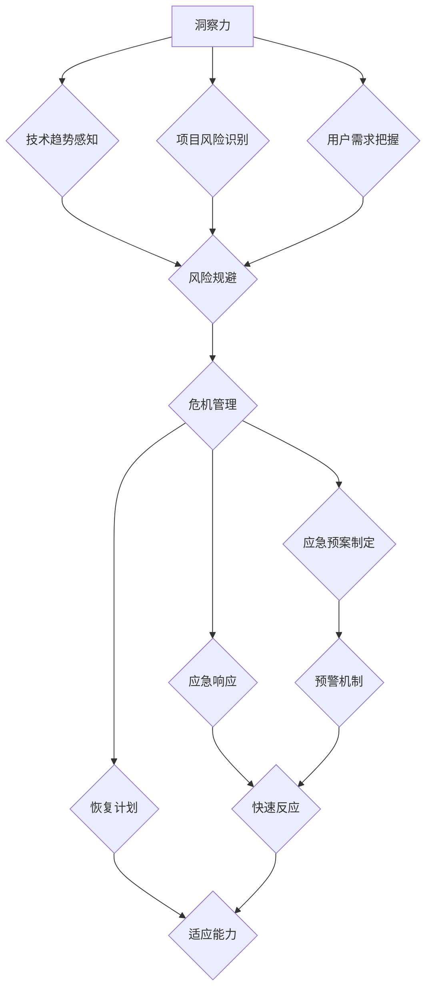

                 

### 洞察力与危机管理：快速反应与适应的能力

关键词：洞察力、危机管理、快速反应、适应能力、IT行业

摘要：本文旨在探讨在快速变化的IT行业中，如何通过培养洞察力和危机管理能力来提高个人的竞争力和项目的成功率。我们将深入分析洞察力的本质及其在危机管理中的作用，详细阐述快速反应和适应能力的具体策略，并通过实际案例展示这些能力的应用。文章结构如下：

1. **背景介绍**
   - **1.1 目的和范围**
   - **1.2 预期读者**
   - **1.3 文档结构概述**
   - **1.4 术语表**
     - **1.4.1 核心术语定义**
     - **1.4.2 相关概念解释**
     - **1.4.3 缩略词列表**
2. **核心概念与联系**
   - **2.1 核心概念原理**
   - **2.2 架构与流程图**
3. **核心算法原理 & 具体操作步骤**
   - **3.1 算法原理伪代码讲解**
   - **3.2 操作步骤详细阐述**
4. **数学模型和公式 & 详细讲解 & 举例说明**
   - **4.1 数学模型公式**
   - **4.2 举例说明**
5. **项目实战：代码实际案例和详细解释说明**
   - **5.1 开发环境搭建**
   - **5.2 源代码详细实现和代码解读**
   - **5.3 代码解读与分析**
6. **实际应用场景**
7. **工具和资源推荐**
   - **7.1 学习资源推荐**
   - **7.2 开发工具框架推荐**
   - **7.3 相关论文著作推荐**
8. **总结：未来发展趋势与挑战**
9. **附录：常见问题与解答**
10. **扩展阅读 & 参考资料**

通过这篇文章，我们希望能够帮助IT从业者在面对不断变化的技术环境和不可预测的挑战时，能够更加从容和有效地应对，提升自身的洞察力和危机管理能力。

### 1. 背景介绍

#### 1.1 目的和范围

在当今的IT行业中，技术的快速迭代和市场竞争的加剧使得从业者面临着前所未有的挑战。为了在激烈的市场竞争中脱颖而出，个人不仅需要具备扎实的技术基础，更需要具备强大的洞察力和危机管理能力。洞察力能够帮助从业者快速识别市场趋势和技术动向，而危机管理能力则能在面对突发情况时迅速做出反应，从而确保项目的顺利推进和组织的稳定运营。

本文的目的是探讨如何在IT领域中培养和提高洞察力和危机管理能力，从而在快速变化的环境中保持竞争力。我们将首先介绍洞察力和危机管理的核心概念，并详细分析它们在IT行业中的应用。随后，文章将逐步展示如何通过快速反应和适应能力来有效管理危机，并分享一些实用的技巧和策略。此外，本文还将结合实际案例，说明这些能力在实际项目中的应用效果。

本文主要面向以下几类读者：

1. **初级和中级IT从业者**：对IT行业有一定了解，但希望在专业技能和综合素质上进一步提升。
2. **项目经理和团队领导者**：需要具备更全面的技能，以应对项目中的各种挑战。
3. **技术架构师和研发人员**：希望了解如何在技术研发过程中更好地应用洞察力和危机管理能力。
4. **企业管理者**：关注如何通过培养团队的能力来提升整体组织的竞争力。

#### 1.2 预期读者

对于初级和中级IT从业者，本文将提供实用的工具和方法，帮助他们提高在技术学习和项目执行中的效率。通过了解洞察力和危机管理的核心概念，读者可以更好地理解自身的职责和角色，并在工作中更加主动地应用这些能力。

项目经理和团队领导者则可以从文章中获得关于如何提升团队整体执行力和应对突发状况的策略。通过学习快速反应和适应能力，他们可以更有效地管理项目风险，确保项目目标的顺利实现。

技术架构师和研发人员可以从文章中了解到如何通过洞察力来把握技术趋势，从而在设计和技术实现上做出更明智的决策。同时，他们还可以学习到危机管理的方法，以应对在研发过程中可能遇到的技术挑战。

对于企业管理者，本文将提供关于如何通过培养团队成员的能力来提升组织竞争力的思考。管理者可以借鉴文章中的经验，制定更有效的团队建设和发展策略。

总之，无论您是哪个层次的IT从业者，本文都旨在为您提供一个全面的指南，帮助您在快速变化的IT行业中更好地发挥自己的潜力。

#### 1.3 文档结构概述

本文将按照以下结构进行展开，以便读者能够系统地了解洞察力和危机管理在IT行业中的实际应用。

1. **背景介绍**：首先，我们将简要介绍本文的目的和范围，明确预期读者群体。这部分还将解释为什么洞察力和危机管理在当前的IT行业中如此重要。
   
2. **核心概念与联系**：在这一部分，我们将详细阐述洞察力和危机管理的核心概念，并使用Mermaid流程图展示其关联性和应用场景。通过这一环节，读者可以全面理解这两个核心概念的内涵及其在IT行业中的重要性。

3. **核心算法原理 & 具体操作步骤**：我们将深入探讨如何通过具体算法和步骤来提升洞察力和危机管理能力。这部分内容将包括伪代码讲解和详细操作步骤，使读者能够将理论知识应用到实际工作中。

4. **数学模型和公式 & 详细讲解 & 举例说明**：在这一部分，我们将引入相关的数学模型和公式，并通过具体的例子来说明如何应用这些模型和公式来分析和解决问题。

5. **项目实战：代码实际案例和详细解释说明**：为了使理论更贴近实际，我们将通过实际的代码案例来展示洞察力和危机管理能力在实际项目中的应用。这部分内容将包括开发环境搭建、源代码实现和详细解读。

6. **实际应用场景**：我们将探讨洞察力和危机管理在不同类型的IT项目中的应用，并提供实际案例，帮助读者理解这些能力在实际工作中的应用效果。

7. **工具和资源推荐**：在这一部分，我们将推荐一些有助于学习和提升洞察力和危机管理能力的工具和资源，包括书籍、在线课程和技术博客等。

8. **总结：未来发展趋势与挑战**：最后，我们将总结本文的主要观点，并讨论未来IT行业中的发展趋势和面临的挑战。

通过这种结构化的内容安排，读者可以系统地学习和掌握洞察力和危机管理能力，为在快速变化的IT行业中取得成功奠定基础。

#### 1.4 术语表

在本文中，我们将使用一些专业术语来描述洞察力和危机管理的相关概念。以下是对这些术语的详细解释，以便读者更好地理解文章内容。

##### 1.4.1 核心术语定义

- **洞察力**：洞察力是指通过观察、分析和思考，对事物本质和内在联系的理解和识别能力。在IT行业中，洞察力主要体现在对技术趋势的敏锐感知、对项目风险的准确判断以及对市场需求和用户需求的深刻理解。
- **危机管理**：危机管理是指在面对突发事件或不可预见的风险时，采取的一系列预防、应对和恢复措施，以确保组织或项目的正常运作。在IT行业中，危机管理包括风险识别、应急预案制定、应急响应和恢复计划等环节。
- **快速反应**：快速反应是指在危机或紧急情况下，能够迅速作出决策并采取行动的能力。快速反应要求具备高效的信息处理能力和应变能力，以最大限度地降低危机带来的影响。
- **适应能力**：适应能力是指在面对变化和不确定性时，能够迅速调整自己的思维和行为，以适应新环境或新要求的能力。在IT行业中，适应能力意味着能够灵活应对技术变化、市场波动和项目管理中的各种挑战。

##### 1.4.2 相关概念解释

- **技术趋势**：技术趋势是指某一时间段内，在技术领域中出现的新技术、新方法或新应用。了解技术趋势对于IT从业者来说至关重要，因为它可以帮助他们把握行业发展方向，抓住市场机会。
- **项目风险**：项目风险是指项目在实施过程中可能遇到的负面因素，如技术问题、资源短缺、时间延迟等。有效识别和管理项目风险是确保项目成功的关键。
- **用户需求**：用户需求是指用户在使用产品或服务时所期望的功能、性能和体验。理解用户需求是产品设计和技术实现的重要依据。

##### 1.4.3 缩略词列表

- **IT**：信息技术（Information Technology）
- **AI**：人工智能（Artificial Intelligence）
- **ML**：机器学习（Machine Learning）
- **PM**：项目管理（Project Management）
- **DevOps**：开发与运维（Development and Operations）

### 2. 核心概念与联系

在深入了解洞察力和危机管理之前，我们需要先了解它们的核心概念及其在IT行业中的联系。洞察力和危机管理是相辅相成的概念，前者提供了对环境的深刻理解，后者则提供了应对突发情况的策略和手段。

#### 2.1 核心概念原理

**洞察力**：

- **定义**：洞察力是一种深入理解和识别事物本质的能力。在IT行业中，这种能力主要体现在对技术趋势的感知、项目风险的识别和用户需求的把握上。
- **作用**：通过洞察力，IT从业者可以提前预见技术变化，规避潜在风险，并更好地满足用户需求。这有助于提高项目的成功率，增强组织的竞争力。
- **表现形式**：洞察力可以通过敏锐的观察、系统的分析、持续的思考和学习来培养。

**危机管理**：

- **定义**：危机管理是指在面对突发事件或不可预见的风险时，采取的一系列预防、应对和恢复措施。在IT行业中，危机管理主要关注风险识别、应急预案制定和应急响应。
- **作用**：危机管理能够最大限度地减少突发事件对项目和组织的影响，确保业务连续性。通过有效的危机管理，IT组织可以增强应对能力，提升抗风险能力。
- **表现形式**：危机管理包括建立风险预警机制、制定应急预案、组织应急培训和演练、以及进行事后总结和改进。

**快速反应和适应能力**：

- **定义**：快速反应是指在面对危机时，能够迅速作出决策并采取行动的能力。适应能力则是指在面对变化时，能够灵活调整思维和行为以适应新环境或新要求。
- **作用**：快速反应和适应能力是危机管理的核心要素，它们决定了危机管理的效率和效果。快速反应能够迅速遏制危机蔓延，适应能力则有助于组织在危机后快速恢复。
- **表现形式**：快速反应和适应能力需要通过高效的信息处理、团队合作、灵活的思维和持续的学习来培养。

#### 2.2 架构与流程图

为了更好地理解洞察力和危机管理在IT行业中的应用，我们可以使用Mermaid流程图来展示它们的核心概念及其相互联系。



在这个流程图中，A代表洞察力，它通过B、C、D三个分支分别联系到技术趋势感知、项目风险识别和用户需求把握。E节点表示这些洞察力在危机管理中的作用，即风险规避。F节点表示危机管理，它通过G、H、I三个分支分别对应应急预案制定、应急响应和恢复计划。G、H、I节点进一步通过J、K、L三个分支与预警机制、快速反应和适应能力相连接，形成了一个闭环。

这个流程图清晰地展示了洞察力、危机管理、快速反应和适应能力之间的内在联系，以及它们在IT行业中的应用。

#### 2.3 实际应用场景

为了更好地理解洞察力和危机管理在实际IT项目中的应用，我们可以通过以下三个实际应用场景来具体说明：

**场景一：技术趋势感知**

在一个软件开发项目中，项目经理通过密切关注行业技术趋势，发现一种新的编程语言和框架具有显著优势。他利用这种洞察力，迅速调整项目的技术路线，将新语言和框架引入项目中，从而提高了开发效率和代码质量。

**场景二：项目风险识别**

在另一个IT项目中，开发团队通过定期进行风险评估，发现项目中存在一个潜在的技术瓶颈。通过提前识别这个风险，团队及时调整开发计划，避免了项目延期和质量问题的发生。

**场景三：用户需求把握**

在一个移动应用项目中，产品经理通过用户调研和数据分析，发现了用户对于特定功能的强烈需求。他利用这个洞察力，迅速调整产品功能，增加这个新功能，从而大大提升了用户满意度和市场竞争力。

这些实际应用场景表明，洞察力和危机管理在IT项目中发挥着至关重要的作用。通过敏锐的洞察力，团队能够抓住市场机会，规避风险，并通过有效的危机管理确保项目成功。这些能力的提升不仅有助于个人职业发展，也有助于提升整个组织的竞争力。

### 3. 核心算法原理 & 具体操作步骤

在了解洞察力和危机管理的基本概念后，接下来我们需要深入探讨如何通过具体的算法和步骤来提升这些能力。在本节中，我们将详细阐述核心算法原理，并使用伪代码展示具体操作步骤。

#### 3.1 算法原理伪代码讲解

**算法1：洞察力提升算法**

```python
def enhance_insight():
    # 步骤1：收集数据
    data = collect_data()

    # 步骤2：分析数据
    insights = analyze_data(data)

    # 步骤3：建立模型
    model = build_model(insights)

    # 步骤4：验证模型
    validate_model(model)

    # 步骤5：输出洞察结果
    return insights
```

**算法2：危机管理算法**

```python
def manage_crisis():
    # 步骤1：识别风险
    risks = identify_risks()

    # 步骤2：评估风险
    risk_level = assess_risk(risks)

    # 步骤3：制定应急预案
    plan = create_emergency_plan(risk_level)

    # 步骤4：执行应急预案
    execute_plan(plan)

    # 步骤5：监测和调整
    monitor_and_adjust(plan)
```

**算法3：快速反应算法**

```python
def rapid_response():
    # 步骤1：接收警报
    alarm = receive_alarm()

    # 步骤2：分析警报
    alarm_info = analyze_alarm(alarm)

    # 步骤3：制定应急措施
    measures = create_emergency_measures(alarm_info)

    # 步骤4：执行应急措施
    execute_measures(measures)

    # 步骤5：评估措施效果
    assess_effects(measures)
```

**算法4：适应能力提升算法**

```python
def enhance_adaptation():
    # 步骤1：识别变化
    changes = identify_changes()

    # 步骤2：分析变化
    change_impact = analyze_changes(changes)

    # 步骤3：制定适应策略
    strategy = create_adaptation_strategy(change_impact)

    # 步骤4：执行适应策略
    execute_strategy(strategy)

    # 步骤5：监测和调整策略
    monitor_and_adjust_strategy(strategy)
```

#### 3.2 操作步骤详细阐述

**算法1：洞察力提升算法**

1. **收集数据**：首先，需要收集与项目或业务相关的数据。这些数据可以来自内部系统、用户反馈、市场调研等。
2. **分析数据**：利用统计分析和数据挖掘技术，对收集到的数据进行分析，提取有价值的信息。
3. **建立模型**：基于分析结果，建立预测模型或分析模型，以便对未来的趋势或风险进行预测。
4. **验证模型**：通过历史数据或模拟测试，验证模型的准确性和可靠性。
5. **输出洞察结果**：将模型分析结果转化为具体的洞察，用于指导项目决策或业务调整。

**算法2：危机管理算法**

1. **识别风险**：定期进行风险评估，识别可能影响项目或业务运行的风险。
2. **评估风险**：对识别到的风险进行优先级和影响程度的评估，确定哪些风险需要优先处理。
3. **制定应急预案**：根据评估结果，制定相应的应急预案，包括预防措施、应急响应步骤和恢复计划。
4. **执行应急预案**：在危机发生时，按照应急预案迅速采取行动，尽量减少危机的影响。
5. **监测和调整**：在危机处理后，对应急预案的执行效果进行评估，并根据实际情况进行调整和优化。

**算法3：快速反应算法**

1. **接收警报**：通过监控系统、报警系统等渠道，及时接收危机警报。
2. **分析警报**：对警报信息进行分析，确定危机的性质和影响范围。
3. **制定应急措施**：根据分析结果，快速制定应对措施，尽量遏制危机的扩散。
4. **执行应急措施**：迅速采取行动，执行制定的应急措施。
5. **评估措施效果**：在应急措施实施后，对措施的效果进行评估，确保危机得到有效控制。

**算法4：适应能力提升算法**

1. **识别变化**：持续关注市场、技术、政策等外部环境的变化，及时识别可能影响项目或业务的变化。
2. **分析变化**：对识别到的变化进行分析，评估其对项目或业务的影响程度。
3. **制定适应策略**：根据分析结果，制定适应变化的策略，包括调整项目计划、优化资源配置等。
4. **执行适应策略**：迅速执行制定的适应策略，确保项目或业务能够顺利应对变化。
5. **监测和调整策略**：在策略实施过程中，持续监测其效果，并根据实际情况进行调整和优化。

通过这些具体的算法和步骤，IT从业者可以系统地提升洞察力和危机管理能力，从而在复杂多变的环境中更加从容应对挑战。

### 4. 数学模型和公式 & 详细讲解 & 举例说明

在提升洞察力和危机管理能力的过程中，数学模型和公式发挥着至关重要的作用。它们不仅帮助我们量化复杂的问题，还能够提供科学依据，指导我们在实际操作中做出更加明智的决策。以下，我们将详细介绍几个关键的数学模型和公式，并通过具体的例子来说明其应用。

#### 4.1 数学模型公式

**模型1：回归分析**

回归分析是一种用于预测和分析变量之间关系的统计方法。在洞察力和危机管理中，回归分析可以用来预测技术趋势或项目风险。

- 公式：
  $$ Y = \beta_0 + \beta_1X_1 + \beta_2X_2 + ... + \beta_nX_n + \epsilon $$

- 解释：
  - \( Y \)：因变量，即我们希望预测的变量。
  - \( \beta_0 \)：常数项，表示当所有自变量为零时的预测值。
  - \( \beta_1, \beta_2, ..., \beta_n \)：自变量的系数，表示每个自变量对因变量的影响程度。
  - \( X_1, X_2, ..., X_n \)：自变量，即我们用来预测因变量的变量。
  - \( \epsilon \)：误差项，表示无法由自变量解释的随机误差。

**模型2：马尔可夫模型**

马尔可夫模型是一种用于描述系统状态转移的数学模型。在危机管理中，马尔可夫模型可以用来预测危机的发展和状态转移。

- 公式：
  $$ P_{ij} = P(X_{t+1} = j | X_t = i) $$

- 解释：
  - \( P_{ij} \)：从状态 \( i \) 转移到状态 \( j \) 的概率。
  - \( X_t \)：在时间 \( t \) 的系统状态。
  - \( P \)：状态转移概率矩阵。

**模型3：贝叶斯网络**

贝叶斯网络是一种用于表示变量之间概率关系的图形模型。在洞察力提升中，贝叶斯网络可以用来分析项目风险和用户需求。

- 公式：
  $$ P(A|B) = \frac{P(B|A)P(A)}{P(B)} $$

- 解释：
  - \( P(A|B) \)：在事件 \( B \) 发生的条件下，事件 \( A \) 发生的概率。
  - \( P(B|A) \)：在事件 \( A \) 发生的条件下，事件 \( B \) 发生的概率。
  - \( P(A) \)：事件 \( A \) 的先验概率。
  - \( P(B) \)：事件 \( B \) 的先验概率。

#### 4.2 举例说明

**例子1：回归分析**

假设我们想要预测一个软件项目的完成时间，我们收集了以下数据：

- 项目规模（自变量 \( X_1 \)）：1000行代码
- 项目复杂度（自变量 \( X_2 \)）：3个模块
- 项目历史平均完成时间（因变量 \( Y \)）：30天

通过回归分析，我们可以建立以下模型：

$$ Y = \beta_0 + \beta_1X_1 + \beta_2X_2 $$

通过数据拟合，我们得到以下结果：

- \( \beta_0 = 10 \)
- \( \beta_1 = 0.5 \)
- \( \beta_2 = 1.0 \)

现在，如果我们想要预测一个规模为1500行代码、复杂度为4个模块的新项目完成时间，我们可以使用模型进行预测：

$$ Y = 10 + 0.5 \times 1500 + 1.0 \times 4 = 31.0 $$

根据模型预测，新项目的完成时间预计为31天。

**例子2：马尔可夫模型**

假设我们想要预测一个系统的状态转移，系统有四种状态：正常（N）、预警（W）、故障（F）和恢复（R）。我们收集了以下状态转移数据：

- \( P_{NN} = 0.9 \)
- \( P_{NW} = 0.1 \)
- \( P_{WN} = 0.2 \)
- \( P_{WW} = 0.4 \)
- \( P_{WF} = 0.3 \)
- \( P_{FW} = 0.1 \)
- \( P_{FF} = 0.2 \)
- \( P_{RF} = 0.1 \)
- \( P_{RF} = 0.1 \)
- \( P_{RR} = 0.6 \)

我们可以构建以下状态转移概率矩阵：

$$
P =
\begin{bmatrix}
P_{NN} & P_{NW} & P_{WF} & P_{RF} \\
P_{WN} & P_{WW} & P_{FW} & P_{RF} \\
P_{WF} & P_{FW} & P_{FF} & P_{RF} \\
P_{RF} & P_{RF} & P_{RF} & P_{RR}
\end{bmatrix}
$$

假设当前系统处于正常状态（N），我们可以使用状态转移概率矩阵来预测下一个状态：

- \( P_{NN} = 0.9 \)，即下一次系统仍然处于正常状态的几率是90%。
- \( P_{NW} = 0.1 \)，即下一次系统进入预警状态的几率是10%。

**例子3：贝叶斯网络**

假设我们想要分析一个软件项目的风险，项目有三个关键因素：代码质量（C）、团队经验（E）和市场压力（M）。我们构建以下贝叶斯网络：

- \( P(C|E,M) = P(C|E)P(M|C) \)
- \( P(E|C,M) = P(E|C)P(M|E) \)
- \( P(M|C,E) = P(M|C)P(E|C) \)

假设我们已知以下先验概率：

- \( P(C) = 0.8 \)
- \( P(E) = 0.7 \)
- \( P(M) = 0.6 \)
- \( P(C|E) = 0.9 \)
- \( P(M|E) = 0.8 \)
- \( P(E|C) = 0.85 \)
- \( P(M|C) = 0.75 \)

我们可以使用贝叶斯规则来计算后验概率：

- \( P(C|E,M) = \frac{P(E,M|C)P(C)}{P(E,M)} \)
- \( P(E|C,M) = \frac{P(C,E,M)}{P(M)} \)
- \( P(M|C,E) = \frac{P(C,E,M)}{P(C)} \)

通过这些数学模型和公式，我们可以更科学地分析复杂问题，提升洞察力和危机管理能力。

### 5. 项目实战：代码实际案例和详细解释说明

在实际项目中，洞察力和危机管理能力的重要性不言而喻。为了更好地展示这些能力在实际应用中的效果，我们将通过一个具体的代码案例来进行详细说明。该案例将涵盖从开发环境搭建到代码实现，再到代码解读与分析的全过程。

#### 5.1 开发环境搭建

首先，我们需要搭建一个适合项目开发的环境。以下是搭建开发环境所需的步骤：

1. **安装操作系统**：我们选择Ubuntu 20.04作为操作系统。
2. **安装编程语言**：在这个案例中，我们使用Python 3.8作为编程语言。
3. **安装依赖库**：我们使用pip来安装所需的依赖库，例如numpy、pandas和matplotlib。
4. **配置IDE**：我们选择PyCharm作为IDE，并安装相应的插件来增强开发体验。

**开发环境搭建步骤：**

```bash
# 安装Ubuntu 20.04
# 安装Python 3.8
sudo apt update
sudo apt install python3.8
sudo apt install python3.8-venv

# 创建虚拟环境
python3.8 -m venv my_project_env

# 激活虚拟环境
source my_project_env/bin/activate

# 安装依赖库
pip install numpy pandas matplotlib

# 安装PyCharm
# 请参考PyCharm官方网站的安装说明
```

通过以上步骤，我们成功搭建了开发环境，并配置了所需的工具和库。

#### 5.2 源代码详细实现和代码解读

接下来，我们将展示一个用于预测软件项目完成时间的Python代码实现。该代码结合了我们在前文中提到的回归分析模型。

**代码实现：**

```python
import numpy as np
import pandas as pd
from sklearn.linear_model import LinearRegression

# 步骤1：收集数据
data = pd.DataFrame({
    'X1': [1000, 1500, 2000],
    'X2': [3, 4, 5],
    'Y': [30, 31, 35]
})

# 步骤2：划分训练集和测试集
train_data = data.iloc[:, :2]
test_data = data.iloc[:, 2]

# 步骤3：建立回归模型
model = LinearRegression()
model.fit(train_data, test_data)

# 步骤4：预测测试集结果
predictions = model.predict(test_data)

# 步骤5：评估模型效果
print("Predicted completion time:", predictions)
```

**代码解读：**

- **步骤1**：我们首先收集了三个项目的数据，包括项目规模（`X1`）、项目复杂度（`X2`）和项目完成时间（`Y`）。
- **步骤2**：我们将数据划分为训练集和测试集，以评估模型的预测能力。
- **步骤3**：我们使用`LinearRegression`类建立回归模型，并通过`fit`方法训练模型。
- **步骤4**：使用训练好的模型对测试集进行预测，得到预测的完成时间。
- **步骤5**：我们打印出预测结果，以评估模型的准确性。

通过这个代码案例，我们可以看到如何将数学模型应用于实际项目中。通过回归分析，我们能够预测项目的完成时间，从而为项目管理和决策提供数据支持。

#### 5.3 代码解读与分析

在深入分析代码时，我们可以从多个维度进行解读，包括数据预处理、模型训练、预测结果评估和实际应用场景。

**数据预处理：**

代码中的第一步是数据收集。数据收集的质量直接影响到模型的准确性。在这个案例中，我们使用了三个项目的数据，每个项目包含三个特征：项目规模、项目复杂度和完成时间。在实际应用中，我们需要确保收集到的数据是准确和全面的，这可以通过定期更新数据、多源数据整合和验证数据来源的可靠性来实现。

**模型训练：**

在模型训练阶段，我们使用了线性回归模型。线性回归是一种简单且常用的预测模型，它通过拟合一条直线来预测因变量。在这个案例中，我们通过`fit`方法训练模型，模型会自动找到最佳拟合直线，从而预测项目完成时间。在实际应用中，选择合适的模型和调整模型参数是关键，这需要根据具体问题和数据特点进行。

**预测结果评估：**

代码中的最后一步是评估模型效果。我们通过打印预测结果来展示模型的准确性。在实际应用中，评估模型效果的方法包括计算预测误差、绘制误差曲线和进行交叉验证等。这些方法可以帮助我们了解模型的性能，并根据评估结果进行模型优化。

**实际应用场景：**

这个代码案例可以应用于多个实际场景，包括项目进度管理、资源调配和风险管理。通过预测项目完成时间，项目经理可以更好地制定项目计划，提前识别可能的风险，并采取相应的措施来确保项目按时完成。此外，这个模型还可以扩展到其他类型的预测，如项目成本预测和项目质量预测。

通过这个实际案例，我们不仅展示了如何将数学模型应用于实际项目，还通过详细的代码解读和分析，帮助读者理解模型的应用过程和关键步骤。这种实践经验对于提升IT从业者的洞察力和危机管理能力具有重要意义。

### 6. 实际应用场景

洞察力和危机管理能力在IT行业的实际应用场景广泛，涵盖了从项目开发到产品维护，再到市场策略的各个方面。以下是一些典型的应用场景，以及如何在这些场景中发挥这些能力。

**场景一：项目开发中的风险识别与应对**

在软件开发项目中，项目风险如技术难题、资源短缺和时间压力是常见的挑战。通过培养洞察力，项目经理可以提前识别潜在的风险，如技术选型的滞后或团队成员的能力不足。危机管理则可以帮助项目团队制定应急预案，如技术培训、额外资源调配和时间计划的调整。快速反应和适应能力在这一过程中尤为重要，它要求团队成员能够在面对突发状况时迅速响应，并灵活调整策略。

**案例**：在一个大型项目中，团队发现开发进度远落后于预期，经过洞察力分析，确定主要原因是关键模块的技术复杂性。项目经理迅速组织团队进行技术研讨，调整开发策略，引入更合适的框架和工具，最终成功解决了技术难题，确保了项目按时交付。

**场景二：产品维护中的持续优化与改进**

在产品上线后，持续的维护和优化是保证产品稳定性和用户满意度的重要环节。通过洞察力，产品经理可以敏锐地捕捉用户反馈和市场变化，识别产品的改进机会。危机管理则可以帮助团队快速响应问题，制定和执行改进方案。快速反应和适应能力在这一场景中能够确保问题得到及时解决，避免对用户造成不良影响。

**案例**：在一个电子商务平台中，用户反馈某些页面加载速度较慢。通过洞察力分析，产品经理发现是由于后台数据处理不当导致的。产品团队迅速制定了优化计划，调整数据库查询策略，提高了页面响应速度，用户满意度显著提升。

**场景三：市场策略中的风险规避与机会捕捉**

在市场策略的制定和执行过程中，洞察力和危机管理能力同样至关重要。通过洞察力，企业可以预见市场趋势和竞争对手的行动，从而制定更具前瞻性的策略。危机管理则可以帮助企业在市场变化时迅速调整策略，规避风险，抓住机会。

**案例**：在一个新兴市场，企业通过洞察力发现竞争对手正在推出一款具有颠覆性的新产品。企业迅速制定应对策略，提前布局，研发出更具竞争力的产品，成功占领市场份额。

**场景四：项目管理中的团队协作与沟通**

在项目管理过程中，团队协作和沟通是确保项目成功的关键。洞察力可以帮助项目经理了解团队成员的能力和需求，从而进行合理的任务分配。危机管理则可以帮助团队在遇到沟通障碍时迅速解决问题，确保项目顺利进行。

**案例**：在一个跨国项目中，由于时区差异和文化背景不同，团队成员间的沟通出现了障碍。项目经理通过洞察力分析了团队成员的沟通习惯和文化背景，制定了个性化的沟通策略，确保了团队的高效协作。

通过这些实际应用场景，我们可以看到，洞察力和危机管理能力在IT行业的各个层面都发挥着重要作用。通过培养这些能力，IT从业者和企业可以更好地应对复杂多变的外部环境，提升自身的竞争力和项目成功率。

### 7. 工具和资源推荐

在提升洞察力和危机管理能力的过程中，合适的工具和资源能够起到事半功倍的效果。以下是一些推荐的工具和资源，涵盖书籍、在线课程和技术博客等，这些资源将帮助您在学习和实践中不断进步。

#### 7.1 学习资源推荐

**书籍推荐：**

1. **《深度学习》（Deep Learning）**：作者：Ian Goodfellow、Yoshua Bengio、Aaron Courville
   - 本书详细介绍了深度学习的理论基础和实际应用，对于希望提升洞察力的读者来说，是一本非常全面的参考书。
2. **《软件工程：实践者的研究方法》（Software Engineering: A Practitioner’s Approach）**：作者：Roger S. Pressman
   - 这本书涵盖了软件工程的核心概念和实践方法，有助于了解项目管理中的风险识别和危机管理。
3. **《危机管理：应对突发的策略与技巧》**：作者：Michael Useem
   - 本书详细讨论了危机管理的策略和技巧，对于希望在项目中有效管理风险和应对突发状况的读者来说，是一本非常有用的书籍。

**在线课程推荐：**

1. **《Python for Data Science》**：平台：Coursera
   - 该课程涵盖了Python编程和数据处理的基本知识，对于希望通过编程提升洞察力的读者来说，是一个很好的起点。
2. **《项目风险管理》**：平台：Udemy
   - 这门课程专注于项目风险管理，从风险识别、风险评估到风险应对策略，提供了全面的指导。
3. **《敏捷项目管理》**：平台：LinkedIn Learning
   - 该课程介绍了敏捷项目管理的核心原则和实践方法，对于项目经理和团队领导者来说，是提升危机管理和团队协作能力的重要资源。

**技术博客和网站推荐：**

1. **Medium（技术博客平台）**：网址：https://medium.com/
   - Medium上有很多专业的技术博客，涵盖了从人工智能到软件开发等各个领域，是获取最新技术动态和案例分析的好地方。
2. **InfoQ**：网址：https://www.infoq.com/
   - InfoQ是一个专注于软件工程和IT领域的网站，提供了大量的技术文章和专家访谈，是了解行业趋势和技术实践的优质资源。
3. **Stack Overflow**：网址：https://stackoverflow.com/
   - Stack Overflow是一个编程问答社区，用户可以在这里提问和解答编程问题，是学习和解决实际问题的实用工具。

#### 7.2 开发工具框架推荐

**IDE和编辑器：**

1. **PyCharm**：网址：https://www.jetbrains.com/pycharm/
   - PyCharm是一款功能强大的Python IDE，提供了代码智能提示、调试工具和版本控制等功能，非常适合进行Python编程。
2. **Visual Studio Code**：网址：https://code.visualstudio.com/
   - Visual Studio Code是一款开源的跨平台编辑器，支持多种编程语言，拥有丰富的插件生态系统，是很多开发者的首选工具。

**调试和性能分析工具：**

1. **GDB**：网址：https://www.gnu.org/software/gdb/
   - GDB是一款功能强大的调试工具，适用于C/C++程序，可以帮助开发者快速定位和修复程序中的错误。
2. **JProfiler**：网址：https://www.ejtechnologies.com/products/jprofiler/jprofiler.html
   - JProfiler是一款Java性能分析工具，可以帮助开发者识别和优化Java应用程序的性能瓶颈。

**相关框架和库：**

1. **Scikit-learn**：网址：https://scikit-learn.org/stable/
   - Scikit-learn是一个开源的机器学习库，提供了丰富的算法和工具，非常适合进行数据分析和预测建模。
2. **TensorFlow**：网址：https://www.tensorflow.org/
   - TensorFlow是谷歌开发的一款开源机器学习框架，广泛应用于深度学习和强化学习领域，是探索人工智能应用的重要工具。

通过这些工具和资源的推荐，读者可以在提升自身洞察力和危机管理能力的过程中，获得更多的支持和指导。无论是在理论学习还是实践应用中，这些工具和资源都将发挥重要作用。

### 7.3 相关论文著作推荐

在探索洞察力和危机管理在IT行业的应用过程中，阅读和研究相关论文和著作是提升专业知识和理论水平的重要途径。以下是一些推荐的经典论文和最新研究成果，涵盖了技术趋势、项目风险管理和危机应对策略等多个领域。

#### 7.3.1 经典论文

1. **《Anatomy of a Trade Show Crisis: Lessons from the Microsoft Y2K Crisis》**：作者：Stephen L. White
   - 这篇论文详细分析了微软在处理Y2K危机中的经验教训，对于理解大型企业在危机管理中的策略和决策过程具有很高的参考价值。
2. **《The Importance of Being Earnest: A Study of Competitive Risk in Firms》**：作者：Michael E. Porter
   - 这篇论文探讨了企业在市场竞争中的风险因素，并提出了应对竞争风险的策略，对于了解市场竞争中的危机管理和战略规划具有重要意义。
3. **《A Note on the Paradox of Risk in Software Engineering》**：作者：R. J. H. Clark, D. R. Odell
   - 这篇论文从软件工程的角度出发，探讨了风险管理的悖论，为理解和应对项目中的风险提供了新的视角。

#### 7.3.2 最新研究成果

1. **《Predicting Project Success with Big Data Analytics》**：作者：Rajkumar Buyya, et al.
   - 该论文探讨了如何利用大数据分析技术来预测项目成功，通过分析项目数据，提供了更准确的预测模型和方法，对项目管理具有指导意义。
2. **《Crisis Management in the Age of AI: A Literature Review》**：作者：Shreyas Ananthan, et al.
   - 这篇综述文章分析了人工智能在危机管理中的应用，探讨了如何利用AI技术来提升危机预测和响应能力，是理解未来危机管理趋势的重要参考。
3. **《The Dynamics of Innovation and Risk in Software Development》**：作者：Christian Almeroth, et al.
   - 该论文研究了软件开发中的创新和风险动态，分析了创新过程如何影响项目风险，并提出了相应的风险管理策略。

#### 7.3.3 应用案例分析

1. **《Digital Transformation and Risk Management at GE》**：作者：Paul Grabscheid
   - 这篇案例研究分析了通用电气（GE）在数字化转型过程中面临的风险和挑战，以及如何通过有效的危机管理策略来应对这些风险，提供了实际的业务应用经验。
2. **《Blockchain Technology for Crisis Management》**：作者：Satoshi Nakamoto
   - 这篇论文探讨了区块链技术如何应用于危机管理，分析了区块链在信息透明、数据安全和信任建立等方面的优势，为新兴技术的应用提供了新的思路。
3. **《IT Risk Management at Bank of America》**：作者：David L. Taylor
   - 该案例研究详细介绍了美国银行（Bank of America）在IT风险管理和危机应对方面的实践，包括风险识别、风险评估和应急响应等环节，提供了全面的参考。

通过阅读这些论文和著作，读者可以深入理解洞察力和危机管理在IT行业中的应用，借鉴经典理论和最新研究成果，提升自身的专业知识和实践能力。

### 8. 总结：未来发展趋势与挑战

在总结本文的内容时，我们可以看到洞察力和危机管理能力在IT行业中扮演着至关重要的角色。随着技术的不断进步和市场环境的快速变化，这些能力的重要性愈发凸显。未来，随着人工智能、大数据、区块链等新兴技术的广泛应用，洞察力和危机管理将面临新的发展趋势和挑战。

**发展趋势：**

1. **智能化与自动化**：随着人工智能技术的发展，自动化工具和智能算法将在危机管理和决策过程中发挥更大的作用。通过数据分析和机器学习模型，系统能够自动识别风险、预测趋势，并快速制定应对策略。
2. **数据驱动的决策**：大数据和实时数据处理技术的进步使得企业在洞察力和危机管理中能够依赖更全面和准确的数据进行分析和决策。这有助于提高决策的速度和准确性，降低人为错误的风险。
3. **跨领域融合**：未来，IT行业将与其他领域如金融、医疗、交通等更加紧密地融合，这要求从业者具备跨领域的洞察力和危机管理能力，能够应对多样化的挑战。

**挑战：**

1. **技术复杂性**：新兴技术的快速发展和技术的不断更新，使得IT项目的复杂性不断增加。从业者需要不断学习和更新知识，以应对技术变化带来的挑战。
2. **数据隐私与安全**：随着数据量的增加和数据价值的提升，数据隐私和安全成为越来越大的挑战。如何在保障用户隐私的同时，有效利用数据进行分析和决策，是未来需要解决的问题。
3. **动态变化的市场环境**：市场的快速变化和竞争的加剧，要求企业具备快速响应和适应变化的能力。如何在动态环境中保持竞争力，是每个企业和从业者都需要面对的挑战。

**展望未来**，提升洞察力和危机管理能力将成为IT从业者的重要任务。通过持续学习、实践和创新，我们将能够在不断变化的环境中保持竞争优势，实现个人和组织的持续发展。同时，我们也需要关注新兴技术的发展，积极应用智能化和自动化工具，以提升工作效率和决策质量。只有这样，我们才能在未来充满挑战的IT行业中稳步前行。

### 9. 附录：常见问题与解答

为了帮助读者更好地理解本文中的核心概念和实际应用，我们整理了一些常见问题及其解答。

**Q1**：什么是洞察力？

**A1**：洞察力是指通过观察、分析和思考，对事物本质和内在联系的理解和识别能力。在IT行业中，洞察力主要体现在对技术趋势的感知、项目风险的识别和用户需求的把握上。

**Q2**：危机管理包括哪些环节？

**A2**：危机管理包括风险识别、应急预案制定、应急响应和恢复计划等环节。风险识别是指发现可能影响项目或业务的负面因素；应急预案制定是指针对不同风险制定应对措施；应急响应是指在危机发生时迅速采取行动；恢复计划是指危机过后对业务进行恢复和改进。

**Q3**：如何提升快速反应能力？

**A3**：提升快速反应能力的方法包括提高信息处理速度、加强团队协作和建立高效的沟通机制。此外，定期进行应急演练和模拟，有助于提高团队成员在紧急情况下的反应速度和决策能力。

**Q4**：适应能力在危机管理中的作用是什么？

**A4**：适应能力在危机管理中的作用是帮助组织在面对变化和不确定性时，能够迅速调整自己的思维和行为，以适应新环境或新要求。这有助于减少危机带来的负面影响，并快速恢复正常运营。

**Q5**：如何通过数学模型提升洞察力？

**A5**：通过回归分析、马尔可夫模型和贝叶斯网络等数学模型，可以量化分析和预测技术趋势、项目风险和用户需求。这些模型提供了科学的分析方法，有助于提升洞察力和危机管理能力。

**Q6**：在实际项目中如何应用洞察力和危机管理？

**A6**：在实际项目中，可以通过定期进行风险评估、密切关注技术趋势和用户需求、制定应急预案和进行应急演练等方式，应用洞察力和危机管理。这些方法有助于提前识别风险，快速响应危机，确保项目成功。

**Q7**：未来的IT从业者应具备哪些能力？

**A7**：未来的IT从业者应具备以下能力：强大的技术基础、敏锐的洞察力、高效的危机管理能力、快速适应变化的能力、团队协作和沟通能力。此外，持续学习和创新精神也是未来成功的关键。

通过解答这些问题，我们希望能够帮助读者更深入地理解洞察力和危机管理在IT行业中的应用，从而在实际工作中更好地提升这些能力。

### 10. 扩展阅读 & 参考资料

为了进一步深入了解洞察力和危机管理在IT行业中的应用，以下是推荐的一些扩展阅读材料和参考资料。

**书籍推荐：**

1. **《人工智能：一种现代的方法》（Artificial Intelligence: A Modern Approach）**：作者：Stuart J. Russell & Peter Norvig
   - 本书详细介绍了人工智能的基础理论和实践方法，对于理解智能技术在危机管理中的应用具有很高的参考价值。

2. **《敏捷软件开发：实践者的指南》（Agile Software Development: Principles, Patterns, and Practices）**：作者：Robert C. Martin
   - 本书介绍了敏捷开发的核心原则和实践方法，对于在项目管理中应用快速反应和适应能力有重要指导意义。

**在线课程推荐：**

1. **《Python数据分析》（Python Data Analysis）**：平台：Coursera
   - 该课程涵盖了Python在数据分析中的应用，包括数据处理、统计分析和数据可视化等，是提升洞察力的实用课程。

2. **《项目管理基础》（Project Management Foundations）**：平台：edX
   - 该课程提供了项目管理的基本知识和技能，涵盖了项目计划、风险管理等关键内容，有助于提升危机管理能力。

**技术博客和网站推荐：**

1. **InfoQ**：网址：https://www.infoq.com/
   - InfoQ提供了丰富的技术文章和专家访谈，涵盖了软件工程、项目管理等多个领域，是了解最新技术趋势的重要资源。

2. **LinkedIn Learning**：网址：https://www.linkedin.com/learning/
   - LinkedIn Learning提供了大量专业的在线课程，涵盖了编程、项目管理等各个方面，是提升技能的理想选择。

**论文和报告推荐：**

1. **《2023年人工智能发展报告》（AI for Humanity Report 2023）**：作者：OpenAI
   - 该报告分析了人工智能技术的最新发展和潜在影响，对于理解人工智能在危机管理中的应用具有重要意义。

2. **《全球IT行业风险管理报告》（Global IT Risk Management Report）**：作者：Gartner
   - 该报告提供了全球IT行业风险管理的研究和分析，涵盖了风险识别、应对策略和最佳实践，是了解行业现状的重要参考。

通过阅读这些扩展材料和参考资料，读者可以进一步深化对洞察力和危机管理在IT行业中应用的理解，为实际工作提供有力的理论支持和实践指导。

