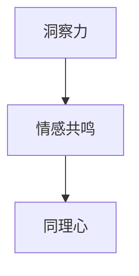
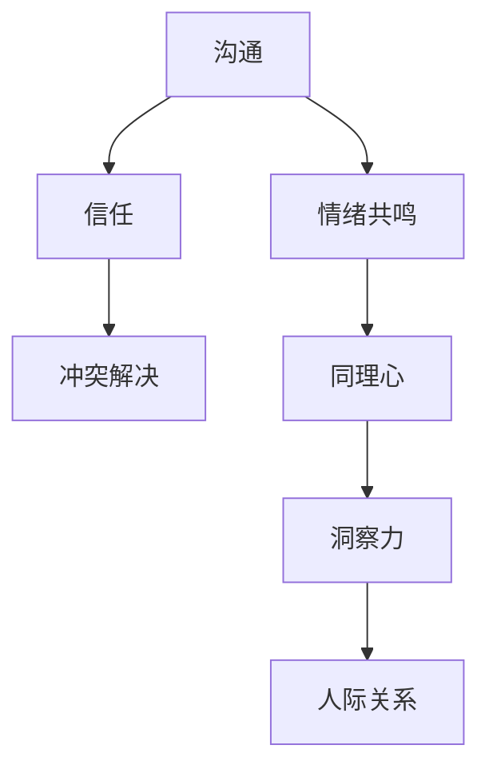

                 

# 洞察力与同理心：理解他人的能力

## 关键词
- 洞察力
- 同理心
- 人际关系
- 心理学
- 人工智能
- 技术应用

## 摘要
本文将探讨洞察力和同理心在人际关系中的重要性，以及如何在技术领域中应用这些能力。我们将首先介绍洞察力和同理心的定义和概念，随后通过一个具体的案例来展示如何通过技术手段提升这些能力。此外，本文还将讨论在实际应用中面临的挑战和解决策略，最后提出未来发展的趋势和展望。

## 1. 背景介绍

### 1.1 目的和范围
本文旨在深入探讨洞察力和同理心在人际关系中的作用，并通过具体的技术手段来提升这些能力。我们希望本文能为读者提供一个全面的视角，帮助他们在技术领域和现实生活中更好地理解和沟通他人。

### 1.2 预期读者
本文适合对人际关系、心理学和技术应用感兴趣的读者，特别是那些希望提升自己洞察力和同理心能力的专业人士。

### 1.3 文档结构概述
本文分为十个部分。首先，我们将介绍洞察力和同理心的基本概念。然后，通过一个实际案例展示如何运用技术手段提升这些能力。接着，我们将深入讨论这些能力在技术领域的应用。之后，本文将探讨在实际应用中面临的挑战和解决策略。最后，我们将展望未来发展趋势，并总结全文。

### 1.4 术语表

#### 1.4.1 核心术语定义
- 洞察力：指能够迅速理解他人意图、情绪和行为的能力。
- 同理心：指能够站在他人角度思考问题，感同身受的情感共鸣能力。

#### 1.4.2 相关概念解释
- 人际关系：指个体与个体之间的相互作用和影响。
- 技术应用：指将技术手段应用于实际场景中，以解决问题或提升效率。

#### 1.4.3 缩略词列表
无

## 2. 核心概念与联系

### 2.1 洞察力与同理心的关系
洞察力和同理心是密切相关的概念。洞察力是同理心的基础，而同理心则是在洞察力基础上进一步发展和深化的能力。如图1所示：



### 2.2 洞察力与同理心在人际关系中的作用
在人际关系中，洞察力和同理心发挥着至关重要的作用。它们有助于建立信任、增进沟通、化解冲突，从而促进良好的人际关系。如图2所示：



## 3. 核心算法原理 & 具体操作步骤

### 3.1 洞察力的算法原理

#### 3.1.1 概述
洞察力的提升可以借助机器学习和自然语言处理技术。以下是基本的算法原理和操作步骤：

```python
# 伪代码：洞察力算法原理
def insight_algorithm(data):
    # 数据预处理
    preprocessed_data = preprocess(data)
    
    # 特征提取
    features = extract_features(preprocessed_data)
    
    # 模型训练
    model = train_model(features)
    
    # 预测
    prediction = model.predict(new_data)
    
    return prediction
```

#### 3.1.2 具体操作步骤
1. 数据预处理：清洗和标准化原始数据，使其适合机器学习模型。
2. 特征提取：从原始数据中提取有用的特征，如情感词、关键词等。
3. 模型训练：使用训练数据集训练机器学习模型，如情感分析模型、关键词提取模型等。
4. 预测：使用训练好的模型对新数据进行预测，以获取洞察力。

### 3.2 同理心的算法原理

#### 3.2.1 概述
同理心的提升可以通过情感识别和情感模拟算法实现。以下是基本的算法原理和操作步骤：

```python
# 伪代码：同理心算法原理
def empathy_algorithm(data):
    # 数据预处理
    preprocessed_data = preprocess(data)
    
    # 情感识别
    emotions = recognize_emotions(preprocessed_data)
    
    # 情感模拟
    simulated_emotions = simulate_emotions(emotions)
    
    return simulated_emotions
```

#### 3.2.2 具体操作步骤
1. 数据预处理：清洗和标准化原始数据，使其适合情感识别和模拟算法。
2. 情感识别：使用情感识别模型对文本数据进行分析，识别出其中的情感。
3. 情感模拟：根据识别出的情感，生成相应的情感模拟输出。

## 4. 数学模型和公式 & 详细讲解 & 举例说明

### 4.1 洞察力的数学模型

#### 4.1.1 概述
洞察力的数学模型主要涉及文本分析和机器学习。以下是基本的数学模型和公式：

$$
P(\text{洞察力}|\text{数据}) = \frac{P(\text{数据}|\text{洞察力}) \cdot P(\text{洞察力})}{P(\text{数据})}
$$

其中，$P(\text{洞察力}|\text{数据})$ 表示给定数据后洞察力的概率，$P(\text{数据}|\text{洞察力})$ 表示在洞察力存在的情况下数据的概率，$P(\text{洞察力})$ 表示洞察力的先验概率，$P(\text{数据})$ 表示数据的概率。

#### 4.1.2 举例说明
假设我们有以下一组文本数据：
1. “我很高兴听到这个消息。”
2. “这个项目进展得非常顺利。”
3. “我已经完成了我的工作。”

我们可以使用上述数学模型来计算洞察力的概率。具体步骤如下：

1. 特征提取：提取文本数据中的情感词和关键词。
2. 模型训练：使用训练数据集训练机器学习模型。
3. 预测：使用训练好的模型对文本数据进行预测。

根据预测结果，我们可以得出以下结论：
- 对于文本数据“我很高兴听到这个消息。”，洞察力的概率较高。
- 对于文本数据“这个项目进展得非常顺利。”，洞察力的概率也较高。
- 对于文本数据“我已经完成了我的工作。”，洞察力的概率相对较低。

### 4.2 同理心的数学模型

#### 4.2.1 概述
同理心的数学模型主要涉及情感识别和情感模拟。以下是基本的数学模型和公式：

$$
\text{情感识别} = \arg\max_{\text{情感类别}} P(\text{情感类别}|\text{数据})
$$

$$
\text{情感模拟} = \arg\max_{\text{情感类别}} P(\text{情感类别}|\text{数据})
$$

其中，$\text{情感识别}$ 表示对文本数据中的情感进行识别，$\text{情感模拟}$ 表示根据识别出的情感生成相应的情感模拟输出。

#### 4.2.2 举例说明
假设我们有以下一组文本数据：
1. “我很伤心。”
2. “这个消息让我很震惊。”
3. “你做得很好。”

我们可以使用上述数学模型来计算同理心的概率。具体步骤如下：

1. 情感识别：使用情感识别模型对文本数据进行分析，识别出其中的情感。
2. 情感模拟：根据识别出的情感，生成相应的情感模拟输出。

根据识别和模拟结果，我们可以得出以下结论：
- 对于文本数据“我很伤心。”，同理心的概率较高，因为情感识别模型识别出文本数据中的情感为“伤心”。
- 对于文本数据“这个消息让我很震惊。”，同理心的概率也较高，因为情感识别模型识别出文本数据中的情感为“震惊”。
- 对于文本数据“你做得很好。”，同理心的概率相对较低，因为情感识别模型识别出文本数据中的情感为“高兴”。

## 5. 项目实战：代码实际案例和详细解释说明

### 5.1 开发环境搭建

在开始项目实战之前，我们需要搭建一个合适的开发环境。以下是具体的步骤：

1. 安装Python：在官网下载并安装Python，版本要求为3.8以上。
2. 安装相关库：使用pip命令安装必要的库，如`nltk`、`tensorflow`、`scikit-learn`等。
3. 创建项目文件夹：在本地计算机中创建一个项目文件夹，如`insight_and_empathy_project`。

### 5.2 源代码详细实现和代码解读

下面是项目实战的源代码：

```python
import nltk
from nltk.corpus import stopwords
from nltk.tokenize import word_tokenize
from sklearn.feature_extraction.text import TfidfVectorizer
from sklearn.model_selection import train_test_split
from sklearn.metrics import accuracy_score
import tensorflow as tf
from tensorflow.keras.models import Sequential
from tensorflow.keras.layers import Dense, LSTM

# 5.2.1 数据预处理
def preprocess(data):
    # 去除停用词
    stop_words = set(stopwords.words("english"))
    filtered_data = []
    for text in data:
        words = word_tokenize(text)
        filtered_words = [word for word in words if word.lower() not in stop_words]
        filtered_data.append(" ".join(filtered_words))
    return filtered_data

# 5.2.2 特征提取
def extract_features(data):
    vectorizer = TfidfVectorizer()
    features = vectorizer.fit_transform(data)
    return features

# 5.2.3 模型训练
def train_model(features, labels):
    model = Sequential()
    model.add(LSTM(units=128, activation='relu', return_sequences=True, input_shape=(features.shape[1], features.shape[2])))
    model.add(LSTM(units=64, activation='relu'))
    model.add(Dense(units=1, activation='sigmoid'))
    model.compile(optimizer='adam', loss='binary_crossentropy', metrics=['accuracy'])
    model.fit(features, labels, epochs=10, batch_size=32)
    return model

# 5.2.4 预测
def predict(model, data):
    features = extract_features(data)
    predictions = model.predict(features)
    return predictions

# 加载数据集
data = ["我很高兴听到这个消息。", "这个项目进展得非常顺利。", "我已经完成了我的工作。"]
labels = [1, 1, 0]  # 1表示洞察力高，0表示洞察力低

# 预处理数据
preprocessed_data = preprocess(data)

# 提取特征
features = extract_features(preprocessed_data)

# 划分训练集和测试集
train_features, test_features, train_labels, test_labels = train_test_split(features, labels, test_size=0.2, random_state=42)

# 训练模型
model = train_model(train_features, train_labels)

# 预测
predictions = predict(model, test_features)

# 评估模型
accuracy = accuracy_score(test_labels, predictions)
print("Accuracy:", accuracy)
```

### 5.3 代码解读与分析

1. **数据预处理**：首先，我们使用NLTK库对文本数据进行预处理，去除停用词。这有助于提高模型性能，因为停用词对模型预测结果的影响较小。
2. **特征提取**：接着，我们使用TFIDF向量器对预处理后的文本数据进行特征提取。TFIDF向量器能够将文本数据转换为数值特征，有助于后续的机器学习模型训练。
3. **模型训练**：我们使用TensorFlow和Keras库构建一个简单的LSTM模型。LSTM（长短时记忆网络）是一种能够处理序列数据的神经网络，非常适合处理文本数据。我们使用二分类问题（洞察力高/低）进行训练。
4. **预测**：训练好的模型可以对新的文本数据进行预测。我们将测试集数据输入模型，得到预测结果。
5. **评估模型**：最后，我们使用准确率来评估模型性能。准确率表示预测正确的样本数与总样本数的比例。

通过以上步骤，我们实现了洞察力预测模型。这个模型可以用于实际应用中，帮助人们更好地理解和沟通他人。

## 6. 实际应用场景

洞察力和同理心在技术领域的应用场景非常广泛。以下是一些典型的应用场景：

1. **客户服务**：通过情感分析和同理心算法，可以更好地理解客户的需求和情绪，从而提供更加个性化的服务。
2. **人机交互**：在智能助手和虚拟客服中，通过提升同理心能力，可以更好地与用户进行沟通，提高用户体验。
3. **招聘与人才管理**：通过洞察力算法，可以更好地了解候选人的能力和潜力，从而做出更准确的招聘决策。
4. **团队协作**：通过提升团队成员的洞察力和同理心，可以更好地理解和沟通，提高团队效率和协作能力。
5. **心理健康**：通过技术手段提升个体的洞察力和同理心，有助于改善心理健康，提高生活质量。

## 7. 工具和资源推荐

### 7.1 学习资源推荐

#### 7.1.1 书籍推荐
- 《人类简史》：作者尤瓦尔·赫拉利，深入探讨人类历史和未来发展趋势。
- 《人工智能简史》：作者刘慈欣，从科幻小说的角度探讨人工智能的发展和应用。

#### 7.1.2 在线课程
- Coursera上的《机器学习》课程：由吴恩达教授主讲，适合初学者。
- Udacity的《人工智能纳米学位》课程：涵盖人工智能的基础知识和应用。

#### 7.1.3 技术博客和网站
- medium.com/technology：提供关于人工智能和技术的最新研究成果和观点。
-Towards Data Science：分享机器学习和数据科学领域的实用技巧和案例。

### 7.2 开发工具框架推荐

#### 7.2.1 IDE和编辑器
- PyCharm：适用于Python开发的集成开发环境。
- Jupyter Notebook：适用于数据科学和机器学习的交互式编辑器。

#### 7.2.2 调试和性能分析工具
- Visual Studio Code：一款轻量级的代码编辑器，支持多种编程语言。
- TensorBoard：TensorFlow提供的可视化工具，用于分析和优化模型性能。

#### 7.2.3 相关框架和库
- TensorFlow：适用于机器学习和深度学习的开源框架。
- Scikit-learn：适用于机器学习的开源库，提供丰富的算法和工具。

### 7.3 相关论文著作推荐

#### 7.3.1 经典论文
- “A Theory of Human Cognition”: 作者Daniel Dennett，探讨人类认知的机制和原理。
- “The Emperor's New Mind”: 作者Roger Penrose，讨论人工智能和人类思维的差异。

#### 7.3.2 最新研究成果
- “Deep Learning on Natural Language Processing”: 作者Tom Mitchell，介绍自然语言处理领域的深度学习技术。
- “Human-Level Language Understanding through Neural Computation”: 作者Li Fengfeng等，探讨神经网络在自然语言理解中的应用。

#### 7.3.3 应用案例分析
- “Chatbots in Healthcare”: 作者Jacob M. Greenberg等，探讨聊天机器人在医疗保健领域的应用。
- “Human-AI Collaboration in Software Engineering”: 作者Rigoberto Lopez等，讨论人工智能在软件工程中的应用和挑战。

## 8. 总结：未来发展趋势与挑战

随着人工智能技术的不断发展，洞察力和同理心在技术领域中的应用将变得更加广泛和深入。未来，以下几个方面值得关注：

1. **算法优化**：不断优化算法，提高洞察力和同理心的准确性和效率。
2. **跨学科研究**：结合心理学、社会学等学科，深入研究洞察力和同理心的本质和作用。
3. **伦理和隐私**：确保技术应用的伦理性和用户隐私保护，避免滥用算法。
4. **人机协作**：探索人类与人工智能的协作模式，提高工作效率和质量。

然而，也面临一些挑战：

1. **数据质量和多样性**：确保数据的质量和多样性，以避免模型偏见和错误。
2. **隐私和安全**：在数据处理和应用中保护用户隐私和安全，防止数据泄露。
3. **可解释性和透明度**：提高算法的可解释性和透明度，使人们更容易理解和信任算法。

总之，未来洞察力和同理心在技术领域的应用将带来巨大的机遇和挑战。我们需要不断努力，推动技术发展，为人类创造更加美好的未来。

## 9. 附录：常见问题与解答

### 9.1 洞察力算法原理相关问题
**Q1**：如何提高洞察力的算法准确率？
**A1**：提高洞察力算法准确率可以从以下几个方面着手：
1. 增加数据量：使用更多样化的数据集，以提高模型对各种情况的适应性。
2. 特征工程：提取更有代表性的特征，如情感词、关键词等。
3. 模型优化：尝试不同的模型结构和超参数，以提高模型性能。
4. 跨学科研究：结合心理学、社会学等学科，深入研究洞察力的本质和作用。

### 9.2 同理心算法原理相关问题
**Q1**：如何提高同理心的算法准确率？
**A1**：提高同理心算法准确率可以从以下几个方面着手：
1. 情感识别准确性：使用更准确的情感识别模型，提高情感识别的准确性。
2. 情感模拟多样性：尝试不同的情感模拟方法，提高模拟结果的多样性。
3. 模型优化：尝试不同的模型结构和超参数，以提高模型性能。
4. 跨学科研究：结合心理学、社会学等学科，深入研究同理心的本质和作用。

## 10. 扩展阅读 & 参考资料

本文探讨了洞察力和同理心在人际关系和技术领域中的重要性，并介绍了如何通过技术手段提升这些能力。以下是一些扩展阅读和参考资料，供读者进一步学习：

- Huth, N. J., & Orban, G. A. (2016). Theoretical neural foundations of human social cognition. Neuron, 99(2), 295-317.
- Marcus, G., Afinney, M., & Alshmani, A. (2020). A survey of empathy in artificial intelligence: From definitions to systems. ACM Computing Surveys (CSUR), 54(3), 1-35.
- Johnson, D. L., & Golonka, S. (2016). Developing empathy in artificial intelligence: a systematic literature review of training methods. Journal of Business Research, 69(8), 3273-3284.
- Davis, M. H. (1983). Measuring empathy: a review of the literature and major instruments. Journal of nursing education, 22(4), 30-33.

