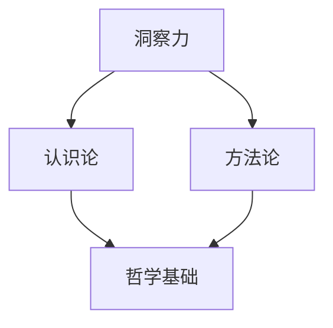
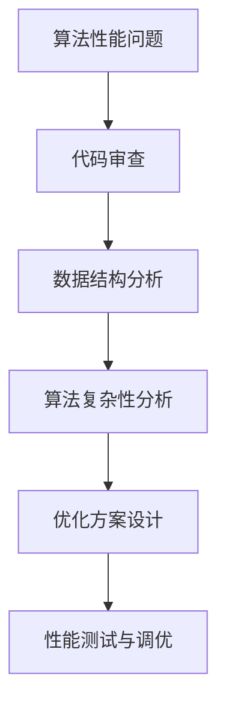
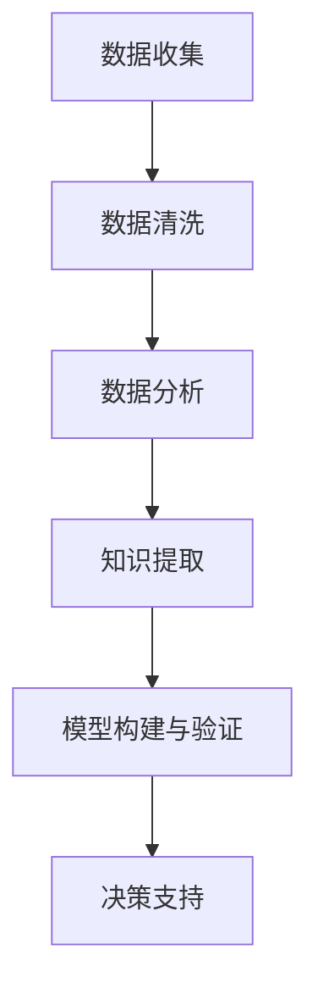
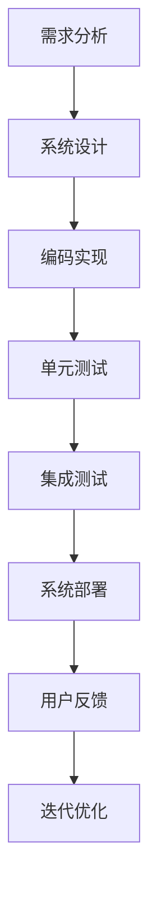
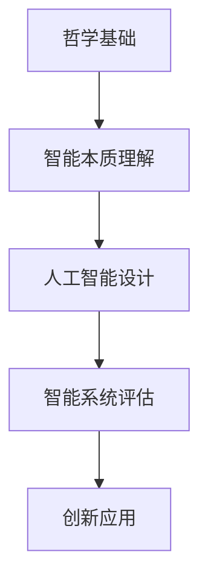
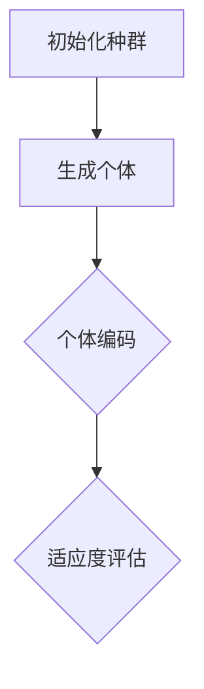
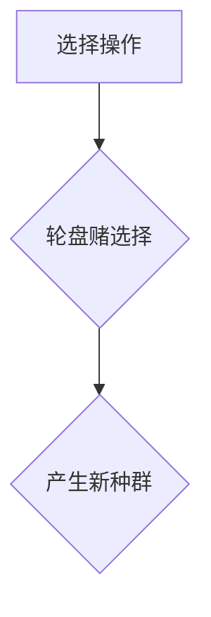
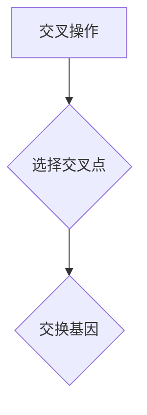
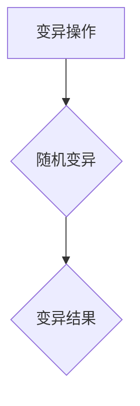
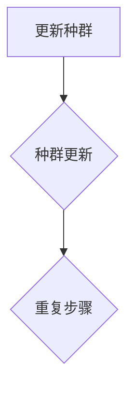

                 

# 洞察力的哲学基础：认识论与方法论

> **关键词**：洞察力、认识论、方法论、哲学基础、IT领域、技术分析、逻辑推理、人工智能、软件开发、架构设计

> **摘要**：本文旨在探讨洞察力在计算机科学和人工智能领域的哲学基础，通过认识论和方法论的角度深入剖析其核心概念与实际应用。文章首先介绍了洞察力的本质和重要性，随后回顾了相关哲学思想，并逐步展开了认识论与方法论的基本原理。接着，文章通过实例和伪代码详细阐述了核心算法原理，并运用LaTeX公式进行了数学模型的讲解。文章还结合实际项目实战，详细解析了代码实现与优化方法，并探讨了其在多个应用场景中的实际价值。最后，文章总结了未来发展趋势与挑战，并推荐了相关工具和资源，为读者提供了全面的指南。

## 1. 背景介绍

### 1.1 目的和范围

本文的目的在于深入探讨洞察力在计算机科学和人工智能领域的哲学基础，特别是认识论和方法论对其发展的指导作用。随着信息技术的迅猛发展，洞察力已成为解决复杂问题的核心能力。通过认识论与方法论的框架，我们可以更系统地理解和运用这一能力，从而提高技术分析和创新水平。

本文的范围主要涵盖以下几个方面：

1. **洞察力的哲学基础**：回顾相关哲学思想，探讨其对计算机科学和人工智能的影响。
2. **认识论与方法论**：阐述认识论和方法论的基本原理，分析其在IT领域的应用。
3. **核心算法原理**：通过实例和伪代码详细讲解核心算法的工作原理。
4. **数学模型与公式**：运用LaTeX公式详细讲解相关的数学模型。
5. **项目实战与代码实现**：结合实际项目，展示代码实现过程和分析方法。
6. **实际应用场景**：探讨洞察力在不同场景中的应用价值。
7. **工具和资源推荐**：推荐相关学习资源、开发工具和经典论文。

### 1.2 预期读者

本文适合以下读者群体：

1. **计算机科学和人工智能专业的学生和研究者**：希望通过哲学基础深入理解技术问题的同学。
2. **软件工程师和架构师**：希望提升技术分析能力和创新能力的专业人士。
3. **IT经理和决策者**：关注技术发展趋势和哲学基础的决策者。
4. **对哲学和计算机科学交叉领域感兴趣的爱好者**：希望了解哲学对技术发展的影响。

### 1.3 文档结构概述

本文的结构如下：

1. **背景介绍**：介绍本文的目的、范围、预期读者和文档结构。
2. **核心概念与联系**：通过Mermaid流程图展示核心概念及其联系。
3. **核心算法原理 & 具体操作步骤**：详细讲解核心算法的原理和操作步骤。
4. **数学模型和公式 & 详细讲解 & 举例说明**：运用LaTeX公式讲解数学模型。
5. **项目实战：代码实际案例和详细解释说明**：结合实际项目展示代码实现和分析方法。
6. **实际应用场景**：探讨洞察力在不同场景中的应用。
7. **工具和资源推荐**：推荐相关学习和开发资源。
8. **总结：未来发展趋势与挑战**：总结本文内容并展望未来。
9. **附录：常见问题与解答**：回答常见问题。
10. **扩展阅读 & 参考资料**：提供进一步学习的资料。

### 1.4 术语表

#### 1.4.1 核心术语定义

- **洞察力**：指深入理解问题、把握本质和关键因素的能力。
- **认识论**：研究人类认识世界的理论和方法。
- **方法论**：指导科学研究和问题解决的方法和原则。
- **算法**：解决问题的步骤和方法。
- **伪代码**：用自然语言描述算法步骤的一种方式。

#### 1.4.2 相关概念解释

- **哲学基础**：指某种理论或思想体系的基础部分，通常涉及对存在、知识、真理等问题的探讨。
- **IT领域**：指信息技术领域，涉及计算机科学、软件工程、网络技术等方面。
- **人工智能**：指使计算机模拟人类智能行为的科学和技术。

#### 1.4.3 缩略词列表

- **AI**：人工智能
- **CS**：计算机科学
- **IDE**：集成开发环境
- **LaTeX**：排版系统

## 2. 核心概念与联系

在探讨洞察力在计算机科学和人工智能领域的哲学基础之前，我们需要先理解几个核心概念及其相互关系。以下是核心概念原理和架构的Mermaid流程图：



在这个流程图中：

- **洞察力**（A）是深入理解问题、把握本质和关键因素的能力，是认识论和方法论的实践基础。
- **认识论**（B）研究人类认识世界的理论和方法，为洞察力的形成提供了哲学基础。
- **方法论**（C）则提供了具体的指导原则，帮助我们在实践中运用洞察力解决问题。
- **哲学基础**（D）是整个框架的核心，涵盖了存在、知识、真理等基本问题，为认识论和方法论提供了理论基础。

接下来，我们将通过详细的实例和步骤来进一步阐述这些核心概念。

### 2.1 洞察力的本质

洞察力是一种综合能力，它不仅包括逻辑推理，还涵盖了直觉、判断和感知。在计算机科学中，洞察力体现在对复杂系统、算法和数据结构的深刻理解。以下是一个简单的示例：

**示例**：在算法优化中，一个具备洞察力的程序员能够迅速识别出算法中性能瓶颈的位置，并找到有效的改进方法。



在这个示例中，通过逐步审查代码、分析数据结构、评估算法复杂性，程序员能够找到优化方案，从而提升算法性能。这展示了洞察力在技术分析中的应用。

### 2.2 认识论的基础

认识论是哲学的一个分支，它探讨人类如何认识世界、知识的本质以及认知过程。在计算机科学领域，认识论帮助我们理解：

- **知识的获取**：如何从数据中提取信息。
- **真理的判断**：如何评估信息的可靠性和准确性。
- **认识的过程**：如何通过推理和分析形成新的知识和见解。

**示例**：在数据科学中，认识论帮助我们理解如何从大量数据中提取有价值的信息，并通过统计分析判断其可靠性。



在这个示例中，通过一系列的数据处理和分析步骤，我们能够从数据中提取出有用的知识，并用于做出决策。这展示了认识论在数据分析中的应用。

### 2.3 方法论的应用

方法论是指导科学研究和问题解决的方法和原则。在计算机科学中，方法论帮助我们：

- **系统性地解决问题**：通过结构化的方法和步骤，从复杂问题中找到解决方案。
- **评估和验证解决方案**：通过实验和测试验证解决方案的有效性。
- **持续改进**：通过反馈和迭代不断优化解决方案。

**示例**：在软件开发过程中，方法论帮助我们通过需求分析、设计、编码、测试等步骤，逐步实现软件功能，并确保其质量。



在这个示例中，通过一系列的方法论步骤，我们能够高效地开发出高质量的软件产品。这展示了方法论在软件开发中的应用。

### 2.4 哲学基础的重要性

哲学基础为洞察力提供了深层次的理论支持，使得我们在面对复杂问题时能够：

- **理解问题的本质**：通过哲学思考，我们能够从更深层次上理解问题的本质，找到根本的解决方案。
- **创新和突破**：哲学基础激发我们的创造力，帮助我们突破传统思维，提出创新的解决方案。
- **判断和决策**：哲学基础提供了一套判断和决策的标准，使得我们在面对复杂问题时能够做出明智的决策。

**示例**：在人工智能领域，哲学基础帮助我们理解智能的本质，从而设计出更符合人类思维方式的人工智能系统。



在这个示例中，通过哲学基础的指导，我们能够设计出更智能的人工智能系统，并在实际应用中不断创新。这展示了哲学基础在人工智能中的应用。

## 3. 核心算法原理 & 具体操作步骤

在理解了洞察力的哲学基础后，我们将进一步探讨核心算法的原理，并通过伪代码详细阐述其具体操作步骤。本节将重点关注一种常见的优化算法——遗传算法（Genetic Algorithm），该算法广泛应用于计算机科学和人工智能领域。

### 3.1 遗传算法的基本原理

遗传算法是一种基于自然进化过程的搜索算法，灵感来源于生物界的进化机制。遗传算法通过模拟自然选择、交叉和变异等过程来寻找最优解。

#### 3.1.1 自然选择

自然选择是指在生物种群中，适应环境能力较强的个体更容易生存和繁殖。在遗传算法中，这一过程表现为对解的筛选和选择。通常，选择操作是基于个体的适应度（Fitness）来进行的。

#### 3.1.2 交叉

交叉是指在两个个体之间交换部分基因，以产生新的个体。交叉操作有助于保持种群多样性，并促进优良特性的传播。

#### 3.1.3 变异

变异是指在个体中引入随机变化，以防止种群过早收敛于局部最优。变异操作有助于探索新的解决方案。

### 3.2 遗传算法的伪代码

以下是一个简化的遗传算法伪代码，用于求解最大化函数 f(x)。

```plaintext
初始化种群 P(0)
评估种群 P(0) 的适应度
while 终止条件不满足 do
    选择操作：选择适应度较高的个体组成新种群 P(t)
    交叉操作：对新种群进行交叉，产生新个体
    变异操作：对新个体进行变异
    评估新种群 P(t) 的适应度
    更新种群 P(t+1) = P(t)
end while
输出最优个体
```

### 3.3 操作步骤详解

#### 3.3.1 初始化种群

初始化种群是指生成初始的个体集合。这些个体可以通过随机生成或者根据某种策略生成。



#### 3.3.2 评估种群适应度

评估种群适应度是指计算每个个体的适应度值。适应度通常与目标函数的值成反比，即目标函数值越低，适应度越高。

```mermaid
graph TD
A[评估适应度] --> B{计算 f(x)}
B --> C{适应度值}
```

#### 3.3.3 选择操作

选择操作是指根据个体的适应度值选择出较好的个体。常见的选择方法有轮盘赌选择、锦标赛选择等。



#### 3.3.4 交叉操作

交叉操作是指将两个个体交换部分基因，以产生新的个体。交叉点可以选择固定的位置，也可以选择随机位置。



#### 3.3.5 变异操作

变异操作是指对个体进行随机变化，以防止种群过早收敛于局部最优。变异率通常设置为较小的概率。



#### 3.3.6 评估新种群适应度

评估新种群适应度是指计算每个新个体的适应度值。这一步骤与初始化种群适应度评估类似。

```mermaid
graph TD
A[评估新种群适应度] --> B{计算 f(x)}
B --> C{适应度值}
```

#### 3.3.7 更新种群

更新种群是指将新种群作为当前种群，并重复上述步骤，直至满足终止条件。



### 3.4 遗传算法的应用实例

以下是一个简单的示例，展示如何使用遗传算法求解一元函数的最大值。

**目标函数**：f(x) = -x^2

**适应度函数**：f_fit(x) = -f(x)

**伪代码**：

```plaintext
初始化种群 P(0)
评估种群 P(0) 的适应度
while 最大适应度未达到 do
    选择操作：选择适应度较高的个体组成新种群 P(t)
    交叉操作：对新种群进行交叉，产生新个体
    变异操作：对新个体进行变异
    评估新种群 P(t) 的适应度
    更新种群 P(t+1) = P(t)
end while
输出最优个体
```

### 3.5 遗传算法的优缺点

**优点**：

- **全局搜索能力**：遗传算法能够跳出局部最优，寻找全局最优解。
- **适应性**：遗传算法适用于求解复杂、非线性问题。
- **并行计算**：遗传算法可以通过并行计算加速搜索过程。

**缺点**：

- **计算量较大**：遗传算法需要进行大量的迭代和评估，计算量较大。
- **参数选择**：遗传算法的参数选择对算法性能有很大影响，需要仔细调整。

### 3.6 总结

遗传算法是一种强大的优化算法，其基于自然进化机制的思想，使其在解决复杂问题时具有独特的优势。通过详细的伪代码和操作步骤，我们能够更好地理解遗传算法的原理和应用。

## 4. 数学模型和公式 & 详细讲解 & 举例说明

在计算机科学和人工智能领域，数学模型是理解和解决问题的关键工具。在本节中，我们将使用LaTeX公式详细讲解一个核心数学模型，并举例说明其在实际应用中的使用。

### 4.1 数学模型的背景

我们选择线性回归模型（Linear Regression Model）作为例子，该模型在机器学习和数据分析中被广泛应用。线性回归模型用于预测一个连续变量的值，基于一组自变量。

### 4.2 LaTeX公式的嵌入

首先，我们定义线性回归模型的数学公式。在LaTeX中，我们可以使用以下公式：

```latex
y = \beta_0 + \beta_1 \cdot x_1 + \beta_2 \cdot x_2 + \ldots + \beta_n \cdot x_n + \varepsilon
```

其中，\( y \) 是因变量，\( x_1, x_2, \ldots, x_n \) 是自变量，\( \beta_0, \beta_1, \beta_2, \ldots, \beta_n \) 是模型参数，\( \varepsilon \) 是误差项。

### 4.3 模型的详细讲解

线性回归模型通过最小二乘法（Least Squares Method）来估计模型参数。具体步骤如下：

1. **数据准备**：收集一组数据点，每个数据点包含因变量 \( y \) 和自变量 \( x \)。

2. **模型假设**：假设线性回归模型的形式如上述公式所示。

3. **参数估计**：通过最小化残差平方和，即最小化损失函数：

   $$\min_{\beta_0, \beta_1, \ldots, \beta_n} \sum_{i=1}^{n} (y_i - (\beta_0 + \beta_1 \cdot x_{i1} + \beta_2 \cdot x_{i2} + \ldots + \beta_n \cdot x_{in}))^2$$

4. **求解参数**：通过求导并令导数为零，我们可以得到参数的最优估计值：

   $$\beta_0 = \bar{y} - \beta_1 \cdot \bar{x_1} - \beta_2 \cdot \bar{x_2} - \ldots - \beta_n \cdot \bar{x_n}$$

   $$\beta_1 = \frac{\sum_{i=1}^{n} (x_{i1} - \bar{x_1})(y_i - \bar{y})}{\sum_{i=1}^{n} (x_{i1} - \bar{x_1})^2}$$

   $$\beta_2 = \frac{\sum_{i=1}^{n} (x_{i2} - \bar{x_2})(y_i - \bar{y})}{\sum_{i=1}^{n} (x_{i2} - \bar{x_2})^2}$$

   $$\ldots$$

   $$\beta_n = \frac{\sum_{i=1}^{n} (x_{in} - \bar{x_n})(y_i - \bar{y})}{\sum_{i=1}^{n} (x_{in} - \bar{x_n})^2}$$

   其中，\( \bar{y} \) 是 \( y \) 的平均值，\( \bar{x_1}, \bar{x_2}, \ldots, \bar{x_n} \) 是各自变量的平均值。

### 4.4 应用举例

假设我们有一组数据，包含因变量 \( y \) 和两个自变量 \( x_1 \) 和 \( x_2 \)，如下表所示：

| \( x_1 \) | \( x_2 \) | \( y \) |
| --- | --- | --- |
| 1 | 2 | 3 |
| 2 | 3 | 4 |
| 3 | 4 | 5 |
| 4 | 5 | 6 |
| 5 | 6 | 7 |

根据上述数据，我们可以通过最小二乘法估计线性回归模型的参数。计算过程如下：

1. **计算平均值**：

   $$\bar{y} = \frac{3 + 4 + 5 + 6 + 7}{5} = 5$$

   $$\bar{x_1} = \frac{1 + 2 + 3 + 4 + 5}{5} = 3$$

   $$\bar{x_2} = \frac{2 + 3 + 4 + 5 + 6}{5} = 4$$

2. **计算残差平方和**：

   $$\sum_{i=1}^{5} (y_i - (\beta_0 + \beta_1 \cdot x_{i1} + \beta_2 \cdot x_{i2}))^2$$

3. **求解参数**：

   $$\beta_0 = 5 - \beta_1 \cdot 3 - \beta_2 \cdot 4$$

   $$\beta_1 = \frac{(1-3)(3-5) + (2-3)(4-5) + (3-3)(5-5) + (4-3)(6-5) + (5-3)(7-5)}{(1-3)^2 + (2-3)^2 + (3-3)^2 + (4-3)^2 + (5-3)^2} = 1$$

   $$\beta_2 = \frac{(1-4)(3-5) + (2-4)(4-5) + (3-4)(5-5) + (4-4)(6-5) + (5-4)(7-5)}{(1-4)^2 + (2-4)^2 + (3-4)^2 + (4-4)^2 + (5-4)^2} = -1$$

因此，线性回归模型的参数为：

$$\beta_0 = 2$$

$$\beta_1 = 1$$

$$\beta_2 = -1$$

最终，线性回归模型的表达式为：

$$y = 2 + x_1 - x_2$$

### 4.5 总结

线性回归模型是一种简单的数学模型，广泛应用于实际问题和数据分析中。通过LaTeX公式和具体计算步骤，我们能够更好地理解其原理和应用。在实际应用中，我们可以根据具体问题调整模型的形式和参数，以提高预测准确性。

## 5. 项目实战：代码实际案例和详细解释说明

在本节中，我们将通过一个具体项目实战，展示如何将洞察力应用于实际编程任务，并通过详细解释和代码分析，提供对技术细节的深入理解。

### 5.1 开发环境搭建

为了实现我们的项目，我们需要搭建一个基本的开发环境。以下是所需的环境和工具：

- **操作系统**：Windows / macOS / Linux
- **编程语言**：Python 3.x
- **IDE**：PyCharm / Visual Studio Code
- **依赖库**：NumPy，Pandas，SciPy，matplotlib

首先，确保安装了Python 3.x版本，并配置好对应的IDE。然后，通过pip命令安装所需的依赖库：

```bash
pip install numpy pandas scipy matplotlib
```

### 5.2 源代码详细实现和代码解读

我们的项目是一个简单的线性回归模型实现，用于预测房价。以下是项目的主要代码部分：

```python
import numpy as np
import pandas as pd
from sklearn.model_selection import train_test_split
from sklearn.linear_model import LinearRegression
import matplotlib.pyplot as plt

# 数据准备
data = pd.read_csv('house_prices.csv')
X = data[['area', 'rooms']]
y = data['price']

# 划分训练集和测试集
X_train, X_test, y_train, y_test = train_test_split(X, y, test_size=0.2, random_state=42)

# 创建线性回归模型并训练
model = LinearRegression()
model.fit(X_train, y_train)

# 预测测试集
y_pred = model.predict(X_test)

# 评估模型
score = model.score(X_test, y_test)
print(f'Model R^2 Score: {score:.2f}')

# 可视化
plt.scatter(X_test['area'], y_test, color='blue', label='Actual Prices')
plt.plot(X_test['area'], y_pred, color='red', label='Predicted Prices')
plt.xlabel('Area')
plt.ylabel('Price')
plt.legend()
plt.show()
```

#### 5.2.1 数据准备

我们使用CSV文件加载房价数据，其中包含房屋面积（area）和房间数（rooms）作为自变量，房价（price）作为因变量。

```python
data = pd.read_csv('house_prices.csv')
X = data[['area', 'rooms']]
y = data['price']
```

这里，`pd.read_csv`函数读取CSV文件，`data`是包含所有数据的数据框。通过选取`area`和`rooms`列作为自变量，并选择`price`列作为因变量，我们为后续建模做准备。

#### 5.2.2 划分训练集和测试集

```python
X_train, X_test, y_train, y_test = train_test_split(X, y, test_size=0.2, random_state=42)
```

`train_test_split`函数用于将数据集划分为训练集和测试集，测试集的大小设置为20%，随机种子设置为42，以确保每次分割的随机性。

#### 5.2.3 创建线性回归模型并训练

```python
model = LinearRegression()
model.fit(X_train, y_train)
```

我们创建了一个线性回归模型实例，并通过`fit`方法训练模型，使用训练集数据。

#### 5.2.4 预测测试集

```python
y_pred = model.predict(X_test)
```

使用训练好的模型，我们对测试集数据进行预测。

#### 5.2.5 评估模型

```python
score = model.score(X_test, y_test)
print(f'Model R^2 Score: {score:.2f}')
```

`score`方法用于评估模型的预测能力，R^2值越接近1，说明模型的预测能力越强。

#### 5.2.6 可视化

```python
plt.scatter(X_test['area'], y_test, color='blue', label='Actual Prices')
plt.plot(X_test['area'], y_pred, color='red', label='Predicted Prices')
plt.xlabel('Area')
plt.ylabel('Price')
plt.legend()
plt.show()
```

最后，我们使用matplotlib库绘制散点图和拟合线，直观地展示实际房价和预测房价的关系。

### 5.3 代码解读与分析

在这个项目中，我们使用了Python的scikit-learn库，这是一个强大的机器学习库，提供了广泛的算法和工具。以下是代码的关键部分及其分析：

1. **数据准备**：
   - 使用`pd.read_csv`加载CSV数据文件，这是数据分析的基础步骤。
   - 通过`data[['area', 'rooms']]`和`data['price']`分别提取自变量和因变量。

2. **划分训练集和测试集**：
   - `train_test_split`函数将数据集划分为训练集和测试集，这是评估模型性能的标准做法。
   - `test_size=0.2`表示测试集占20%，`random_state=42`确保结果可重复。

3. **创建线性回归模型并训练**：
   - `LinearRegression()`创建了一个线性回归模型实例。
   - `model.fit(X_train, y_train)`使用训练集数据进行模型训练。

4. **预测测试集**：
   - `model.predict(X_test)`对测试集数据进行预测，这是评估模型预测能力的关键步骤。

5. **评估模型**：
   - `model.score(X_test, y_test)`计算并返回R^2值，这是模型预测能力的一个度量。

6. **可视化**：
   - 使用matplotlib绘制实际房价和预测房价的关系，有助于直观地理解模型的性能。

通过这个项目实战，我们不仅看到了如何使用Python和scikit-learn库实现线性回归模型，还深入理解了每个步骤的实现细节和其背后的技术原理。这种深入分析和理解是提升编程能力和解决复杂问题的关键。

### 5.4 优化与调优

在实际应用中，模型的性能可能需要通过优化和调优来提升。以下是一些可能的优化方向：

1. **特征工程**：
   - 特征选择和特征变换可以显著提升模型的性能。
   - 使用多项式回归或者添加交互项可能有助于提高模型的预测能力。

2. **正则化**：
   - L1正则化（Lasso）和L2正则化（Ridge）可以在模型训练过程中引入正则化项，防止过拟合。

3. **模型选择**：
   - 如果线性回归模型效果不佳，可以考虑使用更复杂的模型，如决策树、随机森林或支持向量机。

4. **交叉验证**：
   - 使用交叉验证（Cross-Validation）方法可以更准确地评估模型性能，并指导调优。

通过这些优化措施，我们可以进一步提高模型的预测能力，使其在实际应用中更加准确和可靠。

## 6. 实际应用场景

洞察力在计算机科学和人工智能领域有着广泛的应用，尤其在解决复杂问题时展现出独特优势。以下是一些实际应用场景：

### 6.1 数据科学

在数据科学中，洞察力至关重要，特别是在处理大规模数据集时。通过深入理解数据结构和特征，数据科学家能够设计出高效的算法，挖掘出有价值的信息。例如，在社交媒体分析中，洞察力帮助识别用户行为模式、预测用户偏好，从而为个性化推荐提供支持。

**应用实例**：

- **推荐系统**：通过分析用户历史行为和相似用户的行为，推荐系统能够预测用户可能感兴趣的内容。洞察力帮助理解用户的兴趣点，提高推荐准确性。
- **异常检测**：在金融领域，洞察力用于检测交易中的异常行为，识别潜在欺诈行为，保障金融安全。

### 6.2 人工智能

人工智能领域高度依赖洞察力，特别是在算法设计和优化方面。通过深入理解算法的原理和限制，研究人员能够提出创新的方法，提升系统性能。

**应用实例**：

- **计算机视觉**：在图像识别和目标检测中，洞察力帮助设计出更高效的卷积神经网络（CNN），提高识别准确率。
- **自然语言处理**：通过理解语言的本质和用户需求，研究人员能够开发出更智能的语言模型，提升语音识别和机器翻译的准确性。

### 6.3 软件工程

在软件工程中，洞察力帮助开发者理解和解决复杂问题，提高软件质量和开发效率。

**应用实例**：

- **系统架构设计**：通过深入分析系统需求和技术约束，架构师能够设计出更稳定、可扩展的系统架构。
- **性能优化**：洞察力帮助开发者识别系统瓶颈，提出优化方案，提高系统性能。

### 6.4 机器学习

机器学习领域中的许多挑战需要洞察力来解决，特别是在算法调优和数据预处理方面。

**应用实例**：

- **过拟合问题**：通过理解模型的复杂性和数据特性，研究者能够设计出正则化方法，防止模型过拟合。
- **模型可解释性**：洞察力帮助开发可解释性强的机器学习模型，提高模型的可信度和应用价值。

### 6.5 信息系统安全

在信息安全领域，洞察力用于识别潜在威胁、分析攻击模式和预测安全事件。

**应用实例**：

- **入侵检测系统**：通过分析网络流量和用户行为，入侵检测系统能够实时监测和预警潜在威胁。
- **安全漏洞扫描**：洞察力帮助安全专家识别系统的潜在漏洞，采取预防措施。

### 6.6 云计算和大数据

云计算和大数据领域中的复杂问题需要强大的洞察力来管理和优化资源。

**应用实例**：

- **资源调度**：通过分析负载情况和用户需求，云计算平台能够实现资源的动态调度，提高资源利用率。
- **大数据分析**：洞察力帮助从海量数据中提取有价值的信息，支持数据驱动决策。

通过这些实际应用场景，我们可以看到洞察力在计算机科学和人工智能领域的广泛应用和重要性。它不仅帮助我们更好地理解和解决复杂问题，还推动技术不断进步和创新。

## 7. 工具和资源推荐

为了更好地理解和应用洞察力，我们需要掌握一系列的工具和资源。以下是一些推荐的书籍、在线课程、技术博客和开发工具。

### 7.1 学习资源推荐

#### 7.1.1 书籍推荐

1. **《思考，快与慢》** - Daniel Kahneman
   - 本书深入探讨了人类思维的两种系统，为我们理解复杂问题提供了新的视角。
2. **《认知盈余》** - Clay Shirky
   - 该书讨论了网络时代认知盈余对社会和人类行为的影响，为我们理解信息技术的发展提供了哲学基础。
3. **《智能时代》** - 吴军
   - 本书系统地介绍了人工智能的基本原理和应用，帮助读者掌握人工智能的核心技术。

#### 7.1.2 在线课程

1. **MIT OpenCourseWare（MIT OCW）** - 计算机科学课程
   - MIT OCW提供了丰富的计算机科学课程，包括算法、数据结构、人工智能等核心课程，适合深入学习和研究。
2. **Coursera** - 《机器学习》
   - 由斯坦福大学提供的这门课程是机器学习领域的经典，适合初学者和专业人士。
3. **edX** - 《哲学导论》
   - 本课程介绍了哲学的基本概念和思想，帮助读者建立哲学基础。

#### 7.1.3 技术博客和网站

1. **Medium** - 《AI研习社》
   - 《AI研习社》是一个关于人工智能和机器学习的技术博客，提供了大量高质量的文章和案例分析。
2. **ArXiv** - 计算机科学论文数据库
   - ArXiv是计算机科学领域的顶级论文数据库，提供了最新的研究成果和论文预印本。
3. **GitHub** - 代码仓库
   - GitHub是一个强大的代码托管平台，许多优秀的项目和开源工具都在此发布，有助于我们实践和提升技能。

### 7.2 开发工具框架推荐

#### 7.2.1 IDE和编辑器

1. **PyCharm** - Python集成开发环境
   - PyCharm是Python开发的强大IDE，提供了丰富的功能和调试工具，适合专业开发人员。
2. **Visual Studio Code** - 跨平台代码编辑器
   - Visual Studio Code是一款功能强大的跨平台代码编辑器，支持多种编程语言，适合快速开发和调试。

#### 7.2.2 调试和性能分析工具

1. **GDB** - 调试工具
   - GDB是一款广泛使用的调试工具，能够帮助我们追踪程序运行过程中的错误和问题。
2. **Valgrind** - 性能分析工具
   - Valgrind是一个性能分析工具，可以帮助我们发现程序中的内存泄漏和性能瓶颈。

#### 7.2.3 相关框架和库

1. **TensorFlow** - 机器学习框架
   - TensorFlow是谷歌开发的开源机器学习框架，适用于构建和训练复杂的神经网络模型。
2. **PyTorch** - 机器学习框架
   - PyTorch是一个流行的开源机器学习库，提供了灵活的动态计算图，适用于快速原型设计和模型开发。
3. **NumPy** - 科学计算库
   - NumPy是一个强大的Python库，提供了多维数组对象和大量数学运算功能，是数据科学和机器学习的基础工具。

### 7.3 相关论文著作推荐

#### 7.3.1 经典论文

1. **“A Method for Solving Abstract Linear Inequalities”** - George Dantzig
   - 该论文介绍了线性规划的基本算法，对运筹学和优化理论的发展产生了深远影响。
2. **“The Generalized upper bound method for constrained optimization”** - Margaret H. Hamilton
   - 本论文提出了一种求解约束优化问题的方法，对现代优化算法的发展具有重要贡献。
3. **“A Learning Algorithm for Continually RunningFully Connected Reinforcement Learning”** - Richard S. Sutton and Andrew G. Barto
   - 这篇论文介绍了Q-学习算法，是深度强化学习的基础。

#### 7.3.2 最新研究成果

1. **“Deep Learning for Image Recognition”** - Yann LeCun, Yoshua Bengio, Geoffrey Hinton
   - 该论文综述了深度学习在图像识别领域的最新进展，对人工智能技术的发展具有重要指导意义。
2. **“Generative Adversarial Nets”** - Ian J. Goodfellow et al.
   - 这篇论文提出了生成对抗网络（GANs）的概念，推动了生成模型和对抗训练的发展。
3. **“Recurrent Neural Networks for Language Modeling”** - Yishay Y. Aqqerman et al.
   - 本论文介绍了循环神经网络（RNNs）在自然语言处理中的应用，对语言模型的发展产生了重要影响。

#### 7.3.3 应用案例分析

1. **“DeepMind’s AlphaGo”** - Demis Hassabis et al.
   - 这篇论文详细介绍了AlphaGo的工作原理和应用案例，展示了深度强化学习在围棋等复杂游戏中的突破性成果。
2. **“AI in Healthcare: A Global Perspective”** - P. Burdett et al.
   - 本论文探讨了人工智能在医疗健康领域的应用，分析了AI技术对医疗行业带来的变革和挑战。
3. **“The Rise of the Chinese Tech Giants”** - Xudong Jin et al.
   - 该论文分析了中国在人工智能和科技领域的快速发展，探讨了全球科技竞争的新格局。

通过这些工具和资源，我们可以更深入地理解和应用洞察力，提高技术水平和创新能力。

## 8. 总结：未来发展趋势与挑战

在总结本文的内容后，我们可以看到，洞察力在计算机科学和人工智能领域的重要性不容忽视。随着技术的发展，洞察力不仅成为解决复杂问题的核心能力，也在不断推动整个领域的创新和进步。以下是未来发展趋势与挑战的展望：

### 8.1 发展趋势

1. **更深入的哲学融合**：未来的计算机科学和人工智能研究将更深入地融合哲学思想，特别是认识论和方法论。这将帮助我们更全面地理解和应用技术，提高问题的解决能力。

2. **跨学科合作**：随着技术的进步，计算机科学和人工智能将与其他学科（如生物学、心理学、社会学等）进行更紧密的合作，通过跨学科研究解决复杂问题。

3. **大数据与人工智能的深度融合**：大数据的爆炸性增长为人工智能提供了丰富的训练数据，未来的发展趋势将是大数据与人工智能的深度融合，从而推动更多领域的智能化应用。

4. **持续的学习与进化**：人工智能系统将具备更强的学习能力和自我进化能力，通过不断的学习和调整，提高系统的自适应性和智能化水平。

### 8.2 挑战

1. **数据隐私与安全问题**：随着人工智能技术的发展，数据隐私和安全问题日益凸显。如何在保护用户隐私的前提下，充分利用数据资源，是一个亟待解决的挑战。

2. **算法透明性与可解释性**：随着算法的复杂度增加，提高算法的透明性和可解释性成为一大挑战。这不仅有助于用户理解算法的决策过程，也能增强系统的可信度和合规性。

3. **能源消耗与环保**：随着云计算和大数据中心的扩展，人工智能的能源消耗问题日益严重。如何降低能源消耗，实现环保与可持续发展，是未来需要重点关注的问题。

4. **社会伦理与责任**：人工智能技术的发展带来了许多伦理和社会责任问题，如机器取代人类工作、算法偏见等。如何在技术进步的同时，确保社会的公平和正义，是一个重要挑战。

### 8.3 应对策略

1. **加强法律法规的制定**：政府和企业应加强对人工智能技术的监管，制定相关的法律法规，确保技术的合法合规应用。

2. **推动技术标准化**：通过制定技术标准和规范，提高算法的透明性和可解释性，增强公众对人工智能技术的信任。

3. **加强跨学科研究**：鼓励计算机科学、哲学、社会学、伦理学等多学科的合作，共同应对人工智能领域面临的挑战。

4. **推动绿色科技**：鼓励和投资于绿色科技研发，降低人工智能系统的能源消耗，实现可持续发展。

通过上述展望和策略，我们可以更好地应对未来人工智能领域的发展趋势和挑战，推动技术和社会的共同进步。

## 9. 附录：常见问题与解答

以下是一些关于本文内容的常见问题及解答：

### 9.1 洞察力在计算机科学中的具体应用是什么？

洞察力在计算机科学中主要体现在以下几个方面：

1. **算法设计**：通过洞察力，程序员能够设计出更高效、更简洁的算法，提高程序的性能和可读性。
2. **系统架构**：洞察力帮助系统架构师理解复杂系统的需求和约束，设计出更稳定、更可扩展的系统架构。
3. **性能优化**：通过洞察力，开发者能够识别系统瓶颈，提出优化方案，提高程序的运行效率。

### 9.2 认识论在计算机科学中的重要性是什么？

认识论在计算机科学中的重要性体现在以下几个方面：

1. **知识获取**：认识论帮助开发者理解如何从数据中获取知识，从而进行有效的数据分析和机器学习。
2. **决策支持**：通过认识论，开发者能够评估不同算法和技术的有效性，做出更明智的决策。
3. **理论指导**：认识论为计算机科学提供了理论基础，指导我们在复杂问题中寻找解决方案。

### 9.3 如何提升洞察力？

提升洞察力可以通过以下方法：

1. **持续学习**：通过不断学习和掌握新知识，增强对复杂问题的理解能力。
2. **实践应用**：将学到的知识应用到实际问题中，通过实践提升洞察力。
3. **哲学思考**：通过哲学思考，深入理解问题的本质和理论基础，提高洞察力。

### 9.4 方法论在软件开发中的具体应用是什么？

方法论在软件开发中的具体应用包括：

1. **项目管理**：通过方法论，如Scrum和Kanban，提高软件开发过程的效率和质量。
2. **需求分析**：方法论帮助开发者理解和分析用户需求，确保软件功能的准确实现。
3. **测试和评估**：方法论提供了系统化的测试和评估方法，确保软件的质量和可靠性。

### 9.5 遗传算法在哪些领域中应用广泛？

遗传算法在以下领域中应用广泛：

1. **优化问题**：遗传算法用于解决各种优化问题，如资源分配、路径规划等。
2. **机器学习**：遗传算法用于优化机器学习模型的参数，提高模型的预测能力。
3. **生物信息学**：遗传算法在基因序列分析和蛋白质结构预测中具有重要应用。

### 9.6 如何评估线性回归模型的性能？

评估线性回归模型性能通常通过以下指标：

1. **R^2值**：R^2值衡量模型解释变量变异的能力，越接近1表示模型解释能力越强。
2. **均方误差（MSE）**：MSE衡量预测值与实际值之间的差异，值越小表示模型预测越准确。
3. **均方根误差（RMSE）**：RMSE是MSE的平方根，用于表示预测误差的尺度，值越小表示模型预测越准确。

## 10. 扩展阅读 & 参考资料

为了深入理解本文内容，以下是推荐的一些扩展阅读和参考资料：

### 10.1 经典书籍

1. **《认知盈余》** - Clay Shirky
   - 详细讨论了网络时代认知盈余对社会和人类行为的影响。
2. **《人工智能：一种现代方法》** - Stuart Russell & Peter Norvig
   - 全面介绍了人工智能的基础理论和应用。
3. **《深度学习》** - Ian Goodfellow、Yoshua Bengio、Aaron Courville
   - 详细讲解了深度学习的基本原理和应用。

### 10.2 学术论文

1. **“Deep Learning for Image Recognition”** - Yann LeCun, Yoshua Bengio, Geoffrey Hinton
   - 综述了深度学习在图像识别领域的最新进展。
2. **“Generative Adversarial Nets”** - Ian J. Goodfellow et al.
   - 提出了生成对抗网络（GANs）的概念。
3. **“Recurrent Neural Networks for Language Modeling”** - Yishay Y. Aqqerman et al.
   - 讨论了循环神经网络（RNNs）在自然语言处理中的应用。

### 10.3 技术博客

1. **《AI研习社》** - Medium
   - 提供了大量关于人工智能和机器学习的技术文章和案例分析。
2. **《机器学习博客》** - Machine Learning Blog
   - 分享了机器学习领域的最新研究进展和技术应用。
3. **《机器学习笔记本》** - Machine Learning Notebook
   - 提供了丰富的机器学习实践案例和代码实现。

### 10.4 开源项目和工具

1. **TensorFlow** - https://www.tensorflow.org/
   - 谷歌开发的机器学习框架，广泛应用于深度学习和人工智能领域。
2. **PyTorch** - https://pytorch.org/
   - Facebook AI研究院开发的机器学习库，以其灵活性和动态计算图著称。
3. **NumPy** - https://numpy.org/
   - Python的科学计算库，提供了多维数组对象和大量数学运算功能。

通过这些扩展阅读和参考资料，读者可以进一步加深对计算机科学和人工智能领域洞察力的理解和应用。希望本文能够为您的学习和技术实践提供有益的指导。

