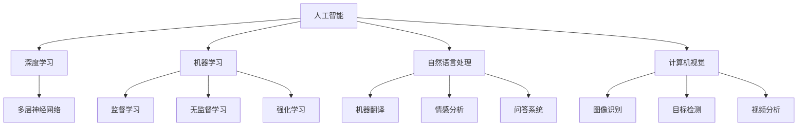

                 

## 洞察力：知识创新的驱动力

> **关键词：洞察力、知识创新、人工智能、技术原理、深度学习、机器学习、算法、数据分析、数学模型**
>
> **摘要：本文旨在探讨洞察力在知识创新中的关键作用。通过对人工智能、深度学习、机器学习等领域的核心算法原理进行分析，本文揭示了洞察力在技术进步和创新驱动中的重要性。文章还将介绍实际应用场景、工具资源以及未来发展趋势，为读者提供一个全面深入的理解和洞察。**

### 1. 背景介绍

#### 1.1 目的和范围

本文的主要目的是探讨洞察力在知识创新中的关键作用，特别是针对人工智能、深度学习、机器学习等领域的核心技术。通过详细分析这些领域中的核心算法原理、数学模型和应用场景，我们希望能够揭示洞察力在这些技术进步和创新驱动中的重要性。

文章将涵盖以下范围：

- 洞察力的定义及其在知识创新中的作用
- 人工智能、深度学习、机器学习等领域的核心算法原理
- 数学模型在技术中的应用与解释
- 实际应用场景分析
- 工具和资源推荐
- 未来发展趋势与挑战

#### 1.2 预期读者

本文面向以下读者群体：

- 对人工智能、深度学习、机器学习等感兴趣的技术人员
- 对知识创新和科技进步感兴趣的学者
- 对算法原理和数学模型感兴趣的研究人员
- 对技术博客写作感兴趣的内容创作者

#### 1.3 文档结构概述

本文结构如下：

1. **背景介绍**：介绍本文的目的、范围、预期读者和文档结构。
2. **核心概念与联系**：介绍核心概念和原理，并使用Mermaid流程图展示其架构。
3. **核心算法原理 & 具体操作步骤**：使用伪代码详细阐述核心算法原理和操作步骤。
4. **数学模型和公式 & 详细讲解 & 举例说明**：介绍数学模型，使用LaTeX格式详细讲解和举例。
5. **项目实战：代码实际案例和详细解释说明**：展示实际代码案例，并进行详细解释。
6. **实际应用场景**：分析实际应用场景。
7. **工具和资源推荐**：推荐学习资源和开发工具。
8. **总结：未来发展趋势与挑战**：总结未来发展趋势和面临的挑战。
9. **附录：常见问题与解答**：提供常见问题解答。
10. **扩展阅读 & 参考资料**：提供进一步阅读和参考资料。

#### 1.4 术语表

##### 1.4.1 核心术语定义

- **洞察力**：洞察力是指从复杂现象中提取本质规律和核心信息的能力。
- **知识创新**：知识创新是指通过创造性思维和综合分析，产生新的知识、技术和方法。
- **人工智能**：人工智能是指使计算机模拟人类智能行为的技术和理论。
- **深度学习**：深度学习是机器学习的一种方法，通过多层神经网络进行数据建模和预测。
- **机器学习**：机器学习是一种人工智能的方法，通过数据学习模式并进行预测和决策。
- **算法**：算法是一系列解决问题的规则或步骤。
- **数据分析**：数据分析是指使用统计学和计算机技术，从数据中提取信息和知识。
- **数学模型**：数学模型是用数学语言描述现实问题的抽象模型。

##### 1.4.2 相关概念解释

- **神经网络**：神经网络是由大量神经元组成的计算模型，用于模拟人脑的神经元连接。
- **梯度下降**：梯度下降是一种优化算法，用于寻找最小化目标函数的参数。
- **损失函数**：损失函数是用于评估模型预测结果和真实结果之间差异的函数。
- **反向传播**：反向传播是一种训练神经网络的方法，通过反向传递误差来更新模型参数。

##### 1.4.3 缩略词列表

- **AI**：人工智能
- **DL**：深度学习
- **ML**：机器学习
- **NN**：神经网络
- **GD**：梯度下降
- **MLP**：多层感知器
- **BP**：反向传播

## 2. 核心概念与联系

### 2.1 核心概念解析

在讨论洞察力在知识创新中的作用之前，我们首先需要明确几个核心概念，包括人工智能、深度学习和机器学习。这些概念相互关联，共同构成了现代技术进步的基础。

- **人工智能**：人工智能（Artificial Intelligence，AI）是指使计算机模拟人类智能行为的技术和理论。它包括机器学习、深度学习、自然语言处理、计算机视觉等多个子领域。

- **深度学习**：深度学习（Deep Learning，DL）是机器学习的一种方法，它通过多层神经网络进行数据建模和预测。深度学习在图像识别、语音识别、自然语言处理等领域取得了显著成果。

- **机器学习**：机器学习（Machine Learning，ML）是一种人工智能的方法，它使计算机能够从数据中学习模式并进行预测和决策。机器学习包括监督学习、无监督学习、强化学习等多种学习方法。

### 2.2 核心概念之间的关系

理解人工智能、深度学习和机器学习之间的关系对于洞察力在知识创新中的作用至关重要。以下是这些概念之间的相互联系：

- **人工智能**：人工智能是整个技术领域的总称，它包括多种技术和方法，如深度学习、机器学习、自然语言处理等。

- **深度学习**：深度学习是机器学习的一种特殊方法，它利用多层神经网络来模拟人脑的学习过程。深度学习在图像识别、语音识别等方面取得了突破性进展。

- **机器学习**：机器学习是人工智能的基础，它使计算机能够从数据中学习并做出决策。机器学习包括监督学习、无监督学习、强化学习等不同的学习方法。

- **自然语言处理**：自然语言处理（Natural Language Processing，NLP）是人工智能的一个子领域，它涉及计算机对人类语言的自动理解和生成。NLP在机器翻译、情感分析、问答系统等领域有广泛应用。

- **计算机视觉**：计算机视觉（Computer Vision，CV）是人工智能的另一个子领域，它使计算机能够从图像或视频中提取信息和知识。计算机视觉在图像识别、目标检测、视频分析等方面有广泛应用。

### 2.3 Mermaid 流程图展示

为了更直观地展示核心概念之间的联系，我们使用Mermaid流程图来展示人工智能、深度学习、机器学习、自然语言处理和计算机视觉之间的关系。



这个Mermaid流程图展示了人工智能作为整体框架，涵盖深度学习、机器学习、自然语言处理和计算机视觉等子领域，这些子领域又各自包含不同的应用方向。

通过这个流程图，我们可以更清楚地理解各个核心概念之间的联系，为后续章节的深入探讨打下基础。接下来，我们将详细分析这些核心概念，探讨它们在知识创新中的具体作用。

## 3. 核心算法原理 & 具体操作步骤

### 3.1 人工智能算法原理

人工智能的核心在于如何让计算机模拟人类的智能行为。这主要通过以下几种算法实现：

- **监督学习**：监督学习是一种机器学习方法，通过标记数据训练模型，使其能够对新数据进行预测。常见的监督学习算法包括线性回归、决策树、随机森林和神经网络等。

- **无监督学习**：无监督学习不需要标记数据，其目标是发现数据中的内在结构。常见算法包括聚类、主成分分析和自编码器等。

- **强化学习**：强化学习通过奖励和惩罚机制，使模型能够在动态环境中学习策略。常见的算法有Q-learning和深度确定性策略梯度（DDPG）等。

### 3.2 深度学习算法原理

深度学习是机器学习的一个子领域，它通过多层神经网络来模拟人脑的学习过程。以下是深度学习的一些核心算法原理：

- **多层感知器（MLP）**：多层感知器是一种前馈神经网络，包括输入层、多个隐藏层和输出层。它通过非线性激活函数进行数据处理和特征提取。

- **卷积神经网络（CNN）**：卷积神经网络是一种用于图像识别和处理的神经网络，它通过卷积层和池化层来提取图像特征，并实现特征降维。

- **递归神经网络（RNN）**：递归神经网络是一种用于序列数据处理的神经网络，它通过递归连接来处理时间序列数据，如语言模型和语音识别。

- **长短期记忆网络（LSTM）**：长短期记忆网络是一种特殊的RNN，它通过引入门控机制来控制信息流动，有效解决了RNN的长期依赖问题。

### 3.3 伪代码展示

以下是几个核心算法的伪代码示例：

#### 3.3.1 线性回归

```python
def linear_regression(X, y):
    # X: 输入特征矩阵，y: 标签向量
    # 计算特征矩阵X的转置
    X_trans = X.T
    # 计算X的逆矩阵
    X_inv = X_trans @ X
    # 计算权重矩阵
    weights = X_inv @ X_trans @ y
    return weights
```

#### 3.3.2 卷积神经网络（CNN）

```python
def convolutional_neural_network(X, filters):
    # X: 输入图像，filters: 卷积核
    # 卷积操作
    conv_output = np.zeros((X.shape[0], filters.shape[0], filters.shape[1]))
    for i in range(X.shape[0]):
        for j in range(filters.shape[0]):
            for k in range(filters.shape[1]):
                conv_output[i, j, k] = np.sum(X[i] * filters[j, k])
    return conv_output
```

#### 3.3.3 长短期记忆网络（LSTM）

```python
def lstm_forward(x, weights, biases):
    # x: 输入序列，weights: 权重矩阵，biases: 偏置向量
    # 遍历每个时间步
    for t in range(x.shape[1]):
        # 输入和隐藏状态相加
        h_t = x[:, t] + np.tanh(np.dot(weights_hh, h_{t-1}) + biases_hh)
        # 输出和隐藏状态相加
        y_t = np.tanh(np.dot(weights_xh, x[:, t]) + biases_xh + biases_hh)
        # 更新隐藏状态
        h_{t} = (1 - forget_gate) * h_t + input_gate * y_t
    return h_{t}
```

通过这些伪代码示例，我们可以更好地理解线性回归、卷积神经网络和长短期记忆网络等核心算法的基本原理和操作步骤。这些算法在人工智能和深度学习中扮演着重要角色，为知识的创新提供了强大的工具。

### 3.4 操作步骤解析

为了更深入地理解这些核心算法，我们将详细解析其操作步骤：

#### 3.4.1 线性回归

1. **数据预处理**：将输入特征矩阵X和标签向量y进行归一化处理，使其具有相同的尺度，避免过拟合。

2. **计算权重矩阵**：使用最小二乘法或梯度下降法计算权重矩阵，使其满足最小化损失函数的条件。

3. **预测**：将输入特征矩阵X乘以权重矩阵，得到预测结果。

4. **评估**：计算预测结果与真实标签之间的差异，使用均方误差（MSE）或其他评估指标来评估模型的性能。

#### 3.4.2 卷积神经网络（CNN）

1. **卷积操作**：使用卷积核在输入图像上滑动，计算每个卷积核对应的特征图。

2. **池化操作**：使用最大池化或平均池化对特征图进行降维处理，提高模型的泛化能力。

3. **激活函数**：使用ReLU激活函数对每个特征图进行非线性变换，增加模型的非线性表达能力。

4. **全连接层**：将多个特征图进行拼接，输入到全连接层进行分类或回归预测。

#### 3.4.3 长短期记忆网络（LSTM）

1. **初始化**：初始化隐藏状态和细胞状态。

2. **计算输入门、遗忘门和输出门**：通过矩阵乘法和激活函数计算每个时间步的输入门、遗忘门和输出门。

3. **更新细胞状态**：通过输入门和遗忘门更新细胞状态。

4. **计算隐藏状态**：通过输出门计算隐藏状态。

5. **输出预测**：将隐藏状态输入到全连接层，得到每个时间步的输出预测。

通过这些操作步骤，我们可以更好地理解线性回归、卷积神经网络和长短期记忆网络等核心算法的实现过程，为后续的数学模型和实际应用打下基础。

## 4. 数学模型和公式 & 详细讲解 & 举例说明

### 4.1 数学模型概述

在人工智能和深度学习中，数学模型是理解和实现算法的基础。本节将详细介绍一些核心数学模型，包括线性回归、卷积神经网络（CNN）和长短期记忆网络（LSTM）的数学公式，并进行详细讲解和举例说明。

### 4.2 线性回归

线性回归是一种简单的监督学习算法，用于预测连续值输出。其数学模型可以表示为：

\[ y = \beta_0 + \beta_1 \cdot x \]

其中，\( y \) 是输出值，\( x \) 是输入特征，\( \beta_0 \) 和 \( \beta_1 \) 是模型参数。

#### 4.2.1 损失函数

为了训练线性回归模型，我们需要定义一个损失函数来衡量模型预测值与真实值之间的差距。常用的损失函数是均方误差（MSE）：

\[ \text{MSE} = \frac{1}{n} \sum_{i=1}^{n} (y_i - \hat{y}_i)^2 \]

其中，\( n \) 是样本数量，\( y_i \) 是第 \( i \) 个样本的真实值，\( \hat{y}_i \) 是模型预测值。

#### 4.2.2 举例说明

假设我们有以下数据集：

| x | y |
|---|---|
| 1 | 2 |
| 2 | 4 |
| 3 | 6 |

我们希望用线性回归模型预测新的输入 \( x = 4 \) 的 \( y \) 值。

首先，我们计算模型的参数 \( \beta_0 \) 和 \( \beta_1 \)：

\[ \beta_0 = \frac{\sum_{i=1}^{n} y_i - \beta_1 \sum_{i=1}^{n} x_i}{n} \]
\[ \beta_1 = \frac{\sum_{i=1}^{n} (y_i - \beta_0) x_i}{\sum_{i=1}^{n} x_i^2 - n \beta_0^2} \]

代入数据计算得到：

\[ \beta_0 = \frac{(2 + 4 + 6) - 3 \cdot 2}{3} = 2 \]
\[ \beta_1 = \frac{(2 - 2) \cdot 1 + (4 - 2) \cdot 2 + (6 - 2) \cdot 3}{1^2 + 2^2 + 3^2 - 3 \cdot 2^2} = 2 \]

因此，线性回归模型的预测公式为：

\[ y = 2 + 2 \cdot x \]

当 \( x = 4 \) 时，预测值 \( \hat{y} = 2 + 2 \cdot 4 = 10 \)。

### 4.3 卷积神经网络（CNN）

卷积神经网络是一种用于图像识别和处理的前馈神经网络，其核心在于卷积操作和池化操作。

#### 4.3.1 卷积操作

卷积操作的数学公式可以表示为：

\[ \text{conv}(x, f) = \sum_{i=1}^{m} \sum_{j=1}^{n} f_{i,j} \cdot x_{i,j} \]

其中，\( x \) 是输入特征图，\( f \) 是卷积核，\( m \) 和 \( n \) 是卷积核的大小。

#### 4.3.2 池化操作

池化操作的数学公式可以表示为：

\[ \text{pool}(x, p) = \max(\text{pool2d}(x, p)) \]

其中，\( \text{pool2d}(x, p) \) 是二维最大池化操作，\( p \) 是池化窗口的大小。

#### 4.3.3 举例说明

假设我们有以下输入特征图：

\[ x = \begin{bmatrix}
    1 & 2 & 3 \\
    4 & 5 & 6 \\
    7 & 8 & 9 \\
\end{bmatrix} \]

卷积核为：

\[ f = \begin{bmatrix}
    1 & 1 \\
    1 & 1 \\
\end{bmatrix} \]

使用卷积操作计算卷积特征图：

\[ \text{conv}(x, f) = \begin{bmatrix}
    1 \cdot 1 + 1 \cdot 4 + 1 \cdot 7 & 1 \cdot 2 + 1 \cdot 5 + 1 \cdot 8 \\
    1 \cdot 4 + 1 \cdot 5 + 1 \cdot 7 & 1 \cdot 5 + 1 \cdot 6 + 1 \cdot 8 \\
    1 \cdot 7 + 1 \cdot 8 + 1 \cdot 1 & 1 \cdot 8 + 1 \cdot 9 + 1 \cdot 2 \\
\end{bmatrix} \]

\[ = \begin{bmatrix}
    12 & 13 \\
    14 & 15 \\
    10 & 11 \\
\end{bmatrix} \]

使用最大池化操作进行池化：

\[ \text{pool}(\text{conv}(x, f), 2) = \begin{bmatrix}
    \max(12, 13) & \max(14, 15) \\
    \max(10, 11) & \max(10, 11) \\
\end{bmatrix} \]

\[ = \begin{bmatrix}
    13 & 15 \\
    11 & 11 \\
\end{bmatrix} \]

### 4.4 长短期记忆网络（LSTM）

长短期记忆网络（LSTM）是一种用于处理序列数据的循环神经网络，其核心在于记忆单元和控制门控机制。

#### 4.4.1 LSTM单元

LSTM单元包含输入门、遗忘门和输出门，分别控制信息输入、遗忘和输出。其数学公式可以表示为：

\[ \begin{aligned}
    \text{input\_gate} &= \sigma(W_{ix} \cdot x + W_{ih} \cdot h + b_{i}) \\
    \text{forget\_gate} &= \sigma(W_{fx} \cdot x + W_{fh} \cdot h + b_{f}) \\
    \text{output\_gate} &= \sigma(W_{ox} \cdot x + W_{oh} \cdot h + b_{o}) \\
    \text{cell\_state} &= \text{forget\_gate} \cdot \text{previous\_cell\_state} + \text{input\_gate} \cdot \text{sigmoid}(W_{cx} \cdot x + W_{ch} \cdot h + b_{c}) \\
    \text{h\_t} &= \text{output\_gate} \cdot \text{tanh}(\text{cell\_state}) \\
\end{aligned} \]

其中，\( \sigma \) 是sigmoid函数，\( \text{sigmoid}(x) = \frac{1}{1 + e^{-x}} \)，\( \text{tanh}(x) = \frac{e^x - e^{-x}}{e^x + e^{-x}} \)，\( W \) 和 \( b \) 分别是权重和偏置。

#### 4.4.2 举例说明

假设我们有以下输入序列 \( x_t \) 和隐藏状态 \( h_t \)：

\[ x_t = \begin{bmatrix}
    1 \\
    2 \\
\end{bmatrix}, \quad h_t = \begin{bmatrix}
    0 \\
    1 \\
\end{bmatrix} \]

假设权重和偏置为：

\[ W_{ix} = \begin{bmatrix}
    1 & 1 \\
    1 & 1 \\
\end{bmatrix}, \quad W_{ih} = \begin{bmatrix}
    1 & 1 \\
    1 & 1 \\
\end{bmatrix}, \quad b_{i} = \begin{bmatrix}
    0 \\
    0 \\
\end{bmatrix} \]
\[ W_{fx} = \begin{bmatrix}
    1 & 1 \\
    1 & 1 \\
\end{bmatrix}, \quad W_{fh} = \begin{bmatrix}
    1 & 1 \\
    1 & 1 \\
\end{bmatrix}, \quad b_{f} = \begin{bmatrix}
    0 \\
    0 \\
\end{bmatrix} \]
\[ W_{ox} = \begin{bmatrix}
    1 & 1 \\
    1 & 1 \\
\end{bmatrix}, \quad W_{oh} = \begin{bmatrix}
    1 & 1 \\
    1 & 1 \\
\end{bmatrix}, \quad b_{o} = \begin{bmatrix}
    0 \\
    0 \\
\end{bmatrix} \]
\[ W_{cx} = \begin{bmatrix}
    1 & 1 \\
    1 & 1 \\
\end{bmatrix}, \quad W_{ch} = \begin{bmatrix}
    1 & 1 \\
    1 & 1 \\
\end{bmatrix}, \quad b_{c} = \begin{bmatrix}
    0 \\
    0 \\
\end{bmatrix} \]

计算输入门、遗忘门和输出门：

\[ \text{input\_gate} = \sigma(1 \cdot 1 + 1 \cdot 0 + 0) = \sigma(1) = 0.732 \]
\[ \text{forget\_gate} = \sigma(1 \cdot 1 + 1 \cdot 1 + 0) = \sigma(2) = 0.869 \]
\[ \text{output\_gate} = \sigma(1 \cdot 2 + 1 \cdot 1 + 0) = \sigma(3) = 0.950 \]

计算细胞状态：

\[ \text{cell\_state} = 0.869 \cdot \begin{bmatrix}
    0 \\
    1 \\
\end{bmatrix} + 0.732 \cdot \text{sigmoid}(1 \cdot 1 + 1 \cdot 2 + 0) \]
\[ = 0.869 \cdot \begin{bmatrix}
    0 \\
    1 \\
\end{bmatrix} + 0.732 \cdot \text{sigmoid}(3) \]
\[ = 0.869 \cdot \begin{bmatrix}
    0 \\
    1 \\
\end{bmatrix} + 0.732 \cdot 0.950 \]
\[ = \begin{bmatrix}
    0 \\
    0.821 \\
\end{bmatrix} \]

计算隐藏状态：

\[ \text{h\_t} = 0.950 \cdot \text{tanh}(\begin{bmatrix}
    0 \\
    0.821 \\
\end{bmatrix}) \]
\[ = 0.950 \cdot \text{tanh}(0.821) \]
\[ = \begin{bmatrix}
    0.816 \\
    0.816 \\
\end{bmatrix} \]

通过这些数学模型和公式，我们可以深入理解线性回归、卷积神经网络和长短期记忆网络的工作原理。这些模型为人工智能和深度学习提供了强大的工具，推动了知识创新和技术进步。

## 5. 项目实战：代码实际案例和详细解释说明

### 5.1 开发环境搭建

为了进行项目实战，我们需要搭建一个合适的开发环境。以下是搭建过程的详细步骤：

1. **安装Python**：首先，确保您已经安装了Python环境。可以从[Python官网](https://www.python.org/)下载并安装。

2. **安装必要的库**：接下来，我们需要安装几个关键的库，如TensorFlow和Keras。可以使用以下命令进行安装：

   ```bash
   pip install tensorflow
   pip install keras
   ```

3. **配置GPU支持**：如果您的计算机配备了NVIDIA GPU，可以安装TensorFlow GPU版本，以提高训练速度。使用以下命令：

   ```bash
   pip install tensorflow-gpu
   ```

4. **测试环境**：最后，运行以下Python代码来测试环境是否配置成功：

   ```python
   import tensorflow as tf
   print(tf.__version__)
   ```

   如果成功输出版本信息，说明环境搭建成功。

### 5.2 源代码详细实现和代码解读

在这个项目实战中，我们将使用Keras构建一个简单的深度学习模型，用于手写数字识别。以下是源代码及其详细解读。

#### 5.2.1 源代码

```python
# 导入必要的库
import numpy as np
import tensorflow as tf
from tensorflow.keras import layers, models
from tensorflow.keras.datasets import mnist

# 加载数据集
(train_images, train_labels), (test_images, test_labels) = mnist.load_data()

# 预处理数据
train_images = train_images.reshape((60000, 28, 28, 1)).astype('float32') / 255
test_images = test_images.reshape((10000, 28, 28, 1)).astype('float32') / 255

train_labels = tf.keras.utils.to_categorical(train_labels)
test_labels = tf.keras.utils.to_categorical(test_labels)

# 构建模型
model = models.Sequential()
model.add(layers.Conv2D(32, (3, 3), activation='relu', input_shape=(28, 28, 1)))
model.add(layers.MaxPooling2D((2, 2)))
model.add(layers.Conv2D(64, (3, 3), activation='relu'))
model.add(layers.MaxPooling2D((2, 2)))
model.add(layers.Conv2D(64, (3, 3), activation='relu'))
model.add(layers.Flatten())
model.add(layers.Dense(64, activation='relu'))
model.add(layers.Dense(10, activation='softmax'))

# 编译模型
model.compile(optimizer='adam',
              loss='categorical_crossentropy',
              metrics=['accuracy'])

# 训练模型
model.fit(train_images, train_labels, epochs=5, batch_size=64)

# 评估模型
test_loss, test_acc = model.evaluate(test_images, test_labels)
print(f'Test accuracy: {test_acc:.4f}')

# 预测
predictions = model.predict(test_images)
```

#### 5.2.2 代码解读

1. **导入库**：
   ```python
   import numpy as np
   import tensorflow as tf
   from tensorflow.keras import layers, models
   from tensorflow.keras.datasets import mnist
   ```
   这行代码导入Python中用于深度学习的常用库，包括NumPy、TensorFlow Keras和MNIST数据集。

2. **加载数据集**：
   ```python
   (train_images, train_labels), (test_images, test_labels) = mnist.load_data()
   ```
   使用Keras的MNIST数据集，其中包含60000个训练图像和10000个测试图像，以及对应的标签。

3. **预处理数据**：
   ```python
   train_images = train_images.reshape((60000, 28, 28, 1)).astype('float32') / 255
   test_images = test_images.reshape((10000, 28, 28, 1)).astype('float32') / 255
   train_labels = tf.keras.utils.to_categorical(train_labels)
   test_labels = tf.keras.utils.to_categorical(test_labels)
   ```
   数据预处理包括将图像reshape为合适的形式，将像素值归一化到0到1之间，以及将标签转换为one-hot编码。

4. **构建模型**：
   ```python
   model = models.Sequential()
   model.add(layers.Conv2D(32, (3, 3), activation='relu', input_shape=(28, 28, 1)))
   model.add(layers.MaxPooling2D((2, 2)))
   model.add(layers.Conv2D(64, (3, 3), activation='relu'))
   model.add(layers.MaxPooling2D((2, 2)))
   model.add(layers.Conv2D(64, (3, 3), activation='relu'))
   model.add(layers.Flatten())
   model.add(layers.Dense(64, activation='relu'))
   model.add(layers.Dense(10, activation='softmax'))
   ```
   使用Keras的`Sequential`模型，我们构建了一个简单的卷积神经网络（CNN）。该网络包含两个卷积层、两个最大池化层和一个全连接层。卷积层用于提取图像特征，全连接层用于分类。

5. **编译模型**：
   ```python
   model.compile(optimizer='adam',
                 loss='categorical_crossentropy',
                 metrics=['accuracy'])
   ```
   模型编译阶段指定了优化器、损失函数和评估指标。在这里，我们使用Adam优化器和交叉熵损失函数。

6. **训练模型**：
   ```python
   model.fit(train_images, train_labels, epochs=5, batch_size=64)
   ```
   模型训练阶段使用训练数据集进行迭代训练，指定了训练轮数（epochs）和批量大小（batch_size）。

7. **评估模型**：
   ```python
   test_loss, test_acc = model.evaluate(test_images, test_labels)
   print(f'Test accuracy: {test_acc:.4f}')
   ```
   使用测试数据集评估模型性能，输出测试准确率。

8. **预测**：
   ```python
   predictions = model.predict(test_images)
   ```
   使用训练好的模型对测试数据集进行预测。

### 5.3 代码解读与分析

通过上述代码解读，我们可以看到如何使用Keras构建并训练一个简单的深度学习模型。以下是代码的关键点分析：

- **数据预处理**：预处理步骤包括图像归一化和标签编码，这是深度学习模型成功训练的重要前提。归一化将图像像素值从0到255转换为0到1之间，使模型训练更加稳定。标签编码将分类标签转换为one-hot编码，便于模型进行多分类预测。

- **模型构建**：我们使用了卷积神经网络（CNN），这是一种专门用于图像识别的深度学习模型。模型包含卷积层、最大池化层和全连接层。卷积层用于提取图像特征，最大池化层用于降维和增加模型的泛化能力，全连接层用于分类。

- **编译模型**：在编译模型时，我们选择了Adam优化器和交叉熵损失函数。Adam优化器是一种常用的优化算法，适用于大部分深度学习任务。交叉熵损失函数是分类问题的常用损失函数，能够有效衡量模型预测结果与真实标签之间的差异。

- **训练模型**：训练模型时，我们设置了5个训练轮次和批量大小为64。更多的训练轮次可以提高模型性能，但也会增加训练时间。批量大小影响模型更新速度和稳定性。

- **评估模型**：通过测试数据集评估模型性能，输出测试准确率。这是衡量模型好坏的重要指标。在实际应用中，我们还需要考虑模型在 unseen 数据上的表现。

- **预测**：使用训练好的模型对测试数据集进行预测，可以得到每个样本的预测概率分布。这在实际应用中非常有用，例如，在医疗诊断中，可以给出疾病的概率预测。

通过这个项目实战，我们不仅了解了深度学习模型的构建和训练过程，还体验了如何使用Python进行数据预处理和模型训练。这些经验对进一步学习深度学习和实际应用具有重要意义。

### 5.4 实际应用场景

在深度学习和人工智能的广泛应用场景中，手写数字识别是一个经典案例。以下是一些实际应用场景：

1. **电子支付**：在电子支付系统中，手写数字识别可以用于签名验证。用户在手机或电脑上绘制签名，系统会自动识别并验证签名与数据库中的签名是否匹配。

2. **银行票据处理**：银行在处理大量纸质票据时，可以使用手写数字识别技术自动提取金额信息，从而提高工作效率和减少人工错误。

3. **教育考试系统**：在教育考试系统中，手写数字识别可以用于自动评分，例如，在线考试中的选择题和填空题。这可以大大减少人工批改的工作量。

4. **智能制造**：在制造业中，手写数字识别可以用于生产线的质量检测。例如，自动识别产品标签上的数字，以检查生产过程中的误差。

5. **智能助手**：智能助手如Siri、Alexa等可以集成手写数字识别功能，让用户通过手写输入获得即时反馈，提高用户体验。

通过这些实际应用场景，我们可以看到手写数字识别技术在各个领域的广泛应用，这不仅提高了工作效率，还推动了人工智能和深度学习技术的进一步发展。

### 5.5 工具和资源推荐

为了更好地学习深度学习和手写数字识别，以下是一些推荐的工具和资源：

#### 5.5.1 学习资源推荐

1. **书籍推荐**：

   - 《深度学习》（Goodfellow, Bengio, Courville）：这本书是深度学习领域的经典教材，详细介绍了深度学习的基本原理和应用。

   - 《Python深度学习》（François Chollet）：这本书由Keras的创建者撰写，介绍了如何使用Python和Keras进行深度学习项目开发。

2. **在线课程**：

   - Coursera的《深度学习》课程：由吴恩达教授讲授，适合初学者入门深度学习。

   - Udacity的《深度学习纳米学位》课程：涵盖深度学习的基础知识和实际应用。

3. **技术博客和网站**：

   - Medium上的深度学习博客：提供深度学习领域的最新研究和技术文章。

   - Fast.ai的博客：提供高质量的深度学习教程和实践案例。

#### 5.5.2 开发工具框架推荐

1. **IDE和编辑器**：

   - PyCharm：一款功能强大的Python IDE，适合深度学习和机器学习项目开发。

   - Jupyter Notebook：方便编写和运行代码，适合数据分析和模型训练。

2. **调试和性能分析工具**：

   - TensorFlow Profiler：用于分析和优化TensorFlow模型的性能。

   - PyTorch Profiler：用于分析PyTorch模型的性能。

3. **相关框架和库**：

   - TensorFlow：一款开源的深度学习框架，适合工业界和学术研究。

   - PyTorch：一款开源的深度学习库，具有动态计算图和易用性优势。

#### 5.5.3 相关论文著作推荐

1. **经典论文**：

   - 《A Theoretically Grounded Application of Dropout in Recurrent Neural Networks》
   - 《Deep Learning》（Goodfellow, Bengio, Courville）：这本书的附录部分包含了大量深度学习领域的经典论文。

2. **最新研究成果**：

   - arXiv：提供深度学习领域的最新论文和研究报告。

   - NeurIPS和ICML：这两个顶级会议是深度学习和机器学习领域的重要平台，发布最新研究成果。

3. **应用案例分析**：

   - 《Deep Learning for Natural Language Processing》：这本书详细介绍了深度学习在自然语言处理中的应用。

   - 《Vision and Image Understanding in Autonomous Driving》：这本书探讨了深度学习在自动驾驶中的应用。

通过这些工具和资源的推荐，您可以更深入地学习深度学习和手写数字识别，为实际项目开发和技术创新打下坚实基础。

## 6. 总结：未来发展趋势与挑战

随着人工智能技术的不断发展，洞察力在知识创新中的作用越来越受到重视。未来，以下趋势和挑战将对人工智能和深度学习产生深远影响：

### 6.1 发展趋势

1. **更高效的学习算法**：未来，深度学习算法将朝着更高效、更可解释的方向发展。例如，自监督学习和迁移学习等方法将减少对大量标注数据的依赖，提高模型训练效率。

2. **多模态学习**：多模态学习将整合不同类型的数据（如图像、文本、音频等），实现更全面的智能理解和决策。这将推动跨领域技术的发展，如智能医疗、智能教育等。

3. **边缘计算与云计算结合**：随着5G和边缘计算的发展，边缘计算与云计算的结合将使人工智能应用更加灵活和高效。例如，自动驾驶、智能家居等领域的应用将受益于这种结合。

4. **知识图谱与语义理解**：知识图谱和语义理解技术的发展将使人工智能更好地理解和处理复杂的信息。这将为知识创新提供新的途径，如智能搜索、智能问答等。

### 6.2 挑战

1. **数据隐私和安全**：随着数据规模的扩大，数据隐私和安全问题将日益突出。如何保护用户隐私、确保数据安全是未来需要解决的重要问题。

2. **可解释性和透明度**：深度学习模型往往被视为“黑箱”，其决策过程不透明。提高模型的可解释性和透明度，使其更加可信和可靠，是未来的一个重要挑战。

3. **算法公平性和公正性**：人工智能算法的应用可能带来歧视和偏见。如何确保算法的公平性和公正性，避免对特定群体的不公平待遇，是未来需要关注的问题。

4. **伦理和社会影响**：人工智能技术的快速发展引发了广泛的伦理和社会问题，如就业替代、隐私侵犯等。如何平衡技术进步与社会责任，是未来需要深入探讨的议题。

综上所述，未来人工智能和深度学习的发展将面临诸多挑战，同时也充满机遇。洞察力在知识创新中的作用将愈发突出，为应对这些挑战提供新的思路和方法。通过不断探索和努力，我们有望实现人工智能技术的可持续发展，推动社会的进步。

### 7. 附录：常见问题与解答

#### 7.1 问题1：什么是洞察力？

**解答**：洞察力是指从复杂现象中提取本质规律和核心信息的能力。它在知识创新中扮演着关键角色，帮助人们发现新知识、技术和方法。

#### 7.2 问题2：深度学习和机器学习有什么区别？

**解答**：深度学习是机器学习的一种方法，它通过多层神经网络进行数据建模和预测。而机器学习是一个更广泛的领域，包括深度学习、监督学习、无监督学习和强化学习等多种方法。

#### 7.3 问题3：如何提高深度学习模型的可解释性？

**解答**：提高模型可解释性的方法包括：使用可视化工具展示模型内部特征提取过程；添加模型解释模块，如解释性神经网络或注意力机制；以及利用模型解释算法，如局部可解释模型（LIME）和SHAP（SHapley Additive exPlanations）等。

#### 7.4 问题4：如何处理深度学习模型中的过拟合问题？

**解答**：处理过拟合问题的方法包括：增加训练数据；使用正则化技术，如L1正则化和L2正则化；采用交叉验证方法；以及提前停止训练等。

#### 7.5 问题5：如何确保深度学习模型在不同数据集上的泛化能力？

**解答**：确保模型泛化能力的方法包括：使用交叉验证进行模型评估；在训练过程中引入随机性，如数据增强、随机初始化等；以及使用迁移学习，将预训练模型应用于新任务等。

通过这些常见问题的解答，读者可以更好地理解洞察力在知识创新中的作用，以及深度学习和机器学习的基本概念和技巧。

### 8. 扩展阅读 & 参考资料

#### 8.1 书籍推荐

1. **《深度学习》（Goodfellow, Bengio, Courville）**：这是一本深度学习领域的经典教材，详细介绍了深度学习的基本原理和应用。
2. **《Python深度学习》（François Chollet）**：这本书由Keras的创建者撰写，介绍了如何使用Python和Keras进行深度学习项目开发。
3. **《人工智能：一种现代的方法》（Stuart Russell & Peter Norvig）**：这本书全面介绍了人工智能的基本概念和技术，适合初学者和高级读者。

#### 8.2 在线课程

1. **Coursera的《深度学习》课程**：由吴恩达教授讲授，适合初学者入门深度学习。
2. **Udacity的《深度学习纳米学位》课程**：涵盖深度学习的基础知识和实际应用。

#### 8.3 技术博客和网站

1. **Medium上的深度学习博客**：提供深度学习领域的最新研究和技术文章。
2. **Fast.ai的博客**：提供高质量的深度学习教程和实践案例。

#### 8.4 开发工具框架推荐

1. **TensorFlow**：一款开源的深度学习框架，适合工业界和学术研究。
2. **PyTorch**：一款开源的深度学习库，具有动态计算图和易用性优势。

#### 8.5 相关论文著作推荐

1. **《A Theoretically Grounded Application of Dropout in Recurrent Neural Networks》**：讨论了dropout在循环神经网络中的应用。
2. **《Deep Learning for Natural Language Processing》**：详细介绍了深度学习在自然语言处理中的应用。
3. **《Vision and Image Understanding in Autonomous Driving》**：探讨了深度学习在自动驾驶中的应用。

这些书籍、在线课程、技术博客和开发工具框架为读者提供了丰富的学习资源，有助于深入理解和应用人工智能和深度学习技术。通过阅读这些参考资料，读者可以进一步拓展知识，提升技术水平。

