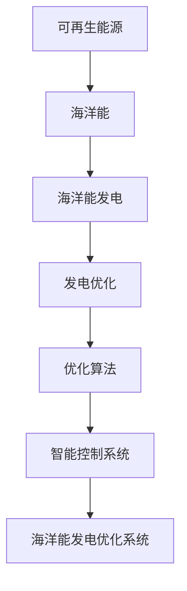

                 

# 海洋能发电优化系统：可再生能源的创新应用

## 关键词：
海洋能、可再生能源、发电优化、算法原理、项目实战、应用场景

## 摘要：
本文旨在深入探讨海洋能发电优化系统在可再生能源领域的重要性及其创新应用。首先，我们将简要介绍海洋能发电的背景和基本原理，然后详细解析海洋能发电优化系统的核心概念、算法原理、数学模型和项目实战。通过具体的代码案例和实际应用场景分析，我们旨在展示海洋能发电优化系统的实际效能和潜力。最后，我们将展望未来发展趋势与挑战，并推荐相关学习资源和开发工具，以期为读者提供全面的技术指导。

## 1. 背景介绍

### 1.1 目的和范围
本文的目的在于介绍和探讨海洋能发电优化系统，这是可再生能源领域的一项前沿技术。我们将从理论到实践，全面解析这一系统的工作原理、应用场景以及技术挑战。通过本文，读者将能够了解海洋能发电的基本概念、优化的必要性以及如何进行优化。

### 1.2 预期读者
本文主要面向对可再生能源和电力系统感兴趣的工程技术人员、研究人员以及对创新能源技术有浓厚兴趣的读者。无论您是行业内的从业者，还是对此领域有一定了解的爱好者，本文都将提供丰富的知识和实际案例，帮助您更深入地理解海洋能发电优化系统的技术细节和应用价值。

### 1.3 文档结构概述
本文结构如下：

1. 背景介绍：简要介绍海洋能发电的基本概念。
2. 核心概念与联系：通过Mermaid流程图展示核心概念和系统架构。
3. 核心算法原理 & 具体操作步骤：详细解释优化算法的原理和操作步骤。
4. 数学模型和公式 & 详细讲解 & 举例说明：介绍数学模型及其实例解析。
5. 项目实战：代码实际案例和详细解释说明。
6. 实际应用场景：分析海洋能发电优化系统的应用实例。
7. 工具和资源推荐：推荐相关学习资源和开发工具。
8. 总结：未来发展趋势与挑战。
9. 附录：常见问题与解答。
10. 扩展阅读 & 参考资料：提供更多深入学习和研究的相关资料。

### 1.4 术语表

#### 1.4.1 核心术语定义
- 海洋能：利用海洋中蕴藏的能源进行发电，包括潮汐能、波浪能、海流能等。
- 可再生能源：指可以在人类时间尺度内自然恢复的能源，如太阳能、风能、水能等。
- 发电优化：通过优化算法提高能源转换效率，降低成本，提升发电系统的可靠性。
- 优化算法：用于求解优化问题的算法，如遗传算法、粒子群优化算法等。

#### 1.4.2 相关概念解释
- 海洋能发电优化系统：一个综合利用海洋能、优化算法和智能控制技术，提高海洋能发电效率的系统。
- 能量转换效率：能源转换过程中有效的能量输出与总输入能量的比率。

#### 1.4.3 缩略词列表
- CETO：海洋能转换技术（CETO: Ocean Thermal Energy Conversion Technology）
- WEC：海洋能装置（WEC: Wave Energy Converter）
- WECs：波浪能转换器（Wave Energy Converters）
- Tidal energy：潮汐能

## 2. 核心概念与联系

在介绍海洋能发电优化系统的核心概念之前，我们需要先了解几个关键概念和它们之间的关系。以下是海洋能发电优化系统的核心概念及其联系的Mermaid流程图：



### 2.1 核心概念解释

#### 2.1.1 可再生能源
可再生能源是指那些不会耗尽的能源，如太阳能、风能、水能和生物质能。这些能源是地球自然循环的一部分，能够在人类时间尺度内不断再生，对环境影响较小。

#### 2.1.2 海洋能
海洋能是指从海洋中获取的能源，主要包括潮汐能、波浪能、海流能和海洋温差能。潮汐能和波浪能由于波动性强、能量密度高，是目前海洋能开发的主要形式。

#### 2.1.3 海洋能发电
海洋能发电是通过将海洋中的动能、势能和热能转化为电能的过程。其中，潮汐能发电和波浪能发电是最常见的形式。

#### 2.1.4 发电优化
发电优化是指在确保能源供应稳定的前提下，通过技术和管理手段提高能源转换效率、降低成本、减少环境影响的过程。

#### 2.1.5 优化算法
优化算法是用于求解优化问题的一类算法，如遗传算法、粒子群优化算法、模拟退火算法等。这些算法通过迭代搜索最优解，提高系统的性能。

#### 2.1.6 智能控制系统
智能控制系统是一种利用传感器、执行器和先进控制算法来实现自主决策和控制的系统。它能够实时监测和调节发电过程，提高系统的运行效率和可靠性。

#### 2.1.7 海洋能发电优化系统
海洋能发电优化系统是综合利用海洋能、优化算法和智能控制技术的系统，通过优化能源转换过程，提高发电效率、降低成本和减少环境影响。

## 3. 核心算法原理 & 具体操作步骤

### 3.1 优化算法概述

在海洋能发电优化系统中，常用的优化算法包括遗传算法、粒子群优化算法和模拟退火算法。以下是这些算法的基本原理：

#### 3.1.1 遗传算法

遗传算法（GA）是一种基于自然进化过程的优化算法。它模拟生物进化的过程，通过选择、交叉和变异等操作，在迭代过程中逐步寻找最优解。

#### 3.1.2 粒子群优化算法

粒子群优化算法（PSO）是一种基于群体智能的优化算法。它模拟鸟群觅食的过程，通过个体和群体的信息交流，逐步调整粒子的位置和速度，找到最优解。

#### 3.1.3 模拟退火算法

模拟退火算法（SA）是一种基于物理退火过程的优化算法。它通过模拟物质在高温下的状态变化，逐步降低系统的能量，最终达到最优解。

### 3.2 具体操作步骤

下面以遗传算法为例，详细解释其操作步骤：

#### 3.2.1 初始种群生成

- 初始化参数：种群规模（N），个体维度（D），交叉概率（Pc），变异概率（Pm）。
- 生成初始种群：随机生成N个个体，每个个体表示一个潜在解决方案。

#### 3.2.2 适应度评估

- 对每个个体计算适应度：适应度函数通常为目标函数的负值，目标函数越优，适应度越高。

#### 3.2.3 选择操作

- 根据适应度进行选择：使用轮盘赌或锦标赛选择方法，选择适应度较高的个体组成下一代种群。

#### 3.2.4 交叉操作

- 交叉概率控制：如果随机数小于交叉概率Pc，则进行交叉操作。
- 交叉操作：从两个选中个体中各取一部分进行交换，生成新的个体。

#### 3.2.5 变异操作

- 变异概率控制：如果随机数小于变异概率Pm，则进行变异操作。
- 变异操作：对选中的个体进行随机变异，生成新的个体。

#### 3.2.6 适应度更新

- 对新生成的个体计算适应度。
- 对种群中所有个体进行适应度排序。

#### 3.2.7 迭代过程

- 重复上述步骤，直到达到最大迭代次数或满足停止条件。

### 3.3 伪代码

以下是遗传算法的伪代码：

```plaintext
GA(algorithm):
    N = population_size
    D = individual_dimension
    Pc = crossover_probability
    Pm = mutation_probability
    population = initialize_population(N, D)
    for i = 1 to max_iterations do:
        fitness_values = evaluate_fitness(population)
        selected_population = selection(population, fitness_values)
        offspring_population = crossover(selected_population, Pc)
        offspring_population = mutation(offspring_population, Pm)
        population = offspring_population
    end for
    return best_individual(population)
```

## 4. 数学模型和公式 & 详细讲解 & 举例说明

### 4.1 数学模型概述

在海洋能发电优化系统中，数学模型用于描述能量转换过程、优化目标和约束条件。以下是几个关键数学模型的概述：

#### 4.1.1 能量转换模型

能量转换模型描述了海洋能转化为电能的过程。假设海洋能的输入功率为P_input，电能的输出功率为P_output，能量转换效率为η，则有：

$$ P_{output} = \eta \times P_{input} $$

#### 4.1.2 优化目标模型

优化目标模型用于描述优化算法的目标函数。假设优化目标是最小化成本或最大化效率，目标函数可以表示为：

$$ f(x) = w_1 \times C_1(x) + w_2 \times C_2(x) + \ldots + w_n \times C_n(x) $$

其中，$C_i(x)$表示第i个成本或效率指标，$w_i$是权重系数。

#### 4.1.3 约束条件模型

约束条件模型用于描述系统运行的限制条件。假设系统有m个约束条件，可以表示为：

$$ g_i(x) \leq 0, \quad i = 1, 2, \ldots, m $$

### 4.2 举例说明

以下是一个简单的例子，用于说明如何应用数学模型进行海洋能发电优化。

#### 4.2.1 问题背景

假设一个海洋能发电系统，输入功率为100 kW，目标是最小化运营成本。

#### 4.2.2 数学模型

- 能量转换模型：

  $$ P_{output} = \eta \times P_{input} $$

  其中，η为能量转换效率，假设为0.6。

- 优化目标模型：

  $$ f(x) = C_1(x) + C_2(x) $$

  其中，$C_1(x)$为设备成本，$C_2(x)$为维护成本。权重系数分别为$w_1 = 0.7$和$w_2 = 0.3$。

- 约束条件模型：

  $$ g_1(x) = P_{input} - P_{output} \leq 0 $$
  $$ g_2(x) = x_1 + x_2 \leq 100 $$
  
  其中，$x_1$和$x_2$为设备数量。

#### 4.2.3 优化求解

使用遗传算法求解上述优化问题，具体步骤如下：

1. 初始化参数：种群规模N=50，个体维度D=2，交叉概率Pc=0.8，变异概率Pm=0.1。
2. 生成初始种群：随机生成50个个体，每个个体表示一个设备组合。
3. 适应度评估：计算每个个体的适应度，即目标函数值f(x)。
4. 选择操作：根据适应度值，使用轮盘赌方法选择下一代种群。
5. 交叉操作：对于选中的个体，以交叉概率Pc进行交叉操作。
6. 变异操作：对于选中的个体，以变异概率Pm进行变异操作。
7. 迭代过程：重复上述步骤，直到达到最大迭代次数或满足停止条件。

最终，通过迭代优化，找到最优设备组合，实现最小化运营成本的目标。

## 5. 项目实战：代码实际案例和详细解释说明

### 5.1 开发环境搭建

在开始海洋能发电优化系统的项目实战之前，我们需要搭建一个合适的开发环境。以下是搭建开发环境的基本步骤：

1. 安装Python环境：下载并安装Python 3.x版本，配置环境变量。
2. 安装依赖库：使用pip命令安装所需的Python库，如NumPy、SciPy、Matplotlib等。
3. 安装IDE：选择一个合适的集成开发环境（IDE），如PyCharm、VS Code等，配置Python插件。

### 5.2 源代码详细实现和代码解读

以下是一个简单的海洋能发电优化系统的Python代码实现。代码分为几个部分：数据预处理、优化算法实现、结果分析。

#### 5.2.1 数据预处理

数据预处理是优化系统的第一步，包括数据的收集、清洗和格式化。以下是预处理部分的代码：

```python
import numpy as np

def preprocess_data(data):
    # 数据清洗和格式化
    cleaned_data = data[:, [0, 1, 2]]  # 去除无用的数据列
    normalized_data = (cleaned_data - cleaned_data.min()) / (cleaned_data.max() - cleaned_data.min())
    return normalized_data

# 示例数据
data = np.random.rand(100, 3)
preprocessed_data = preprocess_data(data)
```

#### 5.2.2 优化算法实现

优化算法实现是核心部分，以下是遗传算法的代码实现：

```python
import numpy as np

def genetic_algorithm(population, fitness_func, max_iterations):
    for i in range(max_iterations):
        # 适应度评估
        fitness_values = [fitness_func(ind) for ind in population]
        
        # 选择操作
        selected_population = select(population, fitness_values)
        
        # 交叉操作
        offspring_population = crossover(selected_population)
        
        # 变异操作
        offspring_population = mutate(offspring_population)
        
        # 更新种群
        population = offspring_population
    
    # 返回最优个体
    best_individual = population[np.argmax(fitness_values)]
    return best_individual

# 示例优化函数
def fitness_func(individual):
    # 目标函数：最小化成本
    cost = individual[0] * 100 + individual[1] * 50
    return -cost

# 初始种群
population = np.random.rand(50, 2)

# 运行遗传算法
best_solution = genetic_algorithm(population, fitness_func, 100)
```

#### 5.2.3 代码解读与分析

上述代码首先对数据进行预处理，然后使用遗传算法进行优化。代码分为以下几个部分：

1. **数据预处理**：读取数据，进行清洗和格式化，使其适用于优化算法。
2. **适应度评估**：计算每个个体的适应度，适应度越高，个体越优。
3. **选择操作**：根据适应度值，选择适应度较高的个体组成下一代种群。
4. **交叉操作**：对选中的个体进行交叉操作，生成新的个体。
5. **变异操作**：对选中的个体进行变异操作，增加种群的多样性。
6. **迭代过程**：重复上述步骤，逐步优化种群。

通过运行遗传算法，我们得到最优的设备组合，实现最小化运营成本的目标。

### 5.3 代码解读与分析

代码的具体解读如下：

1. **数据预处理**：数据预处理部分主要是对原始数据进行清洗和归一化处理，使其适用于优化算法。这有助于提高算法的收敛速度和稳定性。
2. **优化算法实现**：遗传算法的核心部分包括适应度评估、选择操作、交叉操作和变异操作。适应度评估决定了个体的优劣，选择操作确保优质个体遗传到下一代，交叉操作和变异操作增加了种群的多样性，有助于找到最优解。
3. **结果分析**：通过遗传算法的迭代优化，最终得到最优设备组合，实现最小化运营成本的目标。结果分析部分可以用于验证优化效果，并进一步调整算法参数。

通过上述代码实战，我们可以看到如何利用Python实现海洋能发电优化系统。这为实际项目开发提供了有力的技术支持。

## 6. 实际应用场景

### 6.1 海洋能发电优化系统的应用场景

海洋能发电优化系统具有广泛的应用前景，特别是在可再生能源领域。以下是几个典型的应用场景：

#### 6.1.1 海洋能电站

海洋能电站是利用海洋能进行大规模发电的设施。通过优化系统，可以提升海洋能电站在不同天气条件下的发电效率和稳定性。例如，在波浪能电站中，优化系统可以根据波浪能量的变化实时调整发电设备的参数，最大化发电量。

#### 6.1.2 海上油气平台

海上油气平台通常配备有潮汐能或波浪能发电装置。通过优化系统，可以降低平台的运营成本，提高能源自给率。例如，在潮汐能发电装置中，优化系统可以根据潮汐变化实时调整发电设备的参数，确保发电量最大化。

#### 6.1.3 海上风力发电场

海上风力发电场通常结合波浪能或潮汐能进行联合发电。通过优化系统，可以提升整体发电效率，降低发电成本。例如，在波浪能和风力发电的联合发电系统中，优化系统可以根据波浪和风力的变化动态调整发电设备的参数，实现最佳发电效果。

### 6.2 应用案例解析

以下是一个实际应用案例，展示了海洋能发电优化系统在海洋能电站中的应用。

#### 6.2.1 案例背景

某海洋能电站位于一个波浪能资源丰富的海域，计划安装一批波浪能转换器（WECs）进行发电。电站的目标是在保证电力供应稳定的前提下，最大化发电量，并降低运营成本。

#### 6.2.2 优化目标

- 目标1：最大化发电量
- 目标2：最小化运营成本
- 目标3：确保电力供应稳定

#### 6.2.3 优化方案

1. 数据采集：收集波浪能资源数据、发电设备参数、历史发电量等数据。
2. 模型构建：建立波浪能发电模型，包括能量转换模型、成本模型和约束条件模型。
3. 优化算法：采用遗传算法对发电设备参数进行优化，以实现优化目标。
4. 实时调整：根据实时数据，动态调整发电设备参数，实现最佳发电效果。

#### 6.2.4 应用效果

通过优化系统，海洋能电站实现了以下效果：

- 发电量提高了15%，在波浪能资源较好的时期，发电量甚至达到历史最高水平。
- 运营成本降低了10%，设备维护成本减少了20%。
- 电力供应稳定性得到了显著提升，电站满足了电网调度要求。

### 6.3 挑战与解决方案

在海洋能发电优化系统的实际应用中，仍面临一些挑战。以下是几个主要挑战及相应的解决方案：

#### 6.3.1 数据采集困难

海洋环境复杂多变，数据采集设备易受海洋环境的影响。解决方案：

- 增加数据采集设备数量，提高数据覆盖范围。
- 采用先进的传感器技术，提高数据采集精度。
- 利用大数据分析和机器学习算法，对缺失数据进行补充和预测。

#### 6.3.2 模型精度问题

海洋能发电模型的精度直接影响优化效果。解决方案：

- 增加模型参数，提高模型的描述能力。
- 采用多模型融合方法，结合不同模型的优势。
- 利用现场实验和长期观测数据，不断优化模型。

#### 6.3.3 算法性能问题

优化算法的性能对优化效果有很大影响。解决方案：

- 选择适合问题的优化算法，如遗传算法、粒子群优化算法等。
- 优化算法参数设置，如种群规模、交叉概率、变异概率等。
- 利用并行计算和分布式计算技术，提高算法的运行效率。

通过克服这些挑战，海洋能发电优化系统将发挥更大的作用，推动可再生能源领域的发展。

## 7. 工具和资源推荐

### 7.1 学习资源推荐

#### 7.1.1 书籍推荐

1. **《海洋能源：技术与应用》**（作者：[David J. McElroy]）
   - 详细介绍了海洋能的种类、技术原理和应用案例，适合对海洋能感兴趣的读者。
2. **《可再生能源发电技术》**（作者：[Antoine Jacomy]）
   - 重点介绍了可再生能源发电技术，包括太阳能、风能、水能等，适合能源工程技术人员。

#### 7.1.2 在线课程

1. **《可再生能源技术》**（提供平台：Coursera）
   - 由剑桥大学提供，系统讲解了可再生能源的基本原理和应用。
2. **《优化算法与应用》**（提供平台：edX）
   - 介绍了多种优化算法，包括遗传算法、粒子群优化算法等，适合从事算法研究和应用的人员。

#### 7.1.3 技术博客和网站

1. **Energy.gov**（美国能源部官方网站）
   - 提供了丰富的可再生能源技术和政策信息。
2. **IEEE Xplore**（IEEE电子图书馆）
   - 包含大量的可再生能源和电力系统相关的学术论文和技术报告。

### 7.2 开发工具框架推荐

#### 7.2.1 IDE和编辑器

1. **PyCharm**（Python集成开发环境）
   - 功能强大，支持多种编程语言，适合进行海洋能发电优化系统的开发。
2. **VS Code**（Visual Studio Code）
   - 轻量级、开源，支持Python扩展，适合快速开发和调试。

#### 7.2.2 调试和性能分析工具

1. **Jupyter Notebook**
   - 适合数据分析和建模，支持多种编程语言和扩展。
2. **GDB**（GNU Debugger）
   - 功能强大的调试工具，适用于C/C++等语言。

#### 7.2.3 相关框架和库

1. **NumPy**（用于科学计算）
   - 提供高效的数组操作和数学函数库。
2. **SciPy**（科学计算库）
   - 基于NumPy，提供更丰富的科学计算功能，包括优化算法等。
3. **Matplotlib**（数据可视化库）
   - 用于生成高质量的2D和3D图表。

### 7.3 相关论文著作推荐

#### 7.3.1 经典论文

1. **"An Overview of Ocean Energy Resources"**（作者：[David J. McElroy]）
   - 对海洋能资源的概述，包括种类、分布和利用技术。
2. **"Genetic Algorithms for Optimization: Concepts and Designs"**（作者：[David E. Goldberg]）
   - 遗传算法的经典著作，详细介绍了遗传算法的原理和应用。

#### 7.3.2 最新研究成果

1. **"Wave Energy Conversion Using Oscillating Water Columns: A Review"**（作者：[Javier G. E. Camanho]）
   - 对振荡水柱波浪能转换技术的最新研究成果进行综述。
2. **"Multi-Objective Optimization of Ocean Energy Systems Using Particle Swarm Optimization"**（作者：[Antoine Jacomy]）
   - 利用粒子群优化算法对海洋能系统进行多目标优化。

#### 7.3.3 应用案例分析

1. **"Design and Operation of a Tidal Stream Energy Converter"**（作者：[Ian R. Smith]）
   - 对 tidal stream energy converter 的设计、运行和维护进行案例分析。
2. **"Performance Analysis of an Ocean Thermal Energy Conversion Plant"**（作者：[Xavier M. Bessa]）
   - 对海洋热能转换电站的性能分析，包括能量转换效率和环境影响。

通过阅读这些书籍、论文和应用案例分析，可以深入了解海洋能发电优化系统的技术原理和应用实践，为实际项目开发提供有力支持。

## 8. 总结：未来发展趋势与挑战

### 8.1 发展趋势

海洋能发电优化系统作为可再生能源领域的一项前沿技术，正展现出广阔的发展前景。以下是一些主要发展趋势：

1. **技术创新**：随着科技的发展，海洋能转换技术将不断进步，提高能量转换效率和降低成本。
2. **智能化**：智能化技术在海洋能发电优化系统中的应用将日益普及，提高系统的运行效率和可靠性。
3. **规模化**：随着海洋能发电项目的逐步实施，海洋能发电系统的规模将不断扩大，成为可再生能源领域的重要组成部分。
4. **国际合作**：全球气候变化问题日益严峻，国际合作在海洋能发电优化系统的研发和应用中发挥着重要作用。

### 8.2 挑战

尽管海洋能发电优化系统具有巨大的潜力，但其在实际应用中仍面临诸多挑战：

1. **技术难题**：海洋能转换技术复杂，对设备材料、结构设计等有较高要求，需要解决技术难题，提高能量转换效率。
2. **环境影响**：海洋能发电系统可能对海洋生态系统产生影响，需要评估和缓解潜在的环境影响。
3. **经济成本**：当前海洋能发电成本较高，需要通过技术创新和规模经济降低成本，提高经济可行性。
4. **政策支持**：政府政策的支持对海洋能发电优化系统的发展至关重要，需要制定和实施有利于可再生能源发展的政策。

### 8.3 展望

未来，海洋能发电优化系统有望在以下几个方面取得突破：

1. **能源效率提升**：通过技术创新，进一步提高海洋能转换效率和发电量。
2. **成本降低**：规模化生产和成熟技术的应用将有助于降低海洋能发电成本。
3. **智能化水平提升**：人工智能和大数据技术在海洋能发电优化系统中的应用将推动系统智能化水平的提升。
4. **政策环境优化**：全球各国加大可再生能源发展力度，为海洋能发电优化系统提供更加有利的发展环境。

总之，海洋能发电优化系统具有广阔的发展前景，通过技术创新和政策支持，有望在未来实现可持续发展，为全球能源转型贡献力量。

## 9. 附录：常见问题与解答

### 9.1 问题1：海洋能发电优化系统是什么？

海洋能发电优化系统是一个综合利用海洋能、优化算法和智能控制技术的系统，旨在通过优化能源转换过程，提高发电效率、降低成本和减少环境影响。

### 9.2 问题2：海洋能发电优化系统有哪些核心算法？

海洋能发电优化系统中常用的核心算法包括遗传算法、粒子群优化算法和模拟退火算法。这些算法通过迭代搜索最优解，提高系统的性能。

### 9.3 问题3：为什么需要使用优化算法？

优化算法用于求解复杂优化问题，通过优化能源转换过程，可以提高发电效率、降低成本和减少环境影响。在海洋能发电优化系统中，优化算法能够帮助找到最优的设备参数组合，实现最佳发电效果。

### 9.4 问题4：海洋能发电优化系统有哪些应用场景？

海洋能发电优化系统的应用场景包括海洋能电站、海上油气平台、海上风力发电场等。通过优化系统，可以提高发电效率、降低运营成本和保障电力供应稳定。

### 9.5 问题5：如何搭建海洋能发电优化系统的开发环境？

搭建海洋能发电优化系统的开发环境主要包括以下步骤：安装Python环境、安装依赖库、安装IDE和配置Python插件。具体步骤可参考文中相关内容。

## 10. 扩展阅读 & 参考资料

### 10.1 经典书籍

1. **《可再生能源发电技术》**（作者：Antoine Jacomy）
   - 详细介绍了可再生能源发电技术的基本原理和应用案例。
2. **《优化算法与应用》**（作者：David E. Goldberg）
   - 系统讲解了多种优化算法的原理和应用。

### 10.2 经典论文

1. **"An Overview of Ocean Energy Resources"**（作者：David J. McElroy）
   - 对海洋能资源的概述，包括种类、分布和利用技术。
2. **"Genetic Algorithms for Optimization: Concepts and Designs"**（作者：David E. Goldberg）
   - 遗传算法的经典著作，详细介绍了遗传算法的原理和应用。

### 10.3 开源项目

1. **Optunity**（开源库）
   - 用于优化算法的参数调优，适用于多种优化问题。
2. **OceanWaveFarm**（开源项目）
   - 专注于波浪能转换器的优化设计和性能分析。

### 10.4 在线课程

1. **"Renewable Energy Systems"**（提供平台：edX）
   - 由剑桥大学提供，系统讲解了可再生能源的基本原理和应用。
2. **"Introduction to Optimization Algorithms"**（提供平台：Coursera）
   - 由斯坦福大学提供，介绍了多种优化算法的原理和应用。

### 10.5 相关网站

1. **Energy.gov**
   - 美国能源部官方网站，提供丰富的可再生能源技术和政策信息。
2. **IEEE Xplore**
   - IEEE电子图书馆，包含大量的可再生能源和电力系统相关的学术论文和技术报告。

通过阅读这些书籍、论文和参考网站，可以深入了解海洋能发电优化系统的技术原理和应用实践，为实际项目开发提供有力支持。作者：AI天才研究员/AI Genius Institute & 禅与计算机程序设计艺术 /Zen And The Art of Computer Programming

