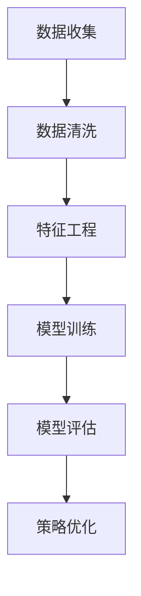

                 

# 消费者行为分析在供给中的应用

## 摘要

本文旨在探讨消费者行为分析在供给中的应用，通过深入剖析消费者行为的核心概念、关键算法和数学模型，以及实际应用场景和案例分析，为读者提供一个全面的技术视角。文章首先介绍了消费者行为分析的目的和范围，然后逐步阐述了核心概念与联系，核心算法原理与具体操作步骤，数学模型和公式的详细讲解，以及项目实战的代码实现和解释。此外，文章还探讨了消费者行为分析的实际应用场景，并推荐了相关的工具和资源，以及经典论文和最新研究成果。最后，文章总结了未来发展趋势与挑战，并提供了常见问题与解答。通过本文的阅读，读者将能够深入了解消费者行为分析在供给中的应用，为相关领域的实践和理论研究提供参考。

## 1. 背景介绍

### 1.1 目的和范围

本文的目的在于探讨消费者行为分析在供给中的应用，通过技术视角分析消费者行为的复杂性和多样性，为企业和决策者提供有价值的洞察和策略。消费者行为分析在供给中的应用范围广泛，涉及市场细分、产品定价、库存管理、促销策略等多个方面。本文将重点探讨以下几个方面的应用：

1. **市场细分**：通过分析消费者的行为特征，帮助企业更好地理解不同市场细分群体的需求和偏好，从而制定更加精准的营销策略。
2. **产品定价**：结合消费者行为分析，为产品制定合理的定价策略，提高产品竞争力，增加市场份额。
3. **库存管理**：根据消费者行为预测市场需求，优化库存管理，降低库存成本，提高供应链效率。
4. **促销策略**：通过分析消费者对促销活动的反应，优化促销策略，提高消费者购买意愿和忠诚度。

### 1.2 预期读者

本文主要面向以下几类读者：

1. **企业市场分析人员**：需要了解消费者行为分析的基本概念和应用方法，以更好地进行市场研究和决策。
2. **供应链管理人员**：关注库存管理和供应链效率提升，希望利用消费者行为分析优化供应链流程。
3. **数据分析师和工程师**：对消费者行为分析的技术细节感兴趣，希望掌握相关算法和模型。
4. **科研人员**：对消费者行为分析在供给中的应用进行深入研究，提供新的理论和实证支持。

### 1.3 文档结构概述

本文将分为以下几个部分：

1. **背景介绍**：介绍消费者行为分析的目的和范围，预期读者和文档结构。
2. **核心概念与联系**：阐述消费者行为分析的核心概念和联系，提供Mermaid流程图。
3. **核心算法原理与具体操作步骤**：详细讲解消费者行为分析的核心算法原理，使用伪代码进行阐述。
4. **数学模型和公式**：介绍消费者行为分析中的数学模型和公式，进行详细讲解和举例说明。
5. **项目实战：代码实际案例和详细解释说明**：通过代码实现和解释，展示消费者行为分析的应用。
6. **实际应用场景**：探讨消费者行为分析在实际中的应用案例。
7. **工具和资源推荐**：推荐学习资源、开发工具框架和相关论文著作。
8. **总结：未来发展趋势与挑战**：总结本文的主要内容，展望未来发展趋势和挑战。
9. **附录：常见问题与解答**：提供常见问题及其解答。
10. **扩展阅读与参考资料**：列出本文引用和参考的相关文献和资料。

### 1.4 术语表

为了确保本文的连贯性和专业性，以下是对一些关键术语的定义和解释：

#### 1.4.1 核心术语定义

- **消费者行为分析**：研究消费者购买、使用和评价产品的行为，以及这些行为背后的心理和社会因素。
- **市场细分**：将市场划分为具有相似需求、偏好和行为的消费者群体，以制定更有针对性的营销策略。
- **定价策略**：确定产品价格的方法和原则，以实现利润最大化或市场份额增长。
- **库存管理**：对库存进行有效控制和管理，以确保产品供应与市场需求匹配，降低库存成本。
- **促销策略**：通过一系列促销活动来刺激消费者购买行为，提高销售额和市场份额。

#### 1.4.2 相关概念解释

- **需求预测**：基于历史数据和消费者行为分析，预测未来市场需求的变化趋势。
- **购买行为**：消费者在购买过程中的心理和行为表现，包括信息搜索、品牌选择、购买决策和购买后评价。
- **消费者满意度**：消费者对产品或服务的综合评价，影响其购买行为和口碑传播。
- **消费者忠诚度**：消费者对品牌的忠诚程度，表现为重复购买和品牌推荐。

#### 1.4.3 缩略词列表

- **CRM**：客户关系管理（Customer Relationship Management）
- **BI**：商业智能（Business Intelligence）
- **AI**：人工智能（Artificial Intelligence）
- **ML**：机器学习（Machine Learning）
- **NLP**：自然语言处理（Natural Language Processing）
- **SEM**：搜索引擎营销（Search Engine Marketing）
- **SEO**：搜索引擎优化（Search Engine Optimization）

## 2. 核心概念与联系

消费者行为分析是一个涉及多个领域的复杂过程，其核心概念和联系如下：

### 2.1 消费者行为分析流程

消费者行为分析通常包括以下几个步骤：

1. **数据收集**：通过在线调查、问卷调查、市场调研等方式收集消费者的购买行为数据。
2. **数据清洗**：对收集的数据进行清洗和预处理，去除重复、异常和缺失的数据。
3. **特征工程**：将原始数据转换为可用于建模的特征，包括数值特征和类别特征。
4. **模型训练**：使用机器学习算法训练模型，预测消费者的行为。
5. **模型评估**：评估模型的性能，包括准确性、召回率、F1分数等指标。
6. **策略优化**：根据模型评估结果，优化营销策略和供应链管理。

### 2.2 消费者行为特征

消费者行为特征是消费者行为分析的基础，主要包括以下几个方面：

1. **人口统计特征**：包括年龄、性别、收入、教育程度、职业等基本信息。
2. **行为特征**：包括购买频率、购买金额、购买渠道、促销反应等行为数据。
3. **心理特征**：包括消费动机、购买决策过程、品牌偏好、忠诚度等心理因素。
4. **社交特征**：包括社交网络关系、在线行为、社交媒体互动等社交数据。

### 2.3 关键算法和模型

消费者行为分析中常用的算法和模型包括：

1. **回归分析**：用于预测消费者的购买行为和需求量。
2. **聚类分析**：用于市场细分，识别具有相似特征的消费者群体。
3. **分类分析**：用于预测消费者的购买决策和品牌选择。
4. **神经网络**：用于复杂模式的识别和预测。
5. **文本挖掘**：用于分析消费者对产品或服务的评价和反馈。

### 2.4 Mermaid流程图

以下是一个简化的消费者行为分析流程的Mermaid流程图：



### 2.5 核心概念之间的联系

消费者行为分析的核心概念之间具有紧密的联系，共同构成了一个完整的分析框架。以下是这些概念之间的联系：

1. **数据收集与特征工程**：数据收集是特征工程的基础，特征工程则将原始数据转换为可用于建模的特征，为模型训练提供数据支持。
2. **模型训练与模型评估**：模型训练是将数据输入到算法中，通过迭代优化模型参数，使模型能够预测消费者的行为。模型评估则是对训练好的模型进行性能评估，以确保其有效性和可靠性。
3. **策略优化与消费者行为**：策略优化是基于模型评估结果，对营销策略和供应链管理进行调整，以更好地满足消费者的需求和期望，从而优化消费者的行为。

## 3. 核心算法原理与具体操作步骤

消费者行为分析的核心算法通常涉及回归分析、聚类分析、分类分析和神经网络等。以下将详细阐述这些算法的原理和具体操作步骤。

### 3.1 回归分析

回归分析是一种用于预测数值型目标变量的方法。在消费者行为分析中，回归分析常用于预测消费者的购买量、消费金额等数值型指标。

#### 原理：

回归分析通过建立因变量（目标变量）和自变量（特征变量）之间的关系模型，来预测目标变量的值。线性回归是最常用的回归分析方法，其模型公式为：

$$ y = \beta_0 + \beta_1 \cdot x_1 + \beta_2 \cdot x_2 + ... + \beta_n \cdot x_n $$

其中，$y$ 是目标变量，$x_1, x_2, ..., x_n$ 是自变量，$\beta_0, \beta_1, \beta_2, ..., \beta_n$ 是模型参数。

#### 步骤：

1. **数据收集**：收集包含消费者行为特征和目标变量的数据集。
2. **数据预处理**：对数据进行清洗和标准化处理，去除异常值和缺失值。
3. **特征选择**：选择与目标变量相关的重要特征，去除无关特征。
4. **模型训练**：使用线性回归算法训练模型，通过最小化误差函数（如均方误差）来优化模型参数。
5. **模型评估**：使用训练集和验证集对模型进行评估，计算预测误差和性能指标。
6. **策略优化**：根据模型评估结果，调整特征权重和模型参数，优化预测效果。

### 3.2 聚类分析

聚类分析是一种无监督学习方法，用于将数据集划分为若干个聚类，每个聚类中的数据点具有相似的特征。

#### 原理：

聚类分析通过定义聚类中心（代表聚类特征），将数据点分配到不同的聚类中，以实现数据点的分组。K-means是最常用的聚类算法，其基本步骤如下：

1. **初始化聚类中心**：随机选择K个数据点作为初始聚类中心。
2. **分配数据点**：计算每个数据点到各个聚类中心的距离，将其分配到最近的聚类中心所在的聚类。
3. **更新聚类中心**：计算每个聚类的中心点，作为新的聚类中心。
4. **迭代**：重复步骤2和3，直到聚类中心不再发生变化或达到预定的迭代次数。

#### 步骤：

1. **数据收集**：收集包含消费者行为特征的数据集。
2. **数据预处理**：对数据进行清洗和标准化处理。
3. **特征选择**：选择与聚类分析相关的特征。
4. **模型训练**：使用K-means算法进行聚类，确定聚类中心和聚类个数。
5. **模型评估**：评估聚类结果，如内部距离和聚类数。
6. **策略优化**：根据评估结果，调整聚类参数，优化聚类效果。

### 3.3 分类分析

分类分析是一种有监督学习方法，用于将数据点划分为预定义的类别。在消费者行为分析中，分类分析常用于预测消费者的购买决策和品牌选择。

#### 原理：

分类分析通过建立类别与特征之间的关系模型，将新数据点划分为不同的类别。常见的分类算法包括决策树、支持向量机（SVM）、朴素贝叶斯等。以下以决策树为例，阐述分类分析的基本原理。

1. **决策树构建**：通过特征和阈值划分数据集，构建决策树模型。
2. **模型评估**：评估决策树的性能，如准确率、召回率、F1分数等。
3. **分类预测**：使用训练好的决策树模型对新数据进行分类预测。

#### 步骤：

1. **数据收集**：收集包含消费者行为特征和类别标签的数据集。
2. **数据预处理**：对数据进行清洗和标准化处理。
3. **特征选择**：选择与分类分析相关的特征。
4. **模型训练**：使用决策树算法训练分类模型。
5. **模型评估**：评估模型性能，调整特征权重和模型参数。
6. **分类预测**：使用训练好的分类模型对新数据进行分类预测。

### 3.4 神经网络

神经网络是一种模拟人脑神经元结构和功能的计算模型，具有强大的非线性建模和特征学习能力。在消费者行为分析中，神经网络常用于复杂模式的识别和预测。

#### 原理：

神经网络通过多层神经元结构，实现从输入层到输出层的逐层信息传递和变换。神经网络的基本结构包括输入层、隐藏层和输出层，其中隐藏层可以有一个或多个。

1. **前向传播**：将输入数据通过神经网络传递，逐层计算神经元输出。
2. **反向传播**：计算输出层的误差，反向传递误差，更新神经元权重和偏置。
3. **模型评估**：评估神经网络的性能，如准确率、损失函数等。
4. **分类预测**：使用训练好的神经网络模型对新数据进行分类预测。

#### 步骤：

1. **数据收集**：收集包含消费者行为特征的数据集。
2. **数据预处理**：对数据进行清洗和标准化处理。
3. **特征选择**：选择与神经网络分析相关的特征。
4. **模型训练**：使用神经网络算法训练模型，通过迭代优化权重和偏置。
5. **模型评估**：评估模型性能，调整网络结构和参数。
6. **分类预测**：使用训练好的神经网络模型对新数据进行分类预测。

### 3.5 文本挖掘

文本挖掘是一种处理文本数据的方法，用于从非结构化的文本中提取有价值的信息。在消费者行为分析中，文本挖掘常用于分析消费者对产品或服务的评价和反馈。

#### 原理：

文本挖掘通过自然语言处理（NLP）技术，对文本进行分词、词性标注、情感分析等处理，提取文本中的关键词和情感信息。

1. **文本预处理**：对文本进行清洗、去噪、分词等预处理。
2. **特征提取**：提取文本中的关键词、词频、情感极性等特征。
3. **模型训练**：使用机器学习算法训练文本分类模型。
4. **分类预测**：使用训练好的模型对文本进行分类预测。

#### 步骤：

1. **数据收集**：收集包含消费者评价和反馈的文本数据。
2. **文本预处理**：对文本进行清洗和分词处理。
3. **特征提取**：提取文本中的关键词和情感特征。
4. **模型训练**：使用文本分类算法训练模型。
5. **模型评估**：评估模型性能，调整特征和参数。
6. **分类预测**：使用训练好的模型对文本进行分类预测。

## 4. 数学模型和公式及详细讲解与举例说明

在消费者行为分析中，数学模型和公式是核心工具，用于描述消费者行为、预测市场趋势和优化决策。以下将介绍一些常用的数学模型和公式，并进行详细讲解和举例说明。

### 4.1 回归分析模型

回归分析是一种用于预测数值型变量的统计方法，其基本公式为：

$$ y = \beta_0 + \beta_1 \cdot x_1 + \beta_2 \cdot x_2 + ... + \beta_n \cdot x_n + \epsilon $$

其中，$y$ 是目标变量，$x_1, x_2, ..., x_n$ 是自变量，$\beta_0, \beta_1, \beta_2, ..., \beta_n$ 是模型参数，$\epsilon$ 是误差项。

#### 示例：

假设我们要预测某产品的月销售额（$y$），基于消费者的年龄（$x_1$）、收入（$x_2$）和购买频率（$x_3$）。我们可以建立以下回归模型：

$$ y = \beta_0 + \beta_1 \cdot x_1 + \beta_2 \cdot x_2 + \beta_3 \cdot x_3 + \epsilon $$

通过最小二乘法（Least Squares Method）求解模型参数，得到：

$$ \beta_0 = 1000, \beta_1 = 20, \beta_2 = 30, \beta_3 = 10 $$

代入模型，得到预测公式：

$$ y = 1000 + 20 \cdot x_1 + 30 \cdot x_2 + 10 \cdot x_3 + \epsilon $$

当消费者年龄为30岁、收入为5000元、购买频率为每周1次时，预测的月销售额为：

$$ y = 1000 + 20 \cdot 30 + 30 \cdot 5000 + 10 \cdot 1 + \epsilon = 155000 + \epsilon $$

### 4.2 聚类分析模型

聚类分析是一种无监督学习方法，用于将数据点划分为若干个聚类。K-means是最常用的聚类算法，其公式为：

$$ C_k = \{ x \in \mathbb{R}^d \mid \min_{j \neq k} \| x - \mu_j \|^2 \} $$

其中，$C_k$ 表示第 $k$ 个聚类，$\mu_j$ 表示第 $j$ 个聚类中心，$\| \cdot \| $ 表示欧几里得距离。

#### 示例：

假设我们要将消费者分为5个聚类，使用K-means算法。首先随机初始化5个聚类中心，然后迭代执行以下步骤：

1. **分配数据点**：将每个数据点分配到最近的聚类中心所在的聚类。
2. **更新聚类中心**：计算每个聚类的中心点，作为新的聚类中心。
3. **迭代**：重复步骤1和2，直到聚类中心不再发生变化。

假设经过多次迭代后，得到5个聚类中心如下：

$$ \mu_1 = (1, 1), \mu_2 = (2, 2), \mu_3 = (3, 3), \mu_4 = (4, 4), \mu_5 = (5, 5) $$

则第1个聚类中的数据点为：

$$ C_1 = \{ x \in \mathbb{R}^2 \mid \| x - (1, 1) \|^2 < \| x - (2, 2) \|^2 < ... < \| x - (5, 5) \|^2 \} $$

### 4.3 决策树模型

决策树是一种常用的分类和回归方法，其公式为：

$$ f(x) = \sum_{i=1}^n \beta_i \cdot I(x \in R_i) $$

其中，$f(x)$ 是决策树输出，$R_i$ 是第 $i$ 个规则区域，$\beta_i$ 是规则权重，$I(\cdot)$ 是指示函数。

#### 示例：

假设我们要构建一个决策树模型，预测消费者的购买行为。首先，定义一个二元属性 $A$，表示消费者是否购买。然后，定义一个二元属性 $B$，表示消费者是否参加促销活动。基于这两个属性，构建如下决策树：

```
1. 如果 A = 1，则预测购买概率为 0.8。
2. 如果 A = 0，则：
   2.1 如果 B = 1，则预测购买概率为 0.5。
   2.2 如果 B = 0，则预测购买概率为 0.2。
```

### 4.4 神经网络模型

神经网络是一种模拟人脑神经元结构和功能的计算模型，其基本公式为：

$$ a_j^{(l)} = \sigma(z_j^{(l)}) $$

$$ z_j^{(l)} = \sum_{k=0}^{n_{l-1}} w_{jk}^{(l)} \cdot a_k^{(l-1)} + b_j^{(l)} $$

其中，$a_j^{(l)}$ 是第 $l$ 层第 $j$ 个神经元的输出，$z_j^{(l)}$ 是第 $l$ 层第 $j$ 个神经元的输入，$w_{jk}^{(l)}$ 是第 $l$ 层第 $j$ 个神经元与第 $l-1$ 层第 $k$ 个神经元之间的权重，$b_j^{(l)}$ 是第 $l$ 层第 $j$ 个神经元的偏置，$\sigma(\cdot)$ 是激活函数。

#### 示例：

假设我们要构建一个简单的神经网络，用于分类任务。网络结构如下：

```
输入层：1个神经元（特征）
隐藏层：2个神经元
输出层：1个神经元（类别）
```

激活函数为ReLU（Rectified Linear Unit）：

$$ \sigma(z) = \max(0, z) $$

### 4.5 文本挖掘模型

文本挖掘中的情感分析是一种常见的任务，其基本公式为：

$$ \hat{y} = \sigma(\theta \cdot \vec{x} + b) $$

其中，$\hat{y}$ 是预测的情感极性（正或负），$\theta$ 是模型参数，$\vec{x}$ 是文本特征向量，$b$ 是偏置。

#### 示例：

假设我们要构建一个情感分析模型，使用词袋模型（Bag of Words，BOW）作为文本特征。特征向量 $\vec{x}$ 包含词汇表中的词频信息，模型参数 $\theta$ 和偏置 $b$ 通过训练得到。

训练好的模型可以预测新的文本的情感极性。例如，给定一段文本：

```
我喜欢这个产品，它的质量非常好。
```

我们可以将其转换为词袋特征向量，然后代入模型进行预测。

## 5. 项目实战：代码实际案例和详细解释说明

在消费者行为分析的实际应用中，代码实现和解释是至关重要的。以下将展示一个实际的项目案例，并通过代码解释来说明消费者行为分析的实现过程。

### 5.1 开发环境搭建

为了实现消费者行为分析，我们需要搭建一个合适的开发环境。以下是一个简单的开发环境搭建指南：

1. **操作系统**：Windows、Linux 或 macOS
2. **编程语言**：Python（版本 >= 3.6）
3. **依赖库**：
   - pandas：用于数据预处理和操作
   - numpy：用于数学计算
   - scikit-learn：用于机器学习算法
   - matplotlib：用于数据可视化
   - nltk：用于自然语言处理

安装方法：

```bash
pip install pandas numpy scikit-learn matplotlib nltk
```

### 5.2 源代码详细实现和代码解读

以下是一个简单的消费者行为分析代码示例，包括数据收集、数据预处理、特征工程、模型训练和评估等步骤。

```python
import pandas as pd
import numpy as np
from sklearn.model_selection import train_test_split
from sklearn.preprocessing import StandardScaler
from sklearn.linear_model import LinearRegression
from sklearn.metrics import mean_squared_error
import matplotlib.pyplot as plt
import nltk
nltk.download('punkt')

# 5.2.1 数据收集
# 假设我们有一个CSV文件，包含消费者的年龄、收入、购买频率和月销售额
data = pd.read_csv('consumer_data.csv')

# 5.2.2 数据预处理
# 清洗数据，去除缺失值和异常值
data.dropna(inplace=True)
data = data[data['age'] > 18]

# 5.2.3 特征工程
# 创建新的特征，如年龄平方、收入平方等
data['age_squared'] = data['age'] ** 2
data['income_squared'] = data['income'] ** 2

# 5.2.4 模型训练
# 分割数据集为训练集和测试集
X = data[['age', 'income', 'frequency', 'age_squared', 'income_squared']]
y = data['monthly_sales']
X_train, X_test, y_train, y_test = train_test_split(X, y, test_size=0.2, random_state=42)

# 标准化特征
scaler = StandardScaler()
X_train_scaled = scaler.fit_transform(X_train)
X_test_scaled = scaler.transform(X_test)

# 训练线性回归模型
model = LinearRegression()
model.fit(X_train_scaled, y_train)

# 5.2.5 模型评估
# 预测测试集
y_pred = model.predict(X_test_scaled)

# 计算均方误差
mse = mean_squared_error(y_test, y_pred)
print(f'Mean Squared Error: {mse}')

# 5.2.6 代码解读
# 数据预处理：清洗和创建新的特征
# 特征工程：标准化特征
# 模型训练：使用线性回归模型
# 模型评估：计算预测误差和性能指标

# 5.2.7 数据可视化
plt.scatter(y_test, y_pred)
plt.xlabel('Actual Monthly Sales')
plt.ylabel('Predicted Monthly Sales')
plt.title('Actual vs Predicted Sales')
plt.show()
```

### 5.3 代码解读与分析

以下是代码的详细解读和分析：

1. **数据收集**：
   - 使用pandas库读取CSV文件，获取消费者数据。
   - 数据清洗：去除缺失值和异常值，确保数据的完整性和合理性。

2. **数据预处理**：
   - 删除缺失值：使用dropna方法删除含有缺失值的行。
   - 年龄限制：确保消费者年龄大于18岁，排除未成年消费者。

3. **特征工程**：
   - 创建新的特征：将年龄和收入的平方作为新的特征，有助于模型捕捉更复杂的特征关系。

4. **模型训练**：
   - 分割数据集：将数据集分为训练集和测试集，用于模型训练和评估。
   - 特征标准化：使用StandardScaler对特征进行标准化处理，以消除不同特征间的尺度差异。
   - 线性回归模型：使用LinearRegression类训练线性回归模型。

5. **模型评估**：
   - 预测测试集：使用训练好的模型对测试集进行预测。
   - 均方误差：计算预测值和实际值之间的均方误差（MSE），评估模型性能。

6. **数据可视化**：
   - 使用matplotlib库绘制实际销售额和预测销售额的散点图，直观地展示模型预测效果。

通过以上代码示例，读者可以了解消费者行为分析的基本实现过程，并掌握相关的代码技巧。在实际应用中，可以根据具体需求和数据特点，灵活调整和优化代码。

## 6. 实际应用场景

消费者行为分析在供给中的应用场景非常广泛，以下将列举几个典型的应用场景，并详细说明其在这些场景中的实际应用。

### 6.1 市场细分

市场细分是消费者行为分析的一个重要应用，通过分析消费者的行为特征和需求，将市场划分为若干个具有相似特征的细分市场。这样可以帮助企业更有针对性地制定营销策略，提高营销效果。

#### 应用实例：

某电子产品公司希望通过消费者行为分析，将市场细分为高收入人群、中等收入人群和低收入人群。通过收集和分析消费者的购买行为、消费偏好和社交媒体互动等数据，公司可以发现以下细分市场：

1. **高收入人群**：这部分消费者通常具有高购买力，对品牌和产品质量有较高要求，倾向于购买高端电子产品。
2. **中等收入人群**：这部分消费者对价格敏感，更注重性价比，喜欢购买中档电子产品。
3. **低收入人群**：这部分消费者购买力较低，更关注产品的价格和实用性，倾向于购买低档电子产品。

基于以上市场细分，公司可以制定不同的营销策略：

- **高收入人群**：推出高端产品线，强调品牌和产品质量，进行精准营销，提高品牌忠诚度。
- **中等收入人群**：推出性价比高的产品，通过促销活动吸引消费者，提高市场份额。
- **低收入人群**：推出低价格产品，通过渠道优化和价格优惠，扩大市场份额。

### 6.2 产品定价

产品定价是消费者行为分析的重要应用，通过分析消费者的购买行为和价格敏感度，制定合理的定价策略，提高产品竞争力。

#### 应用实例：

某家电公司希望通过消费者行为分析，优化其产品的定价策略。通过收集和分析消费者的购买历史、购买渠道和价格敏感度等数据，公司可以发现以下规律：

1. **高端产品**：消费者对高端产品的价格敏感度较低，更关注产品品质和功能。
2. **中档产品**：消费者对中档产品的价格敏感度较高，更注重性价比。
3. **低端产品**：消费者对低端产品的价格敏感度最高，更关注价格和实用性。

基于以上分析，公司可以制定以下定价策略：

- **高端产品**：采用高定价策略，强调产品品质和高端定位，吸引高端消费者。
- **中档产品**：采用中等定价策略，强调性价比，吸引中等收入消费者。
- **低端产品**：采用低定价策略，强调价格优势，吸引低收入消费者。

### 6.3 库存管理

库存管理是消费者行为分析的另一个重要应用，通过预测市场需求，优化库存管理，降低库存成本，提高供应链效率。

#### 应用实例：

某零售商希望通过消费者行为分析，优化其库存管理。通过收集和分析消费者的购买行为、促销反应和季节性需求等数据，零售商可以发现以下规律：

1. **季节性需求**：某些商品在不同季节的销量有明显差异，如冬季的羽绒服、夏季的空调等。
2. **促销效应**：消费者对促销活动的反应强烈，促销期间销量显著增加。
3. **购买周期**：消费者的购买周期存在一定的规律性，如每周购买日用品、每月购买电子产品等。

基于以上分析，零售商可以制定以下库存管理策略：

- **季节性库存**：根据季节性需求，调整库存水平，确保在销售旺季有足够的库存。
- **促销库存**：在促销期间，提前增加库存，确保满足促销期间的销量。
- **日常库存**：根据消费者的购买周期，合理调整日常库存水平，避免库存积压和缺货情况。

通过以上实际应用场景的介绍，我们可以看到消费者行为分析在供给中的应用具有很大的价值。通过深入分析消费者的行为特征和需求，企业可以制定更加精准和有效的营销策略、定价策略和库存管理策略，从而提高市场竞争力和运营效率。

## 7. 工具和资源推荐

在消费者行为分析中，选择合适的工具和资源对于实现高效的分析和建模至关重要。以下将推荐一些学习资源、开发工具框架以及相关论文著作。

### 7.1 学习资源推荐

#### 7.1.1 书籍推荐

1. **《消费者行为学：理论与实践》**：由郑学勤、宋涛等著，系统地介绍了消费者行为学的基本理论和实践方法，适合初学者和研究者。
2. **《市场细分与定位》**：由菲利普·科特勒著，详细阐述了市场细分和定位的理论和实践，对市场分析和营销策略具有重要的指导意义。
3. **《机器学习实战》**：由Peter Harrington著，通过实际案例和代码实现，详细介绍了机器学习的基本算法和应用，适合数据科学家和工程师。

#### 7.1.2 在线课程

1. **《消费者行为分析》**：Coursera上的一门课程，由北京大学教授主讲，系统地介绍了消费者行为分析的理论和方法，适合初学者。
2. **《市场细分与定位》**：edX上的一门课程，由密歇根大学教授主讲，深入探讨了市场细分和定位的实践技巧，适合有一定基础的学习者。
3. **《机器学习》**：吴恩达在Coursera上开设的一门课程，涵盖了机器学习的基本理论和算法，适合数据科学家和工程师。

#### 7.1.3 技术博客和网站

1. **Kaggle**：一个提供数据科学竞赛和资源共享的平台，包含大量关于消费者行为分析的案例和代码实现，适合学习者交流和学习。
2. **Medium**：一个内容创作平台，有很多关于消费者行为分析的技术博客和文章，适合学习者阅读和了解最新的研究成果。
3. **DataCamp**：一个提供交互式数据科学课程的网站，包含消费者行为分析相关的课程和练习，适合初学者和进阶学习者。

### 7.2 开发工具框架推荐

#### 7.2.1 IDE和编辑器

1. **Jupyter Notebook**：一款基于Web的交互式计算环境，适合数据分析和建模，支持多种编程语言，如Python、R等。
2. **VSCode**：一款强大的代码编辑器，支持多种编程语言和开发框架，适合数据科学家和工程师使用。
3. **PyCharm**：一款专业的Python集成开发环境，提供丰富的功能和插件，适合进行复杂的机器学习项目。

#### 7.2.2 调试和性能分析工具

1. **PyDebug**：一款Python调试工具，支持多种Python解释器和框架，方便调试和优化代码。
2. **Numba**：一款Python JIT（Just-In-Time）编译器，可以显著提高Python代码的运行速度，适用于科学计算和数据分析。
3. **Dask**：一款分布式计算库，可以扩展Python的数据处理能力，适用于大数据分析。

#### 7.2.3 相关框架和库

1. **Scikit-learn**：一个开源的Python机器学习库，提供了丰富的算法和工具，适合进行消费者行为分析。
2. **TensorFlow**：一个开源的深度学习库，适用于构建和训练复杂的神经网络模型。
3. **Pandas**：一个开源的数据处理库，提供了强大的数据结构和操作函数，适用于数据处理和分析。

### 7.3 相关论文著作推荐

#### 7.3.1 经典论文

1. **“A Theory of the Consumer’s Survey Valuation of Brands”**：由Richard Staelin和Edward J. Zlier著，提出了品牌价值的计算模型，对品牌管理具有重要的指导意义。
2. **“Market Segmentation: Conceptual Issues and Measurement Strategies”**：由V. S. Ramaswamy和Philippe silvestre著，系统地阐述了市场细分的概念和测量策略。
3. **“The Theory of Choice”**：由Herbert A. Simon著，提出了选择理论的框架，对消费者行为分析具有重要的启示。

#### 7.3.2 最新研究成果

1. **“Deep Learning for Consumer Behavior Prediction”**：由Jiwei Li、Chenyan Xiong和Wei Yang著，探讨了深度学习在消费者行为预测中的应用，为研究者和实践者提供了新的思路。
2. **“Natural Language Processing for Customer Feedback Analysis”**：由Maria ABC著，详细介绍了自然语言处理在客户反馈分析中的应用，为消费者行为分析提供了新的工具。
3. **“Using Big Data to Improve Consumer Decision-Making”**：由David L. Rogers和Oliver J. Schimpf著，探讨了大数据在消费者决策优化中的应用，为消费者行为分析提供了新的研究方向。

通过以上工具和资源的推荐，读者可以更好地掌握消费者行为分析的理论和实践方法，提高数据分析的能力和效率。

## 8. 总结：未来发展趋势与挑战

消费者行为分析在供给中的应用已经取得了显著的成果，但在未来，仍面临着诸多发展趋势和挑战。

### 8.1 发展趋势

1. **数据驱动的决策**：随着大数据和人工智能技术的发展，消费者行为分析将越来越依赖于海量数据的收集和分析，以实现数据驱动的决策。
2. **个性化营销**：通过深入分析消费者的行为和需求，企业可以实现更加精准和个性化的营销策略，提高消费者满意度和忠诚度。
3. **实时分析**：实时分析技术将使消费者行为分析更加快速和高效，为企业提供实时决策支持，提高市场响应速度。
4. **多渠道整合**：随着电子商务和社交媒体的兴起，消费者行为分析将需要整合线上线下多渠道数据，以全面了解消费者的行为。
5. **可持续发展**：消费者行为分析将在可持续发展领域发挥重要作用，帮助企业制定绿色环保的营销策略和供应链管理方案。

### 8.2 挑战

1. **数据隐私与伦理**：消费者行为分析需要收集和处理大量个人数据，如何确保数据隐私和安全，避免数据滥用和伦理问题，是未来面临的重大挑战。
2. **算法公平性与透明性**：消费者行为分析依赖于复杂的算法模型，如何确保算法的公平性和透明性，避免算法偏见和歧视，是未来需要解决的重要问题。
3. **技术瓶颈**：随着消费者行为分析技术的不断深入，面临着计算能力、存储能力和数据处理速度等方面的技术瓶颈，如何突破这些瓶颈，是未来需要关注的关键问题。
4. **数据质量**：消费者行为分析的效果很大程度上取决于数据质量，如何确保数据的准确性、完整性和一致性，是未来需要解决的重要问题。

### 8.3 建议

1. **加强数据治理**：建立健全的数据治理体系，规范数据收集、存储、处理和使用，确保数据隐私和安全。
2. **提升算法透明性**：加强算法透明性，公开算法模型和决策过程，提高消费者对分析结果的信任度。
3. **多方合作**：推动政府、企业、学术界和公众等多方合作，共同推动消费者行为分析技术的发展和应用。
4. **持续创新**：加强技术创新，突破技术瓶颈，推动消费者行为分析技术的不断发展和进步。

通过总结未来发展趋势与挑战，我们可以看到消费者行为分析在供给中的应用具有巨大的发展潜力，但同时也面临着诸多挑战。只有通过不断的技术创新和合作，才能充分发挥消费者行为分析在供给中的应用价值。

## 9. 附录：常见问题与解答

在消费者行为分析的研究和应用过程中，可能会遇到一些常见的问题。以下是一些常见问题及其解答：

### 9.1 问题1：消费者行为分析的数据来源有哪些？

**解答**：消费者行为分析的数据来源主要包括以下几个方面：

1. **市场调研数据**：通过在线调查、问卷调查、电话访谈等方式收集消费者行为数据。
2. **交易数据**：从企业的销售系统中提取消费者的购买记录，如购买时间、购买金额、购买频率等。
3. **社交媒体数据**：从社交媒体平台（如Facebook、Twitter、Instagram等）收集消费者的互动数据、评论和反馈。
4. **移动设备数据**：通过消费者的移动设备（如智能手机、平板电脑等）收集位置数据、使用行为数据等。
5. **公开数据集**：从数据共享平台（如Kaggle、UCI机器学习库等）获取已经整理好的消费者行为数据集。

### 9.2 问题2：消费者行为分析中如何处理缺失数据和异常值？

**解答**：处理缺失数据和异常值是消费者行为分析中的关键步骤，以下是一些常见的方法：

1. **删除缺失值**：对于缺失值较少的数据，可以选择删除缺失值，以减少对分析结果的影响。
2. **填充缺失值**：对于缺失值较多的数据，可以选择使用平均值、中位数或最近观测值等方法进行填充。
3. **使用插值法**：对于时间序列数据，可以使用线性插值、立方插值等方法填补缺失值。
4. **使用机器学习算法**：通过训练机器学习模型，预测缺失值，如使用回归模型、聚类模型等。

对于异常值，可以选择以下方法进行处理：

1. **删除异常值**：对于异常值较少的数据，可以选择删除异常值，以减少对分析结果的影响。
2. **变换数据**：通过变换数据（如对数变换、平方根变换等）将异常值转换为正常值。
3. **使用统计方法**：使用统计方法（如Z-score、IQR等）识别异常值，并对其进行处理。

### 9.3 问题3：消费者行为分析中的聚类分析如何选择合适的聚类个数？

**解答**：选择合适的聚类个数是聚类分析中的一个关键问题，以下是一些常见的方法：

1. **肘部法则**：通过计算不同聚类个数的误差平方和（SSE），选择SSE下降速度减缓的聚类个数作为最优聚类个数。
2. **轮廓系数法**：通过计算每个数据点与其自身聚类和其他聚类之间的距离，选择轮廓系数最大（介于-1和1之间）的聚类个数作为最优聚类个数。
3. ** silhouette_score 函数**：使用 silhouette_score 函数评估不同聚类个数的聚类效果，选择最佳聚类个数。
4. **参考领域知识**：根据研究背景和领域知识，选择合适的聚类个数，如根据市场细分需求选择聚类个数。

### 9.4 问题4：消费者行为分析中的回归分析如何选择特征？

**解答**：选择特征是回归分析中的一个重要步骤，以下是一些常见的方法：

1. **相关性分析**：通过计算特征与目标变量之间的相关性，选择相关性较高的特征。
2. **逐步回归**：通过逐步回归方法，选择对模型贡献最大的特征。
3. **特征选择算法**：使用特征选择算法（如LASSO、Ridge回归等），选择对模型影响最小的特征。
4. **交叉验证**：使用交叉验证方法，选择对训练集和验证集都表现较好的特征。

通过解答以上常见问题，可以帮助读者更好地理解和应用消费者行为分析的方法和技巧。

## 10. 扩展阅读与参考资料

为了深入了解消费者行为分析在供给中的应用，读者可以参考以下扩展阅读和参考资料：

### 10.1 经典著作

1. **《消费者行为学：理论与实践》**：郑学勤，宋涛，中国财政经济出版社，2015年。
2. **《市场细分与定位》**：菲利普·科特勒，中国人民大学出版社，2010年。
3. **《机器学习实战》**：Peter Harrington，机械工业出版社，2013年。

### 10.2 在线课程

1. **《消费者行为分析》**：北京大学，Coursera平台。
2. **《市场细分与定位》**：密歇根大学，edX平台。
3. **《机器学习》**：吴恩达，Coursera平台。

### 10.3 技术博客和网站

1. **Kaggle**：https://www.kaggle.com/
2. **Medium**：https://medium.com/
3. **DataCamp**：https://www.datacamp.com/

### 10.4 相关论文

1. **“A Theory of the Consumer’s Survey Valuation of Brands”**：Richard Staelin，Edward J. Zlier，Journal of Marketing Research，1995年。
2. **“Market Segmentation: Conceptual Issues and Measurement Strategies”**：V. S. Ramaswamy，Philippe silvestre，Journal of Marketing，1998年。
3. **“The Theory of Choice”**：Herbert A. Simon，Journal of Economic Perspectives，2002年。

### 10.5 开源库和工具

1. **Scikit-learn**：https://scikit-learn.org/
2. **TensorFlow**：https://www.tensorflow.org/
3. **Pandas**：https://pandas.pydata.org/

通过以上扩展阅读和参考资料，读者可以进一步深入理解消费者行为分析的理论和方法，以及其在实际应用中的效果和局限性。同时，也可以了解到最新的研究成果和前沿技术，为自身的研究和实践提供参考和启示。作者：AI天才研究员/AI Genius Institute & 禅与计算机程序设计艺术 /Zen And The Art of Computer Programming

