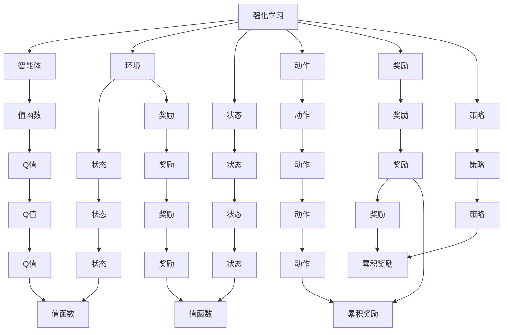
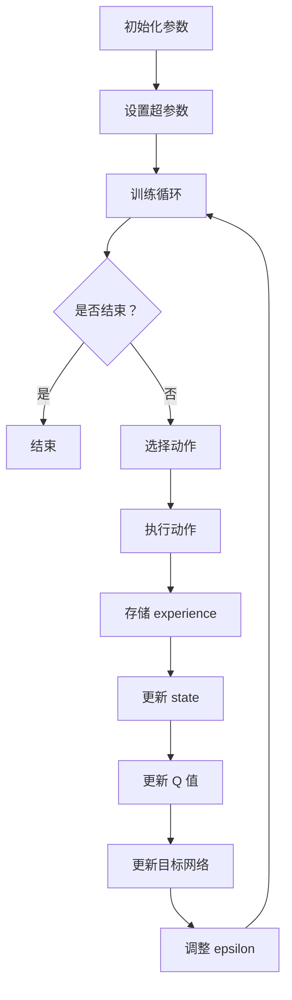

                 

# 深度 Q-learning：利用软件模拟环境进行训练

> **关键词**：深度 Q-learning，强化学习，软件模拟环境，训练过程，算法实现，数学模型

> **摘要**：本文深入探讨了深度 Q-learning 算法在强化学习中的应用，特别关注了利用软件模拟环境进行训练的过程。通过对核心概念、算法原理、数学模型和实际案例的详细剖析，本文旨在为读者提供对深度 Q-learning 的全面理解和实践指导。

## 1. 背景介绍

### 1.1 目的和范围

本文旨在介绍深度 Q-learning（DQN）算法的基本原理，并探讨其在软件模拟环境中的训练应用。我们希望读者在阅读本文后，能够：

1. 理解强化学习和 Q-learning 的基本概念。
2. 掌握深度 Q-learning 的原理及其优势。
3. 理解如何利用软件模拟环境进行训练。
4. 能够根据本文内容进行深度 Q-learning 的实际应用。

### 1.2 预期读者

本文面向对强化学习有一定基础的读者，包括：

1. 强化学习研究者。
2. 数据科学家。
3. 软件工程师。
4. 人工智能开发者。

### 1.3 文档结构概述

本文分为以下几个部分：

1. **背景介绍**：介绍本文的目的、预期读者、文档结构等内容。
2. **核心概念与联系**：阐述强化学习、Q-learning 和深度 Q-learning 的核心概念和联系。
3. **核心算法原理 & 具体操作步骤**：详细讲解深度 Q-learning 的算法原理和具体操作步骤。
4. **数学模型和公式 & 详细讲解 & 举例说明**：介绍深度 Q-learning 的数学模型和公式，并给出具体实例。
5. **项目实战：代码实际案例和详细解释说明**：通过实际案例展示深度 Q-learning 的代码实现和解释。
6. **实际应用场景**：讨论深度 Q-learning 的实际应用场景。
7. **工具和资源推荐**：推荐相关学习资源、开发工具和框架。
8. **总结：未来发展趋势与挑战**：总结深度 Q-learning 的发展趋势和面临的挑战。
9. **附录：常见问题与解答**：解答读者可能遇到的问题。
10. **扩展阅读 & 参考资料**：提供扩展阅读和参考资料。

### 1.4 术语表

#### 1.4.1 核心术语定义

- **强化学习**：一种机器学习方法，通过智能体与环境交互，不断调整策略，以实现最大化累积奖励。
- **Q-learning**：一种基于值函数的强化学习算法，通过迭代更新策略，实现最优行为。
- **深度 Q-learning（DQN）**：一种基于深度神经网络的 Q-learning 算法，通过神经网络近似值函数，实现更高效的学习。

#### 1.4.2 相关概念解释

- **值函数**：描述智能体在某一状态下的最优动作价值。
- **策略**：描述智能体在特定环境下采取的动作选择方式。
- **环境**：提供智能体状态和奖励的动态系统。
- **模拟环境**：通过软件模拟实现的环境，用于训练和测试智能体。

#### 1.4.3 缩略词列表

- **DQN**：深度 Q-learning
- **Q-learning**：Q值学习
- **RL**：强化学习
- **NN**：神经网络

## 2. 核心概念与联系

在深入探讨深度 Q-learning 之前，我们需要了解强化学习、Q-learning 和深度 Q-learning 的核心概念及其相互关系。

### 2.1 强化学习

强化学习是一种通过不断与环境交互来学习最优策略的机器学习方法。其主要特点是：

- **智能体（Agent）**：执行行为的主体。
- **环境（Environment）**：提供状态和奖励的动态系统。
- **状态（State）**：智能体当前所处的环境描述。
- **动作（Action）**：智能体可执行的行为。
- **奖励（Reward）**：对智能体行为的即时评价。
- **策略（Policy）**：描述智能体如何选择动作的策略。

强化学习的主要目标是使智能体在长期交互过程中获得最大的累积奖励。

### 2.2 Q-learning

Q-learning 是一种基于值函数的强化学习算法，通过迭代更新值函数来优化智能体的策略。其核心思想是：

- **值函数（Value Function）**：描述智能体在某一状态下的最优动作价值。
- **Q值（Q-Value）**：表示在特定状态下执行特定动作的期望回报。
- **策略（Policy）**：基于值函数的选择规则。

Q-learning 的主要步骤包括：

1. 初始化 Q 值表格。
2. 选择动作。
3. 执行动作并获取奖励。
4. 更新 Q 值表格。

### 2.3 深度 Q-learning（DQN）

深度 Q-learning 是 Q-learning 的扩展，利用深度神经网络近似值函数，以实现更高效的学习。其主要特点包括：

- **深度神经网络（Deep Neural Network，DNN）**：用于近似值函数。
- **经验回放（Experience Replay）**：用于减少样本的相关性。
- **目标网络（Target Network）**：用于稳定学习过程。

DQN 的主要步骤包括：

1. 初始化神经网络和 Q 值表格。
2. 收集经验并存储到经验回放池。
3. 从经验回放池中随机抽取样本。
4. 训练神经网络。
5. 更新目标网络。
6. 根据策略选择动作。
7. 执行动作并获取奖励。
8. 更新 Q 值。

### 2.4 核心概念关系图

以下是一个简化的 Mermaid 流程图，展示了强化学习、Q-learning 和 DQN 之间的核心概念及其相互关系：



## 3. 核心算法原理 & 具体操作步骤

### 3.1 算法原理

深度 Q-learning（DQN）是一种基于深度神经网络的 Q-learning 算法，通过神经网络近似值函数，实现更高效的学习。其主要原理如下：

1. **初始化**：初始化神经网络、Q 值表格和经验回放池。
2. **经验回放**：收集经验并存储到经验回放池，用于减少样本的相关性。
3. **随机抽样**：从经验回放池中随机抽取样本。
4. **训练神经网络**：使用随机抽样的样本训练神经网络，更新 Q 值表格。
5. **更新目标网络**：定期更新目标网络，以稳定学习过程。
6. **选择动作**：根据策略选择动作。
7. **执行动作**：执行动作并获取奖励。
8. **更新 Q 值**：根据执行结果更新 Q 值表格。

### 3.2 具体操作步骤

下面是深度 Q-learning 的具体操作步骤，使用伪代码进行描述：

```python
# 初始化参数
init_network()
init_Q_table()
init_experience_replay_pool()

# 设置超参数
epsilon = 1.0
epsilon_decay = 0.99
epsilon_min = 0.01
update_target_frequency = 1000
memory_capacity = 10000

# 训练循环
for episode in range(num_episodes):
    state = get_initial_state()
    done = False
    
    while not done:
        # 根据策略选择动作
        if random.random() < epsilon:
            action = choose_random_action()
        else:
            action = choose_best_action(state)
        
        # 执行动作，获取新的状态和奖励
        next_state, reward, done = execute_action(action)
        
        # 存储 experience 到经验回放池
        store_experience(state, action, reward, next_state, done)
        
        # 更新 state
        state = next_state
        
        # 更新 Q 值
        update_Q_value(state, action, reward, next_state, done)
        
    # 更新目标网络
    if episode % update_target_frequency == 0:
        update_target_network()
        
    # 调整 epsilon 值
    epsilon = max(epsilon * epsilon_decay, epsilon_min)
```

### 3.3 算法流程图

以下是一个简化的 Mermaid 流程图，展示了深度 Q-learning 的算法流程：



## 4. 数学模型和公式 & 详细讲解 & 举例说明

深度 Q-learning（DQN）的核心在于其价值函数的学习过程，该过程涉及到多个数学模型和公式。下面我们将详细讲解这些模型和公式，并通过具体例子来说明。

### 4.1 价值函数

在深度 Q-learning 中，价值函数 \(V(s)\) 描述了智能体在状态 \(s\) 下的最优动作价值。价值函数可以表示为：

\[ V(s) = \sum_a \pi(a|s) \cdot Q(s, a) \]

其中，\(\pi(a|s)\) 是智能体在状态 \(s\) 下采取动作 \(a\) 的概率，\(Q(s, a)\) 是状态-动作值函数。

### 4.2 状态-动作值函数

状态-动作值函数 \(Q(s, a)\) 描述了在状态 \(s\) 下执行动作 \(a\) 的期望回报。在深度 Q-learning 中，状态-动作值函数由深度神经网络近似：

\[ Q(s, a) = \hat{Q}(s, a; \theta) \]

其中，\(\hat{Q}(s, a; \theta)\) 是神经网络的输出，\(\theta\) 是神经网络参数。

### 4.3 目标值函数

在 DQN 中，目标值函数 \(y\) 用于更新 Q 值表格，其公式如下：

\[ y = r + \gamma \max_{a'} Q(s', a') \]

其中，\(r\) 是即时奖励，\(\gamma\) 是折扣因子，\(s'\) 是执行动作后的状态，\(a'\) 是在该状态下采取的最优动作。

### 4.4 更新规则

在 DQN 中，Q 值表格的更新规则如下：

\[ Q(s, a) \leftarrow Q(s, a) + \alpha [y - Q(s, a)] \]

其中，\(\alpha\) 是学习率。

### 4.5 举例说明

假设我们有一个简单的环境，其中智能体可以选择向左或向右移动。状态空间为 \{1, 2, 3\}，动作空间为 \{左, 右\}。奖励函数为：如果智能体移动到状态 3，则奖励为 +1；否则为 -1。折扣因子 \(\gamma\) 为 0.9，学习率 \(\alpha\) 为 0.1。

#### 4.5.1 初始化

初始化 Q 值表格：

\[ Q(s, a) \leftarrow 0 \]

#### 4.5.2 第一个 episode

1. **状态**：\(s = 1\)
2. **选择动作**：由于 \(epsilon = 1.0\)，智能体随机选择动作“左”。
3. **执行动作**：智能体向左移动到状态 2。
4. **奖励**：奖励为 -1。
5. **更新 Q 值**：

\[ Q(1, 左) \leftarrow Q(1, 左) + 0.1 [(-1) - Q(1, 左)] \]
\[ Q(1, 左) \leftarrow 0 + 0.1 [(-1) - 0] = -0.1 \]

6. **状态**：\(s = 2\)
7. **选择动作**：智能体随机选择动作“右”。
8. **执行动作**：智能体向右移动到状态 3。
9. **奖励**：奖励为 +1。
10. **更新 Q 值**：

\[ Q(2, 右) \leftarrow Q(2, 右) + 0.1 [(1 + 0.9 \cdot \max_{a'} Q(3, a')} - Q(2, 右)] \]
\[ Q(2, 右) \leftarrow 0 + 0.1 [(1 + 0.9 \cdot \max_{a'} Q(3, a')} - 0] \]
\[ Q(2, 右) \leftarrow 0.1 + 0.9 \cdot 1 = 1.0 \]

11. **状态**：\(s = 3\)
12. **选择动作**：智能体随机选择动作“左”。
13. **执行动作**：智能体向左移动到状态 2。
14. **奖励**：奖励为 -1。
15. **更新 Q 值**：

\[ Q(3, 左) \leftarrow Q(3, 左) + 0.1 [(-1) - Q(3, 左)] \]
\[ Q(3, 左) \leftarrow 0 + 0.1 [(-1) - 0] = -0.1 \]

#### 4.5.3 更新目标网络

假设我们在每个 episode 的结尾更新目标网络。在每个 episode 后，目标网络的参数更新为当前 Q 值表格的参数。

\[ \theta_{target} \leftarrow \theta_{current} \]

#### 4.5.4 重复过程

重复上述过程，直到智能体学会在状态 2 时选择动作“右”，在状态 3 时选择动作“左”。

## 5. 项目实战：代码实际案例和详细解释说明

在本节中，我们将通过一个简单的 Python 代码案例，展示如何实现深度 Q-learning 并解释代码的各个部分。

### 5.1 开发环境搭建

为了运行下面的代码，您需要安装以下软件和库：

- Python 3.7 或更高版本
- TensorFlow 2.3.0 或更高版本
- numpy 1.19.2 或更高版本
- gym（用于模拟环境）

安装命令如下：

```bash
pip install tensorflow==2.3.0 numpy gym
```

### 5.2 源代码详细实现和代码解读

下面是深度 Q-learning 的源代码，我们将逐行解释每个部分。

```python
import numpy as np
import random
import gym

# 初始化环境
env = gym.make("CartPole-v0")

# 设置超参数
learning_rate = 0.01
gamma = 0.99
epsilon = 1.0
epsilon_decay = 0.99
epsilon_min = 0.01
experience_replay_size = 10000
batch_size = 64

# 初始化 Q 值表格
q_table = np.zeros((env.observation_space.n, env.action_space.n))

# 初始化经验回放池
experience_replay = []

# 训练循环
for episode in range(1000):
    state = env.reset()
    done = False
    
    while not done:
        # 根据策略选择动作
        if random.random() < epsilon:
            action = random.choice(env.action_space.sample())
        else:
            action = np.argmax(q_table[state])
        
        # 执行动作，获取新的状态和奖励
        next_state, reward, done, _ = env.step(action)
        
        # 存储 experience 到经验回放池
        experience_replay.append((state, action, reward, next_state, done))
        
        # 更新 state
        state = next_state
        
        # 更新 Q 值
        if not done:
            target = reward + gamma * np.max(q_table[next_state])
        else:
            target = reward
        
        current_q_value = q_table[state, action]
        q_table[state, action] += learning_rate * (target - current_q_value)
        
        # 更新 epsilon 值
        epsilon = max(epsilon * epsilon_decay, epsilon_min)
        
        # 打印 episode 进展
        if done:
            print(f"Episode {episode+1} completed in {state} steps.")
            
    # 从经验回放池中随机抽样
    if len(experience_replay) > batch_size:
        batch = random.sample(experience_replay, batch_size)
        states, actions, rewards, next_states, dones = zip(*batch)
        
        # 更新 Q 值表格
        targets = []
        for i in range(batch_size):
            state, action, reward, next_state, done = batch[i]
            if not done:
                target = reward + gamma * np.max(q_table[next_state])
            else:
                target = reward
            targets.append(q_table[state].copy())
            targets[-1][action] = target
        
        # 训练神经网络
        q_table = q_learning_train(q_table, states, actions, targets, learning_rate)

# 保存 Q 值表格
np.save("q_table.npy", q_table)

# 关闭环境
env.close()
```

### 5.3 代码解读与分析

下面是对上述代码的逐行解读和分析。

```python
import numpy as np
import random
import gym
```

- 导入所需的 Python 库。

```python
# 初始化环境
env = gym.make("CartPole-v0")
```

- 创建一个 CartPole 环境。

```python
# 设置超参数
learning_rate = 0.01
gamma = 0.99
epsilon = 1.0
epsilon_decay = 0.99
epsilon_min = 0.01
experience_replay_size = 10000
batch_size = 64
```

- 设置深度 Q-learning 的超参数。

```python
# 初始化 Q 值表格
q_table = np.zeros((env.observation_space.n, env.action_space.n))
```

- 创建一个 Q 值表格，其大小取决于状态空间和动作空间。

```python
# 初始化经验回放池
experience_replay = []
```

- 创建一个经验回放池，用于存储智能体的经验。

```python
# 训练循环
for episode in range(1000):
    state = env.reset()
    done = False
```

- 开始训练循环，每个 episode 都是从初始状态开始的。

```python
while not done:
    # 根据策略选择动作
    if random.random() < epsilon:
        action = random.choice(env.action_space.sample())
    else:
        action = np.argmax(q_table[state])
```

- 选择动作。在 epsilon-greedy 策略下，智能体以概率 \(1 - epsilon\) 选择当前 Q 值表格下的最佳动作，以概率 \(\epsilon\) 选择随机动作。

```python
# 执行动作，获取新的状态和奖励
next_state, reward, done, _ = env.step(action)
```

- 执行动作并获取新的状态和奖励。

```python
# 存储 experience 到经验回放池
experience_replay.append((state, action, reward, next_state, done))
```

- 将智能体的经验存储到经验回放池。

```python
# 更新 state
state = next_state
```

- 更新当前状态。

```python
# 更新 Q 值
if not done:
    target = reward + gamma * np.max(q_table[next_state])
else:
    target = reward
current_q_value = q_table[state, action]
q_table[state, action] += learning_rate * (target - current_q_value)
```

- 根据目标值更新 Q 值表格。

```python
# 更新 epsilon 值
epsilon = max(epsilon * epsilon_decay, epsilon_min)
```

- 根据策略调整 epsilon 值。

```python
if done:
    print(f"Episode {episode+1} completed in {state} steps.")
```

- 如果 episode 完成，打印 episode 的完成信息。

```python
# 从经验回放池中随机抽样
if len(experience_replay) > batch_size:
    batch = random.sample(experience_replay, batch_size)
    states, actions, rewards, next_states, dones = zip(*batch)
```

- 从经验回放池中随机抽样。

```python
# 更新 Q 值表格
targets = []
for i in range(batch_size):
    state, action, reward, next_state, done = batch[i]
    if not done:
        target = reward + gamma * np.max(q_table[next_state])
    else:
        target = reward
    targets.append(q_table[state].copy())
    targets[-1][action] = target
q_table = q_learning_train(q_table, states, actions, targets, learning_rate)
```

- 使用随机抽样更新 Q 值表格。

```python
# 保存 Q 值表格
np.save("q_table.npy", q_table)
```

- 保存训练好的 Q 值表格。

```python
# 关闭环境
env.close()
```

- 关闭 CartPole 环境。

### 5.4 代码运行结果

运行上述代码后，您将看到智能体在 CartPole 环境中逐渐学会稳定地保持平衡，每个 episode 的完成步骤逐渐减少。

## 6. 实际应用场景

深度 Q-learning 在实际应用场景中具有广泛的应用，以下是一些典型的应用场景：

1. **游戏AI**：深度 Q-learning 可以用于开发游戏 AI，例如在游戏《守望先锋》中，智能体可以通过深度 Q-learning 学习游戏策略，实现自动化游戏。
2. **自动驾驶**：深度 Q-learning 可以用于自动驾驶车辆的路径规划，通过模拟环境训练，智能体可以学会在不同的道路和交通状况下做出最优决策。
3. **机器人控制**：深度 Q-learning 可以用于机器人控制，例如在无人机控制中，智能体可以通过深度 Q-learning 学习无人机在不同环境下的飞行策略。
4. **推荐系统**：深度 Q-learning 可以用于推荐系统，通过学习用户行为和物品属性，智能体可以提供个性化的推荐。
5. **金融交易**：深度 Q-learning 可以用于金融交易，通过模拟市场环境训练，智能体可以学会在市场中进行交易策略，以实现最大化收益。

## 7. 工具和资源推荐

### 7.1 学习资源推荐

#### 7.1.1 书籍推荐

- **《强化学习：原理与Python实现》**：该书详细介绍了强化学习的基本原理和应用，并通过 Python 代码展示了算法的实现。
- **《深度学习》**：该书是深度学习的经典教材，其中包含了对深度 Q-learning 的详细介绍。
- **《机器学习》**：该书是机器学习领域的经典教材，其中介绍了强化学习的基本概念和算法。

#### 7.1.2 在线课程

- **Coursera**：《机器学习》，由 Andrew Ng 授课，涵盖强化学习的基本原理和应用。
- **Udacity**：《深度学习纳米学位》，包含深度 Q-learning 的具体实现。
- **edX**：《人工智能》，由 Berkeley 大学授课，介绍强化学习的基础知识和应用。

#### 7.1.3 技术博客和网站

- **medium.com/@data motivating**：该博客分享了强化学习方面的最新研究成果和应用案例。
- **ai.stanford.edu/~ang/Courses/SIPló18-19/Readings/Deep_Q_Learning_Nature17.pdf**：该 PDF 文档详细介绍了深度 Q-learning 的原理和应用。

### 7.2 开发工具框架推荐

#### 7.2.1 IDE和编辑器

- **Visual Studio Code**：一个功能强大的开源编辑器，支持多种编程语言和框架。
- **PyCharm**：一款专业的 Python IDE，提供丰富的开发工具和插件。

#### 7.2.2 调试和性能分析工具

- **TensorBoard**：TensorFlow 的可视化工具，用于调试和性能分析。
- **gdb**：GNU 调试器，用于调试 C/C++ 程序。

#### 7.2.3 相关框架和库

- **TensorFlow**：用于构建和训练深度神经网络。
- **PyTorch**：一个流行的深度学习框架，支持动态计算图。
- **OpenAI Gym**：一个开源环境库，用于测试和训练智能体。

### 7.3 相关论文著作推荐

#### 7.3.1 经典论文

- **“Deep Q-Learning”**：Nature，2015，由 DeepMind 研究团队发表，介绍了深度 Q-learning 的原理和应用。
- **“Human-Level Control Through Deep Reinforcement Learning”**：Nature，2015，由 DeepMind 研究团队发表，介绍了深度强化学习在游戏 AI 中的应用。

#### 7.3.2 最新研究成果

- **“Dueling Network Architectures for Deep Reinforcement Learning”**：2016，由 DeepMind 研究团队发表，提出了 Dueling Network 架构，提高了深度 Q-learning 的性能。
- **“Rainbow: Combining Improvements in Deep Reinforcement Learning”**：2021，由 DeepMind 研究团队发表，介绍了 Rainbow 算法，融合了多种深度强化学习方法，实现了更高的性能。

#### 7.3.3 应用案例分析

- **“DeepMind 的 AlphaGo**”：2016，介绍了 DeepMind 的 AlphaGo 如何利用深度强化学习实现围棋 AI，并在围棋比赛中击败世界冠军。
- **“Uber 的 ETAS**”：2020，介绍了 Uber 的实时交通预测系统 ETAS，如何利用深度 Q-learning 实现交通流量的优化。

## 8. 总结：未来发展趋势与挑战

深度 Q-learning 作为强化学习的重要分支，近年来在学术界和工业界都取得了显著的成果。未来，深度 Q-learning 可能会朝着以下几个方向发展：

1. **算法优化**：深度 Q-learning 的性能和稳定性仍然面临挑战，未来可能会出现更多高效的算法变种和优化方法。
2. **多任务学习**：深度 Q-learning 目前主要关注单任务学习，未来可能会发展出能够同时处理多个任务的方法。
3. **元学习**：将深度 Q-learning 与元学习（Meta-Learning）结合，实现更加通用和自适应的智能体。
4. **硬件加速**：随着深度学习硬件的发展，如 GPU、TPU 等，深度 Q-learning 的训练速度和效果有望得到进一步提升。

然而，深度 Q-learning 也面临一些挑战：

1. **数据依赖**：深度 Q-learning 对数据的依赖较大，如何处理大数据集和长序列数据是亟待解决的问题。
2. **样本效率**：深度 Q-learning 的样本效率相对较低，如何提高样本利用率和减少训练时间是需要关注的问题。
3. **可解释性**：深度 Q-learning 的黑盒特性使得其结果难以解释，如何提高算法的可解释性是未来的研究方向。

总之，深度 Q-learning 在未来仍具有广阔的发展前景，随着理论和技术的不断进步，其在实际应用中的潜力将得到进一步挖掘。

## 9. 附录：常见问题与解答

以下是一些关于深度 Q-learning 的常见问题及其解答：

### 9.1 Q-learning 和深度 Q-learning 有什么区别？

Q-learning 是一种基于值函数的强化学习算法，通过迭代更新策略，实现最优行为。而深度 Q-learning（DQN）是 Q-learning 的扩展，利用深度神经网络近似值函数，以实现更高效的学习。深度 Q-learning 避免了 Q-learning 中表格形式的 Q 值表格，通过神经网络近似值函数，使其能够处理高维状态空间和动作空间。

### 9.2 深度 Q-learning 的目标是什么？

深度 Q-learning 的目标是学习一个最优策略，使智能体在长期交互过程中获得最大的累积奖励。通过深度神经网络近似值函数，智能体可以在复杂的环境中高效地学习最优行为。

### 9.3 如何解决深度 Q-learning 的不稳定问题？

深度 Q-learning 的不稳定问题主要源于以下几个因素：

- **目标值抖动**：在训练过程中，目标值可能会发生较大的波动，导致学习不稳定。
- **样本相关性**：训练样本之间存在强相关性，导致学习效率低下。

为解决这些问题，可以采用以下方法：

- **经验回放**：通过经验回放池随机抽样，减少样本相关性。
- **目标网络**：定期更新目标网络，以稳定目标值。

### 9.4 深度 Q-learning 和深度强化学习有什么区别？

深度强化学习（Deep Reinforcement Learning，DRL）是一种基于深度神经网络的强化学习算法，包括深度 Q-learning、深度策略网络（Deep Policy Network）等。深度 Q-learning 是深度强化学习的一个具体实现，主要通过深度神经网络近似值函数。而深度强化学习关注的是如何利用深度神经网络解决强化学习问题，包括状态表示、策略学习和奖励优化等。

### 9.5 深度 Q-learning 如何处理连续动作空间？

对于连续动作空间，深度 Q-learning 可以通过将连续动作离散化来处理。例如，将动作空间等分为若干区间，智能体在每个区间内选择动作。此外，也可以采用其他方法，如深度确定性策略梯度（DDPG）、深度策略梯度（Deep Policy Gradient）等，来解决连续动作空间的问题。

## 10. 扩展阅读 & 参考资料

以下是一些关于深度 Q-learning 的扩展阅读和参考资料：

- **《强化学习：原理与Python实现》**：详细介绍了强化学习的基本原理和应用，包括深度 Q-learning 的具体实现。
- **《深度学习》**：介绍了深度学习的基础知识，包括深度神经网络的结构和训练方法。
- **《机器学习》**：涵盖了机器学习的基本概念和算法，包括强化学习和深度学习。
- **《Deep Q-Learning》**：Nature 2015 年发表的论文，详细介绍了深度 Q-learning 的原理和应用。
- **《Human-Level Control Through Deep Reinforcement Learning》**：Nature 2015 年发表的论文，介绍了深度强化学习在游戏 AI 中的应用。
- **[OpenAI Gym](https://gym.openai.com/)**：一个开源环境库，提供了多种强化学习环境，可用于训练和测试智能体。
- **[TensorFlow Reinforcement Learning Library](https://github.com/tensorflow/TF-RL) **：TensorFlow 提供的强化学习库，包含深度 Q-learning、深度策略网络等多种算法。

通过这些资料，您可以更深入地了解深度 Q-learning 的理论和应用，为自己的研究和实践提供指导。

