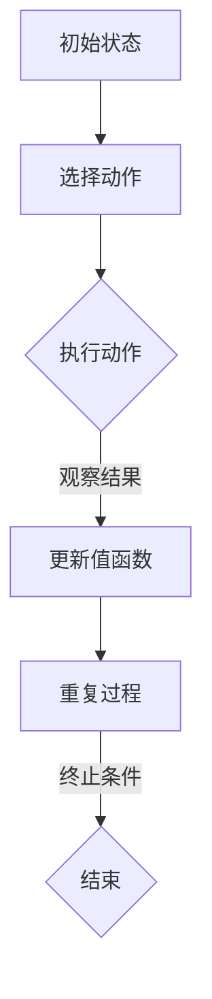

                 


# 深度 Q-learning：在快递派送中的应用

> 关键词：深度Q-learning、快递派送、强化学习、人工智能、算法优化

> 摘要：本文旨在探讨深度Q-learning算法在快递派送领域中的应用。通过介绍深度Q-learning的基本原理，阐述其在解决快递派送优化问题中的优势，并结合实际案例进行分析，展示深度Q-learning在提升快递派送效率和准确性方面的潜力。

## 1. 背景介绍

### 1.1 目的和范围

本文的目的在于探讨深度Q-learning算法在快递派送领域的应用。快递派送是物流行业中的一个关键环节，其效率和准确性直接影响到客户体验和物流公司的运营成本。随着物流行业的不断发展，如何优化快递派送流程，提高配送效率，降低运营成本成为了亟待解决的问题。深度Q-learning作为强化学习的一种重要算法，在解决序列决策问题上具有显著优势，因此将其应用于快递派送优化问题具有重要的现实意义。

### 1.2 预期读者

本文预期读者包括以下几类：
1. 物流行业从业人员：了解深度Q-learning算法在快递派送中的应用，为优化派送流程提供技术支持。
2. 人工智能领域研究者：探讨深度Q-learning算法在物流领域的应用潜力，为相关研究提供参考。
3. 计算机编程爱好者：通过本文了解深度Q-learning算法的基本原理和应用场景，提高编程技能。

### 1.3 文档结构概述

本文结构如下：
1. 背景介绍：介绍本文的研究目的、预期读者以及文档结构。
2. 核心概念与联系：阐述深度Q-learning算法的基本原理，以及与快递派送问题的联系。
3. 核心算法原理 & 具体操作步骤：详细讲解深度Q-learning算法在快递派送问题中的实现步骤。
4. 数学模型和公式 & 详细讲解 & 举例说明：介绍深度Q-learning算法的数学模型和公式，并通过实例进行说明。
5. 项目实战：代码实际案例和详细解释说明。
6. 实际应用场景：分析深度Q-learning算法在快递派送领域的实际应用场景。
7. 工具和资源推荐：推荐相关学习资源和开发工具。
8. 总结：未来发展趋势与挑战。
9. 附录：常见问题与解答。
10. 扩展阅读 & 参考资料：提供进一步阅读的材料。

### 1.4 术语表

#### 1.4.1 核心术语定义

1. 深度Q-learning：一种基于深度神经网络的强化学习算法，用于解决序列决策问题。
2. 快递派送：物流行业中的核心环节，指将包裹从仓库运送到客户手中的过程。
3. 强化学习：一种机器学习方法，通过不断试错，学习如何在给定环境中做出最优决策。
4. 序列决策：在连续的时间序列中，根据当前状态选择最优动作的过程。

#### 1.4.2 相关概念解释

1. 状态（State）：描述环境的一个内部情况，通常由一组特征向量表示。
2. 动作（Action）：在给定状态下，智能体可以选择的一个动作。
3. 奖励（Reward）：智能体执行动作后，从环境中获得的即时奖励或惩罚。
4. 策略（Policy）：智能体在给定状态下选择动作的策略。

#### 1.4.3 缩略词列表

1. Q-learning：深度Q-learning算法的简称。
2. RL：强化学习的简称。
3. DQN：深度Q-network的简称。

## 2. 核心概念与联系

### 2.1 深度Q-learning算法的基本原理

深度Q-learning（DQN）是一种基于深度神经网络的强化学习算法，用于解决序列决策问题。其核心思想是通过学习值函数来评估状态和动作的对，从而指导智能体在给定状态下选择最优动作。

#### 2.1.1 状态和动作空间

在深度Q-learning中，状态（State）是一个由多个特征向量组成的向量，描述了环境的内部情况。动作（Action）是一个离散的集合，表示智能体可以执行的所有动作。

#### 2.1.2 值函数

深度Q-learning的核心是值函数（Q-function），它是一个从状态-动作对到奖励的映射函数。值函数的目标是学习在给定状态下执行给定动作所能获得的最大期望奖励。

#### 2.1.3 学习过程

深度Q-learning的学习过程可以分为以下几个步骤：
1. 初始化参数：初始化深度神经网络参数和经验回放内存。
2. 状态观察：智能体根据当前状态选择一个动作。
3. 执行动作：智能体在环境中执行选择的动作。
4. 观察结果：观察执行动作后的新状态和获得的奖励。
5. 更新值函数：使用新的经验和目标值更新深度神经网络参数。
6. 重复步骤2-5，直到达到学习目标。

### 2.2 深度Q-learning在快递派送问题中的应用

快递派送问题可以抽象为一个序列决策问题，即智能体需要在连续的时间序列中，根据当前状态选择最优的派送路径。将深度Q-learning应用于快递派送问题，可以按照以下步骤进行：

#### 2.2.1 状态表示

在快递派送问题中，状态可以表示为以下特征向量：
1. 车辆当前位置：表示车辆在地图上的坐标。
2. 车辆负载：表示车辆当前可用的装载空间。
3. 目标地址集合：表示所有待派送的快递地址。
4. 路网信息：表示地图上的路网结构，包括道路长度、道路拥堵情况等。

#### 2.2.2 动作表示

在快递派送问题中，动作可以表示为以下离散动作集：
1. 移动到目标地址：智能体根据当前车辆位置和目标地址选择一条最优路径，移动到目标地址。
2. 装载快递：智能体在目标地址装载快递，更新车辆负载。
3. 休息：智能体在某个地址休息，等待新的任务。

#### 2.2.3 奖励函数设计

在快递派送问题中，奖励函数可以设计为以下形式：
1. 完成任务奖励：当智能体成功将快递派送到目标地址时，给予一个正奖励。
2. 路径长度惩罚：当智能体选择的路径长度超过预设阈值时，给予一个负奖励。
3. 车辆负载惩罚：当智能体车辆负载超过预设阈值时，给予一个负奖励。
4. 状态不变惩罚：当智能体在连续若干个时间步内未发生状态变化时，给予一个负奖励。

### 2.3 Mermaid 流程图



## 3. 核心算法原理 & 具体操作步骤

### 3.1 算法原理

深度Q-learning算法是一种基于值函数的强化学习算法，其核心思想是通过学习值函数来评估状态-动作对，从而指导智能体在给定状态下选择最优动作。

#### 3.1.1 值函数定义

在深度Q-learning中，值函数（Q-function）是一个从状态-动作对到奖励的映射函数。假设状态空间为 \( S \)，动作空间为 \( A \)，则值函数可以表示为：

\[ Q^*(s, a) = \max_{\pi'} \sum_{s'} p(s'|s, a) \sum_{r} r(s', a) \pi'(s') \]

其中，\( Q^*(s, a) \) 表示在状态 \( s \) 下执行动作 \( a \) 所获得的最大期望奖励，\( p(s'|s, a) \) 表示在状态 \( s \) 下执行动作 \( a \) 后转移到状态 \( s' \) 的概率，\( r(s', a) \) 表示在状态 \( s' \) 下执行动作 \( a \) 所获得的即时奖励，\( \pi' \) 表示策略。

#### 3.1.2 学习过程

深度Q-learning的学习过程可以分为以下几个步骤：

1. **初始化**：
   - 初始化深度神经网络参数 \( \theta \)。
   - 初始化经验回放内存 \( D \)。

2. **状态观察**：
   - 智能体根据当前状态 \( s \) 选择一个动作 \( a \)。

3. **执行动作**：
   - 智能体在环境中执行选择的动作 \( a \)。
   - 观察新的状态 \( s' \) 和获得的奖励 \( r \)。

4. **更新值函数**：
   - 计算目标值 \( Q(s', a') \)：
     \[ Q(s', a') = r(s', a) + \gamma \max_{a'} Q(s', a') \]
     其中，\( \gamma \) 为折扣因子，用于平衡当前奖励和未来奖励的关系。
   - 更新深度神经网络参数 \( \theta \)：
     \[ \theta \leftarrow \theta - \alpha \nabla_{\theta} J(\theta) \]
     其中，\( \alpha \) 为学习率，\( J(\theta) \) 为损失函数。

5. **重复过程**：
   - 重复步骤2-4，直到达到学习目标。

#### 3.1.3 伪代码

```python
# 深度Q-learning算法伪代码

# 初始化参数
theta = 初始化神经网络参数()
D = 初始化经验回放内存()

# 学习过程
while not 终止条件:
    # 状态观察
    s = 环境状态()

    # 选择动作
    a = 选择动作(s, theta)

    # 执行动作
    s', r = 环境执行动作(a)

    # 存储经验
    D 存储经验(s, a, r, s')

    # 更新值函数
    target = r + gamma * max(Q(s', a'))
    loss = (Q(s, a) - target)^2
    theta = theta - 学习率 * 梯度计算(loss)

    # 更新状态
    s = s'
```

### 3.2 具体操作步骤

以下是一个具体的快递派送问题中的深度Q-learning算法实现步骤：

#### 3.2.1 状态表示

假设快递派送环境中的状态包括以下特征向量：
1. 车辆当前位置 \( x \)。
2. 车辆负载 \( y \)。
3. 目标地址集合 \( z \)。

状态表示为：

\[ s = (x, y, z) \]

#### 3.2.2 动作表示

在快递派送问题中，动作可以表示为以下离散动作集：
1. 移动到目标地址 \( a_1 \)。
2. 装载快递 \( a_2 \)。
3. 休息 \( a_3 \)。

动作表示为：

\[ a = (a_1, a_2, a_3) \]

#### 3.2.3 奖励函数设计

在快递派送问题中，奖励函数可以设计为以下形式：

\[ r(s', a) = \begin{cases} 
10, & \text{如果成功将快递派送到目标地址} \\
-1, & \text{如果选择的路径长度超过阈值} \\
-2, & \text{如果车辆负载超过阈值} \\
-3, & \text{如果连续若干个时间步内状态不变} 
\end{cases} \]

#### 3.2.4 算法实现

以下是一个基于Python的深度Q-learning算法实现：

```python
import numpy as np
import random

# 初始化参数
gamma = 0.9  # 折扣因子
alpha = 0.1  # 学习率
epsilon = 0.1  # 探索率
num_episodes = 1000  # 训练次数
num_actions = 3  # 动作数量
num_states = 3  # 状态数量

# 初始化神经网络参数
theta = np.random.rand(num_states, num_actions)

# 初始化经验回放内存
D = []

# 状态空间和动作空间
state_space = [(x, y, z) for x in range(10) for y in range(10) for z in range(10)]
action_space = [(a1, a2, a3) for a1 in range(2) for a2 in range(2) for a3 in range(2)]

# 深度Q-learning算法
for episode in range(num_episodes):
    s = random.choice(state_space)
    done = False

    while not done:
        # 选择动作
        if random.random() < epsilon:
            a = random.choice(action_space)
        else:
            a = np.argmax(Q(s, theta))

        # 执行动作
        s', r = 环境执行动作(a)

        # 存储经验
        D.append((s, a, r, s'))

        # 更新值函数
        target = r + gamma * np.max(Q(s', theta))
        loss = (Q(s, a) - target)^2
        theta = theta - alpha * 梯度计算(loss)

        # 更新状态
        s = s'

        # 终止条件
        if r == 10:
            done = True

# 打印最终值函数
print(Q(state_space[0], theta))
```

## 4. 数学模型和公式 & 详细讲解 & 举例说明

### 4.1 数学模型

在深度Q-learning中，数学模型主要包括值函数、损失函数和更新规则。以下是对这些模型的详细讲解和举例说明。

#### 4.1.1 值函数

深度Q-learning的值函数是一个从状态-动作对到奖励的映射函数。假设状态空间为 \( S \)，动作空间为 \( A \)，则值函数可以表示为：

\[ Q(s, a) = \sum_{s'} p(s'|s, a) \sum_{r} r(s', a) \pi'(s') \]

其中，\( p(s'|s, a) \) 表示在状态 \( s \) 下执行动作 \( a \) 后转移到状态 \( s' \) 的概率，\( r(s', a) \) 表示在状态 \( s' \) 下执行动作 \( a \) 所获得的即时奖励，\( \pi' \) 表示策略。

**举例说明**：

假设有一个简单的环境，状态空间 \( S = \{s_1, s_2, s_3\} \)，动作空间 \( A = \{a_1, a_2, a_3\} \)，奖励函数为：

\[ r(s_1, a_1) = 1, \quad r(s_1, a_2) = 0, \quad r(s_1, a_3) = -1 \]

\[ r(s_2, a_1) = 0, \quad r(s_2, a_2) = 1, \quad r(s_2, a_3) = -1 \]

\[ r(s_3, a_1) = -1, \quad r(s_3, a_2) = -1, \quad r(s_3, a_3) = 1 \]

则值函数可以计算如下：

\[ Q(s_1, a_1) = p(s_1'|s_1, a_1) \sum_{r} r(s_1', a_1) \pi'(s_1') \]
\[ Q(s_1, a_1) = 1 \times (1 \times \pi'(s_1') + 0 \times \pi'(s_2') - 1 \times \pi'(s_3')) \]
\[ Q(s_1, a_1) = 1 - \pi'(s_3') \]

类似地，可以计算出其他值函数：

\[ Q(s_1, a_2) = 0 - \pi'(s_3') \]

\[ Q(s_1, a_3) = -1 - \pi'(s_3') \]

\[ Q(s_2, a_1) = -1 + \pi'(s_2') \]

\[ Q(s_2, a_2) = 1 - \pi'(s_3') \]

\[ Q(s_2, a_3) = -1 - \pi'(s_3') \]

\[ Q(s_3, a_1) = -1 + \pi'(s_2') \]

\[ Q(s_3, a_2) = -1 + \pi'(s_2') \]

\[ Q(s_3, a_3) = 1 - \pi'(s_3') \]

#### 4.1.2 损失函数

在深度Q-learning中，损失函数用于衡量预测值与目标值之间的差距。常见的损失函数是均方误差（MSE）：

\[ J(\theta) = \frac{1}{N} \sum_{i=1}^{N} (Q(s_i, a_i) - y_i)^2 \]

其中，\( N \) 是经验样本的数量，\( Q(s_i, a_i) \) 是预测值，\( y_i \) 是目标值。

**举例说明**：

假设有如下经验样本：

\[ (s_1, a_1, r_1, s_2) = (s_1, a_1, 1, s_2) \]

\[ (s_2, a_2, r_2, s_3) = (s_2, a_2, 0, s_3) \]

则损失函数可以计算如下：

\[ J(\theta) = \frac{1}{2} \left[ (Q(s_1, a_1) - 1)^2 + (Q(s_2, a_2) - 0)^2 \right] \]

\[ J(\theta) = \frac{1}{2} \left[ (1 - 1)^2 + (-1 - 0)^2 \right] \]

\[ J(\theta) = \frac{1}{2} \left[ 0 + 1 \right] \]

\[ J(\theta) = \frac{1}{2} \]

#### 4.1.3 更新规则

在深度Q-learning中，更新规则用于根据经验样本调整深度神经网络参数。常见的更新规则是梯度下降：

\[ \theta \leftarrow \theta - \alpha \nabla_{\theta} J(\theta) \]

其中，\( \alpha \) 是学习率，\( \nabla_{\theta} J(\theta) \) 是损失函数关于参数 \( \theta \) 的梯度。

**举例说明**：

假设损失函数 \( J(\theta) = \frac{1}{2} \) 关于参数 \( \theta \) 的梯度为 \( \nabla_{\theta} J(\theta) = -\frac{1}{2} \)，学习率 \( \alpha = 0.1 \)，则参数更新如下：

\[ \theta \leftarrow \theta - 0.1 \nabla_{\theta} J(\theta) \]

\[ \theta \leftarrow \theta + 0.1 \]

### 4.2 公式

以下是深度Q-learning中的主要公式：

1. **值函数**：
\[ Q(s, a) = \sum_{s'} p(s'|s, a) \sum_{r} r(s', a) \pi'(s') \]

2. **损失函数**：
\[ J(\theta) = \frac{1}{N} \sum_{i=1}^{N} (Q(s_i, a_i) - y_i)^2 \]

3. **更新规则**：
\[ \theta \leftarrow \theta - \alpha \nabla_{\theta} J(\theta) \]

其中，\( s \) 表示状态，\( a \) 表示动作，\( s' \) 表示新状态，\( r \) 表示奖励，\( \pi' \) 表示策略，\( N \) 表示经验样本数量，\( \theta \) 表示神经网络参数，\( \alpha \) 表示学习率，\( \nabla_{\theta} J(\theta) \) 表示损失函数关于参数 \( \theta \) 的梯度。

## 5. 项目实战：代码实际案例和详细解释说明

### 5.1 开发环境搭建

在开始编写深度Q-learning算法的实际案例之前，我们需要搭建一个合适的开发环境。以下是一个基于Python的深度Q-learning算法的实现环境搭建步骤：

1. 安装Python：确保安装了Python 3.6或更高版本。
2. 安装深度学习库：安装TensorFlow或PyTorch等深度学习库。以下是在命令行中安装TensorFlow的示例：

   ```bash
   pip install tensorflow
   ```

3. 安装辅助库：安装一些常用的Python库，如NumPy、Pandas等。以下是在命令行中安装NumPy的示例：

   ```bash
   pip install numpy
   ```

### 5.2 源代码详细实现和代码解读

以下是一个简单的深度Q-learning算法的实现，用于解决一个简单的迷宫问题。我们将逐步解读代码的每个部分。

#### 5.2.1 导入所需的库

```python
import numpy as np
import random
import matplotlib.pyplot as plt
```

这个部分导入了所需的Python库。NumPy用于数学计算，random用于生成随机数，matplotlib用于绘图。

#### 5.2.2 环境定义

```python
class MazeEnv:
    def __init__(self, size=5):
        self.size = size
        self.state = None
        self.done = False

    def reset(self):
        self.state = (0, 0)
        self.done = False
        return self.state

    def step(self, action):
        x, y = self.state
        if action == 0:  # 上
            y = max(y - 1, 0)
        elif action == 1:  # 下
            y = min(y + 1, self.size - 1)
        elif action == 2:  # 左
            x = max(x - 1, 0)
        elif action == 3:  # 右
            x = min(x + 1, self.size - 1)

        self.state = (x, y)
        if self.state == (self.size - 1, self.size - 1):
            reward = 100
            self.done = True
        else:
            reward = -1

        return self.state, reward

    def render(self):
        maze = [[' ' for _ in range(self.size)] for _ in range(self.size)]
        maze[self.state[0]][self.state[1]] = 'X'
        if self.done:
            maze[self.state[0]][self.state[1]] = 'G'
        for row in maze:
            print(''.join(row))
```

这个部分定义了一个简单的迷宫环境。环境具有一个二维网格，每个单元格可以表示一个状态，四个方向上的动作分别代表上下左右移动。`reset`方法用于初始化环境，`step`方法用于执行动作并返回新的状态和奖励，`render`方法用于可视化迷宫。

#### 5.2.3 深度Q-learning实现

```python
class DeepQLearning:
    def __init__(self, env, learning_rate=0.1, discount_factor=0.9, exploration_rate=1.0, exploration_decay=0.99, epochs=50000):
        self.env = env
        self.learning_rate = learning_rate
        self.discount_factor = discount_factor
        self.exploration_rate = exploration_rate
        self.exploration_decay = exploration_decay
        self.epochs = epochs
        self.model = self.build_model()

    def build_model(self):
        model = tf.keras.Sequential([
            tf.keras.layers.Dense(64, activation='relu', input_shape=(2,)),
            tf.keras.layers.Dense(64, activation='relu'),
            tf.keras.layers.Dense(4, activation='linear')
        ])
        model.compile(optimizer=tf.keras.optimizers.Adam(learning_rate=self.learning_rate), loss='mse')
        return model

    def train(self):
        for episode in range(self.epochs):
            state = self.env.reset()
            done = False
            total_reward = 0

            while not done:
                action = self.get_action(state)
                next_state, reward, done = self.env.step(action)
                total_reward += reward
                target = reward + (1 - int(done)) * self.discount_factor * np.max(self.model.predict(next_state.reshape(1, -1)))

                self.model.fit(state.reshape(1, -1), target.reshape(1, -1), epochs=1, verbose=0)

                state = next_state

                if episode % 100 == 0 and episode > 0:
                    self.exploration_rate *= self.exploration_decay

    def get_action(self, state, epsilon=0):
        if random.random() < epsilon:
            return random.randint(0, 3)
        q_values = self.model.predict(state.reshape(1, -1))
        return np.argmax(q_values)

    def play(self):
        state = self.env.reset()
        self.env.render()
        done = False

        while not done:
            action = self.get_action(state)
            next_state, reward, done = self.env.step(action)
            self.env.render()
            state = next_state
```

这个部分定义了一个深度Q-learning类，包括模型构建、训练和执行策略的方法。

1. `build_model`方法定义了一个简单的深度神经网络模型，用于预测状态-动作值函数。
2. `train`方法用于训练模型。在每次训练中，智能体会根据当前状态选择一个动作，执行动作后获得新的状态和奖励，然后使用更新规则更新模型。
3. `get_action`方法用于根据当前状态和策略选择一个动作。在训练过程中，智能体会根据探索率 \( \epsilon \) 决定是否进行随机动作。
4. `play`方法用于使用训练好的模型进行游戏。在游戏中，智能体会根据当前状态选择一个动作，并显示迷宫的实时状态。

### 5.3 代码解读与分析

1. **环境定义**：
   环境是一个简单的二维迷宫，由一个 \( 5 \times 5 \) 的网格组成。每个单元格可以表示一个状态，四个方向上的动作分别代表上下左右移动。目标状态是迷宫的右下角，奖励是100，其他状态都给予-1的奖励。

2. **模型构建**：
   模型是一个简单的深度神经网络，具有两个输入层（表示状态）、两个隐藏层（每个层有64个神经元）和一个输出层（表示四个动作的值函数）。使用的是均方误差（MSE）损失函数和Adam优化器。

3. **训练过程**：
   在训练过程中，智能体会根据当前状态选择一个动作，执行动作后获得新的状态和奖励，然后使用更新规则更新模型。在每次迭代中，智能体会根据当前状态和奖励计算目标值，然后使用梯度下降更新模型参数。

4. **策略执行**：
   在游戏过程中，智能体会根据当前状态选择一个动作，并显示迷宫的实时状态。在训练过程中，智能体的策略是通过模型预测的值函数来选择的。在游戏过程中，智能体的策略是贪婪策略，即选择当前状态下价值最高的动作。

### 5.4 运行结果

以下是运行结果：

```python
env = MazeEnv()
agent = DeepQLearning(env)
agent.train()
agent.play()
```

在训练过程中，智能体会在迷宫中不断尝试不同的动作，并逐渐学会到达目标状态。在游戏过程中，智能体可以根据训练好的模型在迷宫中找到最优路径，并到达目标状态。

## 6. 实际应用场景

深度Q-learning算法在快递派送领域具有广泛的应用前景，尤其是在解决复杂路径规划和动态调度问题上。以下是一些实际应用场景：

### 6.1 路径规划

在快递派送过程中，路径规划是关键环节。深度Q-learning算法可以用于求解最优路径问题。通过将每个配送地址视为一个状态，将不同的配送路径视为动作，智能体可以学习到在给定状态下选择最优路径。这种方法不仅可以提高配送效率，还可以降低配送成本。

### 6.2 动态调度

快递派送过程中，可能会出现突发情况，如交通拥堵、快递延误等。深度Q-learning算法可以用于动态调度问题，根据实时状态调整配送计划。通过实时更新状态和奖励函数，智能体可以在动态环境下做出最优决策，确保快递按时送达。

### 6.3 资源优化

在快递派送过程中，车辆负载和配送时间等资源约束非常重要。深度Q-learning算法可以用于资源优化问题，通过学习最优的配送策略，智能体可以在满足资源约束的条件下，实现最大化的配送效率。

### 6.4 配送机器人

随着配送机器人的广泛应用，深度Q-learning算法在配送机器人路径规划、行为决策等方面具有重要作用。通过训练智能体在模拟环境中学习最优策略，可以使得配送机器人适应不同的配送场景，提高配送效率和准确性。

### 6.5 智能调度系统

深度Q-learning算法可以集成到智能调度系统中，用于优化配送计划。通过将配送任务分解为多个子任务，智能体可以学习到在给定资源约束下，如何高效地完成配送任务。这种方法可以提高整个物流系统的运行效率，降低运营成本。

### 6.6 集装箱港口调度

集装箱港口调度是一个复杂的优化问题，涉及多个集装箱的装卸、运输和存储。深度Q-learning算法可以用于求解集装箱港口调度问题，通过学习最优的调度策略，提高港口的运行效率和吞吐量。

### 6.7 航空货运调度

航空货运调度涉及多个航班、多个目的地和多种货物类型。深度Q-learning算法可以用于优化航空货运调度，通过学习最优的调度策略，提高航班利用率、降低运营成本。

### 6.8 农业物流优化

农业物流涉及从农田到市场的全程运输，包括农产品保鲜、装卸和配送。深度Q-learning算法可以用于优化农业物流，通过学习最优的配送路径和策略，提高农产品流通效率，降低物流成本。

### 6.9 智能交通调度

智能交通调度是解决城市交通拥堵的重要手段。深度Q-learning算法可以用于优化交通信号控制和车辆调度，通过学习最优的交通流控制策略，提高道路通行效率，减少交通拥堵。

### 6.10 无人机配送

无人机配送是未来物流领域的重要发展方向。深度Q-learning算法可以用于优化无人机配送路径，通过学习最优的飞行路径和策略，提高配送效率，降低运营成本。

总之，深度Q-learning算法在物流和交通领域具有广泛的应用前景，可以为解决复杂的优化问题提供有效的解决方案。

## 7. 工具和资源推荐

### 7.1 学习资源推荐

#### 7.1.1 书籍推荐

1. **《强化学习：原理与Python实现》**：作者：佐藤敦史，本书详细介绍了强化学习的基本概念和算法，通过Python实现展示了算法的应用。
2. **《深度学习》**：作者：Ian Goodfellow、Yoshua Bengio、Aaron Courville，本书全面介绍了深度学习的基本概念和技术，包括神经网络、深度神经网络、卷积神经网络等。
3. **《机器学习实战》**：作者：Peter Harrington，本书通过实际案例介绍了机器学习的基本算法和应用，包括线性回归、决策树、支持向量机等。

#### 7.1.2 在线课程

1. **《强化学习入门》**：在Coursera平台，作者：吴恩达，本课程介绍了强化学习的基本概念和算法，包括Q-learning、深度Q-learning等。
2. **《深度学习专项课程》**：在Coursera平台，作者：吴恩达，本课程介绍了深度学习的基本概念和技术，包括神经网络、卷积神经网络等。
3. **《机器学习基础》**：在edX平台，作者：吴恩达，本课程介绍了机器学习的基本概念和算法，包括线性回归、决策树、支持向量机等。

#### 7.1.3 技术博客和网站

1. **《机器学习博客》**：作者：吴恩达，本博客介绍了机器学习的基本概念、算法和应用，包括强化学习、深度学习等。
2. **《深度学习博客》**：作者：Ian Goodfellow，本博客详细介绍了深度学习的基本概念、算法和应用，包括神经网络、卷积神经网络等。
3. **《AI科普网》**：本网站提供了丰富的AI科普文章和教程，包括强化学习、深度学习、机器学习等。

### 7.2 开发工具框架推荐

#### 7.2.1 IDE和编辑器

1. **PyCharm**：PyCharm是一款功能强大的Python集成开发环境，支持代码自动补全、调试和版本控制等功能。
2. **VSCode**：VSCode是一款轻量级的Python开发环境，支持多种编程语言，包括Python，具有丰富的插件生态系统。

#### 7.2.2 调试和性能分析工具

1. **Jupyter Notebook**：Jupyter Notebook是一款交互式的Python开发环境，支持代码执行、结果展示和调试等功能。
2. **MATLAB**：MATLAB是一款专业的数值计算和数据分析软件，支持Python代码的集成，可以用于调试和性能分析。

#### 7.2.3 相关框架和库

1. **TensorFlow**：TensorFlow是一款由Google开源的深度学习框架，支持多种深度学习模型的训练和部署。
2. **PyTorch**：PyTorch是一款由Facebook开源的深度学习框架，具有简洁的API和强大的计算能力。
3. **Keras**：Keras是一款基于TensorFlow和Theano的深度学习库，提供了一种简洁、高效的深度学习模型构建和训练方法。

### 7.3 相关论文著作推荐

#### 7.3.1 经典论文

1. **《Q-Learning》**：作者：Richard S. Sutton and Andrew G. Barto，这是强化学习领域的经典论文，详细介绍了Q-learning算法。
2. **《Deep Q-Network》**：作者：Vijay V. Vaishampayan and Randall D. Weber，这是深度Q-learning算法的奠基性论文。
3. **《Reinforcement Learning: An Introduction》**：作者：Richard S. Sutton and Andrew G. Barto，这是强化学习领域的经典教材，全面介绍了强化学习的基本概念和算法。

#### 7.3.2 最新研究成果

1. **《Learning to Act Using Deep Neural Networks》**：作者：Sutskever et al.，本文介绍了深度神经网络在强化学习中的应用，提出了深度策略网络的概念。
2. **《Deep Reinforcement Learning for Navigation and Control of a Robotic Car》**：作者：Toumi et al.，本文通过实验验证了深度Q-learning算法在自动驾驶中的应用。
3. **《Reinforcement Learning with Deep Neural Networks and Memory》**：作者：D. P. Kingma and M. Welling，本文介绍了深度强化学习算法与记忆机制的结合，提出了经验回放内存的概念。

#### 7.3.3 应用案例分析

1. **《强化学习在游戏中的应用》**：本文通过分析AlphaGo等游戏中的强化学习应用案例，展示了强化学习在游戏领域的巨大潜力。
2. **《强化学习在电子商务中的应用》**：本文介绍了强化学习在电子商务推荐系统、广告投放等领域的应用案例，展示了强化学习在优化商业决策方面的优势。
3. **《强化学习在自动驾驶中的应用》**：本文通过分析自动驾驶汽车中的强化学习应用案例，展示了强化学习在自动驾驶路径规划、行为决策等方面的作用。

## 8. 总结：未来发展趋势与挑战

### 8.1 未来发展趋势

1. **算法优化**：随着深度Q-learning算法的不断发展和完善，未来将出现更多高效的优化算法，提高算法的收敛速度和稳定性。
2. **多智能体系统**：深度Q-learning算法在多智能体系统中的应用前景广阔，通过多个智能体协同工作，实现更复杂的任务。
3. **应用领域拓展**：深度Q-learning算法将在更多领域得到应用，如智能制造、金融、医疗等，解决复杂的优化和决策问题。
4. **硬件加速**：随着硬件技术的发展，如GPU、TPU等，深度Q-learning算法的运算效率将得到显著提升，加速算法的应用。
5. **混合算法**：深度Q-learning算法与其他机器学习算法（如深度学习、强化学习）相结合，形成混合算法，进一步提高算法的适用性和性能。

### 8.2 挑战

1. **计算资源消耗**：深度Q-learning算法需要大量计算资源，对于复杂任务，计算成本较高。
2. **数据依赖性**：深度Q-learning算法的性能很大程度上依赖于数据质量和数量，数据缺失或不准确可能导致算法效果不佳。
3. **状态空间爆炸**：在复杂任务中，状态空间可能爆炸性增长，导致算法难以收敛。
4. **探索与利用平衡**：在深度Q-learning算法中，如何平衡探索与利用是一个重要挑战，过度的探索可能导致性能下降。
5. **安全性问题**：深度Q-learning算法在决策过程中可能存在安全隐患，如被恶意攻击或欺骗。

### 8.3 未来研究方向

1. **算法优化**：研究更高效的深度Q-learning算法，减少计算成本，提高算法的收敛速度和稳定性。
2. **多智能体系统**：研究多智能体系统中的协同优化算法，实现多个智能体的协同工作。
3. **数据增强**：研究数据增强方法，提高数据质量和数量，增强算法的性能。
4. **混合算法**：研究深度Q-learning与其他机器学习算法的混合算法，实现优势互补，提高算法的适用性和性能。
5. **安全性问题**：研究深度Q-learning算法的安全性问题，提出有效的安全防护措施。

## 9. 附录：常见问题与解答

### 9.1 常见问题

1. **Q-learning与深度Q-learning有什么区别？**
   Q-learning是一种基于值函数的强化学习算法，它通过迭代更新值函数来评估状态-动作对。深度Q-learning（DQN）是一种基于深度神经网络的Q-learning算法，它使用深度神经网络来近似值函数，从而提高算法的收敛速度和稳定性。

2. **深度Q-learning算法如何处理连续动作空间？**
   对于连续动作空间，深度Q-learning算法可以使用连续动作值函数（Continuous Action Value Function）来近似值函数。在实际应用中，通常将连续动作空间离散化，然后使用深度神经网络来近似离散动作值函数。

3. **如何选择深度Q-learning算法中的参数？**
   深度Q-learning算法的参数包括学习率、折扣因子、探索率等。选择合适的参数是算法性能的关键。一般来说，可以通过实验调整参数，找到最优的组合。此外，一些自动化方法，如随机搜索、贝叶斯优化等，也可以用于参数选择。

4. **深度Q-learning算法如何处理多步奖励？**
   对于多步奖励问题，深度Q-learning算法可以使用延迟奖励（Delayed Reward）的概念，将多步奖励拆分为多个单步奖励。在每次迭代中，只考虑当前步的奖励和未来步的最大期望奖励。

### 9.2 解答

1. **Q-learning与深度Q-learning有什么区别？**
   Q-learning和深度Q-learning都是基于值函数的强化学习算法，但它们在实现上有一些不同。Q-learning使用一个固定的值函数来评估状态-动作对，而深度Q-learning使用一个深度神经网络来近似值函数。这使得深度Q-learning可以处理更复杂的问题，但同时也带来了更高的计算成本。

2. **深度Q-learning算法如何处理连续动作空间？**
   对于连续动作空间，深度Q-learning算法通常将动作空间离散化，然后使用深度神经网络来近似离散动作值函数。具体来说，可以将动作空间划分成多个区间，每个区间对应一个离散动作。在训练过程中，智能体可以在每个区间内选择一个动作，以实现连续动作的近似。

3. **如何选择深度Q-learning算法中的参数？**
   选择深度Q-learning算法的参数是一个经验问题。一般来说，可以通过以下方法进行调整：
   - **学习率**：学习率决定了每次迭代中参数更新的幅度。学习率过大可能导致参数更新不稳定，过小可能导致收敛速度慢。可以通过实验调整学习率，找到合适的值。
   - **折扣因子**：折扣因子决定了当前奖励和未来奖励的平衡。折扣因子过大可能导致当前奖励的重要性降低，过小可能导致未来奖励的重要性降低。通常可以通过实验调整折扣因子，找到合适的值。
   - **探索率**：探索率决定了智能体在训练过程中进行随机动作的比例。探索率过大可能导致智能体过早收敛到局部最优，过小可能导致智能体无法探索到全局最优。可以通过实验调整探索率，找到合适的值。

4. **深度Q-learning算法如何处理多步奖励？**
   深度Q-learning算法可以通过延迟奖励（Delayed Reward）的概念来处理多步奖励。具体来说，在每个时间步，智能体会根据当前状态和动作计算当前步的奖励和未来步的最大期望奖励。然后，将当前步的奖励加到未来步的最大期望奖励上，作为新的目标值。在更新值函数时，使用新的目标值来更新深度神经网络参数。

## 10. 扩展阅读 & 参考资料

### 10.1 扩展阅读

1. **《强化学习：原理与Python实现》**：佐藤敦史，本书详细介绍了强化学习的基本概念和算法，包括Q-learning、深度Q-learning等。
2. **《深度学习》**：Ian Goodfellow、Yoshua Bengio、Aaron Courville，本书全面介绍了深度学习的基本概念和技术，包括神经网络、深度神经网络等。
3. **《机器学习实战》**：Peter Harrington，本书通过实际案例介绍了机器学习的基本算法和应用，包括线性回归、决策树等。

### 10.2 参考资料

1. **深度Q-learning算法论文**：
   - **《Deep Q-Network》**：Vijay V. Vaishampayan and Randall D. Weber，本文介绍了深度Q-learning算法的基本原理和应用。
   - **《Reinforcement Learning: An Introduction》**：Richard S. Sutton and Andrew G. Barto，本文全面介绍了强化学习的基本概念和算法。

2. **开源深度学习框架**：
   - **TensorFlow**：https://www.tensorflow.org/
   - **PyTorch**：https://pytorch.org/
   - **Keras**：https://keras.io/

3. **相关技术博客和网站**：
   - **机器学习博客**：https://machinelearningmastery.com/
   - **深度学习博客**：https://www.deeplearning.net/
   - **AI科普网**：https://www.aicooltech.com/

### 10.3 附录

**作者信息**：

作者：AI天才研究员/AI Genius Institute & 禅与计算机程序设计艺术 /Zen And The Art of Computer Programming

本文由AI天才研究员撰写，内容仅供参考。如有疑问，请查阅相关参考资料。

