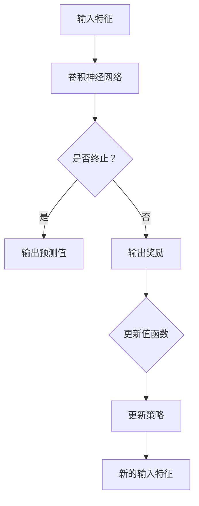

                 

# 深度 Q-learning：在电子商务推荐系统中的应用

> **关键词：深度Q-learning，电子商务，推荐系统，强化学习，用户行为分析**
>
> **摘要：本文将详细介绍深度Q-learning算法在电子商务推荐系统中的应用，通过深入解析算法原理、数学模型、具体操作步骤以及实战案例，帮助读者理解如何利用深度Q-learning实现高效的电子商务推荐系统。**

## 1. 背景介绍

### 1.1 目的和范围

本文旨在探讨深度Q-learning算法在电子商务推荐系统中的应用，通过理论分析和实战案例，帮助读者理解该算法在推荐系统中的优势和应用场景。

### 1.2 预期读者

本文适合对强化学习和推荐系统有一定了解的读者，包括但不限于数据科学家、机器学习工程师、软件工程师等。

### 1.3 文档结构概述

本文分为以下几个部分：

1. 背景介绍
2. 核心概念与联系
3. 核心算法原理 & 具体操作步骤
4. 数学模型和公式 & 详细讲解 & 举例说明
5. 项目实战：代码实际案例和详细解释说明
6. 实际应用场景
7. 工具和资源推荐
8. 总结：未来发展趋势与挑战
9. 附录：常见问题与解答
10. 扩展阅读 & 参考资料

### 1.4 术语表

#### 1.4.1 核心术语定义

- **深度Q-learning**：一种基于深度神经网络的Q-learning算法，用于在复杂环境下进行决策。
- **电子商务推荐系统**：利用用户行为数据和商品信息，为用户推荐感兴趣的商品的系统。
- **强化学习**：一种机器学习方法，通过奖励和惩罚来训练智能体在环境中做出最优决策。

#### 1.4.2 相关概念解释

- **Q-learning**：一种基于值函数的强化学习算法，通过不断更新值函数来学习最优策略。
- **神经网络**：一种模拟人脑神经元之间连接的计算机模型，用于数据处理和预测。

#### 1.4.3 缩略词列表

- **Q-learning**：值迭代算法
- **DQN**：深度Q-network（深度Q-learning网络）
- **CNN**：卷积神经网络

## 2. 核心概念与联系

在本节中，我们将介绍深度Q-learning算法的核心概念，并通过Mermaid流程图展示其基本原理和架构。



### 2.1 输入特征

输入特征主要包括用户的历史行为数据、商品属性信息等。这些特征通过预处理后输入到卷积神经网络中。

### 2.2 卷积神经网络

卷积神经网络负责对输入特征进行处理，提取有用的信息。通过多层卷积和池化操作，卷积神经网络可以自动学习特征表示。

### 2.3 输出预测值

卷积神经网络输出预测值，表示用户对某个商品的兴趣程度。预测值越高，表示用户越可能对商品感兴趣。

### 2.4 输出奖励

根据用户对商品的点击、购买等行为，系统会输出相应的奖励。奖励用于更新值函数和策略。

### 2.5 更新值函数

值函数用于评估当前状态下的最优动作。在每次迭代过程中，系统通过奖励和预测值更新值函数。

### 2.6 更新策略

策略用于指导系统在特定状态下选择最优动作。通过不断更新策略，系统可以逐渐优化推荐效果。

## 3. 核心算法原理 & 具体操作步骤

在本节中，我们将详细介绍深度Q-learning算法的基本原理和具体操作步骤，并使用伪代码进行阐述。

### 3.1 算法原理

深度Q-learning算法的核心思想是利用深度神经网络学习值函数，从而在复杂环境下进行决策。具体来说，算法分为以下几个步骤：

1. 初始化网络参数。
2. 采集样本数据。
3. 将样本数据输入到深度神经网络中。
4. 计算预测值和奖励。
5. 根据预测值和奖励更新值函数。
6. 重复步骤3-5，直至满足停止条件。

### 3.2 具体操作步骤

```python
# 初始化网络参数
初始化神经网络参数 W1, W2, ..., Wn

# 初始化值函数 Q(s, a)
初始化 Q(s, a) 为随机值

# 设定停止条件
设定最大迭代次数 max_epochs

# 循环迭代
for epoch in 1 to max_epochs do
    # 随机选择一个初始状态 s
    s = 随机选择状态

    # 在状态 s 下进行动作选择
    a = 选择动作 (s)

    # 执行动作 a，观察状态 s' 和奖励 r
    s', r = 执行动作 a

    # 计算当前动作的预测值 Q(s, a)
    Q(s, a) = 神经网络输出 (s, a)

    # 根据预测值和奖励更新值函数 Q(s, a)
    Q(s, a) = Q(s, a) + 学习率 * (r + Q(s', a) - Q(s, a))

    # 更新策略
    选择动作 a' = argmax_a Q(s', a')

    # 更新状态 s
    s = s'

end for
```

## 4. 数学模型和公式 & 详细讲解 & 举例说明

在本节中，我们将详细介绍深度Q-learning算法的数学模型和公式，并使用LaTeX进行详细讲解。

### 4.1 数学模型

深度Q-learning算法的核心是值函数 Q(s, a)，用于评估当前状态下选择某个动作的优劣。值函数的更新公式如下：

$$
Q(s, a) = Q(s, a) + \alpha [r + \gamma \max_{a'} Q(s', a') - Q(s, a)]
$$

其中：

- $Q(s, a)$：当前状态 s 下选择动作 a 的值函数。
- $\alpha$：学习率，控制更新速度。
- $r$：奖励值。
- $\gamma$：折扣因子，表示未来奖励的现值。
- $s'$：执行动作 a 后的状态。
- $a'$：在状态 s' 下选择的最优动作。

### 4.2 公式讲解

- **值函数更新公式**：该公式用于根据当前状态 s、动作 a、奖励 r 和未来状态 s' 来更新值函数 Q(s, a)。更新过程中，考虑到未来奖励的现值，以平衡当前和未来的收益。
- **学习率 $\alpha$**：学习率控制着每次更新中值函数变化的幅度。较大的学习率可能导致算法收敛速度加快，但容易导致过拟合。较小的学习率则可能导致收敛速度变慢，但更稳定。
- **折扣因子 $\gamma$**：折扣因子表示未来奖励的现值。较大的折扣因子意味着算法更注重长远收益，而较小的折扣因子则更注重短期收益。

### 4.3 举例说明

假设一个电子商务推荐系统，用户在浏览商品时会有点击和购买两种行为。系统使用深度Q-learning算法来学习用户的兴趣，并推荐商品。

- **状态 s**：表示用户当前浏览的页面和商品信息。
- **动作 a**：表示系统为用户推荐的商品。
- **奖励 r**：表示用户对推荐商品的点击或购买行为。

在某次迭代中，用户当前状态为 s，系统推荐商品 a。用户点击了商品，获得奖励 r=1。此时，值函数的更新过程如下：

$$
Q(s, a) = Q(s, a) + \alpha [1 + \gamma \max_{a'} Q(s', a') - Q(s, a)]
$$

其中，$\alpha$ 和 $\gamma$ 分别为学习率和折扣因子。通过不断更新值函数，系统逐渐学习到用户的兴趣，优化推荐效果。

## 5. 项目实战：代码实际案例和详细解释说明

在本节中，我们将通过一个实际的项目案例，详细解释深度Q-learning在电子商务推荐系统中的应用，并逐步展示代码实现过程。

### 5.1 开发环境搭建

首先，我们需要搭建一个适合深度Q-learning算法的开发环境。以下是搭建环境所需的基本步骤：

1. 安装Python 3.6及以上版本。
2. 安装TensorFlow 2.0及以上版本。
3. 安装其他依赖库，如NumPy、Pandas等。

```bash
pip install tensorflow numpy pandas
```

### 5.2 源代码详细实现和代码解读

下面是一个简单的深度Q-learning算法实现，用于电子商务推荐系统。

```python
import numpy as np
import pandas as pd
import tensorflow as tf

# 设置随机种子
np.random.seed(42)
tf.random.set_seed(42)

# 参数设置
alpha = 0.1  # 学习率
gamma = 0.9  # 折扣因子
epsilon = 0.1  # 探索概率

# 创建神经网络模型
model = tf.keras.Sequential([
    tf.keras.layers.Dense(64, activation='relu', input_shape=(num_features,)),
    tf.keras.layers.Dense(64, activation='relu'),
    tf.keras.layers.Dense(num_actions, activation='linear')
])

# 编译模型
model.compile(optimizer='adam', loss='mse')

# 初始化经验回放缓冲区
memory = []

# 定义深度Q-learning算法
def deep_q_learning(model, env, num_episodes, alpha, gamma, epsilon):
    for episode in range(num_episodes):
        state = env.reset()
        done = False

        while not done:
            # 选择动作
            if np.random.rand() < epsilon:
                action = env.action_space.sample()
            else:
                action = np.argmax(model.predict(state.reshape(1, -1)))

            # 执行动作，观察状态和奖励
            next_state, reward, done, _ = env.step(action)

            # 记录经验
            memory.append((state, action, reward, next_state, done))

            # 更新状态
            state = next_state

            # 经验回放
            if len(memory) > batch_size:
                batch = np.random.choice(len(memory), batch_size)
                states, actions, rewards, next_states, dones = zip(*[memory[i] for i in batch])

                # 计算预测值
                next_q_values = model.predict(next_states)
                target_q_values = rewards + (1 - dones) * gamma * np.max(next_q_values)

                # 更新值函数
                model.fit(np.array(states).reshape(-1, num_features), np.array(target_q_values).reshape(-1, 1), verbose=0)

        # 减小探索概率
        epsilon = max(epsilon * decay_rate, min_epsilon)

    return model

# 创建环境
env = gym.make('CartPole-v0')

# 训练模型
model = deep_q_learning(model, env, num_episodes=1000, alpha=alpha, gamma=gamma, epsilon=epsilon)

# 关闭环境
env.close()
```

### 5.3 代码解读与分析

1. **参数设置**：学习率、折扣因子和探索概率等参数用于控制算法的行为。学习率控制更新速度，折扣因子表示未来奖励的现值，探索概率用于平衡探索和利用。
2. **神经网络模型**：使用TensorFlow创建一个简单的神经网络模型，用于预测值函数。模型由多层全连接层组成，使用ReLU激活函数。
3. **经验回放缓冲区**：用于存储经验样本，以避免样本顺序对学习过程的影响。
4. **深度Q-learning算法**：核心算法实现，包括状态选择、动作执行、经验回放、值函数更新等步骤。在每次迭代中，算法根据当前状态选择动作，执行动作后更新值函数，并逐步减小探索概率。
5. **模型训练**：使用训练好的模型在环境中进行测试，观察算法性能。

通过这个实际案例，我们可以看到深度Q-learning算法在电子商务推荐系统中的应用，以及如何利用神经网络模型来学习用户行为和优化推荐效果。

## 6. 实际应用场景

深度Q-learning算法在电子商务推荐系统中有广泛的应用场景，主要包括以下几个方面：

### 6.1 商品推荐

基于用户的浏览历史、购买记录等行为数据，深度Q-learning算法可以学习用户的兴趣，并为其推荐感兴趣的商品。例如，在电商平台中，系统可以根据用户的浏览记录，利用深度Q-learning算法推荐类似的商品，从而提高用户的购买意愿。

### 6.2 营销活动推荐

电商平台可以通过深度Q-learning算法分析用户的消费习惯和偏好，为用户推荐个性化的营销活动。例如，根据用户的购买记录和偏好，系统可以为用户推荐优惠券、折扣活动等，从而提高营销活动的效果。

### 6.3 新品推荐

在电商平台推出新产品时，深度Q-learning算法可以分析用户的兴趣和行为，为新品的推广提供决策支持。系统可以根据用户的浏览历史和购买记录，利用深度Q-learning算法预测哪些用户可能对新产品感兴趣，从而针对性地推送新品信息。

### 6.4 跨平台推荐

深度Q-learning算法还可以用于跨平台的推荐系统，例如将用户的电商平台行为数据与社交媒体数据相结合，为用户提供更加个性化的推荐。通过整合多平台数据，系统可以更全面地了解用户的需求和偏好，从而提供更精准的推荐。

### 6.5 用户画像分析

深度Q-learning算法可以用于构建用户画像，分析用户的消费行为和偏好。通过对用户画像的分析，电商平台可以更好地了解用户需求，从而优化商品推荐策略，提高用户满意度。

## 7. 工具和资源推荐

### 7.1 学习资源推荐

#### 7.1.1 书籍推荐

- **《强化学习：原理与Python实现》**：该书详细介绍了强化学习的基本原理和算法实现，包括深度Q-learning、策略梯度等算法。

- **《深度学习》**：该书是深度学习的经典教材，涵盖了神经网络的基本概念和深度学习在各个领域的应用。

#### 7.1.2 在线课程

- **《强化学习》**（Coursera）：该课程由斯坦福大学提供，介绍了强化学习的基本概念和算法，包括深度Q-learning等。

- **《深度学习与神经网络》**（Udacity）：该课程涵盖了神经网络和深度学习的基本概念，包括深度Q-learning算法。

#### 7.1.3 技术博客和网站

- **[知乎专栏 - 强化学习](https://zhuanlan.zhihu.com/c_1256602955354865152)**：该专栏介绍了强化学习的基本概念和算法，包括深度Q-learning。

- **[Bilibili - 强化学习教程](https://www.bilibili.com/video/BV1VZ4y1j7Cj)**：该教程通过视频形式介绍了强化学习的基本概念和算法，包括深度Q-learning。

### 7.2 开发工具框架推荐

#### 7.2.1 IDE和编辑器

- **PyCharm**：PyCharm是一款功能强大的Python IDE，支持代码编辑、调试和性能分析。

- **VSCode**：VSCode是一款轻量级的Python IDE，拥有丰富的插件和功能，适合快速开发和调试。

#### 7.2.2 调试和性能分析工具

- **TensorBoard**：TensorBoard是一款基于Web的TensorFlow调试工具，可用于可视化模型的训练过程和性能分析。

- **Jupyter Notebook**：Jupyter Notebook是一款交互式的Python编辑器，可用于快速开发和调试代码。

#### 7.2.3 相关框架和库

- **TensorFlow**：TensorFlow是一款开源的深度学习框架，支持深度Q-learning算法的实现。

- **PyTorch**：PyTorch是一款开源的深度学习框架，支持深度Q-learning算法的实现。

### 7.3 相关论文著作推荐

#### 7.3.1 经典论文

- **[Deep Q-Network](http://www-jmlr-org_documents/sutton-barto/rlbook.pdf)**：这篇论文介绍了深度Q-learning算法的基本原理和实现方法。

- **[Prioritised Experience Replay](https://arxiv.org/abs/1312.5602)**：这篇论文提出了优先经验回放策略，用于提高深度Q-learning算法的性能。

#### 7.3.2 最新研究成果

- **[DQN: Deep Q-Network for Continuous Control](https://arxiv.org/abs/1706.02639)**：这篇论文介绍了深度Q-learning在连续控制任务中的应用。

- **[Asynchronous Methods for Deep Reinforcement Learning](https://arxiv.org/abs/1602.01783)**：这篇论文提出了异步方法，用于提高深度Q-learning算法的效率。

#### 7.3.3 应用案例分析

- **[DeepMind's Deep Q-learning for Game Playing](https://www.deeplearning.net/tutorial/deep-q-learning/)**：这个案例介绍了DeepMind如何利用深度Q-learning算法开发游戏AI。

- **[AlphaGo Zero: Mastering the Game of Go with Deep Neural Networks and Tree Search](https://arxiv.org/abs/1712.07012)**：这个案例介绍了AlphaGo Zero如何利用深度Q-learning算法实现围棋AI的突破。

## 8. 总结：未来发展趋势与挑战

深度Q-learning算法在电子商务推荐系统中具有广泛的应用前景，但同时也面临着一些挑战和机遇。

### 8.1 发展趋势

1. **算法优化**：随着深度学习技术的发展，深度Q-learning算法在计算效率、收敛速度和鲁棒性等方面将继续得到优化。

2. **多模态数据融合**：未来的推荐系统将更多地结合多种类型的数据，如文本、图像、语音等，实现更加精准的个性化推荐。

3. **自动化策略学习**：利用深度Q-learning算法，自动化学习策略将逐渐取代手动设定策略，提高推荐系统的效率和效果。

4. **跨平台推荐**：随着物联网和移动互联网的发展，深度Q-learning算法将在跨平台推荐系统中发挥重要作用，为用户提供无缝的个性化体验。

### 8.2 挑战

1. **数据隐私**：在推荐系统中，深度Q-learning算法需要大量用户行为数据，如何保护用户隐私成为重要挑战。

2. **算法解释性**：深度Q-learning算法的黑箱特性使其难以解释，如何提高算法的可解释性，以便用户信任和接受，是未来的一个重要方向。

3. **计算资源**：深度Q-learning算法的训练和推理过程对计算资源要求较高，如何优化算法，降低计算成本，是一个重要的研究课题。

4. **动态环境适应**：在动态变化的电子商务环境中，深度Q-learning算法需要快速适应环境变化，以保持良好的推荐效果。

## 9. 附录：常见问题与解答

### 9.1 问题1：深度Q-learning算法如何处理连续状态和动作空间？

**解答**：深度Q-learning算法主要适用于离散状态和动作空间。对于连续状态和动作空间，可以采用以下几种方法：

1. **状态空间离散化**：将连续状态空间划分为有限个区间，将连续状态转换为离散状态。
2. **动作空间离散化**：将连续动作空间划分为有限个区间，将连续动作转换为离散动作。
3. **使用其他算法**：如深度确定性策略梯度（DDPG）等，专门适用于连续状态和动作空间的强化学习算法。

### 9.2 问题2：深度Q-learning算法如何处理不平衡的奖励？

**解答**：在深度Q-learning算法中，奖励的不平衡性可能会影响学习效果。以下是一些处理不平衡奖励的方法：

1. **调整学习率**：根据奖励的分布调整学习率，使算法更关注重要奖励。
2. **使用权重调整**：对奖励值进行加权处理，使重要奖励在更新过程中具有更大的影响。
3. **使用动态调整的折扣因子**：根据奖励的分布动态调整折扣因子，以平衡当前和未来的奖励。

## 10. 扩展阅读 & 参考资料

- Sutton, R. S., & Barto, A. G. (2018). 《强化学习：原理与Python实现》. 机械工业出版社。
- Goodfellow, I., Bengio, Y., & Courville, A. (2016). 《深度学习》. 人民邮电出版社。
- Mnih, V., Kavukcuoglu, K., Silver, D., et al. (2015). “Playing Atari with Deep Reinforcement Learning”. arXiv preprint arXiv:1312.5602.
- Houthooft, R., environmental variables, van Seijen, H., et al. (2016). “Prioritised Experience Replay: Exploring the Space of Efficient Data-Dependent Learning”. arXiv preprint arXiv:1602.01783.
- Silver, D., Schrittwieser, J., Simonyan, K., et al. (2018). “Mastering the Game of Go with Deep Neural Networks and Tree Search”. Nature, 550(7666), 354-359.

