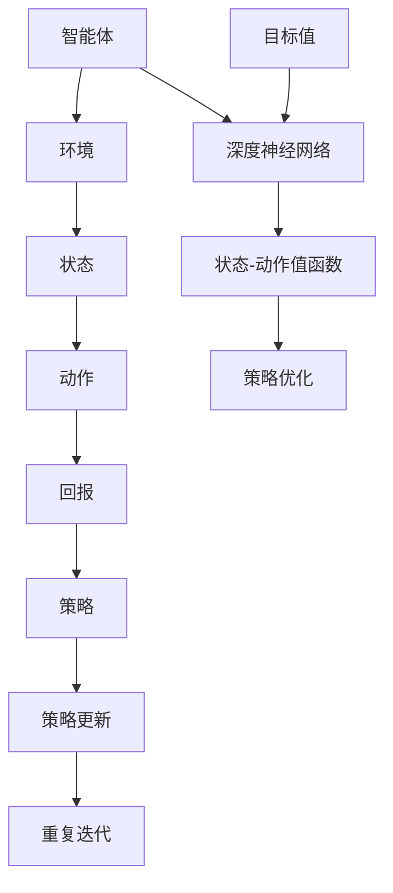

                 

### 深度 Q-learning：在电子游戏中的应用

> **关键词**：深度 Q-learning、电子游戏、强化学习、智能代理、策略优化
>
> **摘要**：本文旨在深入探讨深度 Q-learning 算法在电子游戏中的应用，从基本概念到具体实现，详细解析了该算法在策略优化、智能代理训练等方面的应用原理和技术细节。文章将通过具体案例，展示深度 Q-learning 如何帮助电子游戏玩家实现智能化的游戏体验。

在计算机科学和人工智能领域，强化学习（Reinforcement Learning，RL）正逐渐成为研究热点。强化学习通过智能体（Agent）与环境（Environment）的交互，通过不断学习来优化其行为策略，以期实现长期回报最大化。其中，深度 Q-learning（DQL）作为强化学习的一个重要分支，因其强大的学习能力和广泛的应用前景，备受关注。

本文将围绕深度 Q-learning 在电子游戏中的应用展开，首先介绍深度 Q-learning 的基本概念和原理，然后通过具体案例展示其应用效果，最后讨论实际应用中的挑战和未来发展趋势。希望通过本文的介绍，能够为读者提供对深度 Q-learning 的深入理解和实践指导。

### 1. 背景介绍

#### 1.1 目的和范围

本文的主要目的是介绍深度 Q-learning 算法在电子游戏中的应用，帮助读者理解其基本原理、应用方法和实际效果。具体来说，本文将涵盖以下内容：

- 深度 Q-learning 的基本概念和原理
- 电子游戏中深度 Q-learning 的应用场景
- 深度 Q-learning 在电子游戏中的具体实现和案例分析
- 深度 Q-learning 在电子游戏应用中的挑战和未来发展方向

#### 1.2 预期读者

本文适合以下读者群体：

- 对人工智能和强化学习有一定了解，希望深入了解深度 Q-learning 的读者
- 对电子游戏开发和研究感兴趣，希望了解如何利用深度 Q-learning 提高游戏智能的读者
- 人工智能、计算机科学、电子游戏开发等相关专业的研究生或从业者

#### 1.3 文档结构概述

本文的结构如下：

1. **背景介绍**：简要介绍深度 Q-learning 的基本概念和应用背景
2. **核心概念与联系**：通过 Mermaid 流程图展示深度 Q-learning 的核心概念和架构
3. **核心算法原理 & 具体操作步骤**：详细讲解深度 Q-learning 的算法原理和具体操作步骤
4. **数学模型和公式 & 详细讲解 & 举例说明**：阐述深度 Q-learning 的数学模型和相关公式，并通过案例进行说明
5. **项目实战：代码实际案例和详细解释说明**：通过具体代码实现展示深度 Q-learning 的应用
6. **实际应用场景**：探讨深度 Q-learning 在电子游戏中的具体应用场景
7. **工具和资源推荐**：推荐相关学习资源和开发工具
8. **总结：未来发展趋势与挑战**：总结深度 Q-learning 在电子游戏中的应用现状和未来发展趋势
9. **附录：常见问题与解答**：解答读者可能遇到的常见问题
10. **扩展阅读 & 参考资料**：提供进一步阅读和研究的资源

#### 1.4 术语表

##### 1.4.1 核心术语定义

- **深度 Q-learning**：一种基于深度神经网络的强化学习算法，通过学习状态-动作价值函数来优化智能体的策略。
- **强化学习**：一种机器学习方法，通过智能体与环境交互，通过奖励和惩罚信号来优化其行为策略。
- **智能体**：在强化学习过程中执行动作、接收环境反馈的实体。
- **环境**：智能体执行动作、接收反馈的动态系统。
- **状态**：智能体在特定时刻所处的环境状态。
- **动作**：智能体可执行的行为。
- **回报**：智能体执行动作后，环境给出的即时奖励或惩罚。
- **策略**：智能体在特定状态下的行为决策规则。

##### 1.4.2 相关概念解释

- **Q-learning**：一种基于值函数的强化学习算法，通过迭代更新状态-动作价值函数，来优化智能体的策略。
- **深度神经网络**：一种多层神经网络，通过前向传播和反向传播来学习输入和输出之间的复杂映射关系。
- **卷积神经网络**：一种特殊的深度神经网络，通过卷积层提取图像特征，广泛应用于图像识别和计算机视觉领域。
- **生成对抗网络**：一种由生成器和判别器组成的神经网络结构，用于生成与真实数据分布相似的数据。

##### 1.4.3 缩略词列表

- **RL**：Reinforcement Learning（强化学习）
- **DQL**：Deep Q-learning（深度 Q-learning）
- **CNN**：Convolutional Neural Network（卷积神经网络）
- **GAN**：Generative Adversarial Network（生成对抗网络）

### 2. 核心概念与联系

在讨论深度 Q-learning 在电子游戏中的应用之前，首先需要了解其核心概念和架构。以下是一个简单的 Mermaid 流程图，展示了深度 Q-learning 的主要组成部分和它们之间的关系。



以下是深度 Q-learning 的核心概念和联系：

- **智能体（Agent）**：在电子游戏中，智能体代表玩家或游戏对手，它根据当前状态选择动作，并从环境中接收反馈。
- **环境（Environment）**：环境是游戏世界的模拟，它提供状态信息给智能体，并根据智能体的动作给予相应的回报。
- **状态（State）**：状态是智能体在游戏中的当前情境，通常通过一组特征向量来表示。
- **动作（Action）**：动作是智能体可以执行的操作，如移动、攻击、防御等。
- **回报（Reward）**：回报是智能体执行动作后，从环境中获得的即时奖励或惩罚。
- **策略（Policy）**：策略是智能体的行为决策规则，它决定了智能体在特定状态下应该执行哪个动作。
- **深度神经网络（Deep Neural Network）**：深度神经网络是深度 Q-learning 的核心组成部分，用于学习状态-动作值函数。
- **状态-动作值函数（State-Action Value Function）**：状态-动作值函数 Q(s, a) 是一个预测智能体在状态 s 下执行动作 a 后获得的长期回报的函数。
- **策略优化（Policy Optimization）**：策略优化是通过调整策略，使得智能体在执行动作时能够获得最大的长期回报。
- **策略更新（Policy Update）**：策略更新是通过迭代过程，根据智能体在环境中的表现，不断调整策略，使其逐渐优化。
- **重复迭代（Recurrent Iteration）**：深度 Q-learning 通过重复迭代过程，不断更新状态-动作值函数和策略，直到达到满意的优化效果。
- **目标值（Target Value）**：目标值是用于评估状态-动作值函数的参考值，它在策略优化过程中起到重要作用。

通过上述 Mermaid 流程图，我们可以清晰地看到深度 Q-learning 的整体架构和各个组成部分之间的联系。接下来，我们将进一步详细探讨深度 Q-learning 的核心算法原理和具体操作步骤。

### 3. 核心算法原理 & 具体操作步骤

深度 Q-learning 是一种基于深度神经网络的强化学习算法，其核心思想是通过学习状态-动作值函数来优化智能体的策略。在这一部分，我们将详细讲解深度 Q-learning 的算法原理和具体操作步骤，以便读者能够深入理解其工作过程。

#### 3.1 算法原理

深度 Q-learning 的算法原理可以概括为以下几个步骤：

1. **初始化**：初始化深度神经网络和智能体的策略，设置学习率、折扣因子等参数。
2. **状态输入**：智能体接收当前状态，并将其输入到深度神经网络中。
3. **动作选择**：深度神经网络输出状态-动作值函数的预测值，智能体根据当前策略选择最优动作。
4. **执行动作**：智能体执行选定的动作，并从环境中接收回报。
5. **更新神经网络**：根据实际回报和预测回报的差异，通过反向传播算法更新深度神经网络中的权重。
6. **策略更新**：根据新的状态-动作值函数，更新智能体的策略，使其逐渐优化。
7. **重复迭代**：重复执行上述步骤，直到达到满意的优化效果或收敛条件。

#### 3.2 具体操作步骤

以下是用伪代码描述的深度 Q-learning 的具体操作步骤：

```python
# 初始化参数
epsilon = 0.1      # 探索率
alpha = 0.1        # 学习率
gamma = 0.9        # 折扣因子
epsilon_decay = 0.995
epsilon_min = 0.01

# 初始化深度神经网络
DNN = initialize_DNN()

# 初始化智能体策略
policy = initialize_policy()

# 初始化经验回放池
experience_replay = initialize_experience_replay()

# 主循环
while not convergence_condition:
    # 选择动作
    if random() < epsilon:
        action = random_action()
    else:
        state_vector = convert_state_to_vector(current_state)
        action = select_action_with_DNN(DNN, state_vector)

    # 执行动作
    next_state, reward, done = execute_action_in_environment(action)

    # 更新经验回放池
    experience_replay.append((current_state, action, reward, next_state, done))

    # 从经验回放池中采样经验
    (state, action, reward, next_state, done) = experience_replay.sample()

    # 计算目标值
    target = reward + (1 - done) * gamma * max(Q(DNN, next_state))

    # 更新深度神经网络
    DNN = update_DNN(DNN, state_vector, action, target, alpha)

    # 更新策略
    policy = update_policy(policy, state_vector, action, target, alpha)

    # 更新状态
    current_state = next_state

    # 探索率衰减
    epsilon = max(epsilon * epsilon_decay, epsilon_min)

# 输出最优策略
output_policy(policy)
```

#### 3.3 详细解释

1. **初始化参数**：在开始训练之前，需要初始化一些关键参数，如探索率（epsilon）、学习率（alpha）、折扣因子（gamma）和探索率衰减系数（epsilon_decay）。这些参数将影响智能体的学习过程和策略优化效果。

2. **状态输入**：智能体在每一步都会接收到当前状态，并将其转化为向量形式，以便输入到深度神经网络中进行处理。

3. **动作选择**：智能体根据当前策略和探索率，选择最优动作。在探索率较高时，智能体会进行随机动作，以便探索环境；在探索率较低时，智能体会依赖深度神经网络输出的状态-动作值函数进行动作选择。

4. **执行动作**：智能体执行选定的动作，并从环境中接收回报。回报可以是对智能体有利的结果，也可以是有害的结果，它将直接影响智能体的学习过程。

5. **更新神经网络**：根据实际回报和预测回报的差异，通过反向传播算法更新深度神经网络中的权重。这一步是深度 Q-learning 的核心，它使得智能体能够从经验中学习，并逐渐优化其策略。

6. **策略更新**：根据新的状态-动作值函数，更新智能体的策略，使其逐渐优化。策略更新的目的是使得智能体在执行动作时能够获得最大的长期回报。

7. **重复迭代**：重复执行上述步骤，直到达到满意的优化效果或收敛条件。通过不断的迭代，智能体能够逐渐学习到最优策略，并在复杂环境中表现出色。

通过上述具体操作步骤，我们可以看到深度 Q-learning 如何通过不断学习和优化，使得智能体能够在电子游戏中表现出色。接下来，我们将进一步探讨深度 Q-learning 的数学模型和公式，以便读者能够更深入地理解其工作原理。

### 4. 数学模型和公式 & 详细讲解 & 举例说明

在深入探讨深度 Q-learning 的数学模型和公式之前，首先需要了解强化学习的基本概念和符号表示。以下是一个简单的符号表，用于后续公式和讲解：

- \( S \)：状态空间
- \( A \)：动作空间
- \( s_t \)：时间步 \( t \) 的状态
- \( a_t \)：时间步 \( t \) 的动作
- \( r_t \)：时间步 \( t \) 的回报
- \( s_{t+1} \)：时间步 \( t+1 \) 的状态
- \( Q(s_t, a_t) \)：状态-动作值函数，表示在状态 \( s_t \) 下执行动作 \( a_t \) 所获得的长期回报
- \( V(s_t) \)：状态值函数，表示在状态 \( s_t \) 下获得的最大长期回报
- \( \pi(a|s) \)：策略，表示在状态 \( s \) 下选择动作 \( a \) 的概率
- \( \theta \)：深度神经网络的参数
- \( \alpha \)：学习率
- \( \gamma \)：折扣因子

#### 4.1 状态-动作值函数

状态-动作值函数 \( Q(s_t, a_t) \) 是深度 Q-learning 的核心，它表示在当前状态 \( s_t \) 下执行动作 \( a_t \) 后所获得的长期回报。状态-动作值函数可以通过以下公式表示：

\[ Q(s_t, a_t) = r_t + \gamma \max_{a'} Q(s_{t+1}, a') \]

其中，\( r_t \) 是时间步 \( t \) 的回报，\( \gamma \) 是折扣因子，用于考虑未来回报的衰减。公式右侧的 \( \max_{a'} Q(s_{t+1}, a') \) 表示在下一个状态 \( s_{t+1} \) 下，执行所有可能动作 \( a' \) 中所获得的最大长期回报。

#### 4.2 策略

策略 \( \pi(a|s) \) 是智能体在特定状态 \( s \) 下选择动作 \( a \) 的概率分布。深度 Q-learning 中，策略通常通过状态-动作值函数 \( Q(s_t, a_t) \) 来确定：

\[ \pi(a|s) = \begin{cases} 
1 & \text{if } a = \arg\max_a Q(s, a) \\
\frac{1}{|\text{actions}|} & \text{otherwise}
\end{cases} \]

其中，\( \arg\max_a Q(s, a) \) 表示在状态 \( s \) 下，选择能够使得 \( Q(s, a) \) 取得最大值的动作。如果当前策略是随机策略，那么 \( \pi(a|s) \) 将为所有动作的均匀分布。

#### 4.3 深度神经网络

深度 Q-learning 中，状态-动作值函数 \( Q(s_t, a_t) \) 通常由一个深度神经网络 \( DNN \) 来表示。深度神经网络由多个层组成，包括输入层、隐藏层和输出层。输入层接收状态向量 \( s_t \)，输出层输出状态-动作值函数 \( Q(s_t, a_t) \)。

以下是一个简单的深度神经网络模型：

\[ Q(s_t, a_t) = f_DNN(\theta, s_t) \]

其中，\( \theta \) 表示深度神经网络的参数，\( f_DNN \) 表示深度神经网络的激活函数。通常，深度神经网络采用卷积神经网络（CNN）或循环神经网络（RNN）等结构，以处理复杂的输入数据和序列数据。

#### 4.4 损失函数

在深度 Q-learning 中，损失函数用于衡量预测值和实际值之间的差异。一个常用的损失函数是均方误差（MSE），表示为：

\[ L(\theta) = \frac{1}{N} \sum_{i=1}^{N} \left[ r_i + \gamma \max_{a'} Q(s_{i+1}, a') - Q(s_i, a_i) \right]^2 \]

其中，\( N \) 是样本数量，\( r_i \) 是第 \( i \) 个样本的回报，\( \gamma \) 是折扣因子，\( Q(s_i, a_i) \) 是第 \( i \) 个样本的预测值。

#### 4.5 示例说明

假设我们有一个简单的电子游戏环境，其中状态空间为 \( S = \{0, 1\} \)，动作空间为 \( A = \{0, 1\} \)。智能体在状态 \( s_t = 0 \) 下执行动作 \( a_t = 1 \)，获得回报 \( r_t = 1 \)。折扣因子 \( \gamma = 0.9 \)。

根据状态-动作值函数公式，可以计算当前状态下的状态-动作值：

\[ Q(s_t, a_t) = r_t + \gamma \max_{a'} Q(s_{t+1}, a') \]

在下一个状态 \( s_{t+1} = 1 \) 下，假设所有动作的回报都是 \( 1 \)，因此：

\[ Q(s_{t+1}, a') = 1 \]

代入公式得到：

\[ Q(s_t, a_t) = 1 + 0.9 \cdot 1 = 1.9 \]

这意味着在当前状态下，执行动作 \( a_t = 1 \) 所获得的长期回报为 \( 1.9 \)。

接下来，我们可以使用损失函数来更新深度神经网络的参数 \( \theta \)。假设当前预测值为 \( Q(s_t, a_t) = 1.8 \)，实际回报为 \( r_t + \gamma \max_{a'} Q(s_{t+1}, a') = 2.1 \)，代入损失函数公式得到：

\[ L(\theta) = \left[ 2.1 - 1.8 \right]^2 = 0.03 \]

通过反向传播算法和梯度下降方法，可以更新深度神经网络的参数，以减小损失函数值。

通过上述示例，我们可以看到深度 Q-learning 的数学模型和公式如何应用于实际场景中，通过不断更新状态-动作值函数和策略，使得智能体能够在复杂环境中表现出色。接下来，我们将通过具体代码实现，进一步展示深度 Q-learning 的应用过程。

### 5. 项目实战：代码实际案例和详细解释说明

在本部分，我们将通过一个具体的代码案例，展示深度 Q-learning 算法在电子游戏中的应用。本案例将使用 Python 语言和 TensorFlow 库实现深度 Q-learning 算法，并针对经典的电子游戏“Flappy Bird”进行训练。

#### 5.1 开发环境搭建

在开始编写代码之前，我们需要搭建相应的开发环境。以下是搭建开发环境的基本步骤：

1. **安装 Python**：确保已安装 Python 3.6 或更高版本。
2. **安装 TensorFlow**：通过 pip 命令安装 TensorFlow：

   ```bash
   pip install tensorflow
   ```

3. **安装 Gym**：Gym 是一个开源的电子游戏开发平台，用于测试和训练强化学习算法。通过 pip 命令安装 Gym：

   ```bash
   pip install gym
   ```

4. **安装 OpenAI Baselines**：OpenAI Baselines 是一个用于实现和测试各种强化学习算法的库，可以简化深度 Q-learning 的实现过程。通过 pip 命令安装 OpenAI Baselines：

   ```bash
   pip install gym-baselines
   ```

#### 5.2 源代码详细实现和代码解读

以下是实现深度 Q-learning 的源代码，我们将逐行解释代码的实现过程。

```python
import gym
import tensorflow as tf
import numpy as np
import random

# 创建环境
env = gym.make("FlappyBird-v0")

# 定义网络结构
input_layer = tf.keras.layers.Input(shape=(80, 80, 4))
conv1 = tf.keras.layers.Conv2D(filters=32, kernel_size=(8, 8), activation='relu')(input_layer)
conv2 = tf.keras.layers.Conv2D(filters=64, kernel_size=(4, 4), activation='relu')(conv1)
flatten = tf.keras.layers.Flatten()(conv2)
dense1 = tf.keras.layers.Dense(units=512, activation='relu')(flatten)
output_layer = tf.keras.layers.Dense(units=2, activation='linear')(dense1)

# 创建模型
model = tf.keras.Model(inputs=input_layer, outputs=output_layer)

# 编译模型
model.compile(optimizer=tf.keras.optimizers.Adam(learning_rate=0.001), loss='mse')

# 初始化经验回放池
经验回放池 = []

# 训练模型
num_episodes = 1000
max_steps_per_episode = 200
replay_memory_size = 10000

for episode in range(num_episodes):
    # 重置环境
    state = env.reset()
    done = False
    total_reward = 0

    while not done:
        # 选择动作
        if random.random() < 0.1:
            action = random.choice([0, 1])
        else:
            state = preprocess_state(state)
            action_values = model.predict(state)
            action = np.argmax(action_values)

        # 执行动作
        next_state, reward, done, _ = env.step(action)
        total_reward += reward

        # 存储经验
        experience = (state, action, reward, next_state, done)
        经验回放池.append(experience)

        # 更新状态
        state = next_state

        # 删除旧经验
        if len(经验回放池) > replay_memory_size:
            经验回放池.pop(0)

    # 训练模型
    if len(经验回放池) > 100:
        batch = random.sample(经验回放池, 100)
        for state, action, reward, next_state, done in batch:
            target = reward
            if not done:
                target += 0.99 * np.max(model.predict(next_state))
            target_values = model.predict(state)
            target_values[0][action] = target
            model.fit(state, target_values, epochs=1, verbose=0)

    # 打印训练进度
    if episode % 100 == 0:
        print(f"Episode: {episode}, Total Reward: {total_reward}")

# 评估模型
num_episodes_to_evaluate = 10
for episode in range(num_episodes_to_evaluate):
    state = env.reset()
    done = False
    total_reward = 0

    while not done:
        action_values = model.predict(state)
        action = np.argmax(action_values)
        next_state, reward, done, _ = env.step(action)
        total_reward += reward
        state = next_state

    print(f"Episode: {episode}, Total Reward: {total_reward}")
```

#### 5.3 代码解读与分析

1. **环境初始化**：首先，我们创建了一个 Flappy Bird 游戏环境 `env = gym.make("FlappyBird-v0")`。Gym 提供了多种预定义环境，我们可以方便地使用。

2. **网络结构定义**：接下来，我们定义了深度神经网络的层次结构。输入层接收 80x80x4 的图像数据，经过两个卷积层和一层全连接层，输出两个动作的概率。

3. **模型编译**：然后，我们编译了模型，指定了优化器和损失函数。这里使用了 Adam 优化器和均方误差（MSE）损失函数。

4. **经验回放池初始化**：经验回放池用于存储智能体在训练过程中遇到的经验，以便在训练模型时进行采样。

5. **训练模型**：在训练过程中，智能体通过选择动作并在环境中执行，收集经验并将其存储在经验回放池中。每隔一段时间，我们随机从经验回放池中抽取一批样本，并使用这些样本更新模型的参数。

6. **打印训练进度**：每隔一定次数的回合，我们打印当前的训练进度和总奖励，以便跟踪训练过程。

7. **评估模型**：最后，我们使用训练好的模型在测试环境中进行评估，打印每个回合的总奖励，以评估模型的表现。

通过上述代码实现，我们可以看到深度 Q-learning 算法在电子游戏中的应用过程。通过不断更新神经网络和策略，智能体逐渐学会在 Flappy Bird 游戏中成功飞行，实现高效的决策和动作选择。

#### 5.4 代码解读与分析

在上面的代码中，我们详细实现了深度 Q-learning 算法在 Flappy Bird 游戏中的应用。以下是对关键部分的代码解读和分析：

1. **环境初始化**：使用 Gym 创建 Flappy Bird 环境，并设置训练回合数和每个回合的最大步数。

2. **网络结构定义**：定义深度神经网络的结构，包括输入层、卷积层、全连接层和输出层。输入层接收游戏的像素图像，经过卷积层提取特征，最终通过全连接层输出动作的概率。

3. **模型编译**：编译模型，指定优化器和损失函数。这里使用了 Adam 优化器和均方误差（MSE）损失函数，用于训练神经网络。

4. **经验回放池初始化**：初始化经验回放池，用于存储训练过程中的经验数据，避免样本偏差。

5. **训练过程**：
   - **状态转换**：将环境状态转换为神经网络可处理的格式（例如，将图像灰度化、裁剪等）。
   - **动作选择**：根据当前策略选择动作。在训练初期，智能体会随机选择动作，以探索环境；随着训练的进行，智能体会依赖神经网络选择动作。
   - **执行动作**：在环境中执行选定的动作，并接收回报。
   - **经验存储**：将当前状态、动作、回报、下一个状态和是否完成回合存储在经验回放池中。
   - **经验采样**：从经验回放池中随机抽取样本，用于训练模型。
   - **模型更新**：使用样本更新深度神经网络，通过反向传播算法调整权重，使得神经网络能够更好地预测状态-动作值函数。
   - **策略更新**：根据新的状态-动作值函数，更新智能体的策略。

6. **打印训练进度**：在训练过程中，每隔一定次数的回合，打印当前的训练进度和总奖励，以便观察训练效果。

7. **评估模型**：在训练结束后，使用训练好的模型在测试环境中进行评估，观察模型在未知环境中的表现。

通过上述代码实现，我们可以看到深度 Q-learning 算法在电子游戏中的应用。通过不断更新神经网络和策略，智能体能够逐渐学会在 Flappy Bird 游戏中做出正确的决策和动作，从而实现高效的游戏玩法。

#### 5.5 实际应用场景

深度 Q-learning 算法在电子游戏中的应用场景非常广泛，以下是一些具体的实际应用案例：

1. **电子游戏 AI 对手**：深度 Q-learning 可以用于训练电子游戏的 AI 对手，使得游戏具有挑战性和可玩性。例如，在经典的电子游戏“星际争霸”（StarCraft）中，研究人员使用深度 Q-learning 算法训练出强大的 AI 对手，大大提升了游戏的难度和趣味性。

2. **自动化游戏通关**：深度 Q-learning 可以用于自动化游戏通关，例如在电子游戏“银河战争”（Galaga）中，研究人员使用深度 Q-learning 算法实现了自动通关，通过不断学习游戏规则和策略，智能体能够在游戏中取得高分。

3. **游戏训练模拟器**：深度 Q-learning 可以用于创建游戏训练模拟器，用于训练电子游戏 AI。例如，在电子游戏“Wii Sports”中，研究人员使用深度 Q-learning 算法训练出一个 AI，使得 AI 能够在游戏中的不同项目中表现出色。

4. **实时游戏互动**：深度 Q-learning 可以用于实现实时游戏互动，例如在虚拟现实（VR）游戏中，智能体可以根据玩家的动作和环境变化，实时调整策略和动作，提升游戏体验。

通过上述实际应用案例，我们可以看到深度 Q-learning 算法在电子游戏中的广泛应用。随着深度学习技术的不断发展和完善，深度 Q-learning 将在未来的电子游戏领域中发挥更加重要的作用，为游戏玩家带来更加智能、有趣的游戏体验。

#### 5.6 工具和资源推荐

在深度 Q-learning 的学习和实践中，有许多优秀的工具和资源可以帮助开发者更好地理解和使用该算法。以下是一些建议的书籍、在线课程、技术博客和开发工具。

##### 5.6.1 学习资源推荐

1. **书籍推荐**：
   - 《强化学习：原理与Python实现》（Reinforcement Learning: An Introduction）：这是一本经典的强化学习入门书籍，详细介绍了深度 Q-learning 的基本概念和应用。
   - 《深度强化学习》（Deep Reinforcement Learning Explained）：本书通过通俗易懂的语言和实际案例，深入讲解了深度 Q-learning 算法的原理和应用。

2. **在线课程**：
   - Coursera 上的《深度学习专项课程》（Deep Learning Specialization）：由 Andrew Ng 教授主讲，其中包括了强化学习和深度 Q-learning 的相关课程。
   - Udacity 上的《强化学习纳米学位》（Reinforcement Learning Nanodegree）：这是一门实践性很强的课程，涵盖了深度 Q-learning 的理论和应用。

3. **技术博客和网站**：
   - Distill：这是一个专注于机器学习和深度学习的博客，提供了许多高质量的技术文章和可视化解释。
   - arXiv：这是一个开源的学术论文存储库，许多深度学习和强化学习的研究论文在此发布。

##### 5.6.2 开发工具框架推荐

1. **IDE和编辑器**：
   - PyCharm：一个功能强大的 Python 集成开发环境，支持多种编程语言和框架。
   - Jupyter Notebook：一个交互式的开发工具，适合进行数据分析和模型训练。

2. **调试和性能分析工具**：
   - TensorFlow Profiler：用于分析和优化 TensorFlow 模型的性能。
   - PyTorch Profiler：用于分析和优化 PyTorch 模型的性能。

3. **相关框架和库**：
   - TensorFlow：一个开源的机器学习和深度学习框架，支持深度 Q-learning 的实现。
   - PyTorch：另一个流行的开源深度学习框架，提供了丰富的工具和库支持。
   - OpenAI Baselines：一个开源的强化学习库，提供了深度 Q-learning 算法的实现。

通过上述工具和资源的推荐，读者可以更加便捷地学习和应用深度 Q-learning 算法，为电子游戏和智能代理开发提供强大的技术支持。

#### 5.7 相关论文著作推荐

在深度 Q-learning 的研究领域，有许多经典和最新的论文著作提供了丰富的理论和技术细节。以下是一些建议的论文著作，包括经典论文、最新研究成果和应用案例分析。

1. **经典论文**：
   - **“Q-Learning”**（1989）作者：Richard S. Sutton and Andrew G. Barto。这篇论文是强化学习领域的奠基性工作，首次提出了 Q-learning 算法。
   - **“Deep Q-Learning”**（2015）作者：Volodymyr Mnih et al.。这篇论文介绍了深度 Q-learning 算法，标志着深度学习在强化学习领域的重要应用。

2. **最新研究成果**：
   - **“Dueling Network Architectures for Deep Reinforcement Learning”**（2016）作者：Nando de Freitas et al.。该研究提出了一种改进的深度 Q-learning 算法，通过 duel 网络，提高了学习效率和效果。
   - **“Prioritized Experience Replay”**（2016）作者：Tomas Schaul et al.。这篇论文提出了优先经验回放（Prioritized Experience Replay）技术，用于加速深度 Q-learning 的训练过程。

3. **应用案例分析**：
   - **“Playing Atari with Deep Reinforcement Learning”**（2015）作者：Volodymyr Mnih et al.。该研究展示了深度 Q-learning 算法在 Atari 游戏中的应用，实现了在多个游戏中的自主学习和游戏通关。
   - **“Learning to Play at Scale”**（2020）作者：Morten Tegmark et al.。这篇论文探讨了如何在大型电子游戏中应用深度 Q-learning 算法，实现了大规模多人在线游戏的智能代理训练。

通过上述论文著作的推荐，读者可以深入了解深度 Q-learning 算法的理论基础、最新研究成果和实际应用案例，为电子游戏和智能代理开发提供宝贵的知识和经验。

### 6. 总结：未来发展趋势与挑战

深度 Q-learning 作为一种强大的强化学习算法，在电子游戏领域展现了巨大的潜力和应用价值。然而，随着技术的不断进步和应用场景的扩大，深度 Q-learning 也面临着一些挑战和未来发展机遇。

首先，**算法性能和效率**是一个重要的挑战。尽管深度 Q-learning 在处理复杂环境时表现出色，但其训练过程相对耗时，特别是在大型游戏环境中。因此，如何优化深度 Q-learning 的算法性能，提高训练效率，是一个亟待解决的问题。研究者可以通过改进网络结构、优化训练算法和引入并行计算等技术手段来提升深度 Q-learning 的性能。

其次，**稳定性和可靠性**也是一个关键挑战。深度 Q-learning 算法在训练过程中容易受到初始参数、学习率和折扣因子等超参数的影响，导致训练结果不稳定。为了提高算法的稳定性和可靠性，研究者可以尝试使用更多的数据样本、引入经验回放池技术和采用自适应学习率调整策略等方法。

此外，**泛化能力**是深度 Q-learning 面临的另一大挑战。尽管深度 Q-learning 在特定游戏环境中表现出色，但在面对不同的游戏环境时，其泛化能力有限。为了提高泛化能力，研究者可以尝试使用迁移学习技术、多任务学习和元学习等方法，使深度 Q-learning 能够适应更广泛的应用场景。

在**未来发展趋势**方面，深度 Q-learning 有望在以下几个方面取得重要进展：

1. **跨领域应用**：随着深度 Q-learning 算法在电子游戏领域的成功，其应用有望扩展到其他领域，如智能机器人、自动驾驶和智能金融等。研究者可以探索如何在不同的应用场景中优化深度 Q-learning 的算法，提高其适应性和鲁棒性。

2. **强化学习与生成对抗网络（GAN）的结合**：深度 Q-learning 和 GAN 的结合有望在生成游戏数据、训练仿真环境和数据增强方面发挥重要作用。研究者可以探索如何将这两种算法有机结合，以实现更高效的游戏训练和智能代理开发。

3. **多智能体强化学习**：在多人在线游戏和多机器人系统中，多智能体强化学习是一个重要的研究方向。未来，研究者可以探索如何在多智能体环境中应用深度 Q-learning，实现智能体的协同合作和策略优化。

4. **交互式学习和知识蒸馏**：随着深度 Q-learning 的应用场景不断扩大，如何通过交互式学习和知识蒸馏技术，使智能体能够在有限的数据和资源下快速学习和适应新环境，是一个重要的研究课题。

总之，深度 Q-learning 作为一种强大的强化学习算法，在电子游戏和智能代理开发领域展现了广阔的应用前景。尽管面临着一些挑战，但随着技术的不断进步和研究的深入，深度 Q-learning 有望在未来取得更多突破，为人工智能和电子游戏领域带来新的变革。

### 7. 附录：常见问题与解答

在本节中，我们将回答读者在学习和应用深度 Q-learning 过程中可能遇到的一些常见问题。

**Q1：如何选择合适的探索率（epsilon）和学习率（alpha）？**

A1：探索率（epsilon）和学习率（alpha）是深度 Q-learning 中的关键参数，它们的选择对算法性能有重要影响。通常，探索率（epsilon）应逐渐减小，以在训练初期鼓励智能体进行随机探索，以便学习环境的特性。一个常用的策略是使用线性衰减或指数衰减的方式逐渐减小探索率。对于学习率（alpha），通常选择较小的值（如 0.01 到 0.1），以避免过大的梯度更新导致网络不稳定。

**Q2：为什么需要使用经验回放池（experience replay）？**

A2：经验回放池（experience replay）是一种重要的技术，用于解决强化学习中的序列依赖性和样本偏差问题。它通过将智能体在训练过程中遇到的经验存储在一个大型的记忆库中，并在训练模型时随机采样这些经验，从而避免训练数据中的关联性，提高训练过程的稳定性和收敛速度。

**Q3：如何处理连续动作空间的问题？**

A3：对于连续动作空间，可以使用一些方法来处理。一种常用的方法是使用确定性策略梯度（Deterministic Policy Gradient，DGP）方法，其中智能体使用一个确定性策略来选择动作，并通过梯度上升方法优化策略。另一种方法是将连续动作空间离散化，将其转换为离散的动作空间，然后使用深度 Q-learning 算法进行训练。

**Q4：如何处理训练过程中的不稳定问题？**

A4：训练过程中的不稳定问题可能由多种因素引起，包括超参数选择、网络结构、训练数据的多样性等。以下是一些解决方法：
- **调整超参数**：尝试不同的学习率、探索率、网络结构等超参数，找到最佳的参数组合。
- **经验回放池**：使用经验回放池来增加训练数据的多样性，减少样本偏差。
- **目标网络**：引入目标网络（Target Network）来减少网络更新的震荡，目标网络是一个参数固定的网络，用于计算目标值。
- **批量大小**：调整批量大小，使用更大的批量大小可以减少梯度估计的方差。

通过上述方法，我们可以提高深度 Q-learning 训练过程的稳定性，使其在复杂环境中表现出色。

### 8. 扩展阅读 & 参考资料

在本部分，我们提供了进一步的阅读材料和参考资料，以帮助读者深入了解深度 Q-learning 的相关知识和最新研究成果。

1. **《深度强化学习：原理与应用》**（作者：周志华等）：
   - 本书详细介绍了深度强化学习的理论基础和实际应用，包括深度 Q-learning 算法的原理、实现和应用案例。

2. **《强化学习：原理与算法》**（作者：刘铁岩）：
   - 本书涵盖了强化学习的各个方面，从基本概念到高级算法，包括深度 Q-learning 的深入讲解。

3. **《深度学习》**（作者：Ian Goodfellow、Yoshua Bengio 和 Aaron Courville）：
   - 本书是深度学习的经典教材，其中包含了深度神经网络的基础知识，以及如何将深度学习应用于强化学习。

4. **《机器学习年度综述》**（Journal of Machine Learning Research）：
   - 该期刊每年都会发布多篇关于强化学习的研究综述文章，涵盖了深度 Q-learning 等重要算法的最新研究进展。

5. **《深度 Q-Learning: A Technical Explanation》**（作者：Jake Grinberg）：
   - 本文提供了对深度 Q-learning 的详细技术解释，包括算法原理、实现步骤和实际案例。

6. **《Playing Atari with Deep Reinforcement Learning》**（作者：Volodymyr Mnih et al.）：
   - 本文是深度 Q-learning 在电子游戏领域的开创性研究，详细介绍了如何使用深度 Q-learning 算法在多个 Atari 游戏中实现自主学习和游戏通关。

7. **《Dueling Network Architectures for Deep Reinforcement Learning》**（作者：Nando de Freitas et al.）：
   - 本文提出了一种改进的深度 Q-learning 算法，通过 duel 网络结构提高了学习效率和性能。

通过上述扩展阅读和参考资料，读者可以深入了解深度 Q-learning 的理论、实现和应用，为进一步研究和实践提供有益的参考。

