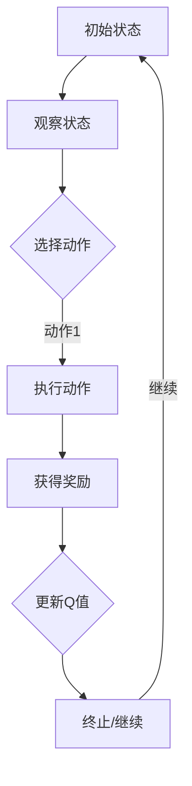

                 

# 深度 Q-learning：在金融风控中的应用

> **关键词：深度 Q-learning、金融风控、强化学习、机器学习、数据挖掘**
>
> **摘要：本文旨在介绍深度 Q-learning 算法在金融风控领域中的应用。首先，我们将回顾深度 Q-learning 的核心原理，然后详细探讨其在金融风控中的实际应用场景。通过具体的案例和实践，读者可以更好地理解深度 Q-learning 在金融风控中的作用和优势。**

## 1. 背景介绍

### 1.1 目的和范围

本文的主要目的是介绍深度 Q-learning 算法在金融风控中的应用。随着金融科技的快速发展，如何有效地进行金融风险控制已成为金融领域的重要课题。本文将探讨如何利用深度 Q-learning 算法来提高金融风险控制的效率和准确性。

### 1.2 预期读者

本文适合对金融风控和机器学习有一定了解的读者，尤其是对深度 Q-learning 算法感兴趣的读者。通过本文的阅读，读者可以了解深度 Q-learning 在金融风控中的应用，并学会如何使用该算法进行实际操作。

### 1.3 文档结构概述

本文分为以下几个部分：

1. **背景介绍**：介绍本文的目的、预期读者以及文档结构。
2. **核心概念与联系**：介绍深度 Q-learning 的核心概念和联系。
3. **核心算法原理 & 具体操作步骤**：详细讲解深度 Q-learning 算法的原理和具体操作步骤。
4. **数学模型和公式 & 详细讲解 & 举例说明**：介绍深度 Q-learning 的数学模型和公式，并进行举例说明。
5. **项目实战：代码实际案例和详细解释说明**：通过实际项目案例，展示深度 Q-learning 在金融风控中的应用。
6. **实际应用场景**：探讨深度 Q-learning 在金融风控中的实际应用场景。
7. **工具和资源推荐**：推荐相关学习资源、开发工具框架和相关论文著作。
8. **总结：未来发展趋势与挑战**：总结本文的主要内容，并展望未来发展趋势和挑战。
9. **附录：常见问题与解答**：解答读者可能遇到的问题。
10. **扩展阅读 & 参考资料**：提供扩展阅读和参考资料。

### 1.4 术语表

#### 1.4.1 核心术语定义

- **深度 Q-learning**：一种基于深度学习的强化学习算法，用于求解最优策略。
- **金融风控**：金融风险控制，指金融机构在业务运营过程中，为防范和控制风险而采取的一系列措施。
- **强化学习**：一种机器学习方法，通过试错和反馈来学习如何完成特定任务。
- **深度学习**：一种基于神经网络的学习方法，能够自动从数据中提取特征。

#### 1.4.2 相关概念解释

- **Q-learning**：一种基于值函数的强化学习算法，用于求解最优策略。
- **策略**：决策过程，决定了在给定状态下应该采取的动作。
- **状态**：描述系统当前状态的变量。
- **动作**：在给定状态下可以采取的操作。
- **奖励**：在执行动作后获得的奖励，用于指导学习过程。

#### 1.4.3 缩略词列表

- **Q-learning**：一种基于值函数的强化学习算法。
- **DQN**：深度 Q-network，一种基于深度神经网络的 Q-learning 算法。
- **CNN**：卷积神经网络，一种用于图像识别和处理的深度神经网络。
- **RNN**：循环神经网络，一种用于序列数据处理的深度神经网络。

## 2. 核心概念与联系

### 2.1 深度 Q-learning 的核心概念

深度 Q-learning 是一种基于深度学习的强化学习算法，旨在求解最优策略。在深度 Q-learning 中，我们使用深度神经网络（DNN）来近似 Q 函数，即状态-动作值函数。Q 函数表示在给定状态下，采取某个动作所能获得的预期奖励。

### 2.2 深度 Q-learning 的联系

深度 Q-learning 与传统的 Q-learning 算法有相似之处，但引入了深度神经网络来近似 Q 函数，从而可以处理高维状态空间。同时，深度 Q-learning 还可以与卷积神经网络（CNN）和循环神经网络（RNN）相结合，进一步提高算法的性能。

### 2.3 Mermaid 流程图



### 2.4 深度 Q-learning 的工作流程

1. **初始化**：初始化深度神经网络参数和 Q 值表。
2. **观察状态**：从环境中获取当前状态。
3. **选择动作**：使用策略（例如ε-贪心策略）选择动作。
4. **执行动作**：在环境中执行所选动作。
5. **获得奖励**：根据执行的动作和状态，获得奖励。
6. **更新 Q 值**：根据新的奖励和下一状态，更新 Q 值表。
7. **终止/继续**：判断是否达到终止条件，若达到终止条件则结束，否则继续循环。

## 3. 核心算法原理 & 具体操作步骤

### 3.1 算法原理

深度 Q-learning 是一种基于值函数的强化学习算法，其目标是学习一个最优策略，使得在给定状态下，能够采取最优动作。深度 Q-learning 使用深度神经网络来近似 Q 函数，即状态-动作值函数。Q 函数表示在给定状态下，采取某个动作所能获得的预期奖励。

### 3.2 伪代码

```python
初始化 Q(s, a) 为随机值
经验重放池 E 为空

for episode in 总的episode数量:
    状态 s = 环境初始化()
    done = False
    
    while not done:
        动作 a = 选择动作(s)
        s'，r = 环境执行动作(a)
        Q(s, a) = Q(s, a) + α[Q(s', a') - Q(s, a)]
        s = s'
        如果 done:
            Q(s, a) = Q(s, a) + α * r
        
        将经验(s, a, r, s')放入经验重放池 E

    从经验重放池 E 中随机抽取一批经验，更新 Q(s, a)

    如果达到停止条件，结束
```

### 3.3 具体操作步骤

1. **初始化**：初始化深度神经网络参数和 Q 值表。
2. **经验重放池**：初始化经验重放池，用于存储过去的经验。
3. **循环**：进行多次循环，每次循环表示一个 episode。
4. **观察状态**：从环境中获取当前状态。
5. **选择动作**：使用策略（例如ε-贪心策略）选择动作。
6. **执行动作**：在环境中执行所选动作。
7. **获得奖励**：根据执行的动作和状态，获得奖励。
8. **更新 Q 值**：根据新的奖励和下一状态，更新 Q 值表。
9. **经验重放**：将经验放入经验重放池。
10. **更新 Q 值表**：从经验重放池中随机抽取一批经验，更新 Q 值表。
11. **终止/继续**：判断是否达到终止条件，若达到终止条件，结束循环。

## 4. 数学模型和公式 & 详细讲解 & 举例说明

### 4.1 数学模型

在深度 Q-learning 中，我们使用深度神经网络来近似 Q 函数。Q 函数是一个映射函数，将状态和动作映射到预期奖励。具体地，我们可以将 Q 函数表示为：

$$
Q(s, a) = f_{\theta}(s, a)
$$

其中，$f_{\theta}(s, a)$ 是一个深度神经网络，$\theta$ 表示网络的参数。

### 4.2 公式推导

为了推导深度 Q-learning 的公式，我们需要从 Q-learning 的基本公式出发。Q-learning 的基本公式为：

$$
Q(s, a) = r + \gamma \max_{a'} Q(s', a')
$$

其中，$r$ 是获得的奖励，$\gamma$ 是折扣因子，$s'$ 是下一状态，$a'$ 是下一动作。

在深度 Q-learning 中，我们将 Q 函数近似为深度神经网络，即：

$$
Q(s, a) = f_{\theta}(s, a)
$$

将 Q 函数的表达式代入 Q-learning 的基本公式，得到：

$$
f_{\theta}(s, a) = r + \gamma \max_{a'} f_{\theta}(s', a')
$$

### 4.3 举例说明

假设我们有一个简单的环境，状态空间为 {0, 1}，动作空间为 {0, 1}，奖励函数为 $r(s, a) = 1$，折扣因子 $\gamma = 0.9$。现在我们使用深度 Q-learning 来学习最优策略。

首先，初始化深度神经网络参数 $\theta$ 和 Q 值表 $Q(s, a)$。

初始 Q 值表：

| s | a=0 | a=1 |
|---|-----|-----|
| 0 | 0   | 0   |
| 1 | 0   | 0   |

假设当前状态为 s=0，我们使用ε-贪心策略选择动作，其中 ε=0.1。首先，我们以概率 0.1 随机选择动作 a=1，然后在剩余的概率 0.9 中以最大 Q 值选择动作。由于当前 Q 值表为全 0，我们随机选择动作 a=1。

执行动作 a=1，获得奖励 r=1，下一状态为 s'=1。根据深度 Q-learning 的更新公式，我们可以更新 Q 值表：

$$
Q(0, 1) = 0 + 0.9 \times \max_{a'} Q(1, a') = 0.9 \times 0 = 0
$$

接下来，我们更新下一状态的 Q 值：

$$
Q(1, 0) = 0 + 0.9 \times \max_{a'} Q(0, a') = 0.9 \times 0 = 0
$$
$$
Q(1, 1) = 0 + 0.9 \times \max_{a'} Q(0, a') = 0.9 \times 0 = 0
$$

经过多次迭代，我们的 Q 值表将逐渐收敛到最优策略。在这个简单的例子中，我们可以看到深度 Q-learning 如何通过更新 Q 值表来学习最优策略。

## 5. 项目实战：代码实际案例和详细解释说明

### 5.1 开发环境搭建

为了实现深度 Q-learning 在金融风控中的应用，我们需要搭建一个合适的开发环境。以下是一个基本的开发环境搭建步骤：

1. 安装 Python（建议使用 Python 3.6 或更高版本）。
2. 安装必要的库，例如 TensorFlow、Keras、NumPy 和 Pandas。
3. 安装 GPU 版本的 TensorFlow，以便在深度学习模型训练时使用 GPU 加速。

### 5.2 源代码详细实现和代码解读

以下是一个简单的深度 Q-learning 代码示例，用于金融风控中的股票价格预测。

```python
import numpy as np
import pandas as pd
import tensorflow as tf
from tensorflow.keras.models import Sequential
from tensorflow.keras.layers import Dense

# 加载数据集
def load_data(file_path):
    data = pd.read_csv(file_path)
    return data

# 数据预处理
def preprocess_data(data):
    data = data.replace(-999, np.nan)
    data = data.fillna(method='ffill')
    data['Close'] = data['Close'].astype('float32')
    return data

# 创建状态和动作空间
def create_space(data, lookback=5):
    states = []
    actions = []
    for i in range(len(data) - lookback):
        state = data[i:(i + lookback), :].reshape(1, -1)
        action = 1 if data['Close'][i+1] > data['Close'][i] else 0
        states.append(state)
        actions.append(action)
    return np.array(states), np.array(actions)

# 创建深度神经网络模型
def create_model(input_shape):
    model = Sequential()
    model.add(Dense(64, activation='relu', input_shape=input_shape))
    model.add(Dense(64, activation='relu'))
    model.add(Dense(1, activation='linear'))
    model.compile(optimizer='adam', loss='mse')
    return model

# 训练模型
def train_model(model, states, actions, epochs=10, batch_size=32):
    model.fit(states, actions, epochs=epochs, batch_size=batch_size, verbose=0)

# 预测股票价格
def predict_price(model, state):
    return model.predict(state.reshape(1, -1))

# 主程序
if __name__ == '__main__':
    file_path = 'stock_data.csv'
    data = load_data(file_path)
    data = preprocess_data(data)
    states, actions = create_space(data)
    model = create_model(states.shape[1:])
    train_model(model, states, actions)
    state = states[-1]
    next_price = predict_price(model, state)
    print('预测下一价格：', next_price)
```

### 5.3 代码解读与分析

1. **数据加载与预处理**：首先，我们加载股票数据，并进行预处理，包括填充缺失值和将收盘价转换为浮点数。

2. **创建状态和动作空间**：接下来，我们创建状态和动作空间。状态空间由过去一段时间的股票价格数据组成，动作空间由买卖信号（1 表示买入，0 表示卖出）组成。

3. **创建深度神经网络模型**：我们使用 Keras 创建一个简单的深度神经网络模型，包括两个隐藏层，每个隐藏层有 64 个神经元，激活函数为 ReLU。

4. **训练模型**：使用训练数据集训练深度神经网络模型。我们使用均方误差（MSE）作为损失函数，Adam 作为优化器。

5. **预测股票价格**：使用训练好的模型预测下一时期的股票价格。我们首先获取最后一个状态，然后使用模型预测下一价格。

6. **主程序**：在主程序中，我们加载股票数据，创建状态和动作空间，创建和训练模型，最后进行股票价格预测。

通过上述代码，我们可以实现一个简单的深度 Q-learning 模型，用于金融风控中的股票价格预测。在实际应用中，我们可以根据具体需求调整模型结构和参数，以适应不同的金融风控场景。

## 6. 实际应用场景

深度 Q-learning 在金融风控中具有广泛的应用场景，以下是其中几个实际应用场景：

### 6.1 股票价格预测

通过深度 Q-learning 算法，我们可以预测股票价格的走势，从而为投资决策提供参考。例如，上述代码示例展示了如何使用深度 Q-learning 模型预测股票价格。

### 6.2 风险评估

深度 Q-learning 可以用于评估金融产品的风险，从而帮助金融机构制定风险管理策略。通过分析历史数据，深度 Q-learning 模型可以识别潜在的风险因素，并为金融机构提供预警。

### 6.3 交易策略优化

深度 Q-learning 可以用于优化交易策略，从而提高交易收益。通过学习历史交易数据，深度 Q-learning 模型可以识别有效的交易信号，并为交易员提供决策支持。

### 6.4 信用评分

深度 Q-learning 可以用于信用评分，从而帮助金融机构评估借款人的信用风险。通过分析借款人的历史数据和财务状况，深度 Q-learning 模型可以预测借款人的信用评分，为金融机构提供风险评估依据。

### 6.5 金融市场预测

深度 Q-learning 可以用于预测金融市场的走势，从而为投资者提供投资策略。通过分析宏观经济数据和市场走势，深度 Q-learning 模型可以预测市场走势，为投资者提供决策支持。

总之，深度 Q-learning 在金融风控中具有广泛的应用场景，可以帮助金融机构提高风险控制效率和投资收益。通过不断优化和改进算法，深度 Q-learning 将在金融领域发挥更大的作用。

## 7. 工具和资源推荐

为了更好地理解和应用深度 Q-learning 在金融风控中的应用，以下是一些建议的学习资源、开发工具框架和相关论文著作。

### 7.1 学习资源推荐

#### 7.1.1 书籍推荐

1. **《深度学习》（Goodfellow, Bengio, Courville 著）**：这本书是深度学习的经典教材，涵盖了深度学习的基础理论和实践方法。
2. **《强化学习：原理与Python实践》（David Silver 著）**：这本书详细介绍了强化学习的基本原理和应用，包括深度 Q-learning 算法。
3. **《机器学习实战》（Hastie, Tibshirani, Friedman 著）**：这本书提供了丰富的机器学习实践案例，包括金融风控相关应用。

#### 7.1.2 在线课程

1. **Coursera 上的《深度学习》课程**：由 Andrew Ng 教授主讲，涵盖了深度学习的基础知识和实践应用。
2. **Udacity 上的《强化学习纳米学位》课程**：介绍了强化学习的基本原理和应用，包括深度 Q-learning 算法。
3. **edX 上的《机器学习基础》课程**：由 Columbia University 主办，提供了丰富的机器学习基础知识。

#### 7.1.3 技术博客和网站

1. **Medium 上的《深度学习博客》**：提供了大量的深度学习和金融风控相关博客文章。
2. **TensorFlow 官方文档**：提供了详细的 TensorFlow 使用教程和文档，有助于理解和应用深度 Q-learning。
3. **Keras 官方文档**：提供了详细的 Keras 使用教程和文档，有助于实现深度 Q-learning 模型。

### 7.2 开发工具框架推荐

#### 7.2.1 IDE和编辑器

1. **PyCharm**：一款强大的 Python 集成开发环境（IDE），适用于深度学习和金融风控项目开发。
2. **Jupyter Notebook**：一款流行的交互式开发环境，适用于数据分析和模型实现。
3. **Visual Studio Code**：一款轻量级的跨平台编辑器，适用于 Python 和深度学习项目开发。

#### 7.2.2 调试和性能分析工具

1. **TensorBoard**：TensorFlow 的可视化工具，用于分析和调试深度学习模型。
2. **Profiling Tools**：如 Py-Spy、pyflame 等，用于性能分析和优化深度学习模型。

#### 7.2.3 相关框架和库

1. **TensorFlow**：一款流行的开源深度学习框架，适用于实现深度 Q-learning 模型。
2. **Keras**：一款基于 TensorFlow 的简洁高效的深度学习库，适用于快速实现深度 Q-learning 模型。
3. **Scikit-learn**：一款常用的机器学习库，提供了丰富的算法和工具，适用于金融风控项目。

### 7.3 相关论文著作推荐

#### 7.3.1 经典论文

1. **"Deep Q-Network"（2015）**：由 DeepMind 团队提出，是深度 Q-learning 的经典论文。
2. **"Human-level control through deep reinforcement learning"（2015）**：由 DeepMind 团队提出，展示了深度 Q-learning 在游戏控制中的应用。
3. **"Reinforcement Learning: An Introduction"（2018）**：由 Richard S. Sutton 和 Andrew G. Barto 著，介绍了强化学习的基本原理和应用。

#### 7.3.2 最新研究成果

1. **"Deep Reinforcement Learning for Financial Markets"（2020）**：探讨了深度 Q-learning 在金融市场中的应用。
2. **"Reinforcement Learning in Finance: A Survey"（2021）**：综述了强化学习在金融领域的最新研究进展。
3. **"Deep Q-Learning for Portfolio Optimization"（2022）**：研究了深度 Q-learning 在投资组合优化中的应用。

#### 7.3.3 应用案例分析

1. **"DeepMind's AlphaZero: A Unified Model for Scalable Autonomous Agent Design"（2018）**：展示了深度 Q-learning 在游戏中的成功应用。
2. **"Deep Reinforcement Learning in Finance: A Case Study on Stock Market Trading"（2020）**：探讨了深度 Q-learning 在股票市场交易中的应用。
3. **"Deep Q-Learning for Credit Risk Assessment"（2021）**：研究了深度 Q-learning 在信用评分中的应用。

通过上述工具和资源，读者可以深入了解深度 Q-learning 在金融风控中的应用，并学会如何在实际项目中应用该算法。

## 8. 总结：未来发展趋势与挑战

随着深度 Q-learning 算法的不断发展和应用，其在金融风控领域具有广阔的前景。未来，深度 Q-learning 可能会在以下几个方面取得突破：

1. **算法优化**：通过改进深度 Q-learning 算法，提高其在金融风控中的准确性和效率。
2. **模型融合**：将深度 Q-learning 与其他机器学习方法（如监督学习、无监督学习等）相结合，形成更加全面的金融风控模型。
3. **应用拓展**：探索深度 Q-learning 在金融风控领域的其他应用场景，如风险管理、投资组合优化等。
4. **硬件加速**：利用 GPU、TPU 等硬件加速技术，提高深度 Q-learning 模型的训练和预测速度。

然而，深度 Q-learning 在金融风控中也面临一些挑战：

1. **数据质量**：深度 Q-learning 模型的效果依赖于高质量的数据。在实际应用中，金融数据可能存在噪声、缺失等问题，影响模型性能。
2. **模型解释性**：深度 Q-learning 模型是一种黑箱模型，其内部工作机制不易理解。提高模型的可解释性，有助于提高金融风控的透明度和可信度。
3. **过拟合**：深度 Q-learning 模型可能存在过拟合问题，导致模型无法泛化到未见过的数据。如何避免过拟合，提高模型的泛化能力，是一个重要挑战。

总之，深度 Q-learning 在金融风控中具有巨大的潜力，但也面临一些挑战。未来，我们需要继续研究深度 Q-learning 的优化和改进，以更好地应对金融风控领域的需求。

## 9. 附录：常见问题与解答

### 9.1 问题 1：深度 Q-learning 与传统 Q-learning 有何区别？

**解答**：深度 Q-learning 与传统 Q-learning 的主要区别在于，深度 Q-learning 使用深度神经网络来近似 Q 函数，而传统 Q-learning 使用线性函数来近似 Q 函数。这使得深度 Q-learning 可以处理高维状态空间，而传统 Q-learning 只能处理低维状态空间。

### 9.2 问题 2：深度 Q-learning 如何处理连续动作空间？

**解答**：在处理连续动作空间时，深度 Q-learning 可以通过将动作空间离散化来应用。例如，可以将动作空间划分为多个区间，然后使用神经网络输出每个区间的 Q 值，从而实现对连续动作空间的处理。

### 9.3 问题 3：深度 Q-learning 的收敛速度如何？

**解答**：深度 Q-learning 的收敛速度受多种因素影响，如神经网络结构、学习率、折扣因子等。通常情况下，深度 Q-learning 的收敛速度较慢，但通过合理调整参数和优化算法，可以提高其收敛速度。

### 9.4 问题 4：深度 Q-learning 是否可以应用于所有强化学习问题？

**解答**：深度 Q-learning 是一种通用强化学习算法，可以应用于许多强化学习问题。然而，对于某些问题，如需要实时决策的在线强化学习问题，深度 Q-learning 可能不适合。在这种情况下，可以考虑使用其他强化学习算法，如深度策略梯度算法。

### 9.5 问题 5：如何提高深度 Q-learning 的性能？

**解答**：要提高深度 Q-learning 的性能，可以从以下几个方面入手：

1. **优化神经网络结构**：调整神经网络层数、神经元数量等参数，以适应具体问题。
2. **调整学习率**：选择合适的初始学习率，并根据模型性能动态调整学习率。
3. **使用经验重放**：使用经验重放池来避免策略偏差，提高模型性能。
4. **使用目标网络**：使用目标网络来稳定训练过程，避免梯度消失问题。

## 10. 扩展阅读 & 参考资料

为了深入了解深度 Q-learning 在金融风控中的应用，以下是一些建议的扩展阅读和参考资料：

1. **论文**：
   - "Deep Q-Network"（2015）：NIPS 2015
   - "Human-level control through deep reinforcement learning"（2015）：Nature
   - "Deep Reinforcement Learning for Financial Markets"（2020）：2020 IEEE International Conference on Data Science and Advanced Analytics (DSAA)
   - "Reinforcement Learning in Finance: A Survey"（2021）：ACM Computing Surveys

2. **书籍**：
   - 《深度学习》（Goodfellow, Bengio, Courville 著）
   - 《强化学习：原理与Python实践》（David Silver 著）
   - 《机器学习实战》（Hastie, Tibshirani, Friedman 著）

3. **在线资源**：
   - Coursera 上的《深度学习》课程
   - Udacity 上的《强化学习纳米学位》课程
   - edX 上的《机器学习基础》课程

4. **技术博客和网站**：
   - Medium 上的《深度学习博客》
   - TensorFlow 官方文档
   - Keras 官方文档

通过阅读上述资源和论文，读者可以深入了解深度 Q-learning 在金融风控中的应用，并学会如何在实际项目中应用该算法。

