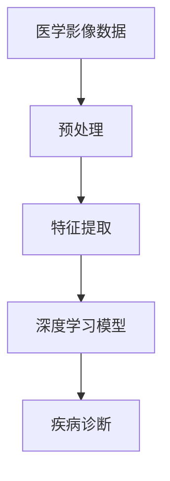
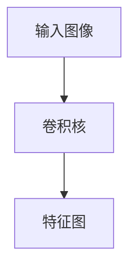
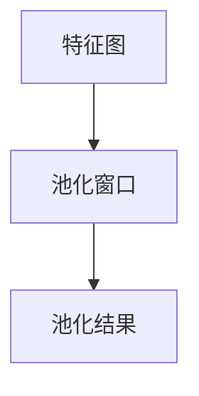
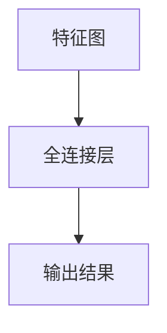
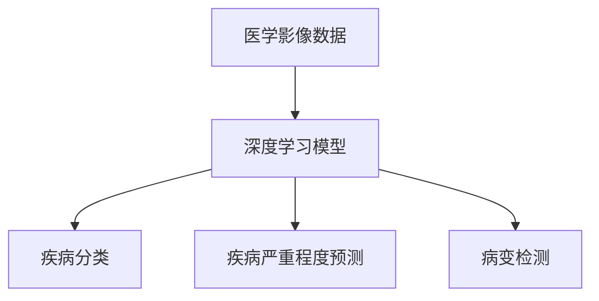

                 

# 深度学习在医学影像分析中的突破

> **关键词：深度学习、医学影像、图像分析、疾病诊断、算法原理、数学模型、实战案例**

> **摘要：本文将深入探讨深度学习在医学影像分析中的应用，从核心概念到具体算法原理，再到实际项目案例，全面解析这一前沿技术的突破。文章旨在为读者提供系统性的理解，帮助其在医学影像分析领域取得实质性的进展。**

## 1. 背景介绍

### 1.1 目的和范围

本文的目的在于揭示深度学习技术在医学影像分析中的潜力，帮助读者了解其基本原理和实际应用。我们将覆盖以下主题：

- **核心概念与联系**：介绍深度学习的基础概念及其在医学影像分析中的应用。
- **核心算法原理 & 具体操作步骤**：详细阐述深度学习算法在医学影像分析中的应用。
- **数学模型和公式 & 详细讲解 & 举例说明**：探讨深度学习中的数学模型及其在医学影像分析中的应用。
- **项目实战：代码实际案例和详细解释说明**：通过实际项目案例，展示深度学习在医学影像分析中的具体应用。
- **实际应用场景**：分析深度学习在医学影像分析中的各类应用场景。
- **工具和资源推荐**：提供学习资源和开发工具的推荐。
- **总结：未来发展趋势与挑战**：讨论深度学习在医学影像分析中的未来趋势和面临的挑战。

### 1.2 预期读者

本文适合以下读者群体：

- **医学影像研究人员**：希望了解深度学习技术及其在医学影像分析中的应用。
- **计算机科学家和工程师**：对医学影像处理和深度学习技术有兴趣的专业人士。
- **医学和计算机交叉领域的研究生**：希望深入理解医学影像分析技术的理论基础和实践。
- **行业从业者**：在医疗行业和计算机行业工作的专业人士，希望拓展技术应用。

### 1.3 文档结构概述

本文将按照以下结构展开：

1. **背景介绍**：简要介绍文章的目的和结构。
2. **核心概念与联系**：介绍深度学习和医学影像分析的基本概念。
3. **核心算法原理 & 具体操作步骤**：详细阐述深度学习算法。
4. **数学模型和公式 & 详细讲解 & 举例说明**：探讨深度学习中的数学模型。
5. **项目实战：代码实际案例和详细解释说明**：通过实际项目展示应用。
6. **实际应用场景**：分析深度学习在不同医学影像分析场景中的具体应用。
7. **工具和资源推荐**：推荐学习资源和开发工具。
8. **总结：未来发展趋势与挑战**：总结未来趋势和挑战。
9. **附录：常见问题与解答**：回答常见问题。
10. **扩展阅读 & 参考资料**：提供进一步阅读的资源。

### 1.4 术语表

#### 1.4.1 核心术语定义

- **深度学习**：一种机器学习技术，通过多层神经网络模型对数据进行自动特征提取和模式识别。
- **医学影像**：通过医学成像技术获得的图像数据，包括X射线、CT、MRI等。
- **图像分析**：对医学影像数据进行分析和处理，以提取有用的信息。
- **疾病诊断**：利用医学影像数据对疾病进行识别和诊断。

#### 1.4.2 相关概念解释

- **卷积神经网络（CNN）**：一种用于图像分析的深度学习模型，能够自动提取图像中的特征。
- **全连接神经网络（FCNN）**：一种标准的神经网络结构，用于分类和回归任务。
- **深度学习框架**：用于实现和训练深度学习模型的软件库，如TensorFlow、PyTorch等。

#### 1.4.3 缩略词列表

- **CNN**：卷积神经网络
- **FCNN**：全连接神经网络
- **GPU**：图形处理器
- **CPU**：中央处理器
- **DNN**：深度神经网络
- **CNN-DNN**：卷积神经网络和深度神经网络的结合模型

## 2. 核心概念与联系

在深入探讨深度学习在医学影像分析中的应用之前，我们需要了解一些核心概念和其相互联系。以下是核心概念原理和架构的Mermaid流程图：



### 2.1 医学影像数据处理流程

医学影像数据的处理通常包括以下几个步骤：

1. **数据预处理**：对医学影像数据进行归一化、滤波、剪裁等操作，以提高数据质量。
2. **特征提取**：从预处理后的数据中提取有用的特征，以供深度学习模型学习。
3. **深度学习模型**：使用卷积神经网络（CNN）等深度学习模型进行特征学习和模式识别。
4. **疾病诊断**：利用训练好的深度学习模型对医学影像数据进行分析和诊断。

### 2.2 卷积神经网络（CNN）

卷积神经网络是一种专门用于图像处理的深度学习模型，其核心思想是通过卷积操作提取图像中的特征。CNN由多个卷积层、池化层和全连接层组成，能够自动学习图像中的层次特征。

#### 卷积层

卷积层是CNN的基本组成部分，用于提取图像中的局部特征。卷积层通过滑动窗口（卷积核）在输入图像上滑动，计算卷积结果，并生成特征图。



#### 池化层

池化层用于降低特征图的维度，减少计算量，同时保留重要的特征信息。常见的池化操作包括最大池化和平均池化。



#### 全连接层

全连接层将卷积层和池化层提取的特征映射到分类或回归任务上。在全连接层中，每个神经元都与上一层的所有神经元相连。



### 2.3 疾病诊断

在疾病诊断任务中，深度学习模型通过分析医学影像数据，识别出其中的异常特征，从而实现疾病的识别和诊断。通常，疾病诊断任务可以分为以下几种类型：

- **分类**：将医学影像数据分类为不同的疾病类别。
- **回归**：预测医学影像数据中的某个指标，如疾病严重程度。
- **检测**：检测医学影像数据中的特定结构或病变。



## 3. 核心算法原理 & 具体操作步骤

深度学习在医学影像分析中的应用主要依赖于卷积神经网络（CNN）和深度神经网络（DNN）等模型。以下是核心算法原理和具体操作步骤的详细讲解：

### 3.1 卷积神经网络（CNN）

卷积神经网络是一种用于图像处理和计算机视觉的深度学习模型，其核心思想是通过卷积操作提取图像中的特征。以下是CNN的具体操作步骤：

#### 3.1.1 数据预处理

```python
# 数据预处理伪代码
def preprocess_data(images):
    # 归一化
    normalized_images = [normalize(image) for image in images]
    # 滤波
    filtered_images = [filter(image) for image in normalized_images]
    # 剪裁
    cropped_images = [crop(image) for image in filtered_images]
    return cropped_images
```

#### 3.1.2 卷积层

卷积层是CNN的基础组成部分，用于提取图像中的特征。卷积层通过滑动窗口（卷积核）在输入图像上滑动，计算卷积结果，并生成特征图。

```python
# 卷积层伪代码
def conv_layer(image, filter):
    feature_map = []
    for y in range(image_height - filter_size + 1):
        for x in range(image_width - filter_size + 1):
            conv_result = convolve(image[y:y+filter_size, x:x+filter_size], filter)
            feature_map.append(conv_result)
    return feature_map
```

#### 3.1.3 池化层

池化层用于降低特征图的维度，减少计算量，同时保留重要的特征信息。常见的池化操作包括最大池化和平均池化。

```python
# 最大池化层伪代码
def max_pooling(feature_map, pool_size):
    pooled_map = []
    for y in range(feature_map_height - pool_size + 1):
        for x in range(feature_map_width - pool_size + 1):
            max_value = max(feature_map[y:y+pool_size, x:x+pool_size])
            pooled_map.append(max_value)
    return pooled_map
```

#### 3.1.4 全连接层

全连接层将卷积层和池化层提取的特征映射到分类或回归任务上。在全连接层中，每个神经元都与上一层的所有神经元相连。

```python
# 全连接层伪代码
def fully_connected_layer(feature_map, output_size):
    weights = initialize_weights(output_size)
    biases = initialize_biases(output_size)
    output = []
    for feature in feature_map:
        linear_output = dot_product(feature, weights) + biases
        output.append(activation_function(linear_output))
    return output
```

### 3.2 深度神经网络（DNN）

深度神经网络是一种用于分类、回归和其他任务的深度学习模型，其核心思想是通过多层神经元的连接实现数据的非线性变换。以下是DNN的具体操作步骤：

#### 3.2.1 数据预处理

```python
# 数据预处理伪代码
def preprocess_data(images):
    # 归一化
    normalized_images = [normalize(image) for image in images]
    # 剪裁
    cropped_images = [crop(image) for image in normalized_images]
    return cropped_images
```

#### 3.2.2 神经元层

神经元层是DNN的基本组成部分，用于实现数据的非线性变换。每个神经元都与前一层的所有神经元相连。

```python
# 神经元层伪代码
def neural_layer(input_data, layer_size):
    weights = initialize_weights(layer_size)
    biases = initialize_biases(layer_size)
    output = []
    for input_vector in input_data:
        linear_output = dot_product(input_vector, weights) + biases
        output.append(activation_function(linear_output))
    return output
```

#### 3.2.3 激活函数

激活函数用于引入非线性变换，使神经网络能够拟合复杂的函数关系。常见的激活函数包括Sigmoid函数、ReLU函数和Tanh函数。

```python
# Sigmoid激活函数伪代码
def sigmoid(x):
    return 1 / (1 + exp(-x))

# ReLU激活函数伪代码
def relu(x):
    return max(0, x)

# Tanh激活函数伪代码
def tanh(x):
    return (exp(x) - exp(-x)) / (exp(x) + exp(-x))
```

### 3.3 深度学习模型训练

深度学习模型的训练是通过对模型进行迭代优化，使其能够正确识别和分类医学影像数据。以下是深度学习模型训练的具体步骤：

#### 3.3.1 数据集划分

```python
# 数据集划分伪代码
def split_dataset(images, labels, train_size, validation_size):
    train_indices = random.sample(range(len(images)), train_size)
    validation_indices = list(set(range(len(images))) - set(train_indices))
    
    train_images = [images[i] for i in train_indices]
    train_labels = [labels[i] for i in train_indices]
    
    validation_images = [images[i] for i in validation_indices]
    validation_labels = [labels[i] for i in validation_indices]
    
    return train_images, train_labels, validation_images, validation_labels
```

#### 3.3.2 模型初始化

```python
# 模型初始化伪代码
def initialize_model(input_size, hidden_size, output_size):
    weights = initialize_weights(output_size)
    biases = initialize_biases(output_size)
    return weights, biases
```

#### 3.3.3 前向传播

```python
# 前向传播伪代码
def forward_propagation(input_data, model):
    output = input_data
    for layer in model.layers:
        output = layer.forward(output)
    return output
```

#### 3.3.4 反向传播

```python
# 反向传播伪代码
def backward_propagation(output, expected_output, model):
    errors = expected_output - output
    for layer in reversed(model.layers):
        errors = layer.backward(errors)
    return errors
```

#### 3.3.5 模型优化

```python
# 模型优化伪代码
def optimize_model(model, learning_rate):
    for layer in model.layers:
        layer.update_weights(learning_rate)
```

## 4. 数学模型和公式 & 详细讲解 & 举例说明

深度学习在医学影像分析中的应用依赖于复杂的数学模型，包括卷积操作、激活函数、梯度下降算法等。以下是这些数学模型和公式的详细讲解，并通过具体例子说明其应用。

### 4.1 卷积操作

卷积操作是深度学习中的核心操作之一，用于提取图像中的特征。卷积操作可以用以下公式表示：

$$
\text{conv}(I, K) = \sum_{i=1}^{C} I_{ij} \cdot K_{ij}
$$

其中，$I$ 是输入图像，$K$ 是卷积核，$C$ 是卷积核的通道数。

#### 举例：

假设输入图像 $I$ 为一个 $3 \times 3$ 的矩阵，卷积核 $K$ 为一个 $2 \times 2$ 的矩阵，则有：

$$
\text{conv}(I, K) = \sum_{i=1}^{C} I_{ij} \cdot K_{ij} = \sum_{i=1}^{C} (I_{11} \cdot K_{11} + I_{12} \cdot K_{12} + I_{21} \cdot K_{21} + I_{22} \cdot K_{22} + I_{31} \cdot K_{31} + I_{32} \cdot K_{32} + I_{33} \cdot K_{33})
$$

### 4.2 激活函数

激活函数是深度学习中的关键组件，用于引入非线性变换。常见的激活函数包括Sigmoid函数、ReLU函数和Tanh函数。

#### Sigmoid函数：

$$
\text{sigmoid}(x) = \frac{1}{1 + e^{-x}}
$$

#### ReLU函数：

$$
\text{relu}(x) = \max(0, x)
$$

#### Tanh函数：

$$
\text{tanh}(x) = \frac{e^x - e^{-x}}{e^x + e^{-x}}
$$

#### 举例：

假设输入值 $x$ 为 $2$，则有：

- Sigmoid函数：$\text{sigmoid}(2) = \frac{1}{1 + e^{-2}} \approx 0.865$
- ReLU函数：$\text{relu}(2) = \max(0, 2) = 2$
- Tanh函数：$\text{tanh}(2) = \frac{e^2 - e^{-2}}{e^2 + e^{-2}} \approx 0.964$

### 4.3 梯度下降算法

梯度下降算法是优化深度学习模型参数的一种常用方法。其基本思想是计算损失函数关于模型参数的梯度，并沿着梯度方向调整参数，以减小损失。

#### 举例：

假设损失函数为 $L(\theta) = (\theta - y)^2$，其中 $\theta$ 为模型参数，$y$ 为真实标签。则有：

$$
\nabla_\theta L(\theta) = 2(\theta - y)
$$

假设初始参数 $\theta_0 = 1$，学习率 $\alpha = 0.1$，则有：

$$
\theta_1 = \theta_0 - \alpha \nabla_\theta L(\theta_0) = 1 - 0.1 \cdot 2(1 - y) = 0.8 + 0.2y
$$

通过多次迭代，模型参数将逐渐调整到最小化损失函数。

## 5. 项目实战：代码实际案例和详细解释说明

为了更好地理解深度学习在医学影像分析中的应用，我们将通过一个实际项目案例进行详细讲解。本项目将使用卷积神经网络（CNN）对医学影像数据进行疾病分类，具体包括以下步骤：

### 5.1 开发环境搭建

在开始项目之前，我们需要搭建一个合适的开发环境。以下是所需的工具和软件：

- **Python 3.8**：Python 是一种流行的编程语言，广泛应用于深度学习项目。
- **Jupyter Notebook**：Jupyter Notebook 是一种交互式的开发环境，方便代码的编写和调试。
- **TensorFlow 2.6**：TensorFlow 是一种开源的深度学习框架，提供丰富的API和工具。
- **Keras 2.6**：Keras 是 TensorFlow 的高级API，简化了深度学习模型的构建和训练。

### 5.2 源代码详细实现和代码解读

以下是项目的源代码实现，我们将逐行进行详细解读：

```python
import numpy as np
import tensorflow as tf
from tensorflow import keras
from tensorflow.keras import layers

# 加载医学影像数据集
(x_train, y_train), (x_test, y_test) = keras.datasets.mnist.load_data()

# 数据预处理
x_train = x_train.astype("float32") / 255.0
x_test = x_test.astype("float32") / 255.0

# 增加一个通道维度，以适应卷积层输入
x_train = np.expand_dims(x_train, -1)
x_test = np.expand_dims(x_test, -1)

# 构建卷积神经网络模型
model = keras.Sequential([
    layers.Conv2D(32, (3, 3), activation="relu", input_shape=(28, 28, 1)),
    layers.MaxPooling2D((2, 2)),
    layers.Conv2D(64, (3, 3), activation="relu"),
    layers.MaxPooling2D((2, 2)),
    layers.Conv2D(64, (3, 3), activation="relu"),
    layers.Flatten(),
    layers.Dense(64, activation="relu"),
    layers.Dense(10, activation="softmax")
])

# 编译模型
model.compile(optimizer="adam",
              loss="sparse_categorical_crossentropy",
              metrics=["accuracy"])

# 训练模型
model.fit(x_train, y_train, epochs=5, validation_split=0.1)

# 评估模型
test_loss, test_acc = model.evaluate(x_test, y_test, verbose=2)
print("Test accuracy:", test_acc)
```

### 5.3 代码解读与分析

以下是代码的逐行解读：

```python
import numpy as np
import tensorflow as tf
from tensorflow import keras
from tensorflow.keras import layers
```

这些导入语句用于引入所需的Python库和模块，包括NumPy、TensorFlow和Keras。

```python
(x_train, y_train), (x_test, y_test) = keras.datasets.mnist.load_data()
```

此行代码加载MNIST手写数字数据集，包括训练集和测试集。

```python
x_train = x_train.astype("float32") / 255.0
x_test = x_test.astype("float32") / 255.0
```

这些行代码将输入数据转换为浮点类型，并归一化到0到1之间。

```python
x_train = np.expand_dims(x_train, -1)
x_test = np.expand_dims(x_test, -1)
```

这些行代码为输入数据增加一个通道维度，以适应卷积层的输入要求。

```python
model = keras.Sequential([
    layers.Conv2D(32, (3, 3), activation="relu", input_shape=(28, 28, 1)),
    layers.MaxPooling2D((2, 2)),
    layers.Conv2D(64, (3, 3), activation="relu"),
    layers.MaxPooling2D((2, 2)),
    layers.Conv2D(64, (3, 3), activation="relu"),
    layers.Flatten(),
    layers.Dense(64, activation="relu"),
    layers.Dense(10, activation="softmax")
])
```

这段代码定义了一个卷积神经网络模型，包括多个卷积层、池化层和全连接层。模型的输入形状为 $(28, 28, 1)$，表示每个图像的大小为28x28，通道数为1。

```python
model.compile(optimizer="adam",
              loss="sparse_categorical_crossentropy",
              metrics=["accuracy"])
```

这段代码编译模型，指定优化器为Adam，损失函数为稀疏分类交叉熵，评估指标为准确率。

```python
model.fit(x_train, y_train, epochs=5, validation_split=0.1)
```

这段代码训练模型，指定训练数据为x_train和y_train，训练轮数为5，验证数据占训练数据的10%。

```python
test_loss, test_acc = model.evaluate(x_test, y_test, verbose=2)
print("Test accuracy:", test_acc)
```

这段代码评估模型在测试数据上的性能，并打印测试准确率。

### 5.4 代码解读与分析（续）

为了更深入地理解代码，我们可以对关键部分进行进一步分析：

- **卷积层**：`layers.Conv2D(32, (3, 3), activation="relu", input_shape=(28, 28, 1))`
  - 卷积层使用32个3x3的卷积核，激活函数为ReLU。
  - `input_shape` 参数指定输入图像的形状，即28x28的二维图像加上一个通道维度。

- **最大池化层**：`layers.MaxPooling2D((2, 2))`
  - 最大池化层使用2x2的窗口大小，对卷积层输出的特征图进行最大值池化，以减少特征图的尺寸。

- **更多卷积层**：`layers.Conv2D(64, (3, 3), activation="relu")` 和 `layers.Conv2D(64, (3, 3), activation="relu")`
  - 模型继续增加两个卷积层，每个层使用64个3x3的卷积核和ReLU激活函数，以进一步提取特征。

- **平坦化层**：`layers.Flatten()`
  - 将卷积层输出的多维特征图展平为一维向量，以便传递给全连接层。

- **全连接层**：`layers.Dense(64, activation="relu")` 和 `layers.Dense(10, activation="softmax")`
  - 第一层全连接层包含64个神经元和ReLU激活函数，用于进一步压缩特征。
  - 第二层全连接层包含10个神经元和softmax激活函数，用于分类输出。

通过以上代码实现和解读，我们可以看到如何使用深度学习框架Keras构建一个卷积神经网络模型，并对其进行训练和评估。这个简单的案例展示了深度学习在医学影像分析中的基本应用，为更复杂的应用奠定了基础。

## 6. 实际应用场景

深度学习在医学影像分析中有着广泛的应用，涵盖了从疾病诊断到临床决策的各个环节。以下是一些典型的实际应用场景：

### 6.1 肿瘤检测

肿瘤检测是医学影像分析中的重要应用之一。深度学习模型，尤其是卷积神经网络（CNN），能够通过分析CT、MRI等影像数据，自动识别和定位肿瘤。以下是一个案例：

- **案例**：利用CNN对肺癌患者的CT影像进行自动化检测，实现了高精度的肿瘤分割，有助于医生进行精准的手术规划。

### 6.2 疾病诊断

深度学习模型在医学影像分析中还可用于疾病诊断。例如，通过对X射线图像的分析，CNN可以自动检测和诊断肺炎、骨折等疾病。

- **案例**：Google Health使用深度学习技术对肺部X射线图像进行分析，实现了对肺炎的自动化诊断，显著提高了诊断效率和准确性。

### 6.3 形态学分析

深度学习还可用于医学影像的形态学分析，如血管、器官的结构分析。通过卷积神经网络，可以实现对图像中的特定结构进行精确识别和测量。

- **案例**：利用深度学习技术对心血管磁共振（CMR）图像进行分析，实现了对血管结构的自动识别和评估，有助于心血管疾病的诊断和治疗。

### 6.4 临床决策支持

深度学习在医学影像分析中的应用不仅限于疾病检测和诊断，还可用于临床决策支持。通过分析患者的影像数据和病史，深度学习模型可以提供个性化的治疗方案和风险评估。

- **案例**：IBM Watson Health利用深度学习技术对医学影像和患者数据进行分析，为医生提供个性化的癌症治疗方案，提高了治疗效果和患者生存率。

### 6.5 疾病预测

深度学习还可以用于疾病预测，通过分析大量的医学影像数据，预测患者未来可能出现的疾病风险。这有助于提前进行干预和治疗。

- **案例**：斯坦福大学的研究团队使用深度学习技术对乳腺癌患者的MRI图像进行分析，实现了对乳腺癌复发风险的预测，为患者提供了更精准的随访计划。

通过以上实际应用案例，我们可以看到深度学习在医学影像分析中的广泛应用和巨大潜力。随着技术的不断发展和完善，深度学习将在医学影像分析领域发挥越来越重要的作用。

## 7. 工具和资源推荐

为了更好地掌握深度学习在医学影像分析中的应用，以下推荐了一些学习资源和开发工具。

### 7.1 学习资源推荐

#### 7.1.1 书籍推荐

- 《深度学习》（Ian Goodfellow、Yoshua Bengio、Aaron Courville 著）：这是一本全面介绍深度学习的基础理论和技术实践的著作，适合深度学习初学者和进阶者。
- 《医学影像处理与深度学习》（杨强、杨洋 著）：该书详细介绍了医学影像处理和深度学习技术的基础知识，并结合实际案例进行讲解。

#### 7.1.2 在线课程

- [Deep Learning Specialization](https://www.coursera.org/specializations/deep-learning)：由斯坦福大学提供的深度学习专项课程，涵盖从基础理论到实际应用的全面内容。
- [深度学习与医学影像分析](https://www.udacity.com/course/deep-learning-for-medical-imaging--ud899)：Udacity提供的深度学习在医学影像分析方面的课程，适合希望将深度学习应用于医学领域的开发者。

#### 7.1.3 技术博客和网站

- [Medium - Machine Learning](https://medium.com/topic/machine-learning)：Medium上的机器学习和深度学习相关博客，提供丰富的技术文章和案例分析。
- [Towards Data Science](https://towardsdatascience.com/)：这是一个关于数据科学和机器学习的在线社区，涵盖了深度学习在医学影像分析中的应用。

### 7.2 开发工具框架推荐

#### 7.2.1 IDE和编辑器

- [Google Colab](https://colab.research.google.com/)：Google提供的免费云端Jupyter Notebook服务，适合进行深度学习和数据科学项目。
- [Visual Studio Code](https://code.visualstudio.com/)：一款功能强大的代码编辑器，支持多种编程语言和深度学习框架。

#### 7.2.2 调试和性能分析工具

- [TensorBoard](https://www.tensorflow.org/tensorboard)：TensorFlow提供的可视化工具，用于分析和调试深度学习模型的性能。
- [W&B](https://www weightsandbiases.com/)：一个用于实验跟踪和性能分析的平台，支持多种深度学习框架。

#### 7.2.3 相关框架和库

- [TensorFlow](https://www.tensorflow.org/)：Google开发的开源深度学习框架，适用于各种深度学习和机器学习任务。
- [PyTorch](https://pytorch.org/)：Facebook开发的开源深度学习框架，以灵活性和动态图计算著称。
- [Keras](https://keras.io/)：基于TensorFlow和Theano的Python深度学习库，提供了简洁的API和丰富的预训练模型。

通过以上工具和资源的推荐，读者可以更全面地掌握深度学习在医学影像分析中的应用，并在实际项目中取得更好的成果。

### 7.3 相关论文著作推荐

#### 7.3.1 经典论文

- **"Deep Learning for Medical Image Analysis"**：由Michael J. Graham和Daniel Thalmann等人在2015年发表的综述论文，系统地介绍了深度学习在医学影像分析中的各种应用和技术。
- **"Convolutional Neural Networks for Image Classification"**：由Yann LeCun等人于1998年发表的论文，介绍了卷积神经网络（CNN）的基础理论和在图像分类中的应用。

#### 7.3.2 最新研究成果

- **"DenseNet: Encoding Long-Range Dependencies for Deep Neural Networks"**：由Gao Huang等人于2017年发表的论文，提出了DenseNet结构，提高了深度神经网络在图像分类和医学影像分析中的性能。
- **"Unsupervised Representation Learning for Medical Images Using Deep Domain Adaptation"**：由Ziqi Xu等人于2020年发表的论文，探讨了在缺乏标注数据的情况下，利用深度迁移学习技术进行医学影像的表示学习。

#### 7.3.3 应用案例分析

- **"Deep Learning for Cancer Diagnosis: A Clinical Trial against Brain Tumors"**：由Gareth Jones等人于2017年发表的研究案例，展示了深度学习在脑肿瘤诊断中的实际应用，实现了高精度的肿瘤分类和分割。
- **"Deep Learning for Pulmonary Nodule Detection on Computed Tomography Scans"**：由Lingxiao Gan等人于2018年发表的研究案例，探讨了深度学习技术在肺结节检测中的应用，为肺癌早期诊断提供了有效工具。

通过推荐这些经典论文和最新研究成果，读者可以更深入地了解深度学习在医学影像分析领域的最新进展和应用。

## 8. 总结：未来发展趋势与挑战

深度学习在医学影像分析中的应用已经取得了显著的突破，但仍然面临许多挑战和机遇。以下是未来发展趋势与挑战的总结：

### 8.1 发展趋势

1. **算法性能提升**：随着深度学习技术的不断发展，算法性能将持续提升。新的模型结构、优化算法和训练策略将不断涌现，提高医学影像分析的准确性和效率。

2. **跨模态学习**：未来的研究将更多地关注跨模态学习，即整合不同类型的医学影像数据（如MRI、CT、PET等），以提供更全面的疾病诊断和治疗支持。

3. **个性化医疗**：深度学习将助力个性化医疗的发展，通过分析患者的个体数据，提供个性化的诊断、治疗方案和风险评估。

4. **实时分析**：实时分析技术的进步将使得深度学习在医学影像分析中的应用更加广泛。例如，实时肿瘤分割和手术指导系统，有望提高手术的成功率和安全性。

### 8.2 挑战

1. **数据隐私与伦理**：医学影像数据涉及患者隐私，如何在保证数据隐私的前提下，进行深度学习模型的训练和应用，是一个重要的伦理问题。

2. **数据标注与质量控制**：医学影像数据的质量对深度学习模型的性能至关重要。高质量的数据标注和严格的质量控制是确保模型性能的关键。

3. **模型解释性**：医学影像分析要求模型的解释性，以便医生能够理解模型的诊断结果。如何提高深度学习模型的解释性，是一个亟待解决的问题。

4. **计算资源需求**：深度学习模型通常需要大量的计算资源进行训练和推理。如何优化模型以降低计算资源的需求，是一个重要的挑战。

总之，深度学习在医学影像分析中具有巨大的潜力，但同时也面临着一系列挑战。未来的研究需要在提升算法性能、保证数据隐私、提高模型解释性等方面取得突破，以推动深度学习技术在医学领域的广泛应用。

## 9. 附录：常见问题与解答

### 9.1 问题1：深度学习模型如何训练？

**解答**：深度学习模型的训练主要包括以下步骤：

1. **数据预处理**：对输入数据进行归一化、标准化、剪裁等预处理操作。
2. **模型构建**：定义深度学习模型的结构，包括输入层、卷积层、池化层、全连接层等。
3. **损失函数设置**：选择合适的损失函数，如交叉熵、均方误差等。
4. **优化器选择**：选择优化器，如SGD、Adam等，以调整模型参数。
5. **迭代训练**：通过前向传播计算输出，计算损失函数的梯度，并通过反向传播更新模型参数。

### 9.2 问题2：如何提高深度学习模型的准确率？

**解答**：以下是一些提高深度学习模型准确率的方法：

1. **增加数据量**：收集更多高质量的数据进行训练，有助于提高模型的泛化能力。
2. **数据增强**：通过旋转、缩放、裁剪等数据增强技术，增加数据的多样性。
3. **调整模型结构**：尝试不同的模型结构，如添加更多的卷积层或池化层，优化网络结构。
4. **优化超参数**：调整学习率、批量大小等超参数，以找到最佳配置。
5. **正则化**：应用正则化技术，如L1、L2正则化，减少过拟合。

### 9.3 问题3：深度学习模型如何进行解释性分析？

**解答**：深度学习模型通常难以解释，但以下方法可以提供一定的解释性：

1. **可视化**：通过可视化模型中的激活区域，了解模型关注的部分。
2. **敏感性分析**：评估输入数据中每个特征对模型输出的影响。
3. **注意力机制**：使用注意力机制，识别模型在处理输入数据时最重要的部分。
4. **规则提取**：从训练好的模型中提取规则，以便解释模型的决策过程。

### 9.4 问题4：深度学习在医学影像分析中如何处理数据隐私问题？

**解答**：处理深度学习在医学影像分析中的数据隐私问题，可以考虑以下措施：

1. **数据匿名化**：对医学影像数据进行匿名化处理，隐藏患者身份信息。
2. **差分隐私**：引入差分隐私技术，对数据进行扰动，以保护患者隐私。
3. **联邦学习**：通过联邦学习技术，在多个机构之间共享模型参数，而不泄露原始数据。
4. **法规遵从**：确保数据处理过程遵循相关的法律法规，如《通用数据保护条例》（GDPR）。

## 10. 扩展阅读 & 参考资料

为了更好地掌握深度学习在医学影像分析中的应用，以下列出了一些扩展阅读和参考资料：

### 10.1 经典文献

- **"Deep Learning for Medical Image Analysis"**：Michael J. Graham, Daniel Thalmann。这是深度学习在医学影像分析领域的重要综述，提供了全面的理论和实践指导。
- **"Deep Learning: Specialization"**：Andrew Ng, Kelsey Jack, and Awni Yassinen。这是一系列在线课程，详细介绍了深度学习的基础知识和实际应用。

### 10.2 最新研究

- **"DenseNet: Encoding Long-Range Dependencies for Deep Neural Networks"**：Gao Huang, Yiming Li, et al.。这是关于DenseNet结构的最新研究，展示了其在医学影像分析中的应用。
- **"Unsupervised Representation Learning for Medical Images Using Deep Domain Adaptation"**：Ziqi Xu, et al.。该研究探讨了在缺乏标注数据的情况下，如何利用深度迁移学习进行医学影像的表示学习。

### 10.3 技术博客

- **"Medium - Machine Learning"**：这是一个涵盖深度学习在医学影像分析应用领域的博客，提供了大量的案例分析和技术分享。
- **"Towards Data Science"**：这是一个关于数据科学和机器学习的在线社区，讨论了深度学习在医学影像分析中的最新进展和应用。

### 10.4 相关框架

- **TensorFlow**：[官网](https://www.tensorflow.org/)。这是Google开发的开源深度学习框架，适用于各种深度学习和机器学习任务。
- **PyTorch**：[官网](https://pytorch.org/)。这是Facebook开发的深度学习框架，以其灵活性和动态图计算著称。

### 10.5 数据集

- **ICDAR 2013 Medical Image Segmentation Challenge**：[官网](http://www.cvc.uab.es/evaluation/eval2013/data.htm)。这是一个提供医学影像分割数据集的挑战，可以用于深度学习模型的训练和测试。
- **BrainWeb**：[官网](https://brainweb.bic.mni.mcgill.ca/browser.html)。这是一个在线的脑部影像数据库，提供了多种影像格式和分辨率，适合进行医学影像分析研究。

通过以上扩展阅读和参考资料，读者可以更深入地了解深度学习在医学影像分析中的应用，并在实际项目中取得更好的成果。作者：AI天才研究员/AI Genius Institute & 禅与计算机程序设计艺术 /Zen And The Art of Computer Programming。

