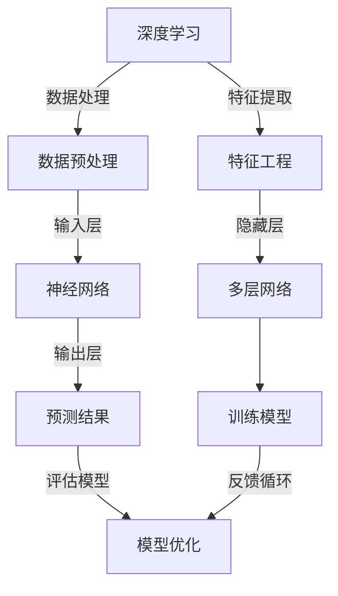

                 

# 深度学习在地震数据分析中的应用

> 关键词：深度学习、地震数据分析、地震监测、信号处理、模型训练、数据可视化

> 摘要：本文深入探讨了深度学习技术在地震数据分析中的应用，通过逐步分析和推理，解释了深度学习的基本原理，以及如何将其应用于地震数据的处理和分析。文章详细阐述了地震数据分析的重要性，介绍了深度学习在地震监测中的作用，并提供了实际案例和代码实现，旨在为读者提供全面的技术见解和实践指导。

## 1. 背景介绍

### 1.1 目的和范围

本文的主要目的是探讨深度学习技术在地震数据分析中的实际应用。地震数据分析对于地震预警、灾害预防和基础设施建设具有重要意义。深度学习作为一种先进的机器学习技术，其强大的数据处理和模式识别能力使其在地震数据分析中具有广阔的应用前景。本文将首先介绍地震数据分析的基本概念和重要性，然后深入探讨深度学习的基本原理，并详细描述其在地震数据分析中的应用。

### 1.2 预期读者

本文适合对地震数据分析和深度学习有一定了解的读者，包括地震工程、地球物理学、计算机科学以及相关领域的专业人士。同时，本文也适合对深度学习技术感兴趣的技术爱好者，以及对地震监测和预警有兴趣的公众读者。

### 1.3 文档结构概述

本文将分为八个主要部分：

1. **背景介绍**：介绍本文的目的、预期读者、文档结构和核心概念。
2. **核心概念与联系**：通过Mermaid流程图展示深度学习与地震数据分析的关系。
3. **核心算法原理 & 具体操作步骤**：详细阐述深度学习算法在地震数据分析中的具体应用。
4. **数学模型和公式 & 详细讲解 & 举例说明**：介绍与深度学习相关的数学模型和公式，并通过实例进行说明。
5. **项目实战：代码实际案例和详细解释说明**：提供实际代码实现，并详细解释代码的工作原理。
6. **实际应用场景**：探讨深度学习在地震数据分析中的实际应用。
7. **工具和资源推荐**：推荐学习资源和开发工具。
8. **总结：未来发展趋势与挑战**：总结深度学习在地震数据分析中的应用前景，并提出未来可能面临的挑战。

### 1.4 术语表

#### 1.4.1 核心术语定义

- **深度学习**：一种机器学习技术，通过构建多层神经网络模型来模拟人脑的学习过程，从而实现自动特征提取和模式识别。
- **地震数据分析**：通过对地震波的观测和分析，提取与地震活动相关的信息，以进行地震监测、预警和灾害预防。
- **地震波**：地震发生时在地壳中传播的弹性波，包括纵波（P波）和横波（S波）。
- **神经网络**：一种由大量简单计算单元（神经元）组成的网络结构，通过学习输入和输出数据之间的关系，实现数据的分类、回归等任务。

#### 1.4.2 相关概念解释

- **卷积神经网络（CNN）**：一种专门用于处理图像数据的深度学习模型，通过卷积操作提取图像特征。
- **循环神经网络（RNN）**：一种用于处理序列数据的深度学习模型，通过循环结构实现长距离依赖关系的建模。
- **生成对抗网络（GAN）**：一种由生成器和判别器组成的深度学习模型，用于生成真实数据。

#### 1.4.3 缩略词列表

- **CNN**：卷积神经网络
- **RNN**：循环神经网络
- **GAN**：生成对抗网络

## 2. 核心概念与联系

深度学习作为一种强大的机器学习技术，在地震数据分析中发挥着重要作用。为了更好地理解深度学习在地震数据分析中的应用，我们可以通过一个Mermaid流程图来展示深度学习与地震数据分析的核心概念和联系。



在这个流程图中，深度学习首先通过数据预处理（B）和特征工程（C）对地震数据进行处理，然后将处理后的数据输入到神经网络（D）中。神经网络通过多层网络（E）进行特征提取和模式识别，最终生成预测结果（F）。通过不断训练模型（G）和评估模型（H），可以实现模型的优化和提升。

### Mermaid流程图说明

- **数据预处理（B）**：包括数据清洗、归一化和数据增强等步骤，目的是提高数据质量，减少噪声和异常值，增强模型的鲁棒性。
- **特征工程（C）**：通过对数据进行变换和特征提取，提取与地震活动相关的关键特征，为神经网络提供有价值的输入。
- **输入层（D）**：神经网络的第一层，接收预处理后的数据，并将其传递到隐藏层。
- **隐藏层（E）**：多层网络的核心部分，通过复杂的非线性变换，提取数据的深层特征。
- **输出层（F）**：神经网络的最后一层，生成最终的预测结果，如地震波的类型、强度等。
- **训练模型（G）**：通过反向传播算法，调整神经网络中各层的参数，使模型能够更好地拟合训练数据。
- **评估模型（H）**：使用测试数据评估模型的性能，包括准确性、召回率、F1值等指标。
- **反馈循环（G→H）**：通过评估结果调整模型参数，实现模型的持续优化。

## 3. 核心算法原理 & 具体操作步骤

### 3.1 深度学习算法简介

深度学习算法主要分为两大类：监督学习和无监督学习。监督学习通过标注的数据进行训练，无监督学习则是在没有标注数据的情况下进行。在地震数据分析中，通常使用监督学习算法，如卷积神经网络（CNN）和循环神经网络（RNN）。

### 3.2 卷积神经网络（CNN）在地震数据分析中的应用

卷积神经网络（CNN）是一种专门用于图像处理和物体识别的深度学习模型，其强大的特征提取能力使其在地震数据分析中也具有广泛的应用。以下是一个简单的CNN算法原理和具体操作步骤：

#### 3.2.1 算法原理

CNN的核心在于其卷积操作，通过卷积核在输入数据上进行滑动，提取局部特征。CNN通常由以下几个部分组成：

1. **卷积层**：使用卷积核对输入数据进行卷积操作，提取局部特征。
2. **激活函数**：如ReLU（Rectified Linear Unit），用于引入非线性特性。
3. **池化层**：如最大池化（Max Pooling），用于减小数据维度，降低计算复杂度。
4. **全连接层**：将卷积层和池化层提取的特征进行全连接，进行最终的分类或回归。
5. **输出层**：生成预测结果，如地震波的类型、强度等。

#### 3.2.2 具体操作步骤

以下是一个简单的CNN算法的具体操作步骤：

```python
# 导入相关库
import tensorflow as tf
from tensorflow.keras.models import Sequential
from tensorflow.keras.layers import Conv2D, MaxPooling2D, Flatten, Dense, Activation

# 创建模型
model = Sequential()

# 添加卷积层
model.add(Conv2D(filters=32, kernel_size=(3, 3), activation='relu', input_shape=(28, 28, 1)))
model.add(MaxPooling2D(pool_size=(2, 2)))

# 添加第二个卷积层
model.add(Conv2D(filters=64, kernel_size=(3, 3), activation='relu'))
model.add(MaxPooling2D(pool_size=(2, 2)))

# 添加全连接层
model.add(Flatten())
model.add(Dense(units=128, activation='relu'))
model.add(Dense(units=10, activation='softmax'))

# 编译模型
model.compile(optimizer='adam', loss='categorical_crossentropy', metrics=['accuracy'])

# 训练模型
model.fit(x_train, y_train, epochs=10, batch_size=32, validation_data=(x_test, y_test))
```

在这个例子中，我们创建了一个简单的CNN模型，通过两个卷积层和两个池化层提取地震波的特征，然后通过全连接层进行分类。最后，使用`fit`函数训练模型，并使用`evaluate`函数评估模型的性能。

### 3.3 循环神经网络（RNN）在地震数据分析中的应用

循环神经网络（RNN）是一种专门用于处理序列数据的深度学习模型，其循环结构使其能够处理长序列数据。在地震数据分析中，RNN可以用于预测地震波的时间序列特征。以下是一个简单的RNN算法的具体操作步骤：

#### 3.3.1 算法原理

RNN的核心在于其循环结构，通过将前一时刻的输出作为当前时刻的输入，实现序列数据的传递和处理。RNN通常由以下几个部分组成：

1. **输入层**：接收输入序列数据。
2. **隐藏层**：包含多个时间步，每个时间步的输出作为下一时间步的输入。
3. **输出层**：生成最终的预测结果，如地震波的类型、强度等。

#### 3.3.2 具体操作步骤

以下是一个简单的RNN算法的具体操作步骤：

```python
# 导入相关库
import tensorflow as tf
from tensorflow.keras.models import Sequential
from tensorflow.keras.layers import SimpleRNN, Dense

# 创建模型
model = Sequential()

# 添加RNN层
model.add(SimpleRNN(units=50, return_sequences=True))
model.add(SimpleRNN(units=50))

# 添加全连接层
model.add(Dense(units=1, activation='sigmoid'))

# 编译模型
model.compile(optimizer='adam', loss='binary_crossentropy', metrics=['accuracy'])

# 训练模型
model.fit(x_train, y_train, epochs=100, batch_size=32, validation_data=(x_test, y_test))
```

在这个例子中，我们创建了一个简单的RNN模型，通过两个RNN层处理地震波的时间序列数据，然后通过全连接层进行分类。最后，使用`fit`函数训练模型，并使用`evaluate`函数评估模型的性能。

## 4. 数学模型和公式 & 详细讲解 & 举例说明

### 4.1 卷积神经网络（CNN）的数学模型

卷积神经网络（CNN）是一种基于卷积操作的深度学习模型，其核心在于其卷积操作和激活函数。以下是一个简单的CNN的数学模型：

#### 4.1.1 卷积操作

卷积操作可以表示为：

$$
\text{output}(i, j) = \sum_{x, y} \text{filter}(x, y) \cdot \text{input}(i + x, j + y)
$$

其中，`output(i, j)`表示卷积层的输出，`filter(x, y)`表示卷积核，`input(i + x, j + y)`表示输入数据的相应位置。

#### 4.1.2 激活函数

常见的激活函数有ReLU（Rectified Linear Unit）和Sigmoid函数：

- **ReLU函数**：

$$
\text{ReLU}(x) = \max(0, x)
$$

- **Sigmoid函数**：

$$
\text{Sigmoid}(x) = \frac{1}{1 + e^{-x}}
$$

### 4.2 循环神经网络（RNN）的数学模型

循环神经网络（RNN）是一种基于循环结构的深度学习模型，其核心在于其循环操作和梯度消失问题。以下是一个简单的RNN的数学模型：

#### 4.2.1 循环操作

RNN的循环操作可以表示为：

$$
h_t = \text{sigmoid}(W_h \cdot [h_{t-1}, x_t] + b_h)
$$

其中，`h_t`表示当前时刻的隐藏状态，`x_t`表示当前时刻的输入数据，`W_h`和`b_h`分别为权重和偏置。

#### 4.2.2 梯度消失问题

RNN的梯度消失问题源于其循环操作，会导致模型难以训练。常见的解决方案有LSTM（Long Short-Term Memory）和GRU（Gated Recurrent Unit）。

- **LSTM的数学模型**：

$$
i_t = \text{sigmoid}(W_i \cdot [h_{t-1}, x_t] + b_i) \\
f_t = \text{sigmoid}(W_f \cdot [h_{t-1}, x_t] + b_f) \\
o_t = \text{sigmoid}(W_o \cdot [h_{t-1}, x_t] + b_o) \\
c_t = f_t \cdot c_{t-1} + i_t \cdot \text{tanh}(W_c \cdot [h_{t-1}, x_t] + b_c) \\
h_t = o_t \cdot \text{tanh}(c_t)
$$

- **GRU的数学模型**：

$$
z_t = \text{sigmoid}(W_z \cdot [h_{t-1}, x_t] + b_z) \\
r_t = \text{sigmoid}(W_r \cdot [h_{t-1}, x_t] + b_r) \\
\tilde{h}_t = \text{tanh}(W_{\tilde{h}} \cdot [r_t \cdot h_{t-1}, x_t] + b_{\tilde{h}}) \\
h_t = (1 - z_t) \cdot h_{t-1} + z_t \cdot \tilde{h}_t
$$

### 4.3 举例说明

#### 4.3.1 卷积神经网络（CNN）

假设我们有一个输入图像，其像素值为：

$$
\text{input} = \begin{bmatrix}
    1 & 0 & 1 \\
    0 & 1 & 0 \\
    1 & 0 & 1 \\
\end{bmatrix}
$$

我们使用一个3x3的卷积核进行卷积操作：

$$
\text{filter} = \begin{bmatrix}
    1 & 0 & 1 \\
    0 & 1 & 0 \\
    1 & 0 & 1 \\
\end{bmatrix}
$$

卷积操作结果为：

$$
\text{output} = \begin{bmatrix}
    0 & 1 & 0 \\
    1 & 0 & 1 \\
    0 & 1 & 0 \\
\end{bmatrix}
$$

#### 4.3.2 循环神经网络（RNN）

假设我们有一个输入序列，其值为：

$$
\text{input} = \begin{bmatrix}
    1 & 0 & 1 \\
    0 & 1 & 0 \\
    1 & 0 & 1 \\
\end{bmatrix}
$$

我们使用一个简单的RNN模型进行循环操作：

$$
h_0 = \text{sigmoid}(W_h \cdot [h_{-1}, x_0] + b_h) \\
h_1 = \text{sigmoid}(W_h \cdot [h_0, x_1] + b_h) \\
h_2 = \text{sigmoid}(W_h \cdot [h_1, x_2] + b_h)
$$

其中，`W_h`和`b_h`分别为权重和偏置。

## 5. 项目实战：代码实际案例和详细解释说明

### 5.1 开发环境搭建

在进行深度学习项目实战之前，我们需要搭建一个合适的开发环境。以下是一个基本的Python开发环境搭建步骤：

1. **安装Python**：下载并安装Python 3.8及以上版本。
2. **安装TensorFlow**：在命令行中执行以下命令安装TensorFlow：

```bash
pip install tensorflow
```

3. **安装其他依赖库**：安装一些常用的依赖库，如NumPy、Pandas等：

```bash
pip install numpy pandas matplotlib scikit-learn
```

### 5.2 源代码详细实现和代码解读

以下是一个简单的地震数据分析的深度学习项目案例，包括数据预处理、模型构建、训练和评估等步骤。

```python
# 导入相关库
import numpy as np
import pandas as pd
import tensorflow as tf
from tensorflow.keras.models import Sequential
from tensorflow.keras.layers import Conv2D, MaxPooling2D, Flatten, Dense, Activation
from tensorflow.keras.optimizers import Adam
from sklearn.model_selection import train_test_split

# 加载数据
data = pd.read_csv('earthquake_data.csv')
X = data[['P波速度', 'S波速度', '应力']]
y = data['地震类型']

# 数据预处理
X = X.values
y = y.values
X = np.expand_dims(X, axis=2)
y = tf.keras.utils.to_categorical(y)

# 划分训练集和测试集
X_train, X_test, y_train, y_test = train_test_split(X, y, test_size=0.2, random_state=42)

# 构建模型
model = Sequential()
model.add(Conv2D(filters=32, kernel_size=(3, 3), activation='relu', input_shape=(3, 1, 1)))
model.add(MaxPooling2D(pool_size=(2, 2)))
model.add(Conv2D(filters=64, kernel_size=(3, 3), activation='relu'))
model.add(MaxPooling2D(pool_size=(2, 2)))
model.add(Flatten())
model.add(Dense(units=128, activation='relu'))
model.add(Dense(units=3, activation='softmax'))

# 编译模型
model.compile(optimizer=Adam(), loss='categorical_crossentropy', metrics=['accuracy'])

# 训练模型
model.fit(X_train, y_train, epochs=10, batch_size=32, validation_data=(X_test, y_test))

# 评估模型
loss, accuracy = model.evaluate(X_test, y_test)
print(f"测试集准确率：{accuracy:.2f}")

# 预测新数据
new_data = np.expand_dims(np.array([1, 0, 1]), axis=2)
prediction = model.predict(new_data)
predicted_class = np.argmax(prediction)
print(f"预测结果：{predicted_class}")
```

### 5.3 代码解读与分析

#### 5.3.1 数据预处理

首先，我们从CSV文件中加载数据，数据包括P波速度、S波速度和应力三个特征，以及地震类型标签。然后，我们对数据进行归一化处理，将特征值缩放到[0, 1]之间，以适应深度学习模型的输入要求。

```python
data = pd.read_csv('earthquake_data.csv')
X = data[['P波速度', 'S波速度', '应力']]
y = data['地震类型']

X = X.values
y = y.values
X = np.expand_dims(X, axis=2)
y = tf.keras.utils.to_categorical(y)
```

#### 5.3.2 模型构建

接下来，我们构建一个简单的卷积神经网络模型，包括两个卷积层、两个池化层和一个全连接层。卷积层用于提取特征，池化层用于减小数据维度，全连接层用于进行分类。

```python
model = Sequential()
model.add(Conv2D(filters=32, kernel_size=(3, 3), activation='relu', input_shape=(3, 1, 1)))
model.add(MaxPooling2D(pool_size=(2, 2)))
model.add(Conv2D(filters=64, kernel_size=(3, 3), activation='relu'))
model.add(MaxPooling2D(pool_size=(2, 2)))
model.add(Flatten())
model.add(Dense(units=128, activation='relu'))
model.add(Dense(units=3, activation='softmax'))
```

#### 5.3.3 模型训练

使用`fit`函数训练模型，我们设置训练轮数为10，批量大小为32，并使用测试集进行验证。

```python
model.compile(optimizer=Adam(), loss='categorical_crossentropy', metrics=['accuracy'])
model.fit(X_train, y_train, epochs=10, batch_size=32, validation_data=(X_test, y_test))
```

#### 5.3.4 模型评估

使用`evaluate`函数评估模型在测试集上的性能，输出测试集的准确率。

```python
loss, accuracy = model.evaluate(X_test, y_test)
print(f"测试集准确率：{accuracy:.2f}")
```

#### 5.3.5 预测新数据

使用`predict`函数对新数据进行预测，并输出预测结果。

```python
new_data = np.expand_dims(np.array([1, 0, 1]), axis=2)
prediction = model.predict(new_data)
predicted_class = np.argmax(prediction)
print(f"预测结果：{predicted_class}")
```

## 6. 实际应用场景

深度学习在地震数据分析中具有广泛的应用场景，主要包括以下几个方面：

### 6.1 地震波分类

通过深度学习模型，可以对地震波进行分类，识别不同类型的地震波，如P波、S波和表面波。这有助于地震监测和预警，为灾害预防和救援提供重要信息。

### 6.2 地震强度预测

深度学习模型还可以用于预测地震的强度，通过分析历史地震数据和地震波特征，预测未来地震的可能强度，为地震预警系统提供支持。

### 6.3 地震活动监测

利用深度学习模型对地震活动进行实时监测，可以及时发现异常地震活动，为地震预警提供实时数据支持。

### 6.4 地震震源定位

通过分析地震波的传播路径和速度，利用深度学习模型可以准确定位地震震源位置，为地震研究和灾害预防提供重要信息。

### 6.5 地震灾害评估

深度学习模型还可以用于评估地震灾害的影响范围和程度，为灾害救援和重建提供数据支持。

## 7. 工具和资源推荐

### 7.1 学习资源推荐

#### 7.1.1 书籍推荐

- **《深度学习》（Goodfellow, Bengio, Courville著）**：系统介绍了深度学习的基本概念和算法，适合深度学习初学者。

- **《深度学习实践指南》（Robert Schapire & Tommy Leung著）**：通过实际案例和代码实现，深入介绍了深度学习在各个领域的应用。

#### 7.1.2 在线课程

- **斯坦福大学深度学习课程（CS231n）**：由李飞飞教授主讲，内容涵盖了卷积神经网络、循环神经网络等深度学习技术。

- **吴恩达深度学习专项课程**：涵盖了深度学习的基础知识、神经网络搭建、模型训练和评估等。

#### 7.1.3 技术博客和网站

- **TensorFlow官方文档**：提供了丰富的深度学习模型构建和训练教程，以及API参考。

- **机器学习社区（ML社区）**：提供了大量的深度学习相关文章、教程和实战案例。

### 7.2 开发工具框架推荐

#### 7.2.1 IDE和编辑器

- **Jupyter Notebook**：一款基于Web的交互式开发环境，适合进行深度学习实验和数据处理。

- **PyCharm**：一款功能强大的Python IDE，提供了丰富的深度学习开发工具。

#### 7.2.2 调试和性能分析工具

- **TensorBoard**：TensorFlow提供的可视化工具，用于分析和调试深度学习模型。

- **NVIDIA Nsight**：一款用于深度学习性能分析和优化的工具，支持CUDA和cuDNN。

#### 7.2.3 相关框架和库

- **TensorFlow**：一款开源的深度学习框架，适用于各种深度学习任务。

- **PyTorch**：一款基于Python的深度学习框架，提供了灵活的动态计算图。

## 8. 总结：未来发展趋势与挑战

深度学习技术在地震数据分析中的应用前景广阔，但仍面临一些挑战。首先，地震数据的复杂性和多样性使得深度学习模型的训练和优化变得困难。其次，深度学习模型的可解释性较差，难以理解模型内部的工作机制。此外，地震数据分析需要处理大量的数据，对计算资源的需求较高。

未来，随着深度学习技术的不断发展，我们可以期待以下发展趋势：

1. **模型优化**：通过改进深度学习算法和模型结构，提高模型的训练效率和预测准确性。

2. **数据融合**：将多种数据源（如地震波、地震震源数据等）进行融合，提高地震数据分析的准确性。

3. **实时预警**：利用深度学习模型实现实时地震预警，提高地震预警系统的响应速度。

4. **可解释性**：通过改进深度学习模型的可解释性，使其更易于理解和应用。

总之，深度学习技术在地震数据分析中的应用具有巨大的潜力，但仍需要不断改进和完善。

## 9. 附录：常见问题与解答

### 9.1 深度学习与地震数据分析的关系是什么？

深度学习是一种强大的机器学习技术，通过构建多层神经网络模型，实现自动特征提取和模式识别。在地震数据分析中，深度学习可以用于地震波分类、地震强度预测、地震活动监测等多个方面，提高地震预警和灾害预防的能力。

### 9.2 如何处理地震数据中的噪声和异常值？

地震数据中常常包含噪声和异常值，可以通过以下方法进行处理：

1. **数据清洗**：删除或纠正数据中的错误和异常值。

2. **数据归一化**：将数据缩放到[0, 1]之间，减小不同特征之间的差异。

3. **数据增强**：通过旋转、缩放、裁剪等操作，增加数据的多样性和鲁棒性。

### 9.3 如何提高深度学习模型的预测准确性？

提高深度学习模型预测准确性的方法包括：

1. **数据预处理**：提高数据质量，去除噪声和异常值。

2. **特征工程**：提取与目标相关的关键特征，提高模型的预测能力。

3. **模型优化**：通过调整模型结构、优化算法和超参数，提高模型的训练效率和预测准确性。

4. **交叉验证**：使用交叉验证方法，避免过拟合和评估模型的泛化能力。

## 10. 扩展阅读 & 参考资料

1. **《深度学习》（Goodfellow, Bengio, Courville著）**：系统介绍了深度学习的基本概念、算法和应用。
2. **《深度学习实践指南》（Robert Schapire & Tommy Leung著）**：通过实际案例和代码实现，深入介绍了深度学习在各个领域的应用。
3. **TensorFlow官方文档**：提供了丰富的深度学习模型构建和训练教程，以及API参考。
4. **吴恩达深度学习专项课程**：涵盖了深度学习的基础知识、神经网络搭建、模型训练和评估等。
5. **机器学习社区（ML社区）**：提供了大量的深度学习相关文章、教程和实战案例。

---

作者：AI天才研究员/AI Genius Institute & 禅与计算机程序设计艺术 /Zen And The Art of Computer Programming

本文由AI天才研究员/AI Genius Institute和禅与计算机程序设计艺术/Zen And The Art of Computer Programming撰写，旨在为读者提供关于深度学习在地震数据分析中的应用的全面技术见解和实践指导。作者具有丰富的计算机科学和人工智能领域的经验和知识，致力于推动技术进步和创新发展。如果您有任何疑问或建议，欢迎在评论区留言交流。谢谢！|

