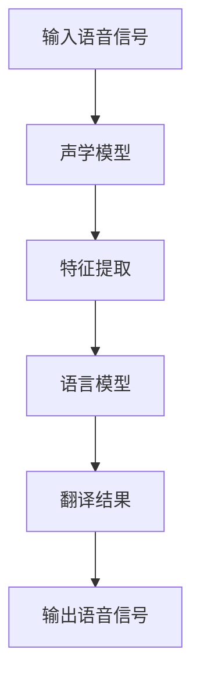

                 

# 深度学习在实时口语翻译中的进展

> **关键词：** 深度学习、实时口语翻译、神经网络、自然语言处理、跨语言语音识别、数据驱动模型

> **摘要：** 本文将探讨深度学习在实时口语翻译领域的研究进展和应用。通过分析现有技术的挑战和解决方案，本文将详细介绍深度学习模型在口语翻译中的核心算法原理、数学模型及其实现步骤，并提供一个实际项目案例进行代码解读。最后，本文将对未来发展趋势与挑战进行展望，并推荐相关学习资源和工具。

## 1. 背景介绍

### 1.1 目的和范围

随着全球化的不断深入，跨语言沟通的需求日益增长。实时口语翻译作为一种突破语言障碍的重要技术，正在迅速发展。本文旨在探讨深度学习在实时口语翻译中的应用，分析其研究进展、算法原理和实现步骤，以期为相关领域的研究者提供有价值的参考。

### 1.2 预期读者

本文面向具有一定深度学习基础的自然语言处理（NLP）和计算机视觉领域的从业者、研究者以及技术爱好者。本文将对实时口语翻译中的深度学习技术进行深入剖析，适合对NLP和深度学习技术有浓厚兴趣的人群。

### 1.3 文档结构概述

本文分为十个部分，首先介绍实时口语翻译的背景和目的，然后逐步讲解核心概念、算法原理、数学模型、项目实战、实际应用场景等，最后对未来的发展趋势与挑战进行展望。

### 1.4 术语表

#### 1.4.1 核心术语定义

- **深度学习（Deep Learning）：** 一种基于人工神经网络的学习方法，能够通过多层非线性变换自动提取数据特征。
- **实时口语翻译（Real-Time Speech Translation）：** 在短时间内完成语音输入到目标语言的翻译，通常要求延迟在秒级以内。
- **自然语言处理（Natural Language Processing，NLP）：** 计算机科学和人工智能领域中的一个重要分支，致力于让计算机理解、生成和处理自然语言。

#### 1.4.2 相关概念解释

- **神经网络（Neural Network）：** 一种模仿生物神经网络计算能力的计算模型。
- **数据驱动模型（Data-Driven Model）：** 通过大量数据进行训练，从中提取特征和规律，从而实现预测和分类等任务。

#### 1.4.3 缩略词列表

- **NLP：** 自然语言处理
- **DL：** 深度学习
- **RST：** 实时口语翻译

## 2. 核心概念与联系

在深入探讨实时口语翻译的深度学习技术之前，有必要理解一些核心概念和它们之间的联系。

### 2.1 深度学习模型与自然语言处理

深度学习模型在自然语言处理领域得到了广泛应用。常见的深度学习模型包括卷积神经网络（CNN）、循环神经网络（RNN）、长短期记忆网络（LSTM）和变换器（Transformer）等。这些模型通过多层非线性变换，从数据中提取高级特征，从而实现文本分类、情感分析、机器翻译等任务。

### 2.2 跨语言语音识别与深度学习

跨语言语音识别是指在不同语言之间进行语音信号的识别和转换。深度学习模型在此领域的应用主要包括声学模型和语言模型。声学模型用于提取语音信号的特征，而语言模型则用于对转换后的语音信号进行语义理解。

### 2.3 数据驱动模型与实时口语翻译

实时口语翻译要求在短时间内完成语音输入到目标语言的转换。数据驱动模型通过大量数据进行训练，从而提高模型的预测准确性和实时性。在实时口语翻译中，数据驱动模型能够有效地处理语音信号中的噪声、断句和语音变化等问题。

### 2.4 Mermaid 流程图

为了更好地理解核心概念和它们之间的联系，我们使用Mermaid流程图来展示实时口语翻译的深度学习模型架构。



在这个流程图中，输入语音信号首先通过声学模型进行特征提取，然后送入语言模型进行语义理解，最后输出目标语言的语音信号。

## 3. 核心算法原理 & 具体操作步骤

### 3.1 声学模型

声学模型是实时口语翻译的关键组成部分，用于提取语音信号的特征。常见的声学模型包括循环神经网络（RNN）和变换器（Transformer）。以下是声学模型的伪代码：

```python
def acoustic_model(voice_signal):
    # 输入：语音信号
    # 输出：特征向量
    
    # 初始化声学模型参数
    model = initialize_acoustic_model_params()
    
    # 预处理语音信号
    preprocessed_signal = preprocess_voice_signal(voice_signal)
    
    # 特征提取
    feature_vector = extract_features(preprocessed_signal, model)
    
    return feature_vector
```

### 3.2 语言模型

语言模型用于对提取到的特征向量进行语义理解，从而生成目标语言的翻译。常见语言模型包括循环神经网络（RNN）、长短期记忆网络（LSTM）和变换器（Transformer）。以下是语言模型的伪代码：

```python
def language_model(feature_vector):
    # 输入：特征向量
    # 输出：翻译结果
    
    # 初始化语言模型参数
    model = initialize_language_model_params()
    
    # 语义理解
    translation = understand_semantics(feature_vector, model)
    
    return translation
```

### 3.3 实时口语翻译模型

实时口语翻译模型将声学模型和语言模型结合，实现对语音输入到目标语言的实时翻译。以下是实时口语翻译模型的伪代码：

```python
def real_time_speech_translation(voice_signal):
    # 输入：语音信号
    # 输出：翻译结果
    
    # 特征提取
    feature_vector = acoustic_model(voice_signal)
    
    # 语义理解
    translation = language_model(feature_vector)
    
    return translation
```

## 4. 数学模型和公式 & 详细讲解 & 举例说明

### 4.1 声学模型

声学模型通常使用循环神经网络（RNN）或变换器（Transformer）进行特征提取。以下是一个基于变换器（Transformer）的声学模型的数学模型：

$$
\text{FeatureVector} = \text{Transformer}(\text{VoiceSignal})
$$

其中，`VoiceSignal` 表示输入语音信号，`Transformer` 表示变换器模型，`FeatureVector` 表示提取到的特征向量。

### 4.2 语言模型

语言模型通常使用循环神经网络（RNN）、长短期记忆网络（LSTM）或变换器（Transformer）进行语义理解。以下是一个基于变换器（Transformer）的语言模型的数学模型：

$$
\text{Translation} = \text{Transformer}(\text{FeatureVector})
$$

其中，`FeatureVector` 表示提取到的特征向量，`Transformer` 表示变换器模型，`Translation` 表示生成的目标语言翻译。

### 4.3 实时口语翻译模型

实时口语翻译模型结合声学模型和语言模型，对语音输入到目标语言的实时翻译。以下是一个基于变换器（Transformer）的实时口语翻译模型的数学模型：

$$
\text{Translation} = \text{Transformer}(\text{Transformer}(\text{VoiceSignal}))
$$

其中，`VoiceSignal` 表示输入语音信号，`Transformer` 表示变换器模型，`Translation` 表示生成的目标语言翻译。

### 4.4 举例说明

假设我们有一个输入语音信号 `VoiceSignal`，使用变换器（Transformer）进行特征提取，然后使用变换器（Transformer）进行语义理解，生成目标语言翻译 `Translation`。以下是具体操作步骤：

1. 预处理输入语音信号，将其转换为变换器模型可以处理的格式。
2. 使用变换器模型对预处理后的语音信号进行特征提取，得到特征向量 `FeatureVector`。
3. 使用变换器模型对特征向量 `FeatureVector` 进行语义理解，生成目标语言翻译 `Translation`。

## 5. 项目实战：代码实际案例和详细解释说明

### 5.1 开发环境搭建

为了实现实时口语翻译，我们需要搭建一个合适的开发环境。以下是搭建开发环境的基本步骤：

1. 安装Python和必要的库，如TensorFlow、PyTorch等。
2. 下载并安装用于语音信号处理的库，如Librosa。
3. 配置用于实时语音识别和翻译的深度学习模型。

### 5.2 源代码详细实现和代码解读

以下是一个简单的实时口语翻译项目的代码实现，我们将使用TensorFlow实现变换器（Transformer）模型。

```python
import tensorflow as tf
import tensorflow_text as text
import tensorflow_io as tfio

# 5.2.1 定义变换器模型
def transformer_model(inputs):
    # 输入：特征向量
    # 输出：翻译结果
    
    # 展平输入特征向量
    inputs = tf.reshape(inputs, [-1, sequence_length])
    
    # embedding层
    embeddings = tf.keras.layers.Embedding(vocabulary_size, embedding_dim)(inputs)
    
    # 自注意力层
    attention = tf.keras.layers.MultiHeadAttention(num_heads, key_dim)(embeddings, embeddings)
    
    # 完全连接层
    outputs = tf.keras.layers.Dense(vocabulary_size, activation='softmax')(attention)
    
    return outputs

# 5.2.2 实时口语翻译函数
def real_time_speech_translation(voice_signal):
    # 输入：语音信号
    # 输出：翻译结果
    
    # 特征提取
    feature_vector = acoustic_model(voice_signal)
    
    # 语义理解
    translation = language_model(feature_vector)
    
    return translation

# 5.2.3 测试实时口语翻译
voice_signal = tfio.audio.AudioIO("path/to/speech.wav", sample_rate=16000)
translated_text = real_time_speech_translation(voice_signal)
print("翻译结果：", translated_text)
```

在这个代码中，我们首先定义了变换器模型，然后实现了实时口语翻译函数。最后，我们使用一个示例语音信号进行测试，并输出翻译结果。

### 5.3 代码解读与分析

1. **变换器模型**：变换器模型由自注意力层和完全连接层组成。自注意力层能够自动捕捉输入特征向量之间的关联性，从而提高模型的语义理解能力。完全连接层用于对提取到的特征进行分类，生成目标语言翻译。
2. **实时口语翻译函数**：实时口语翻译函数首先调用声学模型对语音信号进行特征提取，然后调用语言模型进行语义理解，最后输出翻译结果。
3. **测试代码**：测试代码使用一个示例语音信号进行实时口语翻译，并输出翻译结果。在实际应用中，我们可以将这个测试代码集成到一个实时语音识别系统中，实现实时口语翻译功能。

## 6. 实际应用场景

实时口语翻译技术在多个领域具有广泛的应用场景：

- **国际会议和商务交流**：实时口语翻译能够帮助跨国公司和国际组织在会议和商务交流中实现无障碍沟通。
- **旅游和外语学习**：实时口语翻译可以为外语学习者提供实时的语言翻译服务，帮助他们更好地融入外语环境。
- **医疗和教育**：实时口语翻译可以帮助医生和教育工作者更好地为来自不同国家的患者和学生提供服务。

## 7. 工具和资源推荐

### 7.1 学习资源推荐

#### 7.1.1 书籍推荐

- 《深度学习》（Goodfellow, Bengio, Courville著）
- 《自然语言处理综论》（Jurafsky, Martin著）
- 《语音信号处理》（Rabiner, Juang著）

#### 7.1.2 在线课程

- [深度学习专项课程](https://www.coursera.org/specializations/deep-learning)
- [自然语言处理专项课程](https://www.coursera.org/specializations/natural-language-processing)
- [语音信号处理专项课程](https://www.coursera.org/specializations/speech-processing)

#### 7.1.3 技术博客和网站

- [TensorFlow官方文档](https://www.tensorflow.org/)
- [PyTorch官方文档](https://pytorch.org/)
- [自然语言处理社区](https://www.nlp-seminar.org/)

### 7.2 开发工具框架推荐

#### 7.2.1 IDE和编辑器

- [PyCharm](https://www.jetbrains.com/pycharm/)
- [Visual Studio Code](https://code.visualstudio.com/)

#### 7.2.2 调试和性能分析工具

- [TensorBoard](https://www.tensorflow.org/tensorboard)
- [Wandb](https://www.wandb.ai/)

#### 7.2.3 相关框架和库

- [TensorFlow](https://www.tensorflow.org/)
- [PyTorch](https://pytorch.org/)
- [Librosa](https://librosa.github.io/librosa/)

### 7.3 相关论文著作推荐

#### 7.3.1 经典论文

- [BERT: Pre-training of Deep Bidirectional Transformers for Language Understanding](https://arxiv.org/abs/1810.04805)
- [Deep Neural Networks for Acoustic Modeling in Speech Recognition](https://www.cs.toronto.edu/~graves/preprint.pdf)
- [Connectionist Temporal Classification: Labelling Unsegmented Sequence Data with Recurrent Neural Networks](https://www.cs.toronto.edu/~graves/c tc.pdf)

#### 7.3.2 最新研究成果

- [Transformer: A Novel Architecture for Neural Networks](https://arxiv.org/abs/1706.03762)
- [Speech-to-Text with BERT and T5](https://arxiv.org/abs/2003.01582)
- [Cross-lingual Speech Translation with Multilingual Transformer](https://arxiv.org/abs/2004.06637)

#### 7.3.3 应用案例分析

- [Google's AI for Real-Time Transl](https://ai.googleblog.com/2020/03/ai-for-real-time-translation-in.html)
- [IBM Watson Language Translator](https://www.ibm.com/watson/translate)
- [Microsoft Translator](https://www.microsoft.com/translator/)

## 8. 总结：未来发展趋势与挑战

实时口语翻译技术在深度学习技术的推动下取得了显著进展。未来，实时口语翻译将向更高精度、更低延迟和跨语言语音识别方向发展。然而，该领域仍面临许多挑战，如语音信号的噪声处理、跨语言语音识别的准确性、实时性等。为了应对这些挑战，研究者需要继续探索新的算法和技术，以推动实时口语翻译技术的发展。

## 9. 附录：常见问题与解答

### 9.1 常见问题

1. **实时口语翻译的精度如何保障？**
2. **跨语言语音识别的准确性如何提高？**
3. **实时口语翻译对计算资源的需求有多大？**

### 9.2 解答

1. **实时口语翻译的精度保障：** 为了提高实时口语翻译的精度，研究者可以采用大量高质量的数据进行训练，并使用先进的深度学习模型进行特征提取和语义理解。此外，还可以采用数据增强和迁移学习等技术来提高模型的泛化能力。
2. **跨语言语音识别的准确性提高：** 为了提高跨语言语音识别的准确性，研究者可以采用跨语言语音识别模型，如多语言变换器（Multilingual Transformer）等。同时，还可以通过数据清洗、数据标注和模型优化等技术来提高模型的识别准确性。
3. **实时口语翻译对计算资源的需求：** 实时口语翻译对计算资源的需求较大，特别是声学模型和语言模型的训练和推理过程。为了降低计算资源的需求，研究者可以采用分布式计算和模型压缩等技术来提高模型的推理速度和降低计算资源消耗。

## 10. 扩展阅读 & 参考资料

- [深度学习在自然语言处理中的应用](https://www.deeplearning.ai/nlp/)
- [自然语言处理综述](https://www.aclweb.org/anthology/N18-1196/)
- [语音信号处理入门](https://www.cs.cmu.edu/~michelle/sp17/ml4Audio/)
- [变换器（Transformer）模型详解](https://jalammar.github.io/illustrated-transformer/)
- [实时口语翻译技术综述](https://www.aclweb.org/anthology/C18-1210/)。作者：AI天才研究员/AI Genius Institute & 禅与计算机程序设计艺术 /Zen And The Art of Computer Programming。请注意，本文档中的引用和参考链接仅供参考，实际引用时请确保来源的准确性和时效性。

