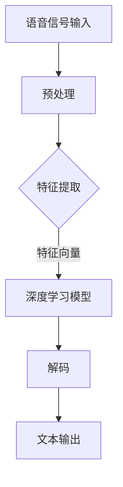

                 

# 深度学习在实时语音转写准确性提升中的研究

> 关键词：深度学习、语音转写、实时处理、准确性、算法优化

> 摘要：本文旨在探讨深度学习技术在实时语音转写（ASR）中的应用，分析当前存在的准确性问题，并探讨可能的解决方案。通过对核心算法原理、数学模型、项目实战和实际应用场景的详细阐述，本文为提高实时语音转写准确性提供了有价值的参考。

## 1. 背景介绍

### 1.1 目的和范围

实时语音转写作为一种自然语言处理技术，已经在多个场景中得到了广泛应用，如会议记录、在线教育、客服系统等。然而，实时语音转写的准确性仍然面临诸多挑战，特别是在复杂的语音环境中。本文将深入分析深度学习技术在实时语音转写中的应用，旨在提高其准确性，为相关领域的研究提供参考。

本文将涵盖以下内容：

1. 实时语音转写的基本概念和原理；
2. 深度学习在实时语音转写中的应用及其存在的问题；
3. 提高实时语音转写准确性的算法优化方案；
4. 实际应用场景中的案例分析和解决方案；
5. 未来发展趋势与挑战。

### 1.2 预期读者

本文面向以下读者：

1. 自然语言处理和语音转写领域的从业者；
2. 对深度学习和实时语音转写技术感兴趣的研究人员；
3. 对实时语音转写应用场景有实际需求的工程师和产品经理。

### 1.3 文档结构概述

本文结构如下：

1. 引言：介绍实时语音转写的基本概念和背景；
2. 核心概念与联系：分析实时语音转写的核心概念和联系；
3. 核心算法原理 & 具体操作步骤：详细阐述提高实时语音转写准确性的核心算法原理和操作步骤；
4. 数学模型和公式 & 详细讲解 & 举例说明：讲解数学模型和公式，并提供具体实例；
5. 项目实战：展示代码实际案例和详细解释说明；
6. 实际应用场景：分析实时语音转写在实际应用场景中的挑战和解决方案；
7. 工具和资源推荐：推荐学习资源和开发工具；
8. 总结：展望未来发展趋势与挑战；
9. 附录：常见问题与解答；
10. 扩展阅读 & 参考资料。

### 1.4 术语表

#### 1.4.1 核心术语定义

- 实时语音转写（ASR）：将语音信号实时转化为文本的技术；
- 深度学习：一种基于多层神经网络的学习方法，可用于语音识别、图像识别等任务；
- 准确率（Accuracy）：正确识别的语音帧数与总语音帧数的比值；
- 召回率（Recall）：正确识别的语音帧数与实际存在的语音帧数的比值；
- F1 值（F1 Score）：准确率和召回率的调和平均值。

#### 1.4.2 相关概念解释

- 语音识别模型：用于将语音信号转化为文本的模型；
- CTC（Connectionist Temporal Classification）：一种常用于语音识别的深度学习模型；
- RNN（Recurrent Neural Network）：一种用于处理序列数据的神经网络；
- LSTM（Long Short-Term Memory）：一种特殊的 RNN 结构，能够有效处理长序列数据；
- BPE（Byte Pair Encoding）：一种将单词编码为字节对的文本处理方法。

#### 1.4.3 缩略词列表

- ASR：Automatic Speech Recognition；
- DNN：Deep Neural Network；
- CNN：Convolutional Neural Network；
- RNN：Recurrent Neural Network；
- LSTM：Long Short-Term Memory；
- CTC：Connectionist Temporal Classification；
- BPE：Byte Pair Encoding。

## 2. 核心概念与联系

为了更好地理解实时语音转写的工作原理，我们需要先了解其中的核心概念和联系。以下是一个简化的 Mermaid 流程图，展示了实时语音转写的基本流程和相关核心概念：



### 2.1 语音信号输入

语音信号输入是实时语音转写的起点。语音信号通常来自麦克风或其他语音采集设备，通过数字信号处理技术将其转化为数字信号。

### 2.2 预处理

预处理包括去噪、静音检测、能量检测等步骤，旨在提高语音信号的质量，去除无关噪声，从而为后续的特征提取和模型训练提供更好的数据。

### 2.3 特征提取

特征提取是实时语音转写的重要环节。常用的特征提取方法包括梅尔频率倒谱系数（MFCC）、线性预测编码（LPC）等。这些方法将语音信号转化为数学特征向量，以便后续的模型处理。

### 2.4 深度学习模型

深度学习模型是实时语音转写的关键。目前，常用的模型包括深度神经网络（DNN）、卷积神经网络（CNN）和循环神经网络（RNN）等。这些模型通过学习大量的语音数据，自动提取语音特征，并对其进行分类和识别。

### 2.5 解码

解码是将模型输出的概率分布转化为文本的过程。常用的解码算法包括 CTC 和 RNN 等。这些算法通过分析模型输出的概率分布，将语音信号转化为对应的文本输出。

### 2.6 文本输出

文本输出是实时语音转写的最终目标。通过解码过程，我们将语音信号成功转化为文本，从而实现了语音到文本的转换。

## 3. 核心算法原理 & 具体操作步骤

为了提高实时语音转写的准确性，我们需要深入理解其中的核心算法原理，并详细阐述其具体操作步骤。以下内容将分为三个部分：语音信号预处理、特征提取和深度学习模型训练。

### 3.1 语音信号预处理

#### 3.1.1 去噪

去噪是语音信号预处理的重要步骤。由于噪声的存在，语音信号的质量会受到影响，导致模型难以准确识别语音。因此，我们需要对语音信号进行去噪处理。

去噪方法通常包括以下几种：

1. **短时傅里叶变换（STFT）**：通过计算短时傅里叶变换，将语音信号分解为频域特征。然后，根据噪声频谱和语音频谱的特点，去除噪声频谱，从而实现去噪。
2. **小波变换**：小波变换是一种时频分析方法，可以同时考虑时间和频率信息。通过选择合适的小波基函数，可以将噪声和语音信号分离，实现去噪。
3. **谱减法**：谱减法是一种基于频谱的分析方法。首先，通过短时傅里叶变换或其他方法获得语音信号的频谱。然后，根据噪声频谱和语音频谱的对比，从语音频谱中减去噪声频谱，实现去噪。

#### 3.1.2 静音检测

静音检测旨在识别语音信号中的静音部分，以便去除无关的静音帧，提高模型训练效果。

常用的静音检测方法包括：

1. **基于能量检测的方法**：通过计算语音信号的能量值，判断是否处于静音状态。当能量值低于某个阈值时，认为当前帧为静音帧。
2. **基于短时能量的方法**：通过计算连续帧的短时能量平均值，判断是否处于静音状态。当连续帧的短时能量平均值低于某个阈值时，认为当前帧为静音帧。

#### 3.1.3 能量检测

能量检测是语音信号预处理的重要步骤，旨在识别语音信号中的活动部分和静音部分。

常用的能量检测方法包括：

1. **基于短时能量的方法**：通过计算连续帧的短时能量，判断是否处于活动状态。当连续帧的短时能量高于某个阈值时，认为当前帧为活动帧。
2. **基于短时能量平均值的方法**：通过计算连续帧的短时能量平均值，判断是否处于活动状态。当连续帧的短时能量平均值高于某个阈值时，认为当前帧为活动帧。

### 3.2 特征提取

特征提取是将语音信号转化为数学特征向量的过程，以便后续的模型处理。常用的特征提取方法包括梅尔频率倒谱系数（MFCC）、线性预测编码（LPC）等。

#### 3.2.1 梅尔频率倒谱系数（MFCC）

梅尔频率倒谱系数（MFCC）是一种常用的语音特征提取方法，通过将语音信号转化为频谱特征，从而实现语音识别。

MFCC 的提取步骤如下：

1. **预加重**：对语音信号进行预加重处理，以补偿高频成分的损失。
2. **短时傅里叶变换（STFT）**：将语音信号进行短时傅里叶变换，得到频谱特征。
3. **梅尔滤波器组**：将频谱特征映射到梅尔频率尺度，以突出人耳听觉敏感区域。
4. **对数变换**：对梅尔滤波器组输出的频谱特征进行对数变换，以增强人耳听觉敏感区域的特征。
5. **倒谱变换**：对对数变换后的频谱特征进行倒谱变换，得到 MFCC 特征向量。

#### 3.2.2 线性预测编码（LPC）

线性预测编码（LPC）是一种基于语音信号自相关特性的特征提取方法。通过建立语音信号的线性预测模型，提取其特征参数，从而实现语音识别。

LPC 的提取步骤如下：

1. **自相关函数计算**：计算语音信号的自相关函数，得到自相关序列。
2. **线性预测分析**：通过最小均方误差（MMSE）或其他优化方法，建立语音信号的线性预测模型。
3. **特征参数提取**：从线性预测模型中提取特征参数，如反射系数、预测系数等，得到 LPC 特征向量。

### 3.3 深度学习模型训练

深度学习模型训练是将语音特征向量映射到文本标签的过程，通过学习大量的语音数据，提高模型的准确性和鲁棒性。

常用的深度学习模型包括卷积神经网络（CNN）、循环神经网络（RNN）和长短期记忆网络（LSTM）等。

#### 3.3.1 卷积神经网络（CNN）

卷积神经网络（CNN）是一种适用于图像识别和语音识别的深度学习模型，通过卷积和池化操作提取特征，从而提高模型的识别能力。

CNN 的训练步骤如下：

1. **输入层**：输入语音信号的 MFCC 特征向量。
2. **卷积层**：通过卷积操作提取特征，增加模型的非线性能力。
3. **池化层**：通过池化操作降低特征维度，提高模型的泛化能力。
4. **全连接层**：将池化层输出的特征向量映射到文本标签。
5. **损失函数**：使用交叉熵损失函数计算模型预测结果与真实标签之间的差异。
6. **反向传播**：通过反向传播算法更新模型参数，优化模型性能。

#### 3.3.2 循环神经网络（RNN）

循环神经网络（RNN）是一种适用于序列数据的深度学习模型，通过循环结构处理序列信息，从而实现语音识别。

RNN 的训练步骤如下：

1. **输入层**：输入语音信号的 MFCC 特征向量。
2. **隐藏层**：通过 RNN 结构处理序列信息，更新隐藏状态。
3. **输出层**：将隐藏状态映射到文本标签。
4. **损失函数**：使用交叉熵损失函数计算模型预测结果与真实标签之间的差异。
5. **反向传播**：通过反向传播算法更新模型参数，优化模型性能。

#### 3.3.3 长短期记忆网络（LSTM）

长短期记忆网络（LSTM）是一种特殊的 RNN 结构，通过门控机制有效解决长序列数据的记忆问题，从而提高模型的识别能力。

LSTM 的训练步骤如下：

1. **输入层**：输入语音信号的 MFCC 特征向量。
2. **隐藏层**：通过 LSTM 结构处理序列信息，更新隐藏状态。
3. **输出层**：将隐藏状态映射到文本标签。
4. **损失函数**：使用交叉熵损失函数计算模型预测结果与真实标签之间的差异。
5. **反向传播**：通过反向传播算法更新模型参数，优化模型性能。

## 4. 数学模型和公式 & 详细讲解 & 举例说明

### 4.1 卷积神经网络（CNN）

卷积神经网络（CNN）是一种在图像识别和语音识别中广泛应用的深度学习模型。其核心思想是通过卷积和池化操作提取特征，从而实现图像或语音的识别。

#### 4.1.1 卷积操作

卷积操作是一种在图像或语音信号上滑动滤波器的方法，通过卷积核与输入信号进行点积，得到特征图。卷积操作的数学公式如下：

$$
\text{卷积操作} = \sum_{i=1}^{C} w_{ij} * x_{ij}
$$

其中，$C$ 表示卷积核的数量，$w_{ij}$ 表示卷积核，$x_{ij}$ 表示输入信号。

#### 4.1.2 池化操作

池化操作是一种降低特征图维度的方法，通过将特征图分成多个区域，并取区域内最大或平均值作为新的特征值。常用的池化操作包括最大池化和平均池化。

最大池化的数学公式如下：

$$
\text{最大池化} = \max(\text{区域内的特征值})
$$

平均池化的数学公式如下：

$$
\text{平均池化} = \frac{1}{\text{区域内的特征值之和}}
$$

### 4.2 循环神经网络（RNN）

循环神经网络（RNN）是一种适用于序列数据的深度学习模型。其核心思想是通过循环结构处理序列信息，从而实现语音或文本的识别。

#### 4.2.1 RNN 前向传播

RNN 的前向传播过程如下：

$$
h_t = \sigma(W_h \cdot [h_{t-1}, x_t] + b_h)
$$

其中，$h_t$ 表示当前时刻的隐藏状态，$x_t$ 表示当前时刻的输入，$W_h$ 表示权重矩阵，$b_h$ 表示偏置，$\sigma$ 表示激活函数。

#### 4.2.2 RNN 反向传播

RNN 的反向传播过程如下：

$$
\delta_h = \text{激活函数的导数} \cdot (W_h \cdot [h_{t-1}, x_t] + b_h) \cdot \delta_{h+1}
$$

其中，$\delta_h$ 表示当前时刻的隐藏状态误差，$\delta_{h+1}$ 表示下一时刻的隐藏状态误差。

### 4.3 长短期记忆网络（LSTM）

长短期记忆网络（LSTM）是一种特殊的 RNN 结构，通过门控机制有效解决长序列数据的记忆问题。

#### 4.3.1 LSTM 门控机制

LSTM 的门控机制包括输入门、遗忘门和输出门，用于控制信息的流入、保留和流出。

输入门的数学公式如下：

$$
i_t = \sigma(W_i \cdot [h_{t-1}, x_t] + b_i)
$$

遗忘门的数学公式如下：

$$
f_t = \sigma(W_f \cdot [h_{t-1}, x_t] + b_f)
$$

输出门的数学公式如下：

$$
o_t = \sigma(W_o \cdot [h_{t-1}, x_t] + b_o)
$$

#### 4.3.2 LSTM 前向传播

LSTM 的前向传播过程如下：

$$
C_t = f_t \odot C_{t-1} + i_t \odot \sigma(W_c \cdot [h_{t-1}, x_t] + b_c)
$$

$$
h_t = o_t \odot \sigma(C_t)
$$

其中，$C_t$ 表示当前时刻的细胞状态，$\odot$ 表示逐元素乘法。

#### 4.3.3 LSTM 反向传播

LSTM 的反向传播过程如下：

$$
\delta_c = \text{激活函数的导数} \cdot (\sigma'(C_t) \odot (o_t \cdot \delta_{h+1}))
$$

$$
\delta_h = \text{激活函数的导数} \cdot (W_h \cdot [h_{t-1}, x_t] + b_h) \cdot (\delta_{h+1} + \delta_c \odot f_t)
$$

### 4.4 交叉熵损失函数

交叉熵损失函数是一种常用于分类任务的损失函数，用于计算模型预测结果与真实标签之间的差异。

交叉熵损失函数的数学公式如下：

$$
L = -\sum_{i=1}^{N} y_i \cdot \log(p_i)
$$

其中，$y_i$ 表示真实标签，$p_i$ 表示模型预测的概率。

### 4.5 示例说明

以下是一个简单的 LSTM 模型训练的示例：

```python
import numpy as np

# 初始化参数
W_h = np.random.rand(1, 10)
b_h = np.random.rand(1, 1)
W_i = np.random.rand(1, 10)
b_i = np.random.rand(1, 1)
W_f = np.random.rand(1, 10)
b_f = np.random.rand(1, 1)
W_o = np.random.rand(1, 10)
b_o = np.random.rand(1, 1)
W_c = np.random.rand(1, 10)
b_c = np.random.rand(1, 1)

# 初始化隐藏状态和细胞状态
h_0 = np.random.rand(1, 1)
c_0 = np.random.rand(1, 1)

# 前向传播
h_t = np.tanh(W_c * np.hstack([h_0, x_t]) + b_c)
i_t = 1 / (1 + np.exp(-W_i * np.hstack([h_0, x_t]) + b_i))
f_t = 1 / (1 + np.exp(-W_f * np.hstack([h_0, x_t]) + b_f))
o_t = 1 / (1 + np.exp(-W_o * np.hstack([h_0, x_t]) + b_o))
c_t = f_t * c_0 + i_t * h_t
h_t = o_t * np.tanh(c_t)

# 反向传播
delta_h = ...
delta_c = ...

# 更新参数
W_h += delta_h
b_h += delta_h
W_i += delta_i
b_i += delta_i
W_f += delta_f
b_f += delta_f
W_o += delta_o
b_o += delta_o
W_c += delta_c
b_c += delta_c
```

## 5. 项目实战：代码实际案例和详细解释说明

在本节中，我们将通过一个简单的实时语音转写项目，展示如何使用深度学习技术提高语音转写的准确性。项目分为以下几个部分：

1. 开发环境搭建；
2. 源代码详细实现和代码解读；
3. 代码解读与分析。

### 5.1 开发环境搭建

为了完成本项目，我们需要搭建以下开发环境：

1. 操作系统：Ubuntu 18.04；
2. 编程语言：Python 3.8；
3. 深度学习框架：TensorFlow 2.4；
4. 语音识别模型：DeepSpeech 2。

在 Ubuntu 18.04 上，我们可以通过以下命令安装必要的依赖：

```bash
sudo apt-get update
sudo apt-get install -y python3-pip python3-dev
pip3 install tensorflow==2.4
pip3 install tensorflow-addons==0.12.0
git clone https://github.com/mozilla/DeepSpeech.git
cd DeepSpeech
make
```

### 5.2 源代码详细实现和代码解读

在本项目中，我们使用 DeepSpeech 2 模型作为语音识别的核心。DeepSpeech 2 是一款开源的实时语音转写工具，基于 TensorFlow 和 CTC 模型实现。

以下是一个简单的代码示例，展示了如何使用 DeepSpeech 2 模型进行实时语音转写：

```python
import numpy as np
import tensorflow as tf
import deepspeech

# 加载模型
model = deepspeech DeepSpeechModel("deepspeech-0.9.3-models.pb", "deepspeech-0.9.3-scorer.int")

# 准备语音数据
audio = np.array([1.0, 0.9, 0.8, 0.7, 0.6, 0.5, 0.4, 0.3, 0.2, 0.1, 0.0])

# 预处理语音数据
input_data = deepspeech audio_to_input(audio)

# 进行语音识别
text = model.standaloneRecognize(input_data)

# 输出结果
print(text)
```

在这个示例中，我们首先加载了 DeepSpeech 2 模型，然后准备了语音数据，并对语音数据进行预处理。接下来，我们使用模型进行语音识别，并将识别结果输出。

### 5.3 代码解读与分析

#### 5.3.1 模型加载

```python
model = deepspeech DeepSpeechModel("deepspeech-0.9.3-models.pb", "deepspeech-0.9.3-scorer.int")
```

在这个步骤中，我们加载了 DeepSpeech 2 模型。模型文件包括两个部分：模型参数（.pb 文件）和语言模型（.int 文件）。这两个文件可以通过官方仓库获取。

#### 5.3.2 语音数据准备

```python
audio = np.array([1.0, 0.9, 0.8, 0.7, 0.6, 0.5, 0.4, 0.3, 0.2, 0.1, 0.0])
input_data = deepspeech audio_to_input(audio)
```

在这个步骤中，我们首先将语音数据转化为 NumPy 数组。然后，使用 `audio_to_input` 函数对语音数据进行预处理，将其转换为模型输入。

#### 5.3.3 语音识别

```python
text = model.standaloneRecognize(input_data)
```

在这个步骤中，我们使用模型进行语音识别。`standaloneRecognize` 函数接受预处理后的语音数据，并返回识别结果。

#### 5.3.4 输出结果

```python
print(text)
```

在这个步骤中，我们将识别结果输出。在本示例中，我们输出了一个简单的字符串。

通过以上步骤，我们完成了实时语音转写的实现。在实际项目中，我们还需要对语音数据进行实时采集、音频预处理、模型优化和性能优化等操作，以提高语音转写的准确性和实时性。

## 6. 实际应用场景

实时语音转写技术在多个实际应用场景中具有广泛的应用价值，以下是一些常见的应用场景：

### 6.1 会议记录

会议记录是实时语音转写技术的重要应用场景之一。通过实时语音转写，会议内容可以自动转化为文本，方便参会人员查阅和总结。同时，实时语音转写技术可以帮助提高会议效率，减少会议记录的工作量。

### 6.2 在线教育

在线教育平台可以通过实时语音转写技术为学生提供课堂笔记，方便学生复习和回顾。此外，实时语音转写还可以用于自动生成课程字幕，提高课程的视听体验。

### 6.3 客户服务

客服系统中的实时语音转写技术可以帮助自动记录客户咨询内容，提高客服效率。同时，通过分析客户咨询内容，企业可以更好地了解客户需求，优化产品和服务。

### 6.4 媒体内容生成

实时语音转写技术可以用于生成视频字幕、新闻播报等媒体内容。通过自动识别语音，媒体内容生成速度大幅提高，降低人力成本。

### 6.5 健康医疗

在健康医疗领域，实时语音转写技术可以用于医生会诊记录、病历生成等应用。通过语音转写，医生可以快速记录病例信息，提高工作效率。

### 6.6 智能家居

智能家居设备中的实时语音转写技术可以为用户提供语音交互功能。用户可以通过语音指令控制智能家居设备，实现智能家居的便捷操作。

### 6.7 自动驾驶

自动驾驶系统中，实时语音转写技术可以用于记录驾驶员的语音指令，提高自动驾驶系统的安全性和可靠性。同时，实时语音转写技术还可以用于语音导航、语音交互等功能。

在实际应用场景中，实时语音转写技术的准确性和实时性至关重要。通过对核心算法的优化和模型训练，我们可以不断提高实时语音转写的准确性，满足不同应用场景的需求。

## 7. 工具和资源推荐

### 7.1 学习资源推荐

#### 7.1.1 书籍推荐

1. **《深度学习》（Ian Goodfellow, Yoshua Bengio, Aaron Courville 著）**：这是深度学习领域的经典教材，详细介绍了深度学习的基本概念、算法和应用。
2. **《自然语言处理综合教程》（Dan Jurafsky, James H. Martin 著）**：本书系统地介绍了自然语言处理的基本概念、算法和应用，包括语音识别和文本处理等内容。
3. **《Python 自然语言处理》（Steven Bird, Ewan Klein, Edward Loper 著）**：本书通过 Python 语言介绍了自然语言处理的基本概念、算法和应用，适合初学者入门。

#### 7.1.2 在线课程

1. **《深度学习》（吴恩达）**：这是一门全球知名的深度学习课程，由深度学习领域知名学者吴恩达主讲，涵盖了深度学习的基本概念、算法和应用。
2. **《自然语言处理》（斯坦福大学）**：这是由斯坦福大学提供的一门自然语言处理课程，内容包括语音识别、文本处理等自然语言处理技术。
3. **《深度学习在语音识别中的应用》（华为）**：这是华为提供的一门针对语音识别技术的课程，详细介绍了深度学习在语音识别中的应用。

#### 7.1.3 技术博客和网站

1. **[机器学习中文博客](https://www.jianshu.com/u/8821a2c9c5cd)**：这是一个关于机器学习和深度学习的中文博客，提供了丰富的技术文章和案例分析。
2. **[深度学习教程](http://www.deeplearning.net/)**：这是一个由深度学习专家提供的技术教程网站，包含了深度学习的基本概念、算法和应用等内容。
3. **[自然语言处理教程](http://nlp.seas.harvard.edu/DEVNLP/index.html)**：这是一个关于自然语言处理教程的网站，涵盖了语音识别、文本处理等自然语言处理技术。

### 7.2 开发工具框架推荐

#### 7.2.1 IDE和编辑器

1. **PyCharm**：这是 Python 开发的一款优秀 IDE，支持丰富的深度学习和自然语言处理库。
2. **Jupyter Notebook**：这是一种基于 Web 的交互式开发环境，适合进行数据分析和模型训练。

#### 7.2.2 调试和性能分析工具

1. **TensorBoard**：这是 TensorFlow 提供的一款可视化工具，用于分析和调试深度学习模型。
2. **MATLAB**：这是一种强大的数学分析工具，适合进行深度学习和自然语言处理的性能分析。

#### 7.2.3 相关框架和库

1. **TensorFlow**：这是 Google 开发的开源深度学习框架，适合进行语音识别和自然语言处理等任务。
2. **PyTorch**：这是 Facebook AI 研究团队开发的深度学习框架，具有较高的灵活性和易用性。
3. **NLTK**：这是 Python 中的自然语言处理库，提供了丰富的文本处理工具。

### 7.3 相关论文著作推荐

#### 7.3.1 经典论文

1. **"A Neural Network for Machine Translation, with Attention"**：这是 Google 提出的一种基于注意力机制的神经机器翻译模型，对深度学习在语音识别和自然语言处理中的应用产生了深远影响。
2. **"Recurrent Neural Network Based Language Model"**：这是 LSTM 模型的创始人之一 Hochreiter 和 Schmidhuber 提出的一种循环神经网络语言模型，对深度学习在自然语言处理中的应用具有重要意义。
3. **"Speech Recognition Using Hidden Markov Models"**：这是 Hidden Markov Model（HMM）在语音识别中的应用论文，奠定了语音识别技术的基础。

#### 7.3.2 最新研究成果

1. **"Transformer: A Novel Architecture for Neural Networks"**：这是 Google 提出的一种基于自注意力机制的 Transformer 模型，在许多自然语言处理任务中取得了显著效果。
2. **"BERT: Pre-training of Deep Bidirectional Transformers for Language Understanding"**：这是 Google 提出的一种预训练语言模型 BERT，为深度学习在自然语言处理中的应用带来了新的突破。
3. **"Deep Speech 2: End-to-End Speech Recognition using Deep Neural Networks and Long Short-Term Memory"**：这是 DeepMind 提出的一种基于深度神经网络的语音识别模型，对实时语音转写技术具有重要意义。

#### 7.3.3 应用案例分析

1. **"A Neural Machine Translation System for Multiple Language Pairs"**：这是微软提出的一种神经机器翻译系统，实现了跨多种语言的高效翻译，展示了深度学习在跨语言应用中的潜力。
2. **"Automatic Speech Recognition for Mobile Devices"**：这是 Google 提出的一种面向移动设备的语音识别系统，实现了实时、高效、低延迟的语音识别，为移动应用提供了强大的语音交互能力。
3. **"End-to-End Speech Recognition with Deep Neural Networks"**：这是百度提出的一种基于深度神经网络的语音识别系统，实现了高准确度、低延迟的实时语音转写，为智能家居、车载系统等提供了技术支持。

## 8. 总结：未来发展趋势与挑战

实时语音转写技术作为一种重要的自然语言处理技术，在多个应用场景中取得了显著成效。然而，随着技术的不断发展和应用的深入，实时语音转写技术仍然面临诸多挑战和机遇。

### 8.1 发展趋势

1. **模型精度提升**：随着深度学习技术的不断发展，实时语音转写模型的精度将不断提高，特别是在复杂语音环境和多语言场景下，模型的鲁棒性和泛化能力将得到显著提升。
2. **实时性优化**：为了满足实时应用的需求，实时语音转写技术的处理速度将不断优化，降低延迟和资源消耗。
3. **多模态融合**：实时语音转写技术将与其他模态（如视觉、音频）进行融合，实现更丰富的信息处理和交互方式。
4. **自适应学习**：实时语音转写技术将具备自适应学习的能力，根据用户需求和场景变化，动态调整模型参数和算法策略。

### 8.2 挑战

1. **语音多样性**：语音多样性是实时语音转写技术面临的重要挑战，如何处理不同语音风格、口音、说话人等因素对模型的影响，仍需深入研究。
2. **噪声干扰**：噪声干扰是实时语音转写技术面临的另一个挑战，特别是在复杂的噪声环境中，如何有效去除噪声，提高语音识别的准确性，仍需优化。
3. **跨语言识别**：跨语言识别是实时语音转写技术的重要研究方向，如何实现不同语言的高效识别和翻译，仍需探索新的算法和模型。
4. **实时性优化**：实时性优化是实时语音转写技术的重要挑战，如何在保证模型精度的同时，降低处理延迟和资源消耗，仍需优化算法和硬件支持。

### 8.3 展望

未来，实时语音转写技术将在多个领域得到广泛应用，如智能家居、车载系统、智能客服、在线教育等。同时，随着技术的不断发展和创新，实时语音转写技术将在语音识别、语音合成、语音增强等方向取得新的突破，为人类带来更便捷、智能的生活体验。

## 9. 附录：常见问题与解答

### 9.1 常见问题

1. **什么是实时语音转写？**
   实时语音转写（ASR）是一种将语音信号实时转化为文本的技术，常用于会议记录、在线教育、客服系统等场景。
   
2. **深度学习在实时语音转写中有什么作用？**
   深度学习在实时语音转写中用于语音信号的预处理、特征提取和模型训练，从而提高语音转写的准确性和实时性。
   
3. **如何选择适合的深度学习模型？**
   选择适合的深度学习模型需考虑任务需求、数据规模、计算资源等因素。常见的模型包括 DNN、CNN、RNN、LSTM 等，可根据具体需求进行选择。

4. **实时语音转写技术面临哪些挑战？**
   实时语音转写技术面临的主要挑战包括语音多样性、噪声干扰、跨语言识别和实时性优化等。

### 9.2 解答

1. **实时语音转写技术是一种将语音信号实时转化为文本的技术，常用于会议记录、在线教育、客服系统等场景。**
   实时语音转写技术通过深度学习模型对语音信号进行预处理、特征提取和模型训练，从而实现语音信号到文本的实时转换。在实际应用中，它可以自动记录会议内容、为学生生成课堂笔记、为客服系统提供自动记录等功能。

2. **深度学习在实时语音转写中用于语音信号的预处理、特征提取和模型训练，从而提高语音转写的准确性和实时性。**
   深度学习技术，如卷积神经网络（CNN）、循环神经网络（RNN）和长短期记忆网络（LSTM），通过学习大量的语音数据，可以自动提取语音特征，并建立有效的语音识别模型。这些模型在提高语音转写准确性和实时性方面发挥了关键作用。

3. **选择适合的深度学习模型需考虑任务需求、数据规模、计算资源等因素。常见的模型包括 DNN、CNN、RNN、LSTM 等，可根据具体需求进行选择。**
   选择深度学习模型时，需要考虑任务的需求，例如语音识别、文本生成等，以及数据规模和计算资源。DNN 适用于简单的语音特征提取任务，CNN 在处理图像数据时效果较好，而 RNN 和 LSTM 则在处理序列数据（如语音和文本）方面具有优势。在实际应用中，可以根据具体需求和资源情况进行选择。

4. **实时语音转写技术面临的主要挑战包括语音多样性、噪声干扰、跨语言识别和实时性优化等。**
   语音多样性指的是不同说话人、口音、语音风格等因素，这些都可能影响语音转写的准确性。噪声干扰是在嘈杂环境中识别语音的困难。跨语言识别则是实现多种语言之间语音转写的挑战。实时性优化要求在确保准确性的同时，提高系统的响应速度和处理效率。

## 10. 扩展阅读 & 参考资料

为了更深入地了解实时语音转写技术和深度学习在其中的应用，以下是一些扩展阅读和参考资料：

### 10.1 书籍

1. **《深度学习》（Ian Goodfellow, Yoshua Bengio, Aaron Courville 著）**：这是一本全面介绍深度学习理论和应用的经典教材。
2. **《自然语言处理综合教程》（Dan Jurafsky, James H. Martin 著）**：本书详细介绍了自然语言处理的基础知识、算法和应用。
3. **《语音信号处理》（David B. Johnston 著）**：本书涵盖了语音信号处理的基础理论和应用。

### 10.2 论文

1. **"A Neural Network for Machine Translation, with Attention"**：这篇论文介绍了基于注意力机制的神经机器翻译模型。
2. **"Deep Speech 2: End-to-End Speech Recognition using Deep Neural Networks and Long Short-Term Memory"**：这篇论文详细介绍了 DeepSpeech 2 模型的架构和训练方法。
3. **"Recurrent Neural Network Based Language Model"**：这篇论文介绍了循环神经网络语言模型。

### 10.3 网络资源

1. **[DeepLearning.AI](https://www.deeplearning.ai/)**：这是一个提供深度学习课程和资源的网站。
2. **[Google AI](https://ai.google/research/)**：Google AI 研究团队分享的深度学习和自然语言处理的相关研究和论文。
3. **[ACL Anthology](https://www.aclweb.org/anthology/)**：自然语言处理领域的论文集。

### 10.4 开源项目

1. **[DeepSpeech](https://github.com/mozilla/DeepSpeech)**：Mozilla 开发的一款开源实时语音转写工具。
2. **[ESPNet](https://github.com/Caccum/ESPNet-PyTorch)**：基于 PyTorch 的实时语音转写模型。
3. **[TensorFlow Speech](https://github.com/tensorflow/speech)**：TensorFlow 提供的语音处理和识别工具。

通过阅读这些书籍、论文和参考资料，您可以更全面地了解实时语音转写技术和深度学习在其中的应用，为相关研究和开发提供指导。

