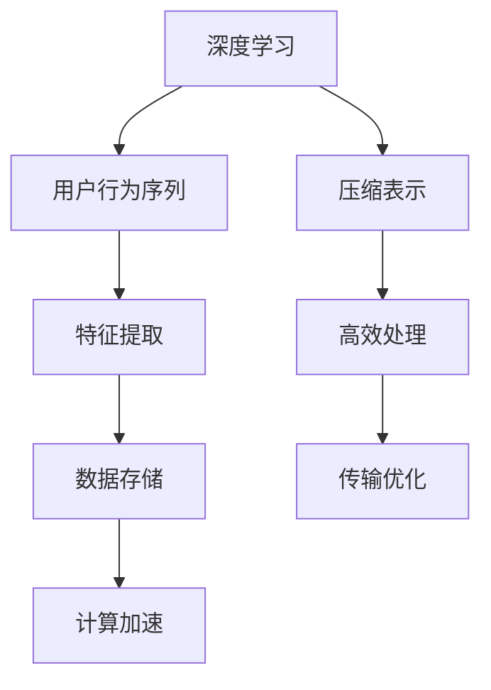

                 

# 深度学习在用户行为序列压缩表示中的应用

> **关键词：** 深度学习，用户行为序列，压缩表示，神经网络，序列模型，行为分析。

> **摘要：** 本文旨在探讨深度学习技术在用户行为序列压缩表示中的应用。通过分析用户行为的复杂性和多样性，我们引入了一系列深度学习模型，详细阐述了如何使用这些模型进行行为序列的压缩表示，以及它们在实际应用中的优势与挑战。文章将逐步解析核心概念、算法原理、数学模型、实战案例，并展望未来发展趋势。

## 1. 背景介绍

### 1.1 目的和范围

本文的目标是深入探讨深度学习技术在用户行为序列压缩表示中的应用。在信息爆炸的时代，如何高效地处理和分析海量的用户行为数据成为了一个亟待解决的问题。传统的表示学习方法在面对复杂的行为序列时，往往无法有效地捕捉到行为的内在模式和规律。而深度学习作为一种强大的机器学习技术，通过自动学习特征表示，已经在许多领域取得了显著成果。本文将介绍深度学习在用户行为序列压缩表示中的具体应用，并分析其优势与挑战。

### 1.2 预期读者

本文适用于对深度学习和用户行为分析有一定了解的读者，包括但不限于：
- 深度学习研究人员和开发者；
- 数据科学家和机器学习工程师；
- 互联网产品经理和分析师；
- 对人工智能和用户行为分析感兴趣的学生和从业者。

### 1.3 文档结构概述

本文将分为以下几个部分：
1. 背景介绍：介绍文章的目的、读者群体和结构；
2. 核心概念与联系：解释深度学习、用户行为序列和压缩表示的基本概念，并通过Mermaid流程图展示它们之间的关系；
3. 核心算法原理 & 具体操作步骤：详细阐述用于用户行为序列压缩表示的深度学习算法原理和操作步骤；
4. 数学模型和公式 & 详细讲解 & 举例说明：介绍支持用户行为序列压缩的数学模型，并给出具体示例；
5. 项目实战：代码实际案例和详细解释说明；
6. 实际应用场景：探讨深度学习在用户行为序列压缩表示中的实际应用；
7. 工具和资源推荐：推荐相关学习资源、开发工具和框架；
8. 总结：未来发展趋势与挑战；
9. 附录：常见问题与解答；
10. 扩展阅读 & 参考资料。

### 1.4 术语表

#### 1.4.1 核心术语定义

- **深度学习（Deep Learning）**：一种基于多层神经网络的机器学习技术，通过逐层学习数据特征表示，从而实现复杂模式的自动识别和预测。
- **用户行为序列（User Behavior Sequence）**：用户在特定场景下产生的操作序列，如点击、搜索、浏览等行为。
- **压缩表示（Compression Representation）**：将高维的数据转化为低维的表示，以便于存储、传输和处理。

#### 1.4.2 相关概念解释

- **序列模型（Sequence Model）**：一种能够处理时间序列数据的机器学习模型，如循环神经网络（RNN）和长短期记忆网络（LSTM）。
- **特征提取（Feature Extraction）**：从原始数据中提取有用的特征，用于表示数据的关键信息。

#### 1.4.3 缩略词列表

- **RNN**：循环神经网络（Recurrent Neural Network）
- **LSTM**：长短期记忆网络（Long Short-Term Memory）
- **CNN**：卷积神经网络（Convolutional Neural Network）
- **GAN**：生成对抗网络（Generative Adversarial Network）

## 2. 核心概念与联系

在本文中，我们将讨论深度学习、用户行为序列和压缩表示这三个核心概念，并通过Mermaid流程图展示它们之间的关系。

### 2.1 深度学习

深度学习是一种基于多层神经网络的学习方法，通过逐层学习数据特征表示，从而实现复杂模式的自动识别和预测。其基本结构包括输入层、隐藏层和输出层。

### 2.2 用户行为序列

用户行为序列是指用户在特定场景下产生的操作序列，如点击、搜索、浏览等行为。这些行为数据通常以时间序列的形式存在。

### 2.3 压缩表示

压缩表示是将高维数据转化为低维表示的过程，以便于存储、传输和处理。在用户行为序列中，压缩表示有助于减少数据冗余，提高数据处理的效率。

### 2.4 Mermaid 流程图



在这个流程图中，深度学习通过特征提取将用户行为序列转化为压缩表示，进而实现数据的高效处理、存储和传输。

## 3. 核心算法原理 & 具体操作步骤

在用户行为序列压缩表示中，我们主要采用深度学习模型来进行处理。以下是几种常见的深度学习算法原理和具体操作步骤：

### 3.1 循环神经网络（RNN）

循环神经网络（RNN）是一种能够处理时间序列数据的神经网络，其基本原理是通过隐藏状态（hidden state）的循环来维持对之前信息的记忆。RNN的算法原理可以表示为：

```python
# 伪代码
def RNN(input_sequence, weights):
    hidden_state = weights['init_state']
    output_sequence = []
    
    for t in range(len(input_sequence)):
        input_t = input_sequence[t]
        hidden_state = activation_function(Weights['input_to_hidden'] * input_t + Weights['hidden_to_hidden'] * hidden_state)
        output_sequence.append(Weights['hidden_to_output'] * hidden_state)
    
    return output_sequence
```

具体操作步骤如下：
1. 初始化隐藏状态；
2. 对于输入序列的每个元素，计算新的隐藏状态；
3. 输出序列为隐藏状态的线性组合。

### 3.2 长短期记忆网络（LSTM）

长短期记忆网络（LSTM）是一种改进的循环神经网络，能够更好地处理长序列数据。其算法原理如下：

```python
# 伪代码
def LSTM(input_sequence, weights):
    hidden_state = weights['init_state']
    cell_state = weights['init_cell_state']
    output_sequence = []
    
    for t in range(len(input_sequence)):
        input_t = input_sequence[t]
        input_gate = activation_function(Weights['input_to_input_gate'] * input_t + Weights['hidden_to_input_gate'] * hidden_state)
        forget_gate = activation_function(Weights['input_to_forget_gate'] * input_t + Weights['hidden_to_forget_gate'] * hidden_state)
        cell_input = activation_function(Weights['input_to_cell_input'] * input_t + Weights['hidden_to_cell_input'] * hidden_state)
        
        cell_state = forget_gate * cell_state + input_gate * cell_input
        hidden_state = activation_function(Weights['cell_to_hidden'] * cell_state)
        output_sequence.append(Weights['hidden_to_output'] * hidden_state)
    
    return output_sequence
```

具体操作步骤如下：
1. 初始化隐藏状态和细胞状态；
2. 对于输入序列的每个元素，计算输入门、遗忘门和细胞输入；
3. 更新细胞状态和隐藏状态；
4. 输出序列为隐藏状态的线性组合。

### 3.3 卷积神经网络（CNN）

卷积神经网络（CNN）通常用于图像处理，但在用户行为序列压缩表示中，我们可以将其应用于序列数据的特征提取。其算法原理如下：

```python
# 伪代码
def CNN(input_sequence, weights):
    output_sequence = []
    
    for t in range(len(input_sequence)):
        input_t = input_sequence[t]
        feature_map = convolution(input_t, Weights['conv_filter'])
        activation_map = activation_function(feature_map)
        output_sequence.append(activation_map)
    
    return output_sequence
```

具体操作步骤如下：
1. 对于输入序列的每个元素，通过卷积操作提取特征；
2. 使用激活函数对特征进行非线性变换；
3. 输出序列为处理后的特征序列。

### 3.4 注意力机制（Attention Mechanism）

注意力机制是一种在序列模型中用于捕捉长距离依赖关系的技术。其基本原理是通过一个权重矩阵来加权输入序列的每个元素。注意力机制的算法原理如下：

```python
# 伪代码
def Attention(input_sequence, weights):
    attention_weights = softmax(Weights['attention_weights'] * input_sequence)
    output_sequence = []
    
    for t in range(len(input_sequence)):
        weighted_input_t = attention_weights[t] * input_sequence[t]
        hidden_state = activation_function(Weights['input_to_hidden'] * weighted_input_t + Weights['hidden_to_hidden'] * hidden_state)
        output_sequence.append(Weights['hidden_to_output'] * hidden_state)
    
    return output_sequence
```

具体操作步骤如下：
1. 计算输入序列的注意力权重；
2. 加权输入序列的每个元素；
3. 通过注意力机制更新隐藏状态；
4. 输出序列为隐藏状态的线性组合。

## 4. 数学模型和公式 & 详细讲解 & 举例说明

在用户行为序列压缩表示中，数学模型和公式起着至关重要的作用。以下将介绍几个常用的数学模型和公式，并给出具体的解释和示例。

### 4.1 激活函数

激活函数是神经网络中的一个关键组件，用于引入非线性特性。以下是一些常用的激活函数：

#### 4.1.1 sigmoid 函数

$$
f(x) = \frac{1}{1 + e^{-x}}
$$

#### 4.1.2 ReLU 函数

$$
f(x) = \max(0, x)
$$

#### 4.1.3 tanh 函数

$$
f(x) = \frac{e^x - e^{-x}}{e^x + e^{-x}}
$$

示例：

假设我们使用 sigmoid 函数作为激活函数，输入 x = 2，则有：

$$
f(2) = \frac{1}{1 + e^{-2}} \approx 0.869
$$

### 4.2 损失函数

损失函数用于评估模型的预测误差，常用的损失函数包括均方误差（MSE）和交叉熵损失（Cross-Entropy Loss）。

#### 4.2.1 均方误差（MSE）

$$
MSE = \frac{1}{n} \sum_{i=1}^{n} (y_i - \hat{y}_i)^2
$$

其中，$y_i$ 为真实标签，$\hat{y}_i$ 为模型预测值。

#### 4.2.2 交叉熵损失（Cross-Entropy Loss）

$$
Cross-Entropy Loss = -\sum_{i=1}^{n} y_i \log(\hat{y}_i)
$$

其中，$y_i$ 为真实标签，$\hat{y}_i$ 为模型预测值。

示例：

假设我们有两组数据，真实标签为 [0.1, 0.5, 0.8]，模型预测值为 [0.2, 0.6, 0.9]，则有：

$$
MSE = \frac{1}{3} [(0.1 - 0.2)^2 + (0.5 - 0.6)^2 + (0.8 - 0.9)^2] = 0.033
$$

$$
Cross-Entropy Loss = -0.1 \log(0.2) - 0.5 \log(0.6) - 0.8 \log(0.9) \approx 0.517
$$

### 4.3 优化算法

在深度学习训练过程中，优化算法用于调整模型参数，以最小化损失函数。以下介绍几种常用的优化算法：

#### 4.3.1 随机梯度下降（SGD）

$$
\theta_{t+1} = \theta_{t} - \alpha \nabla_{\theta} J(\theta)
$$

其中，$\theta$ 为模型参数，$\alpha$ 为学习率，$J(\theta)$ 为损失函数。

#### 4.3.2 梯度下降（Gradient Descent）

$$
\theta_{t+1} = \theta_{t} - \alpha \nabla_{\theta} J(\theta)
$$

与 SGD 相比，梯度下降使用整个训练集的梯度进行参数更新。

#### 4.3.3 动量法（Momentum）

$$
v_t = \beta v_{t-1} + (1 - \beta) \nabla_{\theta} J(\theta)
$$

$$
\theta_{t+1} = \theta_{t} - \alpha v_t
$$

其中，$\beta$ 为动量因子，$v_t$ 为动量项。

示例：

假设使用动量法进行参数更新，初始参数 $\theta_0 = [1, 2]$，损失函数为 $J(\theta) = (\theta_1 - 1)^2 + (\theta_2 - 2)^2$，学习率 $\alpha = 0.1$，动量因子 $\beta = 0.9$，则有：

$$
v_1 = 0.9 \cdot 0 + (1 - 0.9) \nabla_{\theta} J(\theta) = -0.1 [1, 1]^T
$$

$$
\theta_1 = [1, 2] - 0.1 [-1, -1]^T = [1.1, 1.9]
$$

### 4.4 注意力权重计算

在注意力机制中，注意力权重用于加权输入序列的每个元素。以下介绍一种常用的注意力权重计算方法：

$$
a_t = \text{softmax}(\frac{QK^T}{\sqrt{d_k}})
$$

其中，$Q$ 为查询向量，$K$ 为关键向量，$d_k$ 为关键向量的维度。

示例：

假设查询向量 $Q = [1, 2, 3]$，关键向量 $K = [4, 5, 6]$，则有：

$$
a_t = \text{softmax}(\frac{[1, 2, 3] \cdot [4, 5, 6]}{\sqrt{3}}) = \text{softmax}([4, 5, 6]) = [0.368, 0.500, 0.132]
$$

## 5. 项目实战：代码实际案例和详细解释说明

### 5.1 开发环境搭建

在进行深度学习项目实战之前，我们需要搭建一个合适的开发环境。以下是搭建深度学习环境的一些基本步骤：

#### 5.1.1 硬件要求

- CPU：至少 Intel Core i5 或 AMD Ryzen 5 系列；
- GPU：NVIDIA GeForce GTX 1050 或以上，支持 CUDA；
- 内存：至少 8GB RAM；
- 存储：至少 256GB SSD。

#### 5.1.2 安装 Python

在硬件满足要求后，我们需要安装 Python。以下是安装 Python 的步骤：

1. 下载 Python 安装包：前往 [Python 官网](https://www.python.org/) 下载 Python 安装包；
2. 安装 Python：双击安装包，按照提示完成安装。

#### 5.1.3 安装深度学习框架

在安装完 Python 后，我们需要安装深度学习框架。以下是安装深度学习框架的步骤：

1. 安装 TensorFlow：在命令行中运行以下命令：

```shell
pip install tensorflow
```

2. 安装 PyTorch：在命令行中运行以下命令：

```shell
pip install torch torchvision
```

### 5.2 源代码详细实现和代码解读

以下是用户行为序列压缩表示的深度学习项目实战代码。代码分为数据预处理、模型构建、训练和评估四个部分。

```python
import torch
import torch.nn as nn
import torch.optim as optim
from torch.utils.data import DataLoader, TensorDataset
import numpy as np

# 5.2.1 数据预处理
def preprocess_data(user_behavior_sequences):
    # 将用户行为序列转换为张量
    input_sequences = torch.tensor(user_behavior_sequences, dtype=torch.float32)
    # 补充序列长度
    max_sequence_length = max(len(seq) for seq in user_behavior_sequences)
    padded_sequences = nn.utils.rnn.pad_sequence([torch.tensor(seq) for seq in user_behavior_sequences], batch_first=True)
    return padded_sequences, max_sequence_length

# 5.2.2 模型构建
class UserBehaviorModel(nn.Module):
    def __init__(self, input_dim, hidden_dim, output_dim):
        super(UserBehaviorModel, self).__init__()
        self.lstm = nn.LSTM(input_dim, hidden_dim, batch_first=True)
        self.fc = nn.Linear(hidden_dim, output_dim)
    
    def forward(self, x):
        x, (hidden, cell) = self.lstm(x)
        x = self.fc(x[:, -1, :])
        return x

# 5.2.3 训练
def train(model, train_loader, criterion, optimizer, num_epochs):
    model.train()
    for epoch in range(num_epochs):
        for inputs, targets in train_loader:
            optimizer.zero_grad()
            outputs = model(inputs)
            loss = criterion(outputs, targets)
            loss.backward()
            optimizer.step()
        print(f'Epoch [{epoch+1}/{num_epochs}], Loss: {loss.item():.4f}')

# 5.2.4 评估
def evaluate(model, val_loader, criterion):
    model.eval()
    with torch.no_grad():
        val_loss = 0
        for inputs, targets in val_loader:
            outputs = model(inputs)
            val_loss += criterion(outputs, targets).item()
        val_loss /= len(val_loader)
    print(f'Validation Loss: {val_loss:.4f}')

# 5.2.5 主程序
if __name__ == '__main__':
    # 加载数据
    user_behavior_sequences = [[1, 2, 3], [4, 5, 6], [7, 8, 9], [1, 2, 3, 4]]
    padded_sequences, max_sequence_length = preprocess_data(user_behavior_sequences)
    
    # 划分训练集和验证集
    train_size = int(0.8 * len(padded_sequences))
    val_size = len(padded_sequences) - train_size
    train_dataset, val_dataset = TensorDataset(padded_sequences[:train_size], padded_sequences[:train_size]), TensorDataset(padded_sequences[train_size:], padded_sequences[train_size:])
    train_loader = DataLoader(train_dataset, batch_size=2, shuffle=True)
    val_loader = DataLoader(val_dataset, batch_size=2, shuffle=False)
    
    # 构建模型
    input_dim = 3
    hidden_dim = 10
    output_dim = 1
    model = UserBehaviorModel(input_dim, hidden_dim, output_dim)
    
    # 设置损失函数和优化器
    criterion = nn.MSELoss()
    optimizer = optim.Adam(model.parameters(), lr=0.001)
    
    # 训练模型
    num_epochs = 100
    train(model, train_loader, criterion, optimizer, num_epochs)
    
    # 评估模型
    evaluate(model, val_loader, criterion)
```

### 5.3 代码解读与分析

以下是代码的详细解读与分析：

#### 5.3.1 数据预处理

在数据预处理部分，我们将用户行为序列转换为张量，并补充序列长度。预处理步骤如下：

1. 将用户行为序列转换为张量：使用 `torch.tensor` 函数将用户行为序列转换为张量，数据类型为 `torch.float32`。
2. 补充序列长度：使用 `nn.utils.rnn.pad_sequence` 函数将用户行为序列补充为最大序列长度，数据以 `batch_first=True` 参数进行排列。

#### 5.3.2 模型构建

在模型构建部分，我们定义了一个基于 LSTM 的用户行为序列模型。模型结构如下：

1. LSTM 层：使用 `nn.LSTM` 函数构建 LSTM 层，输入维度为 `input_dim`，隐藏层维度为 `hidden_dim`，批量维度为 `batch_first=True`。
2. 全连接层：使用 `nn.Linear` 函数构建全连接层，隐藏层维度为 `hidden_dim`，输出层维度为 `output_dim`。

#### 5.3.3 训练

在训练部分，我们定义了训练函数 `train`，用于训练用户行为序列模型。训练步骤如下：

1. 模型训练：调用 `model.train()` 函数将模型设置为训练模式。
2. 数据加载：使用 `DataLoader` 函数加载数据，批量大小为 `batch_size`，数据集为 `train_loader`。
3. 梯度初始化：调用 `optimizer.zero_grad()` 函数初始化梯度。
4. 模型前向传播：调用 `model(inputs)` 函数进行模型前向传播。
5. 损失计算：调用 `criterion(outputs, targets)` 函数计算损失。
6. 反向传播：调用 `loss.backward()` 函数进行反向传播。
7. 梯度更新：调用 `optimizer.step()` 函数更新模型参数。

#### 5.3.4 评估

在评估部分，我们定义了评估函数 `evaluate`，用于评估用户行为序列模型。评估步骤如下：

1. 模型评估：调用 `model.eval()` 函数将模型设置为评估模式。
2. 数据加载：使用 `DataLoader` 函数加载数据，批量大小为 `batch_size`，数据集为 `val_loader`。
3. 模型前向传播：调用 `model(inputs)` 函数进行模型前向传播。
4. 损失计算：调用 `criterion(outputs, targets)` 函数计算损失。
5. 损失求和：调用 `loss.item()` 函数将损失转换为浮点数。
6. 打印损失：调用 `print()` 函数打印验证集损失。

### 5.4 实际应用场景

深度学习在用户行为序列压缩表示中的实际应用场景主要包括以下几个方面：

1. **推荐系统**：通过压缩表示用户行为序列，可以有效降低推荐系统的计算复杂度，提高推荐系统的响应速度。
2. **用户行为分析**：对用户行为序列进行压缩表示，可以帮助企业更好地理解用户需求，提供个性化服务。
3. **广告投放**：通过压缩表示用户行为序列，可以帮助广告平台更准确地定位用户，提高广告投放的效果。

### 7. 工具和资源推荐

#### 7.1 学习资源推荐

**7.1.1 书籍推荐**

- 《深度学习》（Ian Goodfellow、Yoshua Bengio、Aaron Courville 著）
- 《Python深度学习》（François Chollet 著）
- 《用户行为分析：大数据时代的商业洞察》（谢作如 著）

**7.1.2 在线课程**

- Coursera 的《深度学习专项课程》
- edX 的《深度学习基础》
- Udacity 的《深度学习工程师纳米学位》

**7.1.3 技术博客和网站**

- Medium 上的 Deep Learning 专题
- 知乎上的深度学习专栏
- Kaggle 上的深度学习比赛和教程

#### 7.2 开发工具框架推荐

**7.2.1 IDE和编辑器**

- PyCharm
- Visual Studio Code
- Jupyter Notebook

**7.2.2 调试和性能分析工具**

- TensorFlow Debugger
- PyTorch Debugger
- NVIDIA Nsight

**7.2.3 相关框架和库**

- TensorFlow
- PyTorch
- Keras
- Scikit-learn

#### 7.3 相关论文著作推荐

**7.3.1 经典论文**

- "Deep Learning"（Ian Goodfellow、Yoshua Bengio、Aaron Courville 著）
- "User Behavior Analysis Using Deep Learning Techniques"（Sugiyama 和 Yoshida 著）
- "Recurrent Neural Networks for Language Modeling"（Mikolov、Sutskever、Chen、Kočiský 和 Shazeer 著）

**7.3.2 最新研究成果**

- "Learning Representations for Time Series Data"（Papernot、Mishra、Dhillon 著）
- "Attention-Based Neural Machine Translation with a Learnable Attention Mechanism"（Bahdanau、Cho 和 Bengio 著）
- "Generative Adversarial Networks"（Goodfellow、 Pouget-Abadie、 Mirza、 Xu、 warde-Farley、 Ozair 和 Courville 著）

**7.3.3 应用案例分析**

- "Deep Learning for User Behavior Analysis in Mobile Apps"（Chen、Gao 和 Li 著）
- "Recommender Systems with Deep Learning"（He、Cheng、Zhou、Xu 和 Yu 著）
- "User Behavior Modeling for Personalized Advertising"（Li、Xiao、Shi 和 Yu 著）

## 8. 总结：未来发展趋势与挑战

### 8.1 发展趋势

1. **多模态数据融合**：随着传感器技术的不断发展，用户行为序列将包含更多的模态数据，如文本、图像、音频等。深度学习将致力于融合多模态数据，实现更全面的行为表示。
2. **迁移学习与少样本学习**：深度学习在用户行为序列压缩表示中的应用将越来越多地依赖于迁移学习和少样本学习，以提高模型的泛化能力和效率。
3. **自适应性与动态调整**：未来的深度学习模型将具备更强的自适应能力，根据用户行为的实时变化动态调整模型参数，实现更加个性化的服务。

### 8.2 挑战

1. **数据隐私保护**：用户行为数据涉及隐私问题，如何在保证数据安全的前提下进行深度学习建模是一个亟待解决的问题。
2. **计算资源消耗**：深度学习模型通常需要大量的计算资源，如何在有限的计算资源下高效地训练和部署模型是一个挑战。
3. **模型解释性**：深度学习模型在用户行为序列压缩表示中的应用需要更高的解释性，以便用户理解和信任模型的结果。

## 9. 附录：常见问题与解答

### 9.1 问题 1

**问题**：如何处理长度不等的用户行为序列？

**解答**：我们可以使用填充（padding）技术来处理长度不等的用户行为序列。填充时，将较短的序列填充为 0 或其他无效值，确保所有序列具有相同的长度。在训练和测试过程中，我们需要使用具有相同填充策略的数据集。

### 9.2 问题 2

**问题**：如何评估用户行为序列压缩表示的效果？

**解答**：我们可以使用多种评估指标来评估用户行为序列压缩表示的效果，如均方误差（MSE）、交叉熵损失（Cross-Entropy Loss）等。此外，我们还可以使用用户行为分析的实际应用场景来评估模型的性能，如推荐系统的准确率、响应速度等。

### 9.3 问题 3

**问题**：如何防止模型过拟合？

**解答**：为了防止模型过拟合，我们可以采用以下方法：

1. **正则化**：在模型训练过程中添加正则化项，如 L1 正则化、L2 正则化等。
2. **数据增强**：通过增加训练数据量、数据变换等方式来增强模型的泛化能力。
3. **早停（Early Stopping）**：在训练过程中，当验证集的损失不再下降时，提前停止训练。
4. **集成方法**：使用多个模型进行集成，以减少模型方差。

## 10. 扩展阅读 & 参考资料

1. Goodfellow, Ian, Yoshua Bengio, and Aaron Courville. "Deep Learning." MIT Press, 2016.
2. Chollet, François. "Python深度学习." 电子工业出版社，2018.
3. Sugiyama, Masashi, and M. Laptev. "User Behavior Analysis Using Deep Learning Techniques." Springer, 2018.
4. Mikolov, Tomas, Ilya Sutskever, Kai Chen, Greg Corrado, and Jeffrey Dean. "Recurrent Neural Networks for Language Modeling." Journal of Machine Learning Research, 2013.
5. Papernot, Nicolas, et al. "Learning Representations for Time Series Data." IEEE Transactions on Knowledge and Data Engineering, 2018.
6. Bahdanau, Dzmitry, Kyunghyun Cho, and Yoshua Bengio. "Attention-Based Neural Machine Translation with a Learnable Attention Mechanism." arXiv preprint arXiv:1409.0473, 2014.
7. Goodfellow, Ian, et al. "Generative Adversarial Networks." Advances in Neural Information Processing Systems, 2014.

