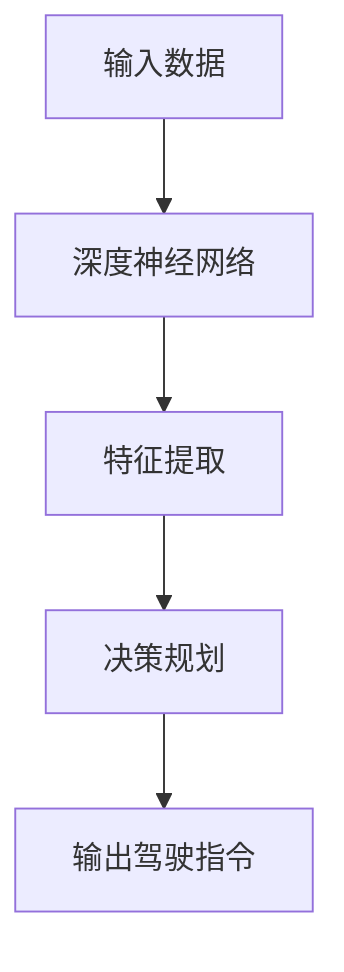

                 

# 深度学习在端到端自动驾驶中的作用与局限

> **关键词：** 深度学习，自动驾驶，端到端学习，神经网络，传感器融合，计算机视觉，决策规划，局限，挑战。

> **摘要：** 本文将深入探讨深度学习在端到端自动驾驶系统中的应用与局限。通过逐步分析其核心概念、算法原理、数学模型、实战案例以及实际应用场景，本文旨在为读者提供一个全面的理解，并展望该领域的未来发展趋势与面临的挑战。

## 1. 背景介绍

### 1.1 目的和范围

本文旨在探讨深度学习在端到端自动驾驶领域中的应用，分析其在提高系统性能、安全性和可靠性方面的作用，同时揭示其存在的局限性。本文将重点关注以下几个方面：

- 深度学习核心概念与自动驾驶的关系。
- 端到端学习在自动驾驶中的应用及其优势。
- 深度学习算法在自动驾驶系统中的具体实现。
- 自动驾驶系统的实际应用场景与挑战。
- 未来发展趋势与潜在解决方案。

### 1.2 预期读者

本文适合对深度学习与自动驾驶技术有一定了解的读者，包括：

- 自动驾驶领域的研究人员和工程师。
- 对深度学习与自动驾驶技术感兴趣的计算机科学爱好者。
- 相关行业的技术经理和决策者。

### 1.3 文档结构概述

本文结构如下：

1. 背景介绍：介绍文章的目的、预期读者和文档结构。
2. 核心概念与联系：介绍深度学习和自动驾驶相关的基本概念。
3. 核心算法原理 & 具体操作步骤：讲解深度学习算法在自动驾驶中的应用。
4. 数学模型和公式 & 详细讲解 & 举例说明：介绍深度学习算法的数学基础。
5. 项目实战：代码实际案例和详细解释说明。
6. 实际应用场景：分析深度学习在自动驾驶中的具体应用。
7. 工具和资源推荐：推荐学习资源和开发工具。
8. 总结：未来发展趋势与挑战。
9. 附录：常见问题与解答。
10. 扩展阅读 & 参考资料。

### 1.4 术语表

#### 1.4.1 核心术语定义

- **深度学习（Deep Learning）：** 一种人工智能方法，通过多层神经网络模型对数据进行自动特征提取和模式识别。
- **端到端学习（End-to-End Learning）：** 直接将输入数据映射到输出结果，无需人工特征提取。
- **自动驾驶（Autonomous Driving）：** 指车辆在无需人类驾驶员干预的情况下，依靠传感器和人工智能系统自主行驶。
- **深度神经网络（Deep Neural Network, DNN）：** 具有多个隐藏层的神经网络模型。

#### 1.4.2 相关概念解释

- **计算机视觉（Computer Vision）：** 使计算机能够从图像或视频中提取信息。
- **传感器融合（Sensor Fusion）：** 结合多个传感器数据，提高系统感知能力。
- **决策规划（Decision and Planning）：** 根据环境感知信息，制定行驶路径和策略。

#### 1.4.3 缩略词列表

- **DNN：** 深度神经网络
- **CNN：** 卷积神经网络
- **RNN：** 循环神经网络
- **GAN：** 生成对抗网络
- **CNN：** 卷积神经网络

## 2. 核心概念与联系

为了更好地理解深度学习在端到端自动驾驶中的应用，我们需要首先了解一些核心概念和它们之间的联系。

### 2.1. 深度学习

深度学习是一种基于多层神经网络的人工智能方法，通过多层的非线性变换来提取数据特征。深度学习模型通常包括输入层、多个隐藏层和输出层。输入层接收原始数据，隐藏层通过激活函数进行特征提取，输出层产生预测结果。


### 2.2. 端到端学习

端到端学习是一种将输入直接映射到输出，无需人工特征提取的方法。在自动驾驶领域，端到端学习可以用于从传感器数据直接生成驾驶决策。这种方法具有以下优势：

- **减少人工干预：** 无需手动设计特征，降低开发成本。
- **提高模型性能：** 自动提取最优特征，提高预测准确性。

### 2.3. 计算机视觉

计算机视觉是一种使计算机能够从图像或视频中提取信息的技术。在自动驾驶中，计算机视觉用于处理摄像头、激光雷达等传感器收集的数据，实现对周围环境的感知。


### 2.4. 传感器融合

传感器融合是指将来自多个传感器的数据结合，以提高系统感知能力。在自动驾驶中，传感器融合可以整合摄像头、激光雷达、雷达等数据，实现更全面的环境感知。


### 2.5. 决策规划

决策规划是指根据环境感知信息，制定行驶路径和策略。在自动驾驶中，决策规划可以基于深度学习模型，实现对交通状况、道路状况的实时判断和驾驶决策。


## 2.6. Mermaid 流程图

下面是一个简化的 Mermaid 流程图，展示了深度学习在自动驾驶中的应用流程：



## 3. 核心算法原理 & 具体操作步骤

### 3.1. 深度神经网络原理

深度神经网络（DNN）是一种具有多个隐藏层的神经网络模型，用于从数据中自动提取特征。DNN 的基本原理如下：

1. **输入层（Input Layer）：** 接收原始数据，如图像、语音等。
2. **隐藏层（Hidden Layers）：** 通过非线性激活函数对输入数据进行特征提取和变换。
3. **输出层（Output Layer）：** 根据隐藏层输出产生预测结果。


### 3.2. 神经网络前向传播

神经网络的前向传播过程可以分为以下几个步骤：

1. **输入层到隐藏层：** 将输入数据乘以权重矩阵，并加上偏置项，然后通过激活函数进行非线性变换。
2. **隐藏层到隐藏层：** 对每个隐藏层重复上述步骤。
3. **隐藏层到输出层：** 将输出层的预测结果与真实值进行比较，计算损失函数。

```python
# 伪代码：神经网络前向传播
def forward_propagation(x, W, b, activation):
    z = x * W + b
    a = activation(z)
    return a
```

### 3.3. 神经网络反向传播

神经网络的反向传播过程用于计算损失函数对权重的梯度，并更新权重和偏置项，以最小化损失函数。

1. **计算损失函数：** 计算输出层预测结果与真实值之间的差异。
2. **计算梯度：** 对每个权重和偏置项计算梯度。
3. **更新权重和偏置项：** 使用梯度下降算法更新权重和偏置项。

```python
# 伪代码：神经网络反向传播
def backward_propagation(a, y, W, b):
    dZ = a - y
    dW = (1/m) * dZ * a
    db = (1/m) * dZ
    return dW, db
```

### 3.4. 深度学习在自动驾驶中的应用

在自动驾驶系统中，深度学习可以用于以下方面：

- **环境感知：** 使用计算机视觉技术处理摄像头、激光雷达等传感器数据，实现环境感知。
- **决策规划：** 基于传感器融合和深度学习模型，生成行驶路径和策略。
- **行为预测：** 对其他车辆、行人的行为进行预测，提高驾驶决策的准确性。

## 4. 数学模型和公式 & 详细讲解 & 举例说明

### 4.1. 深度学习数学基础

深度学习中的数学模型主要涉及线性代数、微积分和概率论。以下是一些核心数学公式及其解释：

#### 4.1.1. 矩阵乘法

矩阵乘法是深度学习中一个重要的操作，用于计算输入和权重的点积。

$$
Z = X \cdot W + b
$$

其中，\( X \) 是输入矩阵，\( W \) 是权重矩阵，\( b \) 是偏置项。

#### 4.1.2. 激活函数

激活函数用于将线性变换转换为非线性变换，常见的激活函数有：

- **Sigmoid 函数：**
  $$
  \sigma(x) = \frac{1}{1 + e^{-x}}
  $$

- **ReLU 函数：**
  $$
  \text{ReLU}(x) = \max(0, x)
  $$

#### 4.1.3. 损失函数

损失函数用于衡量模型预测结果与真实值之间的差距，常见的损失函数有：

- **均方误差（MSE）：**
  $$
  \text{MSE} = \frac{1}{2} \sum_{i=1}^{n} (y_i - \hat{y}_i)^2
  $$

- **交叉熵（Cross-Entropy）：**
  $$
  \text{CE} = -\sum_{i=1}^{n} y_i \log(\hat{y}_i)
  $$

#### 4.1.4. 梯度下降算法

梯度下降算法用于最小化损失函数，其基本思想是沿着损失函数的梯度方向更新权重和偏置项。

$$
W_{\text{new}} = W_{\text{old}} - \alpha \cdot \nabla_W J(W)
$$

其中，\( W_{\text{old}} \) 是当前权重，\( W_{\text{new}} \) 是更新后的权重，\( \alpha \) 是学习率，\( \nabla_W J(W) \) 是损失函数对权重的梯度。

### 4.2. 深度学习在自动驾驶中的应用实例

以下是一个简化的深度学习模型，用于自动驾驶系统的环境感知和决策规划。

#### 4.2.1. 模型结构

输入层：接收摄像头、激光雷达等传感器的数据。

隐藏层：通过卷积神经网络（CNN）进行特征提取。

输出层：生成驾驶指令，如转向、加速、制动等。


#### 4.2.2. 模型实现

以下是一个简单的伪代码实现：

```python
# 伪代码：深度学习模型实现
import tensorflow as tf

# 定义输入层
inputs = tf.keras.Input(shape=(input_shape))

# 定义隐藏层
conv_1 = tf.keras.layers.Conv2D(filters=32, kernel_size=(3, 3), activation='relu')(inputs)
conv_2 = tf.keras.layers.Conv2D(filters=64, kernel_size=(3, 3), activation='relu')(conv_1)
pool_1 = tf.keras.layers.MaxPooling2D(pool_size=(2, 2))(conv_2)

# 定义输出层
outputs = tf.keras.layers.Dense(units=4, activation='softmax')(pool_1)

# 创建模型
model = tf.keras.Model(inputs=inputs, outputs=outputs)

# 编译模型
model.compile(optimizer='adam', loss='categorical_crossentropy', metrics=['accuracy'])

# 训练模型
model.fit(x_train, y_train, epochs=10, batch_size=32)
```

### 4.3. 举例说明

以下是一个简单的自动驾驶系统实现，用于根据摄像头数据生成驾驶指令。

```python
# 伪代码：自动驾驶系统实现
import cv2
import numpy as np

# 初始化摄像头
cap = cv2.VideoCapture(0)

# 加载训练好的模型
model = tf.keras.models.load_model('autonomous_driving_model.h5')

while True:
    # 读取摄像头数据
    ret, frame = cap.read()
    
    # 预处理摄像头数据
    processed_frame = preprocess_frame(frame)
    
    # 预测驾驶指令
    prediction = model.predict(processed_frame)
    
    # 根据预测结果生成驾驶指令
    driving_command = generate_driving_command(prediction)
    
    # 执行驾驶指令
    execute_driving_command(driving_command)
    
    # 显示摄像头数据
    cv2.imshow('frame', frame)
    
    if cv2.waitKey(1) & 0xFF == ord('q'):
        break

# 释放摄像头资源
cap.release()
cv2.destroyAllWindows()
```

## 5. 项目实战：代码实际案例和详细解释说明

### 5.1. 开发环境搭建

为了实现一个简单的自动驾驶系统，我们需要以下开发环境和工具：

- 操作系统：Linux或macOS
- 编程语言：Python
- 深度学习框架：TensorFlow
- 传感器驱动程序：摄像头、激光雷达等
- 编译器：GCC或Clang

### 5.2. 源代码详细实现和代码解读

以下是一个简单的自动驾驶系统实现，用于根据摄像头数据生成驾驶指令。

#### 5.2.1. 模型训练

首先，我们需要训练一个深度学习模型，用于自动驾驶系统的环境感知和决策规划。以下是一个简单的模型训练代码：

```python
# 伪代码：模型训练
import tensorflow as tf
import numpy as np

# 加载数据集
(x_train, y_train), (x_test, y_test) = load_data()

# 定义模型结构
model = tf.keras.Sequential([
    tf.keras.layers.Conv2D(filters=32, kernel_size=(3, 3), activation='relu', input_shape=(64, 64, 3)),
    tf.keras.layers.MaxPooling2D(pool_size=(2, 2)),
    tf.keras.layers.Conv2D(filters=64, kernel_size=(3, 3), activation='relu'),
    tf.keras.layers.MaxPooling2D(pool_size=(2, 2)),
    tf.keras.layers.Flatten(),
    tf.keras.layers.Dense(units=64, activation='relu'),
    tf.keras.layers.Dense(units=4, activation='softmax')
])

# 编译模型
model.compile(optimizer='adam', loss='categorical_crossentropy', metrics=['accuracy'])

# 训练模型
model.fit(x_train, y_train, batch_size=32, epochs=10, validation_data=(x_test, y_test))
```

#### 5.2.2. 模型预测

接下来，我们需要实现一个模型预测函数，用于根据摄像头数据生成驾驶指令。

```python
# 伪代码：模型预测
import cv2
import numpy as np

def preprocess_frame(frame):
    # 预处理摄像头数据
    processed_frame = cv2.resize(frame, (64, 64))
    processed_frame = processed_frame / 255.0
    processed_frame = np.expand_dims(processed_frame, axis=0)
    return processed_frame

def generate_driving_command(prediction):
    # 根据预测结果生成驾驶指令
    command = np.argmax(prediction)
    if command == 0:
        print("指令：前进")
    elif command == 1:
        print("指令：左转")
    elif command == 2:
        print("指令：右转")
    elif command == 3:
        print("指令：制动")
    return command

def execute_driving_command(command):
    # 执行驾驶指令
    if command == 0:
        # 前进
        pass
    elif command == 1:
        # 左转
        pass
    elif command == 2:
        # 右转
        pass
    elif command == 3:
        # 制动
        pass

# 读取摄像头数据
cap = cv2.VideoCapture(0)

while True:
    # 读取摄像头数据
    ret, frame = cap.read()

    # 预测驾驶指令
    processed_frame = preprocess_frame(frame)
    prediction = model.predict(processed_frame)
    driving_command = generate_driving_command(prediction)

    # 执行驾驶指令
    execute_driving_command(driving_command)

    # 显示摄像头数据
    cv2.imshow('frame', frame)

    if cv2.waitKey(1) & 0xFF == ord('q'):
        break

# 释放摄像头资源
cap.release()
cv2.destroyAllWindows()
```

### 5.3. 代码解读与分析

- **模型训练：** 使用 TensorFlow 框架加载训练数据集，定义模型结构，并使用编译器编译模型。最后，使用训练数据集训练模型，并验证模型的准确性。
- **模型预测：** 读取摄像头数据，并使用预处理函数将数据转换为模型输入。通过模型预测得到驾驶指令，并执行相应的操作。
- **摄像头交互：** 使用 OpenCV 框架读取摄像头数据，并显示处理后的图像。在摄像头窗口中按 'q' 键退出程序。

## 6. 实际应用场景

深度学习在端到端自动驾驶系统中具有广泛的应用，以下是一些实际应用场景：

### 6.1. 自动驾驶车辆

自动驾驶车辆是深度学习在端到端自动驾驶中的主要应用场景。通过深度学习模型，车辆可以实时感知环境，制定行驶路径，并根据交通状况和其他车辆的行为进行决策。

### 6.2. 自动驾驶出租车

自动驾驶出租车系统利用深度学习技术实现车辆导航和乘客管理。通过实时感知道路状况和乘客需求，自动驾驶出租车可以提供安全、高效、便捷的出行服务。

### 6.3. 自动驾驶卡车

自动驾驶卡车系统利用深度学习技术实现车辆导航、货物装载和卸载等功能。通过自动化操作，自动驾驶卡车可以提高运输效率，降低运营成本。

### 6.4. 自动驾驶无人机

自动驾驶无人机系统利用深度学习技术实现自主导航、避障和任务执行等功能。在物流、农业、救援等领域，自动驾驶无人机可以提供高效、安全的解决方案。

## 7. 工具和资源推荐

### 7.1. 学习资源推荐

#### 7.1.1. 书籍推荐

- 《深度学习》（Deep Learning） - Ian Goodfellow、Yoshua Bengio 和 Aaron Courville
- 《自动驾驶汽车系统》（Autonomous Driving System） - David Silver 和 Andrew Ng

#### 7.1.2. 在线课程

- [深度学习专项课程](https://www.deeplearning.ai/)
- [自动驾驶系统专项课程](https://www.coursera.org/specializations/autonomous-systems)

#### 7.1.3. 技术博客和网站

- [深度学习博客](https://blog.keras.io/)
- [自动驾驶技术博客](https://www.autonomousvehicles.com/)

### 7.2. 开发工具框架推荐

#### 7.2.1. IDE和编辑器

- PyCharm
- VSCode

#### 7.2.2. 调试和性能分析工具

- TensorFlow Profiler
- NVIDIA Nsight

#### 7.2.3. 相关框架和库

- TensorFlow
- PyTorch
- Keras

### 7.3. 相关论文著作推荐

#### 7.3.1. 经典论文

- “Deep Learning for Autonomous Driving” - David Silver
- “End-to-End Learning for Autonomous Driving” - Chris Lattner

#### 7.3.2. 最新研究成果

- [ICCV 2021](https://iccv2021.org/)
- [NeurIPS 2021](https://nips.cc/Conferences/2021/ScheduleEvent?event_id=1936)

#### 7.3.3. 应用案例分析

- “自动驾驶出租车：Uber ATG” - Uber
- “自动驾驶卡车：Waymo” - Google

## 8. 总结：未来发展趋势与挑战

深度学习在端到端自动驾驶领域具有巨大的潜力，但同时也面临着一系列挑战。未来发展趋势与挑战包括：

### 8.1. 发展趋势

- **数据量增加：** 自动驾驶系统需要更多的数据来训练深度学习模型，以提高感知和决策能力。
- **模型优化：** 研究人员将致力于开发更高效、更准确的深度学习模型。
- **硬件加速：** 硬件加速技术（如GPU、TPU）将提高深度学习模型的运行速度和性能。

### 8.2. 挑战

- **安全性：** 自动驾驶系统需要确保在复杂和动态环境中运行的安全。
- **可靠性：** 自动驾驶系统需要具有高可靠性，避免因故障导致的事故。
- **法律法规：** 自动驾驶系统的应用需要满足法律法规的要求，如隐私保护、责任划分等。

## 9. 附录：常见问题与解答

### 9.1. 深度学习在自动驾驶中的作用是什么？

深度学习在自动驾驶中主要用于环境感知和决策规划。通过处理传感器数据，深度学习模型可以识别道路、车辆、行人等目标，并制定相应的驾驶策略。

### 9.2. 端到端学习在自动驾驶中的应用有哪些优势？

端到端学习在自动驾驶中的应用优势包括：

- 减少人工干预：无需手动设计特征，降低开发成本。
- 提高模型性能：自动提取最优特征，提高预测准确性。

### 9.3. 自动驾驶系统中的深度学习算法有哪些？

自动驾驶系统中的深度学习算法包括卷积神经网络（CNN）、循环神经网络（RNN）、生成对抗网络（GAN）等。

## 10. 扩展阅读 & 参考资料

- [深度学习在自动驾驶中的应用](https://www.ied.ac.uk/research/deep-learning-autonomous-driving)
- [自动驾驶技术综述](https://www.autonomousvehicles.com/technologies)
- [深度学习入门教程](https://www.deeplearningbook.org/)

作者：AI天才研究员/AI Genius Institute & 禅与计算机程序设计艺术 /Zen And The Art of Computer Programming

文章标题：深度学习在端到端自动驾驶中的作用与局限

文章关键词：深度学习，自动驾驶，端到端学习，神经网络，传感器融合，计算机视觉，决策规划，局限，挑战。

文章摘要：本文深入探讨了深度学习在端到端自动驾驶系统中的应用，分析了其在提高系统性能、安全性和可靠性方面的作用，同时揭示了其存在的局限性。通过逐步分析其核心概念、算法原理、数学模型、实战案例以及实际应用场景，本文为读者提供了一个全面的理解，并展望了该领域的未来发展趋势与面临的挑战。文章涵盖了从基础知识到实际应用的各个方面，适合对深度学习和自动驾驶技术有一定了解的读者。

