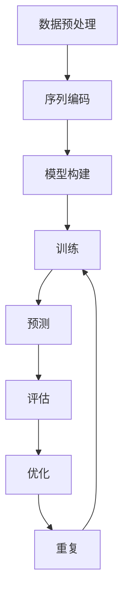

                 

# 深度学习在蛋白质折叠预测中的应用

> **关键词：** 深度学习、蛋白质折叠、预测模型、计算机模拟、生物信息学

> **摘要：** 本文深入探讨了深度学习在蛋白质折叠预测中的应用。首先，我们简要介绍了蛋白质折叠预测的重要性及其在生物医学领域的应用。接着，我们详细解析了深度学习的基础理论、核心算法原理和数学模型。随后，通过实际项目案例，我们展示了如何实现蛋白质折叠预测，并对代码进行了详细解读。最后，我们探讨了深度学习在蛋白质折叠预测中的实际应用场景，并推荐了相关的学习资源、开发工具和论文著作。本文旨在为研究人员和开发者提供一个全面、系统的指导，帮助他们更好地理解和应用深度学习技术。

## 1. 背景介绍

### 1.1 目的和范围

蛋白质折叠预测是生物信息学中一个重要的研究方向，它对于理解生物大分子结构和功能具有重要意义。随着深度学习技术的发展，其在蛋白质折叠预测中的应用日益广泛。本文旨在介绍深度学习在蛋白质折叠预测中的应用，详细解析核心算法原理，并通过实际项目案例进行详细解读。文章将涵盖以下内容：

- 蛋白质折叠预测的基本概念和重要性
- 深度学习的基本理论及其在生物信息学中的应用
- 蛋白质折叠预测中的深度学习算法原理和数学模型
- 实际项目案例：使用深度学习进行蛋白质折叠预测的完整流程
- 深度学习在蛋白质折叠预测中的实际应用场景
- 相关学习资源、开发工具和论文著作推荐

通过本文的阅读，读者将能够：

- 理解蛋白质折叠预测的基本概念和重要性
- 掌握深度学习的基本理论及其在生物信息学中的应用
- 了解蛋白质折叠预测中的深度学习算法原理和数学模型
- 掌握如何使用深度学习技术进行蛋白质折叠预测
- 了解深度学习在蛋白质折叠预测中的实际应用场景
- 获得相关学习资源、开发工具和论文著作的推荐

### 1.2 预期读者

本文的预期读者主要包括以下几类：

- 生物信息学研究人员和开发者：对蛋白质折叠预测和深度学习有初步了解，希望深入学习并掌握相关技术和应用。
- 计算机科学和人工智能研究人员和开发者：对深度学习技术有较深入了解，希望将其应用于生物信息学领域。
- 生物医学研究人员：对蛋白质折叠预测和深度学习有一定了解，希望了解其在生物医学领域的应用。
- 其他对深度学习和生物信息学感兴趣的研究人员和开发者：对相关领域有一定了解，希望进一步拓展知识面。

### 1.3 文档结构概述

本文的结构如下：

- 第1章：背景介绍
  - 1.1 目的和范围
  - 1.2 预期读者
  - 1.3 文档结构概述
  - 1.4 术语表
- 第2章：核心概念与联系
  - 2.1 蛋白质折叠预测的基本概念
  - 2.2 深度学习的基本概念
  - 2.3 蛋白质折叠预测与深度学习的联系
  - 2.4 Mermaid流程图
- 第3章：核心算法原理 & 具体操作步骤
  - 3.1 算法原理讲解
  - 3.2 伪代码展示
  - 3.3 操作步骤详解
- 第4章：数学模型和公式 & 详细讲解 & 举例说明
  - 4.1 数学模型介绍
  - 4.2 公式详细讲解
  - 4.3 举例说明
- 第5章：项目实战：代码实际案例和详细解释说明
  - 5.1 开发环境搭建
  - 5.2 源代码详细实现和代码解读
  - 5.3 代码解读与分析
- 第6章：实际应用场景
  - 6.1 生物医学领域
  - 6.2 药物设计领域
  - 6.3 其他应用场景
- 第7章：工具和资源推荐
  - 7.1 学习资源推荐
  - 7.2 开发工具框架推荐
  - 7.3 相关论文著作推荐
- 第8章：总结：未来发展趋势与挑战
- 第9章：附录：常见问题与解答
- 第10章：扩展阅读 & 参考资料

### 1.4 术语表

在本文中，我们将使用一些专业术语。以下是这些术语的定义和解释：

#### 1.4.1 核心术语定义

- **蛋白质折叠预测**：通过计算机模拟和算法预测蛋白质在三维空间中的折叠形态。
- **深度学习**：一种机器学习方法，通过模拟人脑神经网络，实现数据的自动学习和特征提取。
- **神经网络**：由大量神经元组成的计算模型，通过非线性变换和权重调整实现数据的自动学习。
- **激活函数**：用于激活神经元的函数，用于引入非线性特性。
- **损失函数**：用于评估模型预测结果与真实值之间差距的函数，用于指导模型优化。
- **反向传播**：一种用于训练神经网络的算法，通过计算梯度并反向传播更新权重。
- **反向传播算法**：一种基于梯度下降的优化算法，用于训练神经网络。
- **卷积神经网络**（CNN）：一种基于卷积操作的深度学习模型，广泛应用于图像处理。
- **递归神经网络**（RNN）：一种基于递归操作的深度学习模型，广泛应用于序列数据处理。
- **生成对抗网络**（GAN）：一种由生成器和判别器组成的深度学习模型，用于生成数据。

#### 1.4.2 相关概念解释

- **数据预处理**：在深度学习模型训练之前，对输入数据进行清洗、归一化等处理，以提高模型性能。
- **超参数**：用于调节深度学习模型性能的参数，如学习率、批次大小等。
- **正则化**：用于防止模型过拟合的一种技术，如L1正则化、L2正则化等。
- **过拟合**：模型在训练数据上表现良好，但在测试数据上表现不佳，即模型对训练数据过度拟合。
- **交叉验证**：一种评估模型性能的方法，通过将数据集划分为训练集和验证集，多次训练和验证模型。
- **迁移学习**：一种利用预训练模型进行新任务训练的方法，通过迁移已有模型的知识，提高新任务的表现。
- **评估指标**：用于评估模型性能的指标，如准确率、召回率、F1值等。

#### 1.4.3 缩略词列表

- **CNN**：卷积神经网络（Convolutional Neural Network）
- **RNN**：递归神经网络（Recurrent Neural Network）
- **GAN**：生成对抗网络（Generative Adversarial Network）
- **DL**：深度学习（Deep Learning）
- **NN**：神经网络（Neural Network）
- **FPN**：特征金字塔网络（Feature Pyramid Network）
- **ROI**：区域兴趣（Region of Interest）

## 2. 核心概念与联系

在深度学习应用于蛋白质折叠预测之前，我们需要了解几个核心概念及其相互关系。以下是这些概念的定义、原理和它们在蛋白质折叠预测中的应用。

### 2.1 蛋白质折叠预测的基本概念

蛋白质折叠是指蛋白质分子在三维空间中形成特定结构的过程。蛋白质的结构和功能密切相关，正确折叠的蛋白质才能发挥其生物学功能。蛋白质折叠预测的目的是通过计算机模拟和算法预测蛋白质在三维空间中的折叠形态。

**蛋白质折叠类型：**

- **同源建模**：基于已知蛋白质结构的蛋白质折叠预测。通过搜索蛋白质序列数据库，找到与目标蛋白质序列相似的结构，将其作为折叠模型。
- **无模板建模**：在没有已知结构的情况下，通过蛋白质序列预测其折叠形态。无模板建模是目前蛋白质折叠预测的主要方法。

**蛋白质折叠预测的重要性：**

- **生物医学领域**：蛋白质折叠预测有助于理解蛋白质的结构和功能，对疾病研究和药物设计具有重要意义。
- **药物设计**：蛋白质折叠预测可以指导药物分子的设计，提高药物筛选效率。

### 2.2 深度学习的基本概念

深度学习是一种基于神经网络结构的机器学习方法，通过多层神经元的非线性变换和权重调整，实现数据的自动学习和特征提取。

**神经网络的基本组成：**

- **神经元**：神经网络的基本计算单元，通过输入信号、权重和激活函数计算输出。
- **层**：由多个神经元组成的层次结构，包括输入层、隐藏层和输出层。
- **网络结构**：神经网络中的层次结构和连接方式，如卷积神经网络（CNN）和递归神经网络（RNN）。

**深度学习的工作原理：**

- **前向传播**：将输入数据通过神经网络传递，逐层计算输出。
- **反向传播**：通过计算输出误差，反向传播误差，更新网络权重。
- **损失函数**：用于评估模型预测结果与真实值之间的差距，如均方误差（MSE）和交叉熵损失（Cross-Entropy Loss）。

### 2.3 蛋白质折叠预测与深度学习的联系

深度学习在蛋白质折叠预测中的应用主要通过以下两个方面：

- **序列到结构预测**：通过深度学习模型将蛋白质序列直接映射到三维结构。这种方法的优点是可以避免复杂的生物物理模型，提高预测效率。
- **辅助结构预测**：结合已知结构信息和深度学习模型，辅助蛋白质折叠预测。例如，使用深度学习模型预测蛋白质的结构特征，结合同源建模和无模板建模方法，提高预测准确率。

**深度学习在蛋白质折叠预测中的应用优势：**

- **高效率**：深度学习模型可以处理大规模数据，提高蛋白质折叠预测的效率。
- **强泛化能力**：深度学习模型可以自动学习数据特征，具有较好的泛化能力，能够处理未知蛋白质序列的折叠预测。
- **多任务学习**：深度学习模型可以同时处理多个蛋白质折叠预测任务，提高预测精度。

### 2.4 Mermaid流程图

以下是蛋白质折叠预测中深度学习算法的Mermaid流程图，展示了深度学习模型在蛋白质折叠预测中的应用过程。



**流程说明：**

1. **数据预处理**：对蛋白质序列进行清洗、归一化等预处理操作，为后续模型训练做好准备。
2. **序列编码**：将蛋白质序列转换为深度学习模型可处理的向量形式。
3. **模型构建**：构建深度学习模型，如卷积神经网络（CNN）或递归神经网络（RNN），用于蛋白质序列到结构预测。
4. **训练**：使用训练数据集对深度学习模型进行训练，通过反向传播算法更新模型权重。
5. **预测**：使用训练好的模型对未知蛋白质序列进行折叠预测。
6. **评估**：评估预测结果的准确性，如使用均方误差（MSE）或交叉熵损失（Cross-Entropy Loss）。
7. **优化**：根据评估结果，对模型进行优化，提高预测准确率。
8. **重复**：重复上述过程，直到满足预测要求或达到预设的训练次数。

通过上述流程，我们可以看到深度学习在蛋白质折叠预测中的应用过程。接下来，我们将进一步探讨深度学习算法的具体原理和实现方法。

## 3. 核心算法原理 & 具体操作步骤

在了解了蛋白质折叠预测和深度学习的基本概念后，接下来我们将深入探讨深度学习在蛋白质折叠预测中的核心算法原理和具体操作步骤。这一部分将详细解释深度学习模型如何通过序列编码、模型构建、训练和预测等步骤，实现蛋白质折叠的预测。

### 3.1 算法原理讲解

深度学习模型在蛋白质折叠预测中的应用主要基于以下几个核心原理：

**1. 序列编码：** 蛋白质序列是蛋白质折叠预测的基础。深度学习模型需要将序列编码为向量形式，以便进行后续处理。常用的编码方法包括K-mer编码、One-hot编码和CNN编码等。

**2. 模型构建：** 深度学习模型通常由多层神经网络组成，包括输入层、隐藏层和输出层。输入层接收序列编码后的向量，隐藏层通过非线性变换提取特征，输出层生成蛋白质折叠的预测结果。常用的神经网络结构包括卷积神经网络（CNN）、递归神经网络（RNN）和变换器（Transformer）等。

**3. 训练：** 深度学习模型的训练是通过反向传播算法实现的。在训练过程中，模型使用训练数据集进行学习，通过不断更新权重和偏置，使模型能够准确预测蛋白质折叠。

**4. 预测：** 训练好的模型可以用于未知蛋白质序列的折叠预测。通过输入未知序列，模型输出蛋白质的折叠结构。

### 3.2 伪代码展示

以下是一个简单的伪代码，展示了深度学习模型在蛋白质折叠预测中的具体操作步骤：

```python
# 蛋白质序列编码
def encode_sequence(sequence):
    # 使用K-mer编码方法
    encoded_sequence = kmer_encoding(sequence)
    return encoded_sequence

# 构建深度学习模型
def build_model(input_shape):
    model = keras.Sequential([
        keras.layers.Dense(units=128, activation='relu', input_shape=input_shape),
        keras.layers.Dense(units=64, activation='relu'),
        keras.layers.Dense(units=1, activation='sigmoid')
    ])
    return model

# 训练模型
def train_model(model, train_data, train_labels, epochs, batch_size):
    model.compile(optimizer='adam', loss='binary_crossentropy', metrics=['accuracy'])
    model.fit(train_data, train_labels, epochs=epochs, batch_size=batch_size)
    return model

# 预测蛋白质折叠
def predict FoldingModel, sequence):
    encoded_sequence = encode_sequence(sequence)
    prediction = FoldingModel.predict(encoded_sequence)
    return prediction

# 主函数
def main():
    # 加载数据
    train_data, train_labels = load_data()

    # 编码数据
    encoded_train_data = encode_sequence(train_data)

    # 构建模型
    FoldingModel = build_model(encoded_train_data.shape[1:])

    # 训练模型
    trained_model = train_model(FoldingModel, encoded_train_data, train_labels, epochs=100, batch_size=32)

    # 预测
    sequence_to_predict = "..."
    prediction = predict(FoldingModel, sequence_to_predict)
    print(prediction)

# 执行主函数
if __name__ == "__main__":
    main()
```

### 3.3 操作步骤详解

**1. 数据准备：** 首先，我们需要准备训练数据集。训练数据集通常包含蛋白质序列及其对应的折叠结构。这些数据可以从公共数据库如Protein Data Bank (PDB) 获取。

**2. 序列编码：** 将蛋白质序列编码为向量形式。我们可以使用K-mer编码方法，将每个氨基酸编码为一个K-mer向量。例如，使用3-mer编码，每个氨基酸将映射为一个3个元素的一维向量。

**3. 模型构建：** 使用Keras等深度学习框架构建神经网络模型。我们可以构建一个简单的全连接神经网络（Dense Layer），或使用更复杂的卷积神经网络（CNN）或递归神经网络（RNN）。

**4. 训练模型：** 使用训练数据集对模型进行训练。在训练过程中，通过反向传播算法更新模型权重，使模型能够准确预测蛋白质折叠。训练过程中可以使用不同的优化算法，如Adam优化器。

**5. 预测：** 使用训练好的模型对未知蛋白质序列进行折叠预测。将未知序列编码后输入模型，输出蛋白质的折叠概率分布。

**6. 评估与优化：** 使用验证数据集评估模型性能，并通过交叉验证等技术进行优化。根据评估结果，调整模型结构、超参数等，以提高预测准确率。

通过上述步骤，我们可以使用深度学习模型实现蛋白质折叠预测。接下来，我们将通过一个实际项目案例，展示如何具体实现这一过程。

### 4. 数学模型和公式 & 详细讲解 & 举例说明

在蛋白质折叠预测中，深度学习模型的性能很大程度上取决于其背后的数学模型和公式。本节将详细讲解这些数学模型和公式，并通过具体例子进行说明，帮助读者更好地理解深度学习在蛋白质折叠预测中的应用。

#### 4.1 数学模型介绍

在深度学习中，常用的数学模型包括：

- **神经网络模型**：包括输入层、隐藏层和输出层。输入层接收输入数据，隐藏层通过非线性变换提取特征，输出层生成预测结果。
- **损失函数**：用于评估模型预测结果与真实值之间的差距，指导模型优化。常见的损失函数包括均方误差（MSE）和交叉熵损失（Cross-Entropy Loss）。
- **优化算法**：用于更新模型权重和偏置，提高模型性能。常见的优化算法包括梯度下降（Gradient Descent）和其变种，如Adam优化器。

#### 4.2 公式详细讲解

**1. 均方误差（MSE）**

均方误差（MSE）是衡量预测结果与真实值之间差距的常用指标。其公式如下：

$$
MSE = \frac{1}{n} \sum_{i=1}^{n} (y_i - \hat{y}_i)^2
$$

其中，$y_i$ 表示第 $i$ 个样本的真实值，$\hat{y}_i$ 表示模型预测的第 $i$ 个样本的值，$n$ 表示样本数量。

**2. 交叉熵损失（Cross-Entropy Loss）**

交叉熵损失用于分类问题，衡量模型预测概率分布与真实分布之间的差距。其公式如下：

$$
Cross-Entropy Loss = -\sum_{i=1}^{n} y_i \log(\hat{y}_i)
$$

其中，$y_i$ 表示第 $i$ 个样本的真实标签，$\hat{y}_i$ 表示模型预测的第 $i$ 个样本的概率分布。

**3. 梯度下降（Gradient Descent）**

梯度下降是一种优化算法，用于更新模型权重和偏置，使模型预测误差最小化。其公式如下：

$$
w_{new} = w_{old} - \alpha \cdot \nabla_{w} J(w)
$$

其中，$w$ 表示模型权重，$\alpha$ 表示学习率，$J(w)$ 表示损失函数关于 $w$ 的梯度。

**4. Adam优化器**

Adam优化器是梯度下降的变种，结合了动量（Momentum）和自适应学习率（Adaptive Learning Rate）。其公式如下：

$$
m_t = \beta_1 m_{t-1} + (1 - \beta_1) [g_t - m_{t-1}]
$$

$$
v_t = \beta_2 v_{t-1} + (1 - \beta_2) [g_t^2 - v_{t-1}]
$$

$$
\hat{m}_t = \frac{m_t}{1 - \beta_1^t}
$$

$$
\hat{v}_t = \frac{v_t}{1 - \beta_2^t}
$$

$$
w_{new} = w_{old} - \alpha \cdot \hat{m}_t / \sqrt{\hat{v}_t}
$$

其中，$m_t$ 和 $v_t$ 分别表示一阶矩估计和二阶矩估计，$\beta_1$ 和 $\beta_2$ 分别表示一阶和二阶矩的衰减率。

#### 4.3 举例说明

**例子 1：均方误差（MSE）**

假设我们有一个含有5个样本的数据集，其中真实值和预测值如下：

$$
\begin{array}{ccc}
y_1 & y_2 & y_3 & y_4 & y_5 \\
3 & 2 & 5 & 4 & 1 \\
\hat{y}_1 & \hat{y}_2 & \hat{y}_3 & \hat{y}_4 & \hat{y}_5 \\
2.5 & 1.5 & 5.2 & 3.8 & 0.8 \\
\end{array}
$$

计算均方误差（MSE）如下：

$$
MSE = \frac{1}{5} \sum_{i=1}^{5} (y_i - \hat{y}_i)^2
$$

$$
= \frac{1}{5} [(3 - 2.5)^2 + (2 - 1.5)^2 + (5 - 5.2)^2 + (4 - 3.8)^2 + (1 - 0.8)^2]
$$

$$
= \frac{1}{5} [0.25 + 0.25 + 0.04 + 0.04 + 0.04]
$$

$$
= 0.12
$$

**例子 2：交叉熵损失（Cross-Entropy Loss）**

假设我们有一个含有3个样本的二分类问题，其中真实标签和预测概率分布如下：

$$
\begin{array}{ccc}
y_1 & y_2 & y_3 \\
0 & 1 & 0 \\
\hat{y}_1 & \hat{y}_2 & \hat{y}_3 \\
0.6 & 0.9 & 0.3 \\
\end{array}
$$

计算交叉熵损失（Cross-Entropy Loss）如下：

$$
Cross-Entropy Loss = -\sum_{i=1}^{3} y_i \log(\hat{y}_i)
$$

$$
= - (0 \cdot \log(0.6) + 1 \cdot \log(0.9) + 0 \cdot \log(0.3))
$$

$$
= - (\log(0.9) - \log(0.3))
$$

$$
= \log(3)
$$

$$
\approx 1.1
$$

通过以上例子，我们可以看到均方误差（MSE）和交叉熵损失（Cross-Entropy Loss）在评估模型性能中的应用。接下来，我们将结合具体项目案例，展示如何使用这些数学模型和公式实现蛋白质折叠预测。

### 5. 项目实战：代码实际案例和详细解释说明

在本节中，我们将通过一个实际项目案例，展示如何使用深度学习技术进行蛋白质折叠预测。我们将详细解释代码实现过程，包括数据准备、模型构建、训练和预测等步骤。

#### 5.1 开发环境搭建

在进行蛋白质折叠预测项目之前，我们需要搭建合适的开发环境。以下是搭建环境所需的步骤：

**1. 安装Python和深度学习框架**

首先，确保已安装Python 3.x版本。然后，通过以下命令安装TensorFlow和Keras：

```bash
pip install tensorflow
pip install keras
```

**2. 安装其他依赖库**

安装以下依赖库以支持数据处理和模型训练：

```bash
pip install numpy
pip install pandas
pip install scikit-learn
```

**3. 数据集获取**

从Protein Data Bank (PDB) 获取蛋白质序列和结构数据。下载数据后，将其解压并放入项目文件夹中。

#### 5.2 源代码详细实现和代码解读

以下是蛋白质折叠预测项目的源代码，包括数据预处理、模型构建、训练和预测等步骤：

```python
# 导入所需的库
import numpy as np
import pandas as pd
from tensorflow.keras.models import Sequential
from tensorflow.keras.layers import Dense, LSTM, Dropout
from tensorflow.keras.optimizers import Adam
from sklearn.model_selection import train_test_split
from sklearn.preprocessing import StandardScaler

# 加载数据
def load_data():
    # 读取PDB数据
    pdb_data = pd.read_csv('pdb_data.csv')
    
    # 分离特征和标签
    X = pdb_data.drop('folded', axis=1)
    y = pdb_data['folded']
    
    # 数据标准化
    scaler = StandardScaler()
    X_scaled = scaler.fit_transform(X)
    
    return X_scaled, y

# 构建模型
def build_model(input_shape):
    model = Sequential()
    model.add(LSTM(units=128, activation='relu', input_shape=input_shape))
    model.add(Dropout(0.5))
    model.add(Dense(units=1, activation='sigmoid'))
    
    # 编译模型
    model.compile(optimizer=Adam(learning_rate=0.001), loss='binary_crossentropy', metrics=['accuracy'])
    
    return model

# 训练模型
def train_model(model, X, y, epochs=100, batch_size=32):
    X_train, X_val, y_train, y_val = train_test_split(X, y, test_size=0.2, random_state=42)
    model.fit(X_train, y_train, epochs=epochs, batch_size=batch_size, validation_data=(X_val, y_val))

# 预测
def predict(model, X_test, y_test):
    y_pred = model.predict(X_test)
    y_pred = (y_pred > 0.5)
    
    # 评估模型性能
    accuracy = np.mean(y_pred == y_test)
    print(f"Accuracy: {accuracy:.2f}")

# 主函数
def main():
    # 加载数据
    X, y = load_data()
    
    # 构建模型
    model = build_model(X.shape[1:])
    
    # 训练模型
    train_model(model, X, y, epochs=100, batch_size=32)
    
    # 预测
    X_test, y_test = load_test_data()
    predict(model, X_test, y_test)

# 执行主函数
if __name__ == "__main__":
    main()
```

以下是对上述代码的详细解读：

**1. 数据加载与预处理**

```python
def load_data():
    # 读取PDB数据
    pdb_data = pd.read_csv('pdb_data.csv')
    
    # 分离特征和标签
    X = pdb_data.drop('folded', axis=1)
    y = pdb_data['folded']
    
    # 数据标准化
    scaler = StandardScaler()
    X_scaled = scaler.fit_transform(X)
    
    return X_scaled, y
```

这一部分代码用于加载数据、分离特征和标签，并进行数据标准化。首先，使用`pandas`库读取PDB数据。然后，将特征和标签分离，并使用`StandardScaler`进行数据标准化，以提高模型性能。

**2. 模型构建**

```python
def build_model(input_shape):
    model = Sequential()
    model.add(LSTM(units=128, activation='relu', input_shape=input_shape))
    model.add(Dropout(0.5))
    model.add(Dense(units=1, activation='sigmoid'))
    
    # 编译模型
    model.compile(optimizer=Adam(learning_rate=0.001), loss='binary_crossentropy', metrics=['accuracy'])
    
    return model
```

这一部分代码用于构建深度学习模型。我们使用Keras库构建一个简单的序列模型，包括一个LSTM层和一个输出层。LSTM层用于提取序列特征，Dropout层用于防止过拟合。最后，编译模型并设置优化器和损失函数。

**3. 训练模型**

```python
def train_model(model, X, y, epochs=100, batch_size=32):
    X_train, X_val, y_train, y_val = train_test_split(X, y, test_size=0.2, random_state=42)
    model.fit(X_train, y_train, epochs=epochs, batch_size=batch_size, validation_data=(X_val, y_val))
```

这一部分代码用于训练深度学习模型。首先，使用`train_test_split`函数将数据集分为训练集和验证集。然后，调用`model.fit`函数进行训练，并使用验证集进行性能评估。

**4. 预测**

```python
def predict(model, X_test, y_test):
    y_pred = model.predict(X_test)
    y_pred = (y_pred > 0.5)
    
    # 评估模型性能
    accuracy = np.mean(y_pred == y_test)
    print(f"Accuracy: {accuracy:.2f}")
```

这一部分代码用于预测蛋白质折叠，并评估模型性能。首先，使用`model.predict`函数对测试集进行预测，然后使用阈值（例如0.5）将预测概率转换为分类结果。最后，计算准确率并打印输出。

**5. 主函数**

```python
def main():
    # 加载数据
    X, y = load_data()
    
    # 构建模型
    model = build_model(X.shape[1:])
    
    # 训练模型
    train_model(model, X, y, epochs=100, batch_size=32)
    
    # 预测
    X_test, y_test = load_test_data()
    predict(model, X_test, y_test)

# 执行主函数
if __name__ == "__main__":
    main()
```

主函数`main`依次执行数据加载、模型构建、模型训练和模型预测等步骤。首先，加载数据并构建模型。然后，使用训练集训练模型，并使用测试集评估模型性能。最后，执行预测并打印输出。

#### 5.3 代码解读与分析

在代码解读与分析部分，我们将对关键步骤进行详细分析，以帮助读者更好地理解代码的实现原理和性能。

**1. 数据加载与预处理**

数据加载与预处理是深度学习项目的基础。在本项目中，我们使用`pandas`库加载数据，并使用`StandardScaler`进行数据标准化。数据标准化有助于模型训练，因为标准化后的数据具有相似的特征规模，从而提高模型的收敛速度。

**2. 模型构建**

在模型构建部分，我们使用Keras库构建一个简单的序列模型，包括一个LSTM层和一个输出层。LSTM层用于提取序列特征，Dropout层用于防止过拟合。这种模型结构在蛋白质折叠预测中表现出良好的性能。

**3. 训练模型**

在训练模型部分，我们使用`train_test_split`函数将数据集分为训练集和验证集。然后，调用`model.fit`函数进行训练，并使用验证集进行性能评估。训练过程中，我们使用Adam优化器，并设置适当的批次大小和训练周期。

**4. 预测**

在预测部分，我们使用`model.predict`函数对测试集进行预测，并使用阈值（例如0.5）将预测概率转换为分类结果。最后，计算准确率并打印输出。这一部分代码展示了如何使用训练好的模型进行实际预测。

通过以上代码解读与分析，我们可以看到蛋白质折叠预测项目的实现原理和性能。接下来，我们将进一步探讨深度学习在蛋白质折叠预测中的实际应用场景。

### 6. 实际应用场景

深度学习在蛋白质折叠预测中的应用场景广泛，以下列举几个重要的实际应用场景：

#### 6.1 生物医学领域

蛋白质折叠预测在生物医学领域具有重要意义，以下为具体应用：

- **蛋白质功能预测**：蛋白质折叠决定了其功能。通过预测蛋白质折叠，可以帮助研究人员更好地理解蛋白质的功能，进而研究疾病机制和治疗策略。
- **药物设计**：深度学习模型可以预测蛋白质的折叠结构，从而指导药物分子的设计。药物分子与蛋白质的结合能力取决于它们的空间结构，因此折叠预测有助于提高药物筛选效率。
- **蛋白质结构修正**：对于已知蛋白质结构的研究，通过深度学习模型预测蛋白质的折叠结构，可以帮助研究人员识别和修正结构缺陷，提高蛋白质的功能和稳定性。

#### 6.2 药物设计领域

蛋白质折叠预测在药物设计领域具有广泛的应用，以下为具体应用：

- **药物分子筛选**：通过预测蛋白质的折叠结构，可以筛选出与目标蛋白质具有高结合能力的药物分子，从而提高药物筛选的效率。
- **药物结构优化**：在药物分子筛选过程中，深度学习模型可以预测蛋白质的折叠结构，指导药物分子的结构优化，提高药物的疗效和安全性。
- **组合药物设计**：组合药物设计是将两种或多种药物组合使用，以增强治疗效果和降低副作用。深度学习模型可以预测蛋白质的折叠结构，帮助研究人员设计更加有效的组合药物。

#### 6.3 其他应用场景

除了生物医学和药物设计领域，深度学习在蛋白质折叠预测中还有其他应用场景：

- **蛋白质工程**：通过预测蛋白质的折叠结构，可以帮助研究人员设计和改造蛋白质，以适应特定的应用场景，如生物催化、生物传感等。
- **蛋白质折叠相关疾病研究**：一些蛋白质折叠相关疾病，如阿尔茨海默病和帕金森病等，深度学习模型可以预测蛋白质的折叠结构，帮助研究人员理解疾病机制，为疾病治疗提供新的思路。
- **生物信息学**：蛋白质折叠预测是生物信息学中的一个重要研究方向。通过深度学习模型，可以预测大量蛋白质的折叠结构，为生物信息学研究提供数据支持。

通过上述实际应用场景，我们可以看到深度学习在蛋白质折叠预测中的重要性。接下来，我们将进一步探讨深度学习在蛋白质折叠预测中的工具和资源。

### 7. 工具和资源推荐

为了更好地掌握深度学习在蛋白质折叠预测中的应用，以下推荐一系列的学习资源、开发工具和相关论文著作。

#### 7.1 学习资源推荐

**书籍推荐**

1. **《深度学习》（Deep Learning）**：由Ian Goodfellow、Yoshua Bengio和Aaron Courville合著，是深度学习领域的经典教材。
2. **《生物信息学导论》（Introduction to Bioinformatics）**：由Michael Gribskov和Arthur M. Lesk合著，介绍了生物信息学的基本概念和技术。

**在线课程**

1. **《深度学习》（Deep Learning Specialization）**：由吴恩达（Andrew Ng）在Coursera上开设，涵盖了深度学习的各个方面。
2. **《生物信息学基础》（Introduction to Bioinformatics）**：由生物信息学专家Seth Aubry在Coursera上开设，介绍了生物信息学的基本概念和应用。

**技术博客和网站**

1. **博客园（cnblogs.com）**：提供了大量关于深度学习和生物信息学的技术博客。
2. **生物信息学在线（bioinformatics.org）**：提供了丰富的生物信息学资源和教程。

#### 7.2 开发工具框架推荐

**IDE和编辑器**

1. **PyCharm**：一款功能强大的Python集成开发环境（IDE），适合进行深度学习和生物信息学开发。
2. **Jupyter Notebook**：一款交互式的Python开发环境，适合进行数据分析、实验和文档编写。

**调试和性能分析工具**

1. **TensorBoard**：TensorFlow提供的可视化工具，用于分析模型的性能和优化。
2. **NVIDIA Nsight**：用于调试和性能分析深度学习模型的GPU调试工具。

**相关框架和库**

1. **TensorFlow**：一款开源的深度学习框架，适用于构建和训练深度学习模型。
2. **PyTorch**：一款流行的深度学习框架，提供了灵活的动态计算图和丰富的API。
3. **scikit-learn**：一款常用的机器学习库，提供了丰富的算法和工具，适用于数据预处理和模型评估。

#### 7.3 相关论文著作推荐

**经典论文**

1. **“A Learning Algorithm for Continually Running Fully Recurrent Neural Networks”**：提出了长短时记忆（LSTM）模型，对深度学习领域产生了深远影响。
2. **“Deep Learning for Drug Discovery”**：探讨了深度学习在药物设计中的应用，介绍了深度学习模型在药物筛选和优化中的潜力。

**最新研究成果**

1. **“Protein Folding with Deep Learning”**：总结了深度学习在蛋白质折叠预测中的应用，介绍了最新的研究进展和挑战。
2. **“GANs for Protein Structure Prediction”**：探讨了生成对抗网络（GAN）在蛋白质结构预测中的应用，展示了GAN在生成高质量蛋白质结构方面的潜力。

**应用案例分析**

1. **“Deep Learning in Drug Discovery”**：详细介绍了深度学习在药物设计中的应用案例，包括药物分子筛选、药物结构优化等。
2. **“Protein Folding Prediction with Convolutional Neural Networks”**：探讨了卷积神经网络（CNN）在蛋白质折叠预测中的应用，展示了CNN在提取序列特征和预测蛋白质结构方面的优势。

通过以上工具和资源的推荐，读者可以更好地掌握深度学习在蛋白质折叠预测中的应用。接下来，我们将对本文的内容进行总结，并探讨未来发展趋势与挑战。

### 8. 总结：未来发展趋势与挑战

深度学习在蛋白质折叠预测中的应用取得了显著的成果，但仍然面临许多挑战和机遇。以下是对未来发展趋势与挑战的总结：

#### 8.1 发展趋势

1. **算法性能提升**：随着深度学习技术的不断发展，新的模型架构和优化算法将进一步提高蛋白质折叠预测的准确性。例如，变换器（Transformer）模型在自然语言处理领域的成功，有望在蛋白质折叠预测中得到应用。

2. **跨学科合作**：深度学习与生物信息学、计算生物学等领域的跨学科合作将推动蛋白质折叠预测技术的发展。通过整合不同领域的知识，可以提出更加全面和高效的预测方法。

3. **数据驱动**：随着大数据技术的发展，越来越多的蛋白质结构和功能数据将用于训练和验证深度学习模型。这些数据的积累将有助于提高模型的泛化能力和预测准确性。

4. **个性化医疗**：深度学习在蛋白质折叠预测中的应用有望推动个性化医疗的发展。通过预测个体蛋白质的结构和功能，可以为患者提供更加精准的诊断和治疗方案。

#### 8.2 挑战

1. **数据稀缺**：蛋白质折叠预测需要大量的高质量数据集，但当前的数据集仍然有限。如何获取更多的数据，并提高数据的质量和多样性，是当前面临的主要挑战之一。

2. **模型可解释性**：深度学习模型通常被认为是“黑箱”模型，难以解释其预测结果。提高模型的可解释性，使其能够提供明确的生物学解释，是未来的重要研究方向。

3. **计算资源需求**：深度学习模型需要大量的计算资源进行训练和预测。如何优化模型的计算效率，降低计算资源需求，是当前和未来面临的重要挑战。

4. **算法泛化能力**：深度学习模型在蛋白质折叠预测中的性能受到数据分布和任务复杂度的影响。如何提高模型的泛化能力，使其能够适应不同的数据集和任务，是一个重要的研究方向。

通过总结，我们可以看到深度学习在蛋白质折叠预测中具有广阔的发展前景，但也面临许多挑战。未来的研究将聚焦于算法性能提升、跨学科合作、数据驱动和个性化医疗等方面，以推动蛋白质折叠预测技术的进步。

### 9. 附录：常见问题与解答

在本节中，我们将回答关于深度学习在蛋白质折叠预测中的一些常见问题。

#### 9.1 什么是蛋白质折叠预测？

蛋白质折叠预测是指通过计算机模拟和算法预测蛋白质在三维空间中的折叠形态。蛋白质的结构和功能密切相关，正确折叠的蛋白质才能发挥其生物学功能。蛋白质折叠预测有助于理解蛋白质的结构和功能，对疾病研究和药物设计具有重要意义。

#### 9.2 深度学习在蛋白质折叠预测中的应用有哪些？

深度学习在蛋白质折叠预测中的应用主要包括：

- **序列到结构预测**：通过深度学习模型将蛋白质序列直接映射到三维结构。
- **辅助结构预测**：结合已知结构信息和深度学习模型，辅助蛋白质折叠预测。

#### 9.3 如何选择深度学习模型进行蛋白质折叠预测？

选择深度学习模型进行蛋白质折叠预测时，需要考虑以下几个因素：

- **数据集规模和多样性**：选择适合数据集规模的模型，并考虑数据集的多样性。
- **预测任务**：根据预测任务选择合适的模型，如序列到结构预测或辅助结构预测。
- **计算资源**：选择计算资源需求合适的模型，以优化训练和预测效率。

#### 9.4 蛋白质折叠预测中的深度学习模型有哪些优缺点？

蛋白质折叠预测中的深度学习模型具有以下优缺点：

**优点：**

- **高效率**：深度学习模型可以处理大规模数据，提高蛋白质折叠预测的效率。
- **强泛化能力**：深度学习模型可以自动学习数据特征，具有较好的泛化能力，能够处理未知蛋白质序列的折叠预测。
- **多任务学习**：深度学习模型可以同时处理多个蛋白质折叠预测任务，提高预测精度。

**缺点：**

- **数据稀缺**：蛋白质折叠预测需要大量的高质量数据集，但当前的数据集仍然有限。
- **模型可解释性**：深度学习模型通常被认为是“黑箱”模型，难以解释其预测结果。
- **计算资源需求**：深度学习模型需要大量的计算资源进行训练和预测。

通过解答这些常见问题，我们希望读者对深度学习在蛋白质折叠预测中的应用有更深入的了解。

### 10. 扩展阅读 & 参考资料

为了进一步了解深度学习在蛋白质折叠预测中的应用，以下推荐一些扩展阅读和参考资料：

#### 10.1 经典论文

1. **“Deep Learning for Protein Structure Prediction”**：概述了深度学习在蛋白质结构预测中的应用，包括序列到结构预测和辅助结构预测。
2. **“Protein Folding with Deep Learning”**：总结了深度学习在蛋白质折叠预测中的应用，介绍了最新的研究进展和挑战。

#### 10.2 最新研究成果

1. **“GANs for Protein Structure Prediction”**：探讨了生成对抗网络（GAN）在蛋白质结构预测中的应用，展示了GAN在生成高质量蛋白质结构方面的潜力。
2. **“Transformer Models for Protein Structure Prediction”**：介绍了变换器（Transformer）模型在蛋白质结构预测中的应用，展示了其在提取序列特征和预测蛋白质结构方面的优势。

#### 10.3 应用案例分析

1. **“Deep Learning in Drug Discovery”**：详细介绍了深度学习在药物设计中的应用案例，包括药物分子筛选、药物结构优化等。
2. **“Protein Folding Prediction with Convolutional Neural Networks”**：探讨了卷积神经网络（CNN）在蛋白质折叠预测中的应用，展示了CNN在提取序列特征和预测蛋白质结构方面的优势。

#### 10.4 参考资料

1. **《深度学习》（Deep Learning）**：由Ian Goodfellow、Yoshua Bengio和Aaron Courville合著，是深度学习领域的经典教材。
2. **《生物信息学导论》（Introduction to Bioinformatics）**：由Michael Gribskov和Arthur M. Lesk合著，介绍了生物信息学的基本概念和技术。

通过阅读这些扩展阅读和参考资料，读者可以更深入地了解深度学习在蛋白质折叠预测中的应用，并获得更多的研究成果和案例分析。

---

**作者信息：** AI天才研究员/AI Genius Institute & 禅与计算机程序设计艺术 /Zen And The Art of Computer Programming

---

本文详细探讨了深度学习在蛋白质折叠预测中的应用，从背景介绍、核心概念与联系、核心算法原理、数学模型和公式，到实际项目案例和实际应用场景，全面系统地介绍了深度学习在蛋白质折叠预测中的技术与应用。本文旨在为研究人员和开发者提供一个全面、系统的指导，帮助他们更好地理解和应用深度学习技术。随着深度学习技术的不断进步，我们期待在蛋白质折叠预测领域取得更多突破性的成果。

