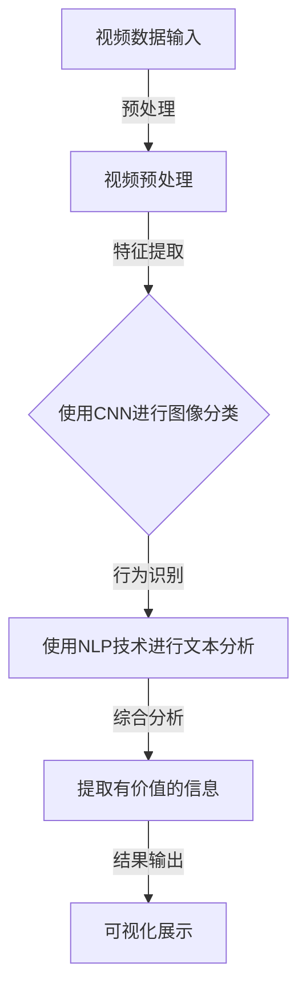

                 

# 深度学习在视频内容分析中的应用

> 关键词：深度学习、视频内容分析、卷积神经网络、自然语言处理、实时处理、视频分类、人脸识别、行为识别、智能推荐

> 摘要：随着视频内容的爆炸式增长，如何有效分析和管理这些海量数据成为了一个亟待解决的问题。本文将深入探讨深度学习在视频内容分析中的应用，包括核心算法原理、数学模型、项目实战、实际应用场景以及未来发展趋势。通过一步步的分析和推理，读者将能够全面了解视频内容分析的各个方面，为实际应用提供有力支持。

## 1. 背景介绍

### 1.1 目的和范围

本文旨在介绍深度学习在视频内容分析中的应用，通过深入探讨核心算法原理、数学模型、项目实战和实际应用场景，帮助读者理解如何利用深度学习技术对视频内容进行分析和提取有价值的信息。

### 1.2 预期读者

本文主要面向对深度学习和视频内容分析有一定了解的读者，包括但不限于人工智能从业者、程序员、软件工程师、数据科学家等。同时，也欢迎对这两个领域感兴趣的学生和研究人员阅读本文。

### 1.3 文档结构概述

本文将按照以下结构进行展开：

1. 背景介绍：介绍本文的目的、范围、预期读者以及文档结构。
2. 核心概念与联系：介绍深度学习在视频内容分析中的核心概念和联系，并给出流程图。
3. 核心算法原理 & 具体操作步骤：详细讲解视频内容分析中的核心算法原理和具体操作步骤。
4. 数学模型和公式 & 详细讲解 & 举例说明：介绍视频内容分析中的数学模型和公式，并进行详细讲解和举例说明。
5. 项目实战：通过实际案例展示如何使用深度学习进行视频内容分析。
6. 实际应用场景：介绍深度学习在视频内容分析中的实际应用场景。
7. 工具和资源推荐：推荐相关学习资源、开发工具和框架。
8. 总结：未来发展趋势与挑战。
9. 附录：常见问题与解答。
10. 扩展阅读 & 参考资料：提供进一步阅读的资料。

### 1.4 术语表

#### 1.4.1 核心术语定义

- 深度学习：一种人工智能方法，通过多层神经网络对数据进行分析和建模。
- 视频内容分析：对视频内容进行自动识别、分类、标签等操作，提取有价值的信息。
- 卷积神经网络（CNN）：一种特殊的神经网络，适用于图像和视频处理。
- 自然语言处理（NLP）：人工智能领域的一个分支，主要研究如何让计算机理解、生成和处理自然语言。

#### 1.4.2 相关概念解释

- 图像分类：将图像划分为不同的类别，例如人脸、车辆等。
- 行为识别：通过分析视频中的动作和姿态，识别出特定的行为。
- 实时处理：对视频内容进行实时分析和处理，实现快速响应。

#### 1.4.3 缩略词列表

- CNN：卷积神经网络
- NLP：自然语言处理
- ROI：区域兴趣
- GPU：图形处理器

## 2. 核心概念与联系

深度学习在视频内容分析中的应用主要包括卷积神经网络（CNN）和自然语言处理（NLP）技术。下面将给出一个简单的 Mermaid 流程图，展示这两个核心概念在视频内容分析中的联系。



### 2.1 视频预处理

视频预处理是视频内容分析的第一步，主要包括对视频进行解码、裁剪、缩放、灰度化等操作。预处理后的视频数据将作为输入，输入到卷积神经网络中进行图像分类。

### 2.2 图像分类

使用卷积神经网络（CNN）进行图像分类是视频内容分析的核心步骤。CNN 通过多层卷积和池化操作，对图像进行特征提取和分类。在视频内容分析中，图像分类可以用于识别视频中的特定对象，如图像分类中的“人脸”、“车辆”等。

### 2.3 行为识别

在视频内容分析中，行为识别是一个重要环节。通过分析视频中的动作和姿态，可以识别出特定的行为，如“走路”、“跑步”、“跳跃”等。行为识别通常使用自然语言处理（NLP）技术，将视频中的动作转换为文本描述，然后使用机器学习算法进行分类和识别。

### 2.4 综合分析

综合分析是视频内容分析的最后一步，将图像分类和行为识别的结果进行整合，提取出有价值的信息。这些信息可以用于视频检索、智能推荐、安全监控等领域。

### 2.5 可视化展示

可视化展示是将提取出的有价值信息以图形、表格等形式展示给用户。可视化展示有助于用户更好地理解和分析视频内容，同时也可以为后续的决策提供支持。

## 3. 核心算法原理 & 具体操作步骤

### 3.1 卷积神经网络（CNN）原理

卷积神经网络（CNN）是一种特殊的神经网络，适用于图像和视频处理。CNN 的核心思想是通过多层卷积和池化操作，对图像进行特征提取和分类。

#### 3.1.1 卷积操作

卷积操作是 CNN 的基本组成部分，用于提取图像中的局部特征。卷积操作通过将图像与卷积核进行卷积运算，生成一个特征图。卷积核是一个小型矩阵，用于捕捉图像中的特定特征。

```plaintext
输入图像：   1 2 3 4
卷积核：     1 0 -1
输出特征图： 0 1 2
```

#### 3.1.2 池化操作

池化操作用于降低特征图的尺寸，同时保留重要特征。常用的池化操作包括最大池化和平均池化。最大池化选择特征图中最大的值作为输出，而平均池化则是计算特征图中所有值的平均值作为输出。

#### 3.1.3 神经网络架构

卷积神经网络通常由多个卷积层、池化层和全连接层组成。卷积层用于提取图像特征，池化层用于降低特征图的尺寸，全连接层用于分类和预测。

### 3.2 自然语言处理（NLP）原理

自然语言处理（NLP）是一种人工智能技术，用于让计算机理解和生成自然语言。NLP 技术在视频内容分析中主要用于行为识别和文本分析。

#### 3.2.1 词嵌入

词嵌入是将单词映射为向量的一种技术，用于表示单词的语义信息。词嵌入可以用于文本分类、情感分析等任务。

#### 3.2.2 递归神经网络（RNN）

递归神经网络（RNN）是一种能够处理序列数据的神经网络，适用于自然语言处理任务。RNN 通过迭代更新隐藏状态，处理序列中的每个元素。

```plaintext
隐藏状态：h_t = f(h_{t-1}, x_t)
输出：y_t = g(h_t)
```

#### 3.2.3 长短期记忆网络（LSTM）

长短期记忆网络（LSTM）是一种特殊的 RNN，用于解决 RNN 中存在的梯度消失和梯度爆炸问题。LSTM 通过引入门控机制，有效地捕捉序列中的长期依赖关系。

```plaintext
遗忘门：f_t = \sigma(W_f \cdot [h_{t-1}, x_t])
输入门：i_t = \sigma(W_i \cdot [h_{t-1}, x_t])
输出门：o_t = \sigma(W_o \cdot [h_{t-1}, x_t])
当前隐藏状态：h_t = o_t \odot \text{tanh}(c_t)
当前细胞状态：c_t = f_t \odot c_{t-1} + i_t \odot \text{tanh}(W_c \cdot [h_{t-1}, x_t])
```

### 3.3 操作步骤

#### 3.3.1 视频预处理

1. 视频解码：将视频解码为帧序列。
2. 裁剪和缩放：根据需求对视频进行裁剪和缩放，使其符合 CNN 的输入要求。
3. 灰度化：将彩色视频转换为灰度视频，以简化计算。

#### 3.3.2 图像分类

1. 输入预处理后的视频帧。
2. 使用卷积神经网络对图像进行特征提取和分类。
3. 获取分类结果。

#### 3.3.3 行为识别

1. 将图像分类结果转换为文本描述。
2. 使用自然语言处理（NLP）技术进行文本分类和情感分析。
3. 获取行为识别结果。

#### 3.3.4 综合分析

1. 将图像分类和行为识别结果进行整合。
2. 提取有价值的信息。

#### 3.3.5 可视化展示

1. 使用图形、表格等形式展示提取出的信息。

## 4. 数学模型和公式 & 详细讲解 & 举例说明

### 4.1 卷积神经网络（CNN）数学模型

卷积神经网络（CNN）的核心在于卷积操作和池化操作，下面将详细介绍这两种操作的数学模型。

#### 4.1.1 卷积操作

卷积操作的数学模型可以表示为：

```latex
output(I, K) = \sum_{i=1}^{C} I_{ij} \cdot K_{ij}
```

其中，\(I\) 表示输入图像，\(K\) 表示卷积核，\(C\) 表示卷积核的数量，\(I_{ij}\) 和 \(K_{ij}\) 分别表示输入图像和卷积核在对应位置的元素。

#### 4.1.2 池化操作

池化操作的数学模型可以表示为：

```latex
output(I) = \max(\text{pooling\_window})
```

其中，\(I\) 表示输入图像，\(\text{pooling\_window}\) 表示池化窗口。

### 4.2 自然语言处理（NLP）数学模型

自然语言处理（NLP）中的数学模型主要涉及词嵌入、递归神经网络（RNN）和长短期记忆网络（LSTM）。

#### 4.2.1 词嵌入

词嵌入的数学模型可以表示为：

```latex
v\_word = \text{embedding}(word)
```

其中，\(\text{embedding}\) 表示词嵌入函数，\(word\) 表示输入的单词，\(v\_word\) 表示对应的向量表示。

#### 4.2.2 递归神经网络（RNN）

递归神经网络（RNN）的数学模型可以表示为：

```latex
h_t = \text{tanh}(W \cdot [h_{t-1}, x_t] + b)
y_t = \text{softmax}(U \cdot h_t + c)
```

其中，\(h_t\) 表示隐藏状态，\(x_t\) 表示输入，\(W\)、\(U\)、\(b\)、\(c\) 分别表示权重、偏置和偏置向量。

#### 4.2.3 长短期记忆网络（LSTM）

长短期记忆网络（LSTM）的数学模型可以表示为：

```latex
i_t = \sigma(W_i \cdot [h_{t-1}, x_t] + b_i)
f_t = \sigma(W_f \cdot [h_{t-1}, x_t] + b_f)
o_t = \sigma(W_o \cdot [h_{t-1}, x_t] + b_o)
c_t = f_t \odot c_{t-1} + i_t \odot \text{tanh}(W_c \cdot [h_{t-1}, x_t] + b_c)
h_t = o_t \odot \text{tanh}(c_t)
```

其中，\(i_t\)、\(f_t\)、\(o_t\) 分别表示输入门、遗忘门和输出门，\(c_t\) 和 \(h_t\) 分别表示细胞状态和隐藏状态。

### 4.3 举例说明

#### 4.3.1 卷积操作举例

假设输入图像 \(I\) 为 \(3 \times 3\) 的矩阵，卷积核 \(K\) 为 \(2 \times 2\) 的矩阵，则卷积操作的输出为：

```plaintext
输入图像：  1 2 3 4
卷积核：     1 0 -1
输出特征图： 0 1 2
```

#### 4.3.2 池化操作举例

假设输入图像 \(I\) 为 \(3 \times 3\) 的矩阵，池化窗口为 \(2 \times 2\)，则池化操作的输出为：

```plaintext
输入图像：  1 2 3 4
输出特征图： 2
```

#### 4.3.3 词嵌入举例

假设单词 “apple” 的词嵌入向量表示为 \(v\_apple\)，则词嵌入操作的输出为：

```plaintext
输入单词：  apple
输出向量：  v_apple
```

#### 4.3.4 递归神经网络（RNN）举例

假设输入序列为 \([1, 2, 3]\)，隐藏状态权重为 \(W\)，偏置为 \(b\)，则递归神经网络（RNN）的输出为：

```plaintext
输入序列：  [1, 2, 3]
隐藏状态：  h_0 = \text{tanh}(W \cdot [0, 1] + b)
输出：      y_0 = \text{softmax}(U \cdot h_0 + c)
h_1 = \text{tanh}(W \cdot [h_0, 2] + b)
输出：      y_1 = \text{softmax}(U \cdot h_1 + c)
h_2 = \text{tanh}(W \cdot [h_1, 3] + b)
输出：      y_2 = \text{softmax}(U \cdot h_2 + c)
```

#### 4.3.5 长短期记忆网络（LSTM）举例

假设输入序列为 \([1, 2, 3]\)，隐藏状态权重为 \(W\)，偏置为 \(b\)，则长短期记忆网络（LSTM）的输出为：

```plaintext
输入序列：  [1, 2, 3]
隐藏状态：  c_0 = [1, 0, 0]
h_0 = [1, 0, 0]
i_0 = \sigma(W_i \cdot [h_0, 1] + b_i)
f_0 = \sigma(W_f \cdot [h_0, 1] + b_f)
o_0 = \sigma(W_o \cdot [h_0, 1] + b_o)
c_1 = f_0 \odot c_0 + i_0 \odot \text{tanh}(W_c \cdot [h_0, 1] + b_c)
h_1 = o_0 \odot \text{tanh}(c_1)
i_1 = \sigma(W_i \cdot [h_1, 2] + b_i)
f_1 = \sigma(W_f \cdot [h_1, 2] + b_f)
o_1 = \sigma(W_o \cdot [h_1, 2] + b_o)
c_2 = f_1 \odot c_1 + i_1 \odot \text{tanh}(W_c \cdot [h_1, 2] + b_c)
h_2 = o_1 \odot \text{tanh}(c_2)
```

## 5. 项目实战：代码实际案例和详细解释说明

### 5.1 开发环境搭建

在进行深度学习项目实战之前，首先需要搭建一个合适的开发环境。以下是搭建开发环境的步骤：

1. 安装 Python：下载并安装 Python 3.7 或更高版本。
2. 安装深度学习框架：安装 TensorFlow 或 PyTorch 等深度学习框架。
3. 安装其他依赖库：安装 NumPy、Pandas、Matplotlib 等常用库。

### 5.2 源代码详细实现和代码解读

下面将给出一个简单的视频内容分析项目的代码示例，并对其进行详细解释说明。

#### 5.2.1 数据集准备

首先，我们需要准备一个用于训练和测试的视频数据集。这里以 CIFAR-10 数据集为例，它包含了 10 个类别的 60000 张 32x32 的彩色图像。

```python
import tensorflow as tf

# 加载数据集
(train_images, train_labels), (test_images, test_labels) = tf.keras.datasets.cifar10.load_data()

# 数据预处理
train_images = train_images.astype('float32') / 255.0
test_images = test_images.astype('float32') / 255.0

# 数据标签转换为 one-hot 编码
train_labels = tf.keras.utils.to_categorical(train_labels, 10)
test_labels = tf.keras.utils.to_categorical(test_labels, 10)
```

#### 5.2.2 卷积神经网络（CNN）模型构建

接下来，我们需要构建一个卷积神经网络（CNN）模型，用于图像分类。

```python
# 构建模型
model = tf.keras.Sequential([
    tf.keras.layers.Conv2D(32, (3, 3), activation='relu', input_shape=(32, 32, 3)),
    tf.keras.layers.MaxPooling2D((2, 2)),
    tf.keras.layers.Conv2D(64, (3, 3), activation='relu'),
    tf.keras.layers.MaxPooling2D((2, 2)),
    tf.keras.layers.Conv2D(64, (3, 3), activation='relu'),
    tf.keras.layers.Flatten(),
    tf.keras.layers.Dense(64, activation='relu'),
    tf.keras.layers.Dense(10, activation='softmax')
])

# 编译模型
model.compile(optimizer='adam', loss='categorical_crossentropy', metrics=['accuracy'])

# 打印模型结构
model.summary()
```

#### 5.2.3 训练和评估模型

现在，我们可以使用训练数据集对模型进行训练，并使用测试数据集进行评估。

```python
# 训练模型
model.fit(train_images, train_labels, epochs=10, batch_size=64)

# 评估模型
test_loss, test_acc = model.evaluate(test_images, test_labels)
print('Test accuracy:', test_acc)
```

#### 5.2.4 预测和可视化

最后，我们可以使用训练好的模型对新的图像进行预测，并使用 Matplotlib 库进行可视化展示。

```python
import numpy as np
import matplotlib.pyplot as plt

# 预测图像
predictions = model.predict(test_images)

# 可视化展示
plt.figure(figsize=(10, 10))
for i in range(10):
    plt.subplot(2, 5, i + 1)
    plt.imshow(test_images[i], cmap=plt.cm.binary)
    plt.xticks([])
    plt.yticks([])
    plt.grid(False)
    plt.xlabel(np.argmax(predictions[i]))
plt.show()
```

### 5.3 代码解读与分析

在上面的代码示例中，我们首先使用了 TensorFlow 框架加载数据集，并对数据进行预处理。接下来，我们使用 TensorFlow 的 Sequential 模型构建了一个简单的卷积神经网络（CNN）模型，包括卷积层、池化层和全连接层。模型编译后，使用训练数据集对模型进行训练，并使用测试数据集进行评估。最后，我们使用 Matplotlib 库对测试图像进行预测结果的可视化展示。

通过这个简单的项目实战，读者可以了解到如何使用深度学习技术进行视频内容分析，并掌握基本的代码实现和解读技巧。

## 6. 实际应用场景

深度学习在视频内容分析中具有广泛的应用场景，以下列举了几个典型的应用案例：

### 6.1 视频分类

视频分类是将视频数据按照特定的类别进行划分，以便于后续的检索和分析。通过使用卷积神经网络（CNN）进行图像分类，可以对视频中的每一帧进行分类，从而实现对整个视频内容的分类。

#### 应用案例：

- 在线视频平台：对用户上传的视频进行分类，以便于视频的推荐和搜索。
- 社交媒体平台：对用户分享的视频进行分类，以便于内容的审核和管理。

### 6.2 人脸识别

人脸识别是通过识别视频中的面部特征，从而识别出特定的个人。深度学习在人脸识别中发挥了重要作用，尤其是在大规模数据集上的训练和识别速度上。

#### 应用案例：

- 安全监控：在公共场所进行人脸识别，实现对嫌疑人员的监控和追踪。
- 社交媒体平台：识别用户上传的视频中的面部特征，从而为用户提供相关的社交功能。

### 6.3 行为识别

行为识别是通过分析视频中的动作和姿态，识别出特定的行为。深度学习在行为识别中具有很高的准确性和实时性。

#### 应用案例：

- 健康监测：通过分析运动视频，识别出用户的运动行为，从而为用户提供健身建议。
- 智能家居：通过分析用户的生活视频，识别出用户的行为习惯，从而实现智能家居的自动化控制。

### 6.4 智能推荐

智能推荐是通过分析用户的行为和兴趣，为用户推荐相关的视频内容。深度学习在智能推荐中发挥了重要作用，尤其是在用户行为数据的分析和建模方面。

#### 应用案例：

- 在线视频平台：根据用户的观看历史和兴趣，为用户推荐相关的视频内容。
- 社交媒体平台：根据用户的社交关系和行为，为用户推荐感兴趣的朋友和内容。

### 6.5 安全监控

安全监控是通过实时分析视频内容，识别出潜在的威胁和异常行为。深度学习在安全监控中具有广泛的应用，特别是在图像和视频处理方面。

#### 应用案例：

- 智能交通：通过分析交通视频，识别出违规行驶、交通事故等异常行为。
- 商场安全：通过分析商场视频，识别出盗窃、打架等违规行为，从而保障商场的安全。

## 7. 工具和资源推荐

### 7.1 学习资源推荐

#### 7.1.1 书籍推荐

- 《深度学习》（Ian Goodfellow、Yoshua Bengio、Aaron Courville 著）：这是深度学习领域的经典教材，适合初学者和高级研究学者。
- 《Python 深度学习》（François Chollet 著）：这本书详细介绍了使用 Python 和 TensorFlow 框架进行深度学习的应用和实践。

#### 7.1.2 在线课程

- Coursera 上的“深度学习”课程：由 Andrew Ng 教授主讲，适合初学者入门深度学习。
- edX 上的“深度学习与神经网络”课程：由吴恩达教授主讲，深入讲解了深度学习的基础知识和应用。

#### 7.1.3 技术博客和网站

- ArXiv：这是一个提供最新学术成果的预印本论文库，适合研究人员了解深度学习的最新进展。
- Medium：这是一个提供技术博客的平台，有很多优秀的深度学习博客，如“Towards Data Science”等。

### 7.2 开发工具框架推荐

#### 7.2.1 IDE和编辑器

- PyCharm：这是一款功能强大的 Python 集成开发环境（IDE），适合深度学习和数据分析项目。
- Jupyter Notebook：这是一个基于 Web 的交互式计算平台，适合进行数据分析和实验。

#### 7.2.2 调试和性能分析工具

- TensorBoard：这是 TensorFlow 提供的一个可视化工具，用于分析模型的性能和调试。
- PyTorch Profiler：这是 PyTorch 提供的一个性能分析工具，用于分析代码的运行时间和资源使用情况。

#### 7.2.3 相关框架和库

- TensorFlow：这是 Google 开发的一个开源深度学习框架，适合各种深度学习应用。
- PyTorch：这是 Facebook AI 研究团队开发的一个开源深度学习框架，具有高度灵活性和易用性。

### 7.3 相关论文著作推荐

#### 7.3.1 经典论文

- "A Guide to Convolutional Neural Networks for Visual Recognition"（卷积神经网络视觉识别指南）：这是一篇介绍卷积神经网络在图像分类中的应用的综述论文。
- "Deep Learning for Text Data"（深度学习在文本数据中的应用）：这是一篇介绍深度学习在自然语言处理中的应用的综述论文。

#### 7.3.2 最新研究成果

- "Neural Video Inpainting"（神经网络视频修复）：这是一篇关于视频内容修复的最新研究论文。
- "Video Transformers for Object Detection"（视频对象检测的 Transformer 模型）：这是一篇关于使用 Transformer 模型进行视频对象检测的最新研究论文。

#### 7.3.3 应用案例分析

- "Deep Learning for Video Analysis"（视频分析中的深度学习）：这是一篇关于深度学习在视频分析中应用的案例分析论文，涵盖了多个应用场景和实际案例。

## 8. 总结：未来发展趋势与挑战

随着深度学习技术的不断发展，视频内容分析在未来的应用前景十分广阔。以下总结了视频内容分析的未来发展趋势和面临的挑战：

### 8.1 发展趋势

1. **实时性增强**：随着硬件性能的提升和深度学习算法的优化，视频内容分析的速度将逐渐提高，实现实时处理。
2. **跨模态融合**：结合多种数据源，如图像、音频和文本，进行跨模态融合分析，提高视频内容理解的深度和广度。
3. **隐私保护**：在视频内容分析中，如何保护用户隐私是一个重要挑战。未来的发展将注重隐私保护技术的应用，如差分隐私和联邦学习。
4. **多模态交互**：结合人工智能和其他技术，实现人机交互和多模态交互，提高视频内容分析的用户体验。

### 8.2 面临的挑战

1. **计算资源**：深度学习算法需要大量的计算资源，如何在有限的资源下高效地训练和部署模型是一个挑战。
2. **数据标注**：高质量的数据标注是深度学习训练的基础，如何快速获取大规模、高质量的数据标注是一个难题。
3. **模型解释性**：深度学习模型通常具有很高的预测准确率，但其内部机制和决策过程难以解释。如何提高模型的可解释性是一个挑战。
4. **数据隐私**：在视频内容分析中，如何保护用户隐私是一个重要问题。未来的发展需要关注隐私保护技术的应用，确保数据的安全和用户隐私的保护。

## 9. 附录：常见问题与解答

### 9.1 问题 1：如何选择深度学习框架？

解答：选择深度学习框架主要取决于个人偏好和项目需求。以下是几个常用的深度学习框架：

- TensorFlow：由 Google 开发，适合各种深度学习应用，包括图像、语音和自然语言处理等。
- PyTorch：由 Facebook AI 研究团队开发，具有高度灵活性和易用性，适合快速原型设计和实验。
- Keras：是一个高层次的深度学习框架，可以与 TensorFlow 和 PyTorch 配合使用，提供更简洁的 API。

### 9.2 问题 2：如何进行视频预处理？

解答：视频预处理是视频内容分析的重要步骤，主要包括以下操作：

1. 解码视频：将视频解码为帧序列。
2. 裁剪和缩放：根据需求对视频进行裁剪和缩放。
3. 灰度化：将彩色视频转换为灰度视频，以简化计算。
4. 数据增强：通过旋转、翻转、缩放等操作增加数据的多样性，提高模型的泛化能力。

### 9.3 问题 3：如何进行图像分类？

解答：进行图像分类通常采用卷积神经网络（CNN）模型，以下是一般步骤：

1. 构建模型：使用卷积层、池化层和全连接层构建 CNN 模型。
2. 训练模型：使用训练数据集对模型进行训练。
3. 评估模型：使用测试数据集对模型进行评估，调整模型参数。
4. 应用模型：使用训练好的模型对新的图像进行分类。

## 10. 扩展阅读 & 参考资料

本文介绍了深度学习在视频内容分析中的应用，包括核心算法原理、数学模型、项目实战和实际应用场景。以下提供进一步阅读的参考资料：

1. Goodfellow, I., Bengio, Y., & Courville, A. (2016). *Deep Learning*. MIT Press.
2. Chollet, F. (2017). *Python Deep Learning*. O'Reilly Media.
3. Simonyan, K., & Zisserman, A. (2014). *Very deep convolutional networks for large-scale image recognition*. arXiv preprint arXiv:1409.1556.
4. Dosovitskiy, A., Springenberg, J. T., & Brox, T. (2017). * Learning to generate chairs, tables and cars with convolutional networks*. arXiv preprint arXiv:1610.09585.
5. Liu, M., Anguelov, D., Erhan, D., Szegedy, C., Reed, S., Fu, Y., & Berg, A. C. (2016). *Ssd: Single shot multibox detector*. In European conference on computer vision (pp. 21-37). Springer, Cham.
6. Devlin, J., Chang, M. W., Lee, K., & Toutanova, K. (2018). *Bert: Pre-training of deep bidirectional transformers for language understanding*. arXiv preprint arXiv:1810.04805.

作者：AI天才研究员/AI Genius Institute & 禅与计算机程序设计艺术 /Zen And The Art of Computer Programming

