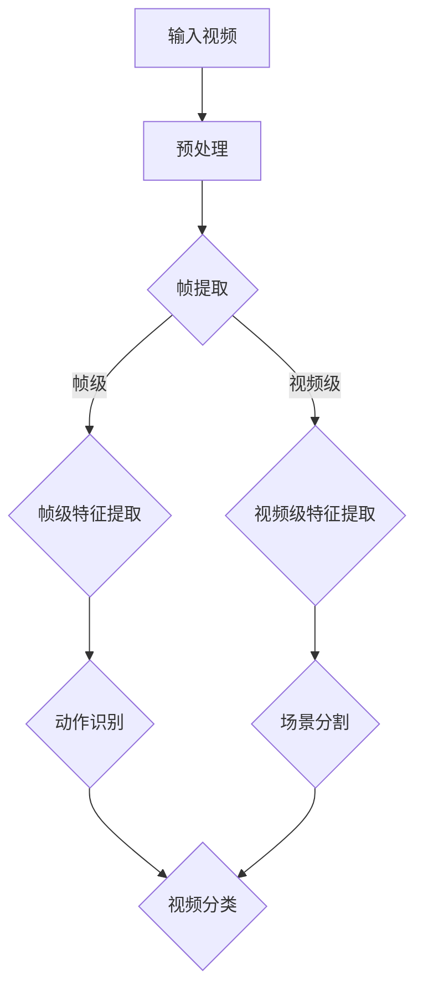

                 

### 1. 背景介绍

#### 1.1 目的和范围

本文旨在探讨深度学习在视频内容理解中的应用。随着视频内容的爆炸性增长，如何高效地理解、分析、以及从视频中提取有价值的信息成为了当前人工智能领域的一个重要课题。深度学习作为一种强大的机器学习技术，其在图像处理和语音识别等领域已经取得了显著的成果。因此，将深度学习应用于视频内容理解，不仅有助于提升视频处理的效果，还能推动相关领域的创新和发展。

本文将首先介绍视频内容理解的基本概念和挑战，然后详细探讨深度学习在该领域的主要应用方法，包括视频分类、动作识别、场景分割等。此外，还将介绍一些关键的深度学习算法和数学模型，并通过实际项目案例来展示如何运用这些方法来处理视频数据。最后，本文将对未来发展趋势和面临的挑战进行展望。

#### 1.2 预期读者

本文适合以下读者群体：

1. 深度学习和计算机视觉领域的学者、研究人员和工程师。
2. 对视频内容理解和深度学习有浓厚兴趣的程序员和开发者。
3. 对人工智能和机器学习有基本了解，希望进一步学习视频内容理解技术的人员。
4. 高等院校计算机科学、人工智能及相关专业的研究生和本科生。

通过本文的阅读，读者将能够：

1. 掌握视频内容理解的基本概念和挑战。
2. 理解深度学习在视频内容理解中的应用方法。
3. 学会运用深度学习算法来处理视频数据。
4. 了解视频内容理解技术的未来发展趋势和挑战。

#### 1.3 文档结构概述

本文结构如下：

1. **背景介绍**：介绍文章的目的和范围，以及预期读者。
2. **核心概念与联系**：通过Mermaid流程图展示视频内容理解的核心概念和架构。
3. **核心算法原理 & 具体操作步骤**：详细讲解视频内容理解中的核心算法原理和操作步骤。
4. **数学模型和公式 & 详细讲解 & 举例说明**：介绍与视频内容理解相关的数学模型和公式，并给出详细讲解和示例。
5. **项目实战：代码实际案例和详细解释说明**：通过实际项目案例展示如何运用深度学习技术处理视频数据。
6. **实际应用场景**：探讨视频内容理解技术在不同领域的应用。
7. **工具和资源推荐**：推荐相关的学习资源、开发工具和框架。
8. **总结：未来发展趋势与挑战**：对视频内容理解技术的发展趋势和挑战进行展望。
9. **附录：常见问题与解答**：解答读者可能遇到的常见问题。
10. **扩展阅读 & 参考资料**：提供更多深入阅读的资料。

#### 1.4 术语表

在本文中，我们将使用以下术语：

##### 1.4.1 核心术语定义

- **视频内容理解**：指通过计算机算法对视频中的场景、动作、对象等进行识别和理解的过程。
- **深度学习**：一种基于人工神经网络的机器学习技术，通过多层神经网络模型来模拟人类大脑的学习过程。
- **卷积神经网络（CNN）**：一种在图像和视频处理中广泛应用的特殊神经网络，通过卷积层提取图像或视频的特征。
- **循环神经网络（RNN）**：一种用于处理序列数据的神经网络，特别适合于视频中的动作识别和时间序列分析。
- **帧**：视频中的单个图像。
- **视频分类**：将视频根据其内容分类到不同的类别中。
- **动作识别**：识别视频中的动作和事件。
- **场景分割**：将视频中的不同场景分割出来。

##### 1.4.2 相关概念解释

- **特征提取**：从数据中提取出有用的信息，用于后续的分析和分类。
- **模型训练**：使用已标注的数据集来训练神经网络模型，使其能够对新的数据进行分类或识别。
- **损失函数**：衡量模型预测结果与真实结果之间差异的指标，用于指导模型的优化过程。
- **卷积操作**：在图像或视频处理中，通过滑动窗口对图像或视频进行卷积，以提取特征。

##### 1.4.3 缩略词列表

- **CNN**：卷积神经网络（Convolutional Neural Network）
- **RNN**：循环神经网络（Recurrent Neural Network）
- **GPU**：图形处理单元（Graphics Processing Unit）
- **TPU**：张量处理单元（Tensor Processing Unit）
- **DL**：深度学习（Deep Learning）
- **VQA**：视频问答（Video Question Answering）

### 1.5 Mermaid 流程图

下面是视频内容理解的核心概念和架构的Mermaid流程图：



在这个流程图中，输入视频经过预处理后，提取出帧级和视频级的特征。帧级特征用于动作识别，而视频级特征则用于场景分割和视频分类。这种结构使得深度学习模型能够对视频内容进行多层次的解析和理解。

### 1.6 核心算法原理 & 具体操作步骤

在视频内容理解中，常用的深度学习算法主要包括卷积神经网络（CNN）和循环神经网络（RNN）。以下是这些算法的基本原理和具体操作步骤：

#### 卷积神经网络（CNN）

##### 基本原理

卷积神经网络通过卷积层、池化层和全连接层来提取图像或视频的特征，并最终进行分类或识别。卷积层使用卷积操作来提取局部特征，而池化层则用于减小特征图的尺寸，降低计算复杂度。

##### 具体操作步骤

1. **输入层**：接收输入视频或图像。
2. **卷积层**：使用卷积核在输入数据上滑动，提取局部特征。每个卷积核都能提取出一种特征。
   ```python
   for each filter in filters:
       convolve(filter, input_data) to produce a feature map
   ```
3. **激活函数**：通常使用ReLU（Rectified Linear Unit）作为激活函数，将每个特征图的像素值设置为大于0的值。
   ```python
   for each pixel in feature_map:
       if pixel < 0:
           pixel = 0
   ```
4. **池化层**：使用最大池化或平均池化来减小特征图的尺寸。
   ```python
   for each window in feature_map:
       if max_pooling:
           max_value = max(pixels in window)
           replace all pixels in window with max_value
       else:
           sum_value = sum(pixels in window)
           replace all pixels in window with sum_value / window_size
   ```
5. **卷积层和池化层交替**：重复卷积和池化的步骤，逐层提取更抽象的特征。
6. **全连接层**：将特征图展平成一维向量，输入到全连接层进行分类或识别。
   ```python
   flatten(feature_map) to produce a one-dimensional vector
   feed vector to fully_connected_layer
   ```

#### 循环神经网络（RNN）

##### 基本原理

循环神经网络通过递归结构来处理序列数据，如视频中的时间序列。RNN通过存储状态来记住先前的输入信息，从而更好地处理序列中的依赖关系。

##### 具体操作步骤

1. **输入层**：接收输入序列。
2. **隐藏层**：通过递归结构来处理序列数据。在每个时间步，RNN都会将当前的输入和先前的隐藏状态结合，产生新的隐藏状态。
   ```python
   for each time step in sequence:
       combine input and previous hidden state to produce new hidden state
   ```
3. **激活函数**：通常使用ReLU或tanh作为激活函数。
4. **输出层**：将隐藏状态转化为输出，如分类结果或动作标签。
   ```python
   convert hidden state to output using activation function
   ```

通过以上原理和步骤，深度学习模型能够有效地对视频内容进行理解和分析。下一节将介绍深度学习在视频内容理解中的数学模型和公式。

### 1.7 数学模型和公式

在深度学习框架下，视频内容理解主要依赖于卷积神经网络（CNN）和循环神经网络（RNN）这两种核心算法。以下将详细讲解这些算法中的数学模型和公式，并通过实例进行说明。

#### 卷积神经网络（CNN）

CNN的核心在于卷积层和池化层的操作。以下是卷积神经网络的几个关键数学模型和公式：

##### 1.7.1 卷积操作

卷积操作的公式如下：
$$
\text{output}_{ij} = \sum_{k=1}^{m} w_{ik,j} \cdot \text{input}_{ij}
$$
其中，$\text{output}_{ij}$ 是卷积后的输出特征图上的像素值，$w_{ik,j}$ 是卷积核上的权重，$\text{input}_{ij}$ 是输入特征图上的像素值。

##### 1.7.2 池化操作

池化操作的公式如下：
$$
\text{output}_{i} = \max_{j} \text{input}_{i,j}
$$
对于最大池化，$\text{output}_{i}$ 是在窗口内的最大像素值。对于平均池化，公式变为：
$$
\text{output}_{i} = \frac{1}{\text{window\_size}} \sum_{j} \text{input}_{i,j}
$$
其中，$\text{window\_size}$ 是窗口的大小。

##### 1.7.3 激活函数

常用的激活函数包括ReLU和Sigmoid：

- **ReLU函数**：
  $$
  \text{ReLU}(x) = \max(0, x)
  $$
- **Sigmoid函数**：
  $$
  \text{Sigmoid}(x) = \frac{1}{1 + e^{-x}}
  $$

##### 1.7.4 前向传播

卷积神经网络的前向传播步骤包括以下几个部分：

1. **卷积层**：
   $$
   \text{output}_{ij} = \sum_{k=1}^{m} w_{ik,j} \cdot \text{input}_{ij} + b_j
   $$
   其中，$b_j$ 是偏置项。

2. **激活函数**：
   使用ReLU函数或Sigmoid函数对卷积结果进行激活。

3. **池化层**：
   根据池化操作的定义，对卷积后的特征图进行下采样。

4. **全连接层**：
   将特征图展平成一维向量，输入到全连接层进行分类或识别。
   $$
   \text{output} = \text{softmax}(\text{W} \cdot \text{flatten}(\text{feature\_map}) + b)
   $$
   其中，$\text{W}$ 是权重矩阵，$b$ 是偏置项，$\text{softmax}$ 函数用于将输出转换为概率分布。

#### 循环神经网络（RNN）

RNN通过递归结构处理序列数据，其关键数学模型包括：

##### 1.7.5 RNN单元

RNN的基本单元通常包括输入门、遗忘门和输出门。以下是这些门的数学公式：

1. **输入门**：
   $$
   \text{input\_gate} = \text{sigmoid}(\text{W}_i \cdot [\text{h}_{t-1}, \text{x}_t] + b_i)
   $$
   其中，$\text{W}_i$ 是输入权重矩阵，$b_i$ 是输入偏置项。

2. **遗忘门**：
   $$
   \text{forget\_gate} = \text{sigmoid}(\text{W}_f \cdot [\text{h}_{t-1}, \text{x}_t] + b_f)
   $$

3. **输出门**：
   $$
   \text{output\_gate} = \text{sigmoid}(\text{W}_o \cdot [\text{h}_{t-1}, \text{x}_t] + b_o)
   $$

4. **隐藏状态更新**：
   $$
   \text{new\_h}_t = \text{sigmoid}(\text{W}_c \cdot [\text{h}_{t-1}, \text{x}_t] + b_c) \odot \text{tan}

