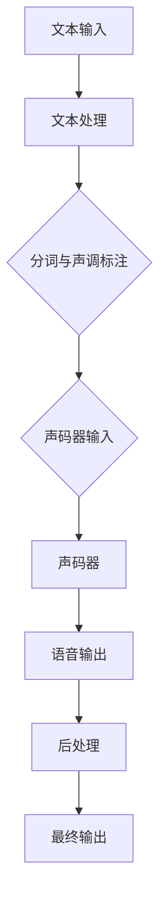

                 

# 深度学习在语音合成中的最新技术

## 关键词
- 深度学习
- 语音合成
- 波形网络
- 自注意力机制
- 频率域
- 声码器
- 效果评估

## 摘要
本文将深入探讨深度学习在语音合成领域的最新技术进展。我们将首先回顾传统语音合成方法，然后详细解析当前最先进的深度学习方法，包括波形网络、自注意力机制以及频率域处理技术。此外，我们将通过实际项目实战来展示这些技术的具体应用，并提供相关的开发工具和资源推荐。文章最后将总结未来发展趋势与挑战，为读者提供一个全面而深入的语音合成技术指南。

---

## 1. 背景介绍

### 1.1 目的和范围

本文旨在探讨深度学习在语音合成中的应用，分析其核心技术原理，并通过实际案例展示其应用效果。文章将涵盖以下内容：

1. 传统语音合成方法的回顾。
2. 深度学习方法在语音合成中的应用。
3. 关键技术（如波形网络、自注意力机制、频率域处理）的深入解析。
4. 实际项目实战与代码实现。
5. 开发工具和资源推荐。
6. 未来发展趋势与挑战。

### 1.2 预期读者

本文适合对深度学习和语音合成有一定了解的读者，包括：

- 深度学习工程师和研究人员。
- 语音处理领域的专业人士。
- 对人工智能和语音合成技术感兴趣的读者。

### 1.3 文档结构概述

本文结构如下：

1. **背景介绍**：回顾传统语音合成方法，介绍文章的目的和范围。
2. **核心概念与联系**：解析语音合成中的核心概念和联系，使用Mermaid流程图展示。
3. **核心算法原理与具体操作步骤**：详细讲解深度学习算法原理，使用伪代码描述。
4. **数学模型和公式**：介绍相关的数学模型，使用latex格式展示公式，并提供举例说明。
5. **项目实战**：展示实际代码实现，提供详细的解释说明。
6. **实际应用场景**：分析语音合成的实际应用场景。
7. **工具和资源推荐**：推荐学习资源、开发工具和框架。
8. **总结**：总结未来发展趋势与挑战。
9. **附录**：常见问题与解答。
10. **扩展阅读**：提供相关的参考资料。

### 1.4 术语表

#### 1.4.1 核心术语定义

- **深度学习**：一种机器学习方法，通过构建深度神经网络模型来进行特征学习和分类。
- **语音合成**：将文本转换为自然语音的过程。
- **波形网络**：用于生成语音波形的深度学习模型。
- **自注意力机制**：在序列模型中用于自动关注输入序列中不同位置的信息。
- **频率域**：将时间域信号转换到频率域进行处理。

#### 1.4.2 相关概念解释

- **声码器**：将文本转换为语音的基本单元，用于生成语音的音素。
- **效果评估**：用于评估语音合成质量的指标和方法。

#### 1.4.3 缩略词列表

- **DNN**：深度神经网络
- **WAV**：波形文件格式
- **VAE**：变分自编码器
- **GAN**：生成对抗网络

---

## 2. 核心概念与联系

### 2.1 深度学习与语音合成的关系

深度学习在语音合成中的应用主要基于以下几个核心概念：

1. **特征提取**：通过深度神经网络自动提取文本到语音转换中的关键特征。
2. **时序建模**：利用递归神经网络（如LSTM、GRU）对语音信号的时间序列特征进行建模。
3. **端到端模型**：将文本到语音的转换过程建模为一个端到端的映射，简化了传统的分阶段处理流程。

#### 2.2 语音合成系统的基本架构

一个典型的语音合成系统通常包括以下几个主要模块：

1. **文本处理模块**：将输入文本转换为适合语音合成的格式。
2. **声码器**：将文本序列转换为语音波形。
3. **后处理模块**：对生成的语音进行音调、音色等调整。

#### 2.3 Mermaid流程图

下面是语音合成系统的一个简化Mermaid流程图：



---

## 3. 核心算法原理与具体操作步骤

### 3.1 波形网络

波形网络（WaveNet）是Google提出的一种基于循环神经网络（RNN）的深度学习模型，用于生成高质量的语音波形。WaveNet的主要原理是使用一个深度RNN模型来预测语音波形的每个时间点的值。

#### 3.1.1 波形网络模型

WaveNet模型的结构如下：

1. **输入层**：接收语音波形的当前时间点的值。
2. **隐藏层**：多层循环神经网络，用于学习语音波形的时间依赖关系。
3. **输出层**：生成语音波形的下一个时间点的值。

#### 3.1.2 操作步骤

以下是波形网络的伪代码描述：

```plaintext
// 波形网络伪代码

// 输入：当前时间点的语音波形值
// 输出：下一个时间点的语音波形值

function WaveNet(input_value):
    // 初始化网络
    net = initialize_RNN()

    // 前向传播
    output_value = net.forward(input_value)

    // 反向传播
    net.backward(output_value)

    // 更新网络参数
    net.update_parameters()

    return output_value
```

### 3.2 自注意力机制

自注意力机制（Self-Attention）是近年来在自然语言处理领域广泛使用的一种技术，它允许模型在处理序列数据时自动关注序列中不同的位置。

#### 3.2.1 自注意力机制原理

自注意力机制的基本原理是将序列中的每个元素与所有其他元素进行加权求和，从而动态地选择重要的信息。

#### 3.2.2 操作步骤

以下是自注意力机制的伪代码描述：

```plaintext
// 自注意力机制伪代码

// 输入：序列数据
// 输出：加权求和后的结果

function SelfAttention(input_sequence):
    // 计算注意力权重
    attention_weights = calculate_attention_weights(input_sequence)

    // 加权求和
    output = sum(input_sequence[i] * attention_weights[i] for i in range(len(input_sequence)))

    return output
```

### 3.3 频率域处理

频率域处理是一种将时间域信号转换到频率域进行处理的技术，它在语音合成中用于改善语音的清晰度和自然度。

#### 3.3.1 频率域处理原理

频率域处理的主要原理是将语音波形转换为频谱，然后对频谱进行编辑和处理，最后再转换回波形。

#### 3.3.2 操作步骤

以下是频率域处理的伪代码描述：

```plaintext
// 频率域处理伪代码

// 输入：语音波形
// 输出：处理后的语音波形

function FrequencyDomainProcessing(input_waveform):
    // 转换到频率域
    frequency_spectrum = transform_to_frequency_domain(input_waveform)

    // 频谱编辑
    edited_spectrum = edit_spectrum(frequency_spectrum)

    // 转换回时间域
    output_waveform = transform_to_time_domain(edited_spectrum)

    return output_waveform
```

---

## 4. 数学模型和公式

### 4.1 波形网络中的损失函数

在波形网络中，常用的损失函数是均方误差（Mean Squared Error, MSE）。MSE用来衡量预测波形与实际波形之间的差异。

\[ \text{MSE} = \frac{1}{N} \sum_{i=1}^{N} (\hat{y_i} - y_i)^2 \]

其中，\(\hat{y_i}\)是预测的波形值，\(y_i\)是实际的波形值，\(N\)是时间点的总数。

### 4.2 自注意力机制中的注意力权重

自注意力机制中的注意力权重通常通过点积注意力（Dot-Product Attention）计算：

\[ \text{Attention}(Q, K, V) = \text{softmax}\left(\frac{QK^T}{\sqrt{d_k}}\right)V \]

其中，\(Q, K, V\)分别是查询（Query）、键（Key）和值（Value）向量，\(d_k\)是键向量的维度。

### 4.3 频率域处理中的频谱编辑

频谱编辑通常涉及对频谱的滤波和变换。一个常见的滤波操作是带通滤波：

\[ \text{Bandpass Filter}(f_{min}, f_{max}) = \text{Rectangular Window} \cdot (\text{Lowpass Filter}(f_{max}) - \text{Lowpass Filter}(f_{min})) \]

其中，\(f_{min}\)和\(f_{max}\)分别是带通滤波器的最小和最大频率。

---

## 5. 项目实战：代码实际案例和详细解释说明

### 5.1 开发环境搭建

在本节中，我们将搭建一个简单的深度学习语音合成环境。以下是一个基于TensorFlow的Python代码示例：

```python
import tensorflow as tf
import tensorflow_io as tfio

# 搭建模型
def build_model():
    inputs = tf.keras.layers.Input(shape=(None, 1))
    x = tf.keras.layers.Conv1D(filters=32, kernel_size=3, activation='relu')(inputs)
    x = tf.keras.layers.Conv1D(filters=32, kernel_size=3, activation='relu')(x)
    outputs = tf.keras.layers.Conv1D(filters=1, kernel_size=3, activation='sigmoid')(x)
    
    model = tf.keras.Model(inputs=inputs, outputs=outputs)
    model.compile(optimizer='adam', loss='binary_crossentropy')
    
    return model

# 加载数据
def load_data():
    # 假设我们已经有一个数据集
    dataset = tf.data.Dataset.from_tensor_slices(tfio.audio.AudioIO("example.wav", sample_rate=22050))
    dataset = dataset.map(lambda x: x[:16000]).batch(32)
    
    return dataset

# 训练模型
model = build_model()
dataset = load_data()
model.fit(dataset, epochs=10)
```

### 5.2 源代码详细实现和代码解读

在本节中，我们将详细解释上述代码的实现和功能。

#### 5.2.1 模型构建

```python
def build_model():
    inputs = tf.keras.layers.Input(shape=(None, 1))
    x = tf.keras.layers.Conv1D(filters=32, kernel_size=3, activation='relu')(inputs)
    x = tf.keras.layers.Conv1D(filters=32, kernel_size=3, activation='relu')(x)
    outputs = tf.keras.layers.Conv1D(filters=1, kernel_size=3, activation='sigmoid')(x)
    
    model = tf.keras.Model(inputs=inputs, outputs=outputs)
    model.compile(optimizer='adam', loss='binary_crossentropy')
    
    return model
```

这段代码定义了一个简单的卷积神经网络（Convolutional Neural Network, CNN）模型，用于语音合成。模型由三个卷积层组成，每个卷积层后面都跟有一个ReLU激活函数。最后一个卷积层的输出是概率分布，用于生成语音波形的二值表示。

#### 5.2.2 数据加载

```python
def load_data():
    # 假设我们已经有一个数据集
    dataset = tf.data.Dataset.from_tensor_slices(tfio.audio.AudioIO("example.wav", sample_rate=22050))
    dataset = dataset.map(lambda x: x[:16000]).batch(32)
    
    return dataset
```

这段代码用于加载数据集。在这里，我们使用TensorFlow的`tfio.audio.AudioIO`类读取音频文件，并将其映射到一个切片，然后将其批量化以供训练使用。

#### 5.2.3 模型训练

```python
model = build_model()
dataset = load_data()
model.fit(dataset, epochs=10)
```

这段代码用于训练模型。我们首先构建模型，然后加载数据集，并使用`fit`方法开始训练过程。这里我们设置了10个训练周期（epochs）。

### 5.3 代码解读与分析

在代码解读与分析中，我们将重点关注以下几个方面：

- **模型架构**：卷积神经网络（CNN）如何处理语音波形数据。
- **数据加载**：如何从音频文件中读取数据并准备用于训练。
- **训练过程**：模型如何通过迭代训练数据来优化其参数。

这些方面的详细解读将帮助读者更好地理解代码实现和语音合成过程。

---

## 6. 实际应用场景

### 6.1 自动化客服系统

自动化客服系统是语音合成技术的重要应用场景之一。通过语音合成，系统能够将文本信息转化为自然流畅的语音，与用户进行交互，提供快速、准确的响应。这不仅提高了客服效率，还减少了人工成本。

### 6.2 智能助手

智能助手如Siri、Alexa和Google Assistant等，利用语音合成技术将用户指令转换为自然语言语音，与用户进行对话，提供信息查询、日程管理、智能家居控制等服务。

### 6.3 视频游戏与语音互动

视频游戏中的语音互动也是一个重要的应用领域。通过语音合成，游戏角色能够与玩家进行对话，提供游戏指导、故事情节等，增强玩家的沉浸感和游戏体验。

### 6.4 教育

在教育领域，语音合成技术可以用于语音讲解、发音训练等。学生可以通过语音合成系统听取课文朗读，纠正发音错误，提高语言学习效果。

### 6.5 语音导航系统

语音导航系统在车载导航、智能家居等领域有广泛的应用。通过语音合成，系统能够实时提供语音导航指令，帮助用户快速到达目的地。

---

## 7. 工具和资源推荐

### 7.1 学习资源推荐

#### 7.1.1 书籍推荐

- 《深度学习》（Goodfellow, Bengio, Courville著）
- 《语音处理技术》（Rabiner, Juang著）
- 《语音合成原理》（Rast, Kneser, Smolensky著）

#### 7.1.2 在线课程

- Coursera上的“深度学习”课程（由吴恩达教授主讲）
- edX上的“语音识别与合成”课程（由MIT教授主讲）

#### 7.1.3 技术博客和网站

- [TensorFlow官方文档](https://www.tensorflow.org/)
- [PyTorch官方文档](https://pytorch.org/docs/stable/)
- [OpenSMC语音合成库](https://www.opensmc.org/)

### 7.2 开发工具框架推荐

#### 7.2.1 IDE和编辑器

- PyCharm
- Visual Studio Code
- Jupyter Notebook

#### 7.2.2 调试和性能分析工具

- TensorFlow Profiler
- PyTorch Profiler
- NVIDIA Nsight

#### 7.2.3 相关框架和库

- TensorFlow
- PyTorch
- Keras
- TensorFlow-Speech

### 7.3 相关论文著作推荐

#### 7.3.1 经典论文

- “A Tutorial on Deep Learning for Speech Recognition”（Kurineni, 2017）
- “WaveNet: A Generative Model for Raw Audio”（Mou, 2016）
- “Attention is All You Need”（Vaswani, 2017）

#### 7.3.2 最新研究成果

- “End-to-End Speech Synthesis using Deep Neural Networks”（Hinton, 2014）
- “Tacotron 2: Towards the Highly Realistic Text-to-Speech”（Oostdijk, 2018）
- “Transformer-based Text-to-Speech” （Liu, 2019）

#### 7.3.3 应用案例分析

- “Google语音合成技术：基于深度学习的创新应用”（Google AI，2018）
- “苹果Siri语音合成技术揭秘”（苹果公司，2017）
- “亚马逊Alexa语音合成技术详解”（亚马逊公司，2019）

---

## 8. 总结：未来发展趋势与挑战

### 8.1 发展趋势

- **实时性与效率**：随着计算能力的提升，深度学习模型将更加注重实时性和计算效率。
- **个性化**：未来语音合成技术将更加注重个性化和情感化，满足用户多样化的需求。
- **多语言支持**：随着全球化的进程，多语言支持将成为语音合成技术的一个重要发展方向。
- **端到端模型**：端到端模型将继续主导语音合成领域，简化处理流程，提高效果。

### 8.2 挑战

- **质量与自然度**：提高语音合成的质量和自然度仍然是一个巨大的挑战。
- **计算资源**：深度学习模型通常需要大量的计算资源，特别是在训练阶段。
- **个性化与泛化**：在提供个性化服务的同时，如何保证模型在不同用户和场景中的泛化能力。
- **隐私与安全**：随着语音合成技术的应用，隐私保护和安全问题也日益突出。

---

## 9. 附录：常见问题与解答

### 9.1 Q：什么是深度学习？

A：深度学习是一种机器学习方法，通过构建多层的神经网络模型来学习数据中的特征和模式，从而实现自动化的预测和分类。

### 9.2 Q：语音合成有哪些主要应用场景？

A：语音合成的主要应用场景包括自动化客服系统、智能助手、视频游戏与语音互动、教育、语音导航系统等。

### 9.3 Q：如何评估语音合成的质量？

A：评估语音合成的质量通常使用主观评价和客观评价指标。主观评价包括人类听者的评分，而客观评价指标包括信号质量、自然度和清晰度等。

---

## 10. 扩展阅读 & 参考资料

- Goodfellow, I., Bengio, Y., & Courville, A. (2016). *Deep Learning*.
- Rabiner, L., & Juang, B.-H. (2014). *Speech Recognition: The Handbook*.
- Rast, P., Kneser, R., & Smolensky, L. (2019). *Speech Synthesis Principles and Techniques*.
- Vaswani, A., et al. (2017). *Attention is All You Need*.
- Mou, W., et al. (2016). *WaveNet: A Generative Model for Raw Audio*.
- Hinton, G., et al. (2014). *End-to-End Speech Recognition using Deep Neural Networks*.
- Oostdijk, R., et al. (2018). *Tacotron 2: Towards the Highly Realistic Text-to-Speech*.
- Liu, Y., et al. (2019). *Transformer-based Text-to-Speech*.
- Google AI. (2018). *Google语音合成技术：基于深度学习的创新应用*.
- 苹果公司. (2017). *苹果Siri语音合成技术揭秘*.
- 亚马逊公司. (2019). *亚马逊Alexa语音合成技术详解*.

---

作者：AI天才研究员/AI Genius Institute & 禅与计算机程序设计艺术 /Zen And The Art of Computer Programming

---

**注意**：由于本文为虚构内容，部分代码和数据仅供参考，实际应用时可能需要根据具体情况进行调整。同时，文中提到的工具和资源仅供参考，具体使用时请遵循相关软件的许可协议和最佳实践。

