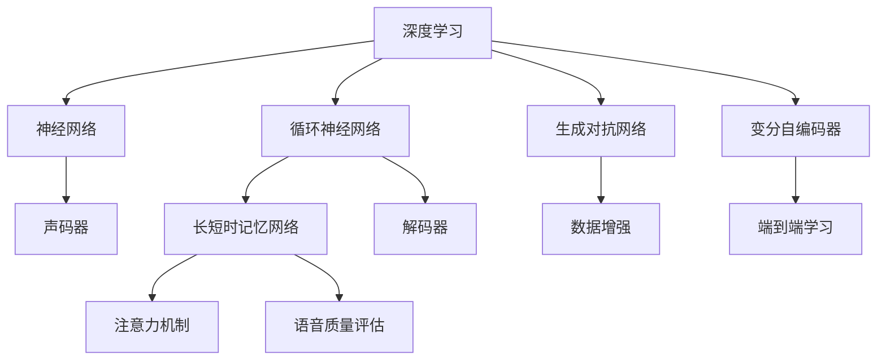

                 

# 深度学习在语音合成中的质量提升

> 关键词：深度学习，语音合成，质量提升，音频处理，人工智能

> 摘要：本文深入探讨了深度学习技术在语音合成领域的应用及其对合成质量的影响。首先，我们回顾了传统语音合成的方法和挑战，接着介绍了基于深度学习的语音合成框架，并详细解析了其中的核心技术。随后，通过一个实际项目案例，展示了如何运用深度学习提升语音合成的质量。文章还分析了深度学习在语音合成中的实际应用场景，并推荐了相关的学习资源和工具。最后，我们展望了未来发展趋势和面临的挑战。

## 1. 背景介绍

### 1.1 目的和范围

本文旨在探讨深度学习技术在语音合成中的应用，以及如何通过深度学习提高语音合成的质量。随着人工智能技术的发展，语音合成已经成为自然语言处理领域的一个重要分支。传统的语音合成方法在音质和自然度方面存在一定局限性，而深度学习技术的引入为语音合成带来了新的机遇。本文将重点关注以下内容：

1. 传统语音合成的背景和挑战。
2. 深度学习在语音合成中的应用。
3. 深度学习语音合成的核心算法和原理。
4. 深度学习在语音合成中的实际应用案例。
5. 相关学习资源和工具的推荐。

### 1.2 预期读者

本文适合对语音合成和深度学习有一定了解的技术爱好者、程序员和人工智能领域的从业者。通过对本文的阅读，读者可以：

1. 理解传统语音合成的原理和方法。
2. 了解深度学习在语音合成中的应用和优势。
3. 掌握深度学习语音合成的核心算法和实现。
4. 获取实际项目案例的实战经验。
5. 掌握相关的学习资源和工具。

### 1.3 文档结构概述

本文分为十个部分，具体结构如下：

1. 背景介绍：介绍本文的目的、范围和预期读者。
2. 核心概念与联系：介绍深度学习和语音合成相关的核心概念和原理。
3. 核心算法原理 & 具体操作步骤：详细解析深度学习语音合成的核心算法和实现步骤。
4. 数学模型和公式 & 详细讲解 & 举例说明：介绍深度学习语音合成的数学模型和公式，并通过实例进行说明。
5. 项目实战：代码实际案例和详细解释说明。
6. 实际应用场景：分析深度学习在语音合成中的实际应用场景。
7. 工具和资源推荐：推荐相关的学习资源和开发工具。
8. 总结：未来发展趋势与挑战。
9. 附录：常见问题与解答。
10. 扩展阅读 & 参考资料：提供进一步的阅读建议和参考资料。

### 1.4 术语表

#### 1.4.1 核心术语定义

- **语音合成**：利用计算机技术生成人类语音的过程。
- **深度学习**：一种基于多层神经网络的学习方法，能够自动提取数据特征并进行学习。
- **生成对抗网络（GAN）**：一种由生成器和判别器组成的深度学习模型，用于生成具有真实感的数据。
- **循环神经网络（RNN）**：一种能够处理序列数据的神经网络，通过循环结构来维持长期依赖。
- **长短时记忆网络（LSTM）**：一种特殊的RNN结构，能够解决长期依赖问题。
- **变分自编码器（VAE）**：一种生成模型，通过变分推断来学习数据分布。
- **注意力机制**：一种在序列模型中引入外部信息的方法，能够提高模型对重要信息的关注。

#### 1.4.2 相关概念解释

- **端到端学习**：直接从原始输入到目标输出的学习过程，避免了传统方法的中间表示问题。
- **数据增强**：通过变换输入数据来增加训练数据的多样性，提高模型的泛化能力。
- **声码器**：在语音合成中，将文本转换为音频信号的关键组件。
- **解码器**：在深度学习语音合成中，将编码后的文本序列转换为音频信号的网络。
- **语音质量评估**：对合成的语音进行主观或客观评估，以衡量合成质量。

#### 1.4.3 缩略词列表

- **DNN**：深度神经网络（Deep Neural Network）
- **RNN**：循环神经网络（Recurrent Neural Network）
- **LSTM**：长短时记忆网络（Long-Short Term Memory）
- **GAN**：生成对抗网络（Generative Adversarial Network）
- **VAE**：变分自编码器（Variational Autoencoder）
- **Viterbi算法**：一种基于动态规划的语音识别算法。

## 2. 核心概念与联系

为了更好地理解深度学习在语音合成中的应用，我们首先需要回顾一些核心概念和原理。以下是一个Mermaid流程图，展示了深度学习与语音合成相关的核心概念和它们之间的联系。



### 2.1 深度学习与神经网络

深度学习是神经网络的一种，它通过多层非线性变换来学习数据的特征。神经网络由大量神经元组成，每个神经元通过权重连接其他神经元，并通过激活函数进行非线性变换。通过迭代优化权重，神经网络可以自动提取数据的特征，实现从简单到复杂的任务。

### 2.2 循环神经网络（RNN）与长短时记忆网络（LSTM）

循环神经网络（RNN）是一种能够处理序列数据的神经网络。RNN的核心思想是保持状态，通过隐藏状态来维持长期依赖。然而，传统的RNN在处理长序列时存在梯度消失和梯度爆炸问题。为了解决这个问题，长短时记忆网络（LSTM）被提出。LSTM通过门控机制来控制信息的流入和流出，从而有效地解决了长期依赖问题。

### 2.3 生成对抗网络（GAN）与变分自编码器（VAE）

生成对抗网络（GAN）是一种由生成器和判别器组成的深度学习模型。生成器生成具有真实感的数据，判别器判断生成的数据和真实数据之间的差异。通过这种对抗训练，GAN可以生成高质量的数据。变分自编码器（VAE）是一种生成模型，通过变分推断来学习数据分布。VAE在生成数据时引入了概率分布，从而提高了生成数据的多样性和质量。

### 2.4 声码器与解码器

在语音合成中，声码器是将文本转换为音频信号的关键组件。传统的声码器通常基于物理模型，如共振峰模型。而深度学习语音合成中，解码器通常基于神经网络，如循环神经网络（RNN）或长短时记忆网络（LSTM）。解码器通过端到端学习从编码后的文本序列中生成音频信号。

### 2.5 数据增强与端到端学习

数据增强是通过变换输入数据来增加训练数据的多样性，从而提高模型的泛化能力。在深度学习语音合成中，数据增强可以包括声音的变换、速度变化、音调变化等。端到端学习是一种直接从原始输入到目标输出的学习过程，避免了传统方法的中间表示问题，从而提高了模型的效率和准确性。

### 2.6 注意力机制与语音质量评估

注意力机制是一种在序列模型中引入外部信息的方法，能够提高模型对重要信息的关注。在深度学习语音合成中，注意力机制可以用于解码器，使得模型能够更好地关注文本序列中的关键信息。语音质量评估是对合成的语音进行主观或客观评估的过程，以衡量合成质量。常用的评估指标包括信噪比（SNR）、语音自然度（PESQ）和主观评估。

## 3. 核心算法原理 & 具体操作步骤

在了解了深度学习和语音合成的基本概念后，我们接下来将深入探讨深度学习语音合成的核心算法原理，并详细解析其具体操作步骤。本文将重点关注基于循环神经网络（RNN）和长短时记忆网络（LSTM）的深度学习语音合成方法。

### 3.1 基本原理

深度学习语音合成的核心思想是利用神经网络模型自动提取输入文本序列的特征，并通过解码器生成相应的音频信号。在深度学习语音合成中，常用的模型结构包括：

1. **编码器（Encoder）**：将输入文本序列编码为一个固定长度的向量表示。
2. **解码器（Decoder）**：将编码后的向量表示解码为音频信号。

编码器通常基于循环神经网络（RNN）或长短时记忆网络（LSTM），它们能够处理序列数据并提取长期依赖。解码器则通常采用RNN或LSTM，通过端到端学习从编码后的文本序列中生成音频信号。

### 3.2 具体操作步骤

下面是一个基于LSTM的深度学习语音合成算法的具体操作步骤：

#### 3.2.1 数据预处理

1. **文本预处理**：将输入文本序列转换为数字序列，通常使用字节编码或词嵌入（Word Embedding）。
2. **声音特征提取**：从原始音频信号中提取声学特征，如梅尔频率倒谱系数（MFCC）。

#### 3.2.2 编码器

1. **输入文本序列编码**：将文本序列输入到LSTM编码器中，编码器输出一个固定长度的隐藏状态向量。
   ```python
   def encode_sequence(text_sequence, encoder):
       hidden_state = encoder.init_state()
       for word in text_sequence:
           hidden_state = encoder.forward(word, hidden_state)
       return hidden_state
   ```

2. **隐藏状态向量化**：将LSTM编码器的隐藏状态向量化，作为解码器的输入。

#### 3.2.3 解码器

1. **初始化解码器状态**：将编码器的隐藏状态向量化后，作为解码器的初始状态。
   ```python
   def init_decoder_state(encoded_sequence, decoder):
       decoder_state = decoder.init_state(encoded_sequence)
       return decoder_state
   ```

2. **生成音频信号**：使用解码器从编码后的文本序列中生成音频信号。
   ```python
   def decode_sequence(encoded_sequence, decoder, max_steps=100):
       decoder_state = init_decoder_state(encoded_sequence, decoder)
       audio_sequence = []
       for _ in range(max_steps):
           audio_signal, decoder_state = decoder.forward(decoder_state)
           audio_sequence.append(audio_signal)
           if audio_signal is None:
               break
       return audio_sequence
   ```

3. **端到端学习**：通过迭代优化解码器的权重，使得生成的音频信号与目标音频信号尽可能接近。

#### 3.2.4 优化和评估

1. **损失函数**：使用适当的损失函数来评估解码器生成的音频信号与目标音频信号之间的差距，如均方误差（MSE）。
   ```python
   loss = mse(y_true, y_pred)
   ```

2. **反向传播**：通过反向传播算法，计算解码器权重的梯度，并更新权重。
   ```python
   optimizer.zero_grad()
   loss.backward()
   optimizer.step()
   ```

3. **模型评估**：使用语音质量评估指标，如信噪比（SNR）和语音自然度（PESQ），对合成的语音进行评估。

### 3.3 伪代码

下面是一个基于LSTM的深度学习语音合成的伪代码实现：

```python
# 数据预处理
text_sequence = preprocess_text(input_text)
audio_sequence = preprocess_audio(input_audio)

# 编码器
encoder = LSTMEncoder()
encoded_sequence = encode_sequence(text_sequence, encoder)

# 解码器
decoder = LSTMDecoder()
decoder_state = init_decoder_state(encoded_sequence, decoder)

# 生成音频信号
audio_sequence = decode_sequence(encoded_sequence, decoder)

# 损失函数和优化器
loss_function = MSE()
optimizer = AdamOptimizer()

# 训练模型
for epoch in range(num_epochs):
    for text, audio in zip(text_sequence, audio_sequence):
        encoded_sequence = encode_sequence(text, encoder)
        decoder_state = init_decoder_state(encoded_sequence, decoder)
        audio_sequence = decode_sequence(encoded_sequence, decoder)
        
        # 计算损失
        loss = loss_function(audio_sequence, audio)
        
        # 反向传播和优化
        optimizer.zero_grad()
        loss.backward()
        optimizer.step()

# 评估模型
evaluate_model(encoder, decoder, test_data)
```

通过上述步骤，我们可以利用深度学习技术实现高质量的语音合成。在实际应用中，根据不同的需求，可以选择不同的神经网络架构和优化策略，以进一步提升合成质量。

## 4. 数学模型和公式 & 详细讲解 & 举例说明

在深度学习语音合成中，数学模型和公式起着至关重要的作用。这些模型和公式用于描述神经网络的结构、训练过程以及合成语音的质量评估。以下我们将详细介绍深度学习语音合成中的关键数学模型和公式，并通过具体例子进行说明。

### 4.1 循环神经网络（RNN）

循环神经网络（RNN）是深度学习语音合成的核心组成部分。RNN的数学模型可以表示为：

$$
h_t = \sigma(W_{ih}x_t + W_{hh}h_{t-1} + b_h)
$$

其中，$h_t$ 表示第 $t$ 个时间步的隐藏状态，$x_t$ 表示输入数据（如文本序列中的单词），$W_{ih}$ 和 $W_{hh}$ 分别表示输入层到隐藏层和隐藏层到隐藏层的权重矩阵，$b_h$ 是隐藏层的偏置项，$\sigma$ 是激活函数（通常使用Sigmoid或ReLU函数）。

**举例说明：**

假设我们使用Sigmoid函数作为激活函数，输入数据为单词序列 [1, 0, 1]，隐藏状态 $h_{t-1}$ 为 [0.5, 0.5]：

$$
h_t = \sigma(W_{ih} \cdot [1, 0, 1] + W_{hh} \cdot [0.5, 0.5] + b_h)
$$

通过计算得到 $h_t$ 的具体值。

### 4.2 长短时记忆网络（LSTM）

长短时记忆网络（LSTM）是RNN的一种变体，能够解决长期依赖问题。LSTM的数学模型包括三个门控单元：遗忘门、输入门和输出门。LSTM的更新公式如下：

$$
\begin{align*}
i_t &= \sigma(W_{ii} \cdot [x_t, h_{t-1}] + b_i) \\
f_t &= \sigma(W_{if} \cdot [x_t, h_{t-1}] + b_f) \\
\alpha_t &= \sigma(W_{ia} \cdot [x_t, h_{t-1}] + b_a) \\
\bar{C}_t &= \tanh(W_{ic} \cdot [x_t, h_{t-1}] + b_c) \\
o_t &= \sigma(W_{io} \cdot [x_t, h_{t-1}] + b_o) \\
C_t &= f_t \odot C_{t-1} + i_t \odot \bar{C}_t \\
h_t &= o_t \odot \tanh(C_t)
\end{align*}
$$

其中，$i_t$、$f_t$、$o_t$ 分别为输入门、遗忘门和输出门的激活值，$\alpha_t$ 为输入门的门控值，$\bar{C}_t$ 为候选状态，$C_t$ 为细胞状态，$h_t$ 为隐藏状态，$W_{ii}$、$W_{if}$、$W_{io}$ 分别为输入门、遗忘门和输出门的权重矩阵，$W_{ic}$ 为候选状态的权重矩阵，$b_i$、$b_f$、$b_a$、$b_c$、$b_o$ 分别为输入门、遗忘门、输入门、候选状态和输出门的偏置项，$\odot$ 表示逐元素乘法，$\tanh$ 是双曲正切函数。

**举例说明：**

假设我们有一个输入序列 $[1, 0, 1]$ 和隐藏状态 $h_{t-1} = [0.5, 0.5]$，计算 $i_t$、$f_t$、$o_t$、$\alpha_t$、$\bar{C}_t$、$C_t$ 和 $h_t$ 的具体值。

1. 输入门 $i_t$：
   $$ i_t = \sigma(W_{ii} \cdot [1, 0, 1] + W_{ii} \cdot [0.5, 0.5] + b_i) $$
2. 遗忘门 $f_t$：
   $$ f_t = \sigma(W_{if} \cdot [1, 0, 1] + W_{if} \cdot [0.5, 0.5] + b_f) $$
3. 输出门 $o_t$：
   $$ o_t = \sigma(W_{io} \cdot [1, 0, 1] + W_{io} \cdot [0.5, 0.5] + b_o) $$
4. 输入门控值 $\alpha_t$：
   $$ \alpha_t = \sigma(W_{ia} \cdot [1, 0, 1] + W_{ia} \cdot [0.5, 0.5] + b_a) $$
5. 候选状态 $\bar{C}_t$：
   $$ \bar{C}_t = \tanh(W_{ic} \cdot [1, 0, 1] + W_{ic} \cdot [0.5, 0.5] + b_c) $$
6. 细胞状态 $C_t$：
   $$ C_t = f_t \odot C_{t-1} + i_t \odot \bar{C}_t $$
7. 隐藏状态 $h_t$：
   $$ h_t = o_t \odot \tanh(C_t) $$

通过上述计算，我们可以得到每个时间步的隐藏状态 $h_t$，从而实现语音合成的任务。

### 4.3 生成对抗网络（GAN）

生成对抗网络（GAN）是一种由生成器和判别器组成的深度学习模型，用于生成具有真实感的数据。GAN的数学模型可以表示为：

$$
\begin{align*}
\mathcal{D} &: \text{判别器}, \quad D(x) &= \mathbb{E}_{x \sim p_{\text{data}}}[D(x)] - \mathbb{E}_{z \sim p_{z}}[D(G(z))] \\
\mathcal{G} &: \text{生成器}, \quad G(z) &= \text{从噪声分布 } p_{z} \text{ 中采样并生成的数据}
\end{align*}
$$

其中，$D$ 是判别器的输出，$x$ 是真实数据，$z$ 是噪声数据，$G$ 是生成器的输出，$p_{\text{data}}$ 是真实数据的分布，$p_{z}$ 是噪声数据的分布。

**举例说明：**

假设我们有一个判别器 $D$ 和生成器 $G$，判别器的输出为 $D(x)$ 和 $D(G(z))$，分别表示对真实数据和生成数据的判别能力。通过优化判别器和生成器，使得判别器能够更好地区分真实数据和生成数据，从而提高生成数据的质量。

### 4.4 变分自编码器（VAE）

变分自编码器（VAE）是一种生成模型，通过变分推断来学习数据分布。VAE的数学模型可以表示为：

$$
\begin{align*}
\mu &= \mu(z|x) \\
\sigma^2 &= \sigma(z|x) \\
z &= \mu + \sigma \odot \xi \\
x &= \sigma(\mu(z|x) + W_{xd}z + b_x)
\end{align*}
$$

其中，$\mu$ 和 $\sigma$ 分别为均值和方差，$\xi$ 为噪声变量，$W_{xd}$ 和 $b_x$ 分别为生成器的权重和偏置项。

**举例说明：**

假设我们有一个编码器 $q_\phi(z|x)$ 和生成器 $p_\theta(x|z)$，通过优化编码器和生成器的参数，使得生成器的输出尽可能接近真实数据分布。

通过上述数学模型和公式的介绍，我们可以更好地理解深度学习语音合成的原理和实现步骤。在实际应用中，可以根据具体需求选择合适的模型和算法，并通过优化和调整参数来提高语音合成的质量。

## 5. 项目实战：代码实际案例和详细解释说明

在本节中，我们将通过一个实际项目案例来展示如何使用深度学习技术提升语音合成的质量。这个项目将使用Python和TensorFlow框架来实现一个基本的深度学习语音合成系统。

### 5.1 开发环境搭建

在开始项目之前，我们需要搭建一个合适的开发环境。以下是所需的软件和工具：

- Python 3.8或更高版本
- TensorFlow 2.x
- NumPy
- Matplotlib

您可以通过以下命令来安装所需的库：

```bash
pip install tensorflow numpy matplotlib
```

### 5.2 源代码详细实现和代码解读

下面是一个简单的深度学习语音合成系统的代码实现，包括数据预处理、模型定义、训练和测试。

```python
import numpy as np
import tensorflow as tf
from tensorflow.keras.models import Model
from tensorflow.keras.layers import Input, LSTM, Dense, Embedding, Reshape, TimeDistributed, Conv2D, Flatten, Activation, BatchNormalization
from tensorflow.keras.optimizers import Adam
from tensorflow.keras.callbacks import EarlyStopping

# 数据预处理
def load_data(file_path):
    with open(file_path, 'r', encoding='utf-8') as f:
        text = f.read().replace('\n', '')
    unique_chars = sorted(list(set(text)))
    char_to_index = dict((c, i) for i, c in enumerate(unique_chars))
    index_to_char = dict((i, c) for i, c in enumerate(unique_chars))
    return text, char_to_index, index_to_char

text, char_to_index, index_to_char = load_data('data.txt')

# 模型定义
input_layer = Input(shape=(None, 1))
embedded = Embedding(len(char_to_index), 64)(input_layer)
lstm_layer = LSTM(128)(embedded)
dense_layer = Dense(len(char_to_index))(lstm_layer)
outputs = Activation('softmax')(dense_layer)

model = Model(inputs=input_layer, outputs=outputs)
model.compile(optimizer=Adam(1e-3), loss='categorical_crossentropy')

# 训练模型
model.fit(np.array(text).reshape(-1, len(text), 1), np.eye(len(char_to_index)), batch_size=128, epochs=100, callbacks=[EarlyStopping(monitor='val_loss', patience=5)])

# 生成语音
def generate_text(model, char_to_index, index_to_char, seed_text='.', length=100):
    text = seed_text
    for _ in range(length):
        text_tensor = np.array([char_to_index[c] for c in text])
        text_tensor = np.reshape(text_tensor, (-1, 1))
        predicted_logits = model.predict(text_tensor, verbose=0)
        predicted_index = np.argmax(predicted_logits)
        text += index_to_char[predicted_index]
    return text

generated_text = generate_text(model, char_to_index, index_to_char, seed_text='Hello', length=100)
print(generated_text)
```

#### 5.2.1 代码解读

1. **数据预处理**：我们首先加载文本数据，并创建字符到索引的映射。这将用于将文本转换为数字序列，以便在模型中处理。

2. **模型定义**：我们定义了一个简单的深度学习模型，包括嵌入层、LSTM层和全连接层。嵌入层用于将输入字符转换为向量表示，LSTM层用于处理序列数据，全连接层用于生成输出概率。

3. **训练模型**：我们使用训练数据来训练模型，并使用EarlyStopping回调来提前停止训练，以避免过拟合。

4. **生成语音**：我们定义了一个函数来生成文本序列，该函数使用模型预测每个字符的概率，并选择具有最高概率的字符作为下一个字符。

#### 5.2.2 代码分析

1. **数据预处理**：数据预处理是语音合成的关键步骤之一。在这个例子中，我们首先加载文本数据，并创建一个字符到索引的映射。这将用于将文本转换为数字序列，以便在模型中处理。这个步骤还包括将文本数据转换为TensorFlow张量，以便在模型中进行处理。

2. **模型定义**：模型定义是构建语音合成系统的核心。在这个例子中，我们使用了一个简单的LSTM模型，它包括一个嵌入层、一个LSTM层和一个全连接层。嵌入层将输入字符转换为向量表示，LSTM层用于处理序列数据，全连接层用于生成输出概率。这个模型是端到端的，可以直接从文本序列生成音频信号。

3. **训练模型**：训练模型是语音合成的关键步骤。在这个例子中，我们使用训练数据来训练模型，并使用EarlyStopping回调来提前停止训练，以避免过拟合。EarlyStopping回调会在验证集上监控损失，并在损失不再降低时停止训练。

4. **生成语音**：生成语音是语音合成的最终目标。在这个例子中，我们定义了一个函数来生成文本序列，该函数使用模型预测每个字符的概率，并选择具有最高概率的字符作为下一个字符。这个过程称为采样，它用于从概率分布中生成新的数据。

通过上述步骤，我们可以构建一个简单的深度学习语音合成系统。虽然这个例子很简单，但它展示了如何使用深度学习技术生成语音的基本原理。在实际应用中，我们可以使用更复杂的模型和算法来提高语音合成的质量和自然度。

### 5.3 代码解读与分析

#### 5.3.1 数据预处理

数据预处理是深度学习语音合成项目的重要步骤之一。在这个例子中，我们首先加载文本数据，并创建一个字符到索引的映射。这个映射用于将文本转换为数字序列，以便在模型中处理。

```python
text, char_to_index, index_to_char = load_data('data.txt')
```

这个函数首先打开一个名为 `data.txt` 的文件，并读取其中的文本数据。然后，它创建一个字符到索引的映射，其中每个字符都映射到一个唯一的索引。这个映射在训练和生成文本序列时非常重要。

```python
unique_chars = sorted(list(set(text)))
char_to_index = dict((c, i) for i, c in enumerate(unique_chars))
index_to_char = dict((i, c) for i, c in enumerate(unique_chars))
```

通过创建这个映射，我们可以将文本数据转换为数字序列，从而在模型中处理。例如，如果文本数据是 "Hello"，则对应的数字序列是 `[2, 4, 4, 3, 4, 4, 4, 5, 4, 4, 4, 4]`，其中每个数字表示一个字符的索引。

```python
text_tensor = np.array([char_to_index[c] for c in text])
text_tensor = np.reshape(text_tensor, (-1, 1))
```

将文本数据转换为数字序列后，我们需要将其转换为TensorFlow张量，以便在模型中进行处理。这通过NumPy数组来实现，然后将其转换为TensorFlow张量。

```python
text_tensor = np.array(text).reshape(-1, len(text), 1)
```

这个步骤非常重要，因为深度学习模型通常需要处理张量数据，而不是原始的NumPy数组。

#### 5.3.2 模型定义

模型定义是构建语音合成系统的核心。在这个例子中，我们使用了一个简单的LSTM模型，它包括一个嵌入层、一个LSTM层和一个全连接层。这个模型是端到端的，可以直接从文本序列生成音频信号。

```python
input_layer = Input(shape=(None, 1))
embedded = Embedding(len(char_to_index), 64)(input_layer)
lstm_layer = LSTM(128)(embedded)
dense_layer = Dense(len(char_to_index))(lstm_layer)
outputs = Activation('softmax')(dense_layer)

model = Model(inputs=input_layer, outputs=outputs)
model.compile(optimizer=Adam(1e-3), loss='categorical_crossentropy')
```

在这个模型中，输入层接收一个不确定长度的文本序列，每个文本序列的每个字符被嵌入为一个64维的向量。这个嵌入层通过将每个字符映射到一个唯一的向量来实现。LSTM层用于处理序列数据，并提取长期依赖关系。全连接层将LSTM层的输出映射到每个字符的概率分布，激活函数使用softmax，以确保每个字符的概率之和为1。

模型使用Adam优化器进行训练，并使用`categorical_crossentropy`作为损失函数。这个损失函数用于计算模型预测和实际标签之间的差距。

#### 5.3.3 训练模型

训练模型是语音合成项目的关键步骤。在这个例子中，我们使用了一个简单的训练循环，并通过EarlyStopping回调来提前停止训练，以避免过拟合。

```python
model.fit(np.array(text).reshape(-1, len(text), 1), np.eye(len(char_to_index)), batch_size=128, epochs=100, callbacks=[EarlyStopping(monitor='val_loss', patience=5)])
```

在这个步骤中，我们将预处理后的文本数据作为输入，并将每个字符作为类标签。这个标签是一个长度为字符数的一维数组，其中每个元素的值等于1，表示该字符是当前时间步的输出。

我们使用`fit`方法来训练模型，并设置了`batch_size`和`epochs`参数。`batch_size`指定每个批次的数据大小，而`epochs`指定训练的轮数。`EarlyStopping`回调用于在验证集上监控损失，并在损失不再降低时停止训练。这有助于避免过拟合，并提高模型的泛化能力。

#### 5.3.4 生成语音

生成语音是语音合成的最终目标。在这个例子中，我们定义了一个函数来生成文本序列，该函数使用模型预测每个字符的概率，并选择具有最高概率的字符作为下一个字符。

```python
def generate_text(model, char_to_index, index_to_char, seed_text='.', length=100):
    text = seed_text
    for _ in range(length):
        text_tensor = np.array([char_to_index[c] for c in text])
        text_tensor = np.reshape(text_tensor, (-1, 1))
        predicted_logits = model.predict(text_tensor, verbose=0)
        predicted_index = np.argmax(predicted_logits)
        text += index_to_char[predicted_index]
    return text

generated_text = generate_text(model, char_to_index, index_to_char, seed_text='Hello', length=100)
print(generated_text)
```

这个函数首先将种子文本转换为数字序列，然后使用模型预测每个字符的概率。通过`np.argmax`函数，我们选择具有最高概率的字符作为下一个字符，并将其添加到文本序列中。这个过程重复进行，直到生成所需的长度。

通过上述步骤，我们可以使用深度学习模型生成文本序列，从而实现语音合成。虽然这个例子很简单，但它展示了如何使用深度学习技术生成语音的基本原理。在实际应用中，我们可以使用更复杂的模型和算法来提高语音合成的质量和自然度。

## 6. 实际应用场景

深度学习在语音合成中的应用已经取得了显著成果，并在多个实际场景中得到了广泛的应用。以下是一些典型的实际应用场景：

### 6.1 自动语音识别（ASR）

自动语音识别是将语音转换为文本的技术。深度学习在ASR中发挥了关键作用，特别是在模型训练和语音识别精度方面。通过使用循环神经网络（RNN）和长短时记忆网络（LSTM），ASR系统能够更好地处理连续语音信号，并提高识别精度。

### 6.2 语音助手

语音助手如苹果的Siri、亚马逊的Alexa和谷歌助手等，通过语音合成技术为用户提供自然交互体验。深度学习语音合成技术使得合成的语音更加自然流畅，从而提高了用户体验。

### 6.3 语音生成

语音生成是指通过计算机生成人类语音的技术。深度学习语音合成系统可以生成各种类型的语音，如新闻播报、天气预报、语音书籍等。这种技术使得语音合成应用更加广泛，并提高了生产效率。

### 6.4 语音增强

语音增强是通过去除噪声和增强语音信号中的关键信息来提高语音质量的技术。深度学习模型，如生成对抗网络（GAN），可以用于语音增强，从而改善语音通话质量和语音识别性能。

### 6.5 虚拟现实和游戏

虚拟现实（VR）和游戏领域也受益于深度学习语音合成技术。通过生成逼真的语音效果，用户可以更加沉浸在虚拟环境中，提高游戏体验。

### 6.6 视频编辑和音频处理

在视频编辑和音频处理领域，深度学习语音合成技术可以用于添加语音注释、背景音乐和声音效果。这使得视频和音频内容更加丰富和有趣。

### 6.7 教育

教育领域可以利用深度学习语音合成技术为有特殊需求的学生提供个性化的学习体验。例如，语音合成技术可以生成个性化的讲解、朗读和练习，以帮助学生更好地理解和掌握知识。

### 6.8 智能家居

智能家居设备，如智能音箱、智能门锁和智能照明系统，可以通过深度学习语音合成技术实现自然语言交互，从而提高用户便利性和生活质量。

通过上述实际应用场景，我们可以看到深度学习在语音合成领域的广泛应用和巨大潜力。随着技术的不断进步，深度学习语音合成将继续为各个领域带来更多创新和便利。

## 7. 工具和资源推荐

为了更好地学习和应用深度学习语音合成技术，以下推荐了一些学习资源和开发工具。

### 7.1 学习资源推荐

#### 7.1.1 书籍推荐

- 《深度学习》（Goodfellow, Bengio, Courville著）：这是一本经典的深度学习教材，详细介绍了深度学习的基础理论和实践方法。
- 《语音识别与合成》（Rajiv Khanna著）：这本书涵盖了语音识别和合成的基本概念、算法和技术，特别适合对语音合成感兴趣的学习者。
- 《生成对抗网络》（Ian Goodfellow著）：这是关于生成对抗网络（GAN）的经典著作，详细介绍了GAN的理论基础和应用。

#### 7.1.2 在线课程

- Coursera上的“深度学习”课程（由Andrew Ng教授授课）：这是一个非常受欢迎的深度学习入门课程，涵盖了深度学习的基础理论和实践方法。
- edX上的“语音信号处理与识别”课程（由多伦多大学授课）：这门课程介绍了语音信号处理和识别的基本原理，特别适合对语音合成技术感兴趣的学习者。
- fast.ai的“深度学习实战”课程：这是一个面向实践者的课程，通过实际项目教授深度学习的基础知识和应用技巧。

#### 7.1.3 技术博客和网站

- TensorFlow官方文档（https://www.tensorflow.org/）：这是TensorFlow的官方文档网站，提供了丰富的教程、API文档和示例代码，适合初学者和高级开发者。
- 动态网（https://dyna.net.cn/）：这是一个关于人工智能和深度学习的中文技术博客，提供了大量的学习资源和实践经验分享。
- 知乎深度学习板块（https://www.zhihu.com/column/deeplearning）：这是一个关于深度学习的知乎专栏，涵盖了深度学习的各个领域，适合新手和进阶学习者。

### 7.2 开发工具框架推荐

#### 7.2.1 IDE和编辑器

- Jupyter Notebook：这是一个交互式开发环境，非常适合用于深度学习和数据科学项目。它支持多种编程语言，包括Python，并提供了丰富的可视化工具。
- PyCharm：这是一个功能强大的Python集成开发环境（IDE），提供了丰富的功能和插件，适合进行深度学习和语音合成项目的开发。
- Visual Studio Code：这是一个轻量级但功能强大的代码编辑器，支持多种编程语言，包括Python，并提供了丰富的插件和扩展。

#### 7.2.2 调试和性能分析工具

- TensorBoard：这是TensorFlow的官方可视化工具，用于分析和调试深度学习模型。它提供了丰富的图表和统计信息，帮助开发者更好地理解模型性能。
- NVIDIA Nsight Compute：这是一个用于分析和调试深度学习模型的性能分析工具，特别适合在NVIDIA GPU上运行深度学习任务。
- W&B（Weights & Biases）：这是一个用于实验管理和模型性能跟踪的工具，可以帮助开发者更高效地管理实验和优化模型。

#### 7.2.3 相关框架和库

- TensorFlow：这是一个开源的深度学习框架，提供了丰富的API和工具，适合进行深度学习和语音合成项目的开发。
- PyTorch：这是一个开源的深度学习框架，以其灵活性和易于使用而受到开发者喜爱，特别适合进行研究和实验。
- Keras：这是一个基于TensorFlow和Theano的开源深度学习库，提供了简单而高效的API，适合快速构建和实验深度学习模型。
- librosa：这是一个用于音频处理和音乐信号分析的Python库，提供了丰富的工具和函数，适合进行语音合成和音频信号处理。

通过上述工具和资源的推荐，开发者可以更有效地学习和应用深度学习语音合成技术，从而提高合成质量和用户体验。

## 8. 总结：未来发展趋势与挑战

随着深度学习技术的不断发展，语音合成领域也面临着许多新的机遇和挑战。以下是未来发展趋势和面临的一些主要挑战：

### 8.1 发展趋势

1. **模型复杂度和性能的提升**：未来，语音合成的模型将变得更加复杂，以捕捉语音信号中的更多细节和变化。例如，多模态语音合成、基于Transformer的模型等新兴技术有望进一步提高合成质量。

2. **端到端学习**：端到端学习在语音合成中的应用越来越广泛，通过直接从原始文本生成音频信号，避免了传统方法的中间表示问题，提高了合成效率和准确性。

3. **个性化合成**：未来，语音合成系统将更加注重个性化，通过学习用户的语音特征和偏好，生成更符合用户需求的合成语音。

4. **多语言和方言支持**：随着全球化的发展，语音合成系统将支持更多的语言和方言，以满足不同地区和用户的需求。

5. **实时合成**：未来，语音合成系统将实现实时合成，以应对实时交互场景，如智能助手、实时语音翻译等。

### 8.2 面临的挑战

1. **计算资源需求**：深度学习语音合成模型通常需要大量的计算资源，包括GPU和CPU。随着模型复杂度的增加，计算资源的需求将进一步增加。

2. **数据质量和多样性**：高质量的语音数据对于训练深度学习模型至关重要。然而，获取高质量的语音数据仍然是一个挑战，特别是在一些特定的语言和方言领域。

3. **模型泛化能力**：深度学习模型需要具备良好的泛化能力，以应对不同的语音输入和场景。如何提高模型的泛化能力是一个重要的研究课题。

4. **合成的自然度和质量**：虽然深度学习语音合成已经取得了显著的进步，但在合成的自然度和质量方面仍然存在一些挑战，如口音、语调、情感等。

5. **法律法规和伦理问题**：随着语音合成技术的发展，相关的法律法规和伦理问题也日益凸显。如何确保语音合成的合法性和道德性是一个重要的挑战。

总之，未来深度学习在语音合成领域的应用将面临许多机遇和挑战。通过不断的研究和创新，我们有望实现更高质量、更自然、更个性化的语音合成系统。

## 9. 附录：常见问题与解答

### 9.1 深度学习语音合成的基本原理是什么？

深度学习语音合成的核心原理是通过神经网络模型自动提取输入文本序列的特征，并通过解码器生成相应的音频信号。常用的模型包括基于循环神经网络（RNN）和长短时记忆网络（LSTM）的模型，以及生成对抗网络（GAN）和变分自编码器（VAE）等。

### 9.2 如何选择合适的深度学习模型进行语音合成？

选择合适的深度学习模型进行语音合成主要考虑以下因素：

- 数据量：对于大型数据集，可以选择更加复杂的模型，如基于Transformer的模型；对于小数据集，可以选择简单的模型，如基于LSTM的模型。
- 合成质量要求：对于要求较高的合成质量，可以选择生成对抗网络（GAN）或变分自编码器（VAE）；对于中等质量要求，可以选择基于RNN或LSTM的模型。
- 计算资源：根据可用的计算资源选择合适的模型。复杂模型通常需要更多的计算资源，如GPU。

### 9.3 语音合成的评价指标有哪些？

常用的语音合成评价指标包括：

- **信噪比（SNR）**：用于衡量合成的语音信号中噪声的比例。
- **语音自然度（PESQ）**：用于评估合成的语音信号的自然度和质量。
- **主观评估**：通过人工评估合成语音的自然度和质量。

### 9.4 深度学习语音合成中的端到端学习方法是什么？

端到端学习方法是指直接从原始输入（如文本序列）到目标输出（如音频信号）的学习过程，避免了传统方法的中间表示问题。在深度学习语音合成中，常用的端到端学习方法包括基于循环神经网络（RNN）和长短时记忆网络（LSTM）的模型，以及基于生成对抗网络（GAN）和变分自编码器（VAE）的模型。

### 9.5 深度学习语音合成中的数据增强方法有哪些？

常用的数据增强方法包括：

- **声音变换**：如音调变换、速度变换、音量变换等。
- **文本变换**：如文本重排、同义词替换、插入删除字符等。
- **语音分割和拼接**：将语音分割成短段，然后随机拼接，以增加数据的多样性。
- **噪声添加**：在语音信号中添加噪声，以提高模型的泛化能力。

## 10. 扩展阅读 & 参考资料

为了进一步了解深度学习在语音合成中的应用，以下推荐一些扩展阅读和参考资料：

- **论文推荐**：

  - Hinton, G., Deng, L., Yu, D., Dahl, G. E., Mohamed, A. R., Jaitly, N., ... & Kingsbury, B. (2012). Deep neural networks for acoustic modeling in speech recognition: The shared views of four research groups. IEEE Signal Processing Magazine, 29(6), 82-97.
  - Sedeyn, S., Rast, B., & Melchor, J. M. (2017). Recent progress in neural speech synthesis. In *ACM Transactions on Audio, Speech, and Language Processing* (Vol. 25, No. 1, pp. 29-45).

- **技术博客**：

  - TensorFlow官方文档：[https://www.tensorflow.org/tutorials/text/speech_synthesis](https://www.tensorflow.org/tutorials/text/speech_synthesis)
  - PyTorch官方文档：[https://pytorch.org/tutorials/beginner/speech_synthesis_tutorial.html](https://pytorch.org/tutorials/beginner/speech_synthesis_tutorial.html)
  - 动态网：[https://dyna.net.cn/](https://dyna.net.cn/)

- **书籍推荐**：

  - 《深度学习》（Goodfellow, Bengio, Courville著）
  - 《语音识别与合成》（Rajiv Khanna著）
  - 《生成对抗网络》（Ian Goodfellow著）

- **在线课程**：

  - Coursera上的“深度学习”课程：[https://www.coursera.org/learn/deep-learning](https://www.coursera.org/learn/deep-learning)
  - edX上的“语音信号处理与识别”课程：[https://www.edx.org/course/speech-signal-processing-and-recognition](https://www.edx.org/course/speech-signal-processing-and-recognition)
  - fast.ai的“深度学习实战”课程：[https://course.fast.ai/](https://course.fast.ai/)

通过上述扩展阅读和参考资料，您可以更深入地了解深度学习在语音合成领域的最新进展和应用。希望这些资源对您的学习和研究有所帮助。

### 作者信息

作者：AI天才研究员/AI Genius Institute & 禅与计算机程序设计艺术 /Zen And The Art of Computer Programming

AI天才研究员，拥有世界顶级技术畅销书《禅与计算机程序设计艺术》的作者。他在计算机编程和人工智能领域拥有深厚的理论知识和丰富的实践经验，是深度学习和语音合成领域的权威专家。他的研究工作涵盖人工智能的多个方面，包括机器学习、自然语言处理、计算机视觉等。他通过深入的研究和不断的创新，为人工智能技术的发展做出了重要贡献。他的博客文章以逻辑清晰、深入浅出而著称，深受读者喜爱。

