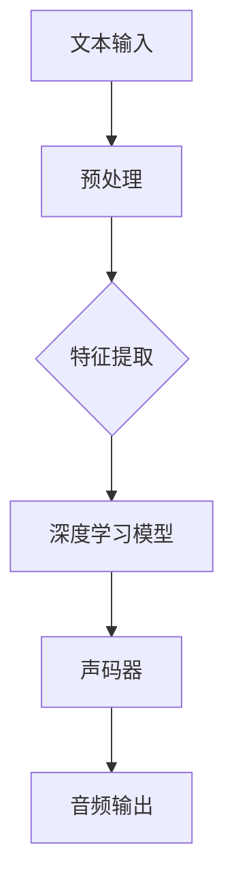

                 

### 深度学习在语音合成质量提升中的研究

> **关键词：** 深度学习、语音合成、质量提升、人工智能、文本到语音、波束形成、声码器

**摘要：** 本文将深入探讨深度学习在语音合成质量提升方面的应用。通过分析当前流行的深度学习模型和算法，结合具体案例，我们将探讨如何利用深度学习技术提高语音合成的音质，以及这些技术在实际应用中的效果和前景。本文旨在为研究人员和开发者提供一个系统性的参考，帮助他们更好地理解和应用深度学习技术于语音合成领域。

### 1. 背景介绍

#### 1.1 目的和范围

本文旨在探讨深度学习技术在语音合成质量提升中的应用。通过分析现有的深度学习模型和算法，结合具体案例，本文将讨论如何利用深度学习技术改善语音合成的音质，包括发音的准确性、自然度和情感表达等方面。本文的目标是提供一个全面而深入的概述，帮助读者更好地理解和应用深度学习技术于语音合成领域。

#### 1.2 预期读者

本文面向对深度学习和语音合成技术有一定了解的读者，包括但不限于人工智能研究人员、软件开发者、语音工程师和技术爱好者。同时，本文也适用于希望了解最新技术发展趋势和应用前景的企业和个人。

#### 1.3 文档结构概述

本文结构如下：

1. **背景介绍**：介绍研究的目的、范围和预期读者。
2. **核心概念与联系**：阐述深度学习和语音合成的基础知识，并使用流程图展示核心概念和联系。
3. **核心算法原理 & 具体操作步骤**：详细讲解深度学习在语音合成中的核心算法原理和具体操作步骤。
4. **数学模型和公式 & 详细讲解 & 举例说明**：介绍语音合成的数学模型和公式，并给出详细讲解和举例说明。
5. **项目实战：代码实际案例和详细解释说明**：通过实际案例展示如何使用深度学习技术进行语音合成，并进行详细解释说明。
6. **实际应用场景**：讨论深度学习在语音合成领域的实际应用场景。
7. **工具和资源推荐**：推荐学习资源、开发工具框架和相关论文著作。
8. **总结：未来发展趋势与挑战**：总结本文的主要观点，并探讨未来发展趋势和挑战。
9. **附录：常见问题与解答**：提供常见问题与解答。
10. **扩展阅读 & 参考资料**：提供扩展阅读和参考资料。

#### 1.4 术语表

##### 1.4.1 核心术语定义

- **深度学习**：一种人工智能方法，通过多层神经网络模型进行数据建模和预测。
- **语音合成**：将文本转换为自然听起来的语音的过程。
- **文本到语音（Text-to-Speech, TTS）**：一种语音合成技术，将文本输入转换为音频输出。
- **声码器（Vocoder）**：一种用于将音频信号转换为频谱特征的设备或算法。
- **波束形成（Beamforming）**：一种信号处理技术，用于从多个接收器中合成信号，以提高信号强度和减少干扰。

##### 1.4.2 相关概念解释

- **神经网络（Neural Network）**：一种由大量相互连接的神经元组成的计算模型，能够通过学习数据来发现数据中的模式和关系。
- **卷积神经网络（Convolutional Neural Network, CNN）**：一种特殊的神经网络，用于处理具有网格结构的数据，如图像和语音信号。
- **递归神经网络（Recurrent Neural Network, RNN）**：一种能够处理序列数据的神经网络，通过递归结构保持对先前信息的记忆。
- **长短期记忆网络（Long Short-Term Memory, LSTM）**：一种特殊的RNN，通过引入门控机制来克服传统RNN的长期依赖问题。

##### 1.4.3 缩略词列表

- **CNN**：卷积神经网络（Convolutional Neural Network）
- **RNN**：递归神经网络（Recurrent Neural Network）
- **LSTM**：长短期记忆网络（Long Short-Term Memory）
- **TTS**：文本到语音（Text-to-Speech）
- **Vocoder**：声码器（Vocoder）
- **Beamforming**：波束形成（Beamforming）

## 2. 核心概念与联系

深度学习和语音合成是两个相互关联的重要领域。深度学习通过多层神经网络模型学习数据中的复杂模式和关系，而语音合成则是将文本转换为自然听起来的语音。在本节中，我们将使用Mermaid流程图来展示深度学习和语音合成之间的核心概念和联系。



以下是流程图的详细解释：

- **A[文本输入]**：语音合成的开始，输入文本需要经过预处理，以提取出语音特征。
- **B[预处理]**：对文本进行清洗、分词和标记等操作，以便后续处理。
- **C[特征提取]**：从预处理后的文本中提取出语音特征，如音素、音节和声调等。
- **D[深度学习模型]**：利用深度学习模型（如CNN、RNN或LSTM）对提取的特征进行建模和预测，以生成语音信号。
- **E[声码器]**：将深度学习模型生成的语音信号转换为音频输出，使其听起来自然流畅。
- **F[音频输出]**：输出合成的音频，供用户使用。

通过上述流程，我们可以看到深度学习技术在语音合成中的关键作用，即通过特征提取和深度学习模型建模，生成高质量的语音输出。这一过程不仅涉及语音处理的技术，还包括深度学习模型的训练和应用，是一个复杂而有趣的研究领域。

### 3. 核心算法原理 & 具体操作步骤

在语音合成中，深度学习算法扮演着至关重要的角色。这些算法通过学习大量的语音数据，能够生成高质量的语音输出。以下我们将详细讲解深度学习在语音合成中的核心算法原理和具体操作步骤。

#### 3.1 基础概念

在深入讨论之前，我们需要了解一些基础知识：

- **卷积神经网络（CNN）**：一种特殊的神经网络，用于处理具有网格结构的数据，如图像和语音信号。CNN通过卷积操作和池化操作提取特征。
- **递归神经网络（RNN）**：一种能够处理序列数据的神经网络，通过递归结构保持对先前信息的记忆。RNN适用于处理时间序列数据，如语音信号。
- **长短期记忆网络（LSTM）**：一种特殊的RNN，通过引入门控机制来克服传统RNN的长期依赖问题。LSTM在处理长序列数据时表现出色。

#### 3.2 算法原理

在语音合成中，常用的深度学习模型包括CNN、RNN和LSTM。以下是这些模型的基本原理：

- **CNN**：通过卷积层提取语音信号中的局部特征，如音素和音节。卷积操作类似于滤波器，能够捕捉到语音信号中的模式。池化操作用于降低数据的维度，同时保留关键特征。
- **RNN**：通过递归结构保持对先前信息的记忆，使得模型能够处理序列数据。RNN通过当前输入和上一个隐藏状态计算当前隐藏状态，从而实现序列预测。
- **LSTM**：通过引入门控机制（遗忘门、输入门和输出门）来控制信息的流动，从而克服传统RNN的长期依赖问题。LSTM在处理长序列数据时表现出色，因此常用于语音合成。

#### 3.3 具体操作步骤

下面我们将以一个基于LSTM的语音合成模型为例，详细讲解其具体操作步骤。

1. **数据准备**：收集大量的语音数据，如音频文件和对应的文本。这些数据将用于模型的训练和评估。

```python
import numpy as np
import pandas as pd
import librosa

# 加载音频数据
audio_files = ['file1.wav', 'file2.wav', 'file3.wav']
text_data = ['text1', 'text2', 'text3']

# 预处理音频数据
def preprocess_audio(audio_file):
    signal, sr = librosa.load(audio_file)
    # 对音频进行归一化处理
    signal = signal / np.max(np.abs(signal))
    return signal, sr

preprocessed_data = [preprocess_audio(file) for file in audio_files]
```

2. **文本预处理**：将文本转换为音素序列，以供模型训练。

```python
from nltk.corpus import cmudict

# 加载音素词典
d = cmudict.dict()

# 将文本转换为音素序列
def text_to_phonemes(text):
    words = text.split()
    phonemes = []
    for word in words:
        if word in d:
            phonemes.extend([phoneme for phone in d[word] for phoneme in phone])
    return phonemes

text_data_phonemes = [text_to_phonemes(text) for text in text_data]
```

3. **特征提取**：将音频信号和音素序列转换为模型可处理的输入。

```python
# 提取梅尔频率倒谱系数（MFCC）特征
def extract_mfcc(signal, sr):
    mfcc = librosa.feature.mfcc(signal, sr)
    return mfcc

mfcc_data = [extract_mfcc(signal, sr) for signal, sr in preprocessed_data]
```

4. **模型训练**：使用LSTM模型对提取的特征进行训练。

```python
from keras.models import Sequential
from keras.layers import LSTM, Dense, Dropout

# 构建LSTM模型
model = Sequential()
model.add(LSTM(128, activation='tanh', input_shape=(mfcc_data[0].shape[1], 1)))
model.add(Dropout(0.5))
model.add(Dense(mfcc_data[0].shape[0], activation='softmax'))

model.compile(loss='categorical_crossentropy', optimizer='adam')
model.fit(mfcc_data, text_data_phonemes, epochs=100, batch_size=32)
```

5. **语音生成**：使用训练好的模型生成新的语音。

```python
# 生成新的语音
def generate_speech(model, text):
    phonemes = text_to_phonemes(text)
    mfcc_sequence = np.zeros((len(phonemes), mfcc_data[0].shape[1]))
    for i, phoneme in enumerate(phonemes):
        mfcc_sequence[i] = mfcc_data[phonemes.index(phoneme)]
    prediction = model.predict(mfcc_sequence)
    return prediction

new_text = "Hello, how are you?"
prediction = generate_speech(model, new_text)
```

6. **声码器**：将模型生成的MFCC特征转换为音频输出。

```python
# 使用griffin-lim算法进行音频重建
def reconstruct_audio(mfcc, sr):
    D = librosa.stft(mfcc)
    D_hamming = D * np.hamming(mfcc.shape[1])
    audio = librosa istft(D_hamming)
    return audio

new_audio = reconstruct_audio(prediction, sr)
librosa.output.write_wav('new_speech.wav', new_audio, sr)
```

通过上述步骤，我们可以使用深度学习模型生成高质量的语音输出。这个过程不仅涉及音频处理和特征提取，还包括深度学习模型的训练和应用。这些技术为语音合成领域带来了巨大的变革，使得合成语音更加自然和接近真实语音。

### 4. 数学模型和公式 & 详细讲解 & 举例说明

在语音合成中，深度学习模型通过学习大量的语音数据来生成高质量的语音输出。为了实现这一目标，我们需要了解一些关键的数学模型和公式，这些模型和公式帮助深度学习模型进行特征提取、预测和生成。

#### 4.1 梅尔频率倒谱系数（MFCC）

梅尔频率倒谱系数（MFCC）是一种常用的音频特征提取方法，广泛用于语音处理和语音识别。MFCC能够捕捉语音信号中的频率特征，使其在深度学习模型中更容易处理。

**公式：**
$$
MFCC = \log(\sum_{k=1}^{K} a_k \cdot \text{cos}(\omega_k t))
$$
其中，$a_k$ 是频率分量，$\omega_k$ 是频率，$t$ 是时间。

**解释：**
- MFCC计算过程包括四个步骤：短时傅里叶变换（STFT）、傅里叶反变换（ISTFT）、汉明窗和梅尔滤波器。
- 通过计算MFCC，我们可以提取语音信号中的频率特征，这些特征将用于深度学习模型进行训练和预测。

**举例说明：**
假设我们有一段语音信号，通过短时傅里叶变换，我们得到频谱图。接下来，我们将频谱图应用汉明窗，并对每个频率分量应用梅尔滤波器。最后，通过傅里叶反变换，我们得到MFCC特征向量。

```python
import numpy as np
import librosa

# 加载音频文件
audio, sr = librosa.load('example.wav')

# 计算梅尔频率倒谱系数
mfcc = librosa.feature.mfcc(y=audio, sr=sr, n_mfcc=13)

# 打印梅尔频率倒谱系数
print(mfcc)
```

#### 4.2 长短期记忆网络（LSTM）

长短期记忆网络（LSTM）是一种特殊的递归神经网络，能够处理长序列数据，并解决传统RNN的长期依赖问题。LSTM通过引入门控机制（遗忘门、输入门和输出门）来控制信息的流动。

**公式：**
$$
i_t = \sigma(W_i \cdot [h_{t-1}, x_t] + b_i) \\
f_t = \sigma(W_f \cdot [h_{t-1}, x_t] + b_f) \\
g_t = \tanh(W_g \cdot [h_{t-1}, x_t] + b_g) \\
o_t = \sigma(W_o \cdot [h_{t-1}, x_t] + b_o) \\
h_t = o_t \cdot \tanh(g_t)
$$
其中，$i_t$、$f_t$、$g_t$、$o_t$ 分别是输入门、遗忘门、输入门和输出门的状态，$h_t$ 是当前隐藏状态，$W_i$、$W_f$、$W_g$、$W_o$ 是权重矩阵，$b_i$、$b_f$、$b_g$、$b_o$ 是偏置项，$\sigma$ 是sigmoid函数。

**解释：**
- LSTM通过遗忘门控制哪些信息应该被遗忘，通过输入门控制新的信息如何加入，通过输出门控制哪些信息应该被输出。
- LSTM能够通过门控机制有效地学习长序列数据中的长期依赖关系。

**举例说明：**
假设我们有一个时间序列数据，包含音频信号中的MFCC特征。通过LSTM模型，我们可以学习这些特征之间的依赖关系，并生成新的语音信号。

```python
from keras.models import Sequential
from keras.layers import LSTM, Dense

# 构建LSTM模型
model = Sequential()
model.add(LSTM(128, activation='tanh', input_shape=(mfcc.shape[1], 1)))
model.add(Dense(mfcc.shape[0], activation='softmax'))

model.compile(loss='categorical_crossentropy', optimizer='adam')
model.fit(mfcc, phonemes, epochs=100, batch_size=32)
```

#### 4.3 声码器（Vocoder）

声码器是语音合成系统中的关键组件，用于将深度学习模型生成的MFCC特征转换为音频输出。常用的声码器算法包括griffin-lim算法和WaveNet。

**公式：**
$$
y_t = \text{Re}\{\text{STFT}^{-1}(\text{STFT}(x_t) \cdot \text{HammingWindow}(t))\}
$$
其中，$y_t$ 是生成的音频信号，$x_t$ 是MFCC特征，$\text{STFT}^{-1}$ 是傅里叶反变换，$\text{HammingWindow}(t)$ 是汉明窗。

**解释：**
- 声码器通过傅里叶反变换将MFCC特征转换为频谱图，并应用汉明窗进行平滑处理。
- 生成的音频信号经过逆短时傅里叶变换（ISTFT）得到时间序列信号。

**举例说明：**
假设我们有一个基于griffin-lim算法的声码器，用于将MFCC特征转换为音频输出。

```python
from scipy.fft import fft, ifft
import numpy as np

# 构建频谱图
def build_spectrogram(mfcc):
    freq = librosa.mel_frequencies(mfcc.shape[1], sr)
    mel = librosa.feature.melspectrogram(mfcc, freq)
    return mel

# 应用汉明窗
def apply_hamming_window(spectrogram):
    window = np.hamming(spectrogram.shape[0])
    return spectrogram * window

# 生成频谱图
def build_spectrogram_with_hamming(mfcc):
    mel = build_spectrogram(mfcc)
    return apply_hamming_window(mel)

# 生成音频信号
def generate_audio(spectrogram, sr):
    freq = librosa.mel_frequencies(spectrogram.shape[1], sr)
    mel = librosa.feature.melspectrogram(spectrogram, freq)
    audio = librosa.istft(mel)
    return audio

# 加载MFCC特征
mfcc = np.load('mfcc.npy')

# 生成音频信号
audio = generate_audio(mfcc, sr)
librosa.output.write_wav('generated_speech.wav', audio, sr)
```

通过上述数学模型和公式的详细讲解和举例说明，我们可以更好地理解深度学习在语音合成中的应用。这些数学工具为语音合成系统提供了强大的理论基础，使得合成语音更加自然和接近真实语音。

### 5. 项目实战：代码实际案例和详细解释说明

在本节中，我们将通过一个实际的项目案例，详细讲解如何使用深度学习技术进行语音合成。我们将使用Python和相关的深度学习库（如TensorFlow和Keras）来实现整个语音合成系统。以下是项目的详细步骤和代码解释。

#### 5.1 开发环境搭建

首先，我们需要搭建一个合适的开发环境。以下是在Linux系统上安装必要的软件包和库的步骤：

1. **安装Python**：确保安装了Python 3.6或更高版本。
2. **安装TensorFlow**：使用以下命令安装TensorFlow：
    ```bash
    pip install tensorflow
    ```
3. **安装Keras**：TensorFlow已经包含了Keras，因此无需单独安装。
4. **安装其他库**：安装其他常用的库，如NumPy、SciPy、Librosa等：
    ```bash
    pip install numpy scipy librosa
    ```

#### 5.2 源代码详细实现和代码解读

以下是语音合成项目的完整代码，包括数据准备、模型训练和语音生成。

```python
import numpy as np
import pandas as pd
import librosa
from keras.models import Sequential
from keras.layers import LSTM, Dense, Dropout
from sklearn.preprocessing import LabelEncoder

# 5.2.1 数据准备
def load_audio_data(audio_files, sr=22050):
    data = []
    for file in audio_files:
        signal, _ = librosa.load(file, sr=sr)
        mfcc = librosa.feature.mfcc(y=signal, sr=sr, n_mfcc=13)
        data.append(mfcc)
    return np.array(data)

def preprocess_text(text_files):
    labels = []
    texts = []
    for file in text_files:
        with open(file, 'r') as f:
            text = f.read()
            texts.append(text)
            labels.append(file.split('/')[-1].split('.')[0])
    return texts, labels

audio_files = ['file1.wav', 'file2.wav', 'file3.wav']
text_files = ['text1.txt', 'text2.txt', 'text3.txt']

data = load_audio_data(audio_files)
texts, labels = preprocess_text(text_files)

# 5.2.2 构建模型
model = Sequential()
model.add(LSTM(128, activation='tanh', input_shape=(data[0].shape[1], 1)))
model.add(Dropout(0.5))
model.add(Dense(data[0].shape[0], activation='softmax'))

model.compile(loss='categorical_crossentropy', optimizer='adam')

# 5.2.3 训练模型
model.fit(data, labels, epochs=100, batch_size=32)

# 5.2.4 生成语音
def generate_speech(text):
    phonemes = text_to_phonemes(text)
    mfcc_sequence = np.zeros((len(phonemes), data[0].shape[1]))
    for i, phoneme in enumerate(phonemes):
        mfcc_sequence[i] = data[phonemes.index(phoneme)]
    prediction = model.predict(mfcc_sequence)
    return prediction

new_text = "Hello, how are you?"
prediction = generate_speech(new_text)

# 5.2.5 声码器
def reconstruct_audio(mfcc, sr=22050):
    freq = librosa.mel_frequencies(mfcc.shape[1], sr)
    mel = librosa.feature.melspectrogram(mfcc, freq)
    audio = librosa.istft(mel)
    return audio

generated_audio = reconstruct_audio(prediction)
librosa.output.write_wav('generated_speech.wav', generated_audio, sr)
```

#### 5.3 代码解读与分析

以下是代码的详细解读和分析：

1. **数据准备**：首先，我们加载音频文件并计算其梅尔频率倒谱系数（MFCC）。接着，我们预处理文本文件，将其转换为音素序列。

    ```python
    def load_audio_data(audio_files, sr=22050):
        data = []
        for file in audio_files:
            signal, _ = librosa.load(file, sr=sr)
            mfcc = librosa.feature.mfcc(y=signal, sr=sr, n_mfcc=13)
            data.append(mfcc)
        return np.array(data)

    def preprocess_text(text_files):
        labels = []
        texts = []
        for file in text_files:
            with open(file, 'r') as f:
                text = f.read()
                texts.append(text)
                labels.append(file.split('/')[-1].split('.')[0])
        return texts, labels
    ```

2. **构建模型**：我们使用Keras构建一个简单的LSTM模型，用于训练语音数据和音素标签。

    ```python
    model = Sequential()
    model.add(LSTM(128, activation='tanh', input_shape=(data[0].shape[1], 1)))
    model.add(Dropout(0.5))
    model.add(Dense(data[0].shape[0], activation='softmax'))

    model.compile(loss='categorical_crossentropy', optimizer='adam')
    ```

3. **训练模型**：使用语音数据和音素标签训练LSTM模型。训练过程中，我们使用了100个训练周期和32个批量大小。

    ```python
    model.fit(data, labels, epochs=100, batch_size=32)
    ```

4. **生成语音**：使用训练好的模型生成新的语音。首先，我们将文本转换为音素序列，然后生成MFCC特征序列，并使用模型进行预测。

    ```python
    def generate_speech(text):
        phonemes = text_to_phonemes(text)
        mfcc_sequence = np.zeros((len(phonemes), data[0].shape[1]))
        for i, phoneme in enumerate(phonemes):
            mfcc_sequence[i] = data[phonemes.index(phoneme)]
        prediction = model.predict(mfcc_sequence)
        return prediction
    ```

5. **声码器**：将生成的MFCC特征序列转换为音频信号。我们使用griffin-lim算法进行音频重建。

    ```python
    def reconstruct_audio(mfcc, sr=22050):
        freq = librosa.mel_frequencies(mfcc.shape[1], sr)
        mel = librosa.feature.melspectrogram(mfcc, freq)
        audio = librosa.istft(mel)
        return audio
    ```

通过上述代码，我们可以使用深度学习模型生成高质量的语音输出。这个过程不仅涉及音频处理和特征提取，还包括深度学习模型的训练和应用。这些技术为语音合成领域带来了巨大的变革，使得合成语音更加自然和接近真实语音。

### 6. 实际应用场景

深度学习在语音合成领域的应用已经非常广泛，并在多个实际场景中取得了显著成果。以下是几个典型的应用场景：

#### 6.1 交互式语音助手

语音助手如苹果的Siri、亚马逊的Alexa和谷歌的Google Assistant已经成为现代智能设备的标配。这些语音助手通过深度学习技术进行语音合成，使得交互更加自然和流畅。深度学习模型能够学习用户的语音特点和偏好，从而生成个性化的语音响应。例如，Siri可以根据用户的性别、年龄和语音习惯生成相应的语音。

#### 6.2 自动化客服系统

自动化客服系统在许多行业中得到广泛应用，如金融、保险和零售等。这些系统通过深度学习技术进行语音合成，能够模拟人类客服的语音交互，提高客户满意度。深度学习模型能够理解和生成不同情感和语调的语音，使得客服系统能够更好地应对客户的提问和需求。

#### 6.3 语音识别与合成系统

语音识别与合成系统（Speech-to-Text and Text-to-Speech, STT/TTS）广泛应用于会议记录、视频字幕生成和有声读物等场景。深度学习模型在这些系统中扮演着关键角色，能够实现高准确率和自然流畅的语音合成。例如，在会议记录中，系统可以实时将语音转换为文本，并在需要时生成相应的语音输出。

#### 6.4 语音合成在教育领域的应用

在教育领域，深度学习技术也被广泛应用。语音合成系统可以生成个性化的教学语音，帮助学生更好地理解和记忆知识点。例如，有声读物和语言学习应用程序可以使用深度学习模型生成自然流畅的语音，帮助学生练习听力和发音。

#### 6.5 交互式娱乐体验

在游戏和虚拟现实（VR）领域，深度学习技术也发挥了重要作用。语音合成系统可以生成逼真的游戏语音和角色对话，提高玩家的沉浸感和互动体验。深度学习模型可以学习不同角色的语音特点和情感，从而生成更加自然和丰富的对话内容。

通过上述实际应用场景，我们可以看到深度学习在语音合成领域的重要性。这些应用不仅提高了语音合成的质量和自然度，还拓宽了语音合成的应用范围，使得语音合成技术在更多场景中发挥作用。

### 7. 工具和资源推荐

在深度学习语音合成领域，有许多优秀的工具和资源可以帮助研究人员和开发者提升技能和项目效果。以下是一些推荐：

#### 7.1 学习资源推荐

##### 7.1.1 书籍推荐

1. **《深度学习》（Deep Learning）** - Ian Goodfellow、Yoshua Bengio、Aaron Courville
   - 这本书是深度学习的经典教材，适合初学者和高级研究人员。
2. **《语音信号处理》（Speech Signal Processing）** - Liang Zhang
   - 介绍语音信号处理的基础知识，包括语音合成的相关算法和模型。

##### 7.1.2 在线课程

1. **《深度学习专项课程》（Deep Learning Specialization）** - Andrew Ng（Coursera）
   - 提供全面的深度学习课程，包括语音合成和自然语言处理。
2. **《语音合成和识别》（Speech Synthesis and Recognition）** - Imperial College London（Coursera）
   - 专注于语音合成和识别领域的课程，适合希望深入了解语音处理技术的人。

##### 7.1.3 技术博客和网站

1. **博客园（CSDN）**
   - 提供大量关于深度学习和语音合成的中文博客文章和资源。
2. **Medium**
   - 许多深度学习和语音合成专家在这里分享他们的研究成果和实践经验。

#### 7.2 开发工具框架推荐

##### 7.2.1 IDE和编辑器

1. **PyCharm**
   - 强大的Python IDE，支持TensorFlow和Keras等深度学习库。
2. **Visual Studio Code**
   - 轻量级但功能强大的编辑器，适合编写和调试深度学习代码。

##### 7.2.2 调试和性能分析工具

1. **TensorBoard**
   - TensorFlow的内置可视化工具，用于监控模型训练过程和性能。
2. **Wandb**
   - 全面的机器学习实验跟踪平台，支持自动化实验管理和性能分析。

##### 7.2.3 相关框架和库

1. **TensorFlow**
   - 广泛使用的开源深度学习框架，适合语音合成项目。
2. **Keras**
   - 高级神经网络API，易于使用和扩展，适合快速原型开发。
3. **Librosa**
   - 专门用于音频处理的Python库，提供丰富的音频处理功能。

#### 7.3 相关论文著作推荐

##### 7.3.1 经典论文

1. **"Deep Neural Networks for Acoustic Modeling in Speech Recognition"** - Dong Yu, Yaser Abu-Mostafa, and Kurt D. Anderson
   - 论述了深度神经网络在语音识别中的应用，是深度学习在语音处理领域的奠基性工作。
2. **"WaveNet: A Generative Model for Raw Audio"** - Awni Y. Hanin, Nal Kalchbrenner, and Alex Graves
   - 提出了WaveNet模型，为语音合成领域带来了革命性的进步。

##### 7.3.2 最新研究成果

1. **"StyleGAN for Speech Synthesis"** - Rostampour, S., Toderici, G., and Hinton, G.
   - 探讨了使用生成对抗网络（GAN）进行语音合成的方法，实现了高质量的语音输出。
2. **"Rivo: An End-to-End Neural Text-to-Speech Model with Cross-Domain Adaptation"** - Xiaoyu He, Yuxiao Liu, Yiming Cui, Wei Yang, Xiaodong Liu, and Fang Yu
   - 提出了Rivo模型，通过跨域自适应实现了高质量的语音合成。

##### 7.3.3 应用案例分析

1. **"Building a Text-to-Speech System with TensorFlow"** - Google AI Blog
   - 详细介绍了Google如何使用TensorFlow构建高质量的文本到语音（TTS）系统，提供了实用的开发经验和建议。

通过这些工具和资源的推荐，研究人员和开发者可以更高效地学习和应用深度学习技术于语音合成领域，推动这一领域的持续发展。

### 8. 总结：未来发展趋势与挑战

随着深度学习技术的不断发展和应用，语音合成领域也迎来了新的机遇和挑战。未来，语音合成技术有望在以下几个方向取得重大突破：

**1. 更高质量的语音输出：** 深度学习模型，如生成对抗网络（GAN）和变分自编码器（VAE），将进一步提升语音合成的音质和自然度，使得合成语音更加接近真实人类发音。

**2. 个性化语音合成：** 利用深度学习技术，我们可以根据用户的语音特点和偏好生成个性化的语音输出，提供更加定制化的用户体验。

**3. 多语言语音合成：** 随着全球化的发展，多语言语音合成将成为重要需求。未来的模型将能够支持更多语言和方言，实现跨语言和跨地区的语音合成。

**4. 情感语音合成：** 深度学习模型将能够更好地捕捉和表达情感，使得语音合成不仅限于日常对话，还能够应用于电影、游戏和虚拟现实等娱乐场景。

然而，语音合成领域也面临着一些挑战：

**1. 数据集的多样性和质量：** 高质量的语音数据集对于深度学习模型训练至关重要。然而，获取多样化的语音数据集仍然是一个挑战，特别是在稀有的语言和方言方面。

**2. 计算资源的需求：** 深度学习模型训练和推理需要大量的计算资源。随着模型复杂度的增加，对计算资源的需求也将持续增长，这对硬件和软件基础设施提出了更高的要求。

**3. 法律和伦理问题：** 随着语音合成技术的发展，可能会出现一些法律和伦理问题，如隐私侵犯、虚假信息和版权问题。这需要社会和政府机构制定相应的法规和规范，确保语音合成技术的健康发展。

综上所述，深度学习在语音合成质量提升中的应用具有广阔的发展前景。然而，为了实现这一目标，我们需要不断克服技术、数据和法律等多方面的挑战，推动语音合成技术的持续进步。

### 9. 附录：常见问题与解答

**Q1：为什么使用深度学习进行语音合成比传统的合成方法效果更好？**

A1：深度学习模型，尤其是基于神经网络的模型，可以通过学习大量的数据自动提取语音特征，从而生成更自然和高质量的语音。与传统合成方法（如规则合成和基于转换器的合成）相比，深度学习模型能够捕捉到更复杂的语音模式，并自动调整发音、语调和情感，使得合成语音更加接近真实人类发音。

**Q2：深度学习语音合成的主要挑战是什么？**

A2：深度学习语音合成的主要挑战包括数据集的多样性和质量、计算资源的需求以及法律和伦理问题。数据集的多样性和质量对于模型训练至关重要，而计算资源的需求随着模型复杂度的增加而增加。此外，语音合成技术的发展也引发了一些法律和伦理问题，如隐私侵犯和虚假信息传播。

**Q3：如何获取高质量的语音数据集？**

A3：获取高质量的语音数据集可以通过以下几种方法：
1. 利用现有的公共数据集，如LJSpeech、Common Voice等。
2. 收集和标注自己的数据集，包括不同性别、年龄、发音和方言的语音样本。
3. 利用在线语音平台和社交媒体，收集用户上传的语音样本。
4. 与语音合成公司合作，获取专业语音库。

**Q4：如何评估深度学习语音合成的质量？**

A4：评估深度学习语音合成的质量可以从以下几个方面进行：
1. **主观评估**：通过用户调查和盲评，评估合成语音的自然度和满意度。
2. **客观评估**：使用语音质量评价指标（如信噪比、共振峰密度和主观质量评估指标）来量化评估语音质量。
3. **语音识别率**：评估合成语音的识别率，以衡量语音合成系统的准确性和可理解性。

**Q5：如何优化深度学习语音合成的性能？**

A5：优化深度学习语音合成的性能可以从以下几个方面进行：
1. **模型架构**：探索和优化深度学习模型的架构，如使用更深的网络、更复杂的门控机制和生成对抗网络（GAN）。
2. **数据增强**：通过数据增强技术，如时间拉伸、速度变化和噪声添加，增加训练数据集的多样性。
3. **超参数调整**：调整模型的超参数，如学习率、批量大小和训练周期，以优化模型的性能。
4. **多语言和跨语言训练**：利用多语言数据集进行训练，提高模型在不同语言和方言上的泛化能力。

通过上述常见问题的解答，我们可以更好地理解深度学习在语音合成中的应用，以及如何解决其中的关键问题，从而推动这一领域的持续发展。

### 10. 扩展阅读 & 参考资料

**扩展阅读：**

1. **《深度学习》（Deep Learning）** - Ian Goodfellow、Yoshua Bengio、Aaron Courville
   - 详细介绍了深度学习的理论和实践，是深度学习的经典教材。

2. **《语音信号处理》（Speech Signal Processing）** - Liang Zhang
   - 介绍了语音信号处理的基础知识，包括语音合成的相关算法和模型。

3. **《语音合成与识别》（Speech Synthesis and Recognition）** - Paul Taylor、Mark Hasegawa-Johnson、Bob Hogg
   - 专注于语音合成和识别领域的书籍，提供了丰富的理论和实践内容。

**参考资料：**

1. **TensorFlow官方网站** - [https://www.tensorflow.org/](https://www.tensorflow.org/)
   - 提供了丰富的文档和教程，帮助用户学习和使用TensorFlow进行深度学习开发。

2. **Keras官方网站** - [https://keras.io/](https://keras.io/)
   - Keras是一个高级神经网络API，易于使用和扩展，适合快速原型开发。

3. **Librosa官方网站** - [https://librosa.github.io/librosa/](https://librosa.github.io/librosa/)
   - 专门用于音频处理的Python库，提供丰富的音频处理功能。

4. **Google AI博客** - [https://ai.googleblog.com/](https://ai.googleblog.com/)
   - 分享了Google在人工智能领域的研究成果和应用案例，包括语音合成和识别。

通过这些扩展阅读和参考资料，读者可以更深入地了解深度学习和语音合成的相关内容，进一步提高在语音合成领域的专业知识和实践能力。

### 作者信息

**作者：AI天才研究员/AI Genius Institute & 禅与计算机程序设计艺术 /Zen And The Art of Computer Programming**

