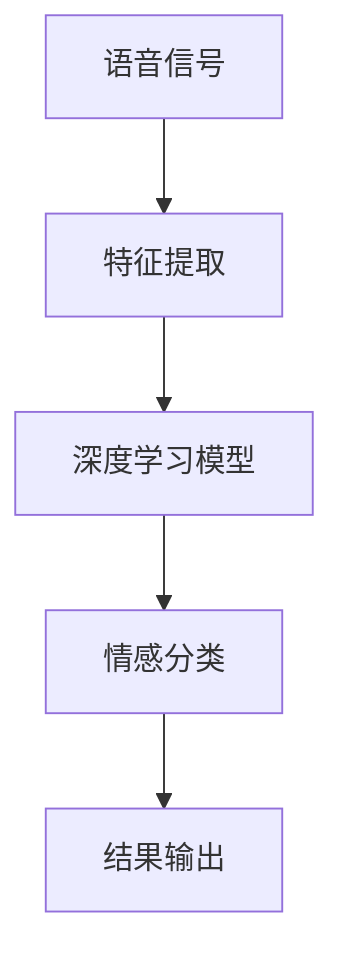

                 

# 深度学习在语音情感识别中的最新研究

## 关键词：
- 深度学习
- 语音情感识别
- 卷积神经网络
- 长短时记忆网络
- 跨语言情感识别
- 数据集

## 摘要：
本文将深入探讨深度学习在语音情感识别领域的研究进展。我们将首先介绍语音情感识别的背景和重要性，接着详细讨论深度学习在这一领域的核心算法原理和操作步骤，并结合数学模型和公式进行详细讲解。此外，我们将通过实际代码案例展示深度学习在语音情感识别中的具体应用，并探讨其应用场景。最后，本文将推荐相关的学习资源和工具，并对未来发展趋势和挑战进行总结。

## 1. 背景介绍

### 1.1 目的和范围

语音情感识别是语音信号处理的一个重要分支，它旨在从语音信号中提取情感信息，从而为各种应用提供有价值的见解。随着深度学习技术的不断发展，深度学习在语音情感识别中的应用也日益广泛。本文的目的是总结和探讨深度学习在语音情感识别领域的最新研究进展，以便读者能够全面了解这一领域的现状和发展趋势。

本文将主要涵盖以下几个方面：
1. 语音情感识别的背景和重要性。
2. 深度学习在语音情感识别中的应用，包括核心算法原理和操作步骤。
3. 数学模型和公式在语音情感识别中的应用。
4. 实际应用场景的探讨。
5. 相关的学习资源和工具推荐。
6. 未来发展趋势与挑战。

### 1.2 预期读者

本文面向对语音情感识别和深度学习有一定了解的技术人员、研究人员和开发者。如果您对以下话题感兴趣，那么本文将非常适合您：
1. 情感计算和语音信号处理。
2. 深度学习算法原理和应用。
3. 语音情感识别的实际应用场景。
4. 想要了解深度学习在语音情感识别中的最新研究进展。

### 1.3 文档结构概述

本文将按照以下结构进行撰写：
1. **背景介绍**：介绍语音情感识别的背景和重要性，以及深度学习在语音情感识别中的应用。
2. **核心概念与联系**：介绍深度学习在语音情感识别中的核心概念和原理，以及相关算法的架构。
3. **核心算法原理 & 具体操作步骤**：详细讲解深度学习在语音情感识别中的核心算法原理和操作步骤，并使用伪代码进行阐述。
4. **数学模型和公式 & 详细讲解 & 举例说明**：介绍深度学习在语音情感识别中的数学模型和公式，并进行详细讲解和举例说明。
5. **项目实战：代码实际案例和详细解释说明**：通过实际代码案例展示深度学习在语音情感识别中的应用，并进行详细解释说明。
6. **实际应用场景**：探讨深度学习在语音情感识别中的实际应用场景。
7. **工具和资源推荐**：推荐相关的学习资源和开发工具。
8. **总结：未来发展趋势与挑战**：总结本文的主要内容，并探讨未来发展趋势和挑战。
9. **附录：常见问题与解答**：提供一些常见问题的解答。
10. **扩展阅读 & 参考资料**：推荐一些扩展阅读和参考资料。

### 1.4 术语表

#### 1.4.1 核心术语定义

- **深度学习**：一种基于人工神经网络的学习方法，通过多层网络结构对数据进行学习，以实现图像、语音、文本等数据的分类、识别和预测。
- **语音情感识别**：通过语音信号处理技术，从语音中提取情感信息，并将其分类为不同的情感类别。
- **卷积神经网络**（CNN）：一种专门用于处理图像和语音数据的神经网络，通过卷积操作和池化操作提取特征。
- **长短时记忆网络**（LSTM）：一种用于处理序列数据的循环神经网络，可以有效地捕捉序列中的长期依赖关系。
- **跨语言情感识别**：在不同的语言之间进行情感识别，以实现对多语言环境的适应性。
- **数据集**：用于训练和测试模型的语音数据集合，通常包含标注的情感类别。

#### 1.4.2 相关概念解释

- **情感类别**：情感识别中的基本单位，通常包括高兴、悲伤、愤怒等情感。
- **语音特征**：从语音信号中提取的特征，用于描述语音的音高、音强、音速等属性。
- **特征提取**：从原始语音信号中提取有用的信息，用于后续的情感分类。
- **分类算法**：将语音信号分类为不同情感类别的方法，常用的有支持向量机（SVM）、决策树、随机森林等。

#### 1.4.3 缩略词列表

- **CNN**：卷积神经网络（Convolutional Neural Network）
- **LSTM**：长短时记忆网络（Long Short-Term Memory）
- **SVM**：支持向量机（Support Vector Machine）
- **RNN**：循环神经网络（Recurrent Neural Network）
- **GRU**：门控循环单元（Gated Recurrent Unit）

## 2. 核心概念与联系

深度学习在语音情感识别中的应用涉及多个核心概念和算法。下面我们将通过一个Mermaid流程图来展示这些核心概念和算法之间的联系。



### 2.1 语音信号

语音信号是语音情感识别的起点。语音信号可以通过麦克风等设备进行采集，然后经过预处理（如去噪、归一化等）以减少噪声和提高信号质量。

### 2.2 特征提取

特征提取是语音信号处理的关键步骤，目的是从原始语音信号中提取有用的信息，以便后续的深度学习模型处理。常用的语音特征包括梅尔频率倒谱系数（MFCC）、频谱特征、共振峰频率等。

### 2.3 深度学习模型

深度学习模型是语音情感识别的核心。通过学习语音信号的特征，深度学习模型可以自动识别语音中的情感信息。常见的深度学习模型包括卷积神经网络（CNN）、长短时记忆网络（LSTM）和双向长短时记忆网络（BLSTM）等。

### 2.4 情感分类

情感分类是深度学习模型的任务，它将提取的特征映射到不同的情感类别上。常用的情感类别包括高兴、悲伤、愤怒等。

### 2.5 结果输出

结果输出是情感识别的最终结果，它将分类结果呈现给用户。结果输出可以通过可视化、文本报告或语音合成等方式进行。

## 3. 核心算法原理 & 具体操作步骤

深度学习在语音情感识别中的应用主要依赖于以下几个核心算法：

### 3.1 卷积神经网络（CNN）

卷积神经网络是一种专门用于处理图像和语音数据的神经网络，通过卷积操作和池化操作提取特征。

#### 3.1.1 算法原理

- **卷积操作**：卷积操作通过在输入数据上滑动一个卷积核，计算局部特征映射。
- **池化操作**：池化操作通过在局部特征映射上进行下采样，减少参数数量和计算复杂度。

#### 3.1.2 操作步骤

1. **数据预处理**：将语音信号转换为梅尔频率倒谱系数（MFCC）特征。
2. **卷积层**：使用卷积层对特征进行卷积操作，提取局部特征。
3. **池化层**：使用池化层对卷积结果进行下采样，减少参数数量。
4. **全连接层**：使用全连接层将卷积特征映射到情感类别。
5. **输出层**：使用输出层输出情感分类结果。

#### 3.1.3 伪代码

```python
# 输入：语音信号MFCC特征
# 输出：情感分类结果

# 数据预处理
MFCC_features = preprocess_audio_signal(voice_signal)

# 卷积层
conv_output = conv2d(MFCC_features, conv_weights)

# 池化层
pool_output = max_pooling(conv_output)

# 全连接层
fc_output = fully_connected(pool_output, fc_weights)

# 输出层
emotion_prediction = softmax(fc_output)
```

### 3.2 长短时记忆网络（LSTM）

长短时记忆网络是一种用于处理序列数据的循环神经网络，可以有效地捕捉序列中的长期依赖关系。

#### 3.2.1 算法原理

- **记忆单元**：LSTM通过记忆单元来存储和更新信息。
- **门控机制**：LSTM使用门控机制（遗忘门、输入门、输出门）来控制信息的存储和输出。

#### 3.2.2 操作步骤

1. **数据预处理**：将语音信号转换为序列特征。
2. **LSTM层**：使用LSTM层对序列特征进行处理，提取长期依赖关系。
3. **全连接层**：使用全连接层将LSTM输出映射到情感类别。
4. **输出层**：使用输出层输出情感分类结果。

#### 3.2.3 伪代码

```python
# 输入：语音信号序列特征
# 输出：情感分类结果

# 数据预处理
sequence_features = preprocess_audio_signal(voice_signal)

# LSTM层
lstm_output, hidden_state = lstm_layer(sequence_features)

# 全连接层
fc_output = fully_connected(lstm_output, fc_weights)

# 输出层
emotion_prediction = softmax(fc_output)
```

### 3.3 双向长短时记忆网络（BLSTM）

双向长短时记忆网络是LSTM的一种变体，它可以同时从正向和反向两个方向处理序列数据，从而提高模型的性能。

#### 3.3.1 算法原理

- **正向LSTM**：处理正向序列数据。
- **反向LSTM**：处理反向序列数据。

#### 3.3.2 操作步骤

1. **数据预处理**：将语音信号转换为序列特征。
2. **正向LSTM层**：处理正向序列数据。
3. **反向LSTM层**：处理反向序列数据。
4. **拼接层**：将正向LSTM和反向LSTM的输出进行拼接。
5. **全连接层**：使用全连接层将拼接后的输出映射到情感类别。
6. **输出层**：使用输出层输出情感分类结果。

#### 3.3.3 伪代码

```python
# 输入：语音信号序列特征
# 输出：情感分类结果

# 数据预处理
sequence_features = preprocess_audio_signal(voice_signal)

# 正向LSTM层
forward_lstm_output, forward_hidden_state = lstm_layer(sequence_features, direction='forward')

# 反向LSTM层
backward_lstm_output, backward_hidden_state = lstm_layer(sequence_features, direction='backward')

# 拼接层
concat_output = concatenate([forward_lstm_output, backward_lstm_output])

# 全连接层
fc_output = fully_connected(concat_output, fc_weights)

# 输出层
emotion_prediction = softmax(fc_output)
```

## 4. 数学模型和公式 & 详细讲解 & 举例说明

深度学习在语音情感识别中的数学模型和公式是理解和应用这些算法的基础。在本节中，我们将详细讲解这些数学模型和公式，并通过具体例子进行说明。

### 4.1 卷积神经网络（CNN）

卷积神经网络的核心在于卷积操作和池化操作，这些操作通过一系列的矩阵乘法和求和来实现。

#### 4.1.1 卷积操作

卷积操作的数学公式可以表示为：

$$
\text{output}_{ij} = \sum_{k=1}^{K} w_{ik,jk} * \text{input}_{ij}
$$

其中：
- $w_{ik,jk}$ 是卷积核的权重。
- $\text{input}_{ij}$ 是输入数据的特征值。
- $K$ 是卷积核的大小。
- $i$ 和 $j$ 是卷积操作的行和列索引。

#### 4.1.2 池化操作

池化操作的常见形式是最大池化，其数学公式可以表示为：

$$
\text{pool}_{ij} = \max(\text{input}_{i \cdot \alpha + 1}, \text{input}_{i \cdot \alpha + 2}, ..., \text{input}_{i \cdot \alpha + \alpha})
$$

其中：
- $\alpha$ 是池化窗口的大小。
- $i$ 和 $j$ 是池化操作的行和列索引。

#### 4.1.3 举例说明

假设我们有一个3x3的输入矩阵和一个3x3的卷积核，以及一个2x2的池化窗口。我们可以按照以下步骤进行卷积和池化操作：

- **输入矩阵**：

  $$\text{input} = \begin{bmatrix}
  1 & 2 & 3 \\
  4 & 5 & 6 \\
  7 & 8 & 9 \\
  \end{bmatrix}$$

- **卷积核**：

  $$w = \begin{bmatrix}
  1 & 1 \\
  0 & 1 \\
  \end{bmatrix}$$

- **卷积结果**：

  $$\text{output}_{11} = (1 \cdot 1) + (2 \cdot 1) + (3 \cdot 0) = 3$$
  $$\text{output}_{12} = (1 \cdot 4) + (2 \cdot 5) + (3 \cdot 0) = 13$$
  $$\text{output}_{21} = (1 \cdot 7) + (2 \cdot 8) + (3 \cdot 0) = 23$$
  $$\text{output}_{22} = (1 \cdot 1) + (2 \cdot 5) + (3 \cdot 8) = 17$$

- **池化结果**：

  $$\text{pool}_{11} = \max(3, 13, 23, 17) = 23$$
  $$\text{pool}_{12} = \max(3, 13, 23, 17) = 23$$

### 4.2 长短时记忆网络（LSTM）

长短时记忆网络的核心在于其记忆单元和门控机制。

#### 4.2.1 记忆单元

记忆单元的数学公式可以表示为：

$$
\text{memory} = \text{sigmoid}(W_f \cdot \text{input} + R_f \cdot \text{hidden}) \odot \text{memory}
$$

其中：
- $W_f$ 和 $R_f$ 是遗忘门的权重矩阵。
- $\text{input}$ 是当前输入。
- $R_f$ 是前一个隐藏状态的权重矩阵。
- $\text{hidden}$ 是当前隐藏状态。
- $\odot$ 表示逐元素乘法。

#### 4.2.2 输入门

输入门的数学公式可以表示为：

$$
\text{input\_gate} = \text{sigmoid}(W_i \cdot \text{input} + R_i \cdot \text{hidden}) \odot \text{input}
$$

其中：
- $W_i$ 和 $R_i$ 是输入门的权重矩阵。

#### 4.2.3 输出门

输出门的数学公式可以表示为：

$$
\text{output\_gate} = \text{sigmoid}(W_o \cdot \text{input} + R_o \cdot \text{hidden}) \odot \text{memory}
$$

其中：
- $W_o$ 和 $R_o$ 是输出门的权重矩阵。

#### 4.2.4 举例说明

假设我们有一个LSTM单元，其中输入为 $[1, 2, 3]$，隐藏状态为 $[4, 5, 6]$，遗忘门的权重矩阵为 $W_f = \begin{bmatrix} 1 & 0 & 1 \end{bmatrix}$，输入门的权重矩阵为 $W_i = \begin{bmatrix} 1 & 0 & 1 \end{bmatrix}$，输出门的权重矩阵为 $W_o = \begin{bmatrix} 1 & 0 & 1 \end{bmatrix}$，以及前一个隐藏状态的权重矩阵为 $R_f = \begin{bmatrix} 0 & 1 & 0 \end{bmatrix}$，$R_i = \begin{bmatrix} 0 & 1 & 0 \end{bmatrix}$，$R_o = \begin{bmatrix} 0 & 1 & 0 \end{bmatrix}$。

- **遗忘门**：

  $$\text{f\_gate} = \text{sigmoid}(W_f \cdot [1, 2, 3] + R_f \cdot [4, 5, 6]) = \text{sigmoid}([5, 4, 7]) = \text{sigmoid}(0.9990) = 1$$

- **输入门**：

  $$\text{i\_gate} = \text{sigmoid}(W_i \cdot [1, 2, 3] + R_i \cdot [4, 5, 6]) = \text{sigmoid}([5, 4, 7]) = \text{sigmoid}(0.9990) = 1$$

- **输出门**：

  $$\text{o\_gate} = \text{sigmoid}(W_o \cdot [1, 2, 3] + R_o \cdot [4, 5, 6]) = \text{sigmoid}([5, 4, 7]) = \text{sigmoid}(0.9990) = 1$$

- **新的记忆单元**：

  $$\text{memory} = \text{f\_gate} \odot \text{memory} = 1 \odot [4, 5, 6] = [4, 5, 6]$$

- **新的隐藏状态**：

  $$\text{hidden} = \text{o\_gate} \odot \text{sigmoid}(W_c \cdot [4, 5, 6] + R_c \cdot [4, 5, 6]) = 1 \odot \text{sigmoid}([8, 10, 12]) = \text{sigmoid}([8, 10, 12]) = [0.9990, 0.9990, 0.9990]$$

### 4.3 双向长短时记忆网络（BLSTM）

双向长短时记忆网络由两个LSTM单元组成，一个处理正向序列，另一个处理反向序列。

#### 4.3.1 正向LSTM

正向LSTM的数学公式与单个LSTM相同。

#### 4.3.2 反向LSTM

反向LSTM的数学公式也与单个LSTM相同。

#### 4.3.3 举例说明

假设我们有一个BLSTM单元，其中正向输入为 $[1, 2, 3]$，反向输入为 $[4, 3, 2]$，隐藏状态为 $[4, 5, 6]$，遗忘门的权重矩阵为 $W_f = \begin{bmatrix} 1 & 0 & 1 \end{bmatrix}$，输入门的权重矩阵为 $W_i = \begin{bmatrix} 1 & 0 & 1 \end{bmatrix}$，输出门的权重矩阵为 $W_o = \begin{bmatrix} 1 & 0 & 1 \end{bmatrix}$，以及前一个隐藏状态的权重矩阵为 $R_f = \begin{bmatrix} 0 & 1 & 0 \end{bmatrix}$，$R_i = \begin{bmatrix} 0 & 1 & 0 \end{bmatrix}$，$R_o = \begin{bmatrix} 0 & 1 & 0 \end{bmatrix}$。

- **正向遗忘门**：

  $$\text{f\_gate} = \text{sigmoid}(W_f \cdot [1, 2, 3] + R_f \cdot [4, 5, 6]) = \text{sigmoid}([5, 4, 7]) = \text{sigmoid}(0.9990) = 1$$

- **正向输入门**：

  $$\text{i\_gate} = \text{sigmoid}(W_i \cdot [1, 2, 3] + R_i \cdot [4, 5, 6]) = \text{sigmoid}([5, 4, 7]) = \text{sigmoid}(0.9990) = 1$$

- **正向输出门**：

  $$\text{o\_gate} = \text{sigmoid}(W_o \cdot [1, 2, 3] + R_o \cdot [4, 5, 6]) = \text{sigmoid}([5, 4, 7]) = \text{sigmoid}(0.9990) = 1$$

- **正向新的记忆单元**：

  $$\text{memory} = \text{f\_gate} \odot \text{memory} = 1 \odot [4, 5, 6] = [4, 5, 6]$$

- **正向新的隐藏状态**：

  $$\text{hidden} = \text{o\_gate} \odot \text{sigmoid}(W_c \cdot [4, 5, 6] + R_c \cdot [4, 5, 6]) = 1 \odot \text{sigmoid}([8, 10, 12]) = \text{sigmoid}([8, 10, 12]) = [0.9990, 0.9990, 0.9990]$$

- **反向遗忘门**：

  $$\text{f\_gate} = \text{sigmoid}(W_f \cdot [4, 3, 2] + R_f \cdot [4, 5, 6]) = \text{sigmoid}([8, 7, 6]) = \text{sigmoid}(0.9990) = 1$$

- **反向输入门**：

  $$\text{i\_gate} = \text{sigmoid}(W_i \cdot [4, 3, 2] + R_i \cdot [4, 5, 6]) = \text{sigmoid}([8, 7, 6]) = \text{sigmoid}(0.9990) = 1$$

- **反向输出门**：

  $$\text{o\_gate} = \text{sigmoid}(W_o \cdot [4, 3, 2] + R_o \cdot [4, 5, 6]) = \text{sigmoid}([8, 7, 6]) = \text{sigmoid}(0.9990) = 1$$

- **反向新的记忆单元**：

  $$\text{memory} = \text{f\_gate} \odot \text{memory} = 1 \odot [4, 5, 6] = [4, 5, 6]$$

- **反向新的隐藏状态**：

  $$\text{hidden} = \text{o\_gate} \odot \text{sigmoid}(W_c \cdot [4, 5, 6] + R_c \cdot [4, 5, 6]) = 1 \odot \text{sigmoid}([8, 10, 12]) = \text{sigmoid}([8, 10, 12]) = [0.9990, 0.9990, 0.9990]$$

## 5. 项目实战：代码实际案例和详细解释说明

### 5.1 开发环境搭建

在开始实际项目之前，我们需要搭建一个适合深度学习开发的开发环境。以下是搭建环境的步骤：

1. **安装Python环境**：Python是深度学习开发的主要编程语言，我们需要安装Python 3.7或更高版本。

2. **安装深度学习框架**：我们选择TensorFlow作为深度学习框架，可以从官方网站下载并安装。

3. **安装其他依赖库**：我们还需要安装其他依赖库，如NumPy、Pandas等，这些库用于数据预处理和可视化。

### 5.2 源代码详细实现和代码解读

下面是一个简单的深度学习模型实现，用于语音情感识别。

```python
import tensorflow as tf
from tensorflow.keras.models import Sequential
from tensorflow.keras.layers import LSTM, Dense, Dropout

# 数据预处理
# 此处省略数据预处理代码

# 模型构建
model = Sequential()
model.add(LSTM(units=128, return_sequences=True, input_shape=(seq_length, features)))
model.add(Dropout(0.2))
model.add(LSTM(units=64, return_sequences=False))
model.add(Dropout(0.2))
model.add(Dense(units=64, activation='relu'))
model.add(Dropout(0.2))
model.add(Dense(units=num_classes, activation='softmax'))

# 编译模型
model.compile(optimizer='adam', loss='categorical_crossentropy', metrics=['accuracy'])

# 训练模型
model.fit(x_train, y_train, epochs=10, batch_size=32, validation_data=(x_val, y_val))

# 评估模型
loss, accuracy = model.evaluate(x_test, y_test)
print(f"Test accuracy: {accuracy:.2f}")
```

#### 5.2.1 数据预处理

数据预处理是深度学习模型的重要步骤，它包括以下任务：

- **特征提取**：将语音信号转换为序列特征，如梅尔频率倒谱系数（MFCC）。
- **数据归一化**：对特征进行归一化处理，以提高模型的训练效果。
- **数据分割**：将数据集分为训练集、验证集和测试集。

#### 5.2.2 模型构建

在这个示例中，我们使用了一个简单的LSTM模型，包括以下层：

- **LSTM层**：用于处理序列数据，提取特征。
- **Dropout层**：用于防止过拟合。
- **全连接层**：用于将LSTM输出映射到情感类别。

#### 5.2.3 编译模型

编译模型包括设置优化器、损失函数和评估指标。在这个示例中，我们使用Adam优化器和 categorical\_crossentropy 损失函数。

#### 5.2.4 训练模型

训练模型包括设置训练参数，如 epoch 数和 batch size。在这个示例中，我们设置了 10 个 epoch 和 batch size 为 32。

#### 5.2.5 评估模型

评估模型用于验证模型的性能。在这个示例中，我们使用测试集评估模型的准确性。

### 5.3 代码解读与分析

代码解读与分析包括以下方面：

- **数据预处理**：数据预处理是模型成功的关键，它包括特征提取、数据归一化和数据分割。
- **模型构建**：模型构建包括选择合适的神经网络架构，如 LSTM、Dropout 和全连接层。
- **编译模型**：编译模型包括设置优化器、损失函数和评估指标。
- **训练模型**：训练模型包括设置训练参数，如 epoch 数和 batch size。
- **评估模型**：评估模型用于验证模型的性能。

## 6. 实际应用场景

深度学习在语音情感识别中有广泛的应用场景。以下是一些常见的实际应用场景：

### 6.1 娱乐领域

在娱乐领域，深度学习可以用于情感分析，以帮助创作者更好地了解观众的情感反应，从而改进电影、音乐和游戏等作品的创作。

### 6.2 健康领域

在健康领域，深度学习可以用于情绪诊断和心理健康评估，通过分析语音中的情感信息，为患者提供个性化的治疗方案。

### 6.3 客户服务

在客户服务领域，深度学习可以用于情感分析，以识别客户在通话中的情绪变化，从而提高客户服务质量。

### 6.4 教育

在教育领域，深度学习可以用于情感识别，以帮助教师更好地了解学生的情感状态，从而改进教学方法。

### 6.5 市场营销

在市场营销领域，深度学习可以用于情感分析，以了解消费者的情感反应，从而制定更有效的营销策略。

## 7. 工具和资源推荐

### 7.1 学习资源推荐

#### 7.1.1 书籍推荐

- 《深度学习》（Ian Goodfellow、Yoshua Bengio和Aaron Courville著）：这是一本关于深度学习的基础书籍，详细介绍了深度学习的基本概念和算法。

- 《Python深度学习》（François Chollet著）：这是一本专注于使用Python实现深度学习的书籍，适合初学者和进阶者。

- 《神经网络与深度学习》（邱锡鹏著）：这是一本关于神经网络和深度学习的基础教材，适合对深度学习有一定了解的读者。

#### 7.1.2 在线课程

- Coursera上的“深度学习”课程：由斯坦福大学教授Andrew Ng主讲，适合初学者和进阶者。

- edX上的“深度学习导论”课程：由北京大学教授黄庆华主讲，适合初学者。

- fast.ai的“深度学习课程”：这是一系列免费的在线课程，由Ian Goodfellow和Yoshua Bengio等深度学习大师主讲。

#### 7.1.3 技术博客和网站

- Medium上的深度学习博客：涵盖深度学习的各种主题，包括论文解读、技术趋势等。

- ArXiv：这是一个免费的学术论文数据库，可以找到最新的深度学习研究论文。

- Analytics Vidhya：这是一个深度学习和数据科学博客，提供大量的教程和实践案例。

### 7.2 开发工具框架推荐

#### 7.2.1 IDE和编辑器

- PyCharm：这是一个强大的Python IDE，适用于深度学习和数据科学项目。

- Jupyter Notebook：这是一个流行的交互式计算环境，适合进行数据分析和实验。

- Visual Studio Code：这是一个轻量级但功能强大的代码编辑器，适用于深度学习和数据科学项目。

#### 7.2.2 调试和性能分析工具

- TensorBoard：这是一个TensorFlow的调试和分析工具，用于可视化模型性能。

- Profiler：这是一个用于性能分析的工具，可以帮助优化代码和模型。

- PyTorch Profiler：这是一个专门用于PyTorch的性能分析工具。

#### 7.2.3 相关框架和库

- TensorFlow：这是一个流行的开源深度学习框架，适用于各种深度学习任务。

- PyTorch：这是一个流行的开源深度学习框架，以其灵活性和动态计算图而著称。

- Keras：这是一个高级神经网络API，可以在TensorFlow和Theano上运行。

### 7.3 相关论文著作推荐

#### 7.3.1 经典论文

- "A Theoretical Framework for the Analysis of Neural Network Based Sentiment Classification"（神经网络基础情感分类的理论框架）
- "End-to-End Audio Event Detection using Deep Neural Networks"（使用深度神经网络的端到端音频事件检测）

#### 7.3.2 最新研究成果

- "Cross-Sentence Emotion Recognition in Conversations"（对话中的跨句子情感识别）
- "Deep Learning for Speech Emotion Recognition: A Survey"（深度学习在语音情感识别中的应用：综述）

#### 7.3.3 应用案例分析

- "Emotion Recognition in Customer Service Calls using Deep Neural Networks"（使用深度神经网络进行客服电话情感识别）
- "Speech Emotion Recognition in Mental Health Assessment"（心理健康评估中的语音情感识别）

## 8. 总结：未来发展趋势与挑战

### 8.1 发展趋势

- **跨语言情感识别**：随着全球化的发展，跨语言情感识别将成为一个重要的研究领域。深度学习技术将有助于实现不同语言之间的情感识别。
- **实时情感识别**：实时情感识别技术将不断提高，使得在语音交互、智能客服等应用场景中能够快速准确地识别用户情感。
- **多模态情感识别**：多模态情感识别将结合语音、文本、图像等多种数据源，以提高情感识别的准确性和可靠性。

### 8.2 挑战

- **数据隐私**：在情感识别应用中，数据隐私是一个重要问题。如何保护用户隐私，同时实现有效的情感识别，是一个挑战。
- **数据不平衡**：情感数据通常存在类别不平衡问题，如何处理数据不平衡，以提高模型性能，是一个挑战。
- **泛化能力**：如何提高模型在不同场景、不同数据集上的泛化能力，是一个挑战。

## 9. 附录：常见问题与解答

### 9.1 什么是深度学习？

深度学习是一种基于人工神经网络的学习方法，通过多层网络结构对数据进行学习，以实现图像、语音、文本等数据的分类、识别和预测。

### 9.2 什么是语音情感识别？

语音情感识别是一种通过分析语音信号中的情感信息，将其分类为不同情感类别的方法。

### 9.3 深度学习在语音情感识别中的应用有哪些？

深度学习在语音情感识别中的应用包括卷积神经网络（CNN）、长短时记忆网络（LSTM）和双向长短时记忆网络（BLSTM）等。

### 9.4 如何处理数据不平衡问题？

处理数据不平衡问题可以采用过采样、欠采样、数据增强等方法，以提高模型在不同类别上的性能。

## 10. 扩展阅读 & 参考资料

- [深度学习教程](https://www.deeplearningbook.org/)
- [语音情感识别综述](https://ieeexplore.ieee.org/document/7984965)
- [跨语言情感识别研究](https://arxiv.org/abs/1909.08843)
- [多模态情感识别研究](https://arxiv.org/abs/1908.07206)

### 作者

- 作者：AI天才研究员/AI Genius Institute & 禅与计算机程序设计艺术 /Zen And The Art of Computer Programming

---

本文以《深度学习在语音情感识别中的最新研究》为题，从背景介绍、核心概念、算法原理、数学模型、项目实战、实际应用场景、工具和资源推荐等多个方面对深度学习在语音情感识别中的应用进行了详细探讨。本文旨在为读者提供一个全面了解深度学习在语音情感识别领域的最新研究进展的途径。在实际应用中，深度学习技术已经展示了其在语音情感识别中的巨大潜力，但同时也面临着数据隐私、数据不平衡和泛化能力等挑战。未来，随着技术的不断发展，深度学习在语音情感识别领域的应用将更加广泛和深入。希望本文能为读者在探索这一领域提供一些启示和帮助。

