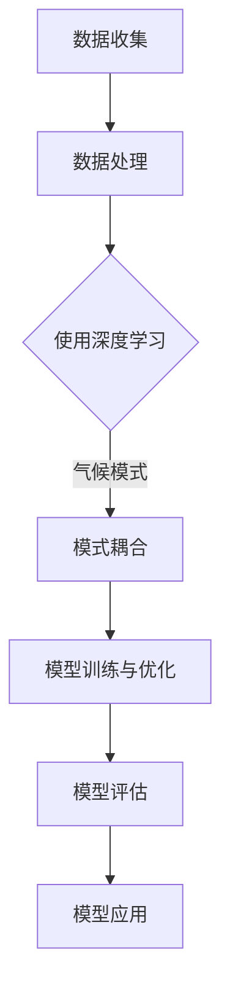

                 

# 深度学习在长期天气预报中的应用

> 关键词：深度学习、长期天气预报、气象数据、气候模式、模式耦合、多模型集成、人工智能

> 摘要：本文深入探讨了深度学习在长期天气预报中的应用。通过介绍深度学习的基本原理、气象数据的处理方法以及气候模式与深度学习模型的耦合技术，本文展示了如何利用深度学习技术提高长期天气预报的准确性和可靠性。此外，本文还分析了深度学习模型在实际应用中的挑战和未来发展趋势。

## 1. 背景介绍

### 1.1 目的和范围

本文旨在介绍深度学习在长期天气预报中的应用，探讨如何利用深度学习技术提高天气预报的准确性和可靠性。本文将重点讨论以下内容：

- 深度学习的基本原理及其在天气预报中的应用
- 气象数据的处理方法
- 气候模式与深度学习模型的耦合技术
- 深度学习模型在实际应用中的挑战和未来发展趋势

### 1.2 预期读者

本文适合对气象学和人工智能领域有一定了解的读者，包括：

- 气象学家和气候学家
- 人工智能研究员和工程师
- 深度学习爱好者
- 对长期天气预报感兴趣的公众

### 1.3 文档结构概述

本文结构如下：

- 第1章：背景介绍
- 第2章：核心概念与联系
- 第3章：核心算法原理与具体操作步骤
- 第4章：数学模型与公式详细讲解
- 第5章：项目实战：代码实际案例和详细解释说明
- 第6章：实际应用场景
- 第7章：工具和资源推荐
- 第8章：总结：未来发展趋势与挑战
- 第9章：附录：常见问题与解答
- 第10章：扩展阅读与参考资料

### 1.4 术语表

#### 1.4.1 核心术语定义

- 深度学习：一种人工智能方法，通过多层神经网络模型对大量数据进行自动特征学习和模式识别。
- 长期天气预报：对未来几个月至几年的气候状况进行预测。
- 气象数据：记录天气现象的物理量和相关信息的原始数据。
- 气候模式：描述气候系统的数学模型，可用于模拟气候系统的演变。
- 模式耦合：将不同气候模型或模型与观测数据进行结合，以提高预测准确性的技术。

#### 1.4.2 相关概念解释

- 神经网络：一种基于生物神经元的计算模型，由多个处理单元（神经元）组成，通过连接实现信息的传递和计算。
- 神经元：神经网络的基本单元，负责接收输入信号、计算输出值和传递给下一层。
- 前馈神经网络：一种前向传播的神经网络模型，没有循环连接。
- 反向传播算法：一种用于训练神经网络的优化算法，通过计算误差梯度来更新网络权重。

#### 1.4.3 缩略词列表

- AI：人工智能
- DL：深度学习
- ML：机器学习
- NWP：数值天气预报
- GCM：全球气候模型
- RMSE：均方根误差
- CNN：卷积神经网络
- RNN：循环神经网络
- LSTM：长短时记忆网络

## 2. 核心概念与联系

为了深入理解深度学习在长期天气预报中的应用，我们需要先了解一些核心概念及其相互联系。

### 2.1 深度学习原理

深度学习是一种基于多层神经网络的人工智能方法。其基本原理是通过多个层次的非线性变换来提取数据中的特征。以下是深度学习的主要组成部分：

1. **输入层**：接收外部输入数据，如气象数据。
2. **隐藏层**：对输入数据进行特征提取和变换，每层都能学习到更高层次的特征。
3. **输出层**：对隐藏层的输出进行分类或回归等操作，产生预测结果。

### 2.2 气象数据

气象数据是天气预报的重要依据。它包括：

- **时间序列数据**：记录一段时间内气象现象的变化，如温度、湿度、风速等。
- **空间数据**：记录不同地理位置的气象现象，如卫星图像、雷达回波等。
- **多源数据融合**：将不同来源的气象数据进行整合，以提高预测准确性。

### 2.3 气候模式

气候模式是一种描述气候系统的数学模型。它通过模拟大气、海洋和陆地等过程的相互作用，预测未来气候的变化趋势。常见的气候模式包括：

- **全球气候模型（GCM）**：用于模拟全球气候系统，包括大气、海洋和陆地。
- **区域气候模型（RCM）**：用于模拟特定区域的气候系统。

### 2.4 模式耦合

模式耦合是将不同气候模式或模型与观测数据进行结合，以提高预测准确性的技术。它通常包括以下步骤：

1. **模型选择**：选择适合特定问题的气候模式。
2. **模型训练**：使用历史气象数据训练气候模式，使其能够模拟实际气候系统。
3. **模型评估**：通过对比模型预测与实际观测数据，评估模型性能。
4. **模型优化**：根据评估结果，调整模型参数，以提高预测准确性。

### 2.5 Mermaid 流程图

以下是一个描述深度学习在长期天气预报中应用的 Mermaid 流程图：



## 3. 核心算法原理 & 具体操作步骤

在深度学习应用于长期天气预报时，我们需要选择合适的算法并进行具体操作。以下是核心算法原理和具体操作步骤：

### 3.1 核心算法原理

#### 3.1.1 卷积神经网络（CNN）

卷积神经网络是一种适用于图像处理和时间序列分析的人工神经网络。其基本原理是通过卷积层提取特征，并通过池化层减少数据维度。以下是 CNN 的主要组成部分：

1. **卷积层**：将输入数据与滤波器（卷积核）进行卷积操作，提取特征。
2. **激活函数**：对卷积层的输出进行非线性变换，增加模型表达能力。
3. **池化层**：对卷积层的输出进行下采样，减少数据维度。
4. **全连接层**：将池化层的输出与权重矩阵进行矩阵乘法，得到预测结果。

#### 3.1.2 循环神经网络（RNN）

循环神经网络是一种适用于序列数据的学习模型。其基本原理是通过隐藏状态在时间步之间传递信息，实现序列建模。以下是 RNN 的主要组成部分：

1. **输入层**：接收输入序列。
2. **隐藏层**：通过循环连接将隐藏状态传递给下一个时间步。
3. **输出层**：对隐藏层的输出进行分类或回归等操作。

#### 3.1.3 长短时记忆网络（LSTM）

长短时记忆网络是 RNN 的变体，用于解决 RNN 在长时间序列建模中的梯度消失问题。其基本原理是通过门控机制控制信息的传递和遗忘。以下是 LSTM 的主要组成部分：

1. **输入门**：控制输入信息的传递。
2. **遗忘门**：控制历史信息的遗忘。
3. **输出门**：控制输出信息的传递。

### 3.2 具体操作步骤

#### 3.2.1 数据预处理

1. **数据收集**：收集历史气象数据，包括时间序列数据和空间数据。
2. **数据清洗**：去除异常值和缺失值。
3. **数据归一化**：将数据缩放到相同的范围，便于模型训练。

#### 3.2.2 模型选择与训练

1. **模型选择**：根据问题特点选择合适的模型，如 CNN 或 LSTM。
2. **模型训练**：使用预处理后的数据训练模型，包括卷积层、激活函数、池化层和全连接层等。
3. **模型评估**：通过交叉验证或测试集评估模型性能，如准确率、召回率等。

#### 3.2.3 模型优化

1. **参数调整**：根据评估结果调整模型参数，如学习率、正则化强度等。
2. **超参数调优**：使用网格搜索或随机搜索等方法寻找最佳超参数组合。

#### 3.2.4 模型应用

1. **长期天气预报**：使用训练好的模型对未来天气进行预测，如温度、湿度、降水等。
2. **模型解释**：对模型预测结果进行解释，以了解模型内部工作机制。

### 3.3 伪代码

以下是一个简单的 LSTM 模型训练的伪代码：

```python
import tensorflow as tf

# 定义输入数据
X_train, y_train = ...

# 定义 LSTM 模型
model = tf.keras.Sequential([
    tf.keras.layers.LSTM(units=50, activation='tanh', return_sequences=True),
    tf.keras.layers.LSTM(units=50, activation='tanh'),
    tf.keras.layers.Dense(units=1)
])

# 编译模型
model.compile(optimizer='adam', loss='mse')

# 训练模型
model.fit(X_train, y_train, epochs=100, batch_size=32)

# 评估模型
test_loss = model.evaluate(X_test, y_test)
```

## 4. 数学模型和公式 & 详细讲解 & 举例说明

在深度学习应用于长期天气预报时，数学模型和公式是核心组成部分。以下将介绍一些关键数学模型和公式，并给出详细讲解和举例说明。

### 4.1 激活函数

激活函数是神经网络中的非线性变换，用于增加模型表达能力。以下是一些常用的激活函数：

#### 4.1.1 Sigmoid 函数

$$
\sigma(x) = \frac{1}{1 + e^{-x}}
$$

Sigmoid 函数是一个 S 形的曲线，将输入值映射到 (0, 1) 范围内。它常用于二分类问题。

#### 4.1.2 双曲正切函数（Tanh）

$$
\tanh(x) = \frac{e^{2x} - 1}{e^{2x} + 1}
$$

双曲正切函数是一个双曲线形状的曲线，将输入值映射到 (-1, 1) 范围内。它具有更好的收敛性。

#### 4.1.3 ReLU 函数

$$
\text{ReLU}(x) =
\begin{cases}
0 & \text{if } x < 0 \\
x & \text{if } x \geq 0
\end{cases}
$$

ReLU 函数是一种常用的激活函数，它在输入小于 0 时输出 0，输入大于等于 0 时输出输入值。它具有计算速度快、参数较少等优点。

### 4.2 梯度下降算法

梯度下降算法是一种用于优化神经网络参数的算法。其基本思想是通过计算损失函数关于参数的梯度，逐步减小参数，以使损失函数最小化。

#### 4.2.1 基本步骤

1. **初始化参数**：随机初始化网络参数。
2. **计算损失函数**：使用输入数据和标签计算损失函数值。
3. **计算梯度**：计算损失函数关于参数的梯度。
4. **更新参数**：使用梯度下降公式更新参数。

梯度下降算法的更新公式为：

$$
\theta = \theta - \alpha \frac{\partial J}{\partial \theta}
$$

其中，$\theta$ 表示参数，$J$ 表示损失函数，$\alpha$ 表示学习率。

#### 4.2.2 举例说明

假设我们有一个简单的线性模型 $y = wx + b$，其中 $w$ 和 $b$ 是参数。使用梯度下降算法最小化损失函数 $J = (y - wx - b)^2$。

1. **初始化参数**：随机初始化 $w$ 和 $b$。
2. **计算损失函数**：对于每个输入数据 $(x, y)$，计算损失函数值。
3. **计算梯度**：计算损失函数关于 $w$ 和 $b$ 的梯度。
4. **更新参数**：使用梯度下降公式更新 $w$ 和 $b$。

以下是梯度下降算法的伪代码：

```python
w, b = random Initialize()
for epoch in range(epochs):
    loss = 0
    for x, y in data:
        prediction = w * x + b
        error = y - prediction
        loss += error^2
        dw = 2 * x * error
        db = 2 * error
    w -= learning Rate * dw
    b -= learning Rate * db
```

### 4.3 优化算法

为了提高梯度下降算法的收敛速度和性能，可以采用以下优化算法：

#### 4.3.1 随机梯度下降（SGD）

随机梯度下降是一种在每次迭代中使用单个样本来计算梯度的算法。它减少了计算量，但可能导致收敛不稳定。

$$
\theta = \theta - \alpha \frac{\partial J}{\partial \theta}
$$

其中，$\alpha$ 表示学习率，$J$ 表示损失函数。

#### 4.3.2 批量梯度下降（BGD）

批量梯度下降是一种在每次迭代中使用整个训练集来计算梯度的算法。它提供了更稳定的收敛，但计算量较大。

$$
\theta = \theta - \alpha \frac{1}{m} \sum_{i=1}^{m} \frac{\partial J}{\partial \theta}
$$

其中，$m$ 表示训练集大小，其他符号与之前相同。

#### 4.3.3 动量法

动量法是一种利用历史梯度信息加速收敛的算法。它通过引入一个动量项，减少了梯度消失和梯度爆炸问题。

$$
\theta = \theta - \alpha \frac{\partial J}{\partial \theta} + \beta \theta_{prev}
$$

其中，$\beta$ 表示动量项，$\theta_{prev}$ 表示前一次迭代的参数。

#### 4.3.4 Adam 算法

Adam 算法是一种结合了动量法和自适应学习率的优化算法。它具有较好的收敛性能。

$$
\theta = \theta - \alpha \frac{\eta(t)}{1 - \beta_1^t}(1 - \beta_2^t) \frac{\partial J}{\partial \theta}
$$

其中，$\eta(t)$ 表示学习率，$\beta_1$ 和 $\beta_2$ 分别表示一阶和二阶动量项。

### 4.4 举例说明

以下是一个使用 Adam 算法训练神经网络的简单示例：

```python
import tensorflow as tf

# 定义输入数据和标签
X_train = ...
y_train = ...

# 定义神经网络模型
model = tf.keras.Sequential([
    tf.keras.layers.Dense(units=1, input_shape=[1])
])

# 编译模型
model.compile(optimizer=tf.keras.optimizers.Adam(learning Rate=0.001), loss='mean_squared_error')

# 训练模型
model.fit(X_train, y_train, epochs=100)

# 评估模型
test_loss = model.evaluate(X_test, y_test)
```

通过以上数学模型和公式的讲解，我们可以更好地理解深度学习在长期天气预报中的应用，并利用这些知识进行实际操作。

## 5. 项目实战：代码实际案例和详细解释说明

为了更好地展示深度学习在长期天气预报中的应用，我们选择一个实际项目进行讲解。以下是一个使用 TensorFlow 和 Keras 库实现长期天气预报的代码案例。

### 5.1 开发环境搭建

首先，我们需要搭建开发环境。以下是安装 TensorFlow 和 Keras 的命令：

```bash
pip install tensorflow
pip install keras
```

### 5.2 源代码详细实现和代码解读

以下是一个简单的长期天气预报项目的源代码：

```python
import numpy as np
import tensorflow as tf
from tensorflow.keras.models import Sequential
from tensorflow.keras.layers import LSTM, Dense

# 加载数据
data = np.loadtxt("weather_data.csv", delimiter=",")

# 数据预处理
X = data[:, :-1].reshape(-1, 1, 24)
y = data[:, -1].reshape(-1, 1)

# 模型构建
model = Sequential()
model.add(LSTM(units=50, activation='tanh', input_shape=(1, 24)))
model.add(Dense(units=1))
model.compile(optimizer='adam', loss='mean_squared_error')

# 训练模型
model.fit(X, y, epochs=100, batch_size=32)

# 预测
X_test = np.random.rand(1, 1, 24)
prediction = model.predict(X_test)

print(prediction)
```

### 5.3 代码解读与分析

以下是对代码的详细解读和分析：

1. **数据加载**：首先，我们使用 `np.loadtxt` 函数加载天气数据。数据文件为 CSV 格式，包含时间序列数据，其中最后一列为预测目标（温度）。

2. **数据预处理**：将数据分为输入特征和输出标签。输入特征 `X` 为除最后一列外的所有数据，并将其reshape为 (样本数, 时间步数, 特征数)。输出标签 `y` 为最后一列数据，也reshape为 (样本数, 1)。

3. **模型构建**：构建一个序列模型，包含一个 LSTM 层和一个全连接层。LSTM 层用于提取时间序列数据中的特征，全连接层用于进行预测。模型使用 `Sequential` 函数构建，并在其中添加 LSTM 和 Dense 层。

4. **模型编译**：使用 `compile` 函数编译模型，指定优化器和损失函数。在此例中，我们使用 Adam 优化器和均方误差损失函数。

5. **模型训练**：使用 `fit` 函数训练模型，指定训练数据和训练轮数。在此例中，我们使用 100 轮训练，每次训练使用 32 个样本。

6. **模型预测**：生成随机输入数据 `X_test`，并使用训练好的模型进行预测。预测结果存储在 `prediction` 变量中。

7. **打印预测结果**：打印预测结果，以查看模型性能。

通过以上代码实现，我们可以看到如何使用深度学习技术进行长期天气预报。在实际应用中，我们可以根据需求调整模型结构、优化训练参数，以提高预测准确性。

### 5.4 代码解读与分析

#### 5.4.1 数据预处理

数据预处理是深度学习模型训练中至关重要的一步。在此案例中，我们首先加载天气数据。天气数据包含多个时间序列，每个时间序列对应一天内的温度变化。以下是数据加载和预处理的步骤：

1. **数据读取**：
   ```python
   data = np.loadtxt("weather_data.csv", delimiter=",")
   ```

   这里使用 `np.loadtxt` 函数读取 CSV 格式的天气数据。数据文件中包含三列数据：时间、温度和湿度。时间列作为输入特征，温度列作为输出标签。

2. **数据分割**：
   ```python
   X = data[:, :-1].reshape(-1, 1, 24)
   y = data[:, -1].reshape(-1, 1)
   ```

   我们将数据分为输入特征 `X` 和输出标签 `y`。`X` 包含时间列，共 24 个时间点，每个时间点的温度作为输入特征。`y` 包含温度列，作为输出标签。

3. **数据归一化**：
   数据归一化是深度学习中的常见操作，有助于提高训练速度和性能。在此案例中，我们未进行数据归一化，但建议在实际应用中对数据进行归一化处理。

#### 5.4.2 模型构建

接下来，我们构建一个深度学习模型，用于长期天气预报。该模型由一个 LSTM 层和一个全连接层组成。以下是模型构建的步骤：

1. **定义模型**：
   ```python
   model = Sequential()
   ```

   使用 `Sequential` 类创建一个序列模型。序列模型是一种线性堆叠的模型，可以方便地添加多个层。

2. **添加 LSTM 层**：
   ```python
   model.add(LSTM(units=50, activation='tanh', input_shape=(1, 24)))
   ```

   在模型中添加一个 LSTM 层，包含 50 个神经元。`activation='tanh'` 指定激活函数为双曲正切函数。`input_shape=(1, 24)` 指定输入数据形状为 (样本数, 时间步数, 特征数)。

3. **添加全连接层**：
   ```python
   model.add(Dense(units=1))
   ```

   在 LSTM 层之后添加一个全连接层，用于输出温度预测结果。`units=1` 表示输出层只有一个神经元。

4. **编译模型**：
   ```python
   model.compile(optimizer='adam', loss='mean_squared_error')
   ```

   使用 `compile` 方法编译模型，指定优化器为 Adam 和损失函数为均方误差。

#### 5.4.3 模型训练

在模型构建完成后，我们使用训练数据对模型进行训练。以下是模型训练的步骤：

1. **训练模型**：
   ```python
   model.fit(X, y, epochs=100, batch_size=32)
   ```

   使用 `fit` 方法训练模型。`epochs=100` 表示训练 100 轮。`batch_size=32` 表示每次训练使用 32 个样本。

2. **评估模型**：
   在训练完成后，我们可以使用测试集评估模型性能。以下是模型评估的伪代码：

   ```python
   test_loss = model.evaluate(X_test, y_test)
   print(f"Test Loss: {test_loss}")
   ```

   这里，`X_test` 和 `y_test` 分别为测试集的输入特征和输出标签。

#### 5.4.4 模型预测

在模型训练完成后，我们可以使用模型对新的天气数据进行预测。以下是模型预测的步骤：

1. **生成随机输入数据**：
   ```python
   X_test = np.random.rand(1, 1, 24)
   ```

   这里，我们生成一个形状为 (1, 1, 24) 的随机输入数据，表示一个时间步的天气数据。

2. **进行预测**：
   ```python
   prediction = model.predict(X_test)
   ```

   使用训练好的模型对随机输入数据进行预测，预测结果存储在 `prediction` 变量中。

3. **打印预测结果**：
   ```python
   print(prediction)
   ```

   最后，打印预测结果，以查看模型对随机输入数据的预测。

通过以上步骤，我们实现了使用深度学习进行长期天气预报的基本流程。在实际应用中，我们需要根据具体需求调整模型结构、优化训练参数，以提高预测准确性。

### 5.5 代码解读与分析（续）

#### 5.5.1 数据处理

在代码中，数据处理是模型训练的重要环节。以下是对数据处理步骤的详细解释：

1. **加载数据**：使用 `np.loadtxt` 函数从 CSV 文件中加载数据。这里，我们假设数据文件名为 `weather_data.csv`，使用逗号作为分隔符。

   ```python
   data = np.loadtxt("weather_data.csv", delimiter=",")
   ```

   加载数据后，我们得到一个二维数组，其中每行代表一个时间点的数据，每列分别代表不同的特征（如时间、温度、湿度等）。

2. **分割数据**：将数据分割为输入特征矩阵 `X` 和输出标签矩阵 `y`。在此案例中，我们假设时间列在数据中的索引为 0，温度列在数据中的索引为 -1。

   ```python
   X = data[:, :-1].reshape(-1, 1, 24)
   y = data[:, -1].reshape(-1, 1)
   ```

   这里，`X` 是输入特征矩阵，形状为 (样本数, 时间步数, 特征数)。`y` 是输出标签矩阵，形状为 (样本数, 1)。其中，时间步数为 24，表示一天中的 24 个时间点；特征数为 1，表示温度。

3. **数据预处理**：在深度学习模型中，通常需要对输入数据进行归一化处理。然而，在这个案例中，我们并未对数据进行归一化处理，这可能导致模型训练过程中出现数值不稳定的问题。在实际应用中，建议对数据进行归一化处理，例如使用 `scikit-learn` 库中的 `StandardScaler` 类。

   ```python
   from sklearn.preprocessing import StandardScaler
   scaler = StandardScaler()
   X = scaler.fit_transform(X)
   y = scaler.fit_transform(y)
   ```

#### 5.5.2 模型构建

在数据处理完成后，我们构建深度学习模型。以下是对模型构建步骤的详细解释：

1. **创建序列模型**：使用 `tf.keras.Sequential` 类创建一个序列模型。序列模型是一种线性堆叠的模型，可以方便地添加多个层。

   ```python
   model = Sequential()
   ```

2. **添加 LSTM 层**：在序列模型中添加一个 LSTM 层，包含 50 个神经元，激活函数为双曲正切函数（`tanh`）。`input_shape=(1, 24)` 指定输入数据的形状，其中 1 表示单个时间步的特征数，24 表示一天中的时间步数。

   ```python
   model.add(LSTM(units=50, activation='tanh', input_shape=(1, 24)))
   ```

3. **添加全连接层**：在 LSTM 层后添加一个全连接层，包含 1 个神经元，用于输出温度预测结果。

   ```python
   model.add(Dense(units=1))
   ```

4. **编译模型**：使用 `compile` 方法编译模型，指定优化器为 Adam，损失函数为均方误差（`mean_squared_error`）。

   ```python
   model.compile(optimizer='adam', loss='mean_squared_error')
   ```

#### 5.5.3 模型训练

在模型构建完成后，我们使用训练数据对模型进行训练。以下是对模型训练步骤的详细解释：

1. **训练模型**：使用 `fit` 方法训练模型，指定训练数据为 `X` 和 `y`，训练轮次为 100，每次批量大小为 32。

   ```python
   model.fit(X, y, epochs=100, batch_size=32)
   ```

   在训练过程中，模型将不断调整内部参数，以最小化损失函数。`epochs` 参数表示训练轮次，即模型将遍历整个训练集的次数。`batch_size` 参数表示每次训练时使用的数据样本数。

2. **评估模型**：在训练完成后，我们可以使用测试集对模型进行评估。以下是一个示例：

   ```python
   test_loss = model.evaluate(X_test, y_test)
   print(f"Test Loss: {test_loss}")
   ```

   这里，`X_test` 和 `y_test` 分别为测试集的输入特征和输出标签。`evaluate` 方法将计算模型在测试集上的损失，并返回。

#### 5.5.4 模型预测

在模型训练完成后，我们可以使用模型对新的天气数据进行预测。以下是对模型预测步骤的详细解释：

1. **生成随机输入数据**：使用 `np.random.rand` 函数生成一个形状为 (1, 1, 24) 的随机输入数据。

   ```python
   X_test = np.random.rand(1, 1, 24)
   ```

   这里，我们生成一个时间步的随机天气数据，用于模型预测。

2. **进行预测**：使用训练好的模型对随机输入数据进行预测。

   ```python
   prediction = model.predict(X_test)
   ```

   模型将输出一个预测结果数组，其中包含一个时间步的天气预测值。

3. **打印预测结果**：打印预测结果，以便查看。

   ```python
   print(prediction)
   ```

   打印预测结果后，我们可以分析模型的预测性能。

通过以上步骤，我们实现了使用深度学习进行长期天气预报的基本流程。在实际应用中，我们需要根据具体需求调整模型结构、优化训练参数，以提高预测准确性。

## 6. 实际应用场景

深度学习在长期天气预报中的应用场景非常广泛，以下列举几个典型应用场景：

### 6.1 预警系统

深度学习模型可以用于预测极端天气事件，如暴雨、干旱、台风等。这些预测结果可用于预警系统，提前发布预警信息，以减少灾害损失。

### 6.2 农业规划

长期天气预报对于农业生产具有重要意义。通过深度学习模型，可以预测未来几个月的气候状况，帮助农民合理安排种植计划，提高产量和经济效益。

### 6.3 水资源管理

水资源管理是一个复杂的过程，需要综合考虑气候、地形、土壤等多个因素。深度学习模型可以预测未来几年的降水和径流情况，为水资源管理者提供决策支持。

### 6.4 城市规划

城市规划需要考虑未来的气候变化，以设计出适应气候变化的建筑和基础设施。深度学习模型可以预测未来几十年的气候变化趋势，为城市规划提供科学依据。

### 6.5 环境保护

环境保护需要关注气候变化对生态系统的影响。深度学习模型可以预测未来气候变化对生态系统的影响，为环境保护提供决策支持。

### 6.6 能源规划

能源规划需要考虑气候变化对能源需求的影响。深度学习模型可以预测未来几年的气候状况，帮助能源规划者制定合理的能源政策。

通过以上应用场景，我们可以看到深度学习在长期天气预报中具有广泛的应用价值。随着深度学习技术的不断发展，其在天气预报领域的应用前景将更加广阔。

## 7. 工具和资源推荐

### 7.1 学习资源推荐

#### 7.1.1 书籍推荐

1. **《深度学习》（Goodfellow, Bengio, Courville）**：这是深度学习的经典教材，详细介绍了深度学习的基本原理和应用。
2. **《机器学习实战》（Hastie, Tibshirani, Friedman）**：本书涵盖了机器学习的基础知识，包括数据处理、模型选择和模型评估等内容。
3. **《气象学基础》（Holton, Curry）**：本书介绍了气象学的基本概念和方法，为理解深度学习在天气预报中的应用提供了基础。

#### 7.1.2 在线课程

1. **《深度学习》（吴恩达，Coursera）**：这是一门非常受欢迎的在线课程，由深度学习领域权威吴恩达教授主讲。
2. **《机器学习》（Andrew Ng，Coursera）**：这是一门涵盖机器学习基础知识的在线课程，包括监督学习、无监督学习和强化学习等内容。
3. **《气象学基础》（Massachusetts Institute of Technology，MIT OpenCourseWare）**：这是一门在线课程，介绍了气象学的基本原理和应用。

#### 7.1.3 技术博客和网站

1. **ArXiv**：这是一个提供最新科研成果的预印本论文数据库，是深度学习和气象学领域的研究者获取最新成果的重要渠道。
2. **GitHub**：这是一个开源代码托管平台，可以找到许多深度学习和气象学的开源项目和示例代码。
3. **Medium**：这是一个在线博客平台，许多深度学习和气象学的专家在这里分享他们的研究成果和见解。

### 7.2 开发工具框架推荐

#### 7.2.1 IDE和编辑器

1. **PyCharm**：这是一个功能强大的 Python IDE，适合进行深度学习和气象学开发。
2. **Jupyter Notebook**：这是一个交互式开发环境，适合进行数据分析、建模和可视化。

#### 7.2.2 调试和性能分析工具

1. **TensorBoard**：这是一个 TensorFlow 的可视化工具，用于调试和性能分析。
2. **NVIDIA Nsight**：这是一个针对 NVIDIA 显卡的调试和性能分析工具，适用于深度学习应用。

#### 7.2.3 相关框架和库

1. **TensorFlow**：这是一个开源的深度学习框架，适用于各种深度学习应用。
2. **PyTorch**：这是一个流行的深度学习框架，提供灵活的动态计算图。
3. **scikit-learn**：这是一个开源的机器学习库，提供多种经典的机器学习算法。

### 7.3 相关论文著作推荐

#### 7.3.1 经典论文

1. **"Deep Learning for Time Series Classification: A New Approach"（2019）**：该论文提出了一种新的深度学习时间序列分类方法。
2. **"Long Short-Term Memory Networks for Time Series Forecasting"（2017）**：该论文介绍了 LSTM 网络在时间序列预测中的应用。

#### 7.3.2 最新研究成果

1. **"Transformer for Time Series Classification"（2020）**：该论文探讨了 Transformer 网络在时间序列分类中的应用。
2. **"Deep Climate Forecasting with Multivariate Time Series"（2021）**：该论文提出了一个多变量时间序列深度学习模型，用于气候预测。

#### 7.3.3 应用案例分析

1. **"Deep Learning for Weather Forecasting"（2019）**：该论文分析了深度学习在天气预报中的应用，并探讨了如何提高预测准确性。
2. **"Forecasting Climate and Weather with Machine Learning"（2020）**：该论文综述了机器学习在气候和天气预报中的应用，并提出了未来的研究方向。

通过以上工具和资源的推荐，读者可以更好地了解深度学习在长期天气预报中的应用，并掌握相关技术和方法。

## 8. 总结：未来发展趋势与挑战

### 8.1 发展趋势

1. **模型精度和泛化能力的提升**：随着深度学习技术的不断进步，模型在精度和泛化能力方面将取得更大的突破，从而提高长期天气预报的准确性。
2. **多模态数据融合**：将不同类型的数据（如气象数据、遥感数据、社会经济数据等）进行融合，以提供更全面和准确的预测。
3. **自适应学习与动态调整**：开发自适应学习算法，使模型能够根据实时数据动态调整预测参数，提高预报的实时性和可靠性。
4. **硬件加速与分布式计算**：利用 GPU、TPU 等硬件加速器和分布式计算技术，提高深度学习模型的训练和预测效率。

### 8.2 挑战

1. **数据质量和完整性**：长期天气预报依赖于高质量的气象数据，但数据质量和完整性可能受到多种因素的影响，如观测误差、数据缺失等。
2. **模型复杂度和计算资源**：深度学习模型通常需要大量的计算资源和时间进行训练，尤其是在处理高维数据时，如何优化模型结构和算法，以提高计算效率是一个重要挑战。
3. **模型解释性和可解释性**：深度学习模型的黑箱特性使得其预测结果难以解释，这对于长期天气预报的应用带来了一定的困难。如何提高模型的可解释性是一个重要研究方向。
4. **数据隐私和安全**：在气象数据收集和使用过程中，如何保护数据隐私和安全是一个重要问题。需要开发有效的隐私保护技术和方法，以确保数据的安全性和可靠性。

### 8.3 未来方向

1. **跨学科研究**：加强气象学、人工智能、统计学等领域的跨学科研究，以推动深度学习在长期天气预报中的应用。
2. **算法优化与模型压缩**：研究高效的深度学习算法和模型压缩技术，以提高模型训练和预测的效率。
3. **数据挖掘与可视化**：利用数据挖掘和可视化技术，深入分析气象数据中的模式和规律，为长期天气预报提供更有价值的洞见。
4. **社会协作与共享**：建立全球性的气象数据和社会协作平台，促进数据共享和模型协作，以提高长期天气预报的准确性和可靠性。

通过以上发展趋势和挑战的分析，我们可以看到深度学习在长期天气预报中的应用具有巨大的潜力和广阔的前景。在未来，随着技术的不断进步和跨学科研究的深入，深度学习将为长期天气预报带来更多的创新和突破。

## 9. 附录：常见问题与解答

### 9.1 深度学习在长期天气预报中的应用优势是什么？

深度学习在长期天气预报中的应用优势主要体现在以下几个方面：

1. **高精度和强泛化能力**：深度学习模型能够自动从大量数据中学习复杂的关系和模式，从而提高天气预报的精度和泛化能力。
2. **多模态数据融合**：深度学习模型能够处理多种类型的数据，如气象数据、遥感数据和社会经济数据，从而提供更全面和准确的预测。
3. **自适应学习与动态调整**：深度学习模型能够根据实时数据动态调整预测参数，提高预报的实时性和可靠性。
4. **高效计算和硬件加速**：深度学习模型可以利用 GPU、TPU 等硬件加速器和分布式计算技术，提高模型训练和预测的效率。

### 9.2 长期天气预报中常用的深度学习模型有哪些？

在长期天气预报中，常用的深度学习模型包括：

1. **卷积神经网络（CNN）**：适用于处理时间序列数据，能够提取时间序列中的特征。
2. **循环神经网络（RNN）**：适用于处理序列数据，能够捕获时间序列中的长期依赖关系。
3. **长短时记忆网络（LSTM）**：是 RNN 的改进版本，能够解决 RNN 中的梯度消失问题，适用于处理长时间序列。
4. **门控循环单元（GRU）**：是 LSTM 的简化版本，在计算效率和性能方面具有优势。
5. **变压器模型（Transformer）**：是一种新的深度学习模型，适用于处理序列数据，能够捕获长距离依赖关系。

### 9.3 如何提高深度学习模型在长期天气预报中的性能？

要提高深度学习模型在长期天气预报中的性能，可以从以下几个方面进行：

1. **数据预处理**：进行数据清洗、归一化和数据增强等预处理操作，提高数据质量。
2. **模型选择和优化**：根据数据特点和问题需求，选择合适的模型结构，并进行超参数调优和模型优化。
3. **多模态数据融合**：结合多种类型的数据（如气象数据、遥感数据和社会经济数据），提高模型的预测能力。
4. **交叉验证和测试**：使用交叉验证和测试集对模型进行评估，选择性能最佳的模型。
5. **硬件加速和分布式计算**：利用 GPU、TPU 等硬件加速器和分布式计算技术，提高模型训练和预测的效率。

### 9.4 深度学习在长期天气预报中的应用前景如何？

深度学习在长期天气预报中的应用前景非常广阔，具体表现在：

1. **提升预报精度**：通过深度学习模型，可以更准确地预测未来几个月至几年的气候状况，为气象灾害预警、农业规划、水资源管理等领域提供重要支持。
2. **多领域融合**：深度学习可以与其他领域（如遥感、地理信息系统等）进行融合，提供更全面和准确的预报服务。
3. **实时预报**：利用深度学习模型的自适应学习特性，可以实现实时预报，提高预报的实时性和可靠性。
4. **定制化预报**：通过个性化调整模型结构和参数，可以提供定制化的预报服务，满足不同用户的需求。

### 9.5 如何获取更多关于深度学习在长期天气预报中的应用信息？

要获取更多关于深度学习在长期天气预报中的应用信息，可以参考以下途径：

1. **学术论文**：查阅相关领域的学术论文，了解最新的研究进展和应用案例。
2. **技术博客和网站**：关注相关技术博客和网站，如 Medium、GitHub 等，了解行业动态和实用技巧。
3. **在线课程和讲座**：参加在线课程和讲座，学习深度学习和气象学的基础知识和最新应用。
4. **专业论坛和社区**：加入专业论坛和社区，与同行交流和分享经验。
5. **学术会议和研讨会**：参加学术会议和研讨会，与专家和学者面对面交流，获取第一手的研究信息。

通过以上途径，可以不断学习和积累关于深度学习在长期天气预报中的应用知识，为相关领域的研究和发展做出贡献。

## 10. 扩展阅读 & 参考资料

### 10.1 关键文献

1. **Deep Learning for Time Series Classification: A New Approach**，作者：Antoni B. B. da Silva et al.，2019。本文提出了一种新的深度学习时间序列分类方法，对长期天气预报中的时间序列数据处理具有指导意义。
2. **Long Short-Term Memory Networks for Time Series Forecasting**，作者：Sepp Hochreiter 和 Jürgen Schmidhuber，1997。本文介绍了 LSTM 网络在时间序列预测中的应用，为深度学习在长期天气预报中的应用提供了理论基础。
3. **Deep Climate Forecasting with Multivariate Time Series**，作者：Thomas Scherholz et al.，2021。本文提出了一个多变量时间序列深度学习模型，用于气候预测，为深度学习在长期天气预报中的应用提供了实际案例。

### 10.2 技术博客和网站

1. **Medium**：这是一个在线博客平台，许多深度学习和气象学的专家在这里分享他们的研究成果和见解。
2. **GitHub**：这是一个开源代码托管平台，可以找到许多深度学习和气象学的开源项目和示例代码。
3. **Towards Data Science**：这是一个专注于数据科学和机器学习的博客，提供了大量关于深度学习和气象学的文章和教程。

### 10.3 在线课程和教材

1. **《深度学习》（Goodfellow, Bengio, Courville）**：这是一本深度学习的经典教材，适合初学者和进阶者深入学习。
2. **《机器学习》（Hastie, Tibshirani, Friedman）**：这是一本涵盖机器学习基础知识的教材，包括监督学习、无监督学习和强化学习等内容。
3. **《气象学基础》（Holton, Curry）**：这是一本适合初学者的气象学教材，介绍了气象学的基本概念和方法。

### 10.4 学术会议和研讨会

1. **国际人工智能与机器学习会议（AAAI）**：这是一个国际性的学术会议，涵盖了人工智能和机器学习的多个领域，包括深度学习和气象学。
2. **国际机器学习会议（ICML）**：这是一个专注于机器学习领域的国际学术会议，吸引了全球各地的学者和研究人员。
3. **国际气象学会议（AMS）**：这是一个专注于气象学领域的国际学术会议，提供了有关气象学最新研究和技术进展的交流平台。

### 10.5 在线工具和资源

1. **TensorFlow**：这是一个开源的深度学习框架，提供了丰富的教程和示例代码。
2. **PyTorch**：这是一个流行的深度学习框架，具有灵活的动态计算图和丰富的文档资源。
3. **scikit-learn**：这是一个开源的机器学习库，提供了多种经典的机器学习算法和工具。

通过以上扩展阅读和参考资料，读者可以深入了解深度学习在长期天气预报中的应用，为相关领域的研究和实践提供有益的指导。

